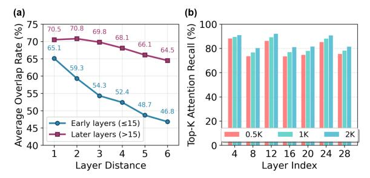
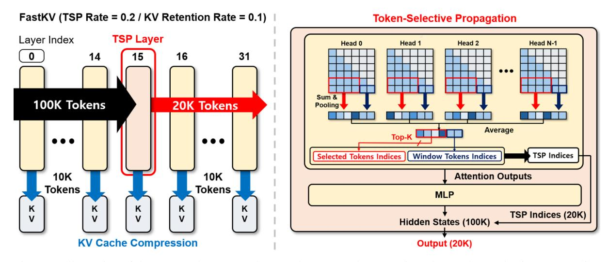
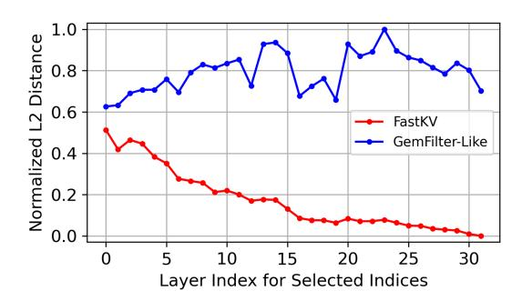

## FastKV: Decoupling of Context Reduction and KV Cache Compression for Prefill-Decoding Acceleration

Dongwon Jo1\*, Jiwon Song1\*, Yulhwa Kim2 , Jae-Joon Kim1 1Seoul National University, 2Sungkyunkwan University {dongwonjo,jiwon.song,kimjaejoon}@snu.ac.kr yulhwakim@skku.edu

## Abstract

While large language models (LLMs) excel at handling long-context sequences, they require substantial prefill computation and keyvalue (KV) cache, which can heavily burden computational efficiency and memory usage in both prefill and decoding stages. Recent works that compress KV caches with prefill acceleration reduce this cost but inadvertently tie the prefill compute reduction to the decoding KV budget. This coupling arises from overlooking the layer-dependent variation of critical context, often leading to accuracy degradation. To address this issue, we introduce FastKV, a KV cache compression framework designed to reduce latency in both prefill and decoding by leveraging the stabilization of token importance in later layers. FastKV performs full-context computation until a Token-Selective Propagation (TSP) layer, which forwards only the most informative tokens to subsequent layers. From these propagated tokens, FastKV independently selects salient KV entries for caching, thereby decoupling KV budget from the prefill compute reduction based on the TSP decision. This independent control of the TSP rate and KV retention rate enables flexible optimization of efficiency and accuracy. Experimental results show that FastKV achieves speedups of up to 1.82× in prefill and 2.87× in decoding compared to the full-context baseline, while matching the accuracy of the decodingonly baselines. Our code is available at [https:](https://github.com/dongwonjo/FastKV) [//github.com/dongwonjo/FastKV](https://github.com/dongwonjo/FastKV).

## 1 Introduction

Large Language Models (LLMs) have rapidly advanced and now support extended context windows of 128K and even beyond one million tokens [\(Achiam et al.,](#page-8-0) [2023;](#page-8-0) [Comanici et al.,](#page-8-1) [2025;](#page-8-1) [Anthropic,](#page-8-2) [2024\)](#page-8-2). This capability significantly enables a broad range of applications for LLMs such

| Method       | Prefill | Decoding | Acc. |
|--------------|---------|----------|------|
| Full-context | Slow    | Slow     | High |
| StreamingLLM | Slow    | Fast     | Low  |
| SnapKV       | Slow    | Fast     | High |
| GemFilter    | Fast    | Fast     | Low  |
| FastKV       | Fast    | Fast     | High |

Table 1: Comparison of KV cache compression methods. FastKV uniquely achieves fast prefill and decoding, and high accuracy simultaneously.

as retrieval-augmented generation, multi-document reasoning, and code generation [\(Yi et al.,](#page-9-0) [2024;](#page-9-0) [Laban et al.,](#page-9-1) [2023;](#page-9-1) [Rando et al.,](#page-9-2) [2025\)](#page-9-2). However, the computational and memory overhead of longcontext inference remains a critical bottleneck.

Long-context inference introduces substantial burdens in both the prefill and decoding stages. In the prefill stage, attention computation scales quadratically with input length, making very long prompts expensive to process. In the decoding stage, the large amount of KV cache becomes the dominant factor, consuming GPU memory and reducing throughput since every generated token must repeatedly access this cache. Together, these trends make inference prohibitively costly: prefill slows down with longer inputs, while decoding efficiency deteriorates as the cache size grows with context length.

Recent studies have explored two complementary directions to overcome these burdens. Most existing KV cache compression methods, such as StreamingLLM [\(Xiao et al.,](#page-9-3) [2023\)](#page-9-3) and SnapKV [\(Li](#page-9-4) [et al.,](#page-9-4) [2024\)](#page-9-4) target the decoding stage, by pruning already-generated KV cache, but do not accelerate the prefill stage at all.

In contrast, GemFilter [\(Shi et al.,](#page-9-5) [2024\)](#page-9-5) and PyramidInfer [\(Yang et al.,](#page-9-6) [2024a\)](#page-9-6) focus on the prefill stage, aiming to reduce the quadratic cost of processing long prompts by generating KV cache of only critical tokens. Despite these advances, a fundamental trade-off remains: decoding-

\*Equal Contribution

focused approaches fail to alleviate the prefill burden, whereas prefill-focused methods compromise accuracy when the KV budget is reduced to levels that would significantly accelerate decoding.

To bridge this gap, we propose FastKV, a KV cache compression framework that accelerates prefill and decoding stages without compromising accuracy. FastKV is motivated by two key observations: (i) during prefill, early layers must propagate the full-context so that later layers retain the opportunity to attend to any part of the context; (ii) however, during decoding, each layer ultimately attends to only a small fraction of the prefilled tokens, meaning that it is unnecessary to retain the entire KV cache built during prefill.

Building on these insights, FastKV introduces two techniques. First, we adopt a two-stage prefill strategy that retains the full-context in early layers while context usage remains unstable, and, once stabilization becomes evident, switches to propagating only salient tokens in later layers. Second, we decouple the KV budget to separate the context processed during prefill from the amount of KV cache retained for decoding.

As summarized in Table [1,](#page-0-0) these techniques address the prefill–decoding trade-off by performing context reduction at the right time and preserving only critical KV caches for decoding, achieving up to 1.82× faster prefill and up to 2.87× faster decoding compared to the full-context baseline, while maintaining accuracy drop within 1% on Long-Bench benchmark.

## 2 Background

#### 2.1 Bottlenecks of Long-context Inference

Auto-regressive LLM inference consists of two stages: prefill and decoding stage.

- In the prefill stage, the model processes the entire input prompt and builds the KV cache across all layers. The computational cost of attention in this stage scales quadratically with the input length.
- In the decoding stage, the model generates tokens auto-regressively while reusing the KV cache. Here, the per-step attention cost is only linear in the number of cached tokens, but the cache itself grows linearly with input length and must be repeatedly accessed at every step.

When the context is short, these costs are manageable. However, as context length increases, both

stages become severe bottlenecks: Prefill latency explodes as the context length increases due to quadratic attention, and the decoding latency deteriorates as the linearly growing KV cache must be repeatedly accessed at every step, creating significant memory bandwidth overhead.

#### 2.2 Prior Approaches and Limitations

A large body of work has explored KV cache compression to alleviate the burden of long-context inference. Early efforts such as StreamingLLM [\(Xiao](#page-9-3) [et al.,](#page-9-3) [2023\)](#page-9-3) exploit the observation of attention sink tokens, retaining only those sink tokens together with the most recent context in the KV cache. Building on this idea, SnapKV and H2O [\(Li et al.,](#page-9-4) [2024;](#page-9-4) [Zhang et al.,](#page-10-0) [2023\)](#page-10-0) introduced attentionbased importance metrics to retain only salient tokens, thereby reducing the KV cache more selectively. Subsequent studies [\(Feng et al.,](#page-8-3) [2024;](#page-8-3) [Fu](#page-9-7) [et al.,](#page-9-7) [2024;](#page-9-7) [Cai et al.,](#page-8-4) [2024\)](#page-8-4) further refined this direction by assigning fine-grained KV budgets at the head or layer level, aiming to preserve accuracy. However, these methods provide at best marginal accuracy improvements over SnapKV, while leaving the fundamental bottleneck unsolved: they still require producing the KV cache for the full-context before selecting which tokens to retain, so prefill latency remains unreduced.

In contrast, prefill-aware KV cache compression methods have emerged. Instead of processing all tokens during prefill, they attempt to accelerate inference by reducing the effective context length up front. For example, GemFilter [\(Shi et al.,](#page-9-5) [2024\)](#page-9-5) leverages pre-defined filter layer's attention to select a compact subset of input tokens, while PyramidInfer [\(Yang et al.,](#page-9-6) [2024a\)](#page-9-6) exploits cross-layer redundancy to gradually reduce the hidden states propagated to subsequent layers. These approaches naturally produce a smaller KV cache, yielding both prefill and decoding speedups. Nevertheless, they suffer from inherent trade-offs: GemFilter enforces the same reduced set of tokens across all subsequent layers, discarding potentially useful information for deeper processing, while PyramidInfer, though layer-aware, still prunes aggressively from early layers, both of which compromise accuracy. Moreover, in these designs, the KV cache compression is tightly coupled with the amount of prefill compute reduction: achieving sufficient decoding acceleration requires aggressive context pruning, which simultaneously amplifies accuracy degradation. Importantly, this fragility is not due

Figure 1: (a) Early layers exhibit unstable context focus, reflected by low critical token overlap. (b) Attention distributions are sparse, with Top-K tokens dominating the scores.

to a tighter memory budget; prefill-aware schemes drop tokens on the fly, blocking later layers from attending to them and thus degrading accuracy. The drawbacks of existing prefill-aware KV cache compressions are further discussed in Appendix [B.2.](#page-12-0)

These limitations suggest that existing methods are inherently constrained by conflating KV cache compression with prefill compute reduction into a single stage, and a more balanced approach is needed to jointly optimize prefill and decoding efficiency.

## 3 Motivations

#### 3.1 Layer-dependent Context Dynamics

A key challenge in reducing prefill latency is to determine when to shrink the amount of context processed at each layer. Existing approaches present two contrasting strategies: GemFilter processes the context up to the filter layer to select salient tokens and restart the prefill stage with the selected tokens, while PyramidInfer gradually reduces the context size layer by layer.

In both methods, even early layers lose the opportunity to access full-context of the tokens. They do not directly examine how the selection of critical tokens evolves across layers, and to what extent early pruning may disrupt later layers' ability to attend to their eventual targets. To answer this question, we analyze how the layer-wise critical tokens changes as depth increases.

We feed a 128K-token input into LLaMA-3.1- 8B-Instruct and, at each layer, collect the top-512 critical tokens that receive the highest average attention mass across heads. We then calculate the average overlap ratio of these critical token indices between layers as the layer distance increases. Figure [1\(](#page-2-0)a) presents the results. In the early layers (≤15), the overlap ratio drops sharply with increasing layer distance, indicating that the critical tokens

perceived by each layer shift sharply. In contrast, in the later layers (>15), the overlap decays much more slowly, suggesting that the same subset of tokens remains consistently important across multiple successive layers.

These observations highlight the difference in context utilization across layers. In the early layers, attention focus is highly unstable, and pruning tokens at this stage irreversibly remove tokens that later layers would otherwise consider critical. Once discarded, these tokens cannot be recovered, causing downstream layers to lose access to potentially indispensable context and leading to severe performance degradation. In contrast, in the later layers, the set of critical tokens shows a high degree of overlap across layers, so aggressive token pruning can be applied with minimal impact on the model accuracy. This layer-dependent context dynamic implies that token pruning during the prefill stage must process the full-context in early layers, and then transition to selective context propagation in later layers.

#### 3.2 Sparse Context Utilization Across Layers

The results of Section [3.1](#page-2-1) suggest that early layers must be allowed to process the full-context during prefill so that later layers do not lose access to potentially critical tokens. However, this does not imply that each layer has to cache all of the KV values that it generated. To investigate what fraction of the context is actually used during decoding, we measure the top-K attention recall: the proportion of total attention mass covered by the K most attended tokens at each layer.

As shown in Figure [1\(](#page-2-0)b), across all layers of LLaMA-3.1-8B-Instruct with 128K input tokens, only a sparse subset of tokens dominates the attention distribution. Even with K = 512 (0.38% of entire tokens), the majority of the attention mass is already captured. This indicates that all layers only rely on a small subset of tokens once decoding begins.

This phenomenon of sparse utilization is consistent with results from prior works on KV cache compression during decoding stage, such as SnapKV and H2O. These studies have demonstrated that KV cache compression can be highly effective because only a small fraction of tokens are actively used during decoding.

Overall, our analysis suggests that the early layers require careful management of KV values. In the prefill stage, the full-context must be processed

Figure 2: Illustration of the proposed FastKV scheme. The proposed FastKV introduce Token-Selective Propagation approach to selectively propagate only a limited set of tokens while effectively compressing KV cache.

to provide subsequent layers with complete contextual information. However, the model can cache only a small subset of generated tokens, as the decoding stage depends on only a small fraction of the prefill context.

## 4 Proposed FastKV

#### 4.1 Overview of FastKV

The overall workflow of FastKV is illustrated in Figure [2.](#page-3-0) FastKV accelerates long-context inference by rethinking how much context is propagated during prefill and how much KV cache is retained during decoding. FastKV introduces two complementary innovations:

- Token-Selective Propagation (TSP). A dedicated TSP layer, placed around the middle of the decoder, forwards only a selected subset of hidden states to later layers rather than propagating the entire prompt. This reduces the context passed downstream while keeping critical information intact.
- Layer-wise KV retention. During prefill, each layer independently discards less influential entries and preserves only a specified retention rate of its KV cache. After prefill, every layer thus maintains a compressed KV cache, which significantly accelerates decoding without degrading accuracy.

By allowing early layers to process the full-context before compression, FastKV ensures that they can freely identify the tokens to retain, while later layers, which tend to converge on similar subsets, remain robust even when operating on reduced context. This design allows every layer to carry a compressed but meaningful KV cache into decoding.

Compared to prior work, FastKV avoids the rigid constraints of GemFilter and PyramidInfer. GemFilter enforces a single layer's token selection across all layers, which is particularly harmful to early layers where each layer attends to different subsets of tokens. PyramidInfer reduces context from the very first layers, limiting the flexibility of each layer to select its own important tokens. Furthermore, both methods couple prefill compression with the decoding KV budget, whereas FastKV decouples them, enabling independent control of how much context is propagated during prefill and how much KV is preserved for decoding. This flexibility yields a superior accuracy–efficiency trade-off.

## 4.2 Two-stage Prefill with Token-Selective Propagation

As shown in Section [3.1,](#page-2-1) the set of critical tokens fluctuates substantially in the early layers but stabilizes in later layers. This observation motivates a two-stage prefill strategy: using full-context computation in the early layers to capture diverse token dependencies, and then reducing the context in subsequent layers once token importance has stabilized.

To implement this, FastKV introduces a dedicated TSP layer. In this layer, each token is evaluated by how strongly it is attended by the recent window tokens, which serve as queries. Specifically, for each token i, its saliency score S is computed by averaging attention weights over all heads when queried from the window tokens:

$$S_i^{l,h} = \text{Pooling}(\sum_{n=0}^{N_{\text{obs}}} Att_l[h, N_I - n, i + m])$$
 (1)

$$S_i^{TSPlayer} = \frac{1}{H} \sum_{h=0}^{H-1} S_i^{TSPlayer,h}, \qquad (2)$$

Here,  $S_i^{l,h}$  is the saliency score of i-th token in h-th attention head of the l-th layer.  $Att_l$  denotes the attention score matrix of l-th layer, while  $N_I$  and  $N_{obs}$  indicate the number of tokens in the input prompt and the window token size, respectively. H denotes the number of attention heads in each layer. Since compressing the layer output requires a single index set, we average the attention weights to calculate a score  $S_i^{TSPlayer}$  that represents the saliency of tokens at the layer level, as outlined in Equation 2.

Based on these saliency scores, indices of the top-ranked tokens up to the predefined TSP rate are selected. Crucially, all window tokens themselves are always included in the propagated set, and their indices are merged with the saliency-selected ones to form the final TSP token set passed to the next layer.

Prefill therefore proceeds in two distinct stages. In the first stage, from the input up to the TSP layer, all layers process the full-context and construct their compressed KV caches. In the second stage, starting at the TSP layer, only the reduced subset of saliency-selected tokens (together with all window tokens) continues forward, and later layers process this compressed context to form their compressed KV caches.

By applying Token-Selective Propagation only after stabilization, FastKV preserves the heterogeneous attention patterns of early layers while still reducing prefill latency in later layers.

#### 4.3 Impact of TSP and TSP Layer Selection

We first investigate the effect of applying Token-Selective Propagation (TSP) at different layers. For each candidate TSP layer, we compute the final logits and compare them against those obtained from the full-context baseline. Figure 3 reports the normalized L2 distance between the two outputs for LLaMA-3.1-8B-Instruct.

We also include a GemFilter-like strategy as a baseline, where a single filter layer selects a subset of tokens and then the model is re-prefilled using only this subset. This procedure forces even

Figure 3: Comparison of normalized L2 distances between hidden states generated by the full-context baseline. TSP, and GemFilter-like methods.

the early layers, which normally attend to distinct tokens, to process the same limited token set, resulting in significant deviations in the final logits.

In contrast, TSP preserves full-context processing before the TSP layer, so each early layer can still attend to its own preferred subset of tokens. As a result, when the TSP layer is placed at the middle or later part of the model, the logits remain much closer to the full-context baseline than those produced by GemFilter, as shown in Figure 3.

If the TSP layer is placed too early, token selection becomes overly restricted and the resulting logits deviate substantially from the full-context baseline. If it is placed too late, many layers still process the full-context and prefill latency reduction is limited. Therefore, selecting the TSP layer at the right position is critical, which we formalize as follows:

$$L_{TSP} = \underset{L \le L_{\text{max}}}{\operatorname{argmin}} \frac{1}{N} \sum_{i=1}^{N} \left\| \mathbf{H}_{i} - \mathbf{H}'_{L,i} \right\|_{2}^{2}, \quad (3)$$

where  $\mathbf{H}_i$  denotes the hidden state at the final layer under full-context for the *i*-th calibration input, and  $\mathbf{H}'_{L,i}$  the corresponding hidden state when TSP is applied at candidate layer L.

The criterion searches for the earliest layer whose output remains close to the full-context baseline, while constraining  $L \leq L_{\rm max}$  to avoid excessively late placement. This ensures that the chosen TSP layer simultaneously minimizes model degradation and provides tangible prefill latency savings.

