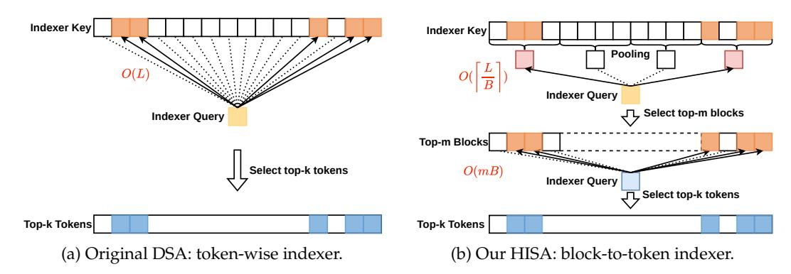

# **2 Related Work**

**Block sparse attention.** Block sparse attention partitions sequences into fixed-size blocks and restricts computation to selected blocks, mapping naturally to GPU tiled matrix multiplications. This design is hardware-friendly, but all tokens within a block must be retained or discarded together. Among training-free methods, MInference [\(Huiqiang et al.,](#page-9-11) [2024\)](#page-9-11) profiles each head offline and assigns one of several sparse patterns at inference time; FlexPrefill [\(Lai et al.,](#page-9-12) [2025\)](#page-9-12) estimates block scores online and selects blocks by a cumulativeattention threshold; XAttention [\(Xu et al.,](#page-10-3) [2025\)](#page-10-3) uses antidiagonal sums as an O(*B*) proxy for block importance; and SpargeAttention [\(Zhang et al.,](#page-10-4) [2025\)](#page-10-4) applies a two-stage online filter to skip low-importance regions during matrix multiplication and softmax. Among trainable methods, MoBA [\(Lu et al.,](#page-9-10) [2025\)](#page-9-10) uses mixture-of-experts-style routing over blocks, while NSA [\(Yuan et al.,](#page-10-2) [2025\)](#page-10-2) combines compression, selection, and sliding-window branches to cover different dependency scales. Their common limitation is block granularity: they cannot capture token-level importance differences within a selected block. HISA also introduces a block-level stage, but only as a fast pre-filter before token refinement; its final sparse pattern remains fine-grained and token-wise, as in DSA.

Figure 1: Comparison of the DSA token-wise indexer (left) and our HISA hierarchical block-level coarse filter followed by token-level refinement (right). Both produce the same data structure—a per-query set of *k* token indices—consumed by the downstream Sparse MLA operator.

**Token sparse attention.** Token-level methods offer finer selection but face the challenge of efficient importance estimation. SnapKV [\(Yuhong et al.,](#page-10-5) [2024\)](#page-10-5) uses an observation window at the end of the prompt to select important KV positions for subsequent decoding, but ignores layer- and query-specific variation. KV cache eviction methods—such as H2O [\(Zhang et al.,](#page-10-6) [2024\)](#page-10-6), which combines cumulative attention with recency, and TOVA [\(Oren et al.,](#page-10-7) [2024\)](#page-10-7), which evicts the lowest-scoring cached token under the latest query—maintain a fixed-size cache but irrecoverably lose evicted tokens. LazyLLM [\(Fu et al.,](#page-9-13) [2024\)](#page-9-13) progressively prunes tokens across layers during prefill, so early pruning mistakes cannot be corrected later in the same forward pass. DSA [\(DeepSeek-AI,](#page-9-8) [2025\)](#page-9-8) instead scores every prefix token with a lightweight indexer and selects top-*k* tokens per query, achieving fine-grained sparsity at the cost of O(*L* 2 ) per-layer indexing overhead. IndexCache [\(Bai et al.,](#page-9-14) [2026\)](#page-9-14) reduces this cost by reusing indices across nearby layers, although its benefit depends on cross-layer similarity in sparse patterns.

**Hierarchical sparse attention.** Hierarchical attention dates back to [Yang et al.](#page-10-8) [\(2016\)](#page-10-8), who introduced a two-tier word-and-sentence network for document classification. Among recent sparse methods, NSA [\(Yuan et al.,](#page-10-2) [2025\)](#page-10-2) and InfLLM-V2 [\(Zhao et al.,](#page-10-9) [2026\)](#page-10-9) can both be viewed as two-level designs: they score block-level summaries globally and activate finer-grained sparse attention only within selected blocks. Twilight [\(Lin et al.,](#page-9-15) [2025\)](#page-9-15) uses quantized keys for coarse scoring and then applies hierarchical top-*p* pruning, while Double-P [\(Ni et al.,](#page-10-10) [2026\)](#page-10-10) clusters the KV cache, scores cluster centroids, refines computation within selected clusters, and approximates low-score clusters with their centroids. HISA follows the same coarse-to-fine spirit but with a different goal: it combines a hardware-friendly block-level indexer with a fine-grained token-level indexer to accelerate DSA, achieving both high efficiency and strong selection quality on DeepSeek-V3.2 and GLM-5.

