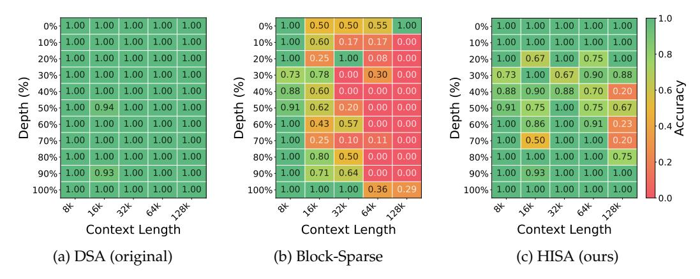
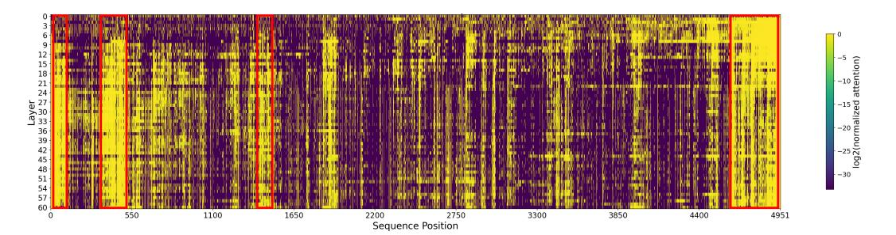
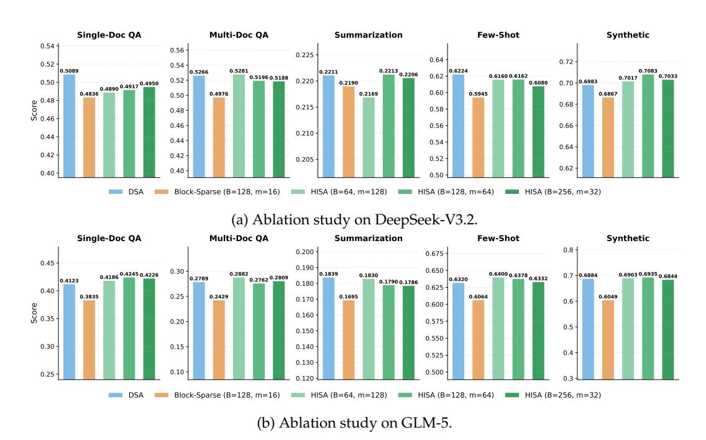

# **3 Preliminary**

We briefly review DeepSeek Sparse Attention (DSA) as used in DeepSeek-V3.2 [\(DeepSeek-](#page-9-8)[AI,](#page-9-8) [2025\)](#page-9-8). DSA consists of two components: a **token-wise Indexer** and **Sparse MLA**.

**Indexer in DSA.** Let *L* denote the causal prefix length for a query position *t*. The indexer maintains lightweight indexing keys **k** *I s* , indexing queries **q** *I t*,*j* for *HI* indexing heads, and per-head gating weights *w I t*,*j* . The relevance score between query *t* and key *s* is defined as

$$I_{t,s} = \sum_{j=1}^{H^I} w_{t,j}^I \cdot \text{ReLU}\left(\mathbf{q}_{t,j}^I \cdot \mathbf{k}_s^I\right). \tag{1}$$

The indexer then selects the top-k token indices,

$$\mathcal{T}_t = \text{TopK}(I_{t,:}, k), \tag{2}$$

which are passed to the downstream Sparse MLA operator. Since the scoring cost for each query is  $\mathcal{O}(L)$  over the full prefix, the total cost across all queries in a layer is  $\mathcal{O}(L^2)$ .

**Sparse MLA** in **DSA**. Following the DeepSeek-V3.2 design, Sparse MLA adopts the MQA mode of MLA, in which each token stores a single latent key–value entry shared across all query heads for efficiency. Let  $\mathbf{c}_s$  denote the latent MLA entry associated with token s. Given the selected token set  $\mathcal{T}_t$ , Sparse MLA computes attention for query token t only over the selected latent entries, rather than over the full prefix:

$$\mathbf{u}_t = \operatorname{Attn}(\mathbf{h}_t, \{\mathbf{c}_s \mid s \in \mathcal{T}_t\}). \tag{3}$$

As a result, the main attention cost is reduced from dense  $\mathcal{O}(L^2)$  to sparse  $\mathcal{O}(Lk)$ . For our purposes, the key observation is that the interface between the two components is precisely the selected token set  $\mathcal{T}_t$ : HISA replaces only the indexer search path, while leaving the downstream Sparse MLA operator unchanged.

## 4 Method

## 4.1 HISA: Hierarchical Indexed Sparse Attention

As shown in Figure 1, HISA replaces the flat prefix scan with a two-stage coarse-to-fine search. The final output remains an identical per-query token set  $\mathcal{T}_t^H$  of size k, consumed by the original Sparse MLA operator.

**Block partitioning and pooled keys.** The prefix tokens of length L is partitioned into  $M = \lceil L/B \rceil$  contiguous, causally valid blocks  $\mathcal{B}_1, \mathcal{B}_2, \dots, \mathcal{B}_M$ , where B is the block size. For each block, a representative key is constructed via mean pooling over its indexing keys:

$$\tilde{\mathbf{k}}_b^I = \text{Pool}\left(\left\{\mathbf{k}_s^I \mid s \in \mathcal{B}_b\right\}\right). \tag{4}$$

These representative keys serve exclusively as coarse-grained proxies for block-level scoring and leave both the token-level indexing keys consumed by the second stage and the KV states consumed by Sparse MLA unchanged, thereby making HISA a plug-and-play replacement. In practice, these representative keys can be incrementally maintained alongside the KV cache with negligible overhead.

**Stage 1: Block-level coarse filtering.** For query position t, HISA reuses the same indexing query representations  $\mathbf{q}_{t,j}^{I}$  and gating weights  $w_{t,j}^{I}$  as DSA, but scores the **pooled representative keys** instead of individual token keys:

$$J_{t,b} = \sum_{j=1}^{H^I} w_{t,j}^I \cdot \text{ReLU}\left(\mathbf{q}_{t,j}^I \cdot \tilde{\mathbf{k}}_b^I\right). \tag{5}$$

The top-*m* blocks are selected:

$$C_t = \text{TopK}(J_{t,:}, m), \tag{6}$$

and the candidate token set is the union of all tokens in the selected blocks:

$$\Omega_t = \bigcup_{b \in \mathcal{C}_t} \mathcal{B}_b. \tag{7}$$

All block selections strictly respect the causal mask: only blocks that precede the query position t, together with the block containing position t, are considered eligible. Following MoBA (Lu et al., 2025), the first and the last blocks are **always** included in  $\mathcal{C}_t$ , as they contain the attention sink and local contexts. This forced inclusion also simplifies boundary handling during batched prefill with packed sequences of varying lengths, where a single block may straddle the boundary between two sequences.

(a) Budget = 8192 (b) Compression Ratio = 4:1

Figure 2: Latency comparison of the indexer kernel between the original DSA (flat token scan) and HISA (hierarchical block-to-token indexing). In the left panel, the block size is fixed to B = 128 and the maximum number of selected blocks is set to top-m = 64. In the right panel, the block size is also fixed to B = 128, while the number of selected blocks is adjusted for each sequence length to maintain a fixed compression ratio of M: m = 4:1.

**Stage 2: Token-level refinement.** Within the selected candidate set  $\Omega_t$ , the token-level indexer computes scores using the same scoring mechanism as in the original DSA (Eq. 1):

$$I_{t,s} = \sum_{j=1}^{H^I} w_{t,j}^I \cdot \text{ReLU}\left(\mathbf{q}_{t,j}^I \cdot \mathbf{k}_s^I\right), \quad s \in \Omega_t.$$
 (8)

Then the top-*k* tokens are selected as final tokens:

$$\mathcal{T}_t = \text{TopK}(\{I_{t,s} \mid s \in \Omega_t\}, k). \tag{9}$$

To ensure that the candidate pool is sufficiently large to select k tokens, the feasibility constraint  $mB \ge k$  must be satisfied. Given the selected token set  $\mathcal{T}_t$ , sparse MLA is executed following the same computation as in the original DSA. Algorithm 1 provides the complete pseudocode for the HISA indexer.

**Boundary behavior.** Three regimes arise depending on the relationship between the effective prefix length t, the candidate capacity mB, and the budget k:

- When  $t \le k$ , all prefix tokens are selected and HISA is equivalent to dense attention.
- When  $k < t \le mB$ , the coarse filter selects all blocks (since  $m \ge M$ ), and Stage 2 reduces the set to k tokens. HISA is equivalent to the original DSA indexer.
- When t > mB, the coarse filter performs non-trivial block pruning, activating HISA's hierarchical advantage, which becomes increasingly pronounced as the sequence length grows.

The third regime is precisely the long-context setting where HISA provides its efficiency gains.

#### 4.2 Complexity Analysis

Assuming that the pooled representative keys are maintained incrementally, the per-query indexing cost of HISA consists of scoring  $\lceil L/B \rceil$  block representatives (Stage 1) and scoring at most mB candidate tokens (Stage 2):

$$\mathcal{O}\left(\frac{L}{B} + mB\right). \tag{10}$$

Summing over all *L* queries within a layer yields:

$$\mathcal{O}\left(\frac{L^2}{B} + LmB\right),\tag{11}$$

Figure 3: Needle-in-a-Haystack retrieval accuracy heatmaps for DeepSeek-V3.2 under three indexing strategies. The *x*-axis denotes the context length (8K–128K), and the *y*-axis denotes the needle depth (0%–100%). Shades closer to green indicate higher retrieval accuracy.

compared to  $\mathcal{O}(L^2)$  for the original DSA indexer. The design introduces a clear trade-off: larger B reduces the cost of coarse-filtering stage but makes each block a coarser proxy; smaller m improves efficiency but increases the risk of missing relevant blocks. When  $m \ll M$  and  $B \ll L$ —the regime of ultra-long contexts with a selective coarse filter—the reduction is substantial. Conversely, as m approaches M, HISA degrades gracefully toward the DSA baseline.

As modern LLMs increasingly adopt context windows of 128K or even 1M tokens to support advanced agent capabilities and native multimodal reasoning, HISA's asymptotic advantage translates directly into practical speedups.

## 5 Experiments

We evaluate HISA along five axes: (1) kernel-level latency, (2) retrieval accuracy on Needle-in-a-Haystack, (3) downstream task performance on LongBench, (4) visualization of attention scores, and (5) hyperparameter sensitivity. Throughout the evaluation, we compare three indexing strategies:

- **DSA (original)**: the full-prefix token-level indexer as described in Section 3.
- **Block-Sparse**: a block-level-only baseline that selects top-*m* blocks and attends to all tokens within those blocks (i.e., Stage 1 only, without token-level refinement).
- **HISA**: the hierarchical block-to-token indexer proposed in this work.

Both HISA and Block-Sparse are *training-free*: they are applied at inference time by replacing the indexer module, with no fine-tuning or architectural modification.

#### 5.1 Kernel-Level Speedup

Figure 2 compares the indexer kernel latency of the original DSA and HISA across context lengths from 8K to 64K tokens. Both implementations use TileLang (Wang et al., 2025) kernels, with DSA following the official reference implementation. The HISA kernel is decomposed into two stages: block-level filtering and token-level refinement within the selected candidate blocks. The configuration is as follows: query lens = 1024, final top-k = 2048 tokens, block size B = 128, and two choices for the maximum number of selected blocks. All comparisons are conducted on an NVIDIA A100 GPU. These results are measured at the *indexer kernel* level and do not directly reflect end-to-end serving throughput,

1https://github.com/tile-ai/tilelang/tree/main/examples/deepseek\_v32

which also depends on the sparse MLA operator, KV cache management, and other system components.

With 2048 selected tokens, the sparse MLA operator consistently costs about 1.6 ms, while the indexer reaches 5.6 ms at 64K context length. This suggests that the main performance bottleneck in DSA lies in the indexer rather than in sparse MLA itself. Accordingly, we restrict the comparison to indexer overhead. At 64K context length, HISA delivers an approximately  $2.16\times$  speedup with a 4:1 first-stage compression ratio (corresponding to a 16K candidate budget), and up to  $3.75\times$  speedup under a fixed 8K budget. Although HISA adds a block-level filtering stage, this stage operates only on pooled block summaries of size  $\lceil L/B \rceil$ , which is far smaller than the full token sequence. Moreover, under a fixed 8K budget, the second-stage cost remains nearly constant because both the input and output lengths are fixed, making the computation graph easier to optimize and further improving inference speed.

## 5.2 Needle-in-a-Haystack

The Needle-in-a-Haystack (NIAH) test (Kamradt, 2023) evaluates a model's ability to retrieve a specific fact (the "needle") embedded at a controlled position within a long distractor context (the "haystack"). We evaluate DeepSeek-V3.2 with its original DSA indexer replaced by HISA (4:1 ratio) and block indexer, without any additional training, over context lengths ranging from 8K to 648K tokens and needle insertion depths ranging from 0% (beginning) to 100% (end).

Figure 3 presents the retrieval accuracy heatmaps. The original DSA achieves near-perfect retrieval across all context lengths and needle positions (Figure 3a). HISA closely matches this performance (Figure 3c), with only marginal degradation at extreme lengths and depths, suggesting that the our HISA rarely discards blocks containing the target information. In contrast, the Block-Sparse baseline (Figure 3b) exhibits noticeable accuracy degradation, particularly when the needle is located in the middle of the context where block-level selection is least reliable. This result underscores the value of hierarchical selection. Block-sparse methods often waste budget on unimportant tokens within selected blocks while overlooking truly critical tokens. HISA, in contrast, refines the selection at the token level after block retrieval, allowing it to preserve important tokens more accurately and achieve efficient token-wise sparsity.

#### 5.3 LongBench Evaluation

LongBench (Bai et al., 2024) is a comprehensive benchmark for long-context understanding, covering single-document QA, multi-document QA, summarization, few-shot learning, and synthetic retrieval tasks. We evaluate DeepSeek-V3.2 (DeepSeek-AI, 2025) and GLM-5 (GLM-5-Team, 2026) under three configurations: the original DSA indexer, HISA, and Block-Sparse Attention. For a fair comparison, all three configurations ultimately retain 2048 tokens for computation. Specifically, Block-Sparse Attention directly selects 16 blocks of size 128 (i.e.,  $128 \times 16 = 2048$  tokens). HISA first selects 64 blocks of size 128 (i.e.,  $128 \times 64 = 8192$  tokens), and then further refines them through token-level selection to 2048 tokens.

Table 1 summarizes the results. Across both models and all task categories, HISA achieves performance very close to that of the original DSA. Notably, HISA consistently surpasses DSA on the Synthetic tasks, and on GLM-5 it even attains a higher average score. By contrast, the Block-Sparse baseline, which does not include token-level refinement, exhibits a substantially larger performance gap. This is particularly apparent on the Synthetic tasks for GLM-5, where its score declines by 8.35%.

#### 5.4 Visualization of Attention Scores

To analyze the structural properties of attention in long-context generation, we conduct a visualization study on a representative sample from the code task of LongBench. We generate the first output token using DeepSeek-V3.2 and extract the full attention distributions

Table 1: LongBench results for DeepSeek-V3.2 and GLM-5 under different indexing strategies. All sparse methods are applied at inference time without additional training. Scores are averaged across sub-tasks within each category. Task abbreviations: **SQA** = Single-Document QA, **MQA** = Multi-Document QA, **Sum** = Summarization, **FS** = Few-shot Learning, **Syn** = Synthetic Retrieval, **Code** = Code Completion.

| Model         | Indexer              | SQA                      | MQA                      | Sum                     | FS                       | Syn                            | Code                                  | Avg.                                      |
|---------------|----------------------|--------------------------|--------------------------|-------------------------|--------------------------|--------------------------------|---------------------------------------|-------------------------------------------|
| DeepSeek-V3.2 | DSA Block HISA | <b>50.89</b> 48.36 49.17 | <b>52.66</b> 49.76 51.96 | 22.11 21.90 22.13 | <b>62.24</b> 59.45 61.62 | 69.83 68.67 <b>70.83</b> | 48.56 <b>49.09</b> <u>48.99</u> | <b>51.05</b>   49.54   <u>50.78</u> |
| GLM-5         | DSA Block HISA | 41.23 38.35 42.45  | 27.89 24.29 27.62  | 18.39 16.95 17.90 | 63.20 60.64 63.78  | 68.84 60.49 <b>69.35</b> | 56.53 55.29 <b>56.79</b>        | 46.01 42.67 46.32                   |

Figure 4: Visualization of Attention Distribution.

at each layer. We visualize the attention weights over all context tokens as a 2D heatmap, where the x-axis denotes token positions and the y-axis denotes layer indices.

The visualization reveals a pattern: tokens with high attention weights tend to form contiguous spans rather than appearing as isolated points in a considerable number of tasks. These high-density regions often correspond to semantically coherent segments (e.g.,code blocks,mathematical formulas and derivations) and persist across multiple layers. Outside these spans,attention scores are negligible. This observation suggests that attention mass may be naturally concentrated in block-wise regions. Therefore,block-level sparsification can retain most of the informative attention distribution while avoiding the fine-grained selection overhead of token-wise top-k methods. The results provide empirical support for the two-stage hierarchical structure of HISA.

#### 5.5 Hyperparameter Sensitivity

We investigate the sensitivity of HISA to its two key hyperparameters—block size B and block-level top-m—by comparing three HISA configurations that share the same candidate pool size, mB = 8192, but different coarse-to-fine trade-offs: (B=64, m=128), (B=128, m=64), and (B=256, m=32). We further include the original DSA as an upper bound and Block-Sparse (B=128, m=16) as a lower bound. All configurations use k=2048 for the final token selection. Results are evaluated on DeepSeek-V3.2 and GLM-5 across five LongBench task categories.

Figure 5 reveals several key findings. First, all three HISA configurations closely track DSA performance across all five task categories. This result confirms that our two-stage hierarchical indexer recovers nearly the same set of important tokens as the exhaustive flat scan. Second, among the three HISA variants, the intermediate configurations (B=64 and B=128) perform better than B=256. This suggests that finer-grained selection is important for accurately identifying the most relevant tokens. Third, Block-Sparse consistently underperforms all HISA configurations. This gap underscores the importance of token-level

Figure 5: LongBench scores under different indexer configurations. All three HISA variants use a candidate token pool of size mB = 8192 and a final token budget of k=2048, with different choices of block size B and block-level top-m. The Block-Sparse baseline uses B=128 and m=16, corresponding to a candidate pool of 2048 tokens and no token-level refinement.

refinement: even under the same block-level selection mechanism, the ability to prune low-relevance tokens *within* selected blocks yields measurable quality gains.

### 6 Conclusion and Future Directions

To address the emerging bottleneck caused by the  $O(L^2)$  complexity of the DSA indexer, we propose HISA, a hierarchical indexing approach. Specifically, HISA first uses a hardware-friendly block indexer to efficiently filter out a large number of irrelevant tokens, and then applies token-level reranking over the remaining candidates to construct the final cache for sparse attention computation. At the kernel level, HISA delivers a  $3.75\times$  speedup over the DSA kernel. As a plug-and-play module, HISA can directly replace the token indexer in DeepSeek-V3.2 and GLM-5. Without any additional training, it maintains nearly unchanged performance on LongBench. On NIAH, it also performs significantly better than the corresponding block-sparse baseline.

Several avenues remain open: (1) *Reducing information loss in coarse filtering*: the current block-level stage represents each block with a single pooled vector, which can fail when a block crosses a semantic boundary and the pooled representation does not reflect the most important token. Potential mitigations include overlapping blocks, adaptive block boundaries, or replacing mean pooling with max pooling to better preserve salient outlier directions. (2) *Training-aware HISA*: while HISA currently operates as a training-free inference-time replacement, jointly training the block scoring stage may improve the coarse filter's accuracy, particularly for such boundary cases. (3) *End-to-end system integration*: integrating HISA into a full inference serving stack (e.g., with continuous batching and speculative decoding) and measuring throughput and latency under realistic workloads.

