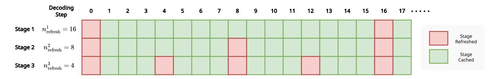
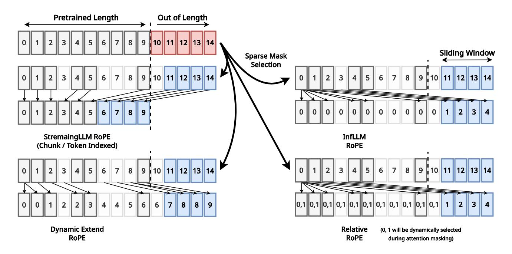
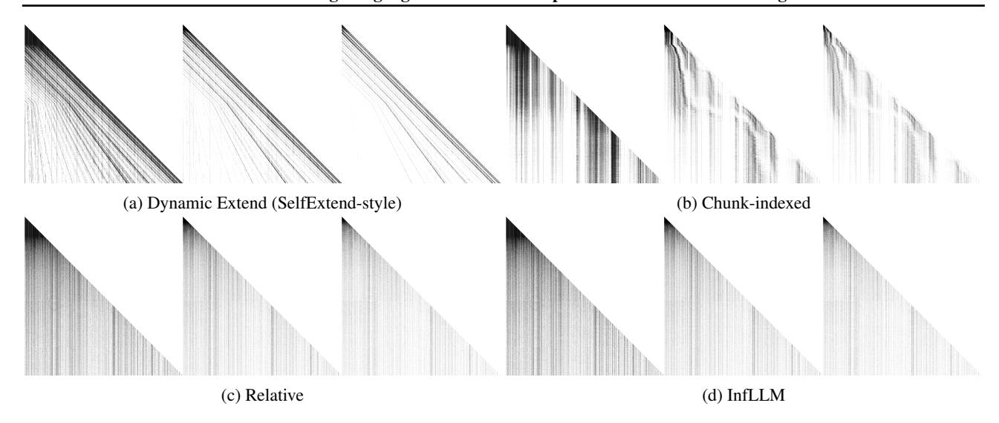
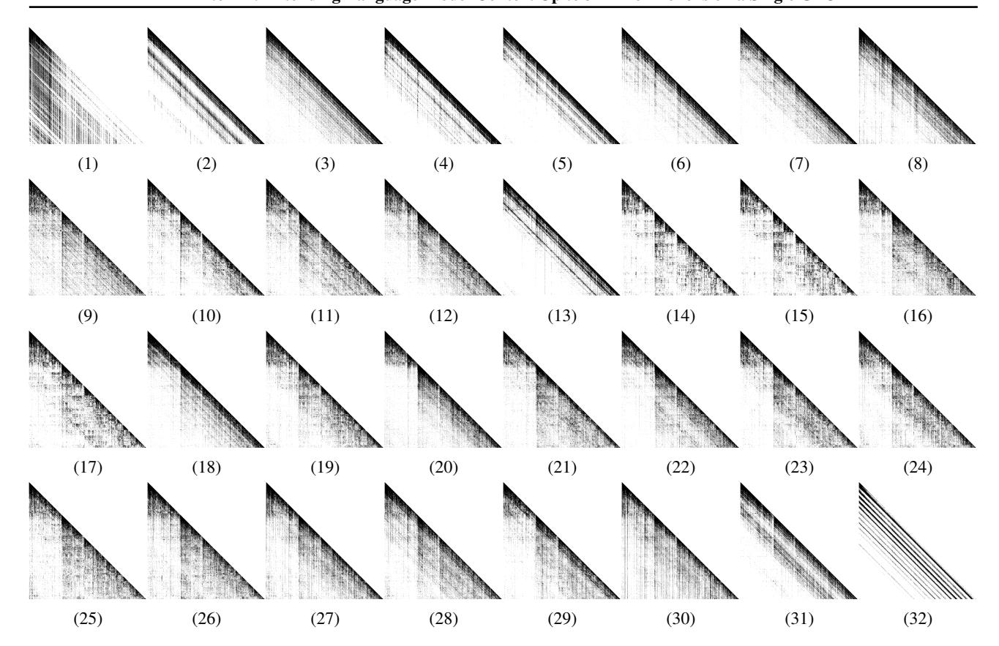
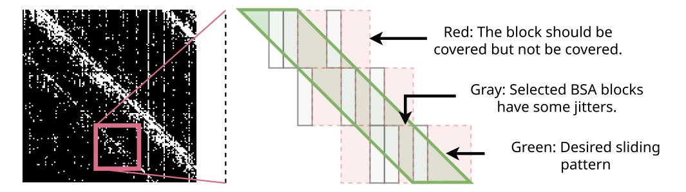

# **Appendices**

#### <span id="page-11-0"></span>A. Complete Description of Algorithms

#### A.1. Context Pruning

We describe our multi-stage context pruning algorithm in Algorithm 1, which uses the pruning stage described in Algorithm 2.

**Multi-stage context pruning.** Our pruning algorithm generates a sparse binary mask M of size  $T_q/b_q \times T_{kv}$  for each attention layer, where  $T_q$  is the length of the queries,  $b_q$  is the size of each query block, and  $T_{kv}$  is the length of the keys. This sparse binary mask can be more efficiently represented in memory with a set of arrays of indices  $\{\mathcal{I}_m\}_{m=1}^{T_q/b_q}$ , where  $\mathcal{I}_m$  contains every integer j such that  $M_{m,j} \neq 0$ .

#### <span id="page-11-1"></span>Algorithm 1 InfiniteHiP Context Pruning Algorithm

```
input Number of pruning stages N, Pruning stages \mathcal{S}^{(1)}, \dots, \mathcal{S}^{(N)}, where each stage \mathcal{S}^{(i)} = (b_q^{(i)}, l_c^{(i)}, k^{(i)}), Query length
       T_q, Key length T_{kv}, Number of sink tokens n_{\text{sink}}, Number of streaming tokens n_{\text{stream}}.
 1: \mathcal{I}_m^{(0)} \coloneqq [n_{\text{sink}}, \dots, b_q^{(1)} \cdot m - n_{\text{stream}}] for m = 1 \dots T_q/b_q^{(1)}. \triangleright Exclude sink and streaming tokens without breaking causality.
 2: for each pruning stage i = 1 ... N do
           for each query block m = 1 ... T_a/b_a^{(i)} do
               \mathcal{I}_m^{\prime(i)} \coloneqq \operatorname{PruningStage}(\mathcal{S}^{(i)}, \mathcal{I}_m^{(i-1)}) if not cached. (Algorithm 2)
               for all m' such that m' = \lceil m \cdot b_q^{(i)}/b_q^{(i+1)} \rceil do
 5:
                    \mathcal{I}_{m'}^{(i)}\coloneqq\mathcal{I}_{m}^{\prime(i)}.
 6:
                                                                                                                                                 Subdivide query blocks for the next stage. Subdivide query blocks for the next stage. Subdivide query blocks for the next stage. Subdivide query blocks for the next stage. Subdivide query blocks for the next stage.
 7:
           end for
 8:
 9: end for
10: return resulting mask indices \mathcal{I}_m^{(N)} for m = 1 ... T_q/b_q^{(N)}.
```

**Pruning stage.** Each pruning stage narrows down the selection of key tokens for a given query block.

## <span id="page-11-2"></span>Algorithm 2 InfiniteHiP Pruning Stage (PruningStage)

```
input Pruning stage S = (b_q, l_c, k), Previous stage's key indices \mathcal{I}_m for the mth query block, Queries Q \in \mathbb{R}^{H \times T_q \times d}, Keys K \in \mathbb{R}^{H \times T_{kv} \times d}, where H is the number of attention heads, T_q and T_{kv} are the number of query and key tokens each, and d is the model dimension, Current layer index l.
```

```
output Filtered key indices \mathcal{I}'_m.
  1: n_{\text{block}} := T_q/b_q.
 2: q_{h,m} \coloneqq Q_{h,m \cdot b_q : (m+1)b_q-1} for h = 1 \dots H.
                                                                                                                           \triangleright Divide the queries into n_{block} blocks for each head.
 3: \tilde{q}_{h,m} := \text{ApplyRopeQ}_l(\tilde{q}_{h,m}).
 4: n_{\text{chunk}} := |\mathcal{I}_m|/l_c.
 5: C_j := [\mathcal{I}_m[j l_c], \dots, \mathcal{I}_m[(j+1)l_c-1]] for j=1 \dots n_{\text{chunk}}.
                                                                                                                                          \triangleright Divide the key indices into n_{chunk} chunks.
 6: for each chunk j = 1 ... n_{chunk} do
          for each head h = 1 \dots H do
 7:
               r_{h,m,j} := \text{SelectRep}(q_{h,m}, \mathcal{C}_j). (Algorithm 3)
 8:
                                                                                                                                   > Select the representative token for this chunk.
 9:
           \mathbf{k}_{h,r_{h,m,j}} \coloneqq \mathsf{ApplyRopeK}_{l,2}(\mathbf{k}_{h,r_{h,m,j}}).
10:
          s_{m,j} \coloneqq \max_{h=1..H,t=1..b_q} \left[ \tilde{\boldsymbol{q}}_{h,m} \right]_t^{\mathsf{T}} \hat{\boldsymbol{k}}_{h,r_{h,m,j}}.
                                                                                                                                   ▶ Compute the estimated chunk attention score.
12: end for
13: \mathcal{T}_m := \arg \operatorname{top}_{k/l_c}(s_{m,j}).
                                                                                                                         Discard chunks with low estimated attention scores.
14: \mathcal{I}'_m := \bigcup_{\hat{\jmath} \in \mathcal{T}} \mathcal{C}_{\hat{\jmath}}.
```

**Representative token selection.** Although largely unchanged from Lee et al. (2024b), we again present the representative token selection (SelectRep) algorithm in Algorithm 3 for completeness. The SelectRep algorithm is designed to approximately estimate the location of the top-1 key token with the highest attention score in the given key chunk, without evaluating all of the keys in the chunk. It runs in  $O(\log_2 l_c)$  time, where  $l_c$  is the key chunk size.

<span id="page-12-0"></span>Algorithm 3 Representative Token Selection (SelectRep) by Hierarchical Top-1 Selection (Lee et al., 2024b)

```
input Query block q \in \mathbb{R}^{b_q \times d}, Indices of key chunk C \in \mathbb{N}^{l_c}, Kevs K \in \mathbb{R}^{T_{kv} \times d}, Current layer index l.
output A representative token index r \in \mathcal{C}.
    1: \tilde{q} := ApplyRopeQ_l(q).
  2: \mathbf{k} := \begin{bmatrix} \mathbf{K}_{\mathcal{C}_1} & \cdots & \mathbf{K}_{\mathcal{C}_{l_c}} \end{bmatrix}^{\mathsf{T}} \in \mathbb{R}^{l_c \times d}.

3: n_{\mathsf{iter}} := \lceil \log_2(l_c) \rceil.

4: (n_{\mathsf{first}}^{(1)}, n_{\mathsf{last}}^{(1)}) := (1, l_c).
                                                                                                                                                                                                                                                                        ▶ Load key tokens with the given indices.
  4: (n_{\text{first}}, n_{\text{last}}) = (1, i_c).

5: for each iteration i = 1 \dots n_{\text{iter}} do

6: m^{(i)} := \lfloor (n_{\text{first}}^{(i)} + n_{\text{last}}^{(i)})/2 \rfloor.

7: \left(\mathcal{B}_1^{(i)}, \mathcal{B}_2^{(i)}\right) := \left((n_{\text{first}}^{(i)} : m^{(i)} - 1), (m^{(i)} : n_{\text{last}}^{(i)})\right).

8: for each branch index j = 1 \dots 2 do

9: Pick the first index r_j^{(i)} from the range \mathcal{B}_j^{(i)}.
                        \tilde{k} \leftarrow \text{ApplyRopeK}_{l,j}(k_{r_i^{(i)}}).
 10:
                            Compute scores \sigma_i^{(i)} := \max_t (\tilde{q}_t^{\mathsf{T}} \tilde{k}).
 11:
 12:
                   \begin{aligned} & t^{(i)} \coloneqq \arg\max_{j} \sigma_{j}^{(i)} \,. \\ & \left(n_{\text{first}}^{(i+1)} : n_{\text{last}}^{(i+1)}\right) \coloneqq \mathcal{B}_{t^{(i)}}^{(i)} \end{aligned}
 13:
                                                                                                                                                                                                                                                                                                                            \triangleright Pick the top-1 index.
 14:
                                                                                                                                                                                                                                                                                                                                             > Update range.
15: end for
16: r := n_{\text{first}}^{(n_{\text{iter}})}
```

The ApplyRopeQ and ApplyRopeK functions used in Algorithms 2 and 3 are defined as follows.

$$ApplyRopeQ_{l}(\boldsymbol{q}) := \begin{cases} ApplyRope(\boldsymbol{q}, \boldsymbol{p}[n_{\text{stream}} + 1]) & \text{if } l > 3 \\ ApplyRope(\boldsymbol{q}, \boldsymbol{p}[\min\{i_{\text{orig}}, l_c + n_{\text{stream}}\}]) & \text{otherwise,} \end{cases}$$
(4)

$$ApplyRopeQ_{l}(\boldsymbol{q}) \coloneqq \begin{cases} ApplyRope(\boldsymbol{q}, \boldsymbol{p}[n_{\text{stream}} + 1]) & \text{if } l > 3 \\ ApplyRope(\boldsymbol{q}, \boldsymbol{p}[\min\{i_{\text{orig}}, l_{c} + n_{\text{stream}}\}]) & \text{otherwise,} \end{cases}$$

$$ApplyRopeK_{l,j}(\boldsymbol{k}) \coloneqq \begin{cases} ApplyRope(\boldsymbol{k}, \boldsymbol{p}[j-1]) & \text{if } l > 3 \\ ApplyRope(\boldsymbol{k}, \boldsymbol{p}[c_{\text{orig}}]) & \text{otherwise,} \end{cases}$$

$$(5)$$

where  $i_{\text{orig}}$  denotes the original position of the given q, and  $c_{\text{orig}}$  denotes the index of the chunk that the given k comes from,  $p_i \in \mathbb{R}^d$  refers to the rotary positional embedding vector for the ith position, and the ApplyRope $(\cdot, p_i)$  function denotes the classic application of RoPE  $p_i$  on the given vector as described in Su et al. (2023). The condition l > 3 is for applying Relative RoPE instead of Chunk-indexed RoPE; See Appendix D for an in-depth explanation of this choice.

Note that the initial pruning stage of InfiniteHiP's context pruning algorithm runs in  $O(T_a T_{kv})$  time, and all subsequent pruning stages run in  $O(T_q)$  time. This makes the initial pruning stage the most expensive one as the number of tokens increases. So, asymptotically, InfiniteHiP's context pruning algorithm has a higher time complexity compared to HiP (Lee et al., 2024b). However, since only two tokens per chunk are accessed and computed at most during the whole process, the SelectRep algorithm can be implemented with a single GPU kernel, without any global synchronizations between each iteration, while providing key sequence dimension parallelism like FlashDecode (Dao et al., 2023) which is not possible in HiP due to internal top-k. This allows InfiniteHiP's context pruning algorithm to run faster in practice with modern GPUs, thanks to its increased parallelism, as shown in Table 3.

Additionally, during decoding, the mask refresh rate of the first pruning stage  $n_{\text{refresh}}^{(1)}$  can be set very high without a significant amount of performance degradation, as shown in Table 2. This reduces the impact of the initial pruning stage's latency to the average latency of the entire token generation process.

#### A.2. Decoding

In Algorithm 4, we show our decoding algorithm complete with our KV offloading mechanism. In Figure 7, we visualize the stage caching mechanism in our decoding algorithm.

#### <span id="page-13-0"></span>**Algorithm 4** InfiniteHiP Decoding Algorithm

```
input The model \mathcal{M}, number of layers L, number of pruning stages N, mask refresh interval n_{\text{refresh}}^i. output Generated sequence y.
```

```
1: Initialize y with an empty sequence.
 2: c^{(i)} \leftarrow 0 for i = 1 ... N.
 3: while generation has not ended do
 4:
       for each layer l = 1 ... L do
           for each stage i = 1 ... N do
 5:
              if (c^{(i)} \mod n_{\text{refresh}}^i) = 0 then
 6:
                 \mathcal{I}^{(l,i)} \leftarrow \text{Run the } i \text{th pruning stage with } \mathcal{I}^{(l,< i)} \text{ and the } l \text{th layer's query and keys with Algorithm 1.}
 7:
                 Obtain a list of GPU cache misses that occurred during the above process.
 8:
              end if
 9:
           end for
10:
           Perform block sparse attention with \mathcal{I}^{(l,N)}.
11:
12:
           Obtain a list of GPU cache misses that occurred during the above process.
           Evict selected cold tokens from the GPU cache, and replace them with the cache misses, depending on LRU policy.
13:
        end for
14:
        Sample a new token and append it to y.
15:
       Increment c^{(i)} \leftarrow (c^{(i)} + 1) \mod n_{\text{refresh}}^{(i)} for i = 1 ... N.
17: end while
```

<span id="page-13-1"></span>

Figure 7. Visualization of Stage Caching During Decoding. The visualized mask refresh interval hyperparameter  $n_{\text{refresh}}^{(1,2,3)} = (16,8,4)$  for simplicity.

## B. Visualization of RoPE Adjustment

<span id="page-14-1"></span>

Figure 8. Visualziation of RoPE Adjustment.

In Figure [8,](#page-14-1) we visualize how we adjust RoPE in more detail. Relative-style RoPE is only used during context pruning because it depends on which branch the token takes during the hierarchical top-1 approximation process. As shown in Table [5,](#page-7-1) four types of RoPE indexing can be used in masking, and three kinds of RoPE indexing in block sparse attention.

## C. Visualization of Each Pruning Stages (Modules)

In Figure [9,](#page-15-0) we visualize the attention mask generated by various RoPE adjustment methods. In SelfExtend-style RoPE, we extend the RoPE depending on the context length. Therefore, some stretching is observed from the right half of the image beyond the pretrained context length limit. In Chunk-indexed RoPE, we observe curved wiggly artifacts in the second and third stages, which is probably caused by the sliding windows. Since the chunk index position of each token is dynamically adjusted by previous stages, the sliding patterns change dynamically depending on the inputs. In Relative- and InfLLM-style RoPE, we observe strong vertical patterns because they rely only on the content information in the key vectors rather than the positional information.

## <span id="page-14-0"></span>D. Discussion on Chunk-indexed RoPE

This section explains the importance of Chunk-indexed RoPE in addressing the challenges posed by dense attention layers in the baseline HiP model [\(Lee et al.,](#page-9-0) [2024b\)](#page-9-0). Dense attention layers significantly slow down processing for longcontext sequences, particularly when dealing with millions of tokens. While HiP Attention mitigates this issue by limiting experiments to shorter sequence lengths of 32K to 128K due to pretrained context length constraints, our approach must effectively handle much longer sequences, necessitating a more efficient solution.

Figure [10](#page-16-0) visualizes the attention score patterns. We observe that the earlier layers (e.g., layers up to 5) strongly exhibit dynamic sliding window-like attention, which signifies that these layers focus on relative positional key tokens. This behavior suggests that the model prioritizes positional information in the early layers to establish accurate representations. Once these representations are built, the model can efficiently process long-range information in subsequent layers by leveraging learned semantics instead of positional cues. These observations highlight the critical role of early layers in maintaining coherence while processing large token sequences.

The sliding window patterns in the initial layers play a crucial role in constructing relative positional representations, a

<span id="page-15-0"></span>

Figure 9. Visualization of Each Stage of Each RoPE Adjustment Method. From left, we visualize the output of stages 1, 2, and 3. We use Llama 3.2 1B and T=256K. The model's pretrained context length is 128K. The horizontal axis represents the key sequence dimension, and the vertical axis represents the query sequence dimension. We color non-zero entries in the attention matrix as blocks and masked-out entries as white.

task which the block sparse attention struggles to replicate. Block sparse attention often results in staircase-step patterns, leading to inconsistent relative positional attention, as shown in Figure [11.](#page-17-0) To address this limitation, we employ two key strategies. First, we increase the retention rate to cover pretrained patterns better by reducing masking jitters. Second, we carefully guide the pruning algorithm using our RoPE adjustment strategies (Chunk-indexed or SelfExtend-style). These adjustments generate sliding window-style artifacts, which leads to sliding window-like masks that effectively capture the diagonal patterns. By integrating these two methods, we minimize the reliance on dense layers while preserving essential positional information.

<span id="page-15-1"></span>Table 6. Performance comparison between relative RoPE only and mixture with Chunk-indexed RoPE. We use Llama 3.1 8B with context truncation at 300K tokens.

| RoPE style in | RoPE style in | InfiniteBench   |
|---------------|---------------|-----------------|
| layers #1–3   | layers #4–32  | En.MC score (%) |
| Relative      | Relative      | 68.55           |
| Chunk-indexed | Relative      | 74.23           |

To validate our configuration, we conduct an empirical ablation study. As shown in Table Table [6,](#page-15-1) combining Chunk-indexed RoPE and Relative-style RoPE within a single model enhances long-context performance. However, as highlighted in Table Table [5,](#page-7-1) using Chunk-indexed RoPE in every layer causes significant performance degradation. Thus, our default configuration strategically incorporates both Chunk-indexed and Relative styles, ensuring optimal performance while addressing the efficiency challenges of long-context processing.

<span id="page-16-0"></span>

Figure 10. Generated Mask Example. We use Llama 3.1 8B with T=64K PG19 sample without the RoPE extend mechanism. Refer Figure [9](#page-15-0) about visualization formats.

## E. Additional Experiment Results

#### <span id="page-16-1"></span>E.1. Passkey Result on Deepseek R1 Distilled Qwen2

| T (k)   | 1000 | 872 | 744 | 616 | 488 | 360 | 232 | 128 |
|---------|------|-----|-----|-----|-----|-----|-----|-----|
| 100-80% | 100  | 100 | 100 | 100 | 100 | 100 | 100 | 100 |
| 80-60%  | 100  | 100 | 100 | 100 | 100 | 100 | 100 | 100 |
| 80-40%  | 100  | 100 | 100 | 100 | 100 | 100 | 100 | 100 |
| 40-20%  | 100  | 100 | 100 | 100 | 100 | 100 | 100 | 100 |
| 20-0%   | 96   | 100 | 100 | 100 | 100 | 100 | 100 | 100 |
| AVG.    | 98   | 100 | 100 | 100 | 100 | 100 | 100 | 100 |

Table 7. Passkey result on DeepSeek R1 Distilled Qwen2 14B. Each row means the the document location of passkey statement inside of repeated context text. The pretrained context window of Deepseek R1 Distilled Qwen2 is 128K.

In Table [7,](#page-16-1) we demonstrate our context extension ability on Deepseek R1 Distilled Qwen 2.5 14B [\(DeepSeek-AI et al.,](#page-8-5) [2025\)](#page-8-5). Our method extends the pretrained context window of Deepseek R1 from 128K to 1M without performance degradation.

## E.2. RULER Results

In Tables [8](#page-17-1) and [9,](#page-18-1) we benchmark the RULER benchmark with InfiniteHiP and baselines in Llama 3.1 8B model. The baseline (FA2 and HiP) failed to generalize the out-of-length (OOL) situation. 5K and 3K settings are the same as the definition in Appendix [F,](#page-18-0) and 3K+5K uses the 3K setting for prefill and 5K setting for decoding. Lastly, the 16K setting uses a single pruning stage with a chunk size of 32 and uses a 128K size sliding window in the first three layers.

<span id="page-17-0"></span>

<span id="page-17-1"></span>Figure 11. Visualization of Approximating Sliding Window with Block Sparse Attention. (Left) Cropped generated block sparse mask from 13th layer from Figure [10.](#page-16-0) White pixels mean non-zero entries in the attention matrix, and black pixels mean masked-out pixels. (Right) Illustration of how sliding windows fail to be approximated by block sparse attention.

Table 8. Average RULER Performance Across Context Length. The model used is Llama 3.1 8B.

| T (k)            | 512   | 256   | 128   | 64    | 32    | 16    | 8     | 4     | Average |
|------------------|-------|-------|-------|-------|-------|-------|-------|-------|---------|
| FA2              | 0.00  | 0.00  | 74.75 | 86.05 | 89.81 | 93.92 | 94.52 | 96.05 | 66.89   |
| HiP              | 0.00  | 0.00  | 26.48 | 63.69 | 84.15 | 93.91 | 94.58 | 95.90 | 57.34   |
| Ours 16K-shallow | 56.92 | 59.90 | 70.25 | 74.60 | 85.22 | 93.55 | 94.79 | 95.89 | 78.89   |
| Ours 5K          | 64.68 | 63.74 | 68.21 | 71.62 | 82.33 | 87.89 | 92.09 | 96.41 | 78.37   |
| Ours 3K-5K       | 55.77 | 60.05 | 64.73 | 69.39 | 80.83 | 87.75 | 93.41 | 96.26 | 76.02   |
| Ours 3K          | 43.98 | 49.50 | 57.63 | 64.68 | 80.10 | 86.16 | 93.24 | 96.70 | 71.50   |

#### E.3. InfiniteBench Results in Gemma2 and EXAONEs

In Table [10,](#page-18-2) we show the performance of InfiniteHiP context extension in Gemma2 [\(Gemma Team,](#page-8-4) [2024\)](#page-8-4) and EXAONE [\(LG](#page-9-12) [AI,](#page-9-12) [2024a\)](#page-9-12). This table is the raw data of Figure [4.](#page-4-0)

#### E.4. Detailed Result of SGlang End-to-end Decoding Throughput

In Table [11](#page-19-0) and Table [12,](#page-19-1) we demonstrate the decoding throughput on each system: RTX 4090 24GB and L40S 48GB. This is raw data of Figure [5.](#page-6-1) We test only single-batch scenarios because we expect a single sequence to be larger than GPU VRAM. We chose RTX4090 because it is the best consumer-grade GPU and is easily accessible to local LLM end-users; therefore, it will represent real-world decoding throughput well. We chose L40S because it is the best cost-performance effective GPU available in Amazon Web Services (AWS) in 2025 to simulate practical serving scenarios.

For the L40S 48GB system, we used the AWS g6e.48xlarge node. The specification of the RTX 4090 24GB system is as follows:

| CPU        | AMD Ryzen 7950X, 16 Core, 32 Thread |
|------------|-------------------------------------|
| RAM        | 128GB, DDR5 5600 Mhz                |
| GPU        | Nvidia RTX 4090, VRAM 24GB          |
| PCIe       | Gen 4.0 x8                          |
| OS         | Ubuntu 22.04.4 LTS                  |
| GPU Driver | 535.171.04                          |

*Table 9.* **Average RULER Performance Across Subsets.** The model used is Llama 3.1 8B.

<span id="page-18-1"></span>

| Subset           | NIAH <sup>1</sup> <sub>SK</sub> | $NIAH_{SK}^2$ | NIAH3 | $NIAH^1_{MK}$ | $NIAH_{MK}^2$ | $NIAH_{MK}^3$ | NIAH <sub>MV</sub> | NIAH <sub>MQ</sub> | VR   | CWE  | FWE  | $QA_1$ | QA <sub>2</sub> |
|------------------|---------------------------------|---------------|-------|---------------|---------------|---------------|--------------------|--------------------|------|------|------|--------|-----------------|
| FA2              | 72.5                            | 74.0          | 75.0  | 75.0          | 73.5          | 70.0          | 73.4               | 74.4               | 69.9 | 41.5 | 65.1 | 61.5   | 43.8            |
| HiP              | 53.0                            | 65.8          | 62.8  | 64.3          | 55.4          | 56.8          | 60.0               | 61.8               | 60.7 | 40.6 | 65.5 | 59.4   | 39.5            |
| Ours 16K-shallow | 98.3                            | 98.8          | 99.8  | 94.5          | 64.5          | 47.3          | 91.0               | 90.3               | 91.7 | 42.2 | 87.2 | 69.3   | 51.0            |
| Ours 5K          | 100.0                           | 99.0          | 99.5  | 94.0          | 50.5          | 32.8          | 94.8               | 94.3               | 98.2 | 44.3 | 84.8 | 72.7   | 54.0            |
| Ours 3K-5K       | 99.0                            | 97.0          | 96.8  | 86.5          | 42.5          | 31.3          | 88.9               | 91.1               | 98.2 | 48.9 | 84.5 | 70.0   | 53.8            |
| Ours 3K          | 95.8                            | 90.8          | 96.0  | 80.3          | 42.3          | 32.5          | 75.6               | 76.0               | 95.4 | 45.3 | 82.9 | 65.3   | 51.5            |

Table 10. Infinite Bench Results on Gemma 29B, EXAONE 3 and 3.57.8B.

<span id="page-18-2"></span>

|                |             | Flash At | tention 2 |        |        | Infinitel | НiР    |        |        |        |        |        |        |
|----------------|-------------|----------|-----------|--------|--------|-----------|--------|--------|--------|--------|--------|--------|--------|
| Model          | Task        | 4        | 8         | 16     | 32     | 4         | 8      | 16     | 32     | 64     | 128    | 192    | 256    |
|                | MC (Acc)    | 0.3362   | OOL       | OOL    | OOL    | 0.3057    | 0.3100 | 0.3275 | 0.3843 | 0.3712 | 0.3843 | 0.3886 | 0.3930 |
| EXAONE3 7.8B   | QA (Recall) | 0.2580   | OOL       | OOL    | OOL    | 0.2312    | 0.2757 | 0.3003 | 0.3077 | 0.3485 | 0.3283 | 0.3189 | 0.3341 |
| EXAUNES 7.8B   | QA (F1)     | 0.0392   | OOL       | OOL    | OOL    | 0.0284    | 0.0363 | 0.0393 | 0.0466 | 0.0495 | 0.0552 | 0.0530 | 0.0504 |
|                | Sum (RLsum) | 0.2360   | OOL       | OOL    | OOL    | 0.2344    | 0.2439 | 0.2516 | 0.2598 | 0.2651 | 0.2697 | 0.2704 | 0.2722 |
|                | MC (Acc)    | 0.3843   | 0.4891    | 0.4934 | 0.4891 | 0.3930    | 0.4541 | 0.4891 | 0.5066 | 0.5633 | 0.6026 | 0.5939 | 0.5983 |
| EXAONE3.5 7.8B | QA (Recall) | 0.2094   | 0.2789    | 0.3180 | 0.4077 | 0.1998    | 0.2461 | 0.3002 | 0.3538 | 0.4197 | 0.4616 | 0.4728 | 0.4739 |
| EXAUNES.S 7.8B | QA (F1)     | 0.0821   | 0.1025    | 0.1149 | 0.1194 | 0.0865    | 0.1067 | 0.1329 | 0.1514 | 0.1631 | 0.1737 | 0.1828 | 0.1783 |
|                | Sum (RLsum) | 0.2300   | 0.2448    | 0.2597 | 0.2581 | 0.2266    | 0.2400 | 0.2522 | 0.2623 | 0.2667 | 0.2708 | 0.2712 | 0.2717 |
|                | MC (Acc)    | 0.4236   | 0.4803    | OOL    | OOL    | 0.3755    | 0.4585 | 0.5546 | 0.5983 | 0.6157 | 0.7162 | 0.7380 | 0.7249 |
| Gemma2 9B      | QA (Recall) | -        | 0.2267    | OOL    | OOL    | 0.1699    | 0.2300 | 0.2742 | 0.3651 | 0.4299 | 0.4623 | 0.4623 | 0.4470 |
| Gemma2 9B      | QA (F1)     | 0.1193   | 0.1203    | OOL    | OOL    | 0.1189    | 0.1459 | 0.1829 | 0.2177 | 0.2687 | 0.2899 | 0.2826 | 0.2785 |
|                | Sum (RLsum) | 0.2060   | 0.2139    | OOL    | OOL    | 0.2113    | 0.2229 | 0.2300 | 0.2368 | 0.2388 | 0.2421 | 0.2389 | 0.2372 |

## <span id="page-18-0"></span>F. Hyperparameters

We use the following default setting across our experiments unless stated otherwise:

| $n_{sink}$                      | Number of sink tokens                 | 256         |
|---------------------------------|---------------------------------------|-------------|
| $n_{\rm stream}$                | Number of streaming tokens            | 1024        |
| N                               | Number of pruning stages              | 3           |
| $b_q^{(1,2,3)}$ $l_c^{(1,2,3)}$ | Query block size (Stage 1, 2, 3)      | 64          |
| 0                               | Chunk size (Stage 1, 2, 3)            | 256, 32, 8  |
| $k^{(1,2)}$                     | Tokens to keep (Stage 1, 2)           | 32K, 8K     |
| $k^{(3)}$                       | Tokens to keep (Stage 3)              | (see below) |
| $n_{\text{refresh}}^{(1,2,3)}$  | Mask refresh interval (Stage 1, 2, 3) | 16, 8, 4    |

We set  $k^{(3)} = 2048$  (4096 for  $l \le 3$ ) for the default 3K window preset and  $k^{(3)} = 4096$  for the 5K window preset. For the 'fast' and 'flash' settings used for the specified rows in Tables 2 and 4, we use  $(n_{\text{refresh}}^{(1)}, n_{\text{refresh}}^{(2)}, n_{\text{refresh}}^{(3)}) = (32, 16, 8)$  (fast) and (96, 24, 8) (flash) each, with all other hyperparameters unchanged from the default setting.

We use the following 5K setting across our experiment unless stated otherwise. The unmentioned hyperparameters are the same as with a default setting:

| $l_c^{(1,2,3)}$ | chunk size (stage 1, 2, 3)     | 64, 32, 16   |
|-----------------|--------------------------------|--------------|
| $k^{(1,2)}$     | tokens to keep (stage 1, 2, 3) | 32K, 16K, 4K |

<span id="page-19-0"></span>Table 11. End-to-End Decoding Throughput (token/sec) on RTX4090 24GB. We use AWQ Llama 3.1 8B with FP8 KV cache data type. We measured the latency of a one batch size with a passkey example. Estimated latencies are measured with estimated attention latency considering previous trends.

| T (k)                           | 64    | 96    | 128   | 192   | 256   | 384   | 512   | 768   | 1024 |
|---------------------------------|-------|-------|-------|-------|-------|-------|-------|-------|------|
| SRT                             | 88.8  | 74.3  | 63.2  | 49.4  | -     | -     | -     | -     | -    |
| SRT (Estimated)                 | 88.8  | 73.8  | 63.2  | 49.0  | 40.1  | 29.3  | 23.1  | 16.3  | 12.5 |
| InfiniteHiP 3K-Fast             | 113.3 | 112.5 | 112.0 | 110.6 | -     | -     | -     | -     | -    |
| InfiniteHiP 3K-Fast (Estimated) | 113.3 | 112.5 | 112.0 | 110.6 | 109.6 | 107.3 | 105.0 | 100.8 | 97.0 |
| InfiniteHiP 3K-Fast (Offload)   | 64.5  | 59.6  | 55.9  | 51.1  | 46.6  | 39.9  | 31.8  | 21.6  | 17.3 |
| InfiniteHiP 3K-Flash (Offload)  | 66.0  | 62.7  | 60.3  | 58.2  | 56.6  | 53.5  | 49.5  | 44.0  | 40.1 |

<span id="page-19-1"></span>Table 12. End-to-End Decoding Throughput (token/sec) on L40S 48GB. We use the same setting with Table [11,](#page-19-0) but the latencies are measured with different GPU, L40S.

| T (k)                           | 64   | 128  | 256  | 512  | 1024 | 2048 | 3072 |
|---------------------------------|------|------|------|------|------|------|------|
| SRT                             | 69.5 | 48.6 | -    | -    | -    | -    | -    |
| SRT (Estimated)                 | 69.5 | 48.6 | 30.4 | 17.3 | 9.3  | 4.9  | 3.3  |
| InfiniteHiP                     | 98.7 | 97.6 | -    | -    | -    | -    | -    |
| InfiniteHiP 3K-Fast (Estimated) | 98.7 | 97.6 | 95.7 | 92.0 | 85.4 | 74.7 | 66.4 |
| InfiniteHiP 3K-Fast (Offload)   | 55.3 | 43.5 | 37.6 | 34.1 | 24.2 | 10.5 | 7.6  |
| InfiniteHiP 3K-Flash (Offload)  | 56.6 | 52.0 | 49.4 | 43.7 | 35.2 | 28.0 | 23.8 |

## G. Remaining Challenges And Future Directions

While our novel framework enhances the speed and memory efficiency of Transformer inference, several challenges yet remain in long-context processing.

First, the issues related to InfiniteHiP are as follows:

• The combination of pruning modules should be studied more in future research. In this study, we focus on introducing a novel sparse attention framework based on a novel modular hierarchical pruned attention mechanism. However, we discovered numerous module design choices during our research. For example, increasing block sizes can reduce latency in masking and increase the retention rates. However, this comes at a cost of performance loss in NLU tasks (e.g., LongBench and InfiniteBench) that require more fine-grained masking. Conservely, larger block sizes can enhance local context retention (e.g., passkey and UUID, which are used in synthetic tasks). These trade-offs highlight the potential for future research into task-dependent module configurations.

Secondly, the issues related to general challenges in serving long-context language models are as follows:

• Significant bottlenecks in the prefill stage. Even after replacing the quadratic attention mechanism with an near-linear alternative like InfiniteHiP, serving over 1M tokens still takes more than 10 minutes in many consumer grade hardwares. While this is significantly faster than Flash Attention 2, it remains impractical for end-users—after all, who would use ChatGPT if it took over 10 minutes just to generate the first token? Thus, reducing or eliminating TTFT (time to first token) and prefilling will be critical for future serving systems. We believe strategies such as lazy initialization and speculative inference—similar to prior work [\(Fu et al.,](#page-8-6) [2024;](#page-8-6) [Lee et al.,](#page-9-14) [2023\)](#page-9-14) will be essential. Moreover, InfiniteHiP is well-suited for both attention speculation and main forward computation, as it can approximate attention patterns akin to [Lee et al.](#page-9-15) [\(2024a\)](#page-9-15).

Despite achieving linear complexity, current Transformer architectures still result in long wait times for users with long-context prompts. While some argue that better hardware and distributed inference will resolve this issue, we see these approaches as neither scalable nor future-proof. Instead, we aim to enhance InfiniteHiP to efficiently handle extremely long contexts while maintaining limited computational costs and achieving significant speedups with practical latencies.

• The linear growth of memory. Although we use KV cache offloading in InfiniteHiP to save GPU memory, in practice we are still limited to CPU memory, which is around 2TB (512GB per GPU; AWS provides around 2TB CPU memory for 8 GPU machines). At this point, we have several options: KV quantization [\(Hooper et al.,](#page-9-16) [2024\)](#page-9-16), KV eviction [\(Li](#page-9-17) [et al.,](#page-9-17) [2024;](#page-9-17) [Willette et al.,](#page-10-5) [2024\)](#page-10-5), KV compression [\(DeepSeek-AI et al.,](#page-8-7) [2024\)](#page-8-7). However, we believe that linear memory complexity is necessary to achieve superior AI models because it enables ability to retain all previously processed information. Therefore, it is crucial to further improve KV cache memory efficiency with quantization and compression. In this regard, our KV cache offloading framework will provide a practical foundation for efficiently managing large working sets.