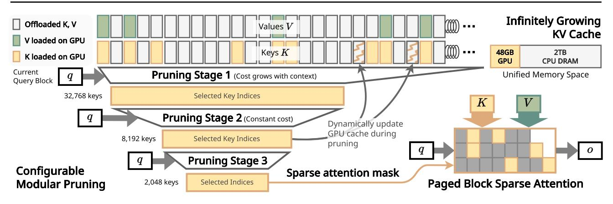
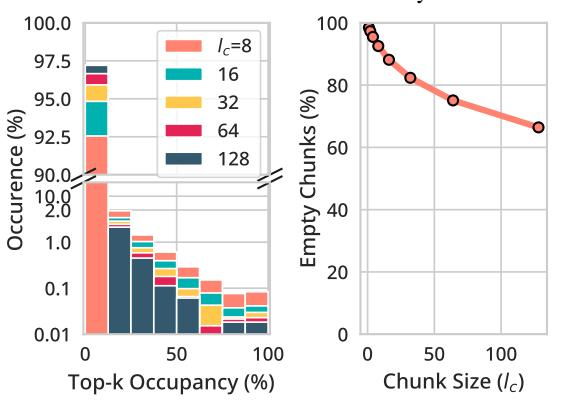
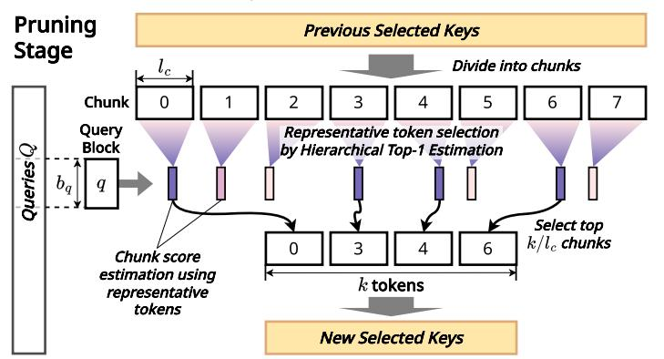
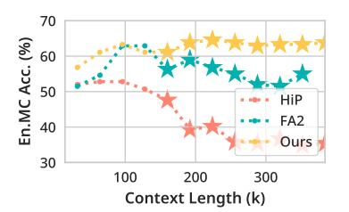
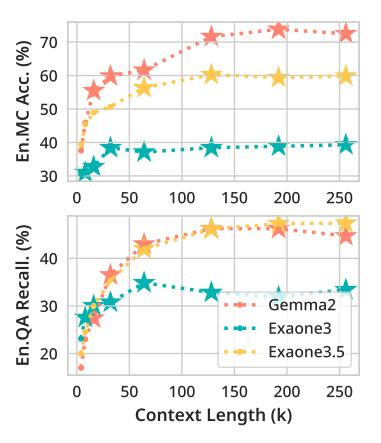
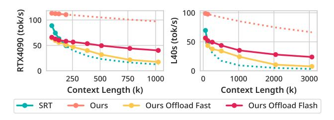
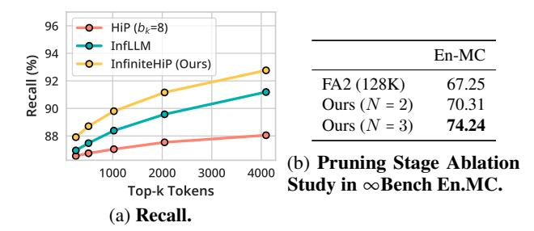

# Extending Language Model Context Up to 3 Million Tokens on a Single GPU

Heejun Lee \* 1 2 Geon Park \* 1 2 Jaduk Suh 1 Sung Ju Hwang 1 2

## Abstract

In modern large language models (LLMs), handling very long context lengths presents significant challenges as it causes slower inference speeds and increased memory costs. Additionally, most existing pre-trained LLMs fail to generalize beyond their original training sequence lengths. To enable efficient and practical long-context utilization, we introduce *InfiniteHiP*, a novel and practical LLM inference framework that accelerates processing by dynamically eliminating irrelevant context tokens through a modular hierarchical token pruning algorithm. Our method also allows generalization to longer sequences by selectively applying various RoPE adjustment methods according to the internal attention patterns within LLMs. Furthermore, we offload the key-value cache to host memory during inference, significantly reducing GPU memory pressure. As a result, InfiniteHiP enables the processing of up to 3 million tokens on a single L40s 48GB GPU – 3x larger – without any permanent loss of context information. Our framework achieves an 18.95x speedup in attention decoding for a 1 million token context without requiring additional training. We implement our method in the SGLang framework and demonstrate its effectiveness and practicality through extensive evaluations.

## 1. Introduction

In modern Transformer-based generative large language models (LLMs), extending the context length is essential for improving comprehension and coherence in long-context, multi-modal, and retrieval-augmented language generation. However, achieving this poses significant challenges, primarily due to the attention mechanism [\(Vaswani et al.,](#page-10-0) [2017\)](#page-10-0), a fundamental component of these models. The attention mechanism computes relationships between each input to-

*Preprint*, Copyright 2025 by the author(s).

ken and all preceding tokens, causing computational and memory costs to scale quadratically as the input sequence length increases. Another problem arising from the attention mechanism is the key-value (KV) cache. During generation, previously computed attention keys and values are cached on GPU memory for reuse. However, the KV cache size scales linearly with context length, creating a challenge for long context inference.

Various methods have been proposed to reduce the high costs of the attention mechanism. FlashAttention (FA2) [\(Dao et al.,](#page-8-0) [2022\)](#page-8-0) significantly reduces memory consumption and bandwidth utilization by avoiding writing the entire attention score matrix to global GPU memory. However, it does not reduce the arithmetic computation cost. Other approaches [\(Xiao et al.,](#page-10-1) [2024b;](#page-10-1) [Lee et al.,](#page-9-0) [2024b\)](#page-9-0) selectively attend to a fixed number of key tokens, either statically or dynamically, during attention inference.

Many efforts have also been made to mitigate the memory burden of the KV cache. KV cache eviction methods selectively 'forget' past contexts to conserve GPU memory [\(Zhang et al.,](#page-10-2) [2023;](#page-10-2) [Oren et al.,](#page-9-1) [2024\)](#page-9-1). However, these methods permanently erase past contexts, which may be needed again later. HiP attention [\(Lee et al.,](#page-9-0) [2024b\)](#page-9-0) offloads infrequently accessed 'cold' tokens to larger and cheaper host memory, dynamically fetching them back to GPU during generation only when needed while keeping only frequently accessed 'hot' tokens on the GPU.

Despite these optimizations, another problem with context extension still remains: pre-trained LLMs cannot handle inputs longer than their trained context length. Since the attention mechanism is permutation invariant, they utilize positional embedding methods such as Rotary Positional Embeddings (RoPE) [\(Su et al.,](#page-9-2) [2023\)](#page-9-2) to model the temporal order of tokens. However, as LLMs are typically pre-trained on sequences truncated to a fixed length, they fail to adapt to unseen positions when prompted with longer contexts.

One option for overcoming this problem is long context fine-tuning [\(Roziere et al.](#page-9-3) ` , [2024\)](#page-9-3), i.e., fine-tuning the model on a set of longer inputs. However, fine-tuning, especially on long sequences, requires exorbitant training costs and high-quality training data. Thus, *out-of-length* (OOL) generalization, i.e., the capability for pre-trained models to perform well beyond their pre-trained limits without train-

\*Equal contribution 1Graduate School of AI, KAIST, Seoul, Korea 2DeepAuto.ai, Seoul, Korea. Correspondence to: Sung Ju Hwang <sungju.hwang@kaist.ac.kr>.

Figure 1. Overview of InfiniteHiP. (a) Infinitely growing KV cache: In InfiniteHiP, the context keys and values are stored in a unified memory space, where some of the keys and values are loaded on GPU memory. (b) Configurable modular pruning: Each pruning stage narrows down the candidate key indices based on the current query block. During pruning, if a cache miss is encountered, the missing tokens are dynamically loaded and the GPU cache is updated. (c) Paged block sparse attention: The selected key indices are used to perform efficient paged block sparse attention.

ing, becomes increasingly important. Self-Extend (Jin et al., 2024) proposes a training-free way of scaling the RoPE embeddings beyond the pre-trained limit.

In this paper, we propose InfiniteHiP, a long-context LLM framework that combines the strengths of all the above methods. To alleviate the computational burden of attention, InfiniteHiP proposes a novel modular sparse attention scheme that minimizes computation for less important contexts. For optimizing KV cache offloading, InfiniteHiP enhances HiP attention (Lee et al., 2024b)'s offloading strategy with a sophisticated LRU-based cache policy. Finally, InfiniteHiP achieves OOL generalization by carefully applying various RoPE adjustment strategies within different components of LLMs according to their internal attention patterns. By providing a unified solution to all the aforementioned problems as a whole, InfiniteHiP demonstrates strong practicality and is well suited for real-world deployment.

What sets InfiniteHiP apart is its innovative use of pruning modules, as illustrated in Figure 1. These modules employ a novel modular hierarchical pruning algorithm to selectively discard less important input tokens. The algorithm leverages common patterns observed in attention matrices of popular LLMs – namely, their sparsity and the spatial locality of nonzero entries within a sequence – to prune irrelevant tokens effectively. Each pruning module partitions the input sequence into chunks of fixed length  $b_k$ , and efficiently identifies the approximate top-1 token with the highest attention score within each chunk in parallel. Only the top-K most significant chunks (where K is constant) are passed to the next module, while the rest are discarded. By stacking multiple pruning modules, InfiniteHiP iteratively refines a block sparse attention mask.

While our work is based upon HiP (Lee et al., 2024b), it introduces several key improvements. First, our hierarchical pruning modules achieve higher accuracy compared to HiP's heuristic-based hierarchical pruning. Second, the pruning algorithm within each module is significantly faster due to its enhanced parallelizability. Lastly, its modular design enables fine-grained control over pruning-stage caches, leading to much faster decoding than HiP.

InfiniteHiP enables extremely long-context inference with pre-trained LLMs, surpassing their original context length limits without quality degradation while overcoming GPU memory limitations with efficient KV cache offloading. As a training-free solution, InfiniteHiP can be used as a drop-in replacement for any pretrained Transformer-based LLM, providing faster inference and extending usable context length at both the model and hardware levels.

Our contributions can be summarized as follows:

- We propose a modular, highly parallelizable training-free hierarchically pruned attention mechanism that enables out-of-length generalization while significantly speeding up LLM inference on long contexts.
- We demonstrate that our method does not degrade the LLM's long-context language understanding, reasoning, and text generation capabilities compared to other SoTA efficient long-context inference methods.
- We efficiently implement InfiniteHiP on the SGLang LLM serving framework, achieving a 7.24× speedup in end-to-end decoding on a 3M token context while using only 3.34% of the VRAM required by FA2, and design an efficient KV cache offloading algorithm that utilizes modular pruning algorithm, making it practical for realworld scenarios.

(a) **Chunk sparsity.** In the given 128K context, *Left:* A histogram which plots the frequency of chunks (y) which contain a certain percentage (x) of the top 2048 keys. *Right:* Percentage of chunks that contain none of the top 2048 keys by varying chunk size  $(l_c)$ . We use the Llama 3.1 8B model and extract data from one of the attention layers.

(b) **Modular context pruning.** We design our context pruning module based on the observation in (a). A single pruning stage is shown above. The keys selected in the previous stage are divided into chunks, and a representative token is selected for each chunk. Each chunk's score is estimated from these representative tokens. Finally, the top  $l_c/k$  chunks are selected for the next stage.

Figure 2. Design of our Context Pruning Algorithm.

#### 2. Related Works

Previous studies have proposed dynamic token selection for efficient LLM inference for long contexts. MInference (Jiang et al., 2024) classifies attention heads into two types to estimate the sparse attention pattern, which is used to drop less important tokens before the dot product. While this method considerably speeds up the prefill stage, it cannot be applied in the decoding stage, which takes up most of the inference time. HiP Attention (Lee et al., 2024b) estimates the top-k context blocks with the highest attention scores in a hierarchical and iterative manner, significantly speeding up both prefill and decoding in long contexts. However, the iterative algorithm involves many global thread synchronizations, which hinders parallelism. Quest (Tang et al., 2024) divides the context into fixed-size pages and estimates the maximum attention score by using cached element-wise min and max vectors. InfLLM (Xiao et al., 2024a) divides the context sequence into blocks and selects representative tokens in each block. For each new query, the top-k blocks whose representative tokens give the highest attention scores are selected. In contrast to our InfiniteHiP, the representative tokens of each block are prechosen and do not change with the current query. Both HiP Attention and InfLLM enables KV cache offloading, which makes long context inference context possible within a single GPU.

## 3. Motivations and Observations

Chunk sparsity of the attention mechanism. To devise an algorithm that estimates the locations of the top-k key tokens for block sparse attention, we first analyze the characteristics of the attention score distribution. We observe distinct patterns in the distribution of top-k tokens within a

typical LLM attention context.

Figure 2a suggests that the top-k tokens are concentrated in a small number of context chunks. As shown in the left chart, fewer than 2% of the chunks contain more than 12.5% of the top-2K tokens in a 128K-token context. Furthermore, the right chart tells us that around 75% of the 64-token context chunks do not contain any top-2K tokens at all. These observations suggest that selecting the few context chunks containing top-k tokens can act as a good approximation for selecting the individual top-k tokens. To this end, we devise an efficient algorithm that divides the context into fixed-size chunks and filters out irrelevant chunks based on their estimated maximum attention scores.

## 4. Designs of InfiniteHiP

The complete descriptions of our algorithms are detailed in Appendix A. Here, we describe the overview of our design.

**Background.** Given query, key, and value sequences  $Q, K, V \in \mathbb{R}^{H \times T \times d}$ , the conventional multi-head attention output O is computed as  $O = \operatorname{Concat}[O_1, \dots, O_H]$ , where  $S_h = Q_h K_h^{\mathsf{T}} \in \mathbb{R}^{T \times T}$ ,  $P_h = \operatorname{softmax}(S_h) \in \mathbb{R}^{T \times T}$ ,  $O_h = P_h V_h \in \mathbb{R}^{T \times d}$  for all h = 1..H, where H denotes the number of attention heads, T denotes the sequence length, d denotes the embedding dimension, and softmax is applied row-wise (Vaswani et al., 2017). The causal masking and constant scaling are omitted for brevity. The S and S matrices are each called the *attention scores* and *probabilities*.

Efficient Modular Context Pruning. As mentioned in Section 3, InfiniteHiP seeks to select sparse important context chunks containing top-k tokens. This is achieved by pruning stages, which effectively discard context chunks

|             |        | Single | Docum  | ent QA | Multi | Docume | nt QA | Sun  | mariza | ation    | Few-   | shot Le | arning | Syn | thetic | Co   | ode  | Avg.  | Avg.    |
|-------------|--------|--------|--------|--------|-------|--------|-------|------|--------|----------|--------|---------|--------|-----|--------|------|------|-------|---------|
|             |        | NQA    | Qasper | MFQA   | HQA   | 2WMQ   | MSQ   | GR   | QMS    | MN       | TREC   | TQA     | SAMS   | PC  | PR     | RBP  | LCC  | Abs.  | Rel.(%) |
| Methods     | Window |        |        |        |       |        |       |      | Lla    | ama 3    | (8B)   |         |        |     |        |      |      |       |         |
| FA2         | 8K     | 19.9   | 42.4   | 41.0   | 47.4  | 39.2   | 23.0  | 29.9 | 21.4   | 27.5     | 74.0   | 90.5    | 42.3   | 8.5 | 62.5   | 49.1 | 60.8 | 42.47 | 87.69   |
| Infinite    | 8K     | 19.4   | 42.8   | 40.4   | 43.8  | 37.9   | 18.3  | 29.3 | 21.4   | 27.6     | 74.0   | 90.1    | 41.7   | 4.5 | 50.0   | 48.6 | 60.1 | 40.62 | 83.23   |
| Streaming   | 8K     | 20.1   | 42.5   | 39.5   | 43.7  | 37.9   | 19.7  | 29.2 | 21.3   | 27.6     | 73.5   | 90.1    | 41.5   | 5.0 | 49.0   | 49.0 | 60.4 | 40.61 | 83.21   |
| InfLLM      | 8K     | 22.6   | 43.7   | 49.0   | 49.0  | 35.6   | 26.1  | 30.8 | 22.7   | 27.6     | 73.5   | 90.9    | 42.4   | 7.2 | 84.0   | 46.5 | 59.9 | 44.47 | 92.83   |
| InfiniteHiP | 3K     | 26.6   | 43.2   | 50.3   | 51.9  | 41.0   | 30.9  | 31.7 | 23.3   | 26.9     | 75.5   | 90.3    | 43.0   | 7.5 | 93.5   | 64.8 | 63.1 | 47.72 | 100.00  |
| Methods     | Window |        |        |        |       |        |       |      | Mis    | tral 0.2 | 2 (7B) |         |        |     |        |      |      |       |         |
| FA2         | 32K    | 22.1   | 29.2   | 47.6   | 37.5  | 22.0   | 19.0  | 31.1 | 23.9   | 26.6     | 71.0   | 86.0    | 42.3   | 4.0 | 86.9   | 54.1 | 57.4 | 41.29 | 96.44   |
| Infinite    | 6K     | 18.4   | 30.0   | 39.0   | 32.0  | 22.3   | 15.8  | 29.7 | 21.9   | 26.6     | 70.0   | 85.2    | 41.6   | 2.1 | 42.8   | 53.4 | 57.1 | 36.76 | 83.49   |
| Streaming   | 6K     | 17.9   | 30.1   | 39.1   | 32.2  | 21.8   | 14.7  | 29.8 | 21.9   | 26.6     | 70.0   | 85.6    | 41.3   | 2.5 | 42.2   | 51.5 | 55.4 | 36.41 | 82.63   |
| InfLLM      | 6K     | 22.1   | 29.3   | 47.4   | 36.6  | 22.3   | 17.7  | 31.0 | 23.5   | 26.7     | 69.0   | 86.7    | 42.5   | 2.9 | 64.0   | 53.0 | 56.7 | 39.46 | 91.23   |
| InfLLM      | 12K    | 23.0   | 29.5   | 47.6   | 39.5  | 23.6   | 18.9  | 31.4 | 23.8   | 26.7     | 71.0   | 87.3    | 41.8   | 3.0 | 87.4   | 52.1 | 56.7 | 41.46 | 96.99   |
| InfiniteHiP | 3K     | 24.1   | 28.7   | 48.6   | 40.4  | 23.2   | 22.1  | 31.6 | 23.8   | 26.5     | 70.5   | 88.8    | 42.7   | 3.5 | 86.6   | 62.1 | 60.4 | 42.71 | 99.85   |

Table 1. LongBench Results. FA2 refers to truncated FlashAttention2, Infinite refers to LM-Infinite, and Streaming refers to StreamingLLM. The 'Avg. Rel.' column shows the average of the relative score of each subset. The relative score is computed by dividing the original score by the highest score in its column. We believe that the relative score better represents the differences in performance because the variance is normalized per subset. The best values in each column are shown in bold font.

irrelevant to the current query. By applying multiple pruning stages, InfiniteHiP is able to generate a sparse attention mask, which is a good approximation for the top-k tokens.

First, we note that the initial  $n_{\rm sink}$  tokens (sink tokens) and  $n_{\rm stream}$  most recent tokens (streaming tokens) are always included. We sparsely select the middle tokens in between the sink and streaming tokens. We aim to find a block sparse attention mask that approximately selects the top-K key blocks with the highest attention scores for each query block. This allows us to perform efficient block sparse attention (BSA) while preserving the capabilities of the model (Lee et al., 2024b). For ease of explanation, in this section, we ignore the existence of sink and streaming tokens, as well as the causal part of the self-attention mechanism. Please refer to Appendix A for a full description of our algorithm.

Figure 2b illustrates how each pruning stage preserves only the most relevant contexts. First, the input key tokens are partitioned into equally sized chunks. Next, we select a representative token for the key chunk. Leveraging the idea of attention locality introduced in Lee et al. (2024b), where nearby tokens tend to display similar attention scores, representative tokens provide an estimate for the attention scores within their chunks. When choosing the representative tokens, we use a top-1 variant of the Hierarchical Mask Selection algorithm used in Lee et al. (2024b).

Using the attention scores of these representative tokens, max-pooled across attention heads, we select the top-K key chunks and discard the rest. The surviving tokens are used as the input key tokens for the next pruning stage. By iteratively applying these pruning stages, we can effectively obtain a good estimate of the top-k tokens in the form of a

sparse attention mask.

In formal notation, we denote a pruning stage by  $\mathcal{S}^{(i)} = (b_q^{(i)}, l_c^{(i)}, k^{(i)})$ , where  $b_q$  denotes the size of the query block,  $l_c$  denotes the chunk size, k denotes the number of tokens to keep, and the superscript  $i=1\ldots N$  denotes the stage index. To speed up the process by parallel processing, the queries are grouped into blocks. Specifically, in the ith stage, the query Q is divided into multiple  $b_q^{(i)}$ -sized blocks. We denote the mth query block in the kth attention head in the kth pruning stage by  $d_{k,m}^{(i)} := Q_{k,m\cdot b_q: (m+1)b_q-1} \in \mathbb{R}^{b_q \times d}$ .

For the initial stage, we select all of the keys  $\mathcal{I}_m^{(0)} = [1, \dots, T]$  for each query block index m. Each pruning stage transforms this list of indices into a smaller list by discarding indices corresponding to less important contexts.

The input sequence  $\mathcal{I}_m^{(i-1)}$  to the ith pruning stage is divided into  $l_c^{(i)}$ -size contiguous chunks where the jth chunk contains  $\mathcal{C}_{m,j}^{(i)} \coloneqq \left[\mathcal{I}_m^{(i-1)}[j\,l_c^{(i)}],\ldots,\mathcal{I}_m^{(i-1)}[(j+1)l_c^{(i)}-1]\right]$ . For each jth chunk, we pick a representative token from  $\mathcal{C}_{m,j}^{(i)}$  independently for each attention head, using a top-1 variant of the algorithm used in Lee et al. (2024b). We denote the representative token index for the kth attention head as  $r_{k,m,j}^{(i)} = \mathrm{SelectRep}(q_{k,m}^{(i)},\mathcal{C}_{m,j}^{(i)})$ .

The representative tokens provide a way to estimate the maximum attention score within each chunk. We estimate each chunk's score by computing the maximum value across the attention heads and each query in the query block as  $s_{m,j}^{(i)} \coloneqq \max_{h=1..H} (\mathbf{q}_{h,m}^{(i)})_t^{\mathsf{T}} \mathbf{k}_{h,r_{h,m,j}^{(i)}}$ . Finally, the top  $t=1..b_q^{(i)}$ 

 $K^{(i)} \coloneqq k^{(i)}/l_c^{(i)}$  chunks with the highest estimated attention

|             |          |       | Syn   | thetic T | asks  |         |          | NI    | LU    |       | Avg.  | Avg.    |
|-------------|----------|-------|-------|----------|-------|---------|----------|-------|-------|-------|-------|---------|
|             |          | RPK   | RN    | RKV      | MF    | Avg.    | MC       | QA    | SUM   | Avg.  | Abs.  | Rel.(%) |
| Method      | Windo    | w     |       |          |       | Llama   | 3 (8B)   |       |       |       |       |         |
| FA2         | 8K       | 8.50  | 7.80  | 6.20     | 21.70 | 11.05   | 44.10    | 15.50 | 24.70 | 28.10 | 19.57 | 47.83   |
| NTK         | 128K     | 0.00  | 0.00  | 0.00     | 2.60  | 0.65    | 0.00     | 0.40  | 6.40  | 2.27  | 1.46  | 3.65    |
| SelfExtend  | 128K     | 100   | 100   | 0.20     | 22.60 | 55.70   | 19.70    | 8.60  | 14.70 | 14.33 | 35.02 | 67.81   |
| Infinite    | 8K       | 6.80  | 7.60  | 0.20     | 20.60 | 8.80    | 41.50    | 14.60 | 20.80 | 25.63 | 17.22 | 42.52   |
| Streaming   | 8K       | 8.50  | 8.30  | 0.40     | 21.40 | 9.65    | 40.60    | 14.30 | 20.40 | 25.10 | 17.38 | 42.53   |
| H2O         | 8K       | 2.50  | 2.40  | 0.00     | 6.00  | 2.73    | 0.00     | 0.70  | 2.80  | 1.17  | 1.95  | 3.95    |
| InfLLM      | 8K       | 100   | 99.00 | 5.00     | 23.70 | 56.92   | 43.70    | 19.50 | 24.30 | 29.17 | 43.05 | 89.07   |
| InfiniteHiP | 3K       | 99.83 | 97.46 | 9.60     | 17.71 | 56.15   | 57.21    | 26.94 | 24.89 | 36.35 | 46.25 | 98.17   |
| InfiniteHiP | 3K-fast  | 99.83 | 97.29 | 8.20     | 17.71 | 55.76   | 58.08    | 27.16 | 24.96 | 36.73 | 46.25 | 98.35   |
| InfiniteHiP | 3K-flash | 99.83 | 97.46 | 8.89     | 18.00 | 56.04   | 56.77    | 26.63 | 25.00 | 36.13 | 46.09 | 97.78   |
| InfiniteHiP | 5K       | 100   | 99.83 | 10.80    | 20.00 | 57.66   | 55.90    | 30.99 | 22.63 | 36.50 | 47.08 | 99.69   |
| Method      | Windo    | w     |       |          |       | Mistral | 0.2 (7B) | )     |       |       |       |         |
| FA2         | 32K      | 28.80 | 28.80 | 14.80    | 20.60 | 23.25   | 44.50    | 12.90 | 25.90 | 27.77 | 25.51 | 58.37   |
| NTK         | 128K     | 100   | 86.80 | 19.20    | 26.90 | 58.23   | 40.20    | 16.90 | 20.30 | 25.80 | 42.01 | 77.23   |
| SelfExtend  | 128K     | 100   | 100   | 15.60    | 19.10 | 58.67   | 42.80    | 17.30 | 18.80 | 26.30 | 42.49 | 78.30   |
| Infinite    | 32K      | 28.80 | 28.80 | 0.40     | 16.30 | 18.57   | 42.80    | 11.40 | 22.50 | 25.57 | 22.07 | 51.97   |
| Streaming   | 32K      | 28.80 | 28.50 | 0.20     | 16.90 | 18.60   | 42.40    | 11.50 | 22.10 | 25.33 | 21.97 | 51.62   |
| H2O         | 32K      | 8.60  | 4.80  | 2.60     | 26.90 | 10.72   | 48.00    | 15.60 | 24.40 | 29.33 | 20.03 | 52.98   |
| InfLLM      | 16K      | 100   | 96.10 | 96.80    | 25.70 | 79.65   | 43.70    | 15.70 | 25.80 | 28.40 | 54.02 | 94.77   |
| InfiniteHiP | 3K       | 100   | 97.97 | 60.80    | 28.00 | 71.69   | 55.46    | 12.74 | 25.86 | 31.35 | 51.52 | 94.44   |
| InfiniteHiP | 3K-fast  | 100   | 97.63 | 52.80    | 28.29 | 69.68   | 55.46    | 12.66 | 23.79 | 30.63 | 50.16 | 92.04   |
| InfiniteHiP | 5K       | 100   | 99.51 | 83.60    | 29.71 | 78.21   | 56.33    | 14.67 | 24.14 | 31.71 | 54.96 | 99.09   |

Table 2. 

Bench Results. The average score of each category is the mean of dataset performance, and the average score of the whole benchmark is the relative performance compared to the bestperforming result. In the 'Window' column, 'fast' and 'flash' indicates refreshing the sparse attention mask less frequently (see Section 5.1). See the caption on Table 1 on 'Abs. Rel.'.

Figure 3. Results with Llama3.18B.

Figure 4. Results with Short Context Models. Star (\*)-shaped markers indicate out-of-length generalization results.

scores are selected for the next stage, as follows:

$$\mathcal{I}_{m'}^{(i)} = \bigcup_{\hat{\gamma} \in \mathcal{T}_{m}^{(i)}} \mathcal{C}_{m,\hat{j}}^{(i)},\tag{1}$$

where 
$$\mathcal{T}_{m}^{(i)} = \arg \sup_{i} \sup_{K^{(i)}} (s_{m,j}^{(i)}),$$
 (2)

$$\hat{j} \in \mathcal{T}_m^{(i)} \\
\text{where } \mathcal{T}_m^{(i)} = \underset{j}{\text{arg top}}_{K^{(i)}} (s_{m,j}^{(i)}), \qquad (2)$$
and 
$$m' = \begin{cases} \lceil m \cdot b_q^{(i)} / b_q^{(i+1)} \rceil & \text{if } i \leq N, \\ m & \text{otherwise.} \end{cases}$$

When all N stages are done, we are left with sparse key indices  $\mathcal{I}_m^{(N)} \in \{1, \dots, T\}^{k^{(N)}}$  for all query blocks  $m = 1 \dots T/b_q^{(N)}$ , which can be used for efficient block sparse attention.

Sparse Attention Mask Caching. To further reduce latency during decoding, we cache the sparse attention mask for each pruning stage. We observe that the sparse attention mask exhibits temporal locality. Therefore, instead of recomputing it every decoding step, we update the output attention mask for the ith pruning stage periodically every  $n_{\text{refresh}}^{(i)}$  steps using the latest query block. Additional details are provided in Appendix A.

**Dynamic RoPE for OOL generalization.** We employ multiple RoPE interpolation strategies for the sparse key tokens for out-of-length generalization. During token pruning, two strategies are employed: (1) Chunk-indexed RoPE: Each key chunk is given a single position ID, where the last chunk's position ID is offset by  $n_{\text{stream}}$  from the current query. All keys in the chunk are given the same position ID. (2) **Relative-style RoPE:** During the hierarchical top-1 estimation algorithm, the left branch gets a position ID offset by  $n_{\text{stream}} + 1$  from the current query, and the right branch gets a position ID offset by  $n_{\text{stream}}$  from the current query. For chunk score estimation, the representative key is given a position ID offset by  $n_{\text{stream}}$  from the current query. We apply strategy (1) for the first three layers of the LLM and strategy (2) for the rest. The reason for this choice is explained in detail in Appendix D. During block sparse attention, we use the StreamingLLM-style RoPE: The selected keys, including the sink and streaming keys, are given position IDs sequentially in their original order, where the most recent token is given the same position ID as the current query (Xiao et al., 2024b). Since this dynamic RoPE trick incurs some computational overhead, it can be disabled when the OOL generalization capability is not needed.

KV Cache Offloading. We improve the KV cache offloading mechanism of HiP Attention (Lee et al., 2024b) by enhancing its cache management policy. Similarly to HiP Attention, we manage the KV cache on the unified memory space while keeping a smaller key bank on the GPU

|              | Prefill (ms)    |      |      |      |      |      |      |      |      | Decode (us) |      |      |      |      |      |      |      |
|--------------|-----------------|------|------|------|------|------|------|------|------|-------------|------|------|------|------|------|------|------|
|              | T (k)           | 32   | 64   | 128  | 256  | 384  | 512  | 768  | 1024 | 32          | 64   | 128  | 256  | 384  | 512  | 768  | 1024 |
|              | FA2 (1M window) | 54.6 | 163  | 379  | 821  | 1267 | 1711 | 2602 | 3490 | 213         | 375  | 643  | 1193 | 1787 | 2325 | 3457 | 4645 |
| InfLLM (12K) |                 | 150  | 178  | 178  | 179  | 180  | 181  | 182  | 183  | 936         | 1145 | 1157 | 1174 | 1167 | 1182 | 1203 | 1222 |
| HiP (1K)     |                 | 68.5 | 95.6 | 109  | 122  | 135  | 135  | 147  | 147  | 330         | 352  | 376  | 399  | 423  | 423  | 446  | 450  |
|              | Total           | 63.5 | 78.3 | 84.5 | 96.7 | 109  | 122  | 147  | 172  | 81.0        | 83.5 | 89.5 | 103  | 124  | 154  | 195  | 234  |
|              | Total (AR)      | -    | -    | -    | -    | -    | -    | -    | -    | 409         | 395  | 425  | 471  | 539  | 559  | 696  | 936  |
| Ours         | Stage 0 (%)     | 3.3  | 6.2  | 12.6 | 22.9 | 30.8 | 37.2 | 46.7 | 53.7 | 7.4         | 8.4  | 10.5 | 14.7 | 22.5 | 24.9 | 29.5 | 28.2 |
| (3K)         | Stage 1 (%)     | 13.8 | 20.1 | 18.8 | 16.4 | 14.4 | 13.0 | 10.8 | 9.2  | 7.9         | 7.7  | 7.7  | 8.3  | 7.7  | 7.0  | 5.2  | 4.0  |
|              | Stage 2 (%)     | 33.5 | 28.8 | 26.8 | 23.4 | 20.7 | 18.6 | 15.4 | 13.1 | 11.6        | 11.9 | 11.5 | 10.6 | 9.5  | 8.9  | 7.1  | 5.3  |
|              | BSA (%)         | 38.9 | 30.7 | 28.4 | 24.8 | 21.9 | 19.7 | 16.4 | 13.9 | 4.0         | 4.0  | 4.6  | 4.8  | 4.0  | 3.7  | 2.9  | 2.2  |
|              | Extra (%)       | 10.6 | 14.2 | 13.4 | 12.6 | 12.2 | 11.5 | 10.7 | 10.1 | 69.2        | 68.1 | 65.7 | 61.6 | 56.4 | 55.5 | 55.3 | 60.3 |
|              | Total           | 103  | 128  | 138  | 158  | 178  | 197  | 236  | 276  | 89.8        | 91.9 | 98.0 | 111  | 133  | 163  | 205  | 245  |
|              | Total (AR)      | -    | -    | -    | -    | -    | -    | -    | -    | 425         | 432  | 462  | 520  | 577  | 617  | 842  | 992  |
| Ours         | Stage 0 (%)     | 3.4  | 6.2  | 12.6 | 22.9 | 31.0 | 37.4 | 47.1 | 53.9 | 6.5         | 7.1  | 9.5  | 16.5 | 22.2 | 26.8 | 28.9 | 31.9 |
| with         | Stage 1 (%)     | 16.9 | 22.1 | 20.6 | 17.9 | 15.8 | 14.3 | 11.9 | 10.3 | 14.5        | 14.7 | 14.2 | 12.6 | 11.2 | 10.5 | 7.8  | 6.7  |
| Extend       | Stage 2 (%)     | 32.3 | 28.2 | 26.1 | 22.7 | 20.2 | 18.3 | 15.2 | 13.1 | 11.9        | 11.8 | 11.1 | 9.9  | 8.8  | 8.3  | 6.0  | 5.2  |
| (3K)         | BSA (%)         | 44.4 | 34.8 | 32.3 | 28.3 | 25.1 | 22.7 | 18.9 | 16.2 | 4.3         | 4.6  | 5.1  | 5.2  | 4.6  | 4.1  | 2.9  | 2.5  |
|              | Extra (%)       | 3.0  | 8.6  | 8.4  | 8.2  | 8.0  | 7.3  | 6.9  | 6.5  | 62.8        | 61.7 | 60.1 | 55.9 | 53.3 | 50.3 | 54.4 | 53.7 |

Table 3. Attention Latency Comparison between InfiniteHiP and Baselines. Prefill latency is measured with chunked prefill style attention, with a chunk size of 32K. In our rows, *Total* means the average latency of the attention mechanism, *Total (AR)* means the decoding latency without any mask caching mechanism, which is always a mask refreshing scenario, *Stage X* means the latency of X'th pruning stage, *BSA* means the latency of block sparse attention. Ours uses the 3K preset from Table [2.](#page-4-0)

memory, which acts as a cache. Note that we maintain two different key banks on the GPU for the mask-selection and block sparse-attention processes. We also keep a page table, which maps the global key index to an index within the GPU key bank, in the GPU memory as well. Upon a cache miss, the missing keys are fetched from the unified memory space and placed on the GPU bank. Unlike HiP Attention [\(Lee](#page-9-0) [et al.,](#page-9-0) [2024b\)](#page-9-0), we employ the Least Recently Used (LRU) policy as the eviction mechanism.

Implementation. We implement the GPU kernels for our method using the Triton language [\(Tillet et al.,](#page-9-7) [2019\)](#page-9-7). We implement a single GPU kernel for the pruning stage, which can be reused for all stages just with different parameters. For block sparse attention, we implement a method similar to FlashAttention [\(Dao et al.,](#page-8-0) [2022\)](#page-8-0) for prefill and Flash Decoding [\(Dao et al.,](#page-8-1) [2023\)](#page-8-1) for decoding. We also combine PagedAttention [\(Kwon et al.,](#page-9-8) [2023\)](#page-9-8) to alleviate the overhead from KV cache memory management. To implement dynamic loading and offloading with host memory, we use Nvidia UVM (Unified Virtual Memory).

## 5. Experiments

#### 5.1. Experiment Setting

Hyperparameters. We described details in Appendix [F.](#page-18-0)

Baselines. We compare the performance of InfiniteHiP against the following baselines, mostly chosen for their long-context capabilities. (1) Truncated FA2: The input context is truncated in the middle to fit in each model's pre-trained limit, and we perform dense attention with FlashAttention2 (FA2) [\(Dao et al.,](#page-8-0) [2022\)](#page-8-0). (2) Dynamic-NTK [\(bloc97,](#page-8-2) [2023\)](#page-8-2) and (3) Self-Extend [\(Jin et al.,](#page-9-4) [2024\)](#page-9-4) adjust the RoPE for OOL generalization. We perform dense attention with FA2 without truncating the input context for these baselines. Both (4) LM-Infinite [\(Han et al.,](#page-9-9) [2024\)](#page-9-9) and (5) StreamingLLM [\(Xiao et al.,](#page-10-1) [2024b\)](#page-10-1) use a combination of sink and streaming tokens while also adjusting the RoPE for OOL generalization. (6) H2O [\(Zhang et al.,](#page-10-2) [2023\)](#page-10-2) is a KV cache eviction strategy which retains the top-k KV tokens at each decoding step. (7) InfLLM [\(Xiao et al.,](#page-10-3) [2024a\)](#page-10-3) selects a set of representative tokens for each chunk of the context, and uses them for top-k context selection. (8) HiP Attention [\(Lee et al.,](#page-9-0) [2024b\)](#page-9-0) uses a hierarchical top-k token selection algorithm based on attention locality.

Benchmarks. We evaluate the performance of Infinite-HiP on mainstream long-context benchmarks. (1) Long-Bench [\(Bai et al.,](#page-8-3) [2023\)](#page-8-3), whose sequence length averages at around 32K tokens, and (2) ∞Bench [\(Zhang et al.,](#page-10-4) [2024\)](#page-10-4) with a sequence length of over 100K tokens. Both benchmarks feature a diverse range of tasks, such as long document QA, summarization, multi-shot learning, and information retrieval. We apply our method to the instruction-tuned Llama 3 8B model [\(Llama Team,](#page-9-10) [2024\)](#page-9-10) and the instructiontuned Mistral 0.2 7B model [\(Jiang et al.,](#page-9-11) [2023\)](#page-9-11). As our framework is training-free, applying our method to these models incurs zero extra cost.

|                  |                    |       |             | T=256k        |             |           | T=512k      |               |             |           | T=1024k     |               |             |
|------------------|--------------------|-------|-------------|---------------|-------------|-----------|-------------|---------------|-------------|-----------|-------------|---------------|-------------|
|                  |                    |       | VRAM (GB)   | Latency (µs)  |             | VRAM (GB) |             | Latency (µs)  |             | VRAM (GB) |             | Latency (µs)  |             |
| FA2 (1M window)* | Runtime            |       | 20.0 (100%) | 1,193 (100%)  |             |           | 36.0 (100%) | 2,325 (100%)  |             |           | 68.0 (100%) | 4,645 (100%)  |             |
| InfLLM (12K)     | Runtime            |       | 4.8 (23.8%) | 1,186 (99.4%) |             |           | 4.8 (13.2%) | 1,194 (51.4%) |             |           | 4.8 (6.99%) | 1,234 (26.6%) |             |
|                  | Runtime (Fast)     |       | 6.1 (30.4%) |               | 532 (44.6%) |           | 6.1 (16.9%) |               | 902 (38.8%) |           | 6.1 (8.93%) | 1,864 (40.1%) |             |
|                  | Runtime (Flash)    |       | 6.1 (30.4%) |               | 325 (27.2%) |           | 6.1 (16.9%) |               | 475 (20.4%) |           | 6.1 (8.93%) |               | 844 (18.2%) |
|                  | Cached Stages      | None  | S1          | S1&2          | All         | None      | S1          | S1&2          | All         | None      | S1          | S1&2          | All         |
| Ours             | Latency (µs)       | 9,803 | 2,579       | 779           | 110         | 19,541    | 4,416       | 836           | 116         | 47,157    | 6,955       | 1,104         | 119         |
| with             | Stage 0 (µs)       | 2,267 | -           | -             | -           | 8,354     | -           | -             | -           | 30,097    | -           | -             | -           |
| Extend &         | Stage 1 (µs)       | 2,854 | 520         | -             | -           | 3,747     | 1,498       | -             | -           | 6,192     | 2,903       | -             | -           |
| Offload          | Stage 2 (µs)       | 2,247 | 784         | 130           | -           | 3,015     | 1,461       | 137           | -           | 4,420     | 2,224       | 150           | -           |
| (3K-fast)        | BSA (µs)           | 235   | 200         | 37            | 31          | 277       | 177         | 34            | 31          | 326       | 189         | 85            | 30          |
|                  | Offload (µs)       | 2,039 | 869         | 503           | -           | 3,901     | 1,110       | 569           | -           | 5,857     | 1,533       | 786           | -           |
|                  | Extra (µs)         | 161   | 206         | 110           | 79          | 247       | 170         | 96            | 89          | 265       | 106         | 83            | 89          |
|                  | Mask Hit Ratio (%) | 71.67 | 85.12       | 98.75         | -           | 52.66     | 74.74       | 98.42         | -           | 28.91     | 56.88       | 98.38         | -           |
|                  | SA Hit Ratio (%)   | 58.92 | 69.25       | 88.61         | 99.8        | 54.45     | 68.05       | 89.76         | 99.8        | 51.38     | 67.73       | 88.97         | 99.8        |

Table 4. Decoding Attention Latency of InfiniteHiP with Offloading. When *Cached stages* is *None*, all pruning stages from stage 1 through 3 are re-computed, and if it is *All*, then all pruning stages are skipped and only the BSA step is performed. In *S1*, the first stage is skipped, and in *S1&2*, the first two stages are skipped. *Offload* indicates the latency overhead of offloading and the cache management mechanism. The latencies are measured with a single RTX 4090 on PCIe 4.0 x8. The model used is AWQ Llama3.1 with FP8 KV cache. (\*) FA2 does not support KV cache offloading and thus cannot run decoding with a context window exceeding 128K tokens using a single RTX 4090. We estimate FA2 results by layer-wise simulation with the same model architecture.

Figure 5. SGlang Decoding Throughput Benchmark. Dashed lines are estimated values. RTX4090 has 24GB and L40s has 48GB of VRAM. We used is AWQ Llama3.1 with FP8 KV cache.

#### 5.2. Results

LongBench. In Table [1,](#page-3-0) our method achieves about 7.17%p better relative score using Llama 3 and 3.19%p better using Mistral 0.2 compared to the best-performing baseline InfLLM. What makes this significant is that our method processes 4× fewer key tokens through sparse attention in both models compared to InfLLM, leading to better decoding latency as shown in Table [3.](#page-5-1)

∞Bench. We show our results on ∞Bench in Table [2.](#page-4-0) The *3K-fast and 3K-flash* window option of ours uses the same setting as *3K* except using a longer mask refreshing interval as detailed in Section [5.1.](#page-5-0) Our method achieves 9.99%p better relative score using Llama 3 and 4.32%p better using Mistral 0.2 compared to InfLLM. The performance gain is larger than in LongBench, which has a fourfold shorter context. This suggests that our method is able to better utilize longer contexts than the baselines.

To further demonstrate our method's superior OOL gen-

eralization ability, we compare ∞Bench's En.MC score in various context lengths with Llama 3.1 8B in Figure [3.](#page-4-0) While InfiniteHiP keeps gaining performance as the context length gets longer, baselines with no OOL generalization capability degrade significantly beyond the pretrained context length (128K). In Figure [4,](#page-4-0) we experiment with other shortcontext LLMs: Exaone 3 (4K) [\(LG AI,](#page-9-12) [2024a\)](#page-9-12), Exaone 3.5 (32K) [\(LG AI,](#page-9-13) [2024b\)](#page-9-13) and Gemma2 (8K) [\(Gemma](#page-8-4) [Team,](#page-8-4) [2024\)](#page-8-4). We observe the most performance gain in an extended context with these short-context models. For instance, with Gemma2, we gain an impressive +24.45%p in En.MC and +22.03%p in En.QA compared to FA2.

#### 5.3. Analysis

In this section, we analyze the latency and the effect of each of the components of our method.

Latency. We analyze the latency of our method on a 1 million-token context and compare it against baselines with settings that yield similar benchmark scores. In Table [3,](#page-5-1) we measure the latencies of attention methods. During a 1M token prefill, our method is 20.29× faster than FlashAttention2 (FA2), 6% faster than InfLLM, and achieves similar latency with the baseline HiP. During decoding with a 1M token context, our method significantly outperforms FA2 by 19.85×, InfLLM by 4.98×, and HiP by 92%. With context extension (dynamic RoPE) enabled, our method slows down about 1.6× in prefill and 5% in decoding due to overheads incurred by additional memory reads of precomputed cos and sin vectors. Therefore, our method is 50% slower than

InfLLM in context extension-enabled prefill, but it is significantly faster in decoding because decoding is memory-bound: Our method with a 3K token context window reads fewer context tokens than InfLLM with a 12K token context window.

**Latency with KV Offloading.** In Table 4, we measure the decoding latency with KV cache offloading enabled on a Passkey retrieval task sample. We keep FA2 in the table for reference, even though FA2 with UVM offloading is 472× slower than the baseline HiP. Among the baseline methods, only InfLLM achieves KV cache offloading in a practical way. In 256K context decoding, we outperform InfLLM by 3.64×. With KV cache offloading, the attention mechanism is extremely memory-bound, because accessing the CPU memory over PCIe is 31.5× more expensive in terms of latency than accessing VRAM. InfLLM chooses not to access the CPU memory while executing its attention kernel, so it has to sacrifice the precision of its top-k estimation algorithm. This makes larger block and context window sizes necessary to maintain the model's performance on downstream tasks. In contrast, we choose to access the CPU memory during attention kernel execution like baseline HiP. This allows more flexibility for the algorithm design, performing better in downstream NLU tasks. Moreover, our UVM implementation makes the KV cache offloaded attention mechanism a graph-capturable operation, which allows us to avoid CPU overheads, unlike InfLLM. In contrast to the offloading framework proposed by Lee et al. (2024b), we cache the sparse attention mask separately for each pruning stage. This enables us to reduce the frequency of calling the costly initial pruning stage, which scales linearly.

**Throughput.** In Figure 5, we present the decoding throughput of our method using RTX 4090 (24GB) and L40S (48GB) GPUs. On the 4090, our method achieves a throughput of 3.20× higher at a 1M context length compared to the estimated decoding throughput of SRT (SGlang Runtime with FlashInfer). Similarly, on the L40S, our method surpasses SRT by 7.25× at a 3M context length. Due to hardware limitations, we estimated the decoding performance since a 1M and 3M context requires approximately 64GB and 192GB of KV cache, respectively, which exceeds the memory capacities of 24GB and 48GB GPUs. We further demonstrate that adjusting the mask refreshing interval significantly enhances decoding throughput without substantially affecting performance. The Flash configuration improves decoding throughput by approximately 3.14× in a 3M context compared to the *Fast* configuration.

Accuracy of top-*k* estimation. In Figure 6a, we demonstrate our method has better coverage of important tokens, which means higher recall of attention probabilities of selected key tokens. Our method performs 1.57%p better than InfLLM and 4.72%p better than baseline HiP. The bet-

Figure 6. Analysis

Table 5. RoPE Ablation Study in Context Pruning and Sparse Attention. We measure the accuracy of ∞Bench En.MC subset truncated with T=128K with various combinations of RoPE extends style in context pruning and sparse attention kernels. Each row represents a single RoPE extend style in the context pruning procedure, and each column represents the RoPE extend style in block sparse attention. SA stands for sparse attention, DE stands for dynamic RoPE extend (SelfExtend variant), IL stands for InfLLM style RoPE, ST stands for StreamingLLM style RoPE, RT stands for relative RoPE in hierarchical representative token selection.

| RoPE Style in Pruning \ SA | DE    | IL    | ST    | AVG.  |
|----------------------------|-------|-------|-------|-------|
| DE (Dynamic)               | 52.40 | 54.59 | 51.09 | 52.69 |
| IL (InfLLM)                | 68.12 | 66.81 | 70.31 | 68.41 |
| CI (Chunk-Indexed)         | 67.69 | 66.81 | 67.69 | 67.39 |
| RT (Relative)              | 66.81 | 68.56 | 70.31 | 68.56 |
| AVG.                       | 63.76 | 64.19 | 64.85 | -     |

ter recall indicates our method follows pretrained attention patterns more closely than the baselines.

**Ablation on Depth of Stage Modules.** In Figure 6b, we perform an ablation study on a number of stages (N) that are used in ours. The latency-performance optimal pruning module combination for each setting is found empirically.

**Ablation on RoPE interpolation strategies.** In Table 5, we perform an ablation study on the dynamic RoPE extrapolation strategy in masking and sparse attention. We choose the best-performing RT/ST combination for our method.

#### 6. Conclusion

In this paper, we introduced *InfiniteHiP*, a training-free LLM inference framework for efficient long context inference that supports out-of-length generalization and dynamic KV cache offloading. InfiniteHiP effectively addresses the three major challenges that arise in long context LLM inference: (1) Efficient inference with long contexts, (2) Out-of-length generalization, (3) GPU memory conservation through KV cache offloading without 'forgetting'. The experiments on LongBench and ∞Bench, and the latency benchmarks demonstrate our method's superior performance and practicality over previous state-of-the-art methods.

## Impact Statement

We believe our method can significantly enhance energy efficiency and reduce inference latency. Since our approach focuses solely on accelerating the existing Transformer model without altering its trained behavior, we do not expect any notable social impact concerns. Additionally, our method demonstrates strong results in performance recovery, indicating that it can maintain performance levels comparable to the original Transformer while achieving faster processing. We anticipate that this method will offer substantial benefits for production use in the future.

## References

- Bai, Y., Lv, X., Zhang, J., Lyu, H., Tang, J., Huang, Z., Du, Z., Liu, X., Zeng, A., Hou, L., Dong, Y., Tang, J., and Li, J. Longbench: A bilingual, multitask benchmark for long context understanding. *arXiv preprint arXiv:2308.14508*, 2023.
- bloc97. NTK-Aware Scaled RoPE allows LLaMA models to have extended (8k+) context size without any fine-tuning and minimal perplexity degradation., June 2023. URL [www.reddit.com/r/LocalLLaMA/comments/](www.reddit.com/r/LocalLLaMA/comments/14lz7j5/ntkaware_scaled_rope_allows_llama_models_to_have/) [14lz7j5/ntkaware\\_scaled\\_rope\\_allows\\_](www.reddit.com/r/LocalLLaMA/comments/14lz7j5/ntkaware_scaled_rope_allows_llama_models_to_have/) [llama\\_models\\_to\\_have/](www.reddit.com/r/LocalLLaMA/comments/14lz7j5/ntkaware_scaled_rope_allows_llama_models_to_have/).
- Dao, T., Fu, D. Y., Ermon, S., Rudra, A., and Re, C. ´ FlashAttention: Fast and memory-efficient exact attention with IO-awareness, 2022. URL [http://arxiv.](http://arxiv.org/abs/2205.14135) [org/abs/2205.14135](http://arxiv.org/abs/2205.14135).
- Dao, T., Haziza, D., Massa, F., and Sizov, G. Flash-decoding for long-context inference, 2023. URL [https://crfm.stanford.edu/2023/10/](https://crfm.stanford.edu/2023/10/12/flashdecoding.html) [12/flashdecoding.html](https://crfm.stanford.edu/2023/10/12/flashdecoding.html).
- DeepSeek-AI, Liu, A., Feng, B., Wang, B., Wang, B., Liu, B., Zhao, C., Dengr, C., Ruan, C., Dai, D., Guo, D., Yang, D., Chen, D., Ji, D., Li, E., Lin, F., Luo, F., Hao, G., Chen, G., Li, G., Zhang, H., Xu, H., Yang, H., Zhang, H., Ding, H., Xin, H., Gao, H., Li, H., Qu, H., Cai, J. L., Liang, J., Guo, J., Ni, J., Li, J., Chen, J., Yuan, J., Qiu, J., Song, J., Dong, K., Gao, K., Guan, K., Wang, L., Zhang, L., Xu, L., Xia, L., Zhao, L., Zhang, L., Li, M., Wang, M., Zhang, M., Zhang, M., Tang, M., Li, M., Tian, N., Huang, P., Wang, P., Zhang, P., Zhu, Q., Chen, Q., Du, Q., Chen, R. J., Jin, R. L., Ge, R., Pan, R., Xu, R., Chen, R., Li, S. S., Lu, S., Zhou, S., Chen, S., Wu, S., Ye, S., Ma, S., Wang, S., Zhou, S., Yu, S., Zhou, S., Zheng, S., Wang, T., Pei, T., Yuan, T., Sun, T., Xiao, W. L., Zeng, W., An, W., Liu, W., Liang, W., Gao, W., Zhang, W., Li, X. Q., Jin, X., Wang, X., Bi, X., Liu, X., Wang, X., Shen, X., Chen, X., Chen, X., Nie, X., Sun, X., Wang, X., Liu, X., Xie, X., Yu, X., Song, X., Zhou, X., Yang,

- X., Lu, X., Su, X., Wu, Y., Li, Y. K., Wei, Y. X., Zhu, Y. X., Xu, Y., Huang, Y., Li, Y., Zhao, Y., Sun, Y., Li, Y., Wang, Y., Zheng, Y., Zhang, Y., Xiong, Y., Zhao, Y., He, Y., Tang, Y., Piao, Y., Dong, Y., Tan, Y., Liu, Y., Wang, Y., Guo, Y., Zhu, Y., Wang, Y., Zou, Y., Zha, Y., Ma, Y., Yan, Y., You, Y., Liu, Y., Ren, Z. Z., Ren, Z., Sha, Z., Fu, Z., Huang, Z., Zhang, Z., Xie, Z., Hao, Z., Shao, Z., Wen, Z., Xu, Z., Zhang, Z., Li, Z., Wang, Z., Gu, Z., Li, Z., and Xie, Z. Deepseek-v2: A strong, economical, and efficient mixture-of-experts language model, 2024. URL <https://arxiv.org/abs/2405.04434>.
- DeepSeek-AI, Guo, D., Yang, D., Zhang, H., Song, J., Zhang, R., Xu, R., Zhu, Q., Ma, S., Wang, P., Bi, X., Zhang, X., Yu, X., Wu, Y., Wu, Z. F., Gou, Z., Shao, Z., Li, Z., Gao, Z., Liu, A., Xue, B., Wang, B., Wu, B., Feng, B., Lu, C., Zhao, C., Deng, C., Zhang, C., Ruan, C., Dai, D., Chen, D., Ji, D., Li, E., Lin, F., Dai, F., Luo, F., Hao, G., Chen, G., Li, G., Zhang, H., Bao, H., Xu, H., Wang, H., Ding, H., Xin, H., Gao, H., Qu, H., Li, H., Guo, J., Li, J., Wang, J., Chen, J., Yuan, J., Qiu, J., Li, J., Cai, J. L., Ni, J., Liang, J., Chen, J., Dong, K., Hu, K., Gao, K., Guan, K., Huang, K., Yu, K., Wang, L., Zhang, L., Zhao, L., Wang, L., Zhang, L., Xu, L., Xia, L., Zhang, M., Zhang, M., Tang, M., Li, M., Wang, M., Li, M., Tian, N., Huang, P., Zhang, P., Wang, Q., Chen, Q., Du, Q., Ge, R., Zhang, R., Pan, R., Wang, R., Chen, R. J., Jin, R. L., Chen, R., Lu, S., Zhou, S., Chen, S., Ye, S., Wang, S., Yu, S., Zhou, S., Pan, S., Li, S. S., Zhou, S., Wu, S., Ye, S., Yun, T., Pei, T., Sun, T., Wang, T., Zeng, W., Zhao, W., Liu, W., Liang, W., Gao, W., Yu, W., Zhang, W., Xiao, W. L., An, W., Liu, X., Wang, X., Chen, X., Nie, X., Cheng, X., Liu, X., Xie, X., Liu, X., Yang, X., Li, X., Su, X., Lin, X., Li, X. Q., Jin, X., Shen, X., Chen, X., Sun, X., Wang, X., Song, X., Zhou, X., Wang, X., Shan, X., Li, Y. K., Wang, Y. Q., Wei, Y. X., Zhang, Y., Xu, Y., Li, Y., Zhao, Y., Sun, Y., Wang, Y., Yu, Y., Zhang, Y., Shi, Y., Xiong, Y., He, Y., Piao, Y., Wang, Y., Tan, Y., Ma, Y., Liu, Y., Guo, Y., Ou, Y., Wang, Y., Gong, Y., Zou, Y., He, Y., Xiong, Y., Luo, Y., You, Y., Liu, Y., Zhou, Y., Zhu, Y. X., Xu, Y., Huang, Y., Li, Y., Zheng, Y., Zhu, Y., Ma, Y., Tang, Y., Zha, Y., Yan, Y., Ren, Z. Z., Ren, Z., Sha, Z., Fu, Z., Xu, Z., Xie, Z., Zhang, Z., Hao, Z., Ma, Z., Yan, Z., Wu, Z., Gu, Z., Zhu, Z., Liu, Z., Li, Z., Xie, Z., Song, Z., Pan, Z., Huang, Z., Xu, Z., Zhang, Z., and Zhang, Z. Deepseek-r1: Incentivizing reasoning capability in llms via reinforcement learning, 2025. URL <https://arxiv.org/abs/2501.12948>.
- Fu, Q., Cho, M., Merth, T., Mehta, S., Rastegari, M., and Najibi, M. Lazyllm: Dynamic token pruning for efficient long context llm inference, 2024. URL [https:](https://arxiv.org/abs/2407.14057) [//arxiv.org/abs/2407.14057](https://arxiv.org/abs/2407.14057).

Gemma Team. Gemma 2: Improving Open Language Mod-

- els at a Practical Size, October 2024. URL [http://](http://arxiv.org/abs/2408.00118) [arxiv.org/abs/2408.00118](http://arxiv.org/abs/2408.00118). arXiv:2408.00118 [cs].
- Han, C., Wang, Q., Peng, H., Xiong, W., Chen, Y., Ji, H., and Wang, S. LM-Infinite: Zero-Shot Extreme Length Generalization for Large Language Models, June 2024. URL [http://arxiv.org/abs/2308.](http://arxiv.org/abs/2308.16137) [16137](http://arxiv.org/abs/2308.16137). arXiv:2308.16137 [cs].
- Hooper, C., Kim, S., Mohammadzadeh, H., Mahoney, M. W., Shao, Y. S., Keutzer, K., and Gholami, A. Kvquant: Towards 10 million context length llm inference with kv cache quantization, 2024. URL [https:](https://arxiv.org/abs/2401.18079) [//arxiv.org/abs/2401.18079](https://arxiv.org/abs/2401.18079).
- Jiang, A. Q., Sablayrolles, A., Mensch, A., Bamford, C., Chaplot, D. S., Casas, D. d. l., Bressand, F., Lengyel, G., Lample, G., Saulnier, L., Lavaud, L. R., Lachaux, M.-A., Stock, P., Scao, T. L., Lavril, T., Wang, T., Lacroix, T., and Sayed, W. E. Mistral 7B, October 2023. URL [http://arxiv.org/abs/2310.](http://arxiv.org/abs/2310.06825) [06825](http://arxiv.org/abs/2310.06825). arXiv:2310.06825 [cs].
- Jiang, H., Li, Y., Zhang, C., Wu, Q., Luo, X., Ahn, S., Han, Z., Abdi, A. H., Li, D., Lin, C.-Y., Yang, Y., and Qiu, L. MInference 1.0: Accelerating Pre-filling for Long-Context LLMs via Dynamic Sparse Attention, October 2024. URL [http://arxiv.org/abs/2407.](http://arxiv.org/abs/2407.02490) [02490](http://arxiv.org/abs/2407.02490). arXiv:2407.02490 [cs].
- Jin, H., Han, X., Yang, J., Jiang, Z., Liu, Z., Chang, C.-Y., Chen, H., and Hu, X. LLM Maybe LongLM: Self-Extend LLM Context Window Without Tuning, July 2024. URL [http://arxiv.org/abs/2401.](http://arxiv.org/abs/2401.01325) [01325](http://arxiv.org/abs/2401.01325). arXiv:2401.01325 [cs].
- Kwon, W., Li, Z., Zhuang, S., Sheng, Y., Zheng, L., Yu, C. H., Gonzalez, J. E., Zhang, H., and Stoica, I. Efficient Memory Management for Large Language Model Serving with PagedAttention, September 2023. URL [http://arxiv.org/abs/2309.](http://arxiv.org/abs/2309.06180) [06180](http://arxiv.org/abs/2309.06180). arXiv:2309.06180 [cs].
- Lee, H., Kang, M., Lee, Y., and Hwang, S. J. Sparse token transformer with attention back tracking. In *The Eleventh International Conference on Learning Representations*, 2023. URL [https://openreview.net/forum?](https://openreview.net/forum?id=VV0hSE8AxCw) [id=VV0hSE8AxCw](https://openreview.net/forum?id=VV0hSE8AxCw).
- Lee, H., Kim, J., Willette, J., and Hwang, S. J. SEA: Sparse linear attention with estimated attention mask. In *The Twelfth International Conference on Learning Representations*, 2024a. URL [https://openreview.net/](https://openreview.net/forum?id=JbcwfmYrob) [forum?id=JbcwfmYrob](https://openreview.net/forum?id=JbcwfmYrob).

- Lee, H., Park, G., Lee, Y., Suh, J., Kim, J., Jeong, W., Kim, B., Lee, H., Jeon, M., and Hwang, S. J. A Trainingfree Sub-quadratic Cost Transformer Model Serving Framework With Hierarchically Pruned Attention, October 2024b. URL [http://arxiv.org/abs/2406.](http://arxiv.org/abs/2406.09827) [09827](http://arxiv.org/abs/2406.09827). arXiv:2406.09827 [cs].
- LG AI. EXAONE 3.0 7.8B Instruction Tuned Language Model, August 2024a. URL [http://arxiv.org/](http://arxiv.org/abs/2408.03541) [abs/2408.03541](http://arxiv.org/abs/2408.03541). arXiv:2408.03541 [cs].
- LG AI. EXAONE 3.5: Series of Large Language Models for Real-world Use Cases, December 2024b. URL [http://](http://arxiv.org/abs/2412.04862) [arxiv.org/abs/2412.04862](http://arxiv.org/abs/2412.04862). arXiv:2412.04862 [cs].
- Li, Y., Huang, Y., Yang, B., Venkitesh, B., Locatelli, A., Ye, H., Cai, T., Lewis, P., and Chen, D. Snapkv: Llm knows what you are looking for before generation. *arXiv preprint arXiv:2404.14469*, 2024.
- Llama Team, A. The Llama 3 Herd of Models, November 2024. URL [http://arxiv.org/abs/2407.](http://arxiv.org/abs/2407.21783) [21783](http://arxiv.org/abs/2407.21783). arXiv:2407.21783 [cs].
- Oren, M., Hassid, M., Yarden, N., Adi, Y., and Schwartz, R. Transformers are Multi-State RNNs, June 2024. URL [http://arxiv.org/abs/2401.](http://arxiv.org/abs/2401.06104) [06104](http://arxiv.org/abs/2401.06104). arXiv:2401.06104 [cs].
- Roziere, B., Gehring, J., Gloeckle, F., Sootla, S., Gat, I., Tan, ` X. E., Adi, Y., Liu, J., Sauvestre, R., Remez, T., Rapin, J., Kozhevnikov, A., Evtimov, I., Bitton, J., Bhatt, M., Ferrer, C. C., Grattafiori, A., Xiong, W., Defossez, A., Copet, J., ´ Azhar, F., Touvron, H., Martin, L., Usunier, N., Scialom, T., and Synnaeve, G. Code Llama: Open Foundation Models for Code, January 2024. URL [http://arxiv.](http://arxiv.org/abs/2308.12950) [org/abs/2308.12950](http://arxiv.org/abs/2308.12950). arXiv:2308.12950 [cs].
- Su, J., Lu, Y., Pan, S., Murtadha, A., Wen, B., and Liu, Y. RoFormer: Enhanced Transformer with Rotary Position Embedding, November 2023. URL [http://arxiv.](http://arxiv.org/abs/2104.09864) [org/abs/2104.09864](http://arxiv.org/abs/2104.09864). arXiv:2104.09864 [cs].
- Tang, J., Zhao, Y., Zhu, K., Xiao, G., Kasikci, B., and Han, S. Quest: Query-Aware Sparsity for Efficient Long-Context LLM Inference, August 2024. URL [http://arxiv.](http://arxiv.org/abs/2406.10774) [org/abs/2406.10774](http://arxiv.org/abs/2406.10774). arXiv:2406.10774 [cs].
- Tillet, P., Kung, H.-T., and Cox, D. D. Triton: an intermediate language and compiler for tiled neural network computations. *Proceedings of the 3rd ACM SIGPLAN International Workshop on Machine Learning and Programming Languages*, 2019. URL [https://api.semanticscholar.](https://api.semanticscholar.org/CorpusID:184488182) [org/CorpusID:184488182](https://api.semanticscholar.org/CorpusID:184488182).

- Vaswani, A., Shazeer, N., Parmar, N., Uszkoreit, J., Jones, L., Gomez, A. N., Kaiser, L., and Polosukhin, I. Attention Is All You Need, August 2017. URL [http://arxiv.](http://arxiv.org/abs/1706.03762) [org/abs/1706.03762](http://arxiv.org/abs/1706.03762). arXiv:1706.03762 [cs].
- Willette, J., Lee, H., Lee, Y., Jeon, M., and Hwang, S. J. Training-free exponential extension of sliding window context with cascading kv cache. *arXiv preprint arXiv:2406.17808*, 2024.
- Xiao, C., Zhang, P., Han, X., Xiao, G., Lin, Y., Zhang, Z., Liu, Z., and Sun, M. InfLLM: Training-Free Long-Context Extrapolation for LLMs with an Efficient Context Memory, May 2024a. URL [http://arxiv.org/](http://arxiv.org/abs/2402.04617) [abs/2402.04617](http://arxiv.org/abs/2402.04617). arXiv:2402.04617 [cs].
- Xiao, G., Tian, Y., Chen, B., Han, S., and Lewis, M. Efficient Streaming Language Models with Attention Sinks, April 2024b. URL [http://arxiv.org/abs/2309.](http://arxiv.org/abs/2309.17453) [17453](http://arxiv.org/abs/2309.17453). arXiv:2309.17453 [cs].
- Zhang, X., Chen, Y., Hu, S., Xu, Z., Chen, J., Hao, M. K., Han, X., Thai, Z. L., Wang, S., Liu, Z., and Sun, M. \$\infty\$Bench: Extending Long Context Evaluation Beyond 100K Tokens, February 2024. URL [http://](http://arxiv.org/abs/2402.13718) [arxiv.org/abs/2402.13718](http://arxiv.org/abs/2402.13718). arXiv:2402.13718 [cs].
- Zhang, Z., Sheng, Y., Zhou, T., Chen, T., Zheng, L., Cai, R., Song, Z., Tian, Y., Re, C., Barrett, C., Wang, Z., ´ and Chen, B. H\$ 2\$O: Heavy-Hitter Oracle for Efficient Generative Inference of Large Language Models, December 2023. URL [http://arxiv.org/abs/](http://arxiv.org/abs/2306.14048) [2306.14048](http://arxiv.org/abs/2306.14048). arXiv:2306.14048 [cs].

