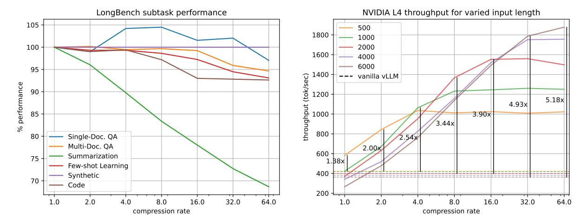

# 1 Introduction

Context length has become a key factor in the utility of LLM services with a growing number of providers offering 128k and up context windows. Context windows have been growing in the open-source model ecosystem as well, with the newest round of llama models natively supporting 131k context windows [\[4\]](#page-17-3) and third party finetuning continuing to expand context windows of models after release, even up to 1 million tokens [\[5\]](#page-17-4).

Supporting these longer context windows at a large scale is difficult since the number of key and value vectors (KVs) that must be cached when decoding a prompt scales with its total token length. This means that as the context length grows, the maximum batch size that can be used when decoding sequences of this length decreases proportionally. In deployments that are constrained by global GPU memory this can severely limit the system's total throughput, measured in generated tokens per second.

KV cache compression improves the scaling between context-length and KV cache memory by evicting a proportion of less-important KVs from cache. But despite a growing body of research in this space, the integration of these methods into efficient inference platforms such as vLLM and TRT-LLM has been slow.

Most existing methods determine the importance of KVs by comparing their aggregate attention over a number of observed queries. Early approaches use a running aggregate of attention from all past queries [\[6,](#page-17-5) [7\]](#page-17-6), while more recent work has aggregated attention from only the final prompt tokens within a limited *observation window* and seen improvements in overall performance as a result [\[8,](#page-18-0) [9\]](#page-18-1). We compare the both approaches, controlling for other

1Code is open-sourced and available at https://github.com/IsaacRe/vllm-kvcompress/tree/main

Figure 1: Llama-3.1-8B-Instruct performance for different rates of compression. 1a plots average LongBench subtask performance for each subtask category, measured as a percentage of the accuracy achieved without compression. 1b displays the throughput that can be achieved on an NVIDIA L4 for the same range of compression rates. Plots are shown for varying input lengths.

differences in implementation, and find that aggregating over all past queries outperforms an observation window in many LongBench [3] subsets, despite having a lower average performance rating. Results suggest that there is still room for improvement in state-of-the-art eviction methods by modifying the range of queries over which attention for a given key is aggregated when determining eviction.

Another commonality in prior work is the use of a uniform eviction rate across attention heads of the KV cache. Evicting the same number of KVs ensures that the size of each head's cache remains the same, limiting its fragmentation. Recent work has found that allowing the rate of eviction to vary across attention heads leads to improved performance and enables higher theoretical compression rates [1]. In current inference frameworks, however, a naive application of such an eviction scheme only increases fragmentation and is ineffective at reducing the KV cache memory footprint. We design a modification of PagedAttention [2] that can handle the KV cache fragmentation introduced by *variable-head-rate compression* and reduce memory footprint proportionally to the theoretical compression rate.

Building on this work, we introduce KV-Compress, a modification of Ada-SnapKV [1] that evicts KV *blocks*—rather than single KVs—making it compatible with our paged-attention framework. Our method includes further algorithmic improvements including a variable rate of eviction per layer, the use of *squared* past attention to inform evictions, and an extension to grouped-query-attention (GQA) models that handles their cache more effectively. Evaluation on both established benchmarks and state-of-the-art models demonstrates improved performance over existing compression methods.

Finally, we present an integration of our proposed KV cache compression strategy into vLLM and demonstrate that our method can be used to increase total throughput of state-of-the-art systems for LLM inference several times over when availability of global device memory is a bottleneck.

Our contributions are as follows:

- 1. An analysis of the effect that a limited observation window and its size have on compression performance.
- 2. We propose *query-group-compression*, a simple yet effective method to compress the KV cache of GQA models without repeating it into the dimension of total query heads, yielding an additional 4x compression over existing methods on Mistral and Llama-3.1 benchmarks.
- 3. An implementation of PagedAttention [2] that can represent and compute attention against KV cache containing variable numbers of KVs per head, making variable-head-rate compression practical.
- 4. Drawing from these findings we present KV-Compress, a modification of Ada-SnapKV [1] designed to compress a paged KV cache with variable rates of compression across layers and heads. Our method achieves state-of-the-art performance on the LongBench suite [3] for Mistral-7B-Instruct-v0.2 and Llama-3.1-8B-Instruct.

| -                               | Single-Doc. QA                                                                                        | Multi-Doc. QA            | Summarization                                                                                                  | Few-shotLearning                                                                                      | Synthetic                                                          | Code                                                                   |                                         |
|---------------------------------|-------------------------------------------------------------------------------------------------------|--------------------------|----------------------------------------------------------------------------------------------------------------|-------------------------------------------------------------------------------------------------------|--------------------------------------------------------------------|------------------------------------------------------------------------|-----------------------------------------|
|                                 | Nino Casper Mr. en                                                                                    | Hoporog Miking Alusique  | Correport AtultiNews                                                                                           | TREC Trivia CA MSINH                                                                                  | PCOUNT PRE                                                         | <                                                                      | Ave. Score                           |
| Full Cach                       | e 30.49 44.83 52.88                                                                                   |                          | 34.41 25.63 27.05                                                                                              | 72.50 91.65 43.70                                                                                     | 6.76 97.50                                                         | 63.39 56.73                                                            | 46.30                                   |
| H2O SnapKV Pyramid        | 25.98 29.21 41.47 <b>29.31</b> 30.39 48.04 28.86 30.72 48.90                                    | 51.26 41.35 27.27        | C=128 23.70 22.79 22.29 22.59 22.82 22.33 22.57 22.91 22.16                                           | 39.00 90.48 40.59 61.50 90.60 40.09 64.50 88.65 39.42                                           | 7.75 99.50 <b>8.25</b> 99.50 7.72 99.50                      | 56.41 48.18 <b>60.89</b> 50.80 56.73 49.38                       | 41.66 44.19 43.66                 |
| KVC                             | 29.25 <b>33.61 49.72</b>                                                                              | 52.64 44.05 27.53        | 23.90 23.48 22.91                                                                                              | 67.00 91.47 41.02                                                                                     | 7.00 <b>100.0</b>                                                  | 60.82 <b>53.10</b>                                                     | 45.47                                   |
| H2O SnapKV Pyramid KVC | 28.23 31.68 45.23 28.66 35.83 50.04 28.13 <b>38.49</b> 49.65 <b>28.91</b> 37.56 <b>51.73</b> | 52.32 42.02 <b>29.84</b> | C=256 25.18 22.59 23.41 24.38 <b>23.78</b> 23.71 24.28 23.63 23.80 <b>25.42</b> 23.48 <b>24.14</b> | 39.00 90.62 41.51 <b>70.00</b> 91.44 41.01 69.50 91.14 41.72 69.00 <b>91.86 42.17</b>        | 7.21 99.50 7.27 99.50 <b>7.50</b> 99.50 7.40 <b>99.50</b> | 59.86 50.11 61.88 53.20 60.47 53.76 <b>62.37 54.30</b>        | 42.78 45.93 45.97 <b>46.26</b> |
| H2O SnapKV Pyramid KVC | 28.48 34.42 46.85 <b>31.20</b> 40.69 51.60 30.58 40.57 52.54 30.68 <b>41.05 53.91</b>        | 53.40 42.63 29.33        | C=512 26.66 23.08 25.04 26.41 23.69 25.12 26.52 23.86 25.22 27.32 23.87 25.36                      | 41.00 91.63 41.26 70.50 91.73 41.33 70.00 <b>92.09</b> 41.70 <b>71.50</b> 91.86 <b>42.94</b> | <b>7.44</b> 99.50 7.72 99.50 7.29 99.50 7.29 <b>99.50</b> | 61.57 51.60 63.62 55.48 62.68 54.02 <b>64.18 56.51</b>                 | 43.70 47.12 46.92 <b>47.69</b> |
| H2O SnapKV Pyramid KVC | 28.43 38.86 48.95 30.37 44.85 52.20 <b>31.04 45.59</b> 52.93 30.64 43.56 <b>53.94</b>        | 52.87 <b>44.99</b> 28.87 | C=1024 28.49 23.87 26.19 <b>29.12</b> 24.33 26.40 28.67 <b>24.42 26.45</b> 29.11 24.10 26.28       | 45.50 91.66 42.32 70.00 91.73 43.03 70.00 91.65 42.74 <b>72.00 91.76 43.04</b>               | <b>8.11</b> 99.50 7.45 99.50 8.10 99.50 7.55 <b>99.50</b> | 63.18 54.50 64.11 56.57 <b>64.47</b> 56.36 64.35 <b>57.95</b> | 45.21 47.90 48.09 <b>48.27</b> |

Table 1: Comparison for Llama-3.1-8B-Instruct over 16 LongBench subsets. Highest score for each column shown in bold. For cache size of C, all baseline methods keep  $C \times 32 \times 32$  KVs in cache while our method (KVC) keeps only  $C \times 32 \times 8$  KVs. Table format taken from [1].

5. We provide an integration of our method with vLLM and present the first end-to-end benchmarks of an eviction-based KV cache compression method within a paged-attention-enabled framework for efficient LLM inference, to the best of our knowledge. Results demonstrate increased throughput by factors of up to 5.18x.

## 2 Related Work

#### 2.1 KV Cache Quantization

Prior works on KV cache compression attempt to reduce the memory footprint of the KV cache of a transformer language model to enable faster inference over longer contexts. One common approach is KV cache quantization, where compression involves converting all KVs in cache to a reduced-precision representation [10, 11, 12]. On the other hand, eviction-based methods reduce cache size by removing KVs that are identified as inconsequential to future decoding. In this work we limit our analysis to methods of the latter category.

## 2.2 Token Pruning

Earlier work has shown that sparsity in the attention mechanism of transformer-based language models can be leveraged to reduce the number of tokens processed across all layers of the model [13]. The tokens selected for pruning should be inconsequential—meaning the degree of attention to their keys is low—so that their removal does not adversely affect the output.

One approach is to prune tokens in a layer-wise manner during the initial processing of an input context [14]. At each layer, attention allocated to input tokens is summed over all attention heads and the generated KVs for the tokens with lowest total attention are removed. This has the advantage of speeding up input processing as well as decoding, but has the potential for error to compound as pruning decisions made at earlier layers do not account for the attention in the later layers they are affecting.

