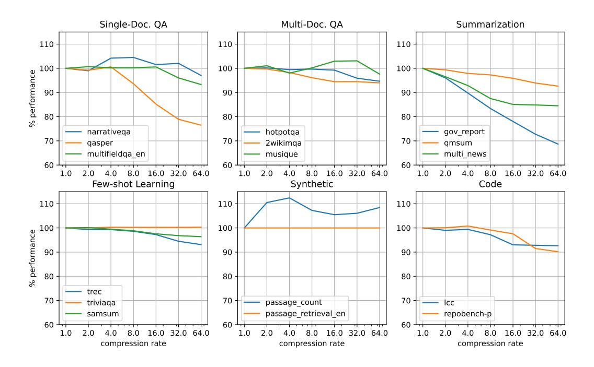

# 2.3 KV Eviction

Since the advent of LLMs and long-context there has been increased interest in methods that prune KVs from cache *after* input processing, or "prefill", with a focus on more efficient decoding. Evicting KVs from cache lowers its memory footprint, enabling the support of larger batches/context windows, and can speed up decoding as the number of KVs to retrieve when computing attention is reduced.

Approaches vary in where/when KV pruning is applied, but most rely on an aggregation of attention that a particular key–or group of keys–has received over past queries. This metric is used when considering KVs for removal from cache, with KVs who receive the least attention being removed first.

Full Observation Window H2O [\[7\]](#page-17-6) determines evictions based on a running sum of attention each KV has received, evicting KVs with the lowest total attention and retaining "heavy-hitter" KVs that receive the most attention. In this case the token positions of evicted KVs are allowed to vary, but the total number of evicted KVs across all layers and heads is fixed. Scissorhands [\[6\]](#page-17-5) follow a similar approach, but evict based on a metric of how "pivotal" each KV is–framed as the number of the occurrences where attention with that key has exceeded some threshold. Like H2O, they evict the same number of KVs across attention heads, but vary eviction rate across layers proportionally to a "persistence ratio" determined by an initial profiling phase. FastGen [\[15\]](#page-18-7) combines the "heavy-hitter" approach of H2O with heuristic eviction policies that retain only KVs for special tokens, punctuation or local attention, profiling attention over the input prompt to determine which strategy to employ.

Though decoding-time efficiency can be improved by these techniques, the preliminary task of aggregating attention of each key over all queries can make prefill prohibitively expensive as doing so requires writing the full attention matrix to global memory. Efficient attention implementations such as Flash Attention [\[16\]](#page-18-8) explicitly avoid this in order to speed up inference and reduce global memory requirements. Because of this, performance gains made at decoding time from employing such approaches are unlikely to outweigh the performance loss experienced during prefill, especially for long contexts.

Limited Observation Window SnapKV [\[8\]](#page-18-0) mitigates this issue by limiting the aggregation to queries generated for the final tokens of the input prompt. This limited observation window reduces scaling of the eviction metric calculation from O(L 2 ) to O(L) and improves accuracy of the compression. To improve accuracy of eviction metrics obtained from their limited observation window the authors apply maxpooling over the sequence dimension, so that keys neighboring a heavy-hitter of the same attention head are retained as well. This approach works well for prompts consisting of long context followed by a request or question since the attention patterns observed over the prompt queries–occurring within the observation window–are generally similar to those exhibited by queries in the generated response. Like H2O, they allow different eviction schedules to be specified per layer and head, but require that the number of KVs evicted for each layer and head be the same.

Following this work, PyramidKV [\[9\]](#page-18-1), adopts the limited observation window of SnapKV but configures variable rates of eviction per layer. The authors recognize that attention is more evenly distributed at early layers, motivating them to configure lower eviction rates at early layers and evicting more aggressively at later layers. The exact eviction rate is determined initially for the first and last layers during a profiling phase, and eviction rates for remaining layers are inferred using a novel interpolation technique.

Variable-Head-Rate Eviction More recent work has identified a key point of rigidity in prior methods–namely, a uniform compression rate across all the heads within each layer [\[17,](#page-18-9) [1\]](#page-17-0). One such approach develops variations of both SnapKV and PyramidKV that evict KVs *across* heads in each layer, potentially evicting a variable number of KVs per head, naming the new methods Ada-SnapKV and Ada-PyramidKV, respectively [\[1\]](#page-17-0). They find that this modification yields improved performance–measured over 16 subsets of LongBench [\[3\]](#page-17-2)–for both approaches. Their reported results remain theoretical, however, since existing inference frameworks cannot efficiently represent a KV cache with variable number of KVs per head without suffering from memory fragmentation. As a result, evicting along one head without evicting along all other heads only adds fragmentation to the allocated tensor without reducing its footprint in device memory. Our approach uses a modification of PagedAttention to represent and compute attention over a paged KV cache where the fragmentation added by variable-head-rate eviction is reduced, allowing us to realize the theoretical compression rate in physical memory.

Dynamic Memory Compression [\[17\]](#page-18-9) introduces a learned approach where the base model is trained to either add each new KV to cache or "accumulate" it into an existing KV slot via a weighted average, where decisions are made separately across heads. At inference time their approach uses PagedAttention to efficiently facilitate attention over variably compressed attention heads.

Figure 2: Llama-3.1-70B-Instruct-FP8 performance for different rates of compression. 2a plots average LongBench subtask performance for each subtask category, measured as a percentage of the accuracy achieved without compression. 2b displays the throughput that can be achieved on an NVIDIA H100 for the same range of compression rates. Plots are shown for varying input lengths.

Related to these approaches, ThinK [18] was developed to prune the channels of remaining KVs after other eviction-based compression methods have been carried out. The method achieves an additional 30-40% compression before observing further performance degradation.

#### 3 Preliminaries

The methods outlined in this paper build off of prior work around KV cache compression and their application is made possible through a modification of PagedAttention [2]. We will briefly go over these topics before diving into our methodology.

#### 3.1 Multi-head Attention

Transformer decoders use attention layers to build a contextualized representation of an input sequence before sampling the next token. Attention operates on sequences of query, key and value vectors, Q, K and V. The attention matrix for a sequence is computed as

$$A = \operatorname{softmax} \left( QK^T / \sqrt{d} \right) \quad \text{for } Q_{L \times d} , K_{L \times d} , V_{L \times d}$$
 (1)

where L is the sequence length and d is the magnitude of the q, k, v vectors. The attention output is then computed as the inner product of the attention matrix and V. Causal masking is applied before the softmax, so that

$$\left(QK^T/\sqrt{d}\right)_{ij} = -\inf , \quad \forall i < j , \qquad (2)$$

making A lower-triangular after applying the softmax.

In practice, most transformer models employ *multi-head attention* (MHA), where attention occurs in parallel over a series of H attention "heads". In this case, a separate set of queries, keys and values are computed for each head so that A has shape  $H \times L \times L$ .

## 3.2 Paged Attention

When conducting LLM inference, key vectors and value vectors (KVs) are generated for every attention head at each layer to be used when computing the attention output for all future tokens of that layer and head. During decoding it is common to cache these KVs to avoid recomputing them during each decoding step. In the simplest case, the key and value cache for each layer takes the shape  $B \times H \times L \times d$  where B is the decoding batch size, H is the number of

Figure 3: Comparison of block management in vanilla vLLM versus with KV-Compress. In vLLM (left) each cache block stores KVs for every attention head of every layer, while with KV-Compress (right) each block only holds KVs for a single head. The KV-Compress block tables are therefore expanded by  $l \times H$  so that the unique block for each specific KV head and layer can be retrieved. Due to the larger number of blocks, we move block management to the GPU so scheduling operations can be done in parallel. Note that every cell of KV cache in the above diagram represents a d-dimensional vector, while all others represent scalars.

attention heads, L is the current max sequence length and d is the magnitude of key and value vectors. In this case total memory allocation scales with the maximum sequence length in the decoding batch and the more that sequence length varies across batch elements, the more fragmentation is introduced and the less efficient global memory utilization is.

PagedAttention [2] solves this problem by introducing a paged KV cache where physical memory is allocated in *blocks* of size *b*, such that each block contains KVs across all heads for *b* tokens of a particular sequence and we only allocate KVs blocks for each sequence's currently generated KVs. This approach is used inference frameworks such as vLLM, and is depicted in figure 3 (left).

PagedAttention uses a block table, T with shape

$$B \times \frac{L_{\text{max}}}{b}$$
, (3)

where  $L_{\rm max}$  is the maximum allowed sequence length, to index into the corresponding KV cache block for each block of a given sequence. Because each token generates a single key and value vector for every attention head of every layer, the layout of KVs is identical across all layers and heads. PagedAttention, therefore, uses a shared index to reference a particular token's KVs across all layers and heads of the paged KV cache, so that a single cache block contains the set of KVs generated across all layers and heads for each token in that block. Each block then contains  $l \times H \times b$  key and value vectors, where l is the number of layers in the model. The physical key cache, K, and value cache, V consist of l tensors, each with shape  $N \times H \times b \times d$ , where N is the total number of allocable cache blocks.

To retrieve key and value vectors, k and v for layer m and head k of a token in sequence s at position i in the paged KV cache, you first retrieve the block number for the physical cache block containing that token's KVs. This can be done by computing

$$n = T_{s,u}$$
 for  $u = \left\lfloor \frac{i}{b} \right\rfloor$  . (4)

We then index into our physical cache with

$$k = K_{n,h,o}^{(m)}$$
,  $v = V_{n,h,o}^{(m)}$  for  $o = i \mod b$  (5)

where  $K^{(m)}$  and  $V^{(m)}$  are the physical key and value cache of layer m, respectively and o is the positional offset of token i within block n. With this approach the number of allocated but unused KV slots is at most lBH(b-1) and variance in the context lengths of sequences in the decoding batch does not increase cache fragmentation.

Since the memory allocation for every sample in a batch is no longer fixed, batch size can be scaled dynamically based on the token length of batch elements. To handle this dynamic scaling, frameworks will generally perform an initial scheduling step to determine whether new input prompts can be prefilled and added to the decoding batch or whether current batch elements need to be preempted to make room for new decoded tokens. In vLLM, during the scheduling step a *block manager* allocates available blocks of cache to store new tokens that will be generated during the next prefill or decoding step. If there are no available blocks, one or more sequences will be selected for preemption and the block manager will free their allocated blocks. The block manager tracks running context length of all sequences in the decoding batch and manages a list of free and allocated blocks to determine scheduling and preemption of sequences during each scheduling step. Because block tables generally reside in system memory, scheduling can be CPU intensive for large batch sizes.

#### 3.3 KV Cache Compression

KV cache compression has been explored as another means to handling KV cache memory allocation more efficiently, by evicting KVs in cache that are predicted to receive low attention in the future and can therefore be removed with negligible impact on the output. By removing a constant number of KVs from each attention head of a given layer's KV cache the *L*-dimension of the KV cache tensor for that layer can be decreased and total memory allocation reduced.

For a particular compression scheme, its compression rate is commonly defined as the ratio of KVs in cache before compression to KVs in cache after compression. In past work, the number of KVs in cache is usually fixed during experimentation using a configured number of maximum cache tokens, C. In such cases the number of KVs in cache is limited to the number of KVs that would be generated by the model if a prompt of length C were to be processed and cached without compression.

To determine which KVs to evict, a metric is employed to predict the effect that removing a given KV will have on the inference given the attention observed between that key and queries within some range. A commonly used eviction metric is a sum over attention of past queries to each key. H2O and SnapKV both take this approach, with H2O aggregating attention over all observed queries and SnapKV aggregating attention over only the last w prompt queries.

We can define the metrics obtained from aggregating over attention of all queries as

$$M_{hj}^{(full)} = \sum_{i} A_{hij} \tag{6}$$

and can define the metrics obtained from aggregating over a limited observation window spanning the last w prompt queries as

$$M_{hj}^{(w)} = \sum_{i=s}^{L} A_{hij} , \quad \text{for } s = L - w .$$
 (7)

Keys within the observation window are safe from eviction since they will have fewer attention observations to sum over due to the causal masking of A.

SnapKV applies additional max-pooling over L to improve performance, computing metrics as

$$M_{h,j}^{(pool)} = \max_{t=j-p/2}^{j+p/2} M_{h,t}^{(w)}$$
(8)

for pooling size p.

Running the compression for a particular layer involves sorting M along the sequence length dimension and then selecting KVs corresponding to the first e metrics along each attention head for eviction. The compressed cache can then be obtained by concatenating the remaining key and value vectors along each attention head, yielding a tensor of shape  $H \times (L-e) \times d$ .

Figure 4: Llama-3.1-8B-Instruct percent of full-cache performance by compression rate on all LongBench subtasks. Results are grouped by subtask category.

