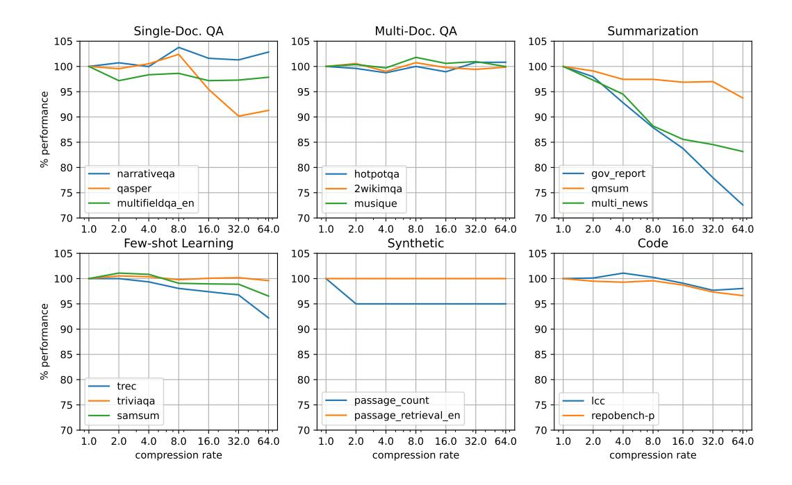

# 4.2.3 Limiting Overhead

The main source of overhead in our compression algorithm comes from sorting over KV metrics. We use PyTorch's *sort* API to compute each compression step where a reordering is required. These calls add overhead in the form of an increased memory footprint and added latency during compression. From profiling on an NVIDIA L4, we observe an additional memory allocation of around 8 times the size of the sorted tensor, and find that runtime begins to scale linearly when size exceeds 1.7e8. To both minimize the memory that needs to be reserved for the sort operations and prevent them from exhausting GPU resources we limit the number of KVs that can be compressed during a given compression iteration, as each KV corresponds to an element in the metrics tensor that will need sorting.

Whenever a round of compression is initiated, we iterate over the current set of running sequences, ordered by time of last compression (with uncompressed sequences coming first), adding to the compression batch and tracking the total number of KVs currently allocated to sequences in this batch as we go. When we encounter a sequence that would cause the batch's total allocated KVs to exceed our configured limit, we discard it and move forward with compression of the current batch of selected sequences.

Setting this limit too low can prevent sequences from being scheduled for compression if their total number of allocated KVs exceeds it. A simple solution is to configure the limit to be at least equal to  $L_{\rm max} \times l \times H$ , where  $L_{\rm max}$  is the maximum supported input token length. This ensures that the total number of KVs generated for a sequence at any given point stay below the compression limit, so that its compression is guaranteed once all other sequences have been compressed.

To further reduce overhead we seek to limit the number of compression iterations that occur, relative to the number of model forward passes. We identify several approaches to controlling the scheduling of compression steps:

Figure 6: Llama-3.1-70B-Instruct-FP8 percent of full-cache performance by compression rate on all LongBench subtasks. Results are grouped by subtask category

- 1. Compress every c model iterations, for some fixed compression interval, c.
- 2. Compress whenever the count of total uncompressed tokens passes some threshold.
- 3. Compress when one or more sequences are newly prefilled.
- 4. Compress when we would otherwise be forced to preempt a running sequence.

After experimenting with these approaches, we find the combination of [3](#page-12-0) and [4](#page-12-1) to be the most effective, and use this in our final method.

## 4.3 Metric Calculation

In this section we discuss in detail our method for computing the metrics for each KV that are used to determine our eviction schedule.

Squared Attention Metric Most prior work sum attention values between each key and queries within the observation window to get each KVs eviction metric. In this case the eviction schedule can be thought of as attempting to minimize L1 error in future attention. Alternatively, we can seek to minimize the *L2* error over future attention by using a sum of squared attention to compute eviction metrics. We experiment with both approaches and find that squared attention perform better, so we take this route in our approach.

Observation Window In prior work, aggregating attention to compute KV metrics for eviction has had two approaches: Aggregate over all past observed KVs, as in H2O; or aggregate over a partial window of queries as in SnapKV. To explore the tradeoffs of these two approaches, we design two distinct versions of our method.

*KVC-full* aggregates squared attention over all observed queries. We find it beneficial to exclude queries of the first v tokens following that KV's token from the aggregation, as the local attention patterns that occur between keys and queries within close proximity of one another are generally not representative of the attention patterns that will occur between the same key and future queries to that are generated outside of that key's immediate locality. We adapt equation [9](#page-8-0) to define our metrics as

$$M_{h_k,j}^{(full)} = \sum_{i=j+v}^{L} \sum_{h \in H_k} (A_{hij})^2 , \quad \text{for } H_k = \{ \ \forall \ h : rh_k \le h < r(h_k+1) \ \}$$
 (19)

for an excluded query window, v.

*KVC-w* aggregates squared attention over queries within a limited observation window of final tokens of the input prompt. Metrics are computed following equation [8,](#page-6-2) with the slight modification of squaring the attention values before summation.

Continual Compression Our compression method can be easily adapted to conduct KV cache compression during decoding, either during regular intervals of decoding steps or on an as-needed basis. When compression is continued during decoding, we accumulate squared attention from queries of newly generated tokens directly into the KV metrics computed during prefill. In this case the metric for a KV generated at position j at decoding step t is given by

$$M_{k_h,j}^{(cc)} = M_{h_k,j}^{(pool)} + \sum_{i=L_c}^{L_c+t} \sum_{h \in H_k} (A_{hij})^2 , \quad \text{for } H_k = \{ \forall h : rh_k \le h < r(h_k+1) \}$$
 (20)

where Lc is the length of input context and M(pool) is the set of metrics computed during prefill.

