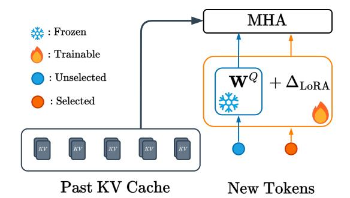

# 3 Key-Value Distillation

We consider a transformer-based language model (Vaswani et al., 2017), denoted by LM, that is defined on the vocabulary  $\mathcal{V}$ . The KV-DISTILL process is then: (1) a set of important tokens in the input context is determined; (2) an adapted language model LM $_{\theta}$  is used to encode the context into a KV cache, and sub-select the aforementioned important tokens from the generated KV cache; and (3) the unmodified LM conditions on the compressed KV cache to auto-regressively generate it's output.

#### 3.1 State Selection for Cache Compression

Let  $\mathbf{c} = \{w_i\}_{i=1}^N$  represent a context consisting of N tokens, where  $w_i \in \mathcal{V}$  and  $\vec{c} \in \mathcal{V}^N$ . In a typical scenario, LM predicts a sequence of new tokens, denoted by  $\vec{y}$ , conditioning on  $\mathbf{c}$ . For example,  $\mathbf{c}$  may be a prompt and LM generates  $\vec{y}$  as a response. Future token prediction draws on information from past tokens via *attention* by having LM encode the context tokens into key and value hidden states

 $\vec{X}_l^{(K)}, \vec{X}_l^{(V)} \in \mathbb{R}^{N \times d}$ , which taken together form the KV cache (Section 2.1), where d is the dimension of the transformer and l is the layer of LM. We may drop the subscript l and superscripts  $^{(K)}$  and  $^{(V)}$  and use  $\vec{X}$  to generally denote the key/value states of transformers at any layer.

Transformers assume that  $\vec{X}$  fully describes and represents the context  $\vec{c}$ . However, attending to  $\vec{X}$  can be inefficient when  $\vec{c}$  is long. Therefore, we further assume that retaining a subset of key/value states is sufficient for approximating the next-token distribution conditioned on all key/value states. That is, we could retain rows from  $\vec{X}$  to form  $\tilde{\vec{X}} \in \mathbb{R}^{k \times d}$ , where  $k \leq N$  is the number of selected rows. We use a subset of the tokens' hidden states to represent the complete context, which is plausible because representations in  $\tilde{\vec{X}}$  are conditioned on the prior context. Suppose we determine the  $(i_1,\ldots,i_k)$ -th tokens are to be retained in layer l. We use a hard selection matrix  $\vec{S}_l \in \{0,1\}^{k \times N}$  to derive (layer-specific)  $\tilde{\vec{X}}_l$  from  $\vec{X}_l$  by

$$\tilde{\vec{X}}_l = \vec{S}_l \vec{X}_l, \quad \vec{S}_l = [\vec{e}_{(i_1)}, \dots, \vec{e}_{(i_k)}], \quad (1)$$

where  $\vec{e}_{(i)} \in \{0,1\}^N$  is the *i*-th standard basis vector. Note that this formulation does not require that the same tokens be selected across each layer.

The problem of determining which indices  $(i_1, \ldots, i_k)$  to retain still remains. We would like the subselection  $\vec{S}$  to retain most of the context information given a fixed k. One possibility is to use a feedforward neural network to measure the importance of each token position:

$$\vec{s} = \text{FFN}_{\theta} \left( \vec{X'}_{\eta} \right) \tag{2}$$

where  $\theta$  is the parameters of the FFN,  $\vec{s} \in \mathbb{R}^N$  and  $\vec{s}_i$  indicate the "importance score" of the i-th token and  $\vec{X}'_{\eta}$  indicates the hidden states at the  $\eta$ -th layer. The indices  $i_{1:k}$  can then be derived by taking the tokens with the top-k scores. We can control the percent of the KV cache retained by scaling k with the length of the context. In our we retain the same  $i_{1:k}$  across all layers and take  $\eta=6$ .

The above selection procedure is rendered non-differentiable by the top-k operator. We may propagate gradients to the scorer by decaying the attention weights of tokens attending to  $\tilde{\vec{X}}$  inversely proportionally to their computed importance scores. More precisely, let  $\vec{z} \in \mathbb{R}^d$  represent the hidden

Figure 2: Selected tokens are routed to trainable, LoRA-adapted  $\vec{W}^Q$  and  $\vec{W}^O$  matrices ( $\vec{W}^O$  is omitted in this figure); all other tokens pass through the original (frozen) model parameters.

state of a single token attending to  $\vec{\tilde{X}}$  with unnormalized attention weights  $\alpha$ :

$$\alpha = \left(\vec{z}\vec{W}^{Q}\right)\left(\tilde{\vec{X}}^{(K)}\right)^{\top} \tag{3}$$

we decay  $\alpha$  to produce scorer-informed attention weights  $\alpha'$ :

$$\alpha' = \sigma(\vec{s}) \odot \alpha, \tag{4}$$

where  $\odot$  denotes the element-wise (Hadamard) product and  $\sigma$  the sigmoid function. We note that the above formulation is one of many possible scoring functions that can be used with KV-DISTILL, that could be learnable or parameter-free, and could potentially have layer-wise specificity. We leave exploring different scoring functions as future work.

#### 3.2 Architecture

After sub-selecting important token indices, we pass the context  $\vec{c}$  through a modified  $LM_{\theta}$  that uses conditional computation to condense the context into  $\tilde{X}$ . This allows for the representations of important tokens to be "packed" with information from unselected tokens, and is strictly more expressive than only subselection. We instantiate  $LM_{\theta}$  with LoRA adaptors (Hu et al., 2022) to minimize the number of trainable parameters.

More importantly, within  $LM_{\theta}$ , the subselected tokens are routed to trainable  $\vec{W}^Q, \vec{W}^O$  matrices, where  $\vec{W}^Q, \vec{W}^O$  are the query and output matrices of transformers, while discarded tokens are routed to the original (frozen) matrices, as shown in Figure 2. This has the effect of informing  $LM_{\theta}$  as to which tokens are selected, allowing for specialized aggregation of the value representations for selected tokens. This method of informing  $LM_{\theta}$  has minimal overhead (the LoRA matrices account for

under 500MB of GPU memory for a 27B parameter model), and only a single set parameters must be maintained in memory.

We anticipate that other architectural forms could make KV-DISTILL effective. However, we find that applying conditional computation to inform LMθ of selected tokens is important to the performance of KV-DISTILL . We find that some methods of informing the model of selected tokens, such as by adding a trainable embedding to these tokens, do not work well (see Appendix [B\)](#page-10-0). The particular architecture chosen has the advantage of lower memory usage during training, and provides excellent performance. We leave the task of finding even more efficient architectures to future work.

### 3.3 Objective Function

After generating compressed cache ˜X⃗ , we aim to match the output of LM when conditioned on ˜X⃗ to the output of LM when conditioned on X. Previous compression methods [\(Ge et al.,](#page-8-8) [2024;](#page-8-8) [Qin](#page-8-13) [and Van Durme,](#page-8-13) [2023\)](#page-8-13) rely on the autoencoding objective to pretrain LMθ. However, given that LM predicts future tokens during inference, there is a discrepancy in pretraining and downstream usage, which could result in performance loss. Instead we propose matching the next-token probability distribution of tokens conditioned on X⃗ and ˜X⃗ . Consider a generative language model that predicts the next token ⃗yt conditioned on the past tokens ⃗y<t and a fixed context ⃗c that is represented by either X⃗ or ˜X⃗ . We would like to minimize the difference between their next-token distributions, i.e. p ⃗yt | ⃗y<t, X⃗ and qθ ⃗yt | ⃗y<t, ˜X⃗ . Let qθ indicate the distribution that conditions on the distilled KV cache ˜X⃗ . Also note that the only learnable parameters in this formulation arise from *encoding* ˜X⃗ ; during auto-regressive generation we use the original frozen parameters of LM.

Given probability distributions p, qθ, we use the forward and reverse KL divergences to measure their similarity. With simplified notations we have:

$$\mathcal{D}_{\mathrm{KL}}(p||q_{\theta}) = \mathbb{E}_{y \sim p(\cdot)} \left[ \log \left( \frac{p(y)}{q_{\theta}(y)} \right) \right]$$

$$\mathcal{D}_{\mathrm{KL}}(q_{\theta}||p) = \mathbb{E}_{y \sim q_{\theta}(\cdot)} \left[ \log \left( \frac{q_{\theta}(y)}{p(y)} \right) \right] \quad (5)$$

The mode-seeking and mean-seeking behavior of the reverse- and forward- KL divergences respectively is well known. To incorporate both behaviors

into the objective, we sum the forward and reverse divergences:

$$\mathcal{L}(\theta) = \lambda \cdot \mathcal{D}_{KL}(p||q_{\theta}) + (1 - \lambda) \cdot \mathcal{D}_{KL}(q_{\theta}||p), (6)$$

where a hyperparameter λ controls the balance between forward and reverse KL divergence.

Given both p and qθ are categorical distribution, both KL divergences in eq. [\(5\)](#page-4-0) can be analytically solved. Tthe L1-norm of the gradient of the reverse divergence dominates nearly everywhere. As such we propose scaling the forward and reverse terms by having λ > 0.5 in eq. [\(6\)](#page-4-1). The benefit of λ is confirmed with the ablations in Appendix [B.](#page-10-0)

## 4 Experiments

To assess the efficacy of KV-DISTILL , we conduct experiments on LLAMA-2 7B, LLAMA-3 8B, MIS-TRAL 7B,GEMMA-2 9B and GEMMA-2 27B. In all cases we use the instruction-tuned model. A KV-DISTILL model is obtained by distilling on a large corpus to obtain strong general-purpose context compressors.

Data We curate a large instruction dataset from Self-Instruct, P3, LongAlpaca, and Super-Natural Instructions [\(Soboleva et al.,](#page-9-7) [2023;](#page-9-7) [Wang et al.,](#page-9-8) [2022a;](#page-9-8) [Sanh et al.,](#page-9-9) [2021;](#page-9-9) [Chen et al.,](#page-8-14) [2023;](#page-8-14) [Wang](#page-9-10) [et al.,](#page-9-10) [2022b\)](#page-9-10). Training instances are split into (Context, Instruction, Answer) triples. In cases where the context is sufficiently long (more than 1536 tokens), we pad to a multiple of 1536 and fold the context to a batch of N × 1536 instances, compress the resulting KV cache, and then unfold the cache. Empirically, we observe little performance degradation when applying folding during pretraining, while allowing the model to see longer examples. We also always leave the first few (< 10) tokens of the context uncompressed, as we find that retaining them improves performance; this is not a new observation, see [Han et al.](#page-8-15) [\(2024\)](#page-8-15) and [Xiao](#page-9-11) [et al.](#page-9-11) [\(2023\)](#page-9-11).

Training The general training procedure is as follows: (1) pass the (Context, Instruction, Answer) triple through the original model to obtain target logits, (2) apply the KV-DISTILL architecture to obtain logits conditioned on the compressed cache (we compress the context, and leave the instruction uncompressed), (3) apply Equation [6](#page-4-1) between the obtained and target logits.

We use rank-stabilized LoRA on the Q, K, V, O matrices with r = 128 to train LMθ [\(Hu et al.,](#page-8-12) [2022;](#page-8-12) [Kalajdzievski,](#page-8-16) [2023\)](#page-8-16). Note that the K, V

Figure 3: Needle-in-a-Haystack results; The x-axis shows the length of the document, the y-axis indicates the compression ratio applied, and the color the accuracy of retrieval under those settings averaged across different locations in the document. Left: H2I. Right: KV-DISTILL .

are trainable for all tokens, not just selected tokens. The behavior of the Q, O adapters is discussed in Section [3.2.](#page-3-1) Optimization is done using Deepspeed Stage 2, and the AdamW optimizer [\(Rasley et al.,](#page-9-12) [2020\)](#page-9-12). During pretraining, we sample KV retention fractions between 0.1-80%. As such, all KV-DISTILL models support arbitrary retention rates. All models are distilled on a cluster of 8 NVIDIA A100 80GB GPUs. All models except GEMMA 27B converged within 3 days, while GEMMA 27B took 4 days. See Appendix [A](#page-9-13) for further details.

| Dataset   | Average | Max |
|-----------|---------|-----|
| SQuAD     | 225     | 1k  |
| QuALITY   | 6k      | 9k  |
| SQuALITY  | 7k      | 11k |
| GovReport | 10k     | 71k |

Table 1: Evaluation dataset example length statistics in tokens under the LLAMA-3 tokenizer

Evaluation In all datasets, we have a natural (Context, Question) pairing. We always compress the context and leave the question uncompressed. Evaluations are performed with greedy decoding. Summary statistics regarding the context length of evaluation dataset are provided in Table [1.](#page-5-0)

Methods Tested We evaluate against DODO [\(Qin](#page-8-7) [et al.,](#page-8-7) [2024\)](#page-8-7), ICAE [\(Ge et al.,](#page-8-8) [2024\)](#page-8-8), and H2 in both the question-aware (H2A) and questionindependent (H2I) forms. Please refer to Sec [2.2](#page-1-1) for further description about the selected methods. To improve the performance of H2 , we also retain a set of sink tokens as described in [Xiao et al.](#page-9-11) [\(2023\)](#page-9-11).

### 5 Results

## 5.1 Needle-In-a-Haystack

Motivation The Needle-in-a-Haystack test [\(Kamradt,](#page-8-17) [2023\)](#page-8-17) evaluates a model's ability to accurately retrieve information from a sentence (a "needle") embedded within a large document (a "haystack"), in which a sentence is randomly positioned. In our experiments, the needle is a semantic one. In Figure [3,](#page-5-1) we show the results of H2I (left) and KV-DISTILL (right) at various compression ratios at different document lengths. The accuracy is computed across the placement of the needle within a document. Crucially, at compression time, the model does not know that a is needle being sought, nor that a needle is placed within the context.

Results We see that KV-DISTILL significantly outperforms H2I at almost all compression ratios and document lengths. In particular, KV-DISTILL demonstrates near-perfect accuracy even after removing 90% of the KV .

### 5.2 Extractive Question Answering

Motivation SQuAD is an extractive questionanswering task. We hypothesize that extractive tasks will suffer the largest performance loss under context compression. As such, we choose to use performance on SQuAD as a proxy for generalpurpose compressive ability of a model. In all the following experiments, we choose the pretraining checkpoint with the best SQuAD performance for further experimentation. To assess accuracy we generate an answer conditioned on the compressed context, checking if the generated response is contained in the ground-truth answer.

| Model      |                          | % KV                     | 0-Shot Acc.                                         |
|------------|--------------------------|--------------------------|-----------------------------------------------------|
| LLAMA3     | BASE                     | 100%                     | 87.6 ± .6%                                          |
|            | KVD KVD               | 25% 20%               | 86.6 ± .7% 86.0 ± .7%                            |
|            | H2A H2A H2I H2I | 25% 20% 25% 20% | 84.0 ± .7% 83.0 ± .7% 56.6 ± .9% 51.7 ± 1% |
|            | DODO                     | 20%                      | 73.3 ± .8%                                          |
| LLAMA2 7B  | BASE                     | 100%                     | 82.5 ± .7%                                          |
|            | KVD KVD               | 25% 20%               | 79.1 ± .8% 77.6 ± .8%                            |
|            | H2A H2A H2I H2I | 25% 20% 25% 20% | 77.9 ± .7% 76.7 ± .7% 55.2 ± .9% 50.3 ± 1% |
|            | ICAE                     | 57%                      | 75.0 ± .8%                                          |
| GEMMA 9B   | BASE                     | 100%                     | 85.15 ± .7%                                         |
|            | KVD KVD               | 25% 20%               | 84.55 ± .7% 83.1 ± .7%                           |
| GEMMA 27B  | BASE                     | 100%                     | 85.3 ± .8%                                          |
|            | KVD KVD               | 25% 20%               | 83.1 ± 1% 82.2 ± 1%                              |
| MISTRAL 7B | BASE                     | 100%                     | 87.1 ± .6%                                          |
|            | KVD KVD               | 25% 20%               | 84.1 ± .7% 82.5 ± .7%                            |

Table 2: Zero-shot accuracy on SQuAD at selected KV retention ratios.

Results Table [2](#page-6-0) contains SQuAD accuracy results. We see that in all cases, KV-DISTILL models perform within a few percentage points of base models, even under a "worst-case" task. Furthermore, KV-DISTILL models significantly outperform prior trainable methods (ICAE, DODO), even when retaining less of the KV cache. KV-DISTILL models significantly outperform H2I, demonstrating the ability of the pretraining objective and architecture to create reusable compressed KV representations. KV-DISTILL models also enjoy a slight improvement over H2A at similar compression ratios, demonstrating the effectiveness of its compression at capturing almost all salient information in the context, even without question-awareness.

When retaining under 20% of KV , we observe rapid declines in performance across all methods, indicating the difficulty of the task under high context compression. Lastly, we note that initial pretraining hyperparameters for all models were set based on initial experimentation with LLAMA-3 and SQuAD; as such, we anticipate that perfor-

Figure 4: QuALITY accuracy against compression.

mance of most models can be improved with hyperparameter tuning during the pre-training process.

### 5.3 Long Context Question Answering

Motivation QuALITY is a long document multiple-choice question answering dataset that assesses reading comprehension. We use QuAL-ITY to assess the decision making capabilities of models equipped with distilled contexts. To assess QuALITY accuracy, we use the same evaluation procedure used by LLAMA-3 [\(AI@Meta,](#page-8-18) [2024\)](#page-8-18). Results Figure [4](#page-6-1) shows the experiment results on QuALITY, with data points at the following retention rates highlighted: {100%, 25%, 20%, 10%, 5%, 1%, 0.1%}. We observe that KV-DISTILL performs similarly to the uncompressed cache, with only minor losses in performance at 10x compression. Although not included in Figure [4,](#page-6-1) 0% cache retention results in accuracy of 32.4%, 25.8%, and 24.4% for the LLAMA-3, MISTRAL,

