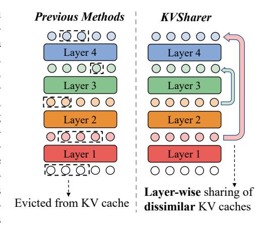

# 1 INTRODUCTION

Recently, large language models (LLMs) built on the Transformer [\(Vaswani et al., 2017\)](#page-12-0) architecture have demonstrated remarkable abilities across a wide range of tasks [\(Touvron et al., 2023;](#page-11-0) [Cai et al.,](#page-10-0) [2024;](#page-10-0) [Yang et al., 2024a;](#page-12-1) [Brown, 2020;](#page-10-1) [Jiang et al.,](#page-11-1) [2023\)](#page-11-1). However, these impressive capabilities usually come with a significant increase in model size, resulting in substantial GPU memory costs during inference. The memory consumption of LLM during inference primarily comes from model parameters and the KV (key-value) cache. The KV cache is a commonly used technique in the efficient inference of LLM, which stores the keys and values previously computed in the attention mechanism, allowing for reuse in subsequent generation processes to improve inference speed. Although the KV cache greatly helps improve inference speed, it also significantly pressures memory usage. During the LLM inference phase, the KV cache typically accounts for

Figure 1: Previous methods primarily focus on discarding Keys and Values within layers. In contrast, we share KV caches across layers based on their dissimilarity.

1Department of Computer Science and Engineering, Shanghai Jiao Tong University

2Research Center for SCIR, Harbin Institute of Technology

3School of Computer Science and Engineering, Central South University

4ByteDance

∗ corresponding authors.

1<https://github.com/yangyifei729/KVSharer>

80% of the total memory usage, making it essential to optimize the KV cache to reduce memory consumption [\(Yang et al., 2024b;](#page-12-2) [Zhang et al., 2024b\)](#page-12-3), particularly for long input sequences [\(Bai](#page-10-2) [et al., 2023;](#page-10-2) [Chen et al., 2024\)](#page-10-3).

Recent research has seen a proliferation of methods aimed at compressing KV caches to reduce memory consumption [\(Zandieh et al., 2024;](#page-12-4) [Xu et al., 2024;](#page-12-5) [Yang et al., 2024b;](#page-12-2) [Zhang et al.,](#page-12-3) [2024b;](#page-12-3)[a;](#page-12-6) [Dong et al., 2024\)](#page-10-4). However, these efforts have predominantly focused on intra-layer KV cache compression within individual Transformer layers of LLM. In contrast, layer-wise KV cache compression strategies, which calculate the KV cache for only a subset of layers to minimize memory usage, remain largely unexplored. The limited existing work on layer-wise KV cache compression typically requires additional training to maintain satisfactory performance [\(Wu & Tu, 2024;](#page-12-7) [Liu et al., 2024a\)](#page-11-2).

In this paper, we introduce *KVSharer*, a plug-and-play method for compressing the KV cache of well-trained LLMs. Contrary to the intuitive expectation of sharing similar KV caches, i.e., the vectors formed by flattening KV caches being highly identical, our method is based on an empirically discovered counterintuitive phenomenon: when the KV caches of two layers differ significantly, sharing one layer's KV cache with another during inference does not lead to significant performance degradation. The paradox in this discovery lies in that previous methods for sharing parameters or activation values have always relied on replacing similar values [\(Dehghani et al., 2018;](#page-10-5) [Reid et al.,](#page-11-3) [2021;](#page-11-3) [Cao et al., 2024\)](#page-10-6). In contrast, we are the first to show that, in the context of KV caches, model performance can be effectively maintained by sharing dissimilar layer-wise KV caches. Leveraging this observation, *KVSharer* employs a search strategy to identify the KV cache sharing strategy across different layers during inference. *KVSharer* significantly reduces GPU memory consumption while maintaining most of the model performance. For example, it retains over 95% of the model performance while using only 70% of the original memory. As a layer-wise KV cache compression technique, *KVSharer* is compatible with existing intra-layer KV cache compression methods, offering a complementary approach to memory optimization in LLMs. *KVsharer* is also a general method and not task-specific, meaning that once a sharing strategy is found on a general calibration dataset, it can be directly applied to any downstream task. Our contributions are summarized as follows:

- We first discover a counterintuitive phenomenon where sharing dissimilar KV caches does not significantly degrade model performance. Based on this, we introduce *KVSharer*, a layer-wise KV cache sharing mechanism for efficient inference without additional training.
- Experiments using PPL (Perplexity) and various downstream benchmarks demonstrate that *KVSharer* can effectively reduce memory consumption without significantly affecting model performance. *KVSharer* also has the effect of improving generation speed.
- *KVSharer* is compatible with the current intra-layer KV cache compression methods, enabling further memory reduction while maintaining good model performance.

