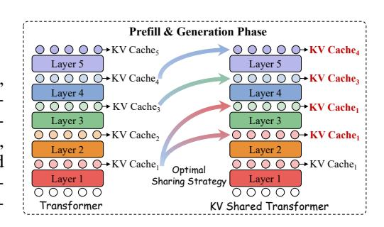
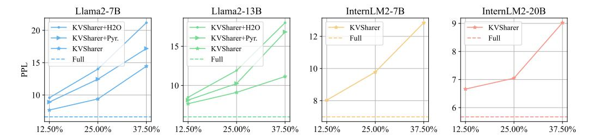

# 4.1 MODELS

Figure 3: During the inference process of prefill and generation, according to the currently found optimal sharing strategy, *KVSharer* directly copy the result of the KV cache from a previously computed layer to the current layer during the forward computation.

To evaluate the effectiveness of the proposed *KVSharer*, we perform experiments on widely-used English LLMs, specifically Llama2-7B and 13B [\(Touvron et al., 2023\)](#page-11-0). We also examine its effectiveness on bilingual LLMs, namely InternLM2-7B and 20B [\(Cai et al., 2024\)](#page-10-0), which support both Chinese and English. For main experiments, we utilize the chat versions of Llama2-7B, InternLM2- 7B, InternLM2-20B and Llama2-13B. We choose these two model series because they offer opensource models in a relatively complete range of different sizes and versions (Base or Chat). Additionally, we include experiments on the advanced Mistral-7B-Instruct-v0.3 [\(Jiang et al., 2023\)](#page-11-1) to validate the universality of our method.

### 4.2 BENCHMARKS

To comprehensively evaluate the model's widely focused capabilities, we utilize the OpenCompass evaluation framework [Contributors](#page-10-11) [\(2023\)](#page-10-11). Specifically, we conduct evaluations in five aspects: Reasoning, Language, Knowledge, Examination and Understanding. We select several benchmarks from each category. Reasoning: CMNLI [Xu et al.](#page-12-12) [\(2020\)](#page-12-12), HellaSwag (HeSw) [Zellers et al.](#page-12-13) [\(2019\)](#page-12-13), PIQA [Bisk et al.](#page-10-12) [\(2019\)](#page-10-12). Language: CHID [Zheng et al.](#page-12-14) [\(2019\)](#page-12-14), WSC [Levesque et al.](#page-11-10) [\(2012\)](#page-11-10). Knowledge: CommonSenseQA (CSQA) [Talmor et al.](#page-11-11) [\(2018\)](#page-11-11), BoolQ [Clark et al.](#page-10-13) [\(2019\)](#page-10-13). Examination: MMLU [Hendrycks et al.](#page-11-12) [\(2021\)](#page-11-12), CMMLU [Li et al.](#page-11-13) [\(2023\)](#page-11-13). Understanding: Race-High/Middle (H/M) [Lai et al.](#page-11-14) [\(2017\)](#page-11-14), XSum [Narayan et al.](#page-11-15) [\(2018\)](#page-11-15), C3 [Sun et al.](#page-11-16) [\(2020\)](#page-11-16). We perform evaluations using the official scripts from OpenCompass, employing zero-shot or few-shot approaches without any additional training. Two evaluation modes are employed: perplexity (PPL) and generation (GEN) [2](#page-4-1) . The GEN mode is used for CHID and XSum, while both PPL (WSCP) and GEN (WSCG) modes are applied to the WSC dataset. The remaining benchmarks are assessed using the PPL mode. OpenCompass then converts the evaluation results for each benchmark into a score, with higher scores indicating better performance.

2[https://opencompass.readthedocs.io/en/latest/get\\_started/faq.html](https://opencompass.readthedocs.io/en/latest/get_started/faq.html)

Table 1: The main results of our experiments. "Layer" represents the number of layers where the KV cache is actually computed. We present the average values of the model across different aspects of tasks and the average scores of all tasks as percentages relative to the full KV cache.

| LLM              | Layer | Average | Percent | Reasoning | Language | Knowledge | Examination | Understanding |
|------------------|-------|---------|---------|-----------|----------|-----------|-------------|---------------|
|                  | 32    | 46.55   | 100%    | 60.83     | 40.67    | 68.67     | 38.89       | 33.03         |
| Llama2-7B        | 28    | 52.89   | 113.6%  | 60.73     | 54.41    | 71.86     | 36.18       | 44.73         |
| Liailia2-/D      | 24    | 45.58   | 97.9%   | 57.74     | 51.00    | 60.52     | 33.12       | 31.15         |
|                  | 20    | 38.55   | 82.8%   | 53.68     | 38.52    | 53.90     | 26.94       | 25.37         |
|                  | 40    | 58.13   | 100%    | 62.90     | 60.56    | 75.67     | 46.67       | 49.67         |
| Llama2-13B       | 35    | 56.32   | 96.9%   | 61.31     | 57.33    | 74.56     | 46.16       | 47.77         |
| Liailia2-13D     | 30    | 51.97   | 89.4%   | 61.35     | 47.38    | 73.66     | 46.03       | 40.51         |
|                  | 25    | 40.50   | 69.7%   | 57.46     | 43.75    | 52.39     | 35.39       | 21.97         |
|                  | 32    | 68.63   | 100%    | 62.00     | 71.30    | 76.37     | 64.46       | 69.82         |
| InternLM2-7B     | 28    | 66.57   | 97.0%   | 60.81     | 66.99    | 75.32     | 60.26       | 69.36         |
| IIICIIILIVIZ-/B  | 24    | 66.59   | 97.0%   | 62.19     | 65.37    | 74.66     | 62.70       | 68.71         |
|                  | 20    | 65.01   | 94.7%   | 61.10     | 63.74    | 74.28     | 62.54       | 65.51         |
|                  | 48    | 70.82   | 100%    | 70.66     | 67.34    | 77.88     | 66.26       | 72.33         |
| InternLM2-20B    | 42    | 69.80   | 98.6%   | 69.02     | 66.84    | 77.39     | 65.94       | 70.75         |
| IIICIIILIVIZ-20B | 36    | 68.99   | 97.4%   | 66.82     | 65.55    | 77.41     | 65.45       | 70.76         |
|                  | 30    | 66.96   | 94.5%   | 66.58     | 59.62    | 77.41     | 65.07       | 68.48         |
|                  | 32    | 64.13   | 100%    | 64.78     | 62.76    | 79.03     | 53.49       | 62.53         |
| Mistral-7B       | 28    | 61.56   | 96.0%   | 64.40     | 57.88    | 77.35     | 50.02       | 60.05         |
| wiisuai-/D       | 24    | 56.67   | 88.4%   | 63.28     | 50.15    | 76.18     | 45.23       | 52.55         |
|                  | 20    | 50.53   | 78.8%   | 61.40     | 49.72    | 71.50     | 35.50       | 40.02         |

#### 4.3 SETTINGS

We configure the compression rates for each model at 12.5%, 25%, and 37.5% by setting the target shared KV cache layers  $\mathcal{C}$ , as subsequent results show that the models can maintain relatively good performance within this range. For all the models, we randomly select 30 sentences from English Wikipedia as the calibration dataset where each sentence has 64 tokens. We set  $\mathcal{T}$  to 0.5 for all the models  $^3$ . All experiments related to the PPL evaluation are conducted on a Wikipedia dataset consisting of 200 sentences, where the token length of each sentence is set to 2048. We perform experiments on a server equipped with 4 Nvidia A100 80GB GPUs.

#### 4.4 Main Result

We conduct experiments on each dataset, calculate the average score for each aspect, the average score across all tasks, and the percentage of the average score for all tasks using *KVShare* compression relative to the average score with the full KV cache in Table 1. Detailed results can be found in Table 6 of Appendix A.1.

Llama2-7B and InternLM2-7B each have 32 layers, while Llama2-13B and InternLM2-20B have 40 and 48 layers, respectively. To evaluate performance, we apply different numbers of compressed layers to the four models at compression rates of 12.5%, 25%, and 37.5%. Ad-

Figure 4: The searching time cost by *KVSharer* for different models. The search time is typically around 60 seconds or less.

 $^3$ When strategy searching, the similarity of the last layer's hidden state between the compressed model and the original model is usually greater than 0.8. We set a threshold of 0.5 to avoid rare cases of model output collapse. Since this situation is infrequent, we do not perform an ablation study on  $\mathcal{T}$ .

Figure 5: The model's perplexity on the Wikipedia dataset at different compression rates. "+H2O" and "+Pyr." refer to the additional use of the H2O and PyramidInfer for intra-layer compression.

ditionally, we include models with full KV cache for comparison. Based on the main results, *KVSharer* exhibits minimal performance degradation compared to the full KV cache in the vast majority of tasks. Notably, when the compression rate is 25% or less, the performance remains close to 90%, and in some cases, even exceeds 95%. Furthermore, the model does not suffer significant performance drops in any specific aspect, as no individual score approaches zero. These results demonstrate that *KVSharer* effectively preserves the model's overall and task-specific performance. To present the results in Table [1](#page-5-1) more intuitively, we show the average performance of each model across all tasks at different compression rates, as illustrated in Appendix [A.1](#page-13-1) Figure [7.](#page-13-2) It can also be observed that *KVSharer* can maintain the model's performance well with a compression rate of 25% or less, and even improves the average performance of the model at a 12.5% compression rate on Llama2-7B.

We also validate the larger Llama2-70B model using several benchmarks and PPL, discovering that *KVSharer* is also effective for it, maintaining most of its performance, as detailed in Appendix [A.2.](#page-14-0)

#### 4.5 STRATEGY SEARCHING TIME

To evaluate the time consumption of *KVSharer*, we also test the time required for the most timeconsuming part of the algorithm, Strategy Searching, as shown in Figure [4.](#page-5-2) The results show that searching for a sharing strategy on the models takes approximately one minute or less. This is expected, as Strategy Searching only requires the model to perform several inferences on a calibration dataset consisting of a few to several dozen sentences, a process that can be completed within minutes on a GPU. Note that our sharing strategy is general rather than task-specific, allowing for only one search per model, which significantly reduces the time required.

#### 4.6 COMPATIBILITY WITH INTRA-LAYER COMPRESSION

Since *KVSharer* is a layer-wise KV cache compression method, it is inherently orthogonal to intralayer KV cache techniques. Therefore, we explore the effectiveness of combining it with existing intra-layer KV cache methods. Specifically, we combine it with H2O [\(Zhang et al., 2024b\)](#page-12-3) and PyramidInfer [\(Yang et al., 2024b\)](#page-12-2), which are popular intra-layer compression methods. We conduct experiments on Llama2-7B and Llama2-13B, first using *KVSharer* to identify 8 layers for shared KV cache, effectively calculating the KV cache for only 24 out of the 32 layers. Then, these two layerwise compression methods are further applied for additional 20% compression. The reproduction of PyramidInfer and H2O can be found in the Appendix [B.](#page-14-1) We present the changes in PPL after adding H2O and PyramidInfer in Figure [5.](#page-6-0) At 12.5% and 25% *KVSharer* compression rates, both methods cause only a slight increase in PPL. The impact of PyramidInfer on PPL is lower compared to H2O, which is expected since PyramidInfer generally maintains better model performance.

This Figure [5](#page-6-0) also shows the PPL of the InternLM2 and Llama2 series under different *KVSharer* compression rates, where the PPL is typically below 15, or even 10, at compression rates within 25%, allowing the model to maintain good generation quality. We present some case studies of the model's generation results in the Appendix [C](#page-14-2) Table [9.](#page-15-0)

