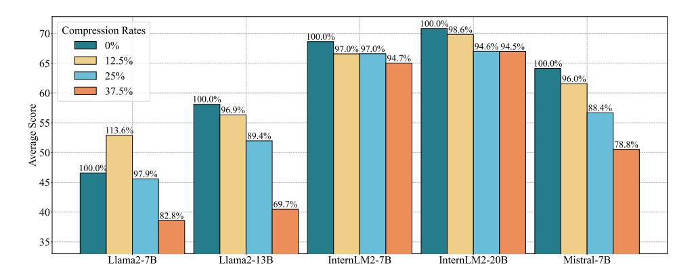

# A.1 MAIN RESULT

Figure 7: The percentage of the model's average score at different compression rates relative to the full KV cache model.

Table 6: The main results of our experiments. "Layer" represents the number of layers where the KV cache is actually computed.

| LLM     | Laver | Re    | asoning  |      | Language |                  |         | Know  | ledge | Examination |       | l                 | anding            |       |       |
|---------|-------|-------|----------|------|----------|------------------|---------|-------|-------|-------------|-------|-------------------|-------------------|-------|-------|
| LLIVI   | Layer |       | HeSw P   | IQA  | CHID     | WSC P | $WSC_G$ | CSQA  | BoolQ | MMLU        | CMMLU | Race H | Race M | XSum  | C3    |
|         | 32    | 32.98 | 71.35 78 | 8.18 | 46.04    | 37.50            | 38.46   | 66.67 | 70.67 | 45.92       | 31.86 | 35.51             | 33.15             | 19.68 | 43.78 |
| Llama2  | 28    | 35.11 | 70.37 70 | 6.71 | 42.08    | 63.46            | 57.69   | 69.62 | 74.10 | 38.63       | 33.74 | 53.95             | 55.92             | 23.24 | 45.81 |
| -7B     | 24    | 34.89 | 63.97 74 | 4.37 | 37.62    | 55.77            | 59.62   | 48.65 | 72.39 | 38.38       | 27.87 | 30.33             | 31.27             | 21.30 | 41.70 |
|         | 20    | 34.49 | 55.11 7  | 1.44 | 32.18    | 52.61            | 30.77   | 48.65 | 59.14 | 28.46       | 25.42 | 22.81             | 23.19             | 16.81 | 38.68 |
|         | 40    | 35.06 | 75.41 78 | 8.24 | 48.02    | 66.35            | 67.31   | 69.78 | 81.56 | 54.64       | 38.71 | 58.46             | 64.07             | 25.84 | 50.30 |
| Llama2  | 35    | 34.27 | 72.84 70 | 6.82 | 46.04    | 63.46            | 62.50   | 68.71 | 80.40 | 53.87       | 38.44 | 58.18             | 64.14             | 20.30 | 48.44 |
| -13B    | 30    | 34.93 | 72.40 70 | 6.71 | 44.06    | 53.85            | 44.23   | 69.12 | 78.20 | 53.88       | 38.19 | 53.60             | 60.45             | 0.71  | 47.29 |
|         | 25    | 34.93 | 64.07 73 | 3.39 | 33.17    | 58.65            | 39.42   | 39.80 | 64.98 | 40.81       | 29.97 | 25.13             | 25.00             | 0.04  | 37.70 |
|         | 32    | 33.09 | 73.30 79 | 9.60 | 82.18    | 61.54            | 70.19   | 69.53 | 83.21 | 65.98       | 62.94 | 84.19             | 89.00             | 33.56 | 72.55 |
| Intern. | 28    | 33.07 | 72.64 70 | 6.71 | 83.66    | 51.92            | 65.38   | 69.70 | 80.95 | 58.12       | 62.40 | 83.68             | 89.00             | 32.43 | 72.33 |
| -7B     | 24    | 33.87 | 73.22 79 | 9.49 | 81.68    | 45.19            | 69.23   | 68.96 | 80.37 | 63.11       | 62.29 | 83.33             | 88.72             | 30.62 | 72.16 |
|         | 20    | 33.44 | 72.23 7  | 7.64 | 78.71    | 42.31            | 70.19   | 68.47 | 80.09 | 63.27       | 61.81 | 80.96             | 86.84             | 25.14 | 69.10 |
|         | 48    | 54.01 | 76.57 8  | 1.39 | 86.63    | 50.00            | 65.38   | 74.05 | 81.71 | 66.55       | 65.98 | 86.51             | 90.25             | 33.04 | 79.51 |
| Intern. | 42    | 50.14 | 76.17 80 | 0.74 | 85.15    | 50.00            | 65.38   | 73.59 | 81.19 | 66.17       | 65.70 | 86.48             | 90.39             | 26.63 | 79.51 |
| -20B    | 36    | 43.65 | 75.84 80 | 0.96 | 84.16    | 56.73            | 55.77   | 74.20 | 80.61 | 65.98       | 64.92 | 86.13             | 90.60             | 26.47 | 79.84 |
|         | 30    | 43.98 | 75.89 79 | 9.87 | 83.66    | 42.31            | 52.88   | 72.73 | 82.08 | 65.32       | 64.82 | 86.11             | 90.67             | 17.48 | 79.67 |
|         | 32    | 32.99 | 78.59 82 | 2.75 | 48.51    | 67.31            | 72.45   | 74.86 | 83.21 | 62.62       | 44.37 | 75.30             | 79.25             | 34.59 | 60.99 |
| Mistral | 28    | 32.99 | 78.87 8  | 1.34 | 47.03    | 57.69            | 68.91   | 73.55 | 81.16 | 58.21       | 41.83 | 71.73             | 77.09             | 31.38 | 60.00 |
| -7B     | 24    | 32.99 | 76.07 80 | 0.79 | 47.52    | 36.54            | 66.39   | 73.55 | 78.81 | 52.61       | 37.85 | 57.66             | 62.19             | 30.36 | 60.00 |
|         | 20    | 32.99 | 73.62 7  | 7.58 | 47.52    | 36.54            | 65.10   | 66.99 | 76.02 | 41.06       | 29.94 | 41.02             | 44.99             | 28.63 | 45.42 |

### A.2 EXPERIMENTS ON LARGE-SIZE LLMS

Due to limitations in computational resources, we only validate the effectiveness of *KVSharer* on a subset of benchmarks and using PPL on the Llama2-70B model as shown in Table [7.](#page-14-5) We set the compression rates to 12.5% and 25%, and find that *KVSharer* effectively maintains most of the model's performance.

Table 7: The model performance achieved by applying *KVSharer* with different compression rates on Llama2-70B.

| LLM        | Layer | BoolQ | PIQA  | HeSw  | PPL  |
|------------|-------|-------|-------|-------|------|
| Llama2-70B | 80    | 86.45 | 79.61 | 78.49 | 4.25 |
|            | 70    | 84.59 | 76.93 | 77.01 | 5.59 |
|            | 60    | 83.73 | 75.11 | 75.57 | 7.01 |

### A.3 ABLATION STUDY ON CALIBRATION DATASET SIZE

Table 8: Ablation study on calibration dataset size conducted on Llama2-7B under 25% compression rate.

| LLM       | Calibration Dataset Size | BoolQ | PIQA HeSw PPL    |
|-----------|--------------------------|-------|------------------------|
| Llama2-7B | 10                       | 72.01 | 74.21 63.54 9.48 |
|           | 30                       | 72.39 | 74.37 63.97 9.39 |
|           | 50                       | 72.41 | 74.00 63.98 9.33 |

As shown in Table [8,](#page-14-4) the impact of calibration dataset size on *KVSharer* is also minimal, as the model still maintains good performance under a 25% compression rate. To mitigate the potential risk of obtaining suboptimal sharing strategies due to a smaller calibration dataset size, we recommend using a larger size.

