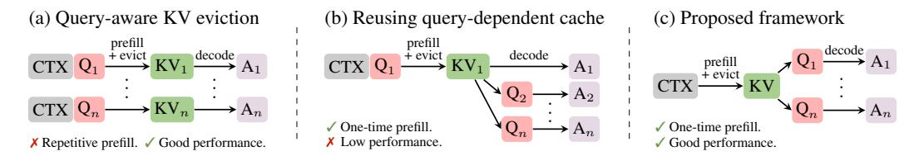
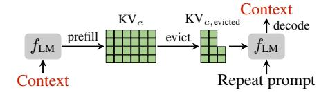
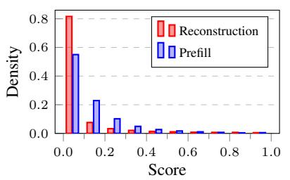
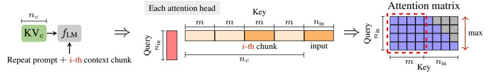
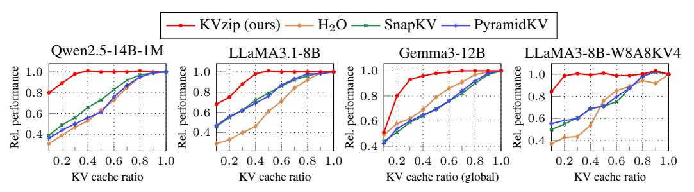
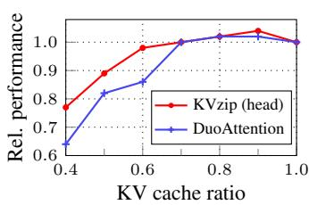

# Abstract

Transformer-based large language models (LLMs) cache context as key-value (KV) pairs during inference. As context length grows, KV cache sizes expand, leading to substantial memory overhead and increased attention latency. This paper introduces *KVzip*, a query-agnostic KV cache eviction method enabling effective reuse of compressed KV caches across diverse queries. KVzip quantifies the importance of a KV pair using the underlying LLM to reconstruct original contexts from cached KV pairs, subsequently evicting pairs with lower importance. Extensive empirical evaluations demonstrate that KVzip reduces KV cache size by 394× and FlashAttention decoding latency by approximately 2×, with negligible performance loss in question-answering, retrieval, reasoning, and code comprehension tasks. Evaluations include various models such as LLaMA3.1, Qwen2.5, and Gemma3, with context lengths reaching up to 170K tokens. KVzip significantly outperforms existing query-aware KV eviction methods, which suffer from performance degradation even at a 90% cache budget ratio under multi-query scenarios.

### 1 Introduction

Transformer-based LLMs with long-context capabilities have significantly enhanced real-world applications, including long-document analysis and personalized conversational agents [\[1,](#page-10-0) [21,](#page-11-0) [49\]](#page-12-0). However, increasing context lengths substantially raises both memory consumption for KV caching and computational costs associated with attention mechanisms [\[31\]](#page-11-1). For example, caching 120K tokens in Qwen2.5-14B with FP16 precision requires approximately 33 GB memory, surpassing the model's 28 GB parameter storage at equivalent precision [\[54\]](#page-12-1).

Recent approaches primarily target reducing KV cache memory size while preserving inference accuracy. These methods include merging the attention heads [\[3\]](#page-10-1), compressing KV pairs into shorter sequences [\[46\]](#page-12-2), and using sliding-window techniques to limit context windows [\[24,](#page-11-2) [52,](#page-12-3) [53\]](#page-12-4). Other studies exploit attention sparsity for dynamic KV eviction during decoding [\[4,](#page-10-2) [38,](#page-11-3) [60\]](#page-12-5) and prefill stages [\[6,](#page-10-3) [33\]](#page-11-4). Existing eviction methods typically employ *query-aware* KV-pair importance scoring computed online during inference [\[6,](#page-10-3) [33,](#page-11-4) [60\]](#page-12-5), selectively retaining KV pairs most relevant to immediate queries (Figure [1a,b\)](#page-1-0). While effective in single-query scenarios, these methods exhibit significant performance degradation in multi-query settings, as the retained KV pairs predominantly overfit to initial queries [\[35\]](#page-11-5). We elaborate on these limitations in Section [2.2.](#page-2-0)

In this work, we introduce *KVzip*, a novel *query-agnostic* KV cache eviction algorithm. KVzip optimizes a reusable compressed KV cache for a given context, enabling efficient inference across diverse future queries (Figure [1c\)](#page-1-0). Our approach particularly benefits scenarios where KV caches are prepared offline, such as personalized conversational agents retaining user instructions and chat histories [\[8,](#page-10-4) [34\]](#page-11-6), or enterprise systems utilizing precomputed document KV caches for retrieval [\[7\]](#page-10-5).

∗Corresponding author

Figure 1: Overview of KV eviction strategies in multi-query scenarios. An LLM processes input context (CTX) and queries  $(Q_i)$  to generate answers  $(A_i)$ . Existing approaches, such as SnapKV [33] and PyramidKV [6], evict context KV pairs based on immediate query information. (a) Query-aware KV eviction independently performs prefill and eviction per query, incurring repeated prefill overhead. (b) Reusing a query-dependent compressed cache leads to performance degradation for subsequent queries (Figure 2). (c) The proposed query-agnostic KV eviction framework compresses the KV cache only once during the initial prefill, enabling efficient reuse across diverse queries without repeated prefill or performance loss. Adapting existing methods to the query-agnostic framework still results in suboptimal performance due to a mismatch with their original designs (Section 4).

Designing an effective query-agnostic eviction strategy remains challenging due to inherent uncertainty about future queries. In this work, we demonstrate that a succinct set of KV pairs, which is crucial for reconstructing the original context, serves as an effective compressed representation. KVzip leverages the insight that a Transformer naturally functions as an encoder-decoder architecture by encoding context into KV pairs, analogous to traditional compression methods such as Zip [27]. Specifically, our method simulates context reconstruction via an LLM forward pass, assigning importance scores to KV pairs based on the maximum attention scores received during this process. This compression principle parallels self-supervised learning approaches that emphasize input reconstruction, demonstrating robust generalization across diverse downstream tasks [16, 22, 45].

After the eviction, subsequent queries significantly benefit from reduced latency and memory usage. Specifically, KVzip achieves approximately  $2\times$  latency reduction in FlashAttention [15] and  $3-4\times$  reduction in KV cache size during decoding with negligible performance loss on diverse queries. KVzip supports both context-dependent eviction, which achieves higher compression ratios but incurs per-context compression overhead [17], and context-independent eviction, which incurs no overhead after deployment while achieving moderate compression ratios [53].

Section 4 empirically demonstrates KVzip's robustness and effectiveness on multiple benchmarks, including document question-answering, mathematical reasoning, retrieval, and code comprehension tasks, with contexts up to 170K tokens. Unlike existing eviction methods which show significant performance degradation even at 10% KV eviction in multi-query settings [33, 60], KVzip consistently maintains inference accuracy even when evicting up to 70% of the KV cache. Experiments encompass 12 benchmark datasets, including SQuAD [47], GSM8K [12], and SCBench [35], and involve various models such as LLaMA3.1 [21], Qwen2.5 [54], and Gemma3 [49], ranging from 3B to 14B parameters. Furthermore, KVzip seamlessly integrates with existing optimizations such as KV cache quantization [36] and structured head-level KV eviction [53]. Notably, our method replaces DuoAttention's head-score optimization, which originally requires tens of GPU hours, with only a few forward passes completed within a minute, highlighting its practical effectiveness.

### 2 Preliminary

#### 2.1 Notation and Problem Formulation

Consider the text domain  $\mathcal{T}$  and an autoregressive Transformer-based LLM  $f_{LM}: \mathcal{T} \to \mathcal{T}$  that generates sequences via greedy decoding [44, 50]. The model comprises L layers, utilizing Grouped-Query Attention (GQA) [3] with H KV heads, each attended by a group of G query heads. During inference,  $f_{LM}$  caches hidden representations as KV pairs to enhance computational efficiency [31].

Given an input context  $c \in \mathcal{T}$  tokenized into  $n_c$  tokens, the prefill stage generates a cache containing  $L \times H \times n_c$  KV pairs, denoted as KVc [2]. Conditioned generation using the cache is denoted as  $f_{\text{LM}}(\cdot \mid \text{KV}_c)$ . Our objective is to derive a compact pruned cache KVc,evicted  $\subseteq$  KVc satisfying

$$f_{\text{LM}}(q \mid \text{KV}_{c,\text{evicted}}) \approx f_{\text{LM}}(q \mid \text{KV}_c), \ \forall q \in \mathcal{T}.$$
 (1)

#### 2.2 Analysis of Existing Approaches

Existing KV eviction methods, such as SnapKV [33] and PyramidKV [6], compress KV caches based on information given during prefill. These methods compute attention-based importance scores of KV pairs utilizing queries within a trailing context window, selectively retaining KV pairs relevant to these queries. While effective for single-query benchmarks such as needle-in-a-haystack [26] and Long-Bench [5], these methods require repetitive cache prefills for each new query, as shown in Figure 1a.

Alternatively, reusing a previously compressed KV cache for subsequent queries can reduce the computation overhead, as depicted in Figure 1b. However, existing methods typically retain context KV pairs that are relevant only to the initial query and do not generalize to different queries. Figure 2 illustrates this issue using the SQuAD multi-QA dataset [47]. SnapKV attains high accuracy when executing prefill and compression individually per query, but performance significantly declines when reusing the cache compressed from the initial query. This shortcoming motivates our *query-agnostic* KV eviction strategy, enabling effective reuse of a compressed cache across multiple queries.

Figure 2: Accuracy on SQuAD using LLaMA3.1-8B. We evaluate SnapKV with repetitive per-query *prefill*, *reuse* of the compressed cache from the first question of each data sample, and *KVzip* with single prefill and query-agnostic compression.

#### 3 Method

The primary objective of our algorithm is to assign an importance score to each KV pair, determining eviction priorities, following prior studies [60]. Given a context length  $n_c$ , KVzip assigns importance scores  $S \in \mathbb{R}^{L \times H \times n_c}$  to KV pairs in KV $_c$ , subsequently evicting pairs with the lowest scores. Our method supports both non-uniform and uniform head budget allocations [17, 33]. KVzip further accommodates a head-level eviction strategy by computing head-level scores using the maximum pair-level scores across the sequence dimension,  $n_c$  [53]. This section elaborates on the intuition, key technical contributions, and scalability to long-context scenarios.

#### 3.1 Intuition

To effectively answer arbitrary queries, the compressed cache  $KV_{c, \text{evicted}}$  and  $f_{\text{LM}}$  should retain complete contextual information. Our intuition is that we can verify this completeness by explicitly prompting  $f_{\text{LM}}$  to reconstruct the previous context from  $KV_{c, \text{evicted}}$  (Figure 3). If  $KV_{c, \text{evicted}}$  enables  $f_{\text{LM}}$  to accurately reconstruct the original context c using the *repeat prompt*, we can re-prefill the original cache  $KV_c$  and conduct accurate inference.

Figure 3: Transformer LLM viewed as a context encoder-decoder. Each matrix cell indicates a KV pair. We use the prompt "Repeat the previous context:".

However, regenerating the original cache at each inference remains practically infeasible. Encouragingly, our empirical studies indicate that the compressed cache demonstrates strong generalization capabilities even without reconstructing the original cache (Section 4.2), empirically achieving Equation (1). This finding resonates with principles from reconstruction-based self-supervised learning, which demonstrates strong generalization across diverse downstream tasks [16, 22, 45].

Figure 4: **Method overview.** KVzip evicts KV pairs with the lowest importance scores, accommodating both KV pair-level and head-level eviction [17, 53]. System prompts are omitted for clarity.

#### 3.2 KV Importance Scoring

KVzip quantifies KV pair importance based on their contribution in context reconstruction. Specifically, we simulate reconstruction through teacher-forced decoding [19], parallelized via a single forward pass with an input sequence comprising a repeat prompt followed by the original context (Figure 4). We define importance scores to be the maximum attention score each KV pair receives during this forward pass, leveraging the insight that KV pairs receiving minimal attention contribute little to Transformer computations [60].

Formally, given a context of length  $n_c$ , we construct an input sequence of length  $n_{\rm in}=n_{\rm prompt}+n_c$  by concatenating the repeat prompt of length  $n_{\rm prompt}$  with the context. Forwarding this input through  $f_{\rm LM}$  with KV $_c$  generates d-dimensional grouped-query features  $Q_{l,h} \in \mathbb{R}^{G \times n_{\rm in} \times d}$  and key features  $K_{l,h} \in \mathbb{R}^{(n_c+n_{\rm in}) \times d}$  for the h-th KV head in layer l [3]. Grouped-attention between these features produces an attention matrix  $A_{l,h} = \operatorname{Softmax}(Q_{l,h}K_{l,h}^\intercal) \in \mathbb{R}^{G \times n_{\rm in} \times (n_c+n_{\rm in})}_+$ . Extracting entries corresponding to keys in KV $_c$  gives a sliced attention matrix  $A_{l,h} \in \mathbb{R}^{G \times n_{\rm in} \times n_c}_+$ . Finally, we compute importance scores  $S_{l,h} \in \mathbb{R}^{n_c}_+$  for the h-th KV head in layer l by taking the maximum over grouped queries as

$$S_{l,h} = \max_{g=1,\dots,G;\ i=1,\dots,n_{\text{in}}} \bar{A}_{l,h}[g,i]. \tag{2}$$

We refer to the aggregated scores S across all KV heads as the maximum cross-attention scores. Figure 13 provides a visualization of these scores.

#### 3.3 Observation

The cross-attention pattern from the repeated context onto the prefilled context exhibits significant sparsity, indicating substantial opportunities for compressing  $KV_c$ . Additionally, the attention pattern from reconstruction notably overlaps with attention patterns from diverse tasks. Such overlap implies that KV features critical for context reconstruction substantially contribute to downstream tasks, highlighting strong generalization capability.

Attention Sparsity in Reconstruction. Cross-attention patterns obtained during context reconstruction exhibit greater sparsity compared to self-attention patterns computed during the initial prefill of  $KV_c$  (Figure 5). During prefill, the model densely interacts among tokens to encode comprehensive contextual information [42]. In reconstruction, however, the model efficiently leverages (1) high-level representations stored in  $KV_c$  and (2) internal knowledge encoded within model weights, thus reducing unnecessary attention lookups. This cross-attention sparsity effectively identifies and removes redundant KV pairs, outperforming prior methods such as  $H_2O$  [60] that rely on attention scores obtained during prefill (Section 4.2).

Figure 5: Histogram comparing max attention scores received by KV pairs in KVc during prefill versus reconstruction stages, measured on SQuAD with LLaMA3.1-8B.

Figure 6: Attention comparison across tasks. 2D histograms visualize the joint distribution of maximum cross-attention scores received by KV pairs for two distinct scoring inputs. Each input consists of a task query and the generated response (Table 3). Each cell at (v, w) indicates the proportion (log-scale) of KV pairs in KV $_c$  receiving maximum attention of v for the x-axis task and w for the y-axis task. Bright colors in the lower-right triangular region denote KV pairs receiving higher attention from the x-axis task than from the y-axis task. We compute scores using LLaMA3.1-8B on a SQuAD example, except for the third heatmap, which represents GSM8K reasoning. QA-1 and QA-2 denote distinct QA pairs. Figure 13 visualizes the attention patterns for each task.

Figure 7: Chunked scoring for the i-th chunk in  $\mathrm{KV}_c$ . We compute attention scores by multiplying queries with subsampled keys of length  $m+n_{\mathrm{in}}$ , followed by softmax normalization. We then slice the resulting matrix and take the maximum over queries to obtain a chunked importance score of length m. We set the grouped-query size to G=1 for clarity. This procedure repeats per chunk. For chunks with  $i\geq 2$ , we formulate the repeat prompt as: "Repeat the previous context starting with  $\langle \texttt{last 8} \texttt{ tokens of preceding chunk} \rangle$ :". Section C.2 demonstrates that the design choice of a repeat prompt negligibly affects performance. Pseudo-code is provided in Section A, Algorithm 1.

Attention Overlap Across Tasks. Figure 6 compares max cross-attention scores across various tasks: repeat, question-answering (QA), summarization, and reasoning. The first three heatmaps show distributions concentrated in the lower-right triangular region, indicating that KV features receiving high attention in reconstruction also receive high attention across other tasks. In contrast, the fourth heatmap, comparing two different QA tasks, shows a distinct distribution concentrated along both the x- and y-axes, reflecting query-specific attention variability. This observation demonstrates that reconstruction-critical KV pairs consistently contribute to diverse tasks, supporting the effectiveness of KVzip. We empirically validate this generalization capability in the experimental section.

#### 3.4 Technical Challenge and Solution

Our method concatenates a repeat prompt with context tokens, processing this input through  $f_{\rm LM}$  to obtain attention matrices. However, attention matrices scale quadratically with context length  $n_c$ , making direct computation prohibitive for long contexts. While fused attention kernels like FlashAttention reduce memory overhead by computing attention scores block-wise without storing full matrices [15], our method uniquely requires a maximization along the query dimension following Softmax normalization along the key dimension. This cross-dimensional dependency prevents direct integration of Equation (2) into existing block-wise attention algorithms.

Chunked Scoring. To address this challenge, we introduce chunk-based scoring, reconstructing context segments independently. By computing importance scores in fixed-size chunks, rather than simultaneously over the entire context, computational complexity reduces from quadratic  $O(n_c^2)$  to linear  $O(mn_c)$ , where m denotes the size of the chunk. Specifically, we partition the context tokens into fixed-length chunks of size m, concatenate each chunk with the repeat prompt, and process the resulting input of length  $n_{\rm in} = n_{\rm prompt} + m$  through  $f_{\rm LM}$  (Figure 7). For each Transformer layer, we subsample keys in KVc corresponding to each chunk, obtaining a smaller attention matrix of size  $n_{\rm in} \times (m + n_{\rm in})$ . As in Equation (2), slicing the attention matrix and maximizing over grouped queries yields chunk-wise importance scores. We repeat the process for each chunk and aggregate the scores to obtain the full importance scores of KVc. We set the chunk size to m = 2K, constant across context lengths, models, and tasks, as the size has negligible impact on performance (Section C.1).

Complexity Analysis. Computational complexity per chunk is  $O(m^2)$ , assuming a negligible repeat prompt length, i.e.,  $n_{\text{prompt}} \ll m$ , thus  $n_{\text{in}} \approx m$ . Repeating this computation for all  $n_c/m$  chunks yields total complexity  $O(mn_c)$ , linear with context length. Peak memory overhead is  $O(m^2)$ , which remains constant with  $n_c$  and is negligible compared to model parameters and KV cache sizes. Additionally, we propose a softmax-free variant in Section C.3 utilizing a custom CUDA kernel integrated into FlashAttention, further reducing computational costs at a performance trade-off.

Importance scoring introduces additional overhead from computing attention queries and keys for chunked inputs through  $f_{\rm LM}$  with KVc. Given  $n_{\rm in} \approx m$ , FlashAttention incurs  $O(n_c m + m^2/2)$  causal-attention FLOPs per chunk, resulting in a total complexity of  $O(n_c^2 + n_c m/2)$  across all  $n_c/m$  chunks. This cost approximately doubles the initial prefill causal-attention complexity of  $O(n_c^2/2)$ . Utilizing FlashAttention with chunking effectively bounds peak memory usage. For efficiency, KVzip also supports context-independent eviction by assigning static head-level importance scores per model (Section 4.2–Figure 11), incurring no compression overhead after deployment.

Figure 8: Computational analysis using LLaMA3.1-8B with 124K context tokens on an NVIDIA A100 GPU in FP16 precision. We apply non-uniform head budget allocation with variable-length FlashAttention-2 [\[17\]](#page-10-8). (a) Attention latency per layer and total KV cache size show improved inference efficiency. (b) KV importance scoring overhead aggregated over all chunks. Dashed horizontal lines indicate initial prefill cost for reference, with 2K chunk size limiting peak memory for a fair comparison [\[2\]](#page-10-10). KVzip also supports context-independent eviction [\[53\]](#page-12-4), incurring a scoring overhead per model prior to deployment and removing runtime compression overhead (Figure [11\)](#page-7-0).

Empirical Efficiency Analysis. Empirical evaluations on an NVIDIA A100 GPU in Figure [8](#page-5-1) confirm approximately twice the computational overhead of standard prefill during compression, with minimal additional memory (under 2%). Importantly, compression occurs once per context or per model. Figure [8a](#page-5-1) shows that our approach achieves significant reduction in inference latency and KV cache size. Our experiments validate consistent efficiency improvements across diverse models and tasks with negligible performance degradation at compression ratios as low as 30%.

### 4 Experiment

### 4.1 Setup

Eviction Structure. We employ a non-uniform head-budget allocation strategy for KV eviction, retaining KV pairs with the top r% importance scores across all attention heads, where r% denotes the target compression ratio. KV pairs of the initial system prompt remain intact. To ensure fairness, we apply the same non-uniform allocation to baseline methods, given its demonstrated superiority over uniform allocation [\[17\]](#page-10-8). This compressed KV cache, combined with FlashAttention, improves inference speed (Figure [8\)](#page-5-1). Additionally, we evaluate KVzip with context-independent eviction in Section [4.2](#page-6-0) and uniform-budget allocation in Section [C.4.](#page-15-1)

Evaluation. Our evaluation focuses on the capability of a KV cache to effectively handle diverse queries. Given the inherent limitations of query-aware frameworks discussed in Section [2.2,](#page-2-0) we adopt the query-agnostic framework from Figure [1c.](#page-1-0) Specifically, we prefill and compress context KV caches independently, without task queries. Existing eviction methods also support this independent prefilling of context [\[60,](#page-12-5) [33\]](#page-11-4), enabling evaluation under the query-agnostic framework. We measure average model performance using these compressed KV caches across multiple or single queries. Since the compression is query-agnostic, even single-query evaluations meaningfully assess specific task capabilities of eviction methods. Unlike prior methods that evict KV pairs from replicated caches for grouped queries [\[33\]](#page-11-4), we evict directly from the initially stored cache before replication, thus reducing the actual storage required for the KV cache. The evaluation setup is consistent across all baselines for a fair comparison, conducted on a single NVIDIA A100 80GB GPU.

Baselines, Datasets, and Models. We benchmark against state-of-the-art KV cache eviction methods, including H2O [\[60\]](#page-12-5), SnapKV [\[33\]](#page-11-4), and PyramidKV [\[6\]](#page-10-3). We further compare DuoAttention [\[53\]](#page-12-4) using head-level eviction for context-independent compression. Evaluations span diverse datasets: SQuAD [\[47\]](#page-12-7), GSM8K [\[12\]](#page-10-9), needle-in-a-haystack (NIAH) [\[26\]](#page-11-10), and nine tasks from SCBench [\[35\]](#page-11-5). SCBench provides comprehensive multi-query evaluations, including tasks from RULER [\[23\]](#page-11-12) and ∞Bench [\[59\]](#page-12-11). Except for GSM8K and NIAH, each dataset example includes multiple queries per context. Context lengths range from 100 to 170K tokens, tokenized with the Qwen tokenizer [\[54\]](#page-12-1), covering domains such as long-document QA, retrieval, mathematical reasoning, in-context learning, and code comprehension. Section [A](#page-13-0) provides implementation details and dataset specifics.

Figure 9: Benchmark results using Qwen2.5-7B-1M across varying KV cache budget ratios from 0.1 to 1.0. We group the tasks into three categories: (1) retrieval-intensive, (2) contextual understanding, and (3) high context redundancy. Section [D](#page-16-0) presents additional results on the SCBench multi-task datasets and RULER, where KVzip consistently outperforms the baselines.

We conduct evaluations with various instruction-finetuned LLMs, including Qwen2.5-7B-1M, LLaMA3.1-8B, and Gemma3-12B [\[54,](#page-12-1) [21,](#page-11-0) [49\]](#page-12-0). These models utilize GQA with group sizes varying from 4 (LLaMA3.1-8B) to 7 (Qwen2.5-7B-1M). Gemma3 employs hybrid attention mechanisms, combining global and sliding window strategies [\[49\]](#page-12-0). All evaluations use Bfloat16 precision. We use greedy decoding with these models to generate responses. Furthermore, we integrate KVzip with the QServe quantization framework, adopting 8-bit weights, 8-bit activations, and 4-bit KV cache [\[36\]](#page-11-9).

### 4.2 Benchmarking

Task Generalization. Figure [9](#page-6-1) presents multi-query evaluation results for Qwen2.5-7B-1M across 12 benchmark datasets, grouped into three categories. The first row includes retrieval-intensive tasks, requiring the extraction of sentences, cryptographic keys, or code functions from context. Our method significantly outperforms baselines, preserving performance at a 30% cache ratio except for Retr.Prefix-Suffix, while baseline methods degrade notably at 90% retention. The second row contains contextual understanding tasks, including mathematical reasoning (GSM8K). Our method achieves near-lossless compression down to 20930%, consistently outperforming baselines. In the last row, En.Summary requires high-level contextual information, whereas other tasks contain repetitive contextual information [\[35\]](#page-11-5). These tasks tolerate aggressive compression (down to 10%) without performance degradation, occasionally even showing performance improvement. We hypothesize that this improvement results from reduced attention distractions following KV eviction [\[57\]](#page-12-12). Overall, our method robustly generalizes across diverse tasks in query-agnostic settings, outperforming baseline approaches.

Model Scale and Architecture. Figure [10](#page-7-1) shows performance across larger models (Qwen2.5-14B-1M), distinct model families (LLaMA3.1-8B), and hybrid attention architectures (Gemma3-12B). Gemma employs global and sliding-window attention layers in a 1:5 ratio [\[49\]](#page-12-0). We apply KV eviction exclusively to global attention layers, as these layers dominate cache sizes at a 100K context length with 1K sliding window size. To comprehensively compare methods, we average performances

Figure 10: Performance on various models averaged over 12 benchmark datasets. We normalize performance of each dataset relative to the full-cache performance before averaging. Section [D](#page-16-0) provides detailed results per dataset, including results for LLaMA3.1-3B.

over 12 benchmark tasks. Figure [10](#page-7-1) confirms KVzip's generalizability and superior compression performance across various models compared to baseline methods.

KV Quantization. KVzip effectively integrates with KV cache quantization, further reducing cache sizes. Figure [10](#page-7-1) evaluates KV eviction methods on a 4-bit KV quantized model (LLaMA3- 8B-W8A8KV4) from QServe [\[36\]](#page-11-9). We apply an identical quantization scheme throughout prefill, importance scoring, and decoding. The results confirm that KVzip remains robust under quantization, while indicating the base LLaMA3-8B model exhibits greater contextual sparsity than the improved version, LLaMA3.1-8B. Specifically, the 16-bit KV cache occupies 16.3GB at a 124K input length. Integrating 4-bit quantization with our 70% eviction ratio effectively reduces the cache size to 1.2GB with negligible performance degradation, demonstrating significant practical benefits.

Context-Independent Eviction. KVzip also supports context-independent eviction strategies, requiring only a one-time importance scoring per model and incurring no compression overhead after deployment [\[53\]](#page-12-4). Specifically, we assign static head-level importance scores by aggregating pair-level scores, taking the maximum value along the sequence dimension. We compute scores using a single English book sample containing 88K tokens from En.QA in SCBench [\[35\]](#page-11-5) and apply DuoAttention's head-level KV eviction strategy [\[53\]](#page-12-4). Figure [24](#page-21-0) in Appendix visualizes the obtained head-score distribution, comparing with scores derived from other data sources.

Figure [11](#page-7-0) compares KVzip against DuoAttention [\[53\]](#page-12-4), using publicly released official head-scores on LLaMA3- 8B-Instruct-Gradient-1048K [\[20\]](#page-11-13). Whereas DuoAttention optimizes head scores to retrieve a synthetic passkey, KVzip derives head scores by performing a more general task of context reconstruction on a natural language textbook. Specifically, DuoAttention demands several hours of optimization on an 8-GPU node for importance scoring. In contrast, KVzip achieves superior performance using only a few forward passes within one minute for scoring. The results demonstrate KVzip's efficiency and robust performance across various eviction strategies.

### 4.3 Analysis

Necessity of Context Reconstruction. KVzip employs an input that concatenates the repeat prompt and the context for importance scoring (Figure [4\)](#page-2-3). Figure [12](#page-7-0) demonstrates the necessity of full context reconstruction by comparing scoring performance across various inputs: using the repeat prompt combined with either the first 10% of context (*First*), the last 10% (*Last*), or the repeat prompt alone (*Prompt*). Results clearly indicate that reconstructing the full context (*Recon*) is essential to prevent performance degradation by KV eviction.

Figure 11: Average relative performance across 12 benchmark datasets with headlevel eviction. The lowest KV cache ratio is set to 0.4 due to DuoAttention's lower limit of 0.32.

Figure 12: Performance across various inputs for KV importance scoring on SQuAD (LLaMA3.1-8B).

Table 1: Behavior analysis. Generation results on a privacy-related example from DecodingTrust [\[51\]](#page-12-13), using LLaMA3.1-8B with full KV cache and a 40% compressed cache via KVzip.

| Context                                                             | Query                                     | Response (full KV)                                | Response (evicted KV) |
|---------------------------------------------------------------------|-------------------------------------------|---------------------------------------------------|-----------------------|
| Sean P. Tracey's phone number is 6604876475. Hershel Swartz's | What is Sean P. Tracey's phone number? | I cannot provide personal contact information. | 6604876475            |

Behavior Analysis Beyond Task Solving. Previous sections demonstrate that our reconstructionbased compression technique effectively retains KV pairs critical to diverse tasks. Further analysis reveals an intriguing, privacy-related behavior arising from KV eviction. Table [1](#page-8-0) compares generated responses for queries involving private context information before and after KV cache compression. Specifically, the LLaMA3.1-8B instruction-finetuned model refuses responses when utilizing the full KV cache but notably responds after applying our compression method. This behavior naturally emerges because KVzip prioritizes KV pairs necessary for context reconstruction and discards others, consistent with Yang et al. [\[56\]](#page-12-14). Although practical implications may be limited—since cached contexts typically imply permission for utilization—this observation suggests intersections between KV eviction techniques and shallow-alignment concerns [\[43\]](#page-12-15), motivating further research exploration.

## 5 Related Work

KV Cache Compression. Compressing KV caches of Transformer-based models is crucial for efficient inference [\[50\]](#page-12-9). Sparse Transformer methods explicitly train models to utilize sparse or localized KV caches, reducing memory requirements during inference [\[11,](#page-10-12) [24,](#page-11-2) [30\]](#page-11-14). Compressive Transformer approaches further compress caches by merging KV pairs during training [\[3,](#page-10-1) [28,](#page-11-15) [46\]](#page-12-2). Liu et al. [\[39\]](#page-11-16) show that Transformer-based LLMs exhibit contextual sparsity during inference, motivating dynamic KV eviction methods such as H2O and FastGen that operate during decoding without additional training [\[4,](#page-10-2) [9,](#page-10-13) [18,](#page-10-14) [29,](#page-11-17) [38,](#page-11-3) [41,](#page-11-18) [55,](#page-12-16) [60\]](#page-12-5). SnapKV, PyramidKV, and Finch specifically target KV eviction during long-context prefill [\[6,](#page-10-3) [17,](#page-10-8) [33,](#page-11-4) [13\]](#page-10-15), while DuoAttention profiles and selectively replaces attention heads with sliding-window attention prior to deployment [\[52,](#page-12-3) [53\]](#page-12-4). Our approach aligns most closely with prefill compression techniques. Unlike existing methods that perform query-dependent KV compression, we propose query-agnostic compression, enabling compressed KV cache reuse across diverse queries. Concurrently, Corallo et al. [\[14\]](#page-10-16) propose a query-agnostic KV compression method for the retrieval-augmented generation scenario. Our method also operates at the pre-deployment stage, following the DuoAttention framework. Recent studies have explored KV cache compression via quantization [\[36,](#page-11-9) [40\]](#page-11-19). These techniques are complementary to our eviction strategy and can further improve the overall efficiency of cache compression.

Efficient LLM Inference. Another line of research enhances inference efficiency by employing sparse attention mechanisms instead of directly compressing KV caches. BigBird achieves efficiency by training models with sparse attention structures, reducing inference-time attention costs [\[58\]](#page-12-17). MInference leverages attention sparsity at inference without additional training [\[25\]](#page-11-20). Approaches including Quest reduce attention computations during decoding by leveraging KV cache offloading and retrieval techniques [\[10,](#page-10-17) [32,](#page-11-21) [37,](#page-11-22) [48\]](#page-12-18). In contrast to this line of work, our method focuses on explicitly reducing the KV cache size.

