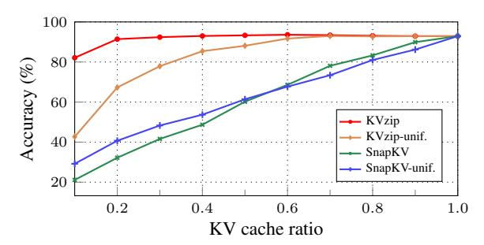
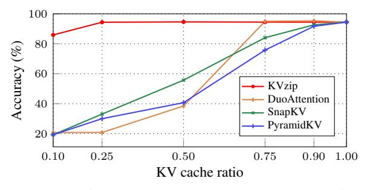
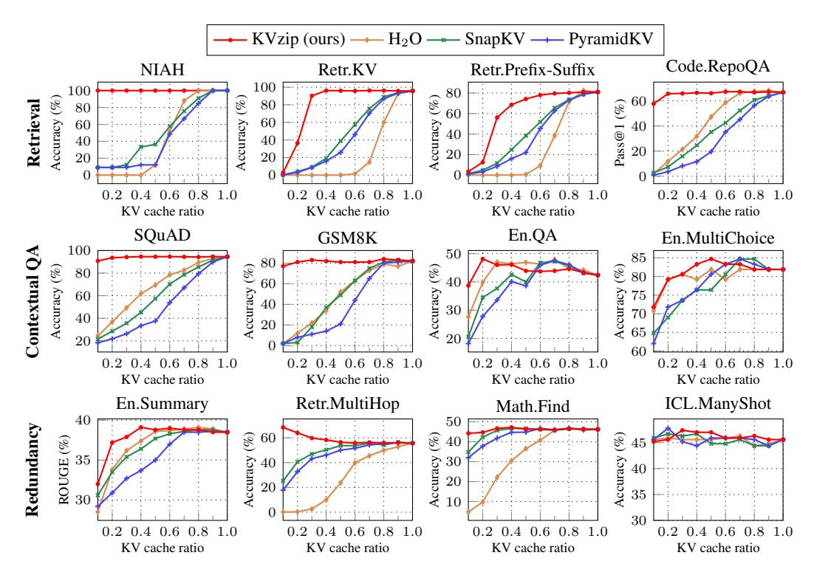
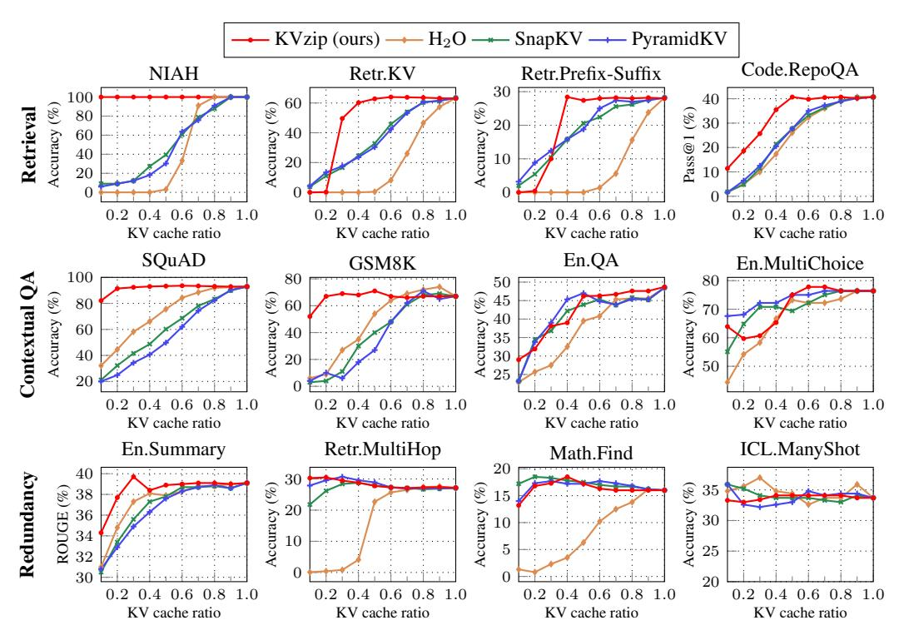
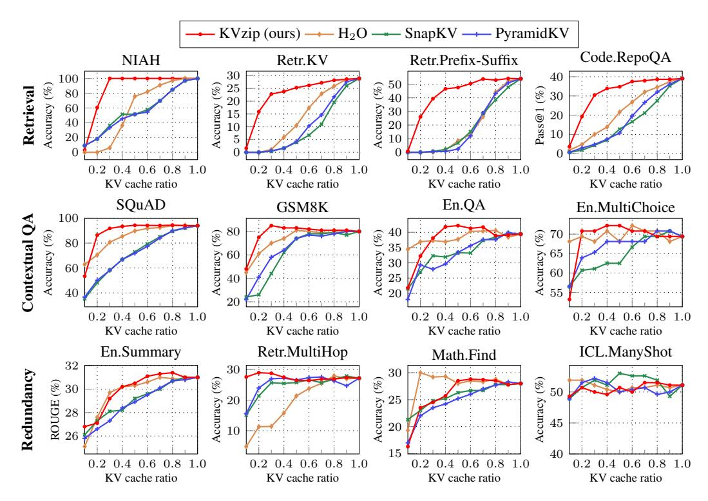
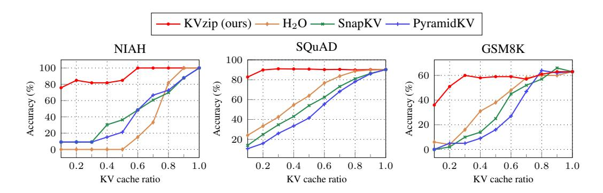
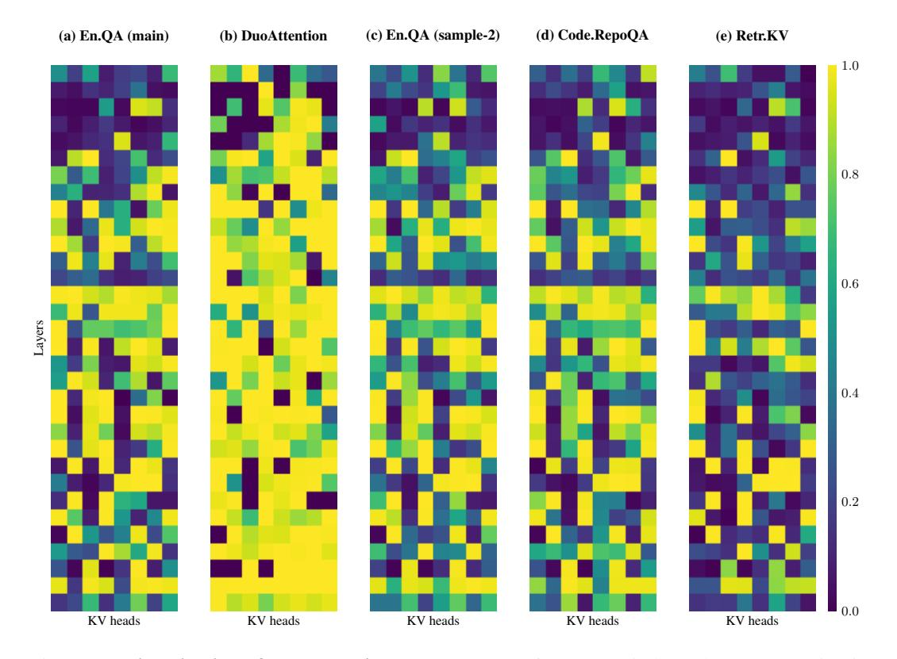

# C Analysis and Experiments

### C.1 Reconstruction Chunk Size

Figure [14](#page-14-3) analyzes how scoring chunk size m influences performance. Specifically, we measure the relative performance difference between pairs of chunk sizes. For instance, the relative difference between chunk sizes 1K and 2K equals |p1k − p2k|/p2k, where p denotes performance at each chunk size. Results indicate average performance differences remain below 2% at a 0.3 KV cache ratio, confirming negligible impact. Given these results, we adopt a chunk size of 2K for all experiments, as this achieves optimal computational efficiency while negligibly affecting the token position index limit (Figure [8\)](#page-5-1).

Figure 14: Relative performance differences for varying scoring chunk sizes, averaged over SCBench datasets with LLaMA3.1-8B.

#### C.2 Repeat Prompts

In our experiment, we use the repeat prompt: "Repeat the previous context:". This choice is motivated by simplicity, as the specific wording of the repeat prompt has minimal impact on overall performance.

3 <https://github.com/FranxYao/Long-Context-Data-Engineering>

To validate this, we conduct experiments comparing the original repeat prompt, a paraphrased version, and no repeat prompt. Table [2](#page-15-2) shows that our method is robust to variations in the repeat prompt; even without the repeat prompt, context reconstruction remains effective. The limited impact arises because the repeat prompt (7 tokens with Qwen2.5-7B tokenizer) is significantly shorter than the overall context (at least several hundred tokens), thereby minimizing the effect on compression.

To further clarify this, we analyze attention patterns. Specifically, we measure the proportion of prefilled KV pairs whose maximum cross-attention scores during reconstruction originated from the repeated context rather than the repeat prompt (see Figure [4\)](#page-2-3). For a 2K token-length context from NIAH, 98.1% of KV pairs have their maximum attention from the repeated context. Among the KV pairs retained after 30% compression, 99.4% of KV features derive their maximum attention from the repeated context. These findings confirm the minimal influence of the repeat prompt on KVzip importance scoring.

Table 2: Test performance of Qwen2.5-7B on SQuAD at a 30% KV cache ratio. Note, SnapKV achieves 32.15% in this setting.

| Repeat prompt type                                                   | Accuracy (%) |
|----------------------------------------------------------------------|--------------|
| Original ("Repeat the previous context:")                            | 94.37        |
| Paraphrased ("Reproduce the preceding context without any changes.") | 94.45        |
| No ("\n\n")                                                          | 94.25        |

### C.3 Softmax-Free Importance Scoring

In Algorithm [1,](#page-13-1) we use the Softmax-normalized attention scores as the KV importance scores. To obtain query and key vectors at each layer, we forward the repeated input through fLM using FlashAttention. Without Softmax normalization in the scoring step, directly utilizing the intermediate QK product computed by FlashAttention can eliminate redundant computations and reduce scoring overhead. Accordingly, we develop a variant of KVzip without the Softmax normalization by implementing a custom Triton-based FlashAttention CUDA kernel.

In Algorithm [1,](#page-13-1) the scoring procedure accounts for approximately 10% of the total forward computation time using fLM. Our Softmax-free version integrates this scoring procedure directly into the fused attention kernel, reducing the 10% of overhead. However, as illustrated in Figure [15,](#page-15-3) omitting Softmax normalization results in approximately a 10% degradation in compression ratios. Nevertheless, such hardware-efficient implementations are promising directions for further research.

Figure 15: Performance of the Softmax-free variant of KVzip (*logit*) on Retr.KV in SCBench with LLaMA3.1-8B.

#### C.4 Uniform KV Head Budgets

Figure [16](#page-16-1) compares the performance of uniform head-budget allocation with the non-uniform allocation adopted in the main experiments. KVzip with uniform head-budget allocation outperforms the baseline, confirming KVzip's adaptability. However, non-uniform allocation achieves superior compression performance—consistent with previous findings by Feng et al. [\[17\]](#page-10-8)—by more effectively capturing variations in importance across heads, as illustrated in Figure [13.](#page-9-0)

Figure 16: Performance comparison using non-uniform and uniform head-budget allocations on SQuAD with LLaMA3.1-8B. *Unif.* refers to the uniform allocation.

### D Individual Dataset Performance

Model Scale and Architecture. Figures [18](#page-17-0) to [21](#page-18-0) presents performance results on individual datasets for the models Qwen2.5-14B-1M [\[54\]](#page-12-1), LLaMA3.1-8B [\[21\]](#page-11-0), Gemma3-12B [\[49\]](#page-12-0), and LLaMA3-8B-W8A8KV4 [\[36\]](#page-11-9).

For the Gemma model, Retr.KV and Retr.Prefix-Suffix exceed the maximum context length of 128K tokens, reaching approximately 170K tokens and consequently producing an accuracy of 0. Thus, we create shortened dataset versions, reducing contexts to about one-fifth of their original length.

Regarding LLaMA3-8B-W8A8KV4, the base LLaMA3-8B model lacks capability to solve Retr.KV, Retr.Prefix-Suffix, and Math.Find tasks, resulting in near-zero accuracy. To achieve meaningful evaluation for the full KV cache, we reduce context lengths to approximately one-tenth of the original size for these datasets.

Multi-Task Datasets. Figure [22](#page-19-0) presents evaluation results on multi-task datasets from SCBench, *i.e.*, Mix.Sum+NIAH and Mix.RepoQA+KV, each composed of two distinct tasks [\[35\]](#page-11-5). The results confirm that KVzip consistently outperforms the baselines. Figure [23](#page-19-0) presents results for LLaMA3.1- 3B [\[21\]](#page-11-0), demonstrating the superior performance of KVzip on this smaller-scale model.

RULER Benchmark. To further highlight KVzip's effectiveness, we present results on the RULER benchmark [\[23\]](#page-11-12). These results are publicly available by the NVIDIA KVPress repository[4](#page-16-2) . Figure [17](#page-16-3) demonstrates that KVzip significantly outperforms current state-of-the-art KV eviction methods, maintaining performance at a 25% compression rate, whereas others experience significant performance degradation.

Figure 17: Average performance on the RULER benchmark using Qwen3-8B.

4 <https://huggingface.co/spaces/nvidia/kvpress-leaderboard>

Figure 18: Benchmark results using Qwen2.5-14B-1M [\[54\]](#page-12-1) across compression ratios from 0.1 to 1.0.

Figure 19: Benchmark results using LLaMA3.1-8B [\[21\]](#page-11-0) across compression ratios from 0.1 to 1.0.

Figure 20: Benchmark results using Gemma3-12B [\[49\]](#page-12-0) across compression ratios from 0.1 to 1.0.

Figure 21: Benchmark results using LLaMA3-8B-W8A8KV4 [\[36\]](#page-11-9) across compression ratios from 0.1 to 1.0.

Figure 22: Benchmark results on SCBench multi-task datasets using Qwen2.5-7B-1M [\[54\]](#page-12-1) across compression ratios from 0.1 to 1.0.

Figure 23: Benchmark results for LLaMA3.1-3B [\[21\]](#page-11-0) across compression ratios ranging from 0.1 to 1.0. The evaluation focuses on shorter contexts, as LLaMA3.1-3B lacks the capability to solve SCBench tasks, resulting in near-zero accuracy.

Table 3: Inputs for KV cache importance scoring from a SQuAD example (used in the visualizations in Figure [6](#page-3-1) and Figure [13\)](#page-9-0). The context is included in the input of the repeat task.

| Task          | Inputs for scoring (prompt+response)                                                                                                                                                                                                                                                                                                                                                                                                                                                                                                                                                                                                                                                                                                                                                |
|---------------|-------------------------------------------------------------------------------------------------------------------------------------------------------------------------------------------------------------------------------------------------------------------------------------------------------------------------------------------------------------------------------------------------------------------------------------------------------------------------------------------------------------------------------------------------------------------------------------------------------------------------------------------------------------------------------------------------------------------------------------------------------------------------------------|
| Repeat        | Repeat the previous context: Architecturally, the school has a Catholic ´ character. Atop the Main Buildings gold dome is a golden statue of the Virgin Mary. Immediately in front of the Main Building and facing it, is a copper statue of Christ with arms upraised with the legend "Venite Ad Me Omnes". Next to the Main Building is the Basilica of the Sacred Heart. Immediately behind the basilica is the Grotto, a Marian place of prayer and reflection. It is a replica of the grotto at Lourdes, France where the Virgin Mary reputedly appeared to Saint Bernadette Soubirous in 1858. At the end of the main drive (and in a direct line that connects through 3 statues and the Gold Dome), is a simple, modern stone statue of Mary. |
| QA-1          | Q: To whom did the Virgin Mary allegedly appear in 1858 in Lourdes France? A: Saint Bernadette Soubirous                                                                                                                                                                                                                                                                                                                                                                                                                                                                                                                                                                                                                                                                         |
| QA-2          | Q: What is in front of the Notre Dame Main Building? A: a copper statue of Christ                                                                                                                                                                                                                                                                                                                                                                                                                                                                                                                                                                                                                                                                                                |
| Summarization | Please summarize the previous context: The school has a Catholic character with various statues and buildings that reflect this theme, including a gold dome with a Virgin Mary statue, a Christ statue, a Basilica of the Sacred Heart, a Grotto replica of Lourdes, and a modern stone Mary statue at the end of the main drive.                                                                                                                                                                                                                                                                                                                                                                                                                                      |

Table 4: Inputs for importance scoring from a GSM8K example used in the visualization in Figure [6,](#page-3-1) a reasoning task. The context is included in the input of the repeat task.

| Task      | Inputs for scoring (prompt+response)                                                                                                                                                                                                                                                                                                                                                                                                                                                                           |  |
|-----------|----------------------------------------------------------------------------------------------------------------------------------------------------------------------------------------------------------------------------------------------------------------------------------------------------------------------------------------------------------------------------------------------------------------------------------------------------------------------------------------------------------------|--|
| Repeat    | Repeat the previous context: Janet's ducks lay 16 eggs per day. She eats three for breakfast every morning and bakes muffins for her friends every day with four. She sells the remainder at the farmers' market daily for \$2 per fresh duck egg.                                                                                                                                                                                                                                                    |  |
| Reasoning | Reason and answer the question. Q: How much in dollars does she make every day at the farmers' market? Janet's ducks lay 16 eggs per day. She eats 3 eggs for breakfast, so she has 16 - 3 = 13 eggs left. She bakes 4 eggs for muffins, so she has 13 - 4 = 9 eggs left. She sells the remaining 9 eggs at the farmers' market for \$2 each. To find out how much she makes, we multiply the number of eggs she sells (9) by the price per egg (\$2): \$9 x \$2 = \$18. The answer is \$18. |  |

Figure 24: Visualization of head-level importance scores for context-independent compression in Section [4.2.](#page-6-0) We use the head scores obtained from an En.QA example in our primary experiments (Figure [11\)](#page-7-0). For reference, (c)-(e) show head scores derived from alternative data sources from SCBench [\[35\]](#page-11-5). Our scoring method yields a more uniformly distributed importance pattern compared to DuoAttention. We select the En.QA sample for our main experiments due to its comprehensive overlap with importance patterns from other data sources, whereas Retr.KV, composed of synthetic passkeys, exhibits sparser importance patterns.