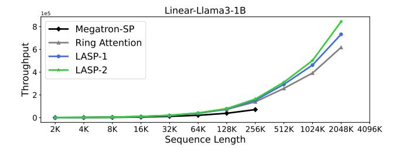
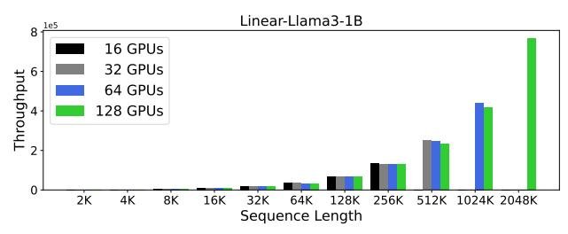

# 4. Experiments

We conducted an empirical evaluation of LASP-2 by applying it to a model based on Llama3 [\(Dubey et al.,](#page-9-14) [2024\)](#page-9-14). We replaced the standard softmax attention with various linear attention modules, including the original basic linear attention [\(Katharopoulos et al.,](#page-9-3) [2020\)](#page-9-3), Lightning Attention [\(Qin](#page-10-11) [et al.,](#page-10-11) [2024b\)](#page-10-11), Retention [\(Sun et al.,](#page-10-10) [2023\)](#page-10-10), Gated Linear Attention (GLA) [\(Yang et al.,](#page-11-2) [2023\)](#page-11-2), Based [\(Arora et al.,](#page-9-16) [2024\)](#page-9-16), and Rebased [\(Aksenov et al.,](#page-9-17) [2024\)](#page-9-17). This modified model, termed Linear-Llama3, comprises 16 (linear transformer) layers, with a total of 1B parameters. Additionally, we created a hybrid model by retaining transformer layers with

standard softmax attention at every fourth layer of Linear-Llama3, forming a 1/4 hybrid architecture. All experiments were conducted on the SlimPajama dataset [\(Soboleva et al.,](#page-10-12) [2023\)](#page-10-12), utilizing the Llama3 tokenizer [\(Dubey et al.,](#page-9-14) [2024\)](#page-9-14). The full dataset contains 627B tokens, but for our experiments, we used a 50B tokens subset derived from the first chunk of the training split. The experiments were performed using GPT-style autoregressive language modeling tasks with attention masks, as this setup mirrors many practical scenarios where such tasks are commonly applied. Note that the primary focus of these experiments is to assess the training efficiency of LASP-2 when handling very-long input sequences. Training a large language model with optimal long-context capabilities falls outside the scope of this study.

Besides the following results, we have provided more additional experiment results in Appendix [A.5.](#page-14-1)

### 4.1. Experimental Setup

Hardware and Software. Our experiments were conducted on a configuration of up to 16 DGX-A100 servers, each equipped with 8 A100 GPUs. The GPUs are connected through NVSwitch, offering an inter-GPU bandwidth of 600 GBps. The experiments were implemented using PyTorch 2.3.1, with support from CUDA 12.1, cuDNN 8.9.2, and NCCL 2.20.5. The algorithm was developed on top of NVIDIA's Megatron-Core 0.9.0 [\(Shoeybi et al.,](#page-10-13) [2019\)](#page-10-13). We use Triton 2.3.1 [\(Tillet et al.,](#page-11-5) [2019\)](#page-11-5) to accelerate the linear attention computation on GPU, and take FlashAttention-2 [\(Dao,](#page-9-2) [2023\)](#page-9-2) as the standard attention implementation. When implement other SP methods (e.g., Ring Attentoin, Megatron-SP) on linear attention instances for the purpose of comparison, we do not incorporate the right-product kernel trick. We maintain the use of each method's original communication primitives and computational manners as they originally proposed for standard attention.

Hyperparameters. For training the Linear-Llama3 model, we employed a cosine learning rate schedule with a linear warm-up phase [\(Sun et al.,](#page-10-14) [2024b\)](#page-10-14). The minimum learning rate was set to 1e −6 . We applied gradient clipping with a value of 1.0 and weight decay at a rate of 0.1. The Adam optimizer [\(Kingma & Ba,](#page-9-18) [2014\)](#page-9-18) was used, configured with β1 = 0.9 and β2 = 0.95 [\(Zhang et al.,](#page-11-6) [2019;](#page-11-6) [Zhou et al.,](#page-11-7) [2020\)](#page-11-7). Additionally, the dropout rate in both attention and hidden layers was set to 0 [\(Tang et al.,](#page-10-15) [2023\)](#page-10-15).

### 4.2. Speed

To assess the speed performance of our proposed LASP-2, we conducted a comparison against existing SP methods, including Megatron-SP [\(Korthikanti et al.,](#page-9-11) [2022\)](#page-9-11), Ring Attention [\(Liu et al.,](#page-9-13) [2023\)](#page-9-13), and LASP-1 [\(Sun et al.,](#page-10-7) [2024a\)](#page-10-7). As depicted in Fig. [3,](#page-7-0) LASP-2 demonstrated superior throughput, particularly when sequence lengths exceeded 64K. This

Table 2: **Convergence Performance Results.** All experiments used 8 A100 GPUs, sequence length of 16K, and batch size of 8, trained on 50B tokens from the SlimPajama corpus.

| Model         | SP Method      | Attention Module                                  | Pure Model |         | 1/4 Hybrid Model |       |
|---------------|----------------|---------------------------------------------------|------------|---------|------------------|-------|
|               |                |                                                   | Thpt       | Loss    | Thpt             | Loss  |
| Llama3        | Ring Attention | Standard Attention                                | 16549.5    | 2.759   | \                | \     |
|               | LASP-2(H)      | Basic Linear Attention                            | 17834.3    | 2.892   | 17394.7          | 2.824 |
|               |                | Lightning Attention                               | 17926.1    | 2.862   | 17384.2          | 2.758 |
| Linear-Llama3 |                | Retention                                         | 17859.6    | 2.867   | 17352.5          | 2.759 |
| Linear-Liamas | LA3P-2(П)      | ASP-2(H) GLA 17785.3 2.845 Based 17946.1 2.754 | 2.845      | 17273.2 | 2.754            |       |
|               |                |                                                   | 17462.5    | 2.751   |                  |       |
|               |                | Rebased                                           | 17896.2    | 2.845   | 17284.5          | 2.787 |

Figure 3: **Speed Comparison (tokens/s).** Experiments were carried out on a pure Linear-Llama3-1B model, utilizing the basic linear attention module. A total of 64 A100 GPUs were employed, and the SP size T was also set to 64. To accommodate very-long sequence lengths, such as 2048K, the batch size was kept fixed at 1 throughout this experiment.

performance advantage became increasingly prominent as sequence lengths grew longer. Specifically, at a sequence length of 512K, LASP-2 outperformed Ring Attention by 17.8% and surpassed LASP-1 by 7.3%. This advantage became even more pronounced at a sequence length of 2048K, where LASP-2 achieved throughput gains of 36.6% over Ring Attention and 15.2% over LASP-1.

## 4.3. Scalability

We assessed the scalability of LASP-2 in terms of both GPU memory usage and throughput by adjusting the sequence length and the number of GPUs. The results were displayed in Figure 4. LASP-2 demonstrated the ability to scale linearly with the input sequence length by increasing the number of GPUs. For instance, while maintaining the same memory cost per GPU, using 8 GPUs allowed training on sequences up to 128K in length, whereas 128 GPUs (16  $\times$  8 GPUs) enabled training on sequences as long as 2048K (16  $\times$  128K). Additionally, we observed that increasing both sequence length and device numbers results in higher throughput, indicating improved communication efficiency and linear scalability. More detailed quantitative scalability outcomes are provided in Table 6 in Appendix A.5.

Figure 4: **Scalability Results.** Experiments were conducted on a pure Linear-Llama3-1B model using the Basic Linear Attention module. SP size T was always equal to number of GPUs. Batch size was fixed as 1 to accommodate very-long sequence lengths, e.g., 2048K. The sign " $\times$ " with a dotted line represented occurring an Out of Memory (OOM).

#### 4.4. Convergence Performance

We conducted additional experiments to assess the pretraining convergence performance of LASP-2 on Llama-3 with various attention modules, including standard softmax attention, basic linear attention, Lightning Attention, Retention, GLA, Based, Rebased, and their 1/4 hybrid models. All experiments were performed on the SlimPajama corpus (Soboleva et al., 2023), using 50B tokens, a sequence length of 16K, and a global batch size of 8, using 8 A100 GPUs. The results, as shown in Table 2, indicated that for pure Linear-Llama3 models with different linear attention modules, LASP-2 achieved comparable, though slightly higher, loss values while maintaining superior throughput. On the 1/4 hybrid Linear-Llama3 model, the loss results were generally better than those of the pure linear models, with Lightning Attention, Retention, and GLA even attaining equivalent or lower loss values compared to the baseline. The Based attention module shows strong throughput and

loss performance, since its original design uses a mix of (Taylor) linear attention and sliding window attention. The 1/4 hybrid model striked a balance between throughput and convergence performance, performing competitively when compared to both the baseline and its pure linear version.

### 4.5. Related Work

## 4.5.1. LINEAR SEQUENCE MODELING

Linear Attention. Vanilla linear attention [\(Katharopoulos](#page-9-3) [et al.,](#page-9-3) [2020\)](#page-9-3) introduces the use of kernel methods as a replacement for the Softmax attention [\(Vaswani et al.,](#page-11-0) [2017\)](#page-11-0), thereby reducing the computational complexity to linear in sequence length. Following this, several variants of linear attention have been proposed. TransNormerLLM [\(Qin](#page-10-16) [et al.,](#page-10-16) [2023b;](#page-10-16)[a\)](#page-10-17) proposes Lightning Attention, a refined linear attention mechanism that accelerates processing by optimizing IO interactions. Lightning Attention-2 [\(Qin et al.,](#page-10-11) [2024b\)](#page-10-11) further realizes the theoretical advantages of linear attention by separately handling inter- and intra-block computations. RetNet [\(Sun et al.,](#page-10-10) [2023\)](#page-10-10) introduces a retention mechanism that combines recurrence with attention, benefiting from both parallel training and linear inference. Gated Linear Attention (GLA) [\(Yang et al.,](#page-11-2) [2023\)](#page-11-2) incorporates a data-independent gating mechanism into the linear attention framework, and presents an efficient algorithm for training. DeltaNet [\(Schlag et al.,](#page-10-18) [2021\)](#page-10-18) and its parallelized version [\(Yang et al.,](#page-11-3) [2024\)](#page-11-3) use a delta rule-like update to enhance linear attention performance in long-context scenarios. Finally, Gated Slot Attention (GSA) [\(Zhang et al.,](#page-11-8) [2024\)](#page-11-8), inspired by GLA, introduces a gated linear attention mechanism with bounded-memory slot control to further improve efficiency.

State Space Modeling. The SSM serves as a powerful framework for representing the behavior of sequences within dynamic systems, and it has shown considerable promise in the realm of linear sequence modeling. Mamba [\(Gu &](#page-9-4) [Dao,](#page-9-4) [2023\)](#page-9-4) incorporates a mechanism for selecting states, thereby facilitating the scaling of linear sequence lengths. This architecture has been further enhanced in Mamba-2 [\(Dao & Gu,](#page-9-5) [2024\)](#page-9-5), where the introduction of the state space duality (SSD) framework optimizes its performance.

Linear RNN. Traditional RNNs face significant challenges in handling long-context sequence modeling, primarily due to their inherent sequence dependency during training, which prevents them from fully capitalizing on scaling laws [\(Sun et al.,](#page-10-10) [2023\)](#page-10-10). To address these limitations, RWKV [\(Peng et al.,](#page-10-4) [2023;](#page-10-4) [2024\)](#page-10-5) was introduced as a linear RNN-based large language model that aims to efficiently manage long-term dependencies. Additionally, HGRN [\(Qin](#page-10-19) [et al.,](#page-10-19) [2024e\)](#page-10-19) highlights the critical role of data-dependent decay mechanisms in enhancing linear RNN performance, demonstrating how adjustments to decay parameters can improve learning in long-context tasks. An enhanced version, HGRN2 [\(Qin et al.,](#page-10-20) [2024d\)](#page-10-20), expands on this approach by incorporating a state expansion mechanism that utilizes outer product operations, which allows for greater scalability and improved modeling capabilities over extended sequences. Both RWKV and HGRN series seek to overcome weaknesses of RNNs for efficient long-sequence modeling.

## 4.5.2. SEQUENCE PARALLELISM

SP [\(Li et al.,](#page-9-19) [2022\)](#page-9-19) is a distributed technology designed for training language models more efficiently, which is implemented by dividing a long sequence into multiple shorter subsequences and processing these subsequences in parallel on multiple computing devices. Existing SP methods [\(Kor](#page-9-11)[thikanti et al.,](#page-9-11) [2022;](#page-9-11) [Jacobs et al.,](#page-9-12) [2023\)](#page-9-12) whose parallelism degree cannot exceed the number of attention heads, which limits their scalability. Ring Attention [\(Liu et al.,](#page-9-13) [2023\)](#page-9-13) is proposed to address high memory cost in long sequence modeling by distributing subsequences across different devices and overlapping the communication of KV blocks. LASP [\(Sun et al.,](#page-10-7) [2024a\)](#page-10-7) proposes a new linear attentiontailored SP strategy based on GPU friendly implementation by utilizing a P2P ring-style communication strategy, but still lacks of optimizations for hybrid model architecture.

