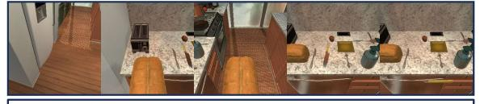
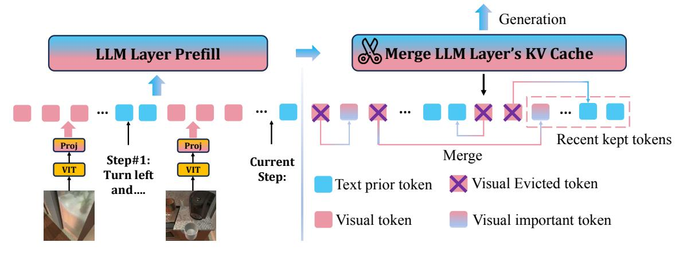

## LOOK-M: Look-Once Optimization in KV Cache for Efficient Multimodal Long-Context Inference

Zhongwei Wan1†\*, Ziang Wu2† , Che Liu3 , Jinfa Huang2 , Zhihong Zhu2 , Peng Jin2 , Longyue Wang4‡ , Li Yuan2‡

1The Ohio State University 2Peking University 3 Imperial College London 4Tencent AI Lab wan.512@osu.edu, ziangwu7777@gmail.com, che.liu21@imperial.ac.uk {jinfahuang, jp21, zhihongzhu}@stu.pku.edu.cn, vinnylywang@tencent.com yuanli-ece@pku.edu.cn

Code: <https://github.com/SUSTechBruce/LOOK-M>.

## Abstract

Long-context Multimodal Large Language Models (MLLMs) demand substantial computational resources for inference as the growth of their multimodal Key-Value (KV) cache, in response to increasing input lengths, challenges memory and time efficiency. Unlike single-modality LLMs that manage only textual contexts, the KV cache of long-context MLLMs includes representations from multiple images with temporal and spatial relationships and related textual contexts. The predominance of image tokens means traditional optimizations for LLMs' KV caches are unsuitable for multimodal long-context settings, and no prior works have addressed this challenge. In this work, we introduce LOOK-M, a pioneering, fine-tuning-free approach that efficiently reduces the multimodal KV cache size while maintaining performance comparable to a full cache. We observe that during prompt prefilling phase, the model prioritizes more textual attention over image features, and based on the multimodal interaction observation, a new proposed text-prior method is explored to compress the KV cache. Furthermore, to mitigate the degradation of image contextual information, we propose several compensatory strategies using KV pairs merging. LOOK-M demonstrates that with a significant reduction in KV Cache memory usage, such as reducing it by 80% in some cases, it not only achieves up to 1.5x faster decoding but also maintains or even enhances performance across a variety of long context multimodal tasks.

## 1 Introduction

Large language models (LLMs) [\(Achiam et al.,](#page-8-0) [2023;](#page-8-0) [Meta,](#page-9-0) [2024;](#page-9-0) [Jiang et al.,](#page-8-1) [2023;](#page-8-1) [Wan et al.,](#page-9-1) [2023b\)](#page-9-1) are progressively evolving into multimodal large language models (MLLMs) [\(Yang et al.,](#page-10-0)

**Instruction:** Your objective is the main goal. Evaluate your current environment and your past decisions, and decide your immediate course of action.

**Question:** Your Main Goal: Put a warm slice of bread on the counter. Step Details: <image1>Step#1: Turn around and walk to the counter top above the dishwasher, just past the refrigerator. <image2>Step#2: Pick up the loaf of bread to the right of the toaster. <image3>Step#3: Move over to your right so that you are directly in front of the knife's on the counter. <image4>Step#4: Place the bread on the counter to the left of the knife's. <image5>Current Step:

**GroundTruth**:Pick up the knife closest to the fork on the right, located on the counter.

Figure 1: A multimodal long-context sample contains multiple images from MileBench [\(Song et al.,](#page-9-2) [2024\)](#page-9-2) showing comprehensive spatial relationships.

[2023;](#page-10-0) [Yin et al.,](#page-10-1) [2023\)](#page-10-1), making significant advances in the processing of extensive multimodal contexts such as GPT-4V. Despite the impressive capabilities of MLLMs, they still face significant challenges when dealing with long multimodal context inputs, such as temporal multi-image tasks and semantic multi-image tasks [\(Song et al.,](#page-9-2) [2024\)](#page-9-2), or multi-turn multimodal dialogues [\(Team et al.,](#page-9-3) [2023\)](#page-9-3) in real-world applications. Specifically, multimodal KV caches hinder the efficient processing of long multimodal inputs. During inference, the increased lengths of inputs linearly slow down the decoding process due to the attention computations across past multimodal KVs.

Furthermore, as depicted in Figure [1,](#page-0-0) in contrast to text-only LLMs' KV cache eviction methods [\(Zhang et al.,](#page-10-2) [2023;](#page-10-2) [Wan et al.,](#page-9-1) [2023b\)](#page-9-1), long multimodal inputs typically include multiple interrelated images, along with definitions or background descriptions relevant to the task. Directly applying traditional text-centric KV cache eviction strategies [\(Zhang et al.,](#page-10-2) [2023;](#page-10-2) [Ge et al.,](#page-8-2) [2023;](#page-8-2) [Ren and Zhu,](#page-9-4) [2024a;](#page-9-4) [Li et al.,](#page-9-5) [2024\)](#page-9-5) to MLLMs overlooks the potential interactions between multimodal representations [\(Team et al.,](#page-9-3) [2023\)](#page-9-3). Specifically, Figure [2](#page-1-0) shows the attention visualization for multimodal long-context, the model exhibits

\*Work was done at Tencent AI Lab.

†Equal contribution.

‡Corresponding authors.

Figure 2: Visualization of attention in multimodal prompt encoding phase, where XT represents a text sentence and XI denotes a subsequent image, showcasing the interleaved input of text and images in multimodal long-context scenarios.

greater attention to the textual components during the multimodal prompt encoding process. This observation demonstrates that the model tends to understand global visual content through textual knowledge, highlighting the necessity of preserving textual features and selectively pruning redundant image tokens in the multimodal KV cache to maintain the integrity of the multimodal context.

In this paper, we introduce LOOK-M, a pioneering and efficient framework that marks the first effort to compress KV caches specifically for multimodal long-context scenarios. The term Look-Once in our method implies that pruning occurs only once during multimodal long prompt encoding, and the model effectively sees the full image just once. LOOK-M utilizes a text-prior technique that prioritizes the retention of textual KV pairs during the prompt encoding phase, given the insight from Figure [2.](#page-1-0) For visual representation, inspired by attention-based eviction strategies [\(Zhang et al.,](#page-10-3) [2024b\)](#page-10-3), our method prunes redundant visual KV pairs that show sparse patterns in attention visualizations, utilizing the metric of attention scores. Furthermore, to preserve global contextual information in the compressed cache, we develop several merging strategies to merge the evicted KV tokens into conserved ones, addressing potential hallucinations and contextual inconsistencies [\(Yang et al.,](#page-10-4) [2024\)](#page-10-4) during the decoding process.

Remarkably, LOOK-M does not require any fine-tuning and can be applied in a plug-andplay manner with a look-once KV cache compression strategy. We evaluate our LOOK-M with several strategies over four recent MLLM backbones LLaVA-v1.5-7B/13B [\(Liu et al.,](#page-9-6) [2023\)](#page-9-6), MobileVLM-v2 [\(Chu et al.,](#page-8-3) [2024a\)](#page-8-3) and InternVLv1.5 [\(Chen et al.,](#page-8-4) [2023\)](#page-8-4) across several multimodal long-context tasks from MileBench [\(Song et al.,](#page-9-2)

[2024\)](#page-9-2): temporal multi-image tasks, semantic multiimage tasks, needle in a haystack task, and image retrieval tasks, respectively. Compared to baselines, LOOK-M achieves minimal performance drop with a fixed KV cache budget and improves the model inference decoding latency by 1.3x to 1.5x and reduces KV Cache memory footprint by 80% to 95% while still maintaining performance on long context multimodal tasks, and even showing improved performance across various tasks. Our analysis validates that combining text-prior and proposed merging strategies contributes to the multimodal KV cache compression effectiveness of LOOK-M.

## 2 Related work

Vision Token Compression For MLLMs. Classical works in this category, including MobileVLM [\(Chu et al.,](#page-8-5) [2024b\)](#page-8-5), LLaVA-Prumerge [\(Shang et al.,](#page-9-7) [2024\)](#page-9-7), MADTP [\(Cao et al.,](#page-8-6) [2024\)](#page-8-6), and FastV [\(Chen et al.,](#page-8-7) [2024\)](#page-8-7), focus on reducing the number of image tokens, which constitute the majority of total tokens. These methods enhance inference speed by eliminating redundant image tokens. Specifically, MobileVLM [\(Chu](#page-8-5) [et al.,](#page-8-5) [2024b\)](#page-8-5) employs a lightweight projector architecture featuring an average pooling layer to significantly compress the number of visual tokens. LLaVA-Prumerge [\(Shang et al.,](#page-9-7) [2024\)](#page-9-7) and MADTP [\(Cao et al.,](#page-8-6) [2024\)](#page-8-6) introduce adaptive approaches to visual token reduction, effectively decreasing their count while maintaining model performance. FastV [\(Chen et al.,](#page-8-7) [2024\)](#page-8-7) introduces a versatile plug-and-play method that optimizes computational efficiency through adaptive attention patterns in early layers and visual token pruning in later stages, achieving up to a 45% reduction in computational costs while preserving performance. Unlike these methods, which focus solely on optimizing VIT output tokens and require finetuning, LOOK-M specifically targets multimodal token compression within the KV cache without necessitating additional fine-tuning.

KV Cache Compression For LLMs. KV cache compression primarily encompasses three strategies: Eviction, Quantization, and Trainable Compression. In eviction, techniques like Mistral-7B [\(Jiang et al.,](#page-8-1) [2023\)](#page-8-1) and StreamingLLM [\(Xiao](#page-10-5) [et al.,](#page-10-5) [2023\)](#page-10-5) only preserve key tokens for efficient sequence generation, while approaches like H2O[\(Zhang et al.,](#page-10-3) [2024b\)](#page-10-3) and SnapKV [\(Li et al.,](#page-9-5)

#### Pick up the mug that's in front of you at the coffee maker.

Figure 3: Pipeline of LOOK-M's KV cache optimization strategy. 'Prefill' denotes prompt encoding.

2024) focus on maintaining a small, influential set of tokens to enhance performance, though risk losing context with evicted KVs. Quantization strategies such as KIVI (Liu et al., 2024d) and Gear (Kang et al., 2024) reduce cache memory through advanced quantization techniques, balancing memory efficiency with precision. In trainable Compression, methods like LESS (Dong et al., 2024) and DMC (Nawrot et al., 2024) adapt LLMs to compress KV caches by training on selected datasets, although they face challenges in generalization. However, our LOOK-M utilizes a plugand-play approach that does not require additional training, ensuring wider applicability without the necessity for tuning specific to multimodal datasets. Therefore, different from these text-centric KV cache compression methods, our LOOK-M specifically targets long multimodal text scenarios and seeks to leverage attention map interactions between text and images to guide KV cache pruning.

Unlike token pruning (Tang Token Merging. et al., 2023; Kong et al., 2021; Song et al., 2022; Yun et al., 2024) in encoder-based backbones like ViT (Dosovitskiy et al., 2021) or Bert (Devlin et al., 2019), which discards less significant tokens, token merging (Bolya et al., 2022) consolidates tokens into fewer, more meaningful units, preserving information integrity. Consequently, token merging has become preferred over token pruning to reduce token count. Existing methods like TPS (Wei et al., 2023), MG-ViT (Zhang et al., 2024a), and PuMer (Cao et al., 2023) have explored token merging and pruning techniques, primarily in computer vision tasks. In contrast, LOOK-M is a pioneering effort to adapt token merging within the multimodal KV cache in long-context scenarios, enhancing efficiency for auto-regressive tasks in MLLMs.

#### 3 Methodology

In Section 3.1, we first review the basic implementation of generative inference utilizing a multimodal KV cache. Subsequently, as shown in Figure 3, we detail the principal components of the LOOK-M model, which includes text-prior KV pairs eviction strategy to facilitate precise pruning, discussed in Section 3.2, and various strategies for merging KV pairs, such as averaged, pivotal, and weighted merging in Section 3.3.

