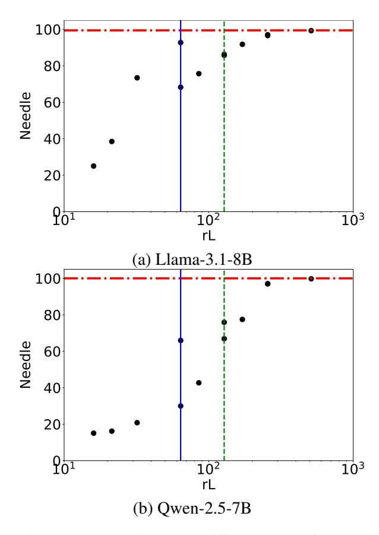
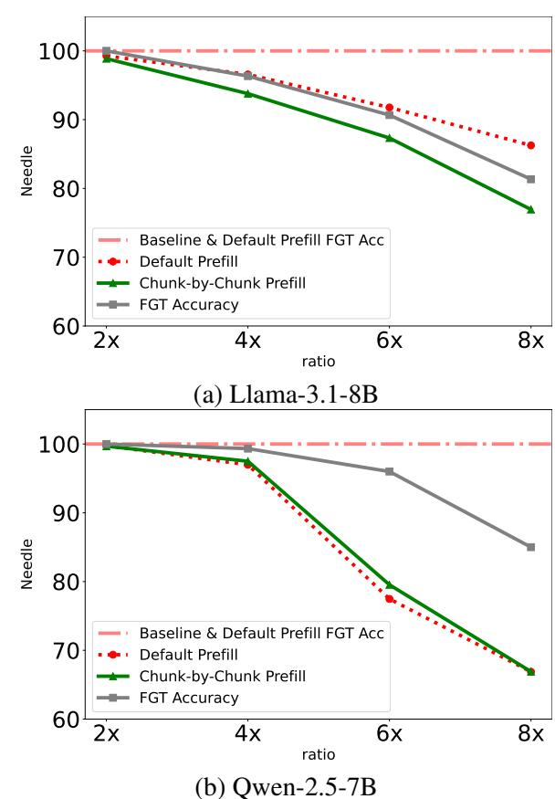
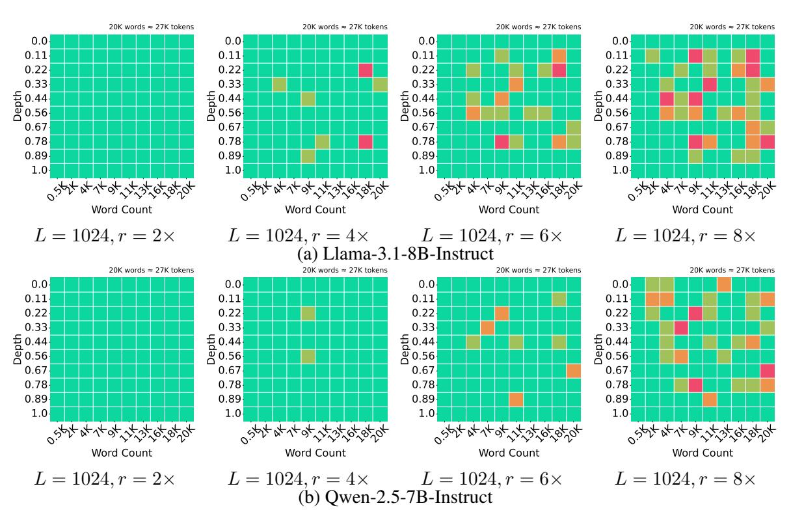

# 4.3 Chunk-by-Chunk Compression in Prefill Stage

To enable chunk-by-chunk compression during prefill, we have to split the retrieval tokens like our recursive compression for long context with prefilling the first S+2L tokens and then L each time until all input tokens are prefilled. In such a way, the hidden values after the first chunk will be different from default prefill ones since less tokens are seen in the forwarding. Then, the FGT may be different too. With the chunk-by-chunk prefill compression, we calculated the FGT accuracy which is defined as the ratio of FGT same as the default prefill ones and also the overall needle scores, shown in Fig. 3.

The chunked prefill definitely diminishes the FGT accuracy as it drops from 100% to around 80% for  $r=8\times$  in both models. But we do not see it has a strong dependence on sequence lengths or needle depths in Fig. 4. These confirm that our method is able to retain the major part of the baseline capabilities in the case with long sequence hidden values impacted by the compression. It ensures that LagKV will deliver a good performance in the long generation scenarios.

Meanwhile, we also notice that the FGT accuracy and overall needle scores suffer more degradation in Llama model with chunked prefill. It is mainly because different models exhibit various abilities of stable long generation (Quan et al., 2024).

Table 3: Performance of LagKV.

| Model                 | Method      | Single. QA | Multi. QA | Summ. | Few-shot | Synthetic | Code  | LB Avg. | Needle |
|-----------------------|-------------|------------|-----------|-------|----------|-----------|-------|---------|--------|
|                       | FullKV      | 40.71      | 37.90     | 28.29 | 68.49    | 68.00     | 58.70 | 47.44   | 99.44  |
|                       | L=1024,r=2x | 39.42      | 37.12     | 27.38 | 67.71    | 68.50     | 58.83 | 46.74   | 99.27  |
|                       | L=1024,r=4x | 37.06      | 36.77     | 26.79 | 66.96    | 63.50     | 58.42 | 45.54   | 96.57  |
|                       | L=1024,r=6x | 35.74      | 36.08     | 26.33 | 66.33    | 60.50     | 57.91 | 44.65   | 91.77  |
| Llama-3.1-8B-Instruct | L=1024,r=8x | 35.49      | 35.99     | 25.90 | 65.21    | 61.00     | 57.95 | 44.31   | 86.26  |
|                       | L=512,r=2x  | 39.43      | 37.45     | 27.35 | 67.82    | 67.50     | 58.66 | 46.73   | 97.02  |
|                       | L=512,r=4x  | 37.39      | 36.27     | 26.19 | 66.56    | 62.50     | 57.86 | 45.16   | 85.73  |
|                       | L=512,r=6x  | 34.95      | 35.62     | 25.52 | 65.87    | 59.50     | 58.14 | 44.11   | 75.67  |
|                       | L=512,r=8x  | 34.03      | 36.12     | 25.25 | 64.94    | 56.00     | 57.50 | 43.47   | 68.25  |
|                       | L=128,r=2x  | 38.56      | 36.80     | 27.20 | 67.64    | 68.00     | 59.27 | 46.48   | 92.76  |
|                       | L=128,r=4x  | 36.66      | 36.58     | 25.62 | 66.78    | 66.50     | 57.90 | 45.28   | 73.41  |
|                       | L=128,r=6x  | 34.57      | 35.41     | 24.59 | 63.59    | 64.00     | 56.97 | 43.49   | 38.48  |
|                       | L=128,r=8x  | 33.78      | 34.60     | 23.91 | 62.21    | 61.50     | 55.68 | 42.42   | 25.01  |
|                       | FullKV      | 41.62      | 45.00     | 26.41 | 68.91    | 100.00    | 63.60 | 51.53   | 100.00 |
|                       | L=1024,r=2x | 39.80      | 42.85     | 26.11 | 67.66    | 99.50     | 63.12 | 50.33   | 99.75  |
|                       | L=1024,r=4x | 36.92      | 40.39     | 24.81 | 65.91    | 95.00     | 61.60 | 48.15   | 96.98  |
|                       | L=1024,r=6x | 35.77      | 39.74     | 24.68 | 65.28    | 93.50     | 61.45 | 47.52   | 77.47  |
|                       | L=1024,r=8x | 34.60      | 39.10     | 24.18 | 64.74    | 90.50     | 61.30 | 46.73   | 66.88  |
|                       | L=512,r=2x  | 38.72      | 42.79     | 25.91 | 67.98    | 98.50     | 62.00 | 49.91   | 97.07  |
|                       | L=512,r=4x  | 35.42      | 39.12     | 24.49 | 64.59    | 94.00     | 60.16 | 47.01   | 75.89  |
|                       | L=512,r=6x  | 34.00      | 38.04     | 23.72 | 64.31    | 87.50     | 58.80 | 45.69   | 42.70  |
| Qwen-2.5-7B-Instruct  | L=512,r=8x  | 32.14      | 37.83     | 23.11 | 63.48    | 82.50     | 58.71 | 44.64   | 30.00  |
|                       | L=128,r=2x  | 38.67      | 42.49     | 25.69 | 67.75    | 99.00     | 60.64 | 49.61   | 65.93  |
|                       | L=128,r=4x  | 34.47      | 39.78     | 24.07 | 65.13    | 96.00     | 58.67 | 46.91   | 20.83  |
|                       | L=128,r=6x  | 32.83      | 38.15     | 22.95 | 62.23    | 90.50     | 56.25 | 44.76   | 16.18  |
|                       | L=128,r=8x  | 32.47      | 37.10     | 22.20 | 60.24    | 88.50     | 56.10 | 43.78   | 15.07  |

#### 4.4 Scoring Methods

We present two different scoring variants from LagKV. Both of them will only change the scoring methods but keep the attention sink and sliding window unchanged. And we only use the 64-digits passkey retrieval task which can easily distinguish eviction strategies as the detector. Among these tests, we keep S = 16, L = 1024 as constant.

The first one is called LocalKV which only skips using the reference from the next joint chunk tokens but replacing the equation Eq. [7](#page-2-2) and [8](#page-2-3) by the following equations:

$$min_i^{p,Z} = min_{seq}(Z_i^p) \tag{14}$$

$$max_i^{p,Z} = max_{seq}(Z_i^p)$$
 (15)

Therefore, the min-max is totally from the local chunk instead of the remote one.

The second one is L2 norm from [\(Devoto et al.,](#page-8-11) [2024\)](#page-8-11). We adapt the low key states norm method into the recursive framework by replacing Eq[.11](#page-2-4) by:

$$score_i = -Norm(K_i)$$
 (16)

As suggested in their work, we skip the compression of the first two layers in this variant too.

The results of the 64-digit passkey retrieval task are present in Fig. [5](#page-7-1) and [6](#page-7-2) with partial match scores and exact match scores. As we can see, the LagKV method is always the best one especially in the high compression ratios and the exact match cases. The LocalKV variant performs closely to LagKV at low compression ratios but degrades significantly at higher ones. This behavior stems from the similarity between local and remote maxmin statistical values, which aligns with the tokenwise locality.

Since the setup of L = 1024 will have a chunk that fully covers the passkey when the context is shorter than 2K or the passkey is at 100% depth, the bottom line of the exact match score will be about 27% if the selected tokens did not mess up the output. That means the L2 norm variant shows very limited performance with a constant exact match score 27% for all compression ratios and models.

Figure 2: The needle score vs different setups of rL. The horizontal dash-dot line is the baseline for each model. The x-axis is in log scale. We put two vertical lines rL=64 (solid blue) and rL=128 (dash green) for guidelines.

#### 5 Related Works

The  $L_2$  Norm-Based KV compression (Devoto et al., 2024) is an existing eviction approach that relies solely on KV information to compress the KV cache. This method computes token scores using the negative norm of key states. In contrast to our derivation from the autoregressive process and the token-wise locality, their method is formed by comparing the attention loss.

FINCH (Corallo and Papotti, 2024) introduces a prompt-guided KV compression method for the prefill stage, employing a chunk-by-chunk approach with instruction tokens appended to each document chunk. This design ensures the computation of attention submatrices between instructions and document chunks, enabling subsequent KV cache filtering. In contrast, our proposed chunked prefilling method operates without instructions, making it compatible with multi-turn queries. In other words, our approach transforms a causal LLM into a compressor capable of condensing long

Figure 3: The needle score and FGT accuracy for different prefill methods with L=1024 only. The horizontal dash-dot line is the baseline for both needle scores and FGT accuracy since they are overlapping.

documents into compressed KV sequences, which can later be decompressed under varying instructions without reconstruction.

#### 6 Conclusion

In this study, we propose LagKV, an attention-weight-free token eviction method. It achieves comparable performance on long-context tasks while significantly outperforming mainstream eviction strategies in 64-digit passkey retrieval tasks. These results demonstrate that our method maintains robust long-text retrieval capabilities even at high compression ratios.

Unlike existing approaches, LagKV employs a recursive attention-weight-free strategy in both prefill and decode stages to determine token importance for future processing. It is independent from query states and the rest part of the long prompt. Therefore our method offers a novel perspective on LLM mechanisms, shedding light on their inner workings in a fundamentally different way.

Figure 4: First Generated Token Accuracy for different setups, sequence lengths and needle depths with chunked prefill. It tests three trials on each depth.

Figure 5: The 64-digit Passkey Retrieval **partial** match scores of different variants and compression ratios.

Figure 6: The 64-digit Passkey Retrieval **exact** match scores of different variants and compression ratios.

