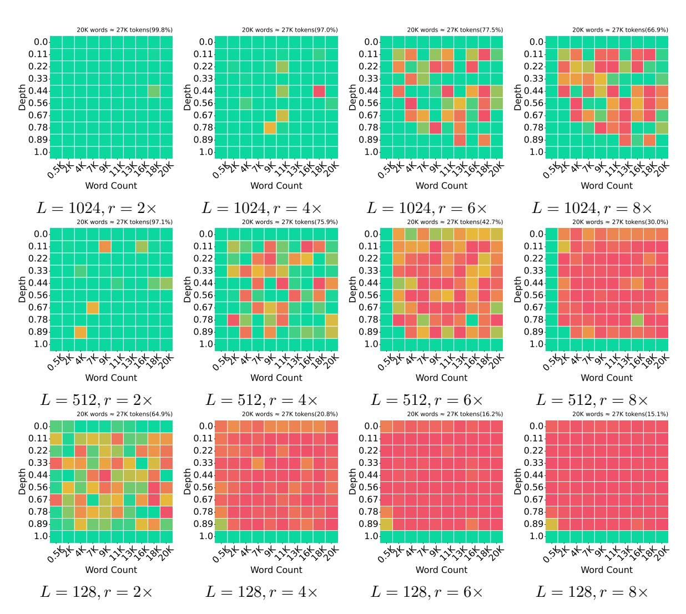

# References

- Joshua Ainslie, James Lee-Thorp, Michiel de Jong, Yury Zemlyanskiy, Federico Lebron, and Sumit Sanghai. 2023. [GQA: Training generalized multi-query trans](https://doi.org/10.18653/v1/2023.emnlp-main.298)[former models from multi-head checkpoints.](https://doi.org/10.18653/v1/2023.emnlp-main.298) In *Proceedings of the 2023 Conference on Empirical Methods in Natural Language Processing*, pages 4895– 4901, Singapore. Association for Computational Linguistics.
- Yushi Bai, Xin Lv, Jiajie Zhang, Hongchang Lyu, Jiankai Tang, Zhidian Huang, Zhengxiao Du, Xiao Liu, Aohan Zeng, Lei Hou, Yuxiao Dong, Jie Tang, and Juanzi Li. 2024. [LongBench: A bilingual, multi](https://doi.org/10.18653/v1/2024.acl-long.172)[task benchmark for long context understanding.](https://doi.org/10.18653/v1/2024.acl-long.172) In *Proceedings of the 62nd Annual Meeting of the Association for Computational Linguistics (Volume 1: Long Papers)*, pages 3119–3137, Bangkok, Thailand. Association for Computational Linguistics.
- Giulio Corallo and Paolo Papotti. 2024. [FINCH:](https://doi.org/10.1162/tacl_a_00716) [Prompt-guided key-value cache compression for](https://doi.org/10.1162/tacl_a_00716) [large language models.](https://doi.org/10.1162/tacl_a_00716) *Transactions of the Association for Computational Linguistics*, 12:1517–1532.
- Tri Dao. 2023. Flashattention-2: Faster attention with better parallelism and work partitioning. *arXiv preprint arXiv:2307.08691*.
- DeepSeek-AI, Daya Guo, Dejian Yang, Haowei Zhang, Junxiao Song, Ruoyu Zhang, Runxin Xu, Qihao Zhu, Shirong Ma, Peiyi Wang, Xiao Bi, Xiaokang Zhang, Xingkai Yu, Yu Wu, Z. F. Wu, Zhibin Gou, Zhihong Shao, Zhuoshu Li, Ziyi Gao, Aixin Liu, Bing Xue, Bingxuan Wang, Bochao Wu, Bei Feng, Chengda Lu, Chenggang Zhao, Chengqi Deng, Chenyu Zhang, Chong Ruan, Damai Dai, Deli Chen, Dongjie Ji, Erhang Li, Fangyun Lin, Fucong Dai, Fuli Luo, Guangbo Hao, Guanting Chen, Guowei Li, H. Zhang, Han Bao, Hanwei Xu, Haocheng Wang, Honghui Ding, Huajian Xin, Huazuo Gao, Hui Qu, Hui Li, Jianzhong Guo, Jiashi Li, Jiawei Wang, Jingchang Chen, Jingyang Yuan, Junjie Qiu, Junlong Li, J. L. Cai, Jiaqi Ni, Jian Liang, Jin Chen, Kai Dong, Kai Hu, Kaige Gao, Kang Guan, Kexin Huang, Kuai Yu, Lean Wang, Lecong Zhang, Liang Zhao, Litong Wang, Liyue Zhang, Lei Xu, Leyi Xia, Mingchuan Zhang, Minghua Zhang, Minghui Tang, Meng Li, Miaojun Wang, Mingming Li, Ning Tian, Panpan Huang, Peng Zhang, Qiancheng Wang, Qinyu Chen, Qiushi Du, Ruiqi Ge, Ruisong Zhang, Ruizhe Pan, Runji Wang, R. J. Chen, R. L. Jin, Ruyi Chen, Shanghao Lu, Shangyan Zhou, Shanhuang Chen, Shengfeng Ye, Shiyu Wang, Shuiping Yu, Shunfeng Zhou, Shuting Pan, S. S. Li, Shuang Zhou, Shaoqing Wu, Shengfeng Ye, Tao Yun, Tian Pei, Tianyu Sun, T. Wang, Wangding Zeng, Wanjia Zhao, Wen Liu, Wenfeng Liang, Wenjun Gao, Wenqin Yu, Wentao Zhang, W. L. Xiao, Wei An, Xiaodong Liu, Xiaohan Wang, Xiaokang Chen, Xiaotao Nie, Xin Cheng, Xin Liu, Xin Xie, Xingchao Liu, Xinyu Yang, Xinyuan Li, Xuecheng Su, Xuheng Lin, X. Q. Li, Xiangyue Jin, Xiaojin Shen, Xiaosha Chen, Xiaowen Sun, Xiaoxiang Wang, Xinnan Song, Xinyi Zhou, Xianzu Wang,

- Xinxia Shan, Y. K. Li, Y. Q. Wang, Y. X. Wei, Yang Zhang, Yanhong Xu, Yao Li, Yao Zhao, Yaofeng Sun, Yaohui Wang, Yi Yu, Yichao Zhang, Yifan Shi, Yiliang Xiong, Ying He, Yishi Piao, Yisong Wang, Yixuan Tan, Yiyang Ma, Yiyuan Liu, Yongqiang Guo, Yuan Ou, Yuduan Wang, Yue Gong, Yuheng Zou, Yujia He, Yunfan Xiong, Yuxiang Luo, Yuxiang You, Yuxuan Liu, Yuyang Zhou, Y. X. Zhu, Yanhong Xu, Yanping Huang, Yaohui Li, Yi Zheng, Yuchen Zhu, Yunxian Ma, Ying Tang, Yukun Zha, Yuting Yan, Z. Z. Ren, Zehui Ren, Zhangli Sha, Zhe Fu, Zhean Xu, Zhenda Xie, Zhengyan Zhang, Zhewen Hao, Zhicheng Ma, Zhigang Yan, Zhiyu Wu, Zihui Gu, Zijia Zhu, Zijun Liu, Zilin Li, Ziwei Xie, Ziyang Song, Zizheng Pan, Zhen Huang, Zhipeng Xu, Zhongyu Zhang, and Zhen Zhang. 2025. [Deepseek-r1: Incen](http://arxiv.org/abs/2501.12948)[tivizing reasoning capability in llms via reinforce](http://arxiv.org/abs/2501.12948)[ment learning.](http://arxiv.org/abs/2501.12948)
- Alessio Devoto, Yu Zhao, Simone Scardapane, and Pasquale Minervini. 2024. [A simple and effective](https://doi.org/10.18653/v1/2024.emnlp-main.1027) l\_2 [norm-based strategy for KV cache compression.](https://doi.org/10.18653/v1/2024.emnlp-main.1027) In *Proceedings of the 2024 Conference on Empirical Methods in Natural Language Processing*, pages 18476–18499, Miami, Florida, USA. Association for Computational Linguistics.
- Yuan Feng, Junlin Lv, Yukun Cao, Xike Xie, and S. Kevin Zhou. 2024. [Ada-kv: Optimizing kv cache](http://arxiv.org/abs/2407.11550) [eviction by adaptive budget allocation for efficient](http://arxiv.org/abs/2407.11550) [llm inference.](http://arxiv.org/abs/2407.11550)
- Aaron Grattafiori, Abhimanyu Dubey, and Abhinav Jauhri .et al. 2024. [The llama 3 herd of models.](http://arxiv.org/abs/2407.21783)
- Qiuhan Gu. 2023. Llm-based code generation method for golang compiler testing. In *Proceedings of the 31st ACM Joint European Software Engineering Conference and Symposium on the Foundations of Software Engineering*, pages 2201–2203.
- Chi Han, Qifan Wang, Hao Peng, Wenhan Xiong, Yu Chen, Heng Ji, and Sinong Wang. 2024. [LM](https://doi.org/10.18653/v1/2024.naacl-long.222)[infinite: Zero-shot extreme length generalization for](https://doi.org/10.18653/v1/2024.naacl-long.222) [large language models.](https://doi.org/10.18653/v1/2024.naacl-long.222) In *Proceedings of the 2024 Conference of the North American Chapter of the Association for Computational Linguistics: Human Language Technologies (Volume 1: Long Papers)*, pages 3991–4008, Mexico City, Mexico. Association for Computational Linguistics.
- Cheng-Ping Hsieh, Simeng Sun, Samuel Kriman, Shantanu Acharya, Dima Rekesh, Fei Jia, Yang Zhang, and Boris Ginsburg. 2024. Ruler: What's the real context size of your long-context language models? *arXiv preprint arXiv:2404.06654*.
- Gregory Kamradt. 2023. [Needle In A Haystack - pres](https://github.com/gkamradt/LLMTest_NeedleInAHaystack/tree/main)[sure testing LLMs.](https://github.com/gkamradt/LLMTest_NeedleInAHaystack/tree/main) *Github*.
- Jared Kaplan, Sam McCandlish, Tom Henighan, Tom B. Brown, Benjamin Chess, Rewon Child, Scott Gray, Alec Radford, Jeffrey Wu, and Dario Amodei. 2020. [Scaling laws for neural language models.](http://arxiv.org/abs/2001.08361)

- Philippe Laban, Wojciech Kryscinski, Divyansh Agarwal, Alexander Fabbri, Caiming Xiong, Shafiq Joty, and Chien-Sheng Wu. 2023. [SummEdits: Measuring](https://doi.org/10.18653/v1/2023.emnlp-main.600) [LLM ability at factual reasoning through the lens](https://doi.org/10.18653/v1/2023.emnlp-main.600) [of summarization.](https://doi.org/10.18653/v1/2023.emnlp-main.600) In *Proceedings of the 2023 Conference on Empirical Methods in Natural Language Processing*, pages 9662–9676, Singapore. Association for Computational Linguistics.
- Yucheng Li, Huiqiang Jiang, Qianhui Wu, Xufang Luo, Surin Ahn, Chengruidong Zhang, Amir H. Abdi, Dongsheng Li, Jianfeng Gao, Yuqing Yang, and Lili Qiu. 2025. [SCBench: A KV cache-centric analysis](https://openreview.net/forum?id=gkUyYcY1W9) [of long-context methods.](https://openreview.net/forum?id=gkUyYcY1W9) In *The Thirteenth International Conference on Learning Representations*.
- Yuhong Li, Yingbing Huang, Bowen Yang, Bharat Venkitesh, Acyr Locatelli, Hanchen Ye, Tianle Cai, Patrick Lewis, and Deming Chen. 2024. Snapkv: Llm knows what you are looking for before generation. *arXiv preprint arXiv:2404.14469*.
- Yuhan Liu, Hanchen Li, Yihua Cheng, Siddhant Ray, Yuyang Huang, Qizheng Zhang, Kuntai Du, Jiayi Yao, Shan Lu, Ganesh Ananthanarayanan, Michael Maire, Henry Hoffmann, Ari Holtzman, and Junchen Jiang. 2024a. [Cachegen: Kv cache compression and](https://doi.org/10.1145/3651890.3672274) [streaming for fast large language model serving.](https://doi.org/10.1145/3651890.3672274) In *Proceedings of the ACM SIGCOMM 2024 Conference*, ACM SIGCOMM '24, page 38–56, New York, NY, USA. Association for Computing Machinery.
- Zichang Liu, Aditya Desai, Fangshuo Liao, Weitao Wang, Victor Xie, Zhaozhuo Xu, Anastasios Kyrillidis, and Anshumali Shrivastava. 2024b. Scissorhands: Exploiting the persistence of importance hypothesis for llm kv cache compression at test time. *Advances in Neural Information Processing Systems*, 36.
- Zichang Liu, Jue Wang, Tri Dao, Tianyi Zhou, Binhang Yuan, Zhao Song, Anshumali Shrivastava, Ce Zhang, Yuandong Tian, Christopher Re, and Beidi Chen. 2023. [Deja vu: Contextual sparsity for efficient llms](http://arxiv.org/abs/2310.17157) [at inference time.](http://arxiv.org/abs/2310.17157)
- Zirui Liu, Jiayi Yuan, Hongye Jin, Shaochen Zhong, Zhaozhuo Xu, Vladimir Braverman, Beidi Chen, and Xia Hu. 2024c. Kivi: A tuning-free asymmetric 2bit quantization for kv cache. *arXiv preprint arXiv:2402.02750*.
- Amirkeivan Mohtashami and Martin Jaggi. 2023. [Land](http://arxiv.org/abs/2305.16300)[mark attention: Random-access infinite context](http://arxiv.org/abs/2305.16300) [length for transformers.](http://arxiv.org/abs/2305.16300)
- NVIDIA. 2024. [Llm kv cache compression made easy.](https://github.com/NVIDIA/kvpress)
- Shanghaoran Quan, Tianyi Tang, Bowen Yu, An Yang, Dayiheng Liu, Bofei Gao, Jianhong Tu, Yichang Zhang, Jingren Zhou, and Junyang Lin. 2024. [Lan](http://arxiv.org/abs/2410.23933)[guage models can self-lengthen to generate long](http://arxiv.org/abs/2410.23933) [texts.](http://arxiv.org/abs/2410.23933)

- Qwen, :, An Yang, Baosong Yang, Beichen Zhang, Binyuan Hui, Bo Zheng, Bowen Yu, Chengyuan Li, Dayiheng Liu, Fei Huang, Haoran Wei, Huan Lin, Jian Yang, Jianhong Tu, Jianwei Zhang, Jianxin Yang, Jiaxi Yang, Jingren Zhou, Junyang Lin, Kai Dang, Keming Lu, Keqin Bao, Kexin Yang, Le Yu, Mei Li, Mingfeng Xue, Pei Zhang, Qin Zhu, Rui Men, Runji Lin, Tianhao Li, Tianyi Tang, Tingyu Xia, Xingzhang Ren, Xuancheng Ren, Yang Fan, Yang Su, Yichang Zhang, Yu Wan, Yuqiong Liu, Zeyu Cui, Zhenru Zhang, and Zihan Qiu. 2025. [Qwen2.5 technical](http://arxiv.org/abs/2412.15115) [report.](http://arxiv.org/abs/2412.15115)
- Hanlin Tang, Yang Lin, Jing Lin, Qingsen Han, Shikuan Hong, Yiwu Yao, and Gongyi Wang. 2024a. [Razo](http://arxiv.org/abs/arXiv:2407.15891)[rattention: Efficient kv cache compression through](http://arxiv.org/abs/arXiv:2407.15891) [retrieval heads.](http://arxiv.org/abs/arXiv:2407.15891)
- Jiaming Tang, Yilong Zhao, Kan Zhu, Guangxuan Xiao, Baris Kasikci, and Song Han. 2024b. Quest: queryaware sparsity for efficient long-context llm inference. In *Proceedings of the 41st International Conference on Machine Learning*, ICML'24. JMLR.org.
- Ashish Vaswani, Noam Shazeer, Niki Parmar, Jakob Uszkoreit, Llion Jones, Aidan N. Gomez, Lukasz Kaiser, and Illia Polosukhin. 2023. [Attention is all](http://arxiv.org/abs/1706.03762) [you need.](http://arxiv.org/abs/1706.03762)
- Guangxuan Xiao, Yuandong Tian, Beidi Chen, Song Han, and Mike Lewis. 2023. Efficient streaming language models with attention sinks. *arXiv preprint arXiv:2309.17453*.
- Dongjie Yang, Xiaodong Han, Yan Gao, Yao Hu, Shilin Zhang, and Hai Zhao. 2024. [PyramidInfer: Pyramid](https://aclanthology.org/2024.findings-acl.195) [KV cache compression for high-throughput LLM](https://aclanthology.org/2024.findings-acl.195) [inference.](https://aclanthology.org/2024.findings-acl.195) In *Findings of the Association for Computational Linguistics ACL 2024*, pages 3258–3270, Bangkok, Thailand and virtual meeting. Association for Computational Linguistics.
- Jiayi Yuan, Hongyi Liu, Shaochen Zhong, Yu-Neng Chuang, Songchen Li, Guanchu Wang, Duy Le, Hongye Jin, Vipin Chaudhary, Zhaozhuo Xu, Zirui Liu, and Xia Hu. 2024. Kv cache compression, but what must we give in return? a comprehensive benchmark of long context capable approaches. In *The 2024 Conference on Empirical Methods in Natural Language Processing*.
- Zhenyu Zhang, Ying Sheng, Tianyi Zhou, Tianlong Chen, Lianmin Zheng, Ruisi Cai, Zhao Song, Yuandong Tian, Christopher Ré, Clark Barrett, et al. 2024. H2o: Heavy-hitter oracle for efficient generative inference of large language models. *Advances in Neural Information Processing Systems*, 36.

Figure 7: The 64-digit Passkey Retrieval of Llama-3.1-8B-Instruct for different setups with partial matching.

#### A Appendix

#### A.1 Detail Rresults of Passkey Retrieval

Here, we present all the Needle-in-a-Haystack results with 64-digit Passkey Retrieval for different setups. The partial matching results are in Fig.7 and 8 while Fig.9 and 10 with exact matching. Overall accuracies are noted within parentheses on the top-right corner of each sub graph.

Figure 8: The 64-digit Passkey Retrieval of Owen-2.5-7B-Instruct for different setups with partial matching.

Figure 9: The 64-digit Passkey Retrieval of Llama-3.1-8B-Instruct for different setups with exact matching.

Figure 10: The 64-digit Passkey Retrieval of Owen-2.5-7B-Instruct for different setups with exact matching.