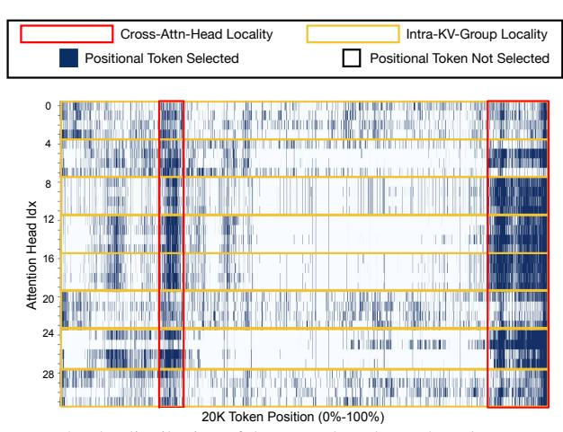
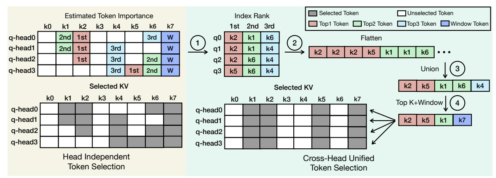
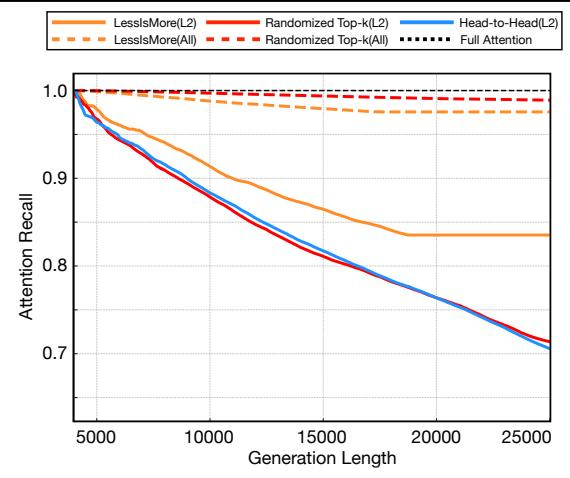
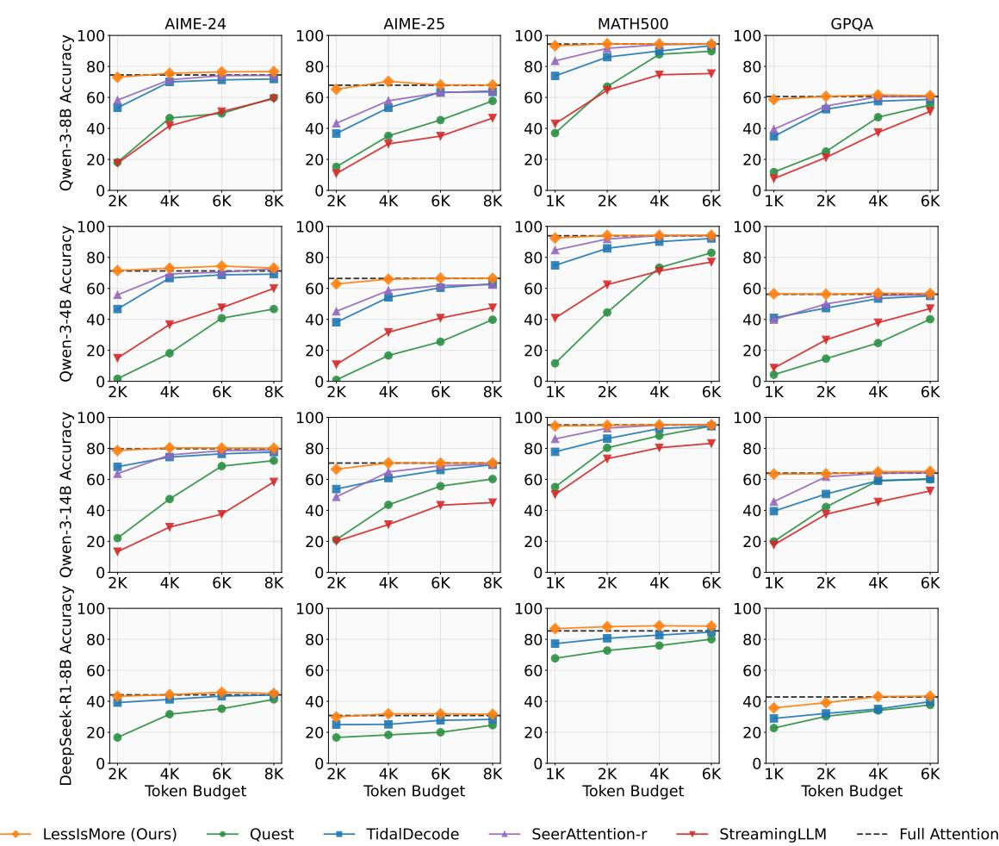
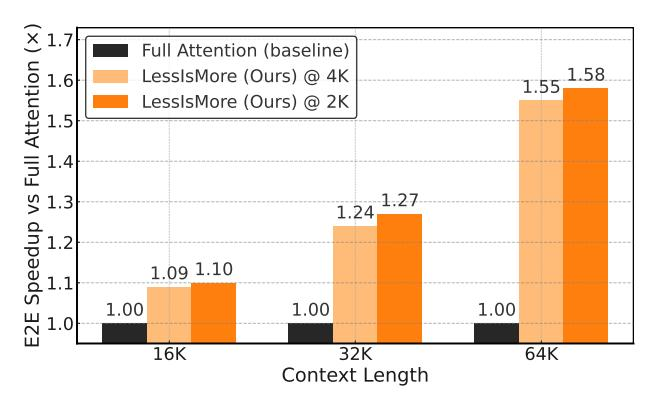
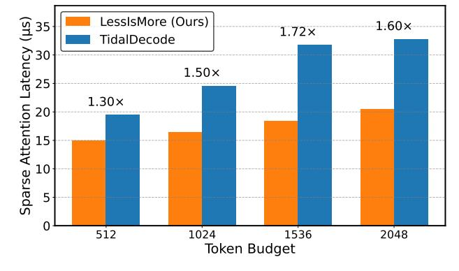
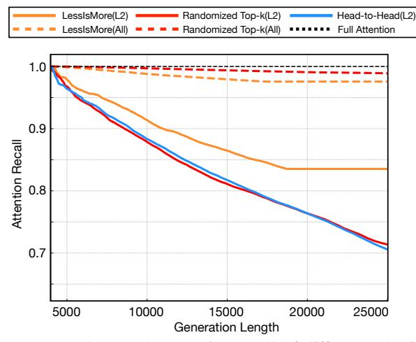
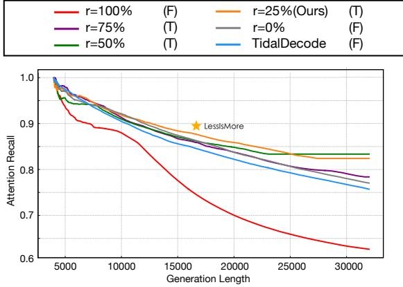
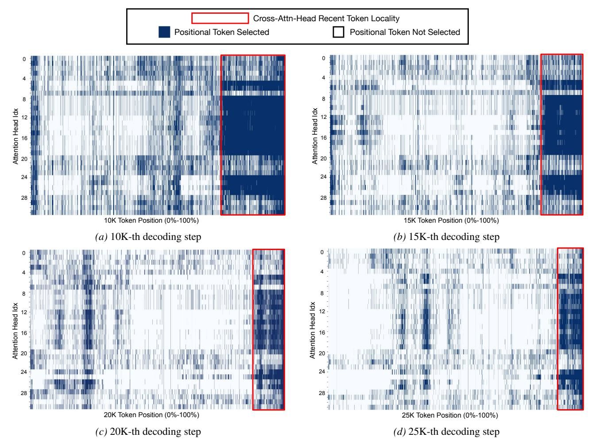
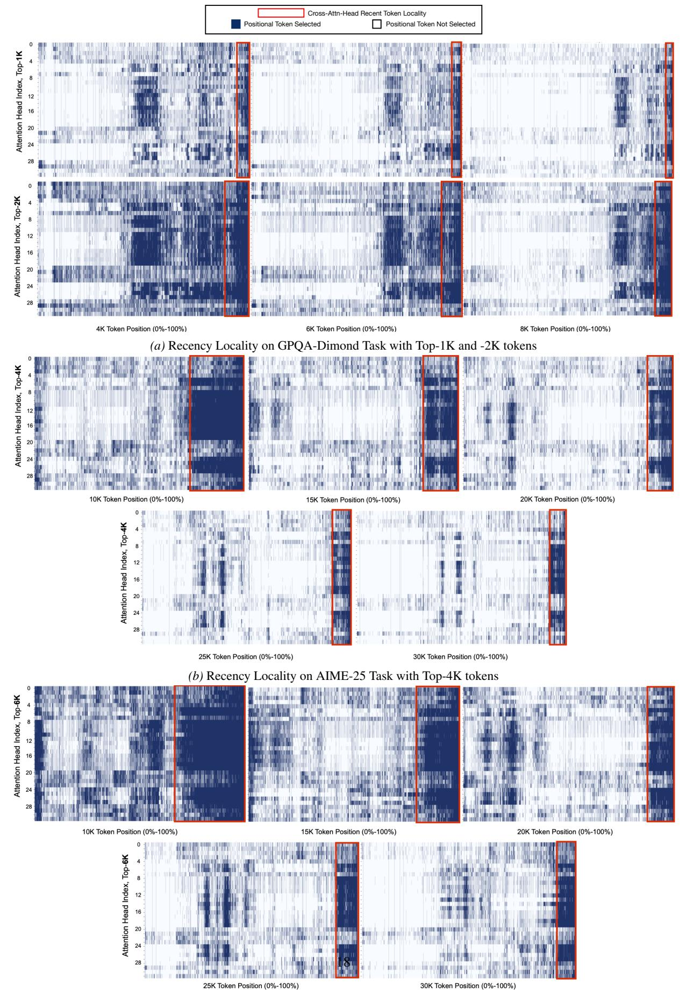

# 2.1 Background: Attention Recall as Diagnostic Metric

Attention mechanisms are central to transformer-based LLMs. For each attention head i, attention scores and outputs are computed as:

$$W_i = \frac{Q_i K_i^T}{\sqrt{d}}, \quad O_i = \text{softmax}(W_i) V_i,$$
 (1)

where  $Q_i$ ,  $K_i$ , and  $V_i$  denote the query, key, and value tensors, respectively. Sparse attention methods approximate this computation by selecting a subset of tokens  $\rho$  under a fixed budget k:

$$\arg\max_{\rho} f(Q_i, K_i[\rho], V_i[\rho], k), \quad |\rho| = k.$$
 (2)

The effectiveness of sparse attention depends on how well the selected subset captures the true attention distribution. We quantify this using <u>attention recall</u>, defined as the fraction of attention mass retained by the selected tokens:

$$R_i = \frac{\sum (\text{softmax}(W_i)[\rho])}{\sum (\text{softmax}(W_i))}.$$
 (3)

High attention recall is a necessary condition for preserving model accuracy under sparse decoding, especially when errors can accumulate over long generation horizons.

#### 2.2 Failure of Existing Sparse Attention in Reasoning

Existing sparse attention methods typically optimize attention recall <u>locally</u>, either per head, per layer, or per decoding step. While such local approximations are often sufficient for short generation or retrieval tasks, they prove brittle for reasoning workloads that require thousands of consecutive decoding steps.

As shown in Figure 1a, both StreamingLLM and TidalDecode exhibit substantial attention recall degradation on the

AIME-24 benchmark, with recall deteriorating steadily as generation length increases. TidalDecode achieves only ~75% recall, while StreamingLLM falls below 65%. Importantly, these failures occur despite using the same token budgets that preserve accuracy on retrieval tasks such as needle-in-the-haystack (Figure 1b).

The key distinction is generation length. Reasoning tasks involve orders of magnitude more decoding steps than retrieval tasks, causing even small selection errors to compound over time. Once critical tokens are omitted, subsequent reasoning steps cannot recover, leading to cascading logical errors and, in some cases, longer generation traces (Gao et al., 2025). These observations indicate that sparse attention for reasoning must prioritize global stability in token selection, not just instantaneous recall.

#### <span id="page-2-1"></span>2.3 Spatial Locality Across Attention Heads

A common assumption in sparse attention design is that different attention heads specialize in distinct roles and therefore require independent token subsets (Xiao et al., 2024; Yang et al., 2024). However, our analysis reveals that this assumption does not hold for reasoning workloads.

Section 2.3 visualizes the ground-truth top-4K attended tokens across all 32 attention heads in a decoding step of Qwen3-8B. We observe substantial overlap in token importance rankings both within key-value groups (yellow regions) and across all heads (red regions). These overlaps are not transient artifacts: they persist across layers and decoding steps (see Section A.6 and figs. 9 and 10).

This cross-head spatial locality implies that reasoning attention is governed by a shared set of globally important tokens rather than head-specific patterns. Consequently, per-head top-k selection yields only a local optimum, overfitting to head-specific noise while failing to capture globally salient tokens that remain important in future layers. This

<span id="page-3-0"></span>

*Figure 2.* The distribution of the ground-truth top-4K tokens across all attention heads at the 20K-th decoding step at Layer 4 on AIME-24 with Qwen3-8B. Dark blue positions indicate tokens included in the ground-truth top-4K budget. We enclose highly overlapped attention regions within the same KV group and across all heads using different colors.

observation suggests that token selection strategies should aggregate information across heads rather than maintaining independent token subsets.

### <span id="page-3-2"></span>2.4 Temporal Recency Locality

In addition to spatial locality, reasoning attention exhibits a strong temporal structure. As shown in Section [2.3,](#page-3-0) the most recently generated tokens consistently receive high attention scores across all heads. We further analyze this phenomenon across decoding steps and find that the size of the effective "recency window" remains remarkably stable throughout the reasoning process (Section [A.6\)](#page-13-0).

This temporal recency locality reflects the incremental nature of step-by-step reasoning, where the next reasoning step builds directly on the immediately preceding conclusions [\(Lee & Hockenmaier,](#page-9-13) [2025\)](#page-9-13). Importantly, our analysis shows that the ratio between the number of recent tokens and the total number of critical tokens remains approximately constant across decoding steps. This property implies that allocating a fixed proportional budget to recent context is important to preserve reasoning coherence as generation length grows.

Prior approaches, such as StreamingLLM, recognize the importance of recent tokens by maintaining a fixed sliding window [\(Xiao et al.,](#page-9-7) [2023\)](#page-9-7). However, a static window size does not adapt to different token budgets and fails to reflect the stable proportional structure observed in reasoning attention. This motivates selection mechanisms that explicitly reserve a fraction of the token budget for recent context.

### 3 LessIsMore

Guided by the analysis in Section [2,](#page-1-0) LessIsMore is designed around a single unifying principle: in long-horizon rea-

### <span id="page-3-1"></span>Algorithm 1 LessIsMore Decoding Pipeline

```
1: Input: Current hidden state h, KV cache C, token budget K,
   static ratio r
2: Output: Logits
3: Initialize: ρ = []
4: for each decoder layer i do
5: q, k, v = f(Wqkv, h)
6: C.append(k, v)
7: if i is Full Attention Layer then
8: o = FullAttention(q, C[:])
9: else if i is Token Selection Layer then
10: o = FullAttention(q, C[:]), P := q · C.K⊤
11: ρhead = TopKIndices(P[:, : −(K · r)], k = K ·(1−r))
12: ρunified, ρrecent = UnionFlatten(ρhead), Recent(K · r)
13: ρ = ρunified[: K · (1 − r)] ∪ ρrecent
14: else
15: o = SparseAttention(q, C[ρ])
16: end if
17: h = FFN(o)
18: end for
19:
20: return lm head(h)
```

soning, token importance is global across attention heads and remains stable over decoding steps. This principle directly yields two design requirements for sparse attention in reasoning workloads: (i) token selection must be globally consistent across heads, and (ii) token selection must be stable across layers, with explicit preservation of recent context.

LessIsMore practices these requirements through Cross-Head Unified Sparse Attention (CUSA), a training-free sparse attention mechanism that performs cross-head unified token selection and stable recency preservation. While the underlying design is general and can be incorporated into any selection-based sparse attention framework, in this work we instantiate LessIsMore on top of TidalDecode [\(Yang et al.,](#page-9-8) [2024\)](#page-9-8), a strong baseline that separates token selection from sparse attention computation. LessIs-More uses a small number of token selection layers to compute globally valid token indices, which are then reused by subsequent sparse attention layers. This reuse directly reflects the observed stability of token importance in reasoning and enables substantial amortization of the selection cost. The complete decoding pipeline is summarized in Algorithm [1](#page-3-1) and visually illustrated in Figure [3.](#page-4-0)

### 3.1 Cross-Head Unified Sparse Attention (CUSA)

As shown in Algorithm [1,](#page-3-1) LessIsMore processes each decoding step using three types of layers: full attention layers, token selection layers, and sparse attention layers. Full attention layers (lines 7–8) are used sparingly to ensure accurate early-context modeling. Token selection layers (lines 9–15) compute a globally consistent token index set ρ, which is then reused by subsequent sparse attention layers (line 16).

At a token selection layer, LessIsMore first computes full

<span id="page-4-0"></span>

Figure 3. Overview of CUSA in LessIsMore. Each attention head first selects its top-k tokens under budget K=4 with r=0.25 reserved for the recency window (Stable Recency Window), producing head-level selections  $\rho_{head}$ . These indices are then aggregated across heads through Cross-Head Selection into a unified ranked set, from which the top entries are kept. Finally, this unified set is concatenated with the most recent tokens to form the final token set  $\rho$ , which is shared by all sparse attention layers. Only tokens in  $\rho$  are loaded from the KV cache until the next selection step, ensuring both cross-head consistency and stable recency preservation.

attention to obtain the query–key product  $P=q\cdot\mathcal{C}.K^{\top}$  (line 10). Importantly, this computation is used only to estimate token importance, not just to produce attention outputs. The total token budget K is decomposed into two complementary components: (i) a set of globally selected historical tokens and (ii) a reserved set of recent tokens. This decomposition directly mirrors the spatial and temporal locality structures identified in Section 2.

Once computed, the selected token indices  $\rho$  are shared by all attention heads and reused across multiple layers. This index sharing is a deliberate design choice: by enforcing a single globally consistent token set, LessIsMore prevents the accumulation of head-specific selection errors and stabilizes sparse attention over long decoding horizons.

#### 3.2 Cross-Head Unified Token Selection

To address the strong cross-head spatial locality observed from attention pattern in reasoning (Section 2.3), LessIs-More replaces per-head independent token selection with aggregation through cross-head unified selection.

As implemented in lines 11-12 of Algorithm 1, each attention head independently proposes its top-k candidate tokens based on exact attention scores:

$$\rho_{\text{head}} = \text{TopKIndices}(P[:,:-(K \cdot r)], k = K \cdot (1-r)).$$

Rather than treating these proposals as disjoint head-specific selections, LessIsMore aggregates them into a single unified candidate set using UnionFlatten(·). The aggregated tokens are then globally ranked, and only the highest-ranked  $K \cdot (1-r)$  tokens are retained.

This aggregation step enforces a global notion of token importance that reflects agreement across attention heads. Compared to per-head selection, CUSA reduces selection variance, improves attention recall under infrequent re-

selection, and significantly simplifies KV cache access by allowing all heads to attend to the same token subset. Importantly, CUSA does not assume identical head behavior; instead, it exploits the empirically observed overlap in token importance to identify tokens that are robustly useful for reasoning across heads and future layers.

#### 3.3 Stable Recency Preservation

In addition to spatial locality, reasoning attention exhibits strong temporal recency locality (Section 2.4), where recently generated tokens consistently receive high attention across heads and decoding steps. To preserve this structure, LessIsMore explicitly reserves a fixed fraction r of the token budget for recent context.

As shown in lines 12–13 of Algorithm 1, LessIsMore selects the most recent  $K \cdot r$  tokens via  $\operatorname{Recent}(K \cdot r)$  and unions them with the globally selected historical tokens:

$$\rho = \rho_{\text{unified}}[: K \cdot (1 - r)] \cup \rho_{\text{recent}}.$$

Unlike prior approaches that use a fixed-size sliding window regardless of token budget (Yuan et al., 2025), LessIsMore employs a stable proportional recency window. This design is directly motivated by our observation that the ratio between recent tokens and total critical tokens remains approximately constant throughout reasoning. By allocating a fixed proportion of resources to the recent context, LessIsMore preserves step-by-step reasoning coherence while maintaining sparsity across different budgets and sequence lengths.

#### 3.4 Why Infrequent Re-Selection Works

A key advantage of LessIsMore is that token selection does not need to be performed at every decoding layer. Because CUSA produces globally consistent and temporally stable token indices, the selected set  $\rho$  remains valid across multi-

<span id="page-5-0"></span>

*Figure 4.* The Top-4K (with 1K window size) attention recall of different selection schemes applied only on Layer 2 (L2) or all decoding layers (All). (1) LessIsMore: unified top-k selection across all attention heads with 25% tokens allocated to the recency window; (2) Randomized Top-k: random application of one query head's top-k tokens to the entire KV group; and (3) Head-to-Head: direct utilization of top-k tokens for each individual attention head.

ple subsequent layers. This allows LessIsMore to amortize selection cost and reduce overhead without recall drop.

We empirically validate this property in Figure [4,](#page-5-0) which shows locally optimized selection strategies degrade rapidly when selection is performed infrequently, while LessIsMore maintains high attention recall even when selection is applied only once early in Layer 2 during decoding. This robustness confirms that enforcing global consistency is essential for stable sparse attention in long-horizon reasoning.

### <span id="page-5-2"></span>4 Experiments

### 4.1 Experiment Setup

We conduct extensive experiments to evaluate the accuracy and efficiency of LessIsMore. Our experiments consider four widely-used reasoning models from two families, Qwen3-4, Qwen3-8B, and Qwen3-14B [\(Team,](#page-9-1) [2025\)](#page-9-1) and DeepSeek-R1-Distill-Llama-8B [\(DeepSeek-AI,](#page-8-0) [2025\)](#page-8-0) backed up with GQA. All models are specifically trained for reasoning tasks and perform the effective thinking process by generating extensive tokens. Further, we evaluate on multiple mainstream reasoning tasks, including AIME-24, AIME-25, GPQA-Diamond, and MATH500.

Baselines. In Section [4.2,](#page-5-1) we compare LessIsMore against both training-free sparse attention methods (TidalDecode [\(Yang et al.,](#page-9-8) [2024\)](#page-9-8) and Quest [\(Tang et al.,](#page-9-9) [2024\)](#page-9-9)) and training-required, reasoning-focused baselines (SeerAttention-r [\(Gao et al.,](#page-8-4) [2025\)](#page-8-4)). For all training-free approaches, including LessIsMore, we use two initial fullattention layers, followed by a single token selection layer performing head-specific top-k selection for TidalDecode and a single CUSA layer for LessIsMore.

To ensure a fair and principled comparison, we follow the layer-selection procedure of [\(Yang et al.,](#page-9-8) [2024\)](#page-9-8) and apply the same one re-selection layer to both LessIsMore and TidalDecode across all benchmarks, balancing accuracy and efficiency. Specifically, we use Layer 12 for DeepSeek-R1- 8B, Qwen3-8B and -14B, and Layer 20 for Qwen3-4B. A detailed analysis of this choice is provided in Section [A.5.](#page-16-1)

In all experiments, LessIsMore uses a static recency-window ratio of r = 0.25, with an ablation study on the effect of r reported in Section [A.1.2.](#page-10-1) We additionally reserve four tokens as attention sinks in all experiments. For Quest, we follow the original configuration with hybrid attention layers and block sizes of 16 on DeepSeek-R1-8B and 32 on the Qwen model family, applying sparse attention at all layers. For SeerAttention-r, we adopt the settings from [\(Gao et al.,](#page-8-4) [2025\)](#page-8-4), using a block size of 64 and sparse attention applied at every layer.

Benchmarks. We evaluate all methods on challenging reasoning benchmarks, including AIME-24/25, MATH500, and GPQA-Diamond. All models are evaluated with identical prompts and a maximum generation length of 32K tokens to ensure consistent comparison. To reduce evaluation variance, we generate 64 complete traces per problem for AIME-24/25, 8 for MATH500, and 16 for GPQA-Diamond, and report Pass@1 accuracy over all traces.

In Section [4.3,](#page-6-1) we compare decoding efficiency for LessIsMore implemented with customized kernels for the selection-based models (Quest, TidalDecode) and full attention with FlashInfer [\(Ye et al.,](#page-9-16) [2024\)](#page-9-16).

### <span id="page-5-1"></span>4.2 Evaluation on Reasoning Tasks

Figure [5](#page-6-0) presents the accuracy comparison among Full Attention, LessIsMore, and other sparse attention methods as baselines across mainstream reasoning benchmarks, AIME-24, AIME-25, MATH500, and GPQA-Diamond. The first three are from the complex mathematical contests, and GPQA-Diamond comprises graduate-level STEM proofing problems. All datasets are evaluated on the reasoningfocused language models DeepSeek-R1-8B and Qwen3-4B, -8B, and -14B. For challenging AIME-24 and -25 tasks, experiments span token budgets of 2K, 4K, 6K, and 8K where the Full Attention model solves problems with an average reasoning length of 15K and 17K tokens, respectively. In contrast, existing sparse attention methods not only suffer accuracy degradation but also extend generation lengths significantly, often requiring 15K–30K tokens to complete the same problems. A similar trend holds for GPQA (Full Attention 8K vs. 8K–18K under baselines) and MATH500 (Full-Attention 5K vs. 5K–16K under baselines). By comparison, LessIsMore consistently achieves the highest accuracy across all evaluated tasks and token budgets, while maintaining generation lengths nearly identical to Full Attention (15K for AIME, 8K for

<span id="page-6-0"></span>

Figure 5. Accuracy results of LessIsMore (ours), Quest, StreamingLLM, TidalDecode, SeerAttention-r, and Full Attention across for multiple main-stream reasoning tasks. LessIsMore consistently achieves the lossless accuracy with small token budgets (1K or 2K), always outperforming all others.

GPQA, 5K for MATH). Specifically, for Qwen3-8B on AIME-24 at the smallest budget (2K tokens), LessIsMore attains nearly lossless accuracy, surpassing Quest, TidalDecode, and training-required SeerAttention-r, all of which suffer notable degradation and longer reasoning traces (Table 2). This dual advantage—accuracy preservation without length inflation—underscores LessIsMore 's ability to retain critical contextual information and facilitate fast, accurate reasoning with limited token budgets.

### <span id="page-6-1"></span>4.3 Efficiency Evaluation

To evaluate the practical efficiency gains of LessIsMore, we implement customized kernels on top of the state-of-the-art attention kernel library FlashInfer (Ye et al., 2024) for GQA-based models. We conduct end-to-end time-between-token (TBT) and kernel-level latency analysis under practical serving setups and report the results in Figure 6. Our evaluation uses DeepSeek-R1-Distill-LLama-8B (AI, 2024b; DeepSeek-AI, 2025) on one 80GB NVIDIA A100 GPU.

For end-to-end speed-up gains, as shown in Figure 6a, com-

pared to the Full Attention baseline, LessIsMore consistently accelerates decoding, delivering  $1.1 \times$ ,  $1.3 \times$ , and **1.6**× end-to-end speedups at 16K, 32K, and 64K context lengths, respectively. These improvements highlight LessIs-More 's ability to preserve reasoning quality while providing meaningful computational savings. Given that modern reasoning models—both open- and closed-source—already support generation lengths well beyond 100K tokens (OpenAI, 2025b; Anthropic, 2025; OpenAI, 2025a), the efficiency advantages of LessIsMore are expected to scale even further in real-world deployments. For kernel-level speedup gains, as shown in Figure 6b, we observe that LessIsMore can consistently achieve speed-ups from  $1.3 \times$  to  $1.7 \times$  on the sparse attention computation, compared to the TidalDecode approach under the same token budgets. This is mainly due to LessIsMore's unified token selection design, which is more kernel-friendly for GQA-based models. More specifically, methods like TidalDecode/Quest require more KV loading per KV group when different query heads can select a different set of tokens.

<span id="page-7-0"></span>



(a) End-to-end Time-Between-Token (TBT) speedup under different context lengths and token budgets. **Higher speed-up is better**. LessIsMore achieves speed-up ranging from 1.09×-1.58× compared with the full attention baseline due to attention sparsity.

(b) Sparse attention kernel latency comparison between LessIs-More and TidalDecode under different token budgets. Lower latency is better, and LessisMore achieves a speed-up ranging from  $1.3 \times -1.72 \times$  consistently across all token budgets.

Figure 6. Efficiency results with DeepSeek-R1-Distill-LLama-8B on one 80GB NVIDIA A100 GPU.

<span id="page-7-1"></span>*Table 1.* End-to-end single-step decoding latency (in ms) with a 2K token budget on DeepSeek-R1-Distilled-LLaMA-8B using the SGLang + FlashInfer serving stack (lower is better).

| Method (2K)               | 16K  | 32K  | 64K  |
|---------------------------|------|------|------|
| LessIsMore (Ours)         | 23.0 | 23.4 | 24.1 |
| TidalDecode               | 24.3 | 24.7 | 25.4 |
| Quest                     | 24.2 | 24.4 | 24.8 |
| Baseline (Full Attention) | 25.3 | 28.4 | 34.4 |

In Table 1, we also report end-to-end decoding latency when integrating LessIsMore and other sparse attention baselines into SGLang (Zheng et al., 2024), a modern serving stack. All methods were evaluated using the DeepSeek-R1-Distilled-LLaMA-8B model on a single NVIDIA A5000 GPU. For each method, we measure the per-token decoding latency under a token budget of 2K and context lengths of 16K, 32K, and 64K tokens. The backend attention computation is executed through SGLang with FlashInfer kernels, providing a unified and optimized execution environment for all baselines. Across all context lengths, LessIsMore achieves consistently lower latency than both baselines.

**Additional Experiments.** The appendix includes ablations on recency-window ratio (Section A.1.2) and generation length inflation of different sparse attention methods (Section A.1.3), kernel-level efficiency and memory profiling (Section A.2.1), LongBench and long-context retrieval results for GQA- (Tables 7 and 9) and MHA-based models (Table 8), and analysis of CUSA layer placement and recency locality in reasoning (Sections A.5 and A.6).

### 5 Related Work

**Sparse attention and KV cache compression.** Sparse attention reduces the computational and memory cost of long-context inference by restricting attention to a subset of tokens (Yang et al., 2024; Tang et al., 2024). Existing approaches fall into two categories. Eviction-based methods permanently discard tokens from the KV cache according

to heuristic criteria, maintaining a compact cache throughout generation (Xiao et al., 2023; Zhang et al., 2023; Li et al., 2024; Adnan et al., 2024). Selection-based methods retain the full cache but dynamically select tokens to attend at each step, often using head-specific top-k scores (Yang et al., 2024; Tang et al., 2024; Hao et al., 2025; Liu et al., 2024). While effective for retrieval and summarization, both paradigms struggle on reasoning workloads, where local selection errors accumulate over long generations.

**Sparse attention for reasoning.** Recent reasoning models exploit test-time scaling, where increasing generation length is often more effective than enlarging model size (Wei et al., 2023; DeepSeek-AI, 2025). However, the long-horizon nature of reasoning poses challenges for sparse attention: prior methods either incur substantial accuracy degradation under low token budgets (Yang et al., 2024; Tang et al., 2024; Cai et al., 2025) or rely on expensive post-training adaptations to recover accuracy (Gao et al., 2025), often further increasing generation length.

#### 6 Conclusion

We presented LessIsMore, a training-free sparse attention mechanism tailored for long-horizon reasoning. Our key insight is that token importance in reasoning is a global and stable property, enabling sparse attention to move beyond head-local, short-sighted selection strategies. By enforcing cross-head unified token selection and preserving recent context, LessIsMore mitigates error accumulation and avoids the reasoning length inflation observed in prior methods. Extensive evaluations show that LessIsMore preserves lossless reasoning accuracy at high sparsity—e.g., achieving full accuracy on AIME-24 with a 2K token budget-while significantly improving efficiency. With optimized kernels, LessIsMore delivers up to  $1.6 \times$  end-to-end decoding speedup over full attention and up to  $1.72 \times$  faster sparse attention computation compared to state-of-the-art baselines. Overall, our results demonstrate that explicitly exploiting global attention structure is critical for efficient and accurate sparse attention in reasoning workloads, and suggest a promising direction for scaling reasoning models without sacrificing performance.

### Impact Statement

This paper presents work whose goal is to advance the field of machine learning. There are many potential societal consequences of our work, none of which we feel must be specifically highlighted here.

### References

- <span id="page-8-5"></span>Adnan, M., Arunkumar, A., Jain, G., Nair, P. J., Soloveychik, I., and Kamath, P. Keyformer: Kv cache reduction through key tokens selection for efficient generative inference, 2024. URL [https://arxiv.org/abs/](https://arxiv.org/abs/2403.09054) [2403.09054](https://arxiv.org/abs/2403.09054).
- <span id="page-8-8"></span>AI, G. Llama-3-8b-instruct-gradient-1048k. [https://huggingface.co/gradientai/](https://huggingface.co/gradientai/Llama-3-8B-Instruct-Gradient-1048k) [Llama-3-8B-Instruct-Gradient-1048k](https://huggingface.co/gradientai/Llama-3-8B-Instruct-Gradient-1048k), 2024a. Accessed: 2024-09-26.
- <span id="page-8-6"></span>AI, M. Llama 3.1: Advanced open-source language model. [https://ai.meta.com/blog/](https://ai.meta.com/blog/meta-llama-3-1/) [meta-llama-3-1/](https://ai.meta.com/blog/meta-llama-3-1/), 2024b. Accessed: 2024-09-26.
- <span id="page-8-7"></span>Anthropic. Introducing claude 4, 2025. URL [https:](https://www.anthropic.com/news/claude-4) [//www.anthropic.com/news/claude-4](https://www.anthropic.com/news/claude-4). Announcement of Claude Opus 4 and Claude Sonnet 4 models.
- <span id="page-8-2"></span>AoPS. Aime problems and solutions. [https:](https://artofproblemsolving.com/wiki/index.php/AIME_Problems_and_Solutions) [//artofproblemsolving.com/wiki/index.](https://artofproblemsolving.com/wiki/index.php/AIME_Problems_and_Solutions) [php/AIME\\_Problems\\_and\\_Solutions](https://artofproblemsolving.com/wiki/index.php/AIME_Problems_and_Solutions), 2025. Accessed: 2025-07-14.
- <span id="page-8-9"></span>Bai, Y., Lv, X., Zhang, J., Lyu, H., Tang, J., Huang, Z., Du, Z., Liu, X., Zeng, A., Hou, L., Dong, Y., Tang, J., and Li, J. Longbench: A bilingual, multitask benchmark for long context understanding, 2023.
- <span id="page-8-3"></span>Cai, Z., Xiao, W., Sun, H., Luo, C., Zhang, Y., Wan, K., Li, Y., Zhou, Y., Chang, L.-W., Gu, J., Dong, Z., Anandkumar, A., Asi, A., and Hu, J. R-kv: Redundancy-aware kv cache compression for reasoning models, 2025. URL <https://arxiv.org/abs/2505.24133>.
- <span id="page-8-1"></span>DeepMind, G. Gemini 2.5: Our most intelligent ai model. [https://blog.](https://blog.google/technology/google-deepmind/gemini-model-thinking-updates-march-2025/) [google/technology/google-deepmind/](https://blog.google/technology/google-deepmind/gemini-model-thinking-updates-march-2025/) [gemini-model-thinking-updates-march-2025/](https://blog.google/technology/google-deepmind/gemini-model-thinking-updates-march-2025/), March 2025. Accessed: 2025-07-14.
- <span id="page-8-0"></span>DeepSeek-AI. Deepseek-r1: Incentivizing reasoning capability in llms via reinforcement learning, 2025. URL <https://arxiv.org/abs/2501.12948>.
- <span id="page-8-4"></span>Gao, Y., Guo, S., Cao, S., Xia, Y., Cheng, Y., Wang, L., Ma, L., Sun, Y., Ye, T., Dong, L., So, H. K.-H., Hua, Y., Cao, T., Yang, F., and Yang, M. Seerattention-r:

- Sparse attention adaptation for long reasoning, 2025. URL <https://arxiv.org/abs/2506.08889>.
- <span id="page-9-10"></span>Hao, J., Zhu, Y., Wang, T., Yu, J., Xin, X., Zheng, B., Ren, Z., and Guo, S. OmniKV: Dynamic context selection for efficient long-context LLMs. In The Thirteenth International Conference on Learning Representations, 2025. URL [https://openreview.net/forum?](https://openreview.net/forum?id=ulCAPXYXfa) [id=ulCAPXYXfa](https://openreview.net/forum?id=ulCAPXYXfa).
- <span id="page-9-19"></span>Kwon, W., Li, Z., Zhuang, S., Sheng, Y., Zheng, L., Yu, C. H., Gonzalez, J. E., Zhang, H., and Stoica, I. Efficient memory management for large language model serving with pagedattention, 2023. URL [https://](https://arxiv.org/abs/2309.06180) [arxiv.org/abs/2309.06180](https://arxiv.org/abs/2309.06180).
- <span id="page-9-13"></span>Lee, J. and Hockenmaier, J. Evaluating step-by-step reasoning traces: A survey, 2025. URL [https://arxiv.](https://arxiv.org/abs/2502.12289) [org/abs/2502.12289](https://arxiv.org/abs/2502.12289).
- <span id="page-9-15"></span>Li, D., Shao, R., Xie, A., Sheng, Y., Zheng, L., Gonzalez, J. E., Stoica, I., Ma, X., and Zhang, H. How long can open-source llms truly promise on context length?, June 2023. URL [https://lmsys.org/](https://lmsys.org/blog/2023-06-29-longchat) [blog/2023-06-29-longchat](https://lmsys.org/blog/2023-06-29-longchat).
- <span id="page-9-6"></span>Li, Y., Huang, Y., Yang, B., Venkitesh, B., Locatelli, A., Ye, H., Cai, T., Lewis, P., and Chen, D. Snapkv: Llm knows what you are looking for before generation, 2024. URL <https://arxiv.org/abs/2404.14469>.
- <span id="page-9-11"></span>Liu, D., Chen, M., Lu, B., Jiang, H., Han, Z., Zhang, Q., Chen, Q., Zhang, C., Ding, B., Zhang, K., Chen, C., Yang, F., Yang, Y., and Qiu, L. Retrievalattention: Accelerating long-context llm inference via vector retrieval, 2024. URL <https://arxiv.org/abs/2409.10516>.
- <span id="page-9-5"></span>Liu, Y., Wu, J., He, Y., Gao, H., Chen, H., Bi, B., Gong, R., Zhang, J., Huang, Z., and Hooi, B. Efficient inference for large reasoning models: A survey, 2025. URL [https:](https://arxiv.org/abs/2503.23077) [//arxiv.org/abs/2503.23077](https://arxiv.org/abs/2503.23077).
- <span id="page-9-18"></span>OpenAI. Introducing gpt-5, aug 2025a. URL [https:](https://openai.com/index/introducing-gpt-5/) [//openai.com/index/introducing-gpt-5/](https://openai.com/index/introducing-gpt-5/). Announcement of GPT-5, OpenAI's smartest AI system with built-in reasoning.
- <span id="page-9-17"></span>OpenAI. Introducing gpt-oss, 2025b. URL [https://openai.com/index/](https://openai.com/index/introducing-gpt-oss/) [introducing-gpt-oss/](https://openai.com/index/introducing-gpt-oss/).
- <span id="page-9-0"></span>OpenAI. Introducing openai o3 and o4 mini. [https://openai.com/index/](https://openai.com/index/introducing-o3-and-o4-mini/) [introducing-o3-and-o4-mini/](https://openai.com/index/introducing-o3-and-o4-mini/), April 2025. Accessed: 2025-07-14.
- <span id="page-9-21"></span>Oren, M., Hassid, M., Adi, Y., and Schwartz, R. Transformers are multi-state RNNs, 2024. URL [https://](https://arxiv.org/abs/2401.06104) [arxiv.org/abs/2401.06104](https://arxiv.org/abs/2401.06104). arXiv:2401.06104.

- <span id="page-9-20"></span>Rae, J. W., Potapenko, A., Jayakumar, S. M., Hillier, C., and Lillicrap, T. P. Compressive transformers for longrange sequence modelling. arXiv preprint, 2019. URL <https://arxiv.org/abs/1911.05507>.
- <span id="page-9-3"></span>Rein, D., Hou, B. L., Stickland, A. C., Petty, J., Pang, R. Y., Dirani, J., Michael, J., and Bowman, S. R. Gpqa: A graduate-level google-proof q&a benchmark, 2023. URL <https://arxiv.org/abs/2311.12022>.
- <span id="page-9-4"></span>Research, N. Open reasoning tasks: Llm reasoning tasks collection, 2024. URL [https://github.com/](https://github.com/NousResearch/Open-Reasoning-Tasks) [NousResearch/Open-Reasoning-Tasks](https://github.com/NousResearch/Open-Reasoning-Tasks).
- <span id="page-9-9"></span>Tang, J., Zhao, Y., Zhu, K., Xiao, G., Kasikci, B., and Han, S. Quest: Query-aware sparsity for efficient longcontext llm inference, 2024. URL [https://arxiv.](https://arxiv.org/abs/2406.10774) [org/abs/2406.10774](https://arxiv.org/abs/2406.10774).
- <span id="page-9-1"></span>Team, Q. Qwen3 technical report, 2025. URL [https:](https://arxiv.org/abs/2505.09388) [//arxiv.org/abs/2505.09388](https://arxiv.org/abs/2505.09388).
- <span id="page-9-2"></span>Wei, J., Wang, X., Schuurmans, D., Bosma, M., Ichter, B., Xia, F., Chi, E., Le, Q., and Zhou, D. Chain-ofthought prompting elicits reasoning in large language models, 2023. URL [https://arxiv.org/abs/](https://arxiv.org/abs/2201.11903) [2201.11903](https://arxiv.org/abs/2201.11903).
- <span id="page-9-7"></span>Xiao, G., Tian, Y., Chen, B., Han, S., and Lewis, M. Efficient streaming language models with attention sinks. arXiv, 2023.
- <span id="page-9-14"></span>Xiao, G., Tang, J., Zuo, J., Guo, J., Yang, S., Tang, H., Fu, Y., and Han, S. Duoattention: Efficient long-context llm inference with retrieval and streaming heads, 2024. URL <https://arxiv.org/abs/2410.10819>.
- <span id="page-9-8"></span>Yang, L., Zhang, Z., Chen, Z., Li, Z., and Jia, Z. Tidaldecode: Fast and accurate llm decoding with position persistent sparse attention, 2024. URL [https://arxiv.](https://arxiv.org/abs/2410.05076) [org/abs/2410.05076](https://arxiv.org/abs/2410.05076).
- <span id="page-9-16"></span>Ye, Z., Lai, R., Lu, R., Lin, C.-Y., Zheng, S., Chen, L., Chen, T., and Ceze, L. Cascade inference: Memory bandwidth efficient shared prefix batch decoding. [https://flashinfer.ai/](https://flashinfer.ai/2024/01/08/cascade-inference.html) [2024/01/08/cascade-inference.html](https://flashinfer.ai/2024/01/08/cascade-inference.html), Jan 2024. URL [https://flashinfer.ai/2024/](https://flashinfer.ai/2024/01/08/cascade-inference.html) [01/08/cascade-inference.html](https://flashinfer.ai/2024/01/08/cascade-inference.html). Accessed on 2024-02-01.
- <span id="page-9-12"></span>Yuan, J., Gao, H., Dai, D., Luo, J., Zhao, L., Zhang, Z., Xie, Z., Wei, Y. X., Wang, L., Xiao, Z., Wang, Y., Ruan, C., Zhang, M., Liang, W., and Zeng, W. Native sparse attention: Hardware-aligned and natively trainable sparse attention, 2025. URL [https://arxiv.org/abs/](https://arxiv.org/abs/2502.11089) [2502.11089](https://arxiv.org/abs/2502.11089).

<span id="page-10-0"></span>Zhang, Z., Sheng, Y., Zhou, T., Chen, T., Zheng, L., Cai, R., Song, Z., Tian, Y., Re, C., Barrett, C., Wang, Z., and ´ Chen, B. H2o: Heavy-hitter oracle for efficient generative inference of large language models, 2023.

<span id="page-10-6"></span>Zhang, Z., Sheng, Y., Zhou, T., Chen, T., Zheng, L., Cai, R., Song, Z., Tian, Y., Re, C., Barrett, C., et al. H2o: ´ Heavy-hitter oracle for efficient generative inference of large language models. Advances in Neural Information Processing Systems, 36, 2024.

<span id="page-10-2"></span>Zheng, L., Yin, L., Xie, Z., Sun, C., Huang, J., Yu, C. H., Cao, S., Kozyrakis, C., Stoica, I., Gonzalez, J. E., Barrett, C., and Sheng, Y. Sglang: Efficient execution of structured language model programs, 2024. URL <https://arxiv.org/abs/2312.07104>.

### A Appendix

This appendix provides supporting analyses and extended results for LessIsMore. We first present ablation studies (Section [A.1\)](#page-10-4) analyzing the effectiveness of unified crosshead aggregation on GQA models (Section [A.1.1\)](#page-10-5) and the impact of the recent-window ratio on attention recall and correctness (Section [A.1.2\)](#page-10-1). We then report comprehensive efficiency evaluations, including end-to-end decoding performance in the SGLang serving stack (Section [A.2.2\)](#page-12-1) and kernel-level analyses of FLOPs, memory transfer, and latency (Section [A.2.1\)](#page-12-0). Additional results cover reasoning accuracy across multiple model sizes (Tables [5](#page-14-0) and [6\)](#page-14-1), long-context performance on Needle-in-the-Haystack and LongBench benchmarks (Tables [7](#page-15-0) and [9\)](#page-15-1), the choice of reselection layers (Section [A.5\)](#page-16-1), and an empirical study of recency locality in the reasoning process (Section [A.6\)](#page-13-0).

### <span id="page-10-4"></span>A.1 Ablation Study

### <span id="page-10-5"></span>A.1.1 EFFECTIVENESS OF LESSISMORE'S AGGREGATION ON GQA

To assess whether LessIsMore's unified selection generalizes to GQA models, we compare three aggregation strategies on Qwen3-8B with shared KV heads: LessIsMore, Randomized Top-k, and Head-to-Head (Figure [7\)](#page-11-1). When selection is applied at all decoding layers, locally optimized schemes such as Randomized Top-k appear competitive. However, when selection is reduced to only Layer 2 (a more realistic low-frequency setting), these local heuristics fail to generalize, leading to substantially lower attention recall. In contrast, LessIsMore maintains strong recall in both settings, demonstrating that a globally consistent cross-head selection strategy is significantly more robust than layer-specific or head-specific methods. This underscores the importance of unified aggregation for stable token importance estimation under sparse selection.

### <span id="page-10-1"></span>A.1.2 EFFECT OF RECENT WINDOW RATIO

<span id="page-10-3"></span>We analyze how the recent-window ratio r affects attention recall and correctness on AIME-24 under a 4K token budget (Figure [8\)](#page-11-1). Only configurations that combine a recent window with Cross-Head Selection (25%, 50%, 75%) successfully solve the task. Using only recent tokens (r = 100%) yields the lowest recall by discarding essential long-range context. TidalDecode improves recall yet still fails to reach the correct answer, and using Cross-Head Selection with 0% recent further improves recall but likewise fails. Introducing even a modest recent window consistently boosts recall. The 25% configuration—corresponding to the LessIsMore design—achieves the highest recall across the generation, validating the choice of allocating a small fraction of the token budget to recent tokens.

<span id="page-11-1"></span>

*Figure 7.* The Top-4K attention recall of different selection schemes applied only on Layer 2(L2) or all decoding layers(All). (1) LessIsMore: our unified top-k selection across all attention heads with 25% tokens for recency window, (2) Randomized Top-k: random application of one query head's top-k tokens to the entire KV group, and (3) Head-to-Head: direct utilization of top-k tokens for each individual attention head LessIsMore



*Figure 8.* Ablation study on the impact of varying static recency window ratio r in LessIsMore (⋆) on the AIME-24 reasoning task, using a token budget of 4K and generation length up to 32K tokens on Qwen3-8B. LessIsMore corresponds to the 25% recent setting combined with Cross-Head Selection, (labeled with (⋆)). We compare it against alternative recent window ratios, the 100% recent baseline (i.e., using only recent tokens), and TidalDecode.

### A.1.3 GENERATION LENGTH ANALYSIS UNDER SPARSE ATTENTION

Sparse attention methods exhibit a concerning tendency that extends generation lengths on reasoning tasks, as demonstrated in Table [2](#page-11-0) and corroborated by prior research [\(Gao](#page-8-4) [et al.,](#page-8-4) [2025\)](#page-8-4). This phenomenon reflects the accumulation of selection errors discussed in Section [1,](#page-0-0) where imprecise token retention forces models into inefficient reasoning patterns that compromise both accuracy and computational efficiency.

Table [2](#page-11-0) presents the average generation lengths of different approaches under various token budgets on AIME-24

<span id="page-11-0"></span>*Table 2.* AIME-24 accuracy (%) and average generation length (K tokens) on Qwen3-8B. Sparse methods often extend generation due to selection errors. LessIsMore maintains lengths close to Full Attention while achieving best accuracy.

|                   | K=2000 |      |      | K=4000 | K=6000 |      |  |
|-------------------|--------|------|------|--------|--------|------|--|
| Method            | Acc    | Len  | Acc  | Len    | Acc    | Len  |  |
| Quest             | 18.2   | 30.0 | 46.7 | 22.9   | 49.6   | 19.6 |  |
| SeerAttention-r   | 58.2   | 19.8 | 71.4 | 16.3   | 74.1   | 15.3 |  |
| TidalDecode       | 53.3   | 17.4 | 70.0 | 16.9   | 71.3   | 15.9 |  |
| LessIsMore (Ours) | 73.8   | 15.8 | 75.8 | 14.8   | 76.7   | 15.1 |  |
| Full Attention    | 74.5   | 14.8 | 74.5 | 14.8   | 74.5   | 14.8 |  |

with 16 sampled answers per problem using Qwen3-8B. Under restrictive token budgets (K=2000), existing methods generate substantially longer sequences compared to full attention: Quest, SeerAttention-r and TidalDecode each generate 30.0K, 19.8K, and 17.4K tokens, representing 103%, 34%, and 18% increases respectively over the full attention baseline of 14.8K tokens. These extended sequences indicate that sparse attention errors accumulate over time and may force models to engage in a redundant reasoning process. In contrast, LessIsMore maintains generation lengths closely aligned with full attention across all token budgets. At K=4000, LessIsMore generates the same number of tokens as full attention does while achieving better accuracy. Meanwhile, even with a token budget of 6K, TidalDecode obtains a significant lower accuracy and generates 15.9K tokens. Combining with the average decoding latency in Figure [6a,](#page-7-0) LessIsMore achieves a 1.16× end-to-end speedup compared to TidalDecode.

Since inaccurate token selection leads to extended generation lengths, attention recall serves as an indicator of both selection accuracy and computational efficiency. Therefore, evaluating attention recall dynamics throughout generation becomes more crucial for assessing sparse attention methods on reasoning tasks.

<span id="page-11-3"></span>*Table 3.* End-to-end TBT speed-up of LessIsMore on SGLang serving stack under different context lengths.

| Method                 | 16K  | 32K  | 64K  |
|------------------------|------|------|------|
| SGLang + LessIsMore-2K | 1.11 | 1.25 | 1.51 |
| SGLang + LessIsMore-4K | 1.09 | 1.22 | 1.48 |

<span id="page-11-2"></span>*Table 4.* Kernel-level FLOP count, global-to-shared (G2S) memory transfer, memory consumption, and latency (2K budget, 16K context, DeepSeek-R1-Distilled-LLaMA-8B).

| Method            | FLOPs | G2S | Mem                  | Lat. |
|-------------------|-------|-----|----------------------|------|
| LessIsMore (Ours) | 1.05M |     | 1.04MB 8.38MB 20.1µs |      |
| TidalDecode       | 1.05M |     | 2.34MB 8.38MB 32.1µs |      |
| Quest/SeerAttn-R  | 1.05M |     | 2.34MB 8.38MB 32.1µs |      |
| StreamingLLM      | 1.05M |     | 1.04MB 1.04MB 20.1µs |      |
| Full Attention    | 8.40M |     | 8.38MB 8.38MB 76.4µs |      |

### A.2 Efficiency Evaluation

### <span id="page-12-0"></span>A.2.1 KERNEL-LEVEL FLOP, MEMORY TRANSFER, AND LATENCY ANALYSIS

To complement the end-to-end evaluations, we report kernellevel metrics that highlight the efficiency benefits of LessIs-More relative to other sparse attention methods. Using the DeepSeek-R1-Distilled-LLaMA-8B model with a token budget of 2K and a context length of 16K, we profile the FLOPs, global-to-shared memory data transfer, on-device memory consumption, and per-kernel latency for the attention computation. All measurements are obtained using FlashInfer as the backend attention kernel library. Table [4](#page-11-2) shows that even if the FLOP count is identical across sparse attention methods, LessIsMore performs significantly less global-to-shared memory transfer than TidalDecode or Quest/SeerAttention-R due to its unified cross-head token selection, which reduces redundant KV loading across attention heads. This reduction directly contributes to our lower kernel latency. StreamingLLM achieves optimal FLOP and memory-transfer numbers but performs poorly on reasoning accuracy due to its static attention structure, making it less suitable for long-form reasoning tasks. The full-attention baseline incurs substantially higher FLOPs and memory movement, resulting in much higher latency.

### <span id="page-12-1"></span>A.2.2 END-TO-END SPEEDUP ON INFERENCE ENGINE

To evaluate the practical impact of LessIsMore under modern serving infrastructures, we additionally measure endto-end decoding performance when integrating our method into the SGLang serving stack [\(Zheng et al.,](#page-10-2) [2024\)](#page-10-2), which is built on top of the FlashInfer attention kernel library. Since FlashInfer is also used by vLLM [\(Kwon et al.,](#page-9-19) [2023\)](#page-9-19) and provides state-of-the-art fused attention kernels, this experiment reflects realistic deployment conditions. All baseline methods, including TidalDecode, are also implemented using FlashInfer kernels to ensure a fair comparison.

Table [3](#page-11-3) reports the time-between-token (TBT) speed-up achieved when applying LessIsMore with different token budgets under 16K, 32K, and 64K context lengths. Across all settings, LessIsMore consistently accelerates end-to-end decoding, reaching up to 1.51× speed-up at 64K context length.

### A.3 Reasoning Evaluation

### A.3.1 REASONING EVALUATION RESULTS ON QWEN3-4/8/14B, AND DEEPSEEK-R1-DISTILL-LLAMA-8B

In Table [5](#page-14-0) and Table [6,](#page-14-1) we record Pass@1 accuracy plotted in Figure [5](#page-6-0) with more sparse attention baselines and token budgets.

### A.4 Long-Context Evaluation

### A.4.1 NEEDLE-IN-THE-HAYSTACK

Table [7](#page-15-0) shows that on both non-reasoning models Llama-3-8B-Instruct-Gradient-1048k [\(AI,](#page-8-8) [2024a\)](#page-8-8) and Llama-3.1- 8B-Instruct [\(AI,](#page-8-6) [2024b\)](#page-8-6), LessIsMore maintains strong longcontext retrieval performance, consistently outperforming Quest and matching or exceeding TidalDecode even at very small token budgets. LessIsMore and TidalDecode both apply Layer 13 as re-selection layer. Remarkably, LessIs-More achieves full Needle-in-the-Haystack accuracy with only 32–128 tokens with up to 100K context (0.1–0.3% of the input), demonstrating that LessIsMore remains effective for long-context retrieval tasks and generalizes well beyond reasoning-oriented models.

### A.4.2 EVALUATION OF LONGBENCH

Evaluation of LessIsMore, Quest, and TidalDecode on Long-Bench datasets [\(Bai et al.,](#page-8-9) [2023\)](#page-8-9) is shown in Table [9.](#page-15-1) As a result, LessIsMore consistently achieves higher average F1 across five LongBench datasets MultiFieldQA, Qasper, HotpotQA, TriviaQA, PassageRetrival, matching or surpassing the Full Attention baseline while using only a 4K token budget and even achieve the highest average score. These results highlight that LessIsMore not only preserves accuracy in complicated reasoning tasks but also exhibits potential on solving long-context tasks.

### A.4.3 GENERALIZATION OF LESSISMORE ON MHA

LessIsMore is not limited to GQA-based architectures; its unified cross-head token selection strategy naturally extends to standard MHA-based models as well. To demonstrate this generality, we apply LessIsMore to LongChat-7Bv1.5-32k [\(Li et al.,](#page-9-15) [2023\)](#page-9-15)—an MHA-based long-context model—and evaluate performance on the 10k-context Needle-in-the-Haystack benchmark. As shown in Table [8,](#page-15-2) LessIsMore consistently matches or surpasses strong selection-based baselines (Quest, TidalDecode) and significantly outperforms eviction-based approaches, achieving full accuracy with only a 256-token budget. These results highlight that LessIsMore captures global token-importance patterns that remain effective even without GQA structure, underscoring its robustness and architectural generality.

### A.5 Choice of Optimal Re-Selection in LessIsMore

Following the procedure of choosing optimal re-selection layer of TidalDecode [\(Yang et al.,](#page-9-8) [2024\)](#page-9-8), we conduct a simple 5K-context-length needle-in-the-haystack test with PG-19-mini [\(Rae et al.,](#page-9-20) [2019\)](#page-9-20) on TidalDecode with each evaluated model. With a token budget of 256, Layer 12 on Qwen3-8B/14B and DeepSeek-R1-Distill-Llama-8B provides the highest accuracy while Layer 12 and Layer 20 on Qwen-4B offer very similar performance. Moreover, prior work has found that in the same model family, the optimal reselection layer is similar. For Qwen3, we validate that Layer 12 is an important layer. To demonstrate the generalization of our approach on different models, we choose different re-selection layers for different Qwen3 models. In this paper's experiments Section [4,](#page-5-2) we apply the same re-selection layer on TidalDecode and LessIsMore for a fair comparison - Layer 12 and Layer 20 for Qwen3-8B/14B/DeepSeek-R1- Distill-Llama-8B and Qwen3-4B, respectively. We provide a table Table [10](#page-16-1) summarizing the re-selection layer used for each model in this paper.

<span id="page-13-1"></span>*Table 11.* Impact of re-selection layer on AIME-24 accuracy (Qwen3-8B, 64 samples). Layer 12 consistently achieves best performance, validating the needle-in-haystack search procedure.

| Method                | K=2K  | K=4K  | K=6K  | K=8K  |
|-----------------------|-------|-------|-------|-------|
| LessIsMore+(None)     | 58.02 | 63.33 | 66.17 | 70.00 |
| LessIsMore+L5         | 53.33 | 62.60 | 70.31 | 74.68 |
| LessIsMore+L18        | 71.67 | 72.91 | 73.33 | 74.79 |
| LessIsMore+L30        | 63.23 | 65.83 | 70.10 | 75.27 |
| LessIsMore+L12 (Ours) | 73.00 | 75.56 | 76.45 | 76.67 |
| Full Attention        | 74.48 | 74.48 | 74.48 | 74.48 |

As shown in Table [11,](#page-13-1) the choice of re-selection layer has a clear and measurable impact on accuracy across all token budgets. Earlier or later layers (e.g., L5, L18, L30) consistently underperform compared to L12, indicating that re-selection must occur at a layer that balances sufficient semantic abstraction with stable attention patterns. LessIs-More+L12 achieves the highest accuracy in every budget setting, matching or exceeding the Full Attention baseline. These results confirm two key points: (1) the re-selection layer is indeed critical for sparse attention performance, and (2) the needle-in-the-haystack search used to identify the optimal TidalDecode layer (L12 for Qwen3-8B) reliably predicts the best re-selection position for LessIsMore as well. This validates our use of the same re-selection layer for TidalDecode and LessIsMore to ensure a fair and methodologically sound comparison.

### <span id="page-13-0"></span>A.6 Recency Locality in Reasoning Process

Figure [9](#page-16-0) and Figure [10](#page-17-0) depicts the ground-truth distribution of selected tokens in GPQA and AIME-25 datasets with the recency locality across attention heads being highlighted. The recency locality is a pattern persistent throughout the

<span id="page-14-0"></span>*Table 5.* LessIsMore vs. Full Attention accuracy (%) on AIME-24/25 with 64 sampled answers per problem. LessIsMore matches or exceeds Full Attention across nearly all configurations. Results exceeding Full Attention in bold.

|                                                                        |                                                                         |    | AIME-24 |       |    |    |       | AIME-25 |    |
|------------------------------------------------------------------------|-------------------------------------------------------------------------|----|---------|-------|----|----|-------|---------|----|
| Model                                                                  | Method                                                                  | 2K | 4K      | 6K    | 8K | 2K | 4K    | 6K      | 8K |
| Qwen3-4B                                                               | LessIsMore 71.48 73.03 74.37 73.12 62.87 65.94 66.56 66.46<br>Full Attn |    |         | 71.25 |    |    |       | 66.41   |    |
| Qwen3-8B                                                               | LessIsMore 73.00 75.56 76.45 76.67 65.24 70.31 68.00 68.02<br>Full Attn |    |         | 74.48 |    |    | 67.86 |         |    |
| Qwen3-14B                                                              | LessIsMore 78.58 80.39 80.19 80.10 66.56 70.59 70.48 70.52<br>Full Attn |    |         | 79.79 |    |    |       | 70.52   |    |
| DeepSeek-8B LessIsMore 43.22 44.28 45.84 45.10 29.93 31.91 31.93 31.67 | Full Attn                                                               |    |         | 44.16 |    |    |       | 30.83   |    |

<span id="page-14-1"></span>*Table 6.* LessIsMore vs. Full Attention accuracy (%) on MATH500 and GPQA-Diamond with 8 and 16 sampled answers per problem, respectively. LessIsMore matches or exceeds Full Attention across nearly all token budgets. Results exceeding Full Attention in bold.

|                                                                        |                                                                         |    | MATH500 |       |    |    |       | GPQA-Diamond |    |
|------------------------------------------------------------------------|-------------------------------------------------------------------------|----|---------|-------|----|----|-------|--------------|----|
| Model                                                                  | Method                                                                  | 1K | 2K      | 4K    | 6K | 1K | 2K    | 4K           | 6K |
| Qwen3-4B                                                               | LessIsMore 92.50 94.12 94.16 94.22 56.48 56.23 56.84 56.64<br>Full Attn |    |         | 93.93 |    |    | 56.19 |              |    |
| Qwen3-8B                                                               | LessIsMore 93.35 94.55 94.45 94.42 58.62 60.65 61.58 61.11<br>Full Attn |    |         | 94.43 |    |    | 60.54 |              |    |
| Qwen3-14B                                                              | LessIsMore 94.40 94.85 95.14 95.12 63.42 63.61 64.85 65.15<br>Full Attn |    |         | 95.10 |    |    | 64.02 |              |    |
| DeepSeek-8B LessIsMore 86.90 88.15 88.75 88.54 35.74 39.11 43.08 43.31 | Full Attn                                                               |    |         | 85.45 |    |    | 42.80 |              |    |

thinking process of LRMs regardless of token budgets and tasks. Notably, the size of the highlighted range stays relatively consistent as the model generates more tokens but grows proportionally to the token budgets. This reinforces the effectiveness of design choice of LessIsMore. Stable Recency Window in Section [A.1.2](#page-10-1) leverages the nature of reasoning process and captures the most critical tokens by allocating a fixed ratio of token budgets for most recent tokens.

<span id="page-15-0"></span>*Table 7.* Results of 10K-, 32K-, and 100K-context Needle-in-the-Haystack tests on non-reasoning models Llama-3-8B-Instruct-Gradient-1048k [\(AI,](#page-8-8) [2024a\)](#page-8-8) and Llama-3.1-8B-Instruct [\(AI,](#page-8-6) [2024b\)](#page-8-6) using the PG-19-mini dataset [\(Rae et al.,](#page-9-20) [2019\)](#page-9-20). Across both models, LessIsMore consistently matches or surpasses TidalDecode and Quest, demonstrating that its unified token selection effectively captures key information even in purely long-context retrieval settings. Notably, LessIsMore achieves full accuracy with only 32, 32, and 128 tokens for 10K-, 32K-, and 100K-context tasks, corresponding to just 0.3%, 0.1%, and 0.1% of the total input lengths, respectively.

| Model (context length) | Method / Budget                           | K=32                | K=64                | K=128               | K=256                | K=512                |
|------------------------|-------------------------------------------|---------------------|---------------------|---------------------|----------------------|----------------------|
| Llama-3-8B<br>(10K)    | Quest<br>TidalDecode<br>LessIsMore (Ours) | 74%<br>88%<br>100%  | 84%<br>98%<br>100%  | 99%<br>100%<br>100% | 98%<br>100%<br>100%  | 100%<br>100%<br>100% |
| Llama-3-8B<br>(100K)   | Quest<br>TidalDecode<br>LessIsMore (Ours) | 38%<br>86%<br>98%   | 50%<br>92%<br>100%  | 65%<br>100%<br>100% | 87%<br>100%<br>100%  | 98%<br>100%<br>100%  |
| Llama-3.1-8B<br>(10K)  | Quest<br>TidalDecode<br>LessIsMore (Ours) | 74%<br>100%<br>100% | 86%<br>100%<br>100% | 94%<br>100%<br>100% | 100%<br>100%<br>100% | 98%<br>100%<br>100%  |
| Llama-3.1-8B<br>(32K)  | Quest<br>TidalDecode<br>LessIsMore (Ours) | 78%<br>98%<br>100%  | 88%<br>100%<br>100% | 92%<br>100%<br>100% | 100%<br>100%<br>100% | 100%<br>100%<br>100% |

<span id="page-15-2"></span>*Table 8.* Results of the 10k-context Needle-in-the-Haystack test on the MHA-based LongChat-7B-v1.5-32k model [\(Li et al.,](#page-9-15) [2023\)](#page-9-15). This experiment demonstrates that LessIsMore generalizes beyond GQA-based architectures, achieving equal or superior accuracy compared to selection-based baselines such as Quest [\(Tang et al.,](#page-9-9) [2024\)](#page-9-9) and TidalDecode [\(Yang et al.,](#page-9-8) [2024\)](#page-9-8), and substantially outperforming eviction-based approaches including H2O [\(Zhang et al.,](#page-10-6) [2024\)](#page-10-6), TOVA [\(Oren et al.,](#page-9-21) [2024\)](#page-9-21), and StreamingLLM [\(Xiao et al.,](#page-9-7) [2023\)](#page-9-7). Notably, LessIsMore reaches full accuracy with only a 256-token budget, matching full-attention performance under extreme sparsity.

| Method / Budget   | K=32 | K=64 | K=128 | K=256 | K=512 |
|-------------------|------|------|-------|-------|-------|
| H2O               | 0%   | 1%   | 1%    | 1%    | 3%    |
| TOVA              | 0%   | 1%   | 1%    | 3%    | 8%    |
| StreamingLLM      | 1%   | 1%   | 1%    | 3%    | 5%    |
| Quest             | 65%  | 99%  | 99%   | 99%   | 100%  |
| TidalDecode       | 73%  | 92%  | 98%   | 99%   | 100%  |
| LessIsMore (Ours) | 92%  | 98%  | 98%   | 100%  | 100%  |

<span id="page-15-1"></span>*Table 9.* Performance comparison on five LongBench datasets MultiFieldQA(MFQA), Qasper(Qasp), HotpotQA(HotQA), TriviaQA(TrQA), PassageRetrival-en(PRe), testing capabilities of long-context retrieval, multi-hop Q&A, multi-document comprehension, and structured information integration of each approach. The highest F1-score or accuracy for each task is in bold.

| Method (K)               | MFQA  | Qasp  | HotQA | TrQA  | PRe   | Avg   |
|--------------------------|-------|-------|-------|-------|-------|-------|
| Full Attention           | 30.76 | 14.56 | 11.50 | 86.56 | 77.00 | 44.08 |
| Quest (1024)             | 26.21 | 12.19 | 10.75 | 83.47 | 63.84 | 39.29 |
| TidalDecode (1024)       | 28.57 | 11.11 | 9.82  | 79.78 | 75.17 | 40.89 |
| LessIsMore (Ours) (1024) | 29.87 | 14.20 | 12.04 | 87.42 | 75.58 | 43.82 |
| Quest (4096)             | 28.92 | 13.63 | 12.15 | 85.91 | 72.50 | 42.62 |
| TidalDecode (4096)       | 30.94 | 13.85 | 13.71 | 86.30 | 78.00 | 44.56 |
| LessIsMore (Ours) (4096) | 30.90 | 14.34 | 12.58 | 87.06 | 79.00 | 44.78 |

| <i>Table 10.</i> Re-selection la | vers used during eva | luation with model  | family and task to | vne annotations   |
|----------------------------------|----------------------|---------------------|--------------------|-------------------|
| Tuble 10. Itc-sciection ia       | yers used during eva | iuation, with mouci | ranning and task t | y pe annotations. |

<span id="page-16-1"></span>

| Model                        | Family | Attn Type | Reasoning | Re-selection Layer |
|------------------------------|--------|-----------|-----------|--------------------|
| LongChat-7B-v1.5-32k         | Llama2 | MHA       | ×         | 7                  |
| Llama-3-8B                   | Llama3 | GQA       | Х         | 13                 |
| Llama-3.1-8B                 | Llama3 | GQA       | ×         | 13                 |
| DeepSeek-R1-Distill-Llama-8B | Llama3 | GQA       | ✓         | 12                 |
| Qwen3-4B                     | Qwen3  | GQA       | <b>✓</b>  | 20                 |
| Qwen3-8B                     | Qwen3  | GQA       | ✓         | 12                 |
| Qwen3-14B                    | Qwen3  | GQA       | ✓         | 12                 |

<span id="page-16-0"></span>

Figure 9. The distribution of the ground-truth top-4K tokens across all attention heads at 10K-, 15K-, 20K-, and 25K-th decoding step at Layer 4 on AIME-24 with Qwen3-8B. We enclose the highly overlapped area of attention heads within the same KV group with red, which forms a most recent window across all decoding steps

<span id="page-17-0"></span>

*(c)* Recency Locality on AIME-25 Task with Top-6K tokens

*Figure 10.* The ground-truth distribution of selected tokens across different decoding steps and various reasoning tasks on the Layer 4 of Qwen3-8B model.