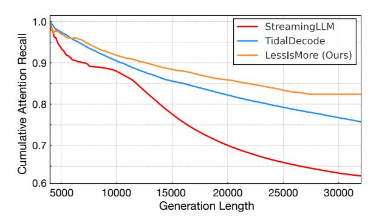
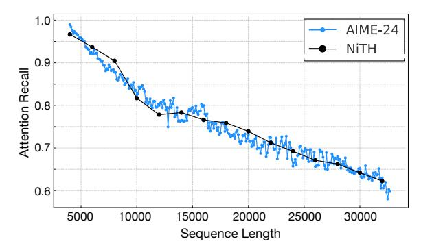

## Less Is More: Fast and Accurate Reasoning with Cross-Head Unified Sparse Attention

Lijie Yang \* 1 Zhihao Zhang \* 2 Arti Jain 2 Shijie Cao 3 Baihong Yuan 2 Yiwei Chen 2 Zhihao Jia 2 Ravi Netravali 1

### Abstract

Large reasoning models achieve strong performance through test-time scaling, but this incurs substantial computational overhead due to long decoding from short prompts. While sparse attention can reduce latency and memory usage, existing methods often degrade reasoning accuracy because selection errors accumulate over long generation horizons, or require costly retraining. We introduce LessIsMore, a trainingfree sparse attention mechanism for long-horizon reasoning. Our key insight is that token importance in reasoning is global and stable: critical tokens are largely shared across attention heads and remain stable over decoding steps. Guided by this structure, LessIsMore enforces cross-head unified token selection and preserves recent context via a stable recency window, yielding a globally consistent token set that can be reused across layers. Across multiple model families and challenging reasoning benchmarks, LessIsMore matches or improves accuracy while attending to substantially fewer tokens. With kernel-level optimizations, LessIsMore achieves up to 1.6× end-to-end decoding speedup and up to 1.72× faster sparse attention computation, with additional long-context results demonstrating the generality of our approach. Code is available at [https://github.com/DerrickYLJ/LessIsMore.](https://github.com/DerrickYLJ/LessIsMore)

### 1 Introduction

Recent advances in large reasoning models (LRMs) have substantially improved the ability of LLMs to solve complex, multi-step reasoning tasks. State-of-the-art systems

*Preprint. April 29, 2026.*

such as DeepSeek-R1 [\(DeepSeek-AI,](#page-8-0) [2025\)](#page-8-0), Gemini-2.5- Pro [\(DeepMind,](#page-8-1) [2025\)](#page-8-1), OpenAI o3 [\(OpenAI,](#page-9-0) [2025\)](#page-9-0), and Qwen3 [\(Team,](#page-9-1) [2025\)](#page-9-1) achieve strong performance by leveraging test-time scaling, where models generate long chains of intermediate reasoning to improve accuracy [\(Wei et al.,](#page-9-2) [2023;](#page-9-2) [AoPS,](#page-8-2) [2025;](#page-8-2) [Rein et al.,](#page-9-3) [2023\)](#page-9-3). While effective, this paradigm fundamentally changes the computational profile of inference: modern reasoning workloads are decodeheavy, requiring tens of thousands of autoregressive decoding steps from relatively short prompts [\(Research,](#page-9-4) [2024\)](#page-9-4).

This shift exposes decoding-time attention as a primary performance bottleneck. Under standard full attention, each newly generated token attends to the entire growing keyvalue (KV) cache, causing memory access and compute costs to scale linearly with generation length [\(Liu et al.,](#page-9-5) [2025\)](#page-9-5). For example, using the HuggingFace implementation, DeepSeek-R1-Distill-Llama-8B requires over 20 minutes on an NVIDIA RTX A5000 GPU to generate 32,768 tokens for a single AIME problem. As reasoning models increasingly rely on long derivations, improving decoding efficiency without compromising reasoning accuracy has become a central systems challenge.

Sparse attention is a natural candidate for addressing this bottleneck. By restricting attention to a subset of tokens, sparse attention reduces both computation and KV cache access costs [\(Cai et al.,](#page-8-3) [2025;](#page-8-3) [Gao et al.,](#page-8-4) [2025\)](#page-8-4). Existing approaches fall into two broad classes: eviction-based methods, which permanently discard tokens deemed unimportant [\(Li et al.,](#page-9-6) [2024;](#page-9-6) [Xiao et al.,](#page-9-7) [2023;](#page-9-7) [Zhang et al.,](#page-10-0) [2023;](#page-10-0) [Ad](#page-8-5)[nan et al.,](#page-8-5) [2024;](#page-8-5) [Cai et al.,](#page-8-3) [2025\)](#page-8-3), and selection-based methods, which retain the full KV cache but dynamically select a subset of tokens during attention computation [\(Yang et al.,](#page-9-8) [2024;](#page-9-8) [Tang et al.,](#page-9-9) [2024;](#page-9-9) [Hao et al.,](#page-9-10) [2025;](#page-9-10) [Liu et al.,](#page-9-11) [2024;](#page-9-11) [Gao et al.,](#page-8-4) [2025;](#page-8-4) [Yuan et al.,](#page-9-12) [2025\)](#page-9-12). While both classes achieve substantial speedups on standard long-context tasks, they exhibit significant accuracy degradation on reasoning workloads [\(Gao et al.,](#page-8-4) [2025\)](#page-8-4).

This degradation stems from a key mismatch between existing sparse attention assumptions and the structure of reasoning. Prior methods typically optimize token selection locally—per attention head, per layer, or per decoding step—based on approximate attention scores [\(Yang et al.,](#page-9-8)

\*Equal contribution 1 Princeton University, Princeton, NJ, USA 2Carnegie Mellon University, Pittsburgh, PA, USA 3Microsoft Research, USA. Correspondence to: Lijie Yang <ly3223@princeton.edu>, Zhihao Zhang <zhihaoz3@cs.cmu.edu>.

[2024;](#page-9-8) [Tang et al.,](#page-9-9) [2024\)](#page-9-9). In long-generation reasoning, however, even small selection errors compound across thousands of decoding steps, leading to attention recall degradation, logical inconsistency, and in some cases longer generation traces [\(Lee & Hockenmaier,](#page-9-13) [2025\)](#page-9-13). For instance, while TidalDecode preserves accuracy at extreme sparsity on retrieval benchmarks, it suffers from high accuracy drop on AIME-style reasoning tasks even with low sparsity ((Figures [1a](#page-2-0) and [5\)](#page-6-0)) [\(Yang et al.,](#page-9-8) [2024\)](#page-9-8). These observations suggest that reasoning workloads demand not just localoptimal sparse attention, but stable and globally consistent token selection.

Motivated by this gap, we study attention patterns in reasoning models to understand which properties are essential for accurate long-horizon decoding. Our analysis reveals two consistent locality structures that persist across models, layers, and decoding steps. First, we observe strong cross-head spatial locality: despite conventional assumptions that attention heads serve highly specialized roles [\(Xiao et al.,](#page-9-14) [2024;](#page-9-14) [Yang et al.,](#page-9-8) [2024\)](#page-9-8), reasoning models exhibit substantial overlap in token importance rankings across heads within the same layer. Second, we find pronounced temporal recency locality: recently generated tokens receive consistently high attention scores, and the proportion of attention mass allocated to recent context remains stable throughout decoding. Together, these patterns indicate that reasoning relies on a small, shared set of globally salient tokens that evolves slowly over time [\(Lee & Hockenmaier,](#page-9-13) [2025\)](#page-9-13).

These observations lead to a central insight: token importance in reasoning is a global property, not a head-local one. Based on this, we introduce LessIsMore, a training-free sparse attention mechanism designed explicitly for reasoning workloads. Rather than maintaining independent token subsets per attention head or frequently re-optimizing selections at every layer, LessIsMore enforces Cross-Head Unified Sparse Attention (CUSA) with crosshead unified token selection, where candidate tokens proposed by individual heads are aggregated into a single global ranking. This unified selection captures globally important tokens while reducing selection variance and overhead. To preserve reasoning coherence across long decoding trajectories, LessIsMore further reserves a fixed fraction of the token budget for a stable recency window, reflecting the observed temporal locality of reasoning.

LessIsMore is architecture-agnostic and can be integrated into existing selection-based sparse attention frameworks. In this work, we instantiate LessIsMore on top of TidalDecode [\(Yang et al.,](#page-9-8) [2024\)](#page-9-8), using two CUSA layers to amortize selection cost across many sparse attention layers. Importantly, we conduct detailed analysis to validate the design choices—including index sharing across heads, recency window allocation, and infrequent re-selection—are not heuristic but direct consequences of the observed spatial

and temporal locality structures in reasoning attention.

We evaluate LessIsMore on multiple model families, including GQA-based DeepSeek-R1-Distill-Llama-8B [\(DeepSeek-](#page-8-0)[AI,](#page-8-0) [2025\)](#page-8-0) and Qwen3 models (4B, 8B, and 14B) [\(Team,](#page-9-1) [2025\)](#page-9-1) , across diverse reasoning benchmarks such as AIME-24/25 [\(AoPS,](#page-8-2) [2025\)](#page-8-2), GPQA-Diamond [\(Rein et al.,](#page-9-3) [2023\)](#page-9-3), and MATH500, as well as MHA-based LongChat-7B-v1.5- 32k [\(Li et al.,](#page-9-15) [2023\)](#page-9-15) on long-context benchmarks. Across all settings, LessIsMore consistently matches or improves accuracy compared to full attention while attending to substantially fewer tokens. Notably, LessIsMore achieves up to 87.5% sparsity on AIME-24 with no accuracy loss and avoids the generation length inflation observed in prior sparse attention methods [\(Gao et al.,](#page-8-4) [2025\)](#page-8-4). With kernellevel optimizations for GQA models, LessIsMore delivers up to 1.6× end-to-end decoding speedup over full attention.

In summary, our contributions are:

- We identify stable spatial and temporal locality structures in reasoning attention, showing that token importance is globally shared across heads and remains stable over decoding steps.
- We propose LessIsMore, a training-free sparse attention mechanism that enforces cross-head unified token selection and stable recency preservation, directly addressing error accumulation in long-horizon reasoning.
- We demonstrate that LessIsMore generalizes across model families and reasoning benchmarks, achieving significant decoding speedups while preserving or improving reasoning accuracy.

### 2 Observation: Attention Pattern in Long-Horizon Reasoning

Sparse attention methods rely on the assumption that a small subset of tokens captures most of the attention mass during decoding. While this assumption has been validated for long-context retrieval and language modeling tasks, its applicability to long-horizon reasoning remains poorly understood. In this section, we analyze attention patterns in reasoning models to identify which structural properties are essential for accurate sparse decoding over thousands of generation steps.

Our analysis reveals that attention behavior in reasoning differs fundamentally from that in standard generation. Rather than exhibiting highly specialized, rapidly changing token importance, reasoning attention is governed by two stable locality structures: cross-head spatial locality and temporal recency locality. These properties persist across models, layers, and decoding steps, and together imply that token importance in reasoning is a global and slowly evolving property. This observation directly challenges the design assumptions of existing sparse attention mechanisms.

(a) Attention recall of different approaches using 4K token budget on an AIME problem.

(b) Attention recall of retrieval (NiTH) and reasoning (AIME) tasks.

Figure 1. Analysis of attention recall degradation for sparse attention methods on reasoning tasks. Figure 1a compares cumulative average attention recall among StreamingLLM (Xiao et al., 2023), TidalDecode (Yang et al., 2024), and LessIsMore on an AIME-24 reasoning task, using a token budget of 4K and generation length up to 32K tokens on Qwen3-8B. Figure 1b contrasts running-average attention recall of TidalDecode between the reasoning-intensive AIME-24 task throughout the generation and the simpler needle-in-the-haystack retrieval task under the same token budget under various context lengths on Qwen3-8B.

