# LOCRET: Enhancing Eviction in Long-Context LLM Inference with Trained Retaining Heads on Consumer-Grade Devices

Yuxiang Huang <sup>1</sup> Binhang Yuan <sup>2</sup> Xu Han <sup>1</sup> Chaojun Xiao <sup>1</sup> Zhiyuan Liu <sup>1</sup>

## Abstract

Scaling the input context length of a large language model (LLM) incurs a significant increase in computation cost and memory footprint to maintain the attention key-value (KV) cache. Existing KV cache compression methods suffer from inefficient compression strategies and limited memory reduction effects, making it difficult for LLMs to conduct long-context inference on consumer-grade devices, especially when inferring long-context stream input. Such obstacles prevent consumer-grade devices from supporting more complex applications, creating challenges for the democratization of LLMs. To overcome this, we propose LOCRET, the first framework to create an eviction policy compatible with chunked prefill. By evaluating the causal importance of KV cache units by learnable *retaining heads*, LOCRET enables precise eviction of cache units, facilitating efficient long-context inference. In our extensive empirical studies, LOCRET outperforms the recent popular and competitive approaches in terms of memory efficiency and generation quality — LOCRET achieves up to 20× of KV cache compression ratio within less than 10% performance loss. Furthermore, LOCRET achieves 128K+ longcontext inference on a single NVIDIA 4090 GPU without compromising generation quality and only costs < 1 GPU hour of additional training. We provide the code of LOCRET at [https://](https://github.com/huangyuxiang03/Locret) [github.com/huangyuxiang03/Locret](https://github.com/huangyuxiang03/Locret).

<span id="page-0-0"></span>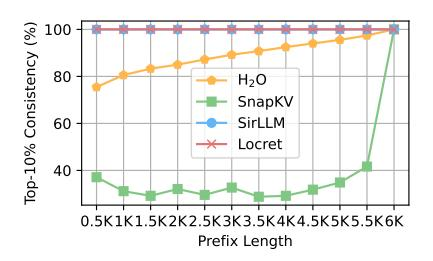

Figure 1. For each prefix length of the context, this figure shows the *consistency* in evaluating the token importance of the prefix based on the full context and based on only the prefix without subsequent tokens. The *consistency* is defined as the intersection of the top 10% tokens of two evaluation methods divided by the number of top 10% tokens in the prefix. More details are in Appendix [B.](#page-13-0)

## 1. Introduction

In recent years, large language models (LLMs) have revolutionized generative AI [\(Zhao et al.,](#page-10-0) [2023;](#page-10-0) [Minaee et al.,](#page-9-0) [2024\)](#page-9-0), and the advancements of LLMs in handling longcontext tasks have further unlocked the potential of generative AI. As a result, the context lengths supported by stateof-the-art LLMs have been significantly extended, such as GPT-4o [\(OpenAI,](#page-9-1) [2024\)](#page-9-1) handling 128K tokens, Claude-3 [\(Anthropic,](#page-8-0) [2024\)](#page-8-0) supporting 200K tokens, and Gemini-1.5 [\(Reid et al.,](#page-10-1) [2024\)](#page-10-1) even reaching 10M tokens. These improvements enable LLMs to tackle complex applications with extremely long or streaming inputs, such as multi-hop reasoning [\(Li et al.,](#page-9-2) [2024b;](#page-9-2) [Schnitzler et al.,](#page-10-2) [2024\)](#page-10-2), LLMdriven agents [\(Qin et al.,](#page-10-3) [2024b;](#page-10-3) [Wang et al.,](#page-10-4) [2024\)](#page-10-4), and AI-powered operating systems [\(Mei et al.,](#page-9-3) [2024\)](#page-9-3). Some recent efforts [\(Hu et al.,](#page-9-4) [2024b;](#page-9-4) [Abdin et al.,](#page-8-1) [2024\)](#page-8-1) have successfully deployed LLMs on consumer-grade end-side devices instead of cloud servers and conducted inference with limited context. We envision that unleashing the potential of long-context inference on consumer-grade devices will revolutionize the development of personalized AI applications and the democratization of LLMs. However, *conducting long-context LLM inference on consumer-grade devices remains a challenging problem that requires algorithmic innovations and systematic optimizations.*

As context length scales, the challenge of long-context LLM inference arises from two major aspects: the increased computational cost of the attention mechanism and the higher

<sup>1</sup>Department of Computer Science and Technology, Institute for Artificial Intelligence, Beijing National Research Center for Information Science and Technology, Tsinghua University, Beijing, China. <sup>2</sup>Department of Computer Science and Engineering, The Hong Kong University of Science and Technology, Hong Kong, China.. Correspondence to: Binhang Yuan <biyuan@ust.hk>, Xu Han <han-xu@tsinghua.edu.cn>.

memory footprint due to the key-value (KV) cache. This leads to the failure of traditional optimizations targeting model backbones to provide a sufficient solution. Specifically, backbone-targeted optimizations, such as compacting model architectures [\(Hu et al.,](#page-9-4) [2024b;](#page-9-4) [Abdin et al.,](#page-8-1) [2024\)](#page-8-1) and quantizing model weights [\(Frantar et al.,](#page-8-2) [2023;](#page-8-2) [Dettmers](#page-8-3) [et al.,](#page-8-3) [2022;](#page-8-3) [Xiao et al.,](#page-10-5) [2023;](#page-10-5) [Lin et al.,](#page-9-5) [2024\)](#page-9-5), fail to improve the efficiency of attention patterns or the KV cache, as attention's quadratic complexity with respect to sequence length remains unaddressed. To this end, recent efforts have focused on optimizing attention patterns and the KV cache to achieve efficient long-context LLM inference.

Recent attention-targeting optimizations, including sparse attention [\(Jiang et al.,](#page-9-6) [2024a;](#page-9-6) [Ge et al.,](#page-8-4) [2024;](#page-8-4) [Lou et al.,](#page-9-7) [2024\)](#page-9-7) and KV cache quantization [\(Liu et al.,](#page-9-8) [2024b;](#page-9-8) [Hooper](#page-8-5) [et al.,](#page-8-5) [2024;](#page-8-5) [Zandieh et al.,](#page-10-6) [2024\)](#page-10-6), show promising results to accelerate attention computation and reduce memory footprint. However, they fail to fundamentally address the core challenge: *the KV cache grows linearly with context length*. Layer-wise chunked prefill combined with attention sparsity (e.g., SNAPKV [\(Li et al.,](#page-9-9) [2024a\)](#page-9-9)) can alleviate this problem to a certain extent. This technique typically performs cache eviction after the precise attention computation for each layer and requires access to the entire sequence. It can theoretically support longer sequences by limiting the maximum memory usage to a single layer's KV cache, but *it cannot handle streaming input whose length grows continually*. The combination of cache eviction methods [\(Xiao](#page-10-7) [et al.,](#page-10-7) [2024c;](#page-10-7) [Yang et al.,](#page-10-8) [2024\)](#page-10-8) and chunked prefill offers a more promising approach by maintaining a static cache size and supporting streaming input. Yet, as shown in Figure [1,](#page-0-0) existing eviction techniques like H2O [\(Zhang et al.,](#page-10-9) [2024d\)](#page-10-9) and SNAPKV show significant discrepancies between local importance estimation and global importance estimation, i.e. it is hard to estimate the importance of each token only based its previous tokens. Instead, these methods require a large number of subsequent tokens to make an accurate estimation. Other methods like SIRLLM [\(Yao et al.,](#page-10-10) [2024\)](#page-10-10) show great local-global estimation consistency but suffer from performance degradation.

To overcome these limitations, we propose a lightweight training-based paradigm, LOCRET, that provides a more accurate token importance estimation to select the victim during KV cache eviction, enabling efficient and scalable long-context LLM inference:

Contribution 1: We propose LOCRET, a lightweight training-based paradigm for selective KV cache eviction in long-context LLM inference. It introduces learnable *retaining heads* to estimate the *causal importance score* (CIS) for token selection, with an offline training cost of <1 GPU hour. Additionally, we present LOCRET-Q, a query-aware variant of LOCRET, slightly modified to handle query-driven

tasks (e.g., long document question answering).

Contribution 2: We provide an efficient inference system implementation for LOCRET, integrating retaining heads into a chunked prefill framework. This integration limits GPU memory usage by evicting low-CIS KV cache units during the prefill process and accelerates the prefill time. LOCRET is compatible with all decoder-only LLMs and imposes minimal additional hardware requirements.

Contribution 3: We extensively evaluate LOCRET, demonstrating its ability to achieve comparable performance with full KV cache while maintaining inference efficiency. LOCRET achieves over 20× and 8× KV cache compression ratios for Phi-3-mini-128K and Llama-3.1- 8B-instruct, respectively. Additionally, LOCRET-Q accelerates prefill by over 2× on query-driven tasks without significant performance degradation. This framework enables full comprehension of long contexts on consumergrade devices without compromising the generation quality, and introduces minimal additional system optimizations.

## <span id="page-1-0"></span>2. Related Work

This paper focuses on optimizing long-context LLM inference. Existing efforts can be categorized into algorithm and system optimization. For more details about LLMs, please refer to the surveys [\(Zhao et al.,](#page-10-0) [2023;](#page-10-0) [Lu et al.,](#page-9-10) [2024\)](#page-9-10).

Algorithm Optimizations aim to reduce the size of the KV cache and can generally be classified into three categories: quantization-based methods, sparsity-based methods, and token dropping methods. Quantization-based methods [\(Liu](#page-9-8) [et al.,](#page-9-8) [2024b;](#page-9-8) [Hooper et al.,](#page-8-5) [2024;](#page-8-5) [Zandieh et al.,](#page-10-6) [2024;](#page-10-6) [Zhang et al.,](#page-10-11) [2024a\)](#page-10-11) use low-bit values to represent the KV cache, reducing cache memory overhead and improving cache computing efficiency. These quantization-based methods suffer from hardware-oriented operator customization and additional inverse quantization overhead. Sparsitybased methods [\(Ge et al.,](#page-8-4) [2024;](#page-8-4) [Jiang et al.,](#page-9-6) [2024a;](#page-9-6) [Yang](#page-10-8) [et al.,](#page-10-8) [2024;](#page-10-8) [Lou et al.,](#page-9-7) [2024;](#page-9-7) [Lv et al.,](#page-9-11) [2024\)](#page-9-11) leverage the sparsity patterns of attention heads to reduce both computational and I/O costs. Combining different patterns can yield further optimization by identifying specific patterns for each head [\(Ge et al.,](#page-8-4) [2024;](#page-8-4) [Jiang et al.,](#page-9-6) [2024a;](#page-9-6) [Xiao](#page-10-12) [et al.,](#page-10-12) [2024b\)](#page-10-12). For more details on sparsity-based methods, please refer to the surveys [\(Yuan et al.,](#page-10-13) [2024;](#page-10-13) [Kang et al.,](#page-9-12) [2024;](#page-9-12) [Shi et al.,](#page-10-14) [2024\)](#page-10-14). Although quantization-based methods and sparsity-based methods have achieved promising results, they cannot address the issue that the KV cache memory overhead increases linearly with the context length. Eviction-based methods, such as H2O [\(Zhang et al.,](#page-10-9) [2024d\)](#page-10-9), SCISSORHANDS [\(Liu et al.,](#page-9-13) [2024a\)](#page-9-13), and SIRLLM [\(Yao](#page-10-10) [et al.,](#page-10-10) [2024\)](#page-10-10), rank KV cache units by certain statistical metrics to identify the most influential units, discarding others

to reduce memory usage and speed up attention computation. Pooling-based methods (Nawrot et al., 2024; Rajput et al., 2024), especially STREAMINGLLM (Xiao et al., 2024c) and LoCoCo (Cai et al., 2024a), compress multiple adjacent KV cache units into a single unit using predesigned transformations. More important units will merge into compressed units with higher weights. Eviction-based and pooling-based methods drop or merge tokens to maintain a static cache size, but struggle with accurate victim selection and optimal pooling function design.

System Optimizations alleviate the challenge of longcontext inference from a system-level perspective, by fully considering hardware features. Offloading-based methods (Sheng et al., 2023; Xiao et al., 2024a; Wu et al., 2024; Sun et al., 2024) use CPU memory to store the KV cache and retrieve only the most relevant chunks to GPU memory before inferring a new chunk. These methods reduce maximum GPU memory usage at the cost of introducing CPU-GPU communication overhead. Hardware-aware methods, such as FLASH-ATTTENTION (Dao et al., 2022; Dao, 2024; Shah et al., 2024) and PAGE-ATTENTION (Kwon et al., 2023), enable more efficient runtime memory management by considering GPU architectures (Ghorpade et al., 2012). In addition, building inference infrastructures with a more efficient programming language (llama.cpp; llama2.c; rustformers), or adopting disaggregated inference (Jiang et al., 2024b; Zhong et al., 2024; Qin et al., 2024a; Hu et al., 2024a), can also greatly improve long-context inference efficiency. Since system optimizations primarily enhance efficiency by leveraging hardware resources rather than directly optimizing attention patterns or the KV cache, relying solely on them cannot adequately address the challenges of long-context LLM inference. Several efforts have integrated algorithm optimizations into system optimizations (Agrawal et al., 2023; Lee et al., 2024), such as KTRANSFORM-ERS (KVCache.AI, 2024) leveraging offloading based on INFLLM (Xiao et al., 2024a), achieving promising results.

### 3. Methodology of LOCRET

#### 3.1. Preliminaries

**Transformer Architecture.** Given a token sequence  $\{t_1, \cdots, t_n\}$  as the input prompt of the transformer-based LLM, we denote the output hidden states of the i-th layer as  $\mathbf{H}^{(i)}$ , and denote the input embeddings of the first layer as  $\mathbf{H}^{(0)}$ . For each transformer layer, it consists of an attention block and a feedforward neural network (FFN) block. Attention blocks often follow the grouped-query attention (GQA) architecture (Ainslie et al., 2023), with h query heads and h/g KV heads, where g is the group size, i.e., g heads share the same KV heads. The multi-head attention (MHA) architecture adopted in the original transformer can be regarded as a special GQA (g=1). In

the *i*-th layer, the attention score of the *j*-th query head is formalized as  $\mathbf{A}_{j}^{(i)} = \mathtt{softmax}\left(\mathbf{Q}_{j}^{(i)}\mathbf{K}_{\lceil j/g \rceil}^{(i) \top}/\sqrt{d_{m}}\right) \cdot \mathbf{V}_{\lceil j/g \rceil}^{(i)}$ , where  $d_{m}$  represents the hidden size for each head and  $\left[\mathbf{Q}_{j}^{(i)}, \mathbf{K}_{\lceil j/g \rceil}^{(i)}, \mathbf{V}_{\lceil j/g \rceil}^{(i)}\right] = \mathbf{H}^{(i-1)} \cdot \left[\mathbf{W}_{j}^{(i) \heartsuit}, \mathbf{W}_{\lceil j/g \rceil}^{(i) \aleph}, \mathbf{W}_{\lceil j/g \rceil}^{(i) \heartsuit}\right]$ . After obtaining the attention score, the output of the *i*-th attention block is  $\mathbf{A}^{(i)} = \left[\mathbf{A}_{1}^{(i)}, \cdots, \mathbf{A}_{h}^{(i)}\right] \cdot \mathbf{W}^{(i) \heartsuit}$ , and the output hidden states of the *i*-th layer is  $\mathbf{H}^{(i)} = \mathtt{FFN}(\mathbf{A}^{(i)})$ .

**KV Cache and Chunked Prefill.** Given the input prompt sequence  $\{t_1, \cdots, t_n\}$ , during the prefill stage, all prompt tokens are processed in a single forward pass. After the prefill,  $\mathbf{K}^{(i)} = \left[\mathbf{K}_1^{(i)}, \cdots, \mathbf{K}_{h/g}^{(i)}\right]$  and  $\mathbf{Q}^{(i)} = \left[\mathbf{Q}_1^{(i)}, \cdots, \mathbf{Q}_{h/g}^{(i)}\right]$  are stored as the KV cache, whose sequence length is n. During the decoding stage, each time a token is decoded, a forward pass is conducted only for this token and decode the next token. In this process, the KV cache is used to avoid redundant attention computation. Chunked prefill is a method for reducing peak memory usage by spliting tokens into mulitple chunks and prefilling tokens chunk by chunk. Taking both the KV cache and chunked prefill into account, the attention block can be modified as follows,

$$\mathbf{A}[n+1:n+B]_{j}^{(i)} = \text{softmax} \left( \frac{\mathbf{Q}[n+1:n+B]_{j}^{(i)}\mathbf{K}[1:n+B]_{\lceil j/g \rceil}^{(i)\top}}{\sqrt{d_{m}}} \right) \mathbf{V}[1:n+B]_{\lceil j/g \rceil}^{(i)},$$
(1)

where  $\mathbf{A}[n+1\colon n+B]$  denotes the attention output for the tokens  $\{n+1,\cdots,n+B\}$ , and B is the number of tokens processed in a single forward pass. For decoding, B=1, while for chunked prefill, B corresponds to the chunk size. For the k-th token in the context, its attention output is  $\mathbf{A}[k]$ , its key and value vectors are  $\mathbf{K}[k]$  and  $\mathbf{V}[k]$ .

**Cache Eviction.** In the cache eviction process, we treat the KV vector pair of a single token within one attention head as the smallest cache unit. We denote the cache unit of the k-th token as  $c_k = (\mathbf{K}[k], \mathbf{V}[k])$ . Assuming a memory budget b, representing the maximum number of cache units that can be stored, the abstract form of the attention block can be written as  $c_k = f(c_1, c_2, \cdots, c_{k-1})$ . With limited cache capacity, this process can only be approximated by  $\tilde{c}_k = f(\tilde{c}_{p_1}, \tilde{c}_{p_2}, \cdots, \tilde{c}_{p_{b'}})$ , where  $b' \leq b$ , and  $p_1, p_2 \cdots, p_{b'} \in \{1, 2, \cdots, k-1\}$ . When the cache is full, one unit must be evicted. We select the victim using some policy  $p_v = \text{Policy}(\tilde{c}_{p_1}, \cdots, \tilde{c}_{p_b}; \tilde{c}_k)$ , and the key challenge is to develop an effective policy that minimizes the error  $\|\tilde{c}_k - c_k\|$ .

#### 3.2. Framework of LOCRET

LOCRET is a training-based KV cache eviction framework that works in conjunction with chunked prefill. As illustrated in Figure 2, LOCRET operates in two stages: training and inference. In the training stage, we modify the original LLM by appending a retaining head **R** to each attention

<span id="page-3-0"></span>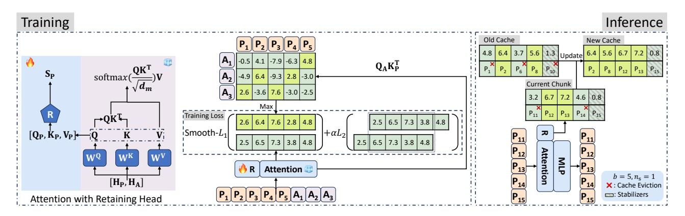

<span id="page-3-1"></span>Figure 2. The framework of LOCRET. "R" represents the retaining head.  $P_i$  and  $A_i$  correspond to the *i*-th prompt token and answer token. "t" represents the time step in chunked prefill, "b" represents the budget size, and " $n_s$ " represents the length of the stabilizers. For simplicity, our notation here does not reflect the concept of layers.

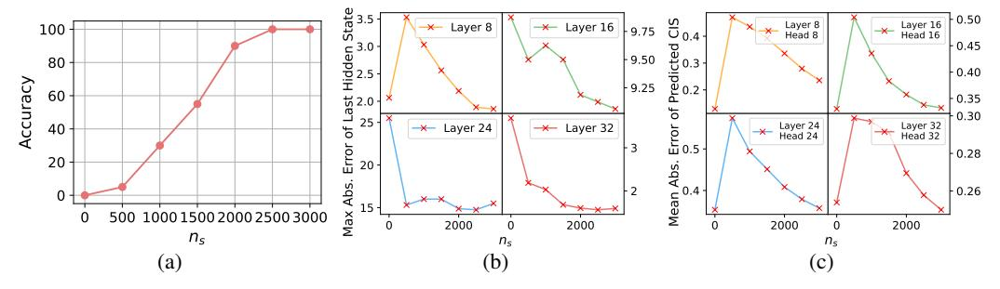

Figure 3. R.Number with different stabilizer lengths  $n_s$ . (a) Task accuracy under different  $n_s$ . (b) Maximum absolute error of the last hidden state. (c) Mean absolute error of the predicted CIS. We conduct this experiment on entries 101-120 of R.Number using the Phi-3-mini-128K backbone.

module. We then train the retaining heads  ${\bf R}$  while keeping the LLM backbone frozen. During the chunked prefill inference stage, the retaining heads  ${\bf R}$  can obtain the importance of each cache unit. We retain the cache units with higher scores, along with stabilizers (i.e., the last tokens), in the cache pool located in GPU memory. Through this process, the retaining heads  ${\bf R}$  learn and predict the patterns discovered by existing methods, e.g. attention sink in Xiao et al. (2024c) and vertical lines in MINFERENCE (Jiang et al., 2024a), as detailed in Appendix O.

The eviction policy assigns each cache unit an importance score reflecting its influence on comprehending subsequent context. This estimation is causal, termed the *causal importance score (CIS)*. The CIS of the *k*-th unit depends only on the preceding units and the *k*-th unit itself. Due to memory constraints, calculating the exact CIS on-chip is impractical. Intuitively, discarding certain KV cache during the attention calculation introduces errors, manifesting as biases in the CIS. However, as long as the importance estimation is sufficiently accurate, the core information can be preserved, and the loss of information in the attention process can be minimized. Therefore, the error introduced in the CIS can be neglected. Please refer to Appendix N for more details.

### 3.3. Training Retaining Heads

In this section, we introduce LOCRET's model architecture modifications and the corresponding training recipe. We add additional parameters to compute the CIS S[k] for the k-th cache unit. Specifically, we inject a retaining head, consisting of a small MLP, into each layer. From our observation, such small MLPs do not slow down model inference, with details elaborated in Appendix M. The retaining head predicts the CIS for each head of the corresponding layer based on the concatenation of [Q, K, V]. Formally, with a slight abuse of notation, let the retaining head for layer i be denoted as  $\mathbf{R}$ . The CIS at head j is then calculated as:  $\tilde{\mathbf{S}} = \mathbf{R}([\mathbf{Q}, \mathbf{K}, \mathbf{V}]) = \sigma([\mathbf{Q}, \mathbf{K}, \mathbf{V}]\mathbf{W}_1)\mathbf{W}_2$ . In this equation,  $\mathbf{W}_1 \in \mathbb{R}^{(d_m + 2d_{kv}) \times d_{\mathbf{R}}}$  and  $\mathbf{W}_2 \in \mathbb{R}^{d_{\mathbf{R}} \times \frac{h}{g}}$  are the tunable parameters of  ${\bf R}$ , and  $\sigma$  is the activation function,  $\tilde{\mathbf{S}}[k] = \left[\tilde{\mathbf{S}}[k]_1, \cdots, \tilde{\mathbf{S}}[k]_{h/g}\right] \in \mathbb{R}^{\frac{h}{g}}$ , where  $\tilde{\mathbf{S}}[k]_j$  is the predicted CIS of the k-th token. This architecture implies that the importance estimation for a single head is not performed in isolation but considers all heads.

We train the retaining head  $\mathbf{R}s$  on a small Question-Answer (QA) supervised fine-tuning (SFT) dataset, where each entry consists of a single prompt and one answer. We define the CIS  $\mathbf{S}[k]_j$  for the k-th token at head j as the maximum attention score, before softmax, from all the

answer tokens toward the k-th token. Formally, given a training instance d, for the k-th token at head j of layer i, we approximate the predicted value  $\tilde{\mathbf{S}}[k]_j^{(i)}$  to the ground truth  $\mathbf{S}[k]_j^{(i)} := \max_p \left(\mathbf{Q}_j^{(i)}\mathbf{K}_j^{(i)T}\right)_{p,k}$ , where  $n_q(d) , and <math>n_q(d)$  and  $n_a(d)$  represent the lengths of the prompt and answer in data d, respectively. For an MHA model with L layers and h heads, the training objective is described in Equation 2. For GQA models, we take the maximum attention score before softmax across different query heads within the same group as the ground truth for the corresponding KV head.

$$\underset{\mathbf{W}_{1}^{(i)}, \mathbf{W}_{2}^{(i)}, i=1, 2\cdots, L}{\operatorname{argmin}} \mathbb{E}_{d \in \mathcal{D}} \left[ \sum_{i=1}^{L} \sum_{j=1}^{h} \sum_{k=1}^{n_{q}(d)} \mathcal{L}\left(\tilde{\mathbf{S}}[k]_{j}^{(i)}, \mathbf{S}[k]_{j}^{(i)}\right) \right]$$
(2)

The training loss consists of a regression loss and a smoothing loss. We apply the Smooth- $\mathcal{L}_1$  norm between the predicted values and the ground truth. Since important segments in natural language typically consist of adjacent tokens, we also apply the  $\mathcal{L}_2$  norm between each pair of adjacent predicted values to enforce smoothness. The complete training loss for LOCRET is given by Equation 3.

<span id="page-4-1"></span>
$$\mathcal{L}\left(\tilde{\mathbf{S}}[k]_{j}^{(i)}, \mathbf{S}[k]_{j}^{(i)}\right) = \text{Smooth-}\mathcal{L}_{1}\left(\tilde{\mathbf{S}}[k]_{j}^{(i)}, \mathbf{S}[k]_{j}^{(i)}\right) + \alpha\mathcal{L}_{2}\left(\tilde{\mathbf{S}}[k]_{j}^{(i)}, \tilde{\mathbf{S}}[k+1]_{j}^{(i)}\right)$$
(3)

From our observations, the training of LOCRET exhibits strong robustness. Despite changes in  $d_{\mathbf{R}}$  and the dataset, the performance variations shown in Figure 6 and Table 15 are minimal. Details can be found in Appendix I. Training statistics and loss dynamics are recorded in Appendix P.

#### 3.4. Inference Implementation of LOCRET

During the inference stage, we use the chunked prefill pattern and perform cache eviction based on the predicted CIS. Since the predicted CIS does not rely on subsequent tokens, it remains consistent once calculated. Thus, we store the KV cache units along with their corresponding causal importance values. When the cache is full, we evict the units with lower causal importance values, as they are deemed less useful for future computations. Such eviction is performed during chunked prefill. When processing a new chunk, we first compute its KV cache, concatenate it with the previously retained cache, and evict redundant units to adhere to the budget size. Note that we cache the pre-RoPE KV cache and reassign continuous position embeddings from the beginning to enhance context continuity.

Cache eviction introduces context discontinuity, meaning some cache units at certain positions may be absent, which can degrade generation quality. To mitigate this, we retain the last  $n_s$  tokens of the current chunk, named as the *stabilizers*, at each step of chunked prefill, ensuring a local and continuous context to minimize errors. As shown in Figure 3, smaller  $n_s$  results in severe performance degradation,

and the model fails entirely when stabilizers are absent, as context discontinuity leads to instability in CIS prediction, causing errors in cache eviction and amplifying errors in hidden states. More details are discussed in Appendix L. We provide a pseudocode of LOCRET inference in Algorithm 1.

#### 4. Experiments

We conduct experiments to evaluate whether LOCRET can address the following questions:  $(\mathbf{Q1})$  Can LOCRET obtain better end-to-end task performance compared to popular and competitive long-context inference methods using similar or less peak memory?  $(\mathbf{Q2})$  Is LOCRET able to achieve a faster inference speed on consumer-grade devices?  $(\mathbf{Q3})$  How can LOCRET process query-driven tasks?

#### <span id="page-4-2"></span><span id="page-4-0"></span>4.1. Experimental Setup

Model and Dataset Settings. We conduct experiments on two long-context LLMs: Phi-3-mini-128K (Abdin et al., 2024) and Llama-3.1-8B-instruct (Dubey et al., 2024). Both models can process up to 128K context tokens and follow MHA and GQA architectures, respectively. The parameter sizes of these two models are also suitable for deployment on consumer-grade devices. We inject retaining heads R into each layer of these two models, and the intermediate size  $d_{\mathbf{R}}$  is 1,024. The retaining heads are trained on the LongAlpaca dataset (Chen et al., 2024) for 3,000 steps, with a 5e-4 learning rate, 10,240 sequence length, and  $\alpha$  set to 2.5e-3. Training LOCRET is lightweight, with the tunable parameters comprising 8% and 2.5% of the total for the two models, respectively. The complete training process takes 0.47 and 0.80 GPU hours on an A800 GPU for each corresponding model. More important hyperparameters are listed in Table 4. More details on hyperparameters and system environments can be found in Appendix A.

Benchmarks. We evaluate LOCRET on selected subsets of ∞Bench (Zhang et al., 2024b) and L-Eval (An et al., 2024). For ∞Bench, we select R.PassKey, R.Number, E.Sum, E.QA, E.MC, Z.QA, E.Dia, C.Debug, and M.Find. All selected subsets, except Z.QA, have an average length of approximately 100K tokens, while Z.QA has a longer average length of around 2000K tokens. We exclude R.KV because it can be easily handled by calling a Python interpreter. We also exclude C.Run and M.Calc due to their complexity for all methods, including full attention inference. For L-Eval, we filter out all tasks with an average length shorter than 16K tokens and evaluate models on CodeU, NQ, CUAD, NarrativeQA, QMSum, and SPACE. Metrics are reported according to the recommendations of the two datasets, with further details provided in Appendix A. We also report the peak memory usage, i.e. the average peak memory measured for the first entry of each task in ∞Bench and L-Eval, for reference. Moreover, we evaluate

<span id="page-5-0"></span>Table 1. The experimental results of LOCRET compared with all the baselines on  $\infty$ Bench and L-Eval, where higher score represents better performance. "Avg." represents the average score across all tasks. The highest score in each column is marked in **bold**, and the second highest is <u>underlined</u>. LOCRET achieves the highest overall score among all competitors.

| Method                    | R.PassKey | R.Number     | E.Sum        | E.QA        | E.MC         | Z.QA         | E.Dia        | C.Debug | M.Find | Avg.↑ |
|---------------------------|-----------|--------------|--------------|-------------|--------------|--------------|--------------|---------|--------|-------|
| Phi-3-mini-128K on ∞Bench |           |              |              |             |              |              |              |         |        |       |
| FULLATTN                  | 98.64     | 97.12        | 17.92        | 11.16       | 55.46        | 14.83        | 8.00         | 23.10   | 17.43  | 38.18 |
| InfLLM                    | 100.00    | 97.12        | 14.35        | 4.97        | 38.86        | 11.04        | 3.50         | 25.38   | 15.14  | 34.48 |
| HF-2BITS                  | 0.00      | 0.00         | 13.80        | 1.44        | 1.75         | 0.20         | 0.50         | 0.00    | 0.57   | 2.03  |
| SIRLLM                    | 3.39      | 3.39         | 21.06        | 6.32        | 44.98        | 11.99        | 5.00         | 22.34   | 21.71  | 15.58 |
| MINFERENCE                | 99.32     | 95.93        | 14.44        | 8.11        | 40.61        | 10.60        | 9.00         | 15.48   | 15.43  | 32.25 |
| LOCRET                    | 100.00    | 97.46        | <u>16.82</u> | <u>7.61</u> | 46.29        | <u>11.31</u> | 10.00        | 27.92   | 29.71  | 34.73 |
|                           |           | Llar         | na-3.1-      | 8B-inst     | truct o      | n ∞Benc      | h            |         |        |       |
| FULLATTN                  | 100.00    | 99.32        | 26.79        | 15.06       | 68.12        | 13.40        | 17.00        | 20.56   | 34.00  | 43.81 |
| InfLLM                    | 100.00    | 100.00       | 24.24        | 14.21       | 51.97        | 10.76        | 11.00        | 26.25   | 35.71  | 41.57 |
| HF-2BITS                  | 36.78     | 6.95         | 8.77         | 4.05        | 27.95        | 3.09         | 5.50         | 13.20   | 22.00  | 14.25 |
| SIRLLM                    | 1.69      | 1.69         | 25.60        | 8.95        | 55.46        | 10.38        | 9.50         | 23.10   | 3.71   | 15.56 |
| MINFERENCE                | 100.00    | 98.47        | 20.64        | 14.35       | 59.83        | 12.20        | 20.50        | 25.89   | 35.43  | 43.03 |
| LOCRET                    | 100.00    | <u>99.49</u> | 27.28        | 20.90       | <u>58.82</u> | <u>11.85</u> | <u>13.00</u> | 27.16   | 32.86  | 43.48 |

| Method     | CodeU | NQ           | CUAD    | NarrativeQA    | QMSum | SPACE | Avg.↑ |
|------------|-------|--------------|---------|----------------|-------|-------|-------|
|            |       | Phi-         | 3-mini- | -128K on L-Eva | 1     |       |       |
| FULLATTN   | 8.89  | 59.14        | 30.34   | 17.59          | 16.05 | 14.51 | 24.42 |
| InfLLM     | 5.56  | 34.32        | 14.53   | 14.80          | 13.31 | 14.81 | 16.22 |
| HF-2BITS   | 0.00  | 1.69         | 6.40    | 2.04           | 2.73  | 3.34  | 2.70  |
| SIRLLM     | 8.89  | <u>37.92</u> | 20.89   | 14.51          | 13.70 | 14.46 | 18.40 |
| MINFERENCE | 7.78  | 25.21        | 26.64   | 15.14          | 15.78 | 14.87 | 17.57 |
| LOCRET     | 8.89  | 51.49        | 22.23   | 16.42          | 14.86 | 14.06 | 21.33 |
|            | I     | lama-3       | .1-8B-i | nstruct on L   | -Eval |       |       |
| FULLATTN   | 10.0  | 66.84        | 38.91   | 23.11          | 18.76 | 16.86 | 29.08 |
| InfLLM     | 6.67  | 54.77        | 33.76   | 20.35          | 17.62 | 16.73 | 24.98 |
| HF-2BITS   | 1.11  | 29.79        | 18.98   | 9.46           | 14.02 | 13.73 | 14.52 |
| SIRLLM     | 5.56  | 58.00        | 35.41   | 21.21          | 17.32 | 16.44 | 25.66 |
| MINFERENCE | 7.78  | 31.80        | 36.93   | 19.44          | 18.14 | 16.76 | 21.81 |
| LOCRET     | 8.89  | 63.03        | 37.21   | 23.59          | 18.17 | 16.87 | 27.96 |

LOCRET on an extremely long-context dataset, R.PassKey with 10M tokens, in Appendix J. The experiments under the multi-turn conversation setting are in Appendix K.

**Baselines.** As discussed in Section 2, existing algorithms for memory-efficient long-context inference can be categorized into offloading-based, sparsity-based, quantizationbased, and token-dropping methods. For each category, we select one representative method as the baseline. We compare LOCRET against full attention inference (denoted as Fullatin), InflLM (Xiao et al., 2024a), MInfer-ENCE (Jiang et al., 2024a), KV cache quantization (Turganbay, 2024), and SIRLLM (Yao et al., 2024). For quantization, we use HuggingFace Quanto (Hugging-Face) implementation, referring to the 2-bit quantization method as HF-2BITS. We omit HF-4BITS and benchmark the combination with LOCRET in Section H. We do not include attention pooling-based token-dropping methods in this benchmark, as they are orthogonal to our approach, and further discussion about this is provided in Section H. Detailed introductions to the selected baselines can be found in Appendix A. We also discuss the comparison between the trained LOCRET and the randomly initialized retaining

heads **R** in Appendix **E**.

#### 4.2. End-to-end Benchmark

We compare all the methods on  $\infty$ Bench and L-Eval to address  $\underline{\mathbf{Q1}}$ . In Table 1, LOCRET outperforms baselines in terms of end-to-end performance, showing:

- (1) On ∞Bench, while all methods experience performance degradation compared to FULLATTN, LOCRET, INFLLM, and MINFERENCE exhibit better performance than other methods, with only a modest drop in performance given the reduced memory usage. Quantization shows significant degradation and fails on all tasks. SIRLLM performs well on comprehensive tasks such as E.Sum and E.MC, but struggles with tasks that require precise memory, such as R.PassKey and R.Number. LOCRET not only excels in context retrieval tasks but also achieves strong results in comprehensive tasks, earning the highest overall score among all competitors.
- (2) On L-Eval, all methods show performance degradation. Nevertheless, LOCRET achieves the best overall performance, obtaining the highest scores on most tasks. L-

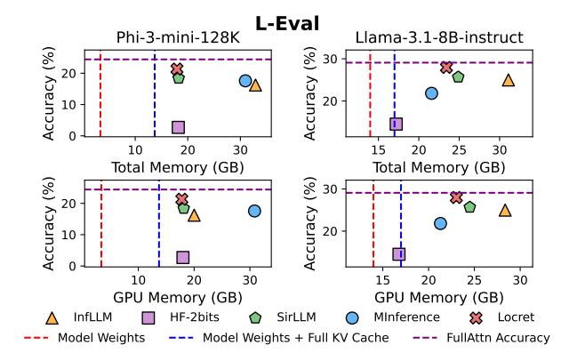

<span id="page-6-0"></span>Figure 4. Memory Statistics vs. Task Performance. The red lines correspond to the theoretical size of the model weights, while the blue lines represent the total size of the model weights and the full KV cache without any compression. The purple lines indicate the accuracies of FULLATTN. "Total Memory" represents the total memory usage of both GPU and CPU.

Eval is a shorter but more complex dataset, where SIR-LLM performs particularly well. Quantization fails on most tasks. Both INFLLM and MINFERENCE suffer significant performance drops compared to FULLATTN inference. LOCRET consistently surpasses all competitors.

We report memory consumption in Figure 4, showing:

- (1) In the extreme long-context scenario (∞Bench), LOCRET uses relatively less memory while achieving the best overall performance. INFLLM performs well with limited GPU memory usage, but it requires a significant amount of CPU memory to store the full KV cache. HF-2BITS and SIRLLM can achieve low memory consumption in some settings, but quantization introduces severe performance degradation. MINFERENCE employs sparse attention patterns but does not compress the KV cache. As a result, its minimum memory requirement equals the sum of the model weights and the full KV cache. In the shorter context scenario (L-Eval), a similar phenomenon is observed.
- (2) For Phi-3-mini-128K, which has a larger KV cache, INFLLM and MINFERENCE exhibit higher memory consumption since they store the full KV cache. Although other methods have similar memory footprints, LOCRET uses the least memory and achieves the best overall performance.
- (3) For Llama-3.1-8B-instruct, whose full KV cache is smaller, the memory bottleneck shifts to the runtime computational memory for attention and other calculations. All methods exhibit similar memory footprints, with LOCRET delivering the best overall performance.

In summary, our experiments demonstrate that LOCRET is both effective and efficient, outperforming all baselines on multiple datasets and models while using less GPU memory.

#### <span id="page-6-1"></span>4.3. Processing Speed on Real Consumer-Grade Devices

We examine the processing speed to demonstrate that LOCRET achieves its strong performance without compro-

mising inference speed, addressing question Q2. We evaluate the inference speed on the R.PassKey task from ∞Bench and compare Locret against all the baselines, using a single NVIDIA 4090 GPU with 24GB of memory, which is typical for consumer-grade AI devices. We report the inference speed (the total number of tokens within the input and output sequences divided by the processing time) and the task accuracy. Since the original settings of some baselines might lead to out-of-memory (OOM) errors, we remove some tokens from the middle of the input sequence in those cases, marking these settings with \*, and report the valid context length in such scenario. For settings without \*, we maximize the chunk size for higher speed when the method utilizes the chunked prefill pattern.

R.PassKey is a task where the model retrieves a 5-digit number from a large amount of irrelevant text, a task we believe to be relatively simple for humans. Thus, we consider the task to have failed if the accuracy falls below 95%. As shown in Table 2, aside from the settings that fail on this task, LOCRET achieves the highest inference speed among all methods that can correctly process R.PassKey:

- (1) Due to its MHA architecture, Phi-3-mini-128K has a larger KV cache, which leads to failures for both HF-2BITS and MINFERENCE. Storing the full KV cache on a single 4090 GPU is infeasible, as it requires 48GB of memory. Although the quantized KV cache is reduced to 6GB, converting representations requires significant GPU memory for its intermediate states, resulting in the failure of HF-2BITS. While INFLLM can run in memory-limited scenarios, its offloading process slows down inference. SIR-LLM fails due to its inaccurate eviction, which cannot correctly identify the 5-digit number.
- (2) In the GQA model (Llama-3.1-8B-instruct), which has a smaller KV cache, the quantized cache can fit within the GPU memory. However, the quantization and dequantization processes become the bottleneck, leading to significantly slower speed performance. The performance

| Meth                | od                         | FULLATTN    | InfLLM                   | HF-2BITS        | SIRLLM                  | MINFERENCE       | LOCRET                    | HF-2BITS*              | MInference*             |
|---------------------|----------------------------|-------------|--------------------------|-----------------|-------------------------|------------------|---------------------------|------------------------|-------------------------|
| Phi-3-<br>mini-128K | tok/s↑<br>C.Len.↑<br>Acc.↑ | 128K<br>OOM | 2276.38<br>128K<br>99.83 | 128K<br>OOM     | 2352.20<br>128K<br>1.69 | -<br>128K<br>OOM | 5080.85<br>128K<br>100.00 | 1098.51<br>30K<br>0.00 | 4099.92<br>14K<br>13.56 |
| Llama-3.1-          | tok/s↑<br>C.Len.↑          | -<br>128K   | 2287.66<br>128K          | 1365.51<br>128K | 1589.75<br>128K         | -<br>128K        | 3209.10<br>128K           | 3680.06<br>30K         | 5135.74<br>25K          |

1.69

OOM

35.59

100.00

<span id="page-7-0"></span>Table 2. Executing R.PassKey on an NVIDIA 4090. "tok/s" represents the inference speed, "C.Len" stands for the context length after truncation, and "Acc." represents task accuracy. The highest score among 128K context is marked in **bold**.

of INFLLM, SIRLLM, and MINFERENCE is similar to that seen with Phi-3-mini-128K. Although MINFERENCE benefits from faster encoding speed, it fails this task because it cannot process the entire input sequence at once. LOCRET strikes a balance between inference speed and performance, making it a far more suitable solution for longcontext scenarios on consumer-grade devices.

OOM

Acc.↑

8B-instruct

#### 4.4. LOCRET-Q: Supporting Query-Driven Tasks

We mainly address question Q3 in this section. Querydriven tasks are characterized by highly sparse yet querycorrelated critical regions within the context. A representative example is the Multikey-NIAH task from RULER (Hsieh et al., 2024), where the context comprises JSON key-value pairs given by UUIDs, and the objective is to retrieve specific values using given keys. Such contexts are inherently challenging to compress effectively without query information. As introduced by Sun et al. (2024), existing eviction-based techniques exhibit significant performance degradation when applied to query-driven tasks. Due to this, we evaluate LOCRET against selected eviction-based baselines using the RULER benchmark (Hsieh et al., 2024). We introduce LOCRET-Q, a query-aware variant of LOCRET. When training the retaining heads, we prepend the last  $l_a$ query tokens to the sequence and gather CIS labels. At inference, the query is inserted at the sequence start, ensuring its visibility across all eviction actions. This adaptation enables LOCRET-Q to perform query-aware eviction.

Table 3 shows LOCRET-Q against SNAPKV (Li et al., 2024a), H<sub>2</sub>O (Zhang et al., 2024d), and SIRLLM (Yao et al., 2024) on RULER with a 128K context length. For reference, we also include results for FULLATTN and MINFERENCE. Metrics include prefill speed, decode speed, and task performances are reported. As shown in Table 3, all efficient inference methods exhibit performance degradation to some extent. However, LOCRET-Q outperforms other evictionbased methods and even surpasses MINFERENCE, demonstrating its effectiveness on query-driven tasks. SNAPKV shows performance degradation, while H<sub>2</sub>O and SIRLLM fail completely on RULER. For speedup, methods combining eviction and chunked prefill (LOCRET-Q, LOCRET, and SIRLLM) significantly reduce prefill time, achieving  $> 2 \times$ speedup over FULLATTN. SNAPKV cannot accelerate pre-

<span id="page-7-1"></span>Table 3. Performance, prefill speed, and decode speed on RULER. The best and second-highest scores among eviction-based methods in each column are highlighted in **bold** and underlined. "†" indicates only testing the first 20 entries per subtask due to poor performance. FULLATTN is implemented using FLASH-ATTENTION.

26.78

20.34

100.00

| Method                 | RULER-128K (%) | Prefill (tok/s)    | Decode (tok/s) |
|------------------------|----------------|--------------------|----------------|
| FULLATTN<br>MINFERENCE | 82.20<br>72.97 | 4319.95<br>7205.06 | 12.32<br>2.61  |
| LOCRET-Q               | 75.54          | 9587.84            | 40.11          |
| SNAPKV                 | <u>48.76</u>   | 4203.34            | 36.49          |
| $H_2O^{\dagger}$       | 15.04          | 464.73             | 44.70          |
| SirLLM <sup>†</sup>    | 13.23          | 9717.41            | 40.86          |
| Locret <sup>†</sup>    | 34.33          | 9587.09            | 37.38          |

fill due to no computation reduction. H<sub>2</sub>O suffers from extremely slow prefill as it relies on full-sequence attention scores, incompatible with efficient implementations like FLASH-ATTENTION. Decoding speeds are similar across eviction-based methods, as they maintain comparable KV cache sizes after eviction, and all of them are faster than FULLATTN. Notably, LOCRET fails on RULER, showing a gap compared to LOCRET-Q, highlighting the necessity of query-awareness for query-centric tasks. A simple modification to LOCRET unlocks its potential for such tasks.

#### 4.5. Additional Experiments

Additional experiments that further investigate LOCRET are included in the appendices due to space limitations. We compare LOCRET with randomized eviction in Appendix E, evaluate LOCRET on LongBench in Appendix F, provide a hyperparameter analysis in Appendix G, and explore the combination of LOCRET with other methods in Appendix H. Please refer to the appendices for further details.

#### 5. Conclusion

We propose LOCRET, a lightweight training-based method that enables memory-efficient long-context LLM inference on consumer-grade devices. LOCRET introduces retaining heads to predict the CIS of each cache unit during chunked prefill and performs accurate cache eviction. We conduct extensive experiments across different models and multiple datasets to compare LOCRET with major efficient inference techniques, and results show that LOCRET outperforms all baselines, using less GPU memory and without requiring offloading to CPU memory. LOCRET-Q, a queryaware variant of LOCRET, can further process query-centric tasks without significant performance degradation. Future work will involve testing LOCRET on other model architectures, such as encoder-decoder and multi-latent models. More evaluations of LOCRET on other popular devices like NVIDIA Jetson are also planned. We also plan to explore integrating existing KV cache budget allocation methods with LOCRET to further enhance inference efficiency.

## Impact Statement

This paper presents work whose goal is to advance the field of Machine Learning. There are many potential societal consequences of our work, none which we feel must be specifically highlighted here.

## References

- <span id="page-8-1"></span>Abdin, M., Jacobs, S. A., Awan, A. A., Aneja, J., Awadallah, A., Awadalla, H., Bach, N., Bahree, A., Bakhtiari, A., Behl, H., et al. Phi-3 technical report: A highly capable language model locally on your phone. *arXiv:2404.14219*, 2024.
- <span id="page-8-11"></span>Agrawal, A., Panwar, A., Mohan, J., Kwatra, N., Gulavani, B. S., and Ramjee, R. Sarathi: Efficient llm inference by piggybacking decodes with chunked prefills. *arXiv:2308.16369*, 2023.
- <span id="page-8-12"></span>Ainslie, J., Lee-Thorp, J., de Jong, M., Zemlyanskiy, Y., Lebron, F., and Sanghai, S. Gqa: Training generalized ´ multi-query transformer models from multi-head checkpoints. *Proceedings of EMNLP*, 2023.
- <span id="page-8-15"></span>An, C., Gong, S., Zhong, M., Zhao, X., Li, M., Zhang, J., Kong, L., and Qiu, X. L-eval: Instituting standardized evaluation for long context language models. *Proceedings of ACL*, 2024.
- <span id="page-8-0"></span>Anthropic. The claude 3 model family: Opus, sonnet, haiku, 2024. URL [https://www-cdn.anthropic.com/](https://www-cdn.anthropic.com/de8ba9b01c9ab7cbabf5c33b80b7bbc618857627/Model_Card_Claude_3.pdf) [de8ba9b01c9ab7cbabf5c33b80b7bbc6188576](https://www-cdn.anthropic.com/de8ba9b01c9ab7cbabf5c33b80b7bbc618857627/Model_Card_Claude_3.pdf)27/ [Model\\_Card\\_Claude\\_3.pdf](https://www-cdn.anthropic.com/de8ba9b01c9ab7cbabf5c33b80b7bbc618857627/Model_Card_Claude_3.pdf).
- <span id="page-8-19"></span>Bai, Y., Lv, X., Zhang, J., He, Y., Qi, J., Hou, L., Tang, J., Dong, Y., and Li, J. Longalign: A recipe for long context alignment of large language models. *Proceedings of EMNLP*, 2024a.
- <span id="page-8-17"></span>Bai, Y., Lv, X., Zhang, J., Lyu, H., Tang, J., Huang, Z., Du, Z., Liu, X., Zeng, A., Hou, L., et al. Longbench: A bilingual, multitask benchmark for long context understanding. *Proceedings of ACL*, 2024b.

- <span id="page-8-6"></span>Cai, R., Tian, Y., Wang, Z., and Chen, B. Lococo: Dropping in convolutions for long context compression. *Proceedings of ICML*, 2024a.
- <span id="page-8-18"></span>Cai, Z., Zhang, Y., Gao, B., Liu, Y., Liu, T., Lu, K., Xiong, W., Dong, Y., Chang, B., Hu, J., et al. Pyramidkv: Dynamic kv cache compression based on pyramidal information funneling. *arXiv:2406.02069*, 2024b.
- <span id="page-8-14"></span>Chen, Y., Qian, S., Tang, H., Lai, X., Liu, Z., Han, S., and Jia, J. Longlora: Efficient fine-tuning of long-context large language models. *Proceedings of ICLR*, 2024.
- <span id="page-8-8"></span>Dao, T. Flashattention-2: Faster attention with better parallelism and work partitioning. *Proceedings of ICLR*, 2024.
- <span id="page-8-7"></span>Dao, T., Fu, D., Ermon, S., Rudra, A., and Re, C. Flashat- ´ tention: Fast and memory-efficient exact attention with io-awareness. *Proceedings of NeurIPS*, 2022.
- <span id="page-8-3"></span>Dettmers, T., Lewis, M., Belkada, Y., and Zettlemoyer, L. Llm.int8(): 8-bit matrix multiplication for transformers at scale. *Proceedings of NeurIPS*, 2022.
- <span id="page-8-13"></span>Dubey, A., Jauhri, A., Pandey, A., Kadian, A., Al-Dahle, A., Letman, A., Mathur, A., Schelten, A., Yang, A., Fan, A., et al. The llama 3 herd of models. *arXiv:2407.21783*, 2024.
- <span id="page-8-2"></span>Frantar, E., Ashkboos, S., Hoefler, T., and Alistarh, D. Gptq: Accurate post-training quantization for generative pretrained transformers. *Proceedings of ICLR*, 2023.
- <span id="page-8-4"></span>Ge, S., Zhang, Y., Liu, L., Zhang, M., Han, J., and Gao, J. Model tells you what to discard: Adaptive kv cache compression for llms. *Proceedings of ICLR*, 2024.
- <span id="page-8-9"></span>Ghorpade, J., Parande, J., Kulkarni, M., and Bawaskar, A. Gpgpu processing in cuda architecture. *Proceedings of ACIJ*, 2012.
- <span id="page-8-5"></span>Hooper, C., Kim, S., Mohammadzadeh, H., Mahoney, M. W., Shao, Y. S., Keutzer, K., and Gholami, A. Kvquant: Towards 10 million context length llm inference with kv cache quantization. *arXiv:2401.18079*, 2024.
- <span id="page-8-16"></span>Hsieh, C.-P., Sun, S., Kriman, S., Acharya, S., Rekesh, D., Jia, F., Zhang, Y., and Ginsburg, B. Ruler: What's the real context size of your long-context language models? *arXiv:2404.06654*, 2024.
- <span id="page-8-10"></span>Hu, C., Huang, H., Xu, L., Chen, X., Xu, J., Chen, S., Feng, H., Wang, C., Wang, S., Bao, Y., et al. Inference without interference: Disaggregate llm inference for mixed downstream workloads. *arXiv:2401.11181*, 2024a.

- <span id="page-9-4"></span>Hu, S., Tu, Y., Han, X., He, C., Cui, G., Long, X., Zheng, Z., Fang, Y., Huang, Y., Zhao, W., et al. Minicpm: Unveiling the potential of small language models with scalable training strategies. *Proceedings of COLM*, 2024b.
- <span id="page-9-22"></span>Hugging-Face. URL [https://github.com/](https://github.com/huggingface/optimum-quanto) [huggingface/optimum-quanto](https://github.com/huggingface/optimum-quanto).
- <span id="page-9-6"></span>Jiang, H., Li, Y., Zhang, C., Wu, Q., Luo, X., Ahn, S., Han, Z., Abdi, A. H., Li, D., Lin, C.-Y., et al. Minference 1.0: Accelerating pre-filling for long-context llms via dynamic sparse attention. *Proceedings of ICML*, 2024a.
- <span id="page-9-18"></span>Jiang, Y., Yan, R., Yao, X., Zhou, Y., Chen, B., and Yuan, B. Hexgen: Generative inference of large language model over heterogeneous environment. *Proceedings of ICML*, 2024b.
- <span id="page-9-12"></span>Kang, H., Zhang, Q., Kundu, S., Jeong, G., Liu, Z., Krishna, T., and Zhao, T. Gear: An efficient kv cache compression recipefor near-lossless generative inference of llm. *arXiv:2403.05527*, 2024.
- <span id="page-9-21"></span>KVCache.AI. Ktransformers: A flexible framework for experiencing cutting-edge llm inference optimizations, 2024. URL [https://github.com/](https://github.com/kvcache-ai/ktransformers) [kvcache-ai/ktransformers](https://github.com/kvcache-ai/ktransformers).
- <span id="page-9-15"></span>Kwon, W., Li, Z., Zhuang, S., Sheng, Y., Zheng, L., Yu, C. H., Gonzalez, J., Zhang, H., and Stoica, I. Efficient memory management for large language model serving with pagedattention. *Proceedings of SOSP*, 2023.
- <span id="page-9-20"></span>Lee, W., Lee, J., Seo, J., and Sim, J. Infinigen: Efficient generative inference of large language models with dynamic kv cache management. *Proceedings of OSDI*, 2024.
- <span id="page-9-9"></span>Li, Y., Huang, Y., Yang, B., Venkitesh, B., Locatelli, A., Ye, H., Cai, T., Lewis, P., and Chen, D. Snapkv: Llm knows what you are looking for before generation. *arXiv:2404.14469*, 2024a.
- <span id="page-9-2"></span>Li, Y., Liang, S., Lyu, M. R., and Wang, L. Making longcontext language models better multi-hop reasoners. *Proceedings of ACL*, 2024b.
- <span id="page-9-5"></span>Lin, J., Tang, J., Tang, H., Yang, S., Chen, W.-M., Wang, W.-C., Xiao, G., Dang, X., Gan, C., and Han, S. Awq: Activation-aware weight quantization for on-device llm compression and acceleration. *Proceedings of MLSys*, 2024.
- <span id="page-9-13"></span>Liu, Z., Desai, A., Liao, F., Wang, W., Xie, V., Xu, Z., Kyrillidis, A., and Shrivastava, A. Scissorhands: Exploiting the persistence of importance hypothesis for llm kv cache compression at test time. *Proceedings of NeurIPS*, 2024a.

- <span id="page-9-8"></span>Liu, Z., Yuan, J., Jin, H., Zhong, S., Xu, Z., Braverman, V., Chen, B., and Hu, X. Kivi: A tuning-free asymmetric 2bit quantization for kv cache. *Proceedings of ICML*, 2024b.
- <span id="page-9-17"></span>llama2.c. URL [https://github.com/karpathy/](https://github.com/karpathy/llama2.c) [llama2.c](https://github.com/karpathy/llama2.c).
- <span id="page-9-16"></span>llama.cpp. URL [https://github.com/](https://github.com/ggerganov/llama.cpp) [ggerganov/llama.cpp](https://github.com/ggerganov/llama.cpp).
- <span id="page-9-23"></span>Loshchilov, I. Decoupled weight decay regularization. *Proceedings of ICLR*, 2019.
- <span id="page-9-7"></span>Lou, C., Jia, Z., Zheng, Z., and Tu, K. Sparser is faster and less is more: Efficient sparse attention for long-range transformers. *arXiv:2406.16747*, 2024.
- <span id="page-9-10"></span>Lu, Z., Li, X., Cai, D., Yi, R., Liu, F., Zhang, X., Lane, N. D., and Xu, M. Small language models: Survey, measurements, and insights. *arXiv:2409.15790*, 2024.
- <span id="page-9-11"></span>Lv, J., Feng, Y., Xie, X., Jia, X., Peng, Q., and Xie, G. Critiprefill: A segment-wise criticality-based approach for prefilling acceleration in llms. *arXiv:2409.12490*, 2024.
- <span id="page-9-3"></span>Mei, K., Li, Z., Xu, S., Ye, R., Ge, Y., and Zhang, Y. Aios: Llm agent operating system. *arXiv:2403.16971*, 2024.
- <span id="page-9-0"></span>Minaee, S., Mikolov, T., Nikzad, N., Chenaghlu, M., Socher, R., Amatriain, X., and Gao, J. Large language models: A survey. *arXiv:2402.06196*, 2024.
- <span id="page-9-24"></span>Mu, J., Li, X., and Goodman, N. Learning to compress prompts with gist tokens. *Proceedings of NeurIPS*, 2024.
- <span id="page-9-25"></span>Munkhdalai, T., Faruqui, M., and Gopal, S. Leave no context behind: Efficient infinite context transformers with infini-attention. *arXiv:2404.07143*, 2024.
- <span id="page-9-14"></span>Nawrot, P., Łancucki, A., Chochowski, M., Tarjan, D., and ´ Ponti, E. M. Dynamic memory compression: Retrofitting llms for accelerated inference. *arXiv:2403.09636*, 2024.
- <span id="page-9-1"></span>OpenAI. Openai gpt-4o, 2024. URL [https:](https://platform.openai.com/docs/models/gpt-4o) [//platform.openai.com/docs/models/](https://platform.openai.com/docs/models/gpt-4o) [gpt-4o](https://platform.openai.com/docs/models/gpt-4o).
- <span id="page-9-26"></span>Pan, W. Anti-haystack, 2024. URL [https:](https://huggingface.co/datasets/wenbopan/anti-haystack) [//huggingface.co/datasets/wenbopan/](https://huggingface.co/datasets/wenbopan/anti-haystack) [anti-haystack](https://huggingface.co/datasets/wenbopan/anti-haystack).
- <span id="page-9-19"></span>Qin, R., Li, Z., He, W., Zhang, M., Wu, Y., Zheng, W., and Xu, X. Mooncake: Kimi's kvcache-centric architecture for llm serving. *arXiv:2407.00079*, 2024a.

- <span id="page-10-3"></span>Qin, Y., Hu, S., Lin, Y., Chen, W., Ding, N., Cui, G., Zeng, Z., Huang, Y., Xiao, C., Han, C., Fung, Y. R., Su, Y., Wang, H., Qian, C., Tian, R., Zhu, K., Liang, S., Shen, X., Xu, B., Zhang, Z., Ye, Y., Li, B., Tang, Z., Yi, J., Zhu, Y., Dai, Z., Yan, L., Cong, X., Lu, Y., Zhao, W., Huang, Y., Yan, J., Han, X., Sun, X., Li, D., Phang, J., Yang, C., Wu, T., Ji, H., Liu, Z., and Sun, M. Tool learning with foundation models. *ACM Computing Surveys*, 2024b.
- <span id="page-10-15"></span>Rajput, S., Sheng, Y., Owen, S., and Chiley, V. Inferencefriendly models with mixattention. *arXiv:2409.15012*, 2024.
- <span id="page-10-1"></span>Reid, M., Savinov, N., Teplyashin, D., Lepikhin, D., Lillicrap, T., Alayrac, J.-b., Soricut, R., Lazaridou, A., Firat, O., Schrittwieser, J., et al. Gemini 1.5: Unlocking multimodal understanding across millions of tokens of context. *arXiv:2403.05530*, 2024.
- <span id="page-10-21"></span>rustformers. URL [https://github.com/](https://github.com/rustformers/llm) [rustformers/llm](https://github.com/rustformers/llm).
- <span id="page-10-2"></span>Schnitzler, J., Ho, X., Huang, J., Boudin, F., Sugawara, S., and Aizawa, A. Morehopqa: More than multi-hop reasoning. *arXiv:2406.13397*, 2024.
- <span id="page-10-20"></span>Shah, J., Bikshandi, G., Zhang, Y., Thakkar, V., Ramani, P., and Dao, T. Flashattention-3: Fast and accurate attention with asynchrony and low-precision. *arXiv:2407.08608*, 2024.
- <span id="page-10-16"></span>Sheng, Y., Zheng, L., Yuan, B., Li, Z., Ryabinin, M., Chen, B., Liang, P., Re, C., Stoica, I., and Zhang, C. Flexgen: ´ High-throughput generative inference of large language models with a single gpu. *Proceedings of ICML*, 2023.
- <span id="page-10-14"></span>Shi, L., Zhang, H., Yao, Y., Li, Z., and Zhao, H. Keep the cost down: A review on methods to optimize llm's kv-cache consumption. *Proceedings of COLM*, 2024.
- <span id="page-10-19"></span>Sun, H., Chang, L.-W., Bao, W., Zheng, S., Zheng, N., Liu, X., Dong, H., Chi, Y., and Chen, B. Shadowkv: Kv cache in shadows for high-throughput long-context llm inference. *arXiv:2410.21465*, 2024.
- <span id="page-10-23"></span>Turganbay, R. Unlocking longer generation with key-value cache quantization, 2024. URL [https://huggingface.co/blog/](https://huggingface.co/blog/kv-cache-quantization) [kv-cache-quantization](https://huggingface.co/blog/kv-cache-quantization).
- <span id="page-10-4"></span>Wang, L., Ma, C., Feng, X., Zhang, Z., Yang, H., Zhang, J., Chen, Z., Tang, J., Chen, X., Lin, Y., et al. A survey on large language model based autonomous agents. *Frontiers of Computer Science*, 18(6):186345, 2024.
- <span id="page-10-18"></span>Wu, J., Ren, J., Yang, S., Parasyris, K., Georgakoudis, G., Laguna, I., and Li, D. Lm-offload: Performance modelguided generative inference of large language models with parallelism control. *Blog of PASA Lab*, 2024.

- <span id="page-10-17"></span>Xiao, C., Zhang, P., Han, X., Xiao, G., Lin, Y., Zhang, Z., Liu, Z., Han, S., and Sun, M. Infllm: Unveiling the intrinsic capacity of llms for understanding extremely long sequences with training-free memory. *Proceedings of NeurIPS*, 2024a.
- <span id="page-10-5"></span>Xiao, G., Lin, J., Seznec, M., Wu, H., Demouth, J., and Han, S. Smoothquant: Accurate and efficient post-training quantization for large language models. *Proceedings of ICML*, 2023.
- <span id="page-10-12"></span>Xiao, G., Tang, J., Zuo, J., Guo, J., Yang, S., Tang, H., Fu, Y., and Han, S. Duoattention: Efficient longcontext llm inference with retrieval and streaming heads. *arXiv:2410.10819*, 2024b.
- <span id="page-10-7"></span>Xiao, G., Tian, Y., Chen, B., Han, S., and Lewis, M. Efficient streaming language models with attention sinks. *Proceedings of ICLR*, 2024c.
- <span id="page-10-8"></span>Yang, D., Han, X., Gao, Y., Hu, Y., Zhang, S., and Zhao, H. Pyramidinfer: Pyramid kv cache compression for highthroughput llm inference. *Proceedings of ACL*, 2024.
- <span id="page-10-10"></span>Yao, Y., Li, Z., and Zhao, H. Sirllm: Streaming infinite retentive llm. *Proceedings of ACL*, 2024.
- <span id="page-10-13"></span>Yuan, J., Liu, H., Chuang, Y.-N., Li, S., Wang, G., Le, D., Jin, H., Chaudhary, V., Xu, Z., Liu, Z., et al. Kv cache compression, but what must we give in return? a comprehensive benchmark of long context capable approaches. *Proceedings of EMNLP*, 2024.
- <span id="page-10-6"></span>Zandieh, A., Daliri, M., and Han, I. Qjl: 1-bit quantized jl transform for kv cache quantization with zero overhead. *arXiv:2406.03482*, 2024.
- <span id="page-10-11"></span>Zhang, T., Yi, J., Xu, Z., and Shrivastava, A. Kv cache is 1 bit per channel: Efficient large language model inference with coupled quantization. *arXiv:2405.03917*, 2024a.
- <span id="page-10-22"></span>Zhang, X., Chen, Y., Hu, S., Xu, Z., Chen, J., Hao, M. K., Han, X., Thai, Z. L., Wang, S., Liu, Z., et al. ∞ bench: Extending long context evaluation beyond 100k tokens. *Proceedings of ACL*, 2024b.
- <span id="page-10-24"></span>Zhang, Z., Liu, S., Chen, R., Kailkhura, B., Chen, B., and Wang, A. Q-hitter: A better token oracle for efficient llm inference via sparse-quantized kv cache. *Proceedings MLSys*, 2024c.
- <span id="page-10-9"></span>Zhang, Z., Sheng, Y., Zhou, T., Chen, T., Zheng, L., Cai, R., Song, Z., Tian, Y., Re, C., Barrett, C., et al. H2o: ´ Heavy-hitter oracle for efficient generative inference of large language models. *Proceedings of NeurIPS*, 2024d.
- <span id="page-10-0"></span>Zhao, W. X., Zhou, K., Li, J., Tang, T., Wang, X., Hou, Y., Min, Y., Zhang, B., Zhang, J., Dong, Z., et al. A survey of large language models. *arXiv:2303.18223*, 2023.

<span id="page-11-0"></span>Zhong, Y., Liu, S., Chen, J., Hu, J., Zhu, Y., Liu, X., Jin, X., and Zhang, H. Distserve: Disaggregating prefill and decoding for goodput-optimized large language model serving. *Proceedings of OSDI*, 2024.

## <span id="page-12-1"></span>A. Hyperparameters, Environment and Baselines

### A.1. Training

During the training stage, we first insert retaining head Rs to each layar. A retaining head is a small FFN consist of two linear transformations, and the non-linear function is aligned with other non-linears of the conresponding model, with an intermediate size of 1024. We train the appended retaining head Rs on the LongAlpaca for 3000 steps with batch size set to 1 and maximum sequence length set to 10240. We use the AdamW scheduler [\(Loshchilov,](#page-9-23) [2019\)](#page-9-23) and the learning rate is set to 5e-4. We conduct the training with a linear learning rate scheduler, whose warmup step number is set to 2000. The balance factor between two training loss α is set to 0.0025.

### <span id="page-12-0"></span>A.2. Inference

Table 4. Hyperparameters in LOCRET's inference stage. "b" is cache budget, "B" refers to chunk size of chunked prefill, "ns" refers to stabilizers length and "nloc" is local length.

| Model                 | b     | B    | ns   | nloc |
|-----------------------|-------|------|------|------|
| Phi-3-mini-128K       | 6000  | 3072 | 2500 | 100  |
| Llama-3.1-8B-instruct | 16384 | 1024 | 2500 | 100  |

The inference hyperparameters of LOCRET is listed in Table [4.](#page-12-0) Here, we follow the notations in Algorithm [1.](#page-14-0) b stands for the cache budget, B is the chunk size of chunked prefill, n<sup>s</sup> is the length of stabilizers, and nloc represents the length of locally retained tokens at the end of the input sequence.

Hyperparameters of other baselines are as follows. For INFLLM, we use the recommended settings for Llama-3 to evaluate Llama-3.1. Since there is no recommendations of Phi-3-mini-128K, we use the settings for MiniCPM, whose architechture and size is similar to Phi-3-mini-128K, to conduct all the experiments. For Quantization, we use the official implementation (Quanto backend) of Hugging Face. For SIRLLM, we set the start size to 4, recent size to 1000 for both models. We set the token entropy size to 6000 and 16384 for Phi-3-mini-128K and Llama-3.1-8B-instruct respectively. The chunk size of chunked prefill is also 3072 and 1024 for the corresponding model. For MINFERENCE, we utilize the recommended settings for both models.

### A.3. System Environment

For all the experiments except the 4090 experiments in Section [4.3,](#page-6-1) we use a workstation with 8×NVIDIA A800/H800 GPUs and 104 Intel(R) Xeon(R) Platinum 8470 CPUs. We only use 1 GPU from the cluster for training, as the GPU requirements are less than 80GB for all training procedures. The device has 1.0 TB CPU memory. The operating system is Red Hat 4.8.5. We conduct all experiments except the full attention full KV cache inference on a single GPU, and 2 GPUs for full attention settings.

For Section [4.3,](#page-6-1) we conduct the experiments on a single NVIDIA 4090 GPU. The device has 512 AMD EPYC 9754 128-Core Processors and 1.0 TB CPU memory. GPUs and CPUs are connected through PCIe Gen 4, which has 16GT/s transmission speed. The operating system is Ubuntu 9.4.0.

### A.4. Baselines

We compare LOCRET with full attention inference, INFLLM, Quantization, SIRLLM and MINFERENCE. FULLATTN inference is performed using vllm [\(Kwon et al.,](#page-9-15) [2023\)](#page-9-15), which includes automatic tensor parallelism. INFLLM is a representative of the offloading-based methods, where the full KV cache is offloaded to CPU, and the most relavant blocks are retrieved to GPU during inference. For quantization method, we use the Hugging Face implementation of 2-bits KV cache quantization, which is inspired by [Liu et al.](#page-9-8) [\(2024b\)](#page-9-8), where quantization is conducted along channels instead of tokens. We denote this method as HF-2BITS. SIRLLM is an eviction-based token dropping algorithm, where tokens with low token-entropy is evicted once the cache is fullfilled. We use the official implementation of SirLLM, which includes some CPU operations including importance sorting. MINFERENCE is a typical method of reducing peak GPU memory consumption through rule-based sparse attention, but it does not reduce the size of KV cache. Note that INFLLM, HF-2BITS and SIRLLM does not have official implementation on Phi-3-mini-128K, thus we implement these three methods according to the original algorithm. We only use the short factor of RoPE for INFLLM, and no further model modification is conducted for HF-2BITS and SIRLLM.

### <span id="page-13-0"></span>B. The Global and Local Discrepancy of Scoring Functions

Cache importance scoring functions can generally be categorized into two types: causal and non-causal. Non-causal functions, e.g. H<sub>2</sub>O and SNAPKV, require information from subsequent cache units to determine the importance score of a cache unit, making them dependent on prefilling the entire sequence. On the other hand, causal functions, e.g. SIRLLM and LOCRET, predict cache importance without relying on subsequent information. Non-causal scoring functions are incompatible with chunked prefill because they cannot calculate scores without access to the full sequence. If such functions are integrated with chunked prefill, they often face a significant discrepancy between the local importance score (without considering subsequent information) and the global importance score (with full context).

To investigate this discrepancy, we measure the consistency of the top 10% most important cache positions identified in prefixes of various lengths compared to the full context. For reference, the full context is truncated to 6K tokens. The results shown in Figure 1 highlights that scoring functions requiring future information, such as  $H_2O$  and SNAPKV, suffer from significant discrepancies when subsequent cache units are not considered. SIRLLM, while also causal, shows notable inaccuracies, leading to performance degradation as demonstrated in Table 1 and Table 2.

<span id="page-13-1"></span>We also evaluate the end-to-end performance using  $H_2O$  and SNAPKV with chunked prefill on  $\infty Bench$ , shown in Table 5. The results demonstrate that discrepancies between local and global importance scores in  $H_2O$  and SNAPKV lead to severe performance drops, particularly in R.Number. It is this discrepancy that leads to the failure of  $H_2O$  and SNAPKV in accurately retrieving information from the context. Specifically, the model is unable to identify the importance of certain cache units at the time they are first encountered. LOCRET, however, avoids such inconsistencies and achieves superior performance.

|          | D1 1 0 1                  |       | 7 D   | 1.      |       |  |  |  |  |  |  |
|----------|---------------------------|-------|-------|---------|-------|--|--|--|--|--|--|
|          | Phi-3-mini-128K on ∞Bench |       |       |         |       |  |  |  |  |  |  |
| Method   | R.Number                  | E.Sum | E.MC  | C.Debug | Avg.↑ |  |  |  |  |  |  |
| FULLATTN | 97.12                     | 17.92 | 55.46 | 23.10   | 48.40 |  |  |  |  |  |  |
| $H_2O$   | 3.39                      | 15.35 | 45.41 | 20.57   | 21.18 |  |  |  |  |  |  |
| SNAPKV   | 2.54                      | 15.44 | 41.92 | 21.43   | 20.33 |  |  |  |  |  |  |
| LOCRET   | 97.46                     | 16.82 | 46.29 | 29.71   | 47.57 |  |  |  |  |  |  |

Table 5. ∞Bench scores of H<sub>2</sub>O, SNAPKV and LOCRET.

#### C. Pseudocode of LOCRET

We provide the pseudocode of LOCRET in this section, and we describe the inferece process of LOCRET in Algorithm 1.

### D. Evaluating LOCRET-Q on RULER

Table 6. Performance, prefill speed, and decode speed on RULER (Detailed). The best and second-highest scores among eviction-based methods in each column are highlighted in **bold** and <u>underlined</u>, respectively. "†" indicates testing limited to the first 20 entries per subtask due to poor performance. FULLATTN is implemented using FLASH-ATTENTION.

| Method                  | SG1             | SG2            | SG3            | MK1            | MK2            | MK3            | MV             | MQ             | VT             | CWE            | FWE            | QA1            | QA2           | Avg.           |
|-------------------------|-----------------|----------------|----------------|----------------|----------------|----------------|----------------|----------------|----------------|----------------|----------------|----------------|---------------|----------------|
| FULLATTN<br>MINFERENCE  | 99.40<br>100.00 | 99.80<br>98.60 | 99.60<br>99.00 | 98.20<br>95.40 | 87.60<br>58.20 | 67.00<br>23.80 | 94.65<br>84.35 | 98.00<br>95.70 | 60.98<br>66.40 | 71.40<br>45.94 | 72.20<br>74.67 | 78.20<br>67.80 | 41.6<br>38.80 | 82.20<br>72.97 |
| LOCRET-Q                | 100.00          | 99.80          | 99.60          | 75.00          | 98.80          | 98.60          | 66.95          | 85.50          | 52.64          | 30.90          | 80.27          | 53.20          | 40.80         | 75.54          |
| SNAPKV                  | 100.00          | 82.80          | 11.60          | 70.40          | 6.20           | 1.40           | 68.50          | <u>78.40</u>   | 49.04          | 31.90          | 50.07          | 51.20          | 32.40         | 48.76          |
| $\mathrm{H_2O}^\dagger$ | 20.00           | 0.00           | 0.00           | 0.00           | 0.00           | 0.00           | 3.75           | 2.50           | 1.00           | 0.00           | 53.33          | 100.00         | 15.00         | 15.04          |
| SirLLM <sup>†</sup>     | 0.00            | 5.00           | 5.00           | 0.00           | 5.00           | 5.00           | 6.25           | 8.75           | 12.00          | 0.00           | 80.00          | 30.00          | 15.00         | 13.23          |
| Locret <sup>†</sup>     | 100.00          | 45.00          | <u>35.00</u>   | 10.00          | 5.00           | 0.00           | 20.00          | 17.50          | 69.00          | 46.50          | 73.33          | 20.00          | 5.00          | 34.33          |

To evaluate LOCRET-Q's performance on query-centric tasks, we compare it with selected eviction-based baselines: SNAPKV, H<sub>2</sub>O, SIRLLM, and vanilla LOCRET. We also include FULLATTN (implemented with FLASH-ATTENTION) and MINFERENCE for reference. The RULER benchmark consists of 500 synthetic queries per task, each with a context length of 128K tokens. All methods are tested on Lilama-3.1-8B-instruct.

#### <span id="page-14-0"></span>Algorithm 1 LOCRET Inference

```
Input:Model M, Prompt tokens x, Local length nloc, Stablizer length ns, Budget b, Chunk size B
Output:Generated tokens xgen
// Leave the last nloc out to make sure they are not evicted.
chunk positions ← split chunk(0, x.length() −nloc, B)
K cache, V cache, score cache ← [], [], []
for chunk ∈ chunk positions do
  begin pos, end pos ← chunk.begin pos, chunk.end pos
  K chunk, V chunk, score chunk ←
    M(x[begin pos:end pos], K cache, V cache)
  K cache ← Concat(K cache, K chunk)
  V cache ← Concat(V cache, V chunk)
  score cache ← Concat(score cache, score chunk)
  if chunk is not the last chunk then
    // Keep the last ns caches to maintain higher context continuity.
    score cache[score cache.length()-
       ns:score cache.length()] ← +∞
  end if
  indices ← top-b(score cache).indices
  K cache, V cache, score cache = K cache[indices],
    V cache[indices], score cache[indices]
end for
K cache, V cache, score cache ←
  M(x[x.length()−nloc:x.length()], K cache, V cache)
xgen ← M.generate(K cache, V cache)
return xgen
```

For LOCRET-Q and LOCRET, we set the budget size b to 6000, chunk size B to 4096, stabilizers length n<sup>s</sup> to 2500, and local length nloc to 100. For SNAPKV, the voting window size is set to 100, with the last 100 tokens retained. For H2O, due to its reliance on full-sequence attention scores, we use a layer-wise chunked prefill pattern with a chunk size of 1024. Larger chunk size would result in an out-of-memory error. For SIRLLM, we configure the start size to 4, recent size to 1000, and budget size to 6000. All evaluations are conducted on a single NVIDIA A800-80GB GPU.

For prefill and decode speed testing, all methods except H2O are implemented with FLASH-ATTENTION; H2O uses PyTorch's vanilla attention due to its incompatibility with efficient attention implementations.

## <span id="page-14-3"></span><span id="page-14-1"></span>E. Trained Retaining Heads vs. Random Eviction

Table 7. The results of LOCRET compared with randomly initialized retaining head Rs on ∞Bench and L-Eval.

|                  |                |                |               |              | Phi-3-mini-128K on ∞Bench |               |               |                |               |               |
|------------------|----------------|----------------|---------------|--------------|---------------------------|---------------|---------------|----------------|---------------|---------------|
| Method           | R.PassKey      | R.Number       | E.Sum         | E.QA         | E.MC                      | Z.QA          | E.Dia         | C.Debug        | M.Find        | Avg.          |
| Random<br>LOCRET | 0.00<br>100.00 | 34.00<br>97.46 | 5.09<br>16.82 | 2.68<br>7.61 | 18.34<br>46.29            | 1.54<br>11.31 | 0.00<br>10.00 | 13.71<br>27.92 | 2.57<br>29.71 | 4.92<br>34.73 |

We compare the trained LOCRET to appending randomly initialized retaining head Rs on ∞Bench. The results in Table [7](#page-14-3) show that LOCRET training is effective. Randomly initialized of retaining heads give random predictions and evict arbitary cache units at each step, resulting the failure on all tasks.

## <span id="page-14-2"></span>F. Evaluation on LongBench

We conduct additional experiments to evaluate Locret on LongBench [\(Bai et al.,](#page-8-17) [2024b\)](#page-8-17), comparing it with baselines such as Full Attention, MInference, InfLLM, and SirLLM. For this evaluation, we used Phi-3-mini-128K with a retained head trained on LongAlign. To ensure a fair comparison, we excluded all Chinese subtasks from LongBench and focused solely on the English subtasks, as Phi-3-mini-128K was not specifically trained on Chinese corpora. The results are presented below. For LOCRET , we follow the hyperparameters presented in Table [4.](#page-12-0)

| Table 8. LongBench scores of  | LOCRET compa | ared with baselines |
|-------------------------------|--------------|---------------------|
| Table 6. Long Denen scores of | LOCKET COMP  | area with basemies. |

| Method                                   | gov_<br>report                          | triviaqa                         | narrative<br>qa                         | qmsum                                   | musique                                 | 2wikimqa                                | multifield<br>qa_en                     | repobench<br>-p                         | qasper                                  | hotpotqa                                | multi_<br>news                   | trec                             | passage_<br>retrieval_en         | passage<br>_count                   | samsum                                 | lcc   Avg.↑                                                                    |
|------------------------------------------|-----------------------------------------|----------------------------------|-----------------------------------------|-----------------------------------------|-----------------------------------------|-----------------------------------------|-----------------------------------------|-----------------------------------------|-----------------------------------------|-----------------------------------------|----------------------------------|----------------------------------|----------------------------------|-------------------------------------|----------------------------------------|--------------------------------------------------------------------------------|
| FULLATTN                                 | 33.35                                   | 86.38                            | 18.21                                   | 19.51                                   | 19.82                                   | 33.37                                   | 49.82                                   | 58.02                                   | 41.07                                   | 43.06                                   | 26.57                            | 67.00                            | 93.50                            | 2.97                                | 23.15                                  | 51.86   41.73                                                                  |
| MINFERENCE<br>SIRLLM<br>INFLLM<br>LOCRET | 32.94<br>32.92<br>25.96<br><b>33.46</b> | 86.87<br>85.61<br>84.87<br>82.39 | 19.46<br>21.08<br>20.83<br><b>24.56</b> | 19.57<br>21.59<br>19.61<br><b>23.35</b> | 18.85<br>24.32<br>13.63<br><b>25.12</b> | 33.30<br>34.97<br>27.43<br><b>35.93</b> | 49.14<br>48.52<br>41.29<br><b>52.77</b> | 58.98<br><b>59.15</b><br>55.73<br>57.16 | <b>40.31</b><br>40.17<br>30.51<br>40.17 | 43.56<br>47.00<br>38.05<br><b>48.70</b> | 26.35<br>26.44<br>25.36<br>26.41 | 68.00<br>65.50<br>64.50<br>62.00 | 89.00<br>63.00<br>10.00<br>83.00 | 2.10<br>3.00<br><b>7.50</b><br>3.00 | 25.58<br>23.11<br>0.28<br><b>26.37</b> | 53.68   41.73<br>51.83   40.51<br><b>61.59</b>   32.95<br>52.61   <b>42.31</b> |

We also report the maximum memory usage, including the GPU memory, the CPU memory, and the total maximum memory, alongside the average score on LongBench. For FULLATTN, we exclude the maximum memory usage, aligning with Figure 4.

Table 9. Comparison of methods on LongBench and memory usage.

| Method     | LongBench | Max GPU Memory | Max CPU Memory | Total Max Memory |
|------------|-----------|----------------|----------------|------------------|
| FULLATTN   | 41.73     | -              | -              | -                |
| MINFERENCE | 41.73     | 27.63          | 0.17           | 27.80            |
| SIRLLM     | 40.51     | 18.29          | 0.05           | 18.34            |
| InfLLM     | 32.95     | 20.03          | 8.95           | 28.98            |
| LOCRET     | 42.31     | 17.71          | 0.15           | 17.86            |

From the experiments above, LOCRET demonstrates the best overall performance and excels in the majority of subtasks. It outperforms all the baselines without any noticeable performance degradation while consuming less memory. Although MInference also avoids performance drops, it requires more GPU memory compared to LOCRET. SirLLM achieves comparable memory usage but shows some performance decline compared to FULLATTN and LOCRET. InfLLM exhibits the most significant performance drop, and its offloading mechanism results in the highest CPU memory usage, making it the method with the largest total memory consumption. These results highlight LOCRET as an outstanding approach for evaluation on LongBench.

#### <span id="page-15-0"></span>**G.** Hyperparameter Analysis

We examine three key hyperparameters: budget, stabilizer length, and chunk size.

**Budget** To evaluate the robustness of LOCRET under different budget constraints, we compare the proposed method with SNAPKV (Li et al., 2024a) using chunked prefill on LongBench (Bai et al., 2024b). As shown in Figure 5a, when the budget size increases, LOCRET demonstrates a faster performance improvement compared to SNAPKV.

Stabilizers Length As discussed in Figure 3, stabilizers play a crucial role in context retrieval tasks. However, in NLU tasks, the stability of  $n_s$  remains relatively high. We evaluate QMSum with different stabilizer lengths  $n_s$ , with the budget set at 6000. As illustrated in Figure 5b, performance remains consistent when  $n_s$  is small. The observed performance degradation at larger  $n_s$  values is due to the reduced space available for other cache units.

Chunk Size Executing long-context inference on hardware with varying GPU memory limitations choices of chunk size. When the chunk size changes, LOCRET shows stable performance. We test on the NQ dataset from L-Eval using multiple chunk sizes ranging from 256 to 4096. The results, shown in Figure 5c, highlight the stability of  $n_s$ .

<span id="page-15-1"></span>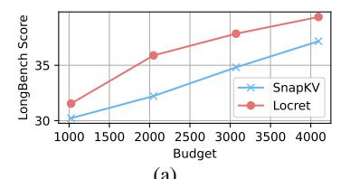

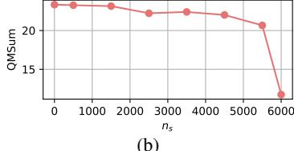

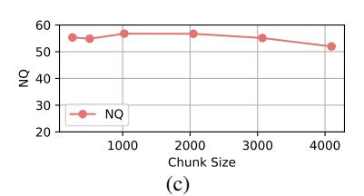

Figure 5. Scores of LOCRET under (a) various budgets; (b) various  $n_s$ ; (c) various chunk size.

## <span id="page-16-0"></span>H. Orthogonality to Other Methods

<span id="page-16-1"></span>Table 10. Quantization with FULLATTN and LOCRET. "M" represents Method and "−∆" represents the gap of average L-Eval score.

| Setting    | M     | M-4bits | −∆   |
|------------|-------|---------|------|
| M=FULLATTN | 29.08 | 28.52   | 0.56 |
| M=LOCRET   | 27.96 | 27.11   | 0.85 |

Table 11. The average L-Eval scores of LOCOCO, LOCRET, and the combination of LOCOCO and LOCRET.

| Method | LOCOCO | LOCRET | Combination |
|--------|--------|--------|-------------|
| L-Eval | 26.01  | 27.96  | 28.70       |

KV cache quantization. According to [Zhang et al.](#page-10-24) [\(2024c\)](#page-10-24), eviction-based methods like H2O struggle with compatibility when combined with KV cache quantization. Quantization introduces significant disturbance in the estimation of heavyhitters, leading to severe performance degradation. However, LOCRET is not affected by such issues and can be combined with quantization while maintaining most of its performance. Here, we compare the performance degradation caused by quantization on LOCRET with that of the full attention method using the same metrics. We use Quanto as the quantization backend and report the average L-Eval score with Llama-3.1-8B-instruct as the model backbone. Table [10](#page-16-1) shows that the performance drop caused by quantization on LOCRET is only slightly higher than that observed with the full attention method, indicating that LOCRET is a quantization-friendly approach. More details of the experiment are provided in Appendix [H.1.](#page-17-1)

Token merging. As described in Section [2,](#page-1-0) token dropping can also be implemented through an attention pool. Attention pool-based methods [\(Xiao et al.,](#page-10-7) [2024c;](#page-10-7) [Cai et al.,](#page-8-6) [2024a;](#page-8-6) [Mu et al.,](#page-9-24) [2024;](#page-9-24) [Munkhdalai et al.,](#page-9-25) [2024\)](#page-9-25) merge adjacent tokens or cache units into an attention pool, maintaining a static cache size. These methods are orthogonal to LOCRET , as the evicted tokens can be merged into a small cache pool and retained in GPU memory. We conduct the following experiment to demonstrate that LOCRET can serve as an effective plug-in scoring function within such frameworks, enhancing performance without increasing memory budget. We select LOCOCO [\(Cai et al.,](#page-8-6) [2024a\)](#page-8-6) as a representative of the latest attention pool-based methods. LOCOCO maintains a cache set consisting of two parts: the heavy hitters and the convolved non-heavy hitters. During each chunked prefill step, LOCOCO first identifies a set of heavy hitters according to H2O [\(Zhang et al.,](#page-10-9) [2024d\)](#page-10-9), then applies 1-D convolution to the non-heavy hitters to compress them into a static size. By replacing H2O's heavy-hitter scoring function with LOCRET, we retain the cache units with high CIS and convolve the others. We compare this combination with standalone LOCOCO and LOCRET on L-Eval using the Llama-3.1-8B-instruct backbone and report the average score across all selected tasks. As shown in Table [11,](#page-16-1) LOCRET achieves a higher score than LOCOCO, and the combined algorithm outperforms both standalone methods. This suggests that LOCRET provides a more accurate scoring function compared to H2O, and the two methods complement each other, demonstrating their orthogonality. Further details of the experiment are provided in Appendix [H.2.](#page-17-2)

<span id="page-16-2"></span>Head-wise Budget Allocation. Since LOCRET evict cache units across the attention heads independently, it is compatible with head-wise budget allocation. Here, we combine LOCRET with PYRAMIDKV [\(Cai et al.,](#page-8-18) [2024b\)](#page-8-18). PYRAMIDKV assumes that identifing the important cache in deeper layers are simpler than shallow layers, thus it allocates more budget to the shallow layers. We evaluate LOCRET+PYRAMIDKV on the following subtasks of ∞Bench using Phi-3-mini-128K. Results presented in Figure [12](#page-16-2) shows the compatibility of the two methods.

Table 12. ∞Bench scores of the combination of LOCRET and PYRAMIDKV.

| Phi-3-mini-128K on ∞Bench  |                |                |                |                |                |  |  |  |
|----------------------------|----------------|----------------|----------------|----------------|----------------|--|--|--|
| Method                     | R.Number       | E.Sum          | E.MC           | C.Debug        | Avg.↑          |  |  |  |
| LOCRET<br>LOCRET+PYRAMIDKV | 97.46<br>99.66 | 16.82<br>15.82 | 46.29<br>48.03 | 29.71<br>30.00 | 47.57<br>48.38 |  |  |  |

#### <span id="page-17-3"></span><span id="page-17-1"></span>H.1. Combination with Quantization

Table 13. L-Eval scores of FULLATTN, FULLATTN-4bits, LOCRET and LOCRET-4bits. (Detailed)

| Llama-3.1-8B-instruct on L-Eval |              |                |                |                |                |       |                |  |
|---------------------------------|--------------|----------------|----------------|----------------|----------------|-------|----------------|--|
| Method                          | CodeU        | NQ             | CUAD           | NarrativeQA    | QMSum          | SPACE | Avg.↑          |  |
| FULLATTN FULLATTN-4bits         | 10.0<br>7.78 | 66.84<br>66.64 | 38.91<br>38.25 | 23.11<br>22.76 | 18.76<br>18.85 |       | 29.08<br>28.52 |  |
| LOCRET<br>LOCRET-4bits          | 8.89<br>4.44 | 63.03<br>63.22 | 37.21<br>36.95 | 23.59<br>22.80 | 18.17<br>18.43 |       | 27.96<br>27.11 |  |

We compare the combination of LOCRET and HF-4BITS quantization with the full attention method and the standalong HF-4BITS quantization. We utilize the official implementation of Hugging Face, with Quanto as the backend of quantization. Other hyperparameters are kept same as described in Section 4.1. We conduct the experiment on L-Eval and report the average score, with Llama-3.1-8B-instruct backend. The results in Table 13 shows that the degradation caused by quantization is not significantly high, showing that LOCRET exhibits good robustness on data representation and it is friendly to quantization.

#### <span id="page-17-2"></span>H.2. Combination with LoCoCo

Table 14. L-Eval scores of LoCoCo, Locret and the combination LoCoCo+Locret. (Detailed)

| Llama-3.1-8B-instruct on L-Eval   |                      |                         |                         |                         |                         |                                                 |  |  |
|-----------------------------------|----------------------|-------------------------|-------------------------|-------------------------|-------------------------|-------------------------------------------------|--|--|
| Method                            | CodeU                | NQ                      | CUAD                    | NarrativeQA             | QMSum                   | SPACE   Avg.↑                                   |  |  |
| FULLATTN                          | 10.0                 | 66.84                   | 38.91                   | 23.11                   | 18.76                   | 16.86   29.08                                   |  |  |
| LoCoCo<br>Locret<br>LoCoCo+Locret | 4.44<br>8.89<br>7.78 | 61.10<br>63.03<br>66.33 | 35.84<br>37.21<br>38.01 | 19.83<br>23.59<br>24.85 | 18.15<br>18.17<br>18.31 | 16.71   26.01<br>16.87   27.96<br>16.92   28.70 |  |  |

We compare the combination of LoCoCo and Locret with the standalone methods. For LoCoCo, we train the convolution head with the size of convolved cache set to 2048. We extend the context length through chunked prefill training to 64K, which is longer than all tasks' average input length. The convolution kernel is set to 21, and we train the newly-added convolution and layer norms for 200 steps, following the original setting. Since the original Llama-3.1-8B-instruct supports 128K context length, we do not modify its positional embedding. During Inference, we keep a cache budget size of 16384. In the standalone LoCoCo setting, there are 2048 cache units are convolved, while the others are the heavy-hitters selected by  $H_2O$ . In the combined algorithm, we replace  $H_2O$  to Locret. We select 14336 cache units with the highest CIS, and convolve the other evicted tokens into 2048 cache units. In all methods, we set the local length to 0, following the original setting.

### <span id="page-17-0"></span>I. Training Robustness

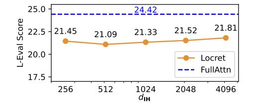

Table 15. L-Eval scores of LOCRET trained on various datasets.

| Dataset | LongAlpaca | LongAlign | Anti-Haystack |
|---------|------------|-----------|---------------|
| L-Eval  | 21.33      | 22.00     | 20.72         |

Figure 6. L-Eval scores with different intermediate size of retaining head  $d_{\mathbf{R}}$ .

LOCRET demonstrates high robustness to the training settings, suggesting that there is no need for careful tuning of training hyperparameters or meticulous selection of datasets. Here, we ablate the intermediate size of the retaining heads  $d_{\mathbf{R}}$  and

train the retaining head  $\mathbf{R}$ s on various long-context tuning datasets to demonstrate the stability of results across different training settings.

#### I.1. Intermediate Size of the retaining head

<span id="page-18-1"></span>We align all the training settings as described in Section 4.1 and only change the intermediate size of retaining heads  $d_{\mathbf{R}} \in \{256, 512, 1024, 2048, 4096\}$  with the backbone model Phi-3-mini-128K. The trained model is evaluated on L-Eval and we report the average L-Eval score corresponding to each intermediate size. Results are listed in Figure 6. The performance variations among all the settings are minimal compared to the changes in the intermediate size, surpassing all baselines in Table 1. This indicates that out method exhibits good performance stability regardless of the intermediate size of the retaining head  $\mathbf{R}$ s.

|                  | Phi-3-mini-128K on L-Eval |       |       |             |       |       |       |  |  |
|------------------|---------------------------|-------|-------|-------------|-------|-------|-------|--|--|
| $d_{\mathbf{R}}$ | CodeU                     | NQ    | CUAD  | NarrativeQA | QMSum | SPACE | Avg.↑ |  |  |
| 256              | 8.89                      | 51.52 | 23.05 | 16.21       | 15.26 | 13.77 | 21.45 |  |  |
| 512              | 6.67                      | 50.61 | 23.33 | 16.67       | 15.02 | 14.23 | 21.09 |  |  |
| 1024             | 8.89                      | 51.49 | 22.23 | 16.42       | 14.86 | 14.06 | 21.33 |  |  |
| 2048             | 7.78                      | 54.09 | 21.91 | 16.46       | 15.00 | 13.89 | 21.52 |  |  |
| 4096             | 10.00                     | 52.33 | 23.52 | 16.15       | 14.81 | 14.02 | 21.81 |  |  |

Table 16. L-Eval scores with different intermediate size of the retaining head  $d_{\mathbf{R}}$ . (Detailed)

We train different retaining head  $\mathbf{R}s$  with  $d_{\mathbf{R}} \in \{256, 512, 1024, 2048, 4096\}$ . We keep all the other hyperparameters same, and train on the same dataset. From Table 16, Locret shows stability to the intermediate size, in both overall performance and the performance of each single task. While increasing the intermediate size, we observe very slight overall performance enhancement. However, the performance variance is negligible compared to the increase of parameter size, thus we choose to maintain the intermediate size in a small scope to take balance of performance and efficiency.

#### I.2. Training Data Insensitivity

<span id="page-18-2"></span>We also consider the sensitivity of the training data, which leads us to ablate the training dataset by training on LongAlign (Bai et al., 2024a) and Anti-Haystack (Pan, 2024), comparing these results with those from LongAlpaca (Chen et al., 2024) in the original training setting. We also align other settings to the original setting and choose the backbone model to be Phi-3-mini-128K. We report the average L-Eval score for each training dataset. The results in Table 15 shows that LOCRET has high insensitivity towards different training data. The performance impact of different data recipes is minimal, indicating that our method can be trained on any long-context tuning dataset.

| Phi-3-mini-128K on L-Eval |       |       |       |             |       |       |       |
|---------------------------|-------|-------|-------|-------------|-------|-------|-------|
| Dataset                   | CodeU | NQ    | CUAD  | NarrativeQA | QMSum | SPACE | Avg.↑ |
| LongAlpaca                | 8.89  | 51.49 | 22.23 | 16.42       | 14.86 | 14.06 | 21.33 |
| LongAlign                 | 10.00 | 55.13 | 21.34 | 16.40       | 15.01 | 14.09 | 22.00 |
| Anti-Haystack             | 8.89  | 52.91 | 20.87 | 13.73       | 13.84 | 14.10 | 20.72 |

Table 17. L-Eval scores of LOCRET trained on various dataset. (Detailed)

We conduct training on various datasets and benchmark the trained weights on L-Eval with Phi-3-mini-128K backbone, to show the stability towards training datasets. For each datasets, we set the training hyperparameters same and truncate the context to 10240 tokens. We train the first 3000 steps of LongAlpaca and LongAlign. Since Anti-Haystack is a relatively smaller dataset, we utilize the whole dataset, which consist of 2424 entries. The results in Table 17 shows that different training dataset recipe exhibits minor effect towards the overall performance. LOCRET can obtain competitive performance without delicately selecting the training data.

### <span id="page-18-0"></span>J. Extremely Long Context Evaluation

We create a dataset similar to  $\infty$ Bench's R.Number, with an average length of 10 million tokens. Each data point contains a 10-digit number string inserted into an irrelevant context, and the task is to retrieve the inserted number. The dataset consists of 50 examples, with the number strings uniformly distributed throughout the context. We used the hyperparameters

<span id="page-19-3"></span>from Table [4,](#page-12-0) with the exception of setting the chunk size to 10240 to speed up inference. The results, presented below in Table [18,](#page-19-3) show that Locret can efficiently process extremely long contexts. In this experiment, the cache budget is set to 6000, and the compression ratio is 1747.6×.

Table 18. Inference speed with Retaining Heads.

| Phi-3-mini-128K on 10M context |               |  |  |  |  |  |
|--------------------------------|---------------|--|--|--|--|--|
| Dataset                        | R.PassKey 10M |  |  |  |  |  |
| LOCRET                         | 100.00        |  |  |  |  |  |

## <span id="page-19-2"></span>K. Compressing Multi-turn Conversations

Compared to query-aware eviction methods, such as SNAPKV [\(Li et al.,](#page-9-9) [2024a\)](#page-9-9), LOCRET is a more suitable solution for multi-turn conversation scenarios. This is because the evaluation of cache importance in LOCRET is based on the cache itself, rather than being dependent on the subsequent query. To demonstrate this, we evaluate LOCRET on the Rock-Paper-Scissors benchmark introduced in SIRLLM [\(Yao et al.,](#page-10-10) [2024\)](#page-10-10). Since SIRLLM is specifically designed for such scenarios, we use it as our baseline in this benchmark. Results in Table [19](#page-19-4) show that Locret is also effective in multi-turn conversation contexts.

<span id="page-19-4"></span>The hyperparameters are aligned with those used in SIRLLM, with the cache budget set to 1024, and no stabilizers are retained, as SIRLLM does not retain local tokens in this benchmark. We perform 2000 turns as same as the original SIRLLM settings. The results are presented below.

Table 19. Rock-Paper-Scissors scores of LOCRET and SIRLLM.

| Phi-3-mini-128K on Rock-Paper-Scissors |       |       |       |       |       |       |       |          |       |       |       |
|----------------------------------------|-------|-------|-------|-------|-------|-------|-------|----------|-------|-------|-------|
|                                        |       | Rock  |       |       | Paper |       |       | Scissors |       |       | Avg.  |
| Preference                             | win   | tie   | lose  | win   | tie   | lose  | win   | tie      | lose  | win↑  | lose↓ |
| SIRLLM                                 | 40.00 | 31.75 | 28.25 | 27.5  | 36.55 | 35.96 | 29.35 | 25.15    | 45.50 | 32.28 | 36.57 |
| LOCRET                                 | 18.95 | 50.00 | 31.05 | 30.35 | 19.45 | 50.20 | 52.05 | 27.25    | 20.70 | 33.78 | 33.98 |

## <span id="page-19-1"></span>L. Discontinuous Context and Stablizers

Evicting cache units results in context discontinuity, which causes unstable CIS prediction and inaccurate calculation of later tokens. Thus, we always retain the stabilizers, which are consist of the last n<sup>s</sup> cache units in each chunked prefill step. We ablate n<sup>s</sup> on R.Number of ∞-Bench in the proposed algorithm to demonstrate the necessity of incorporating stabilizers in the design. The results in Figure [3a](#page-3-1) show that lower stabilizer length n<sup>s</sup> causes severe performance degredation and the model fails completely when the stabilizers are absent. We report the maximum absolute error of the last hidden state of the input prompt across different layers in Figure [3b.](#page-3-1) Large errors can be observed when the stabilizers are short or absent. We also report the mean absolute error of the predicted causal importance values with different stabilizer lengths, compared to the case without evicting any cache units, in Figure [3c.](#page-3-1) We also observe high errors when the stabilizer length is limited. This explains the reason for failure when the stabilizers are short or absent: context discontinuity leads to instability in the prediction of CIS, resulting in errors during cache eviction and amplifying errors in the hidden states.

## <span id="page-19-0"></span>M. Retaining Heads Do not Slow Down Inference

<span id="page-19-5"></span>We evaluate the model's forward throughput under varying context lengths, both with and without retaining heads. The results are summarized below in Table [20.](#page-19-5) "R" represents the retaining heads, and the throughput is reported in tokens per second (tok/s) in the format "Avg. / Std."

Table 20. Inference speed with Retaining Heads.

| Context Length | 1024         | 2048        | 3072        | 4096        |
|----------------|--------------|-------------|-------------|-------------|
| w/o R Speed    | 18674 / 443  | 19743 / 464 | 19982 / 402 | 20304 / 187 |
| w/ R Speed     | 17118 / 1117 | 18503 / 546 | 19054 / 283 | 19153 / 174 |

From the results, no significant latency increase is observed when using retaining heads. The numerical differences are

attributed to systematic variations rather than additional overhead introduced by retaining heads during inference.

### <span id="page-20-0"></span>N. Causal Importance Score Simulates a Cache Problem

In this section, we show that assigning each cache unit a CIS and calculate each cache units with top-b cache units simulates a cache problem, i.e. the calculation process can be done in a cache. Thus, LOCRET mathmatically equals to top-b sparse attention.

**Definition N.1.** (Causal Calculation) Given a sequence of objects  $c_1, c_2, \cdots, c_n$ , if

$$\forall 1 \leq i \leq n, c_i = f(c_1, c_2, \cdots, c_{i-1})$$

then f is a causal calculation.  $c_1, c_2, \cdots, c_n$  is the generated sequence respective to f.

For all causal calculations, we can easily split the function into two parts: a selection function and a another function. Formally,

$$\begin{split} \forall \text{ causal calculation } \mathbf{f}, \ \exists \text{ function } g, Sel, \\ g: 2^{\{c_1, c_2, \cdots, c_n\}} &\to \{c_1, c_2, \cdots, c_n\}, \\ Sel: 2^{\{c_1, c_2, \cdots, c_n\}} &\to 2^{\{c_1, c_2, \cdots, c_n\}}; \ X \mapsto Y \subseteq X, \\ \text{s.t. } f = g \circ Sel. \end{split}$$

**Definition N.2.** (Causal Importance Score) Given a causal calculation f and  $c_1, c_2, \dots, c_n$  is the generated sequence of f.  $s_1, s_2, \dots, s_n \in \mathbb{R}$  is a sequence of numbers. If

$$s_i = h(c_i),$$

then  $\{s_i\}$  is a CIS of sequence  $\{c_i\}$ . h is a causal importance scoring function.

**Definition N.3.** (Cache Problem) Given a causal calculation  $f = g \circ Sel$ , its generated sequence  $\{c_i\}$  and a positive number  $b \in \mathbb{Z}_+$ , if f satisfies the following two condion, then  $(f, b, \{c_i\})$  is a cache problem with budget b.

- $\forall 1 < i < n, |Sel(c_1, \dots, c_n)| < b,$
- $\forall 1 \leq m_1 < m_2 \leq n, \ Sel(c_1, \dots, c_{m_2}) \setminus Sel(c_1, \dots, c_{m_1}) \subseteq \{c_{m_1+1}, \dots, c_{m_2}\}.$

**Theorem N.4.** (Calculating cache units with Top-b CIS is a cache problem.) Given a causal calculation  $f = g \circ Sel$ , and its generated sequence  $\{c_i\}$ , a CIS  $s_i = h(c_i)$  and a positive number  $b \in \mathbb{Z}_+$ , if the selection function Sel satisfies the following condition,

$$Sel(c_1, c_2, \dots, c_i) = \{c_{p_1}, c_{p_2}, \dots, c_{p_{b'}}\}, s_{p_1}, s_{p_2}, \dots, s_{p_{b'}} \in Top-b(s_1, s_2, \dots, s_i)\}$$

then  $(f, b, \{c_i\})$  is a cache problem with budget b.

**Proof.** (1) For all i of  $1 \le i \le n$ ,  $|Sel(c_1, \dots, c_i)| = |\{c_{p_1}, \dots, c_{p_{b'}}\}| = |\{s_{p_1}, \dots, s_{p_{b'}}\}|$ . Since  $s_{p_1}, s_{p_2}, \dots, s_{p_{b'}} \in Top-b(s_1, s_2, \dots, s_i), |\{s_{p_1}, \dots, s_{p_{b'}}\}| \le b$ . Thus  $|Sel(c_1, \dots, c_i)| \le b$ .

(2) For all  $1 \le m_1, < m_2, \le n$ ,

$$Sel(c_1, \dots, c_{m_2}) \setminus Sel(c_1, \dots, c_{m_1}) \subseteq \{c_{m_1+1}, \dots, c_{m_2}\}$$
  
 $\iff \{s_{p_1}, \dots, s_{p_{m_2}}\} \setminus \{s_{q_1}, \dots, s_{q_{m_1}}\} \subseteq \{s_{m_1+1}, \dots, s_{m_2}\}.$ 

Assume  $\exists s \in \{s_{p_1}, \cdots, s_{p_{m_2}}\} \setminus \{s_{q_1}, \cdots, s_{q_{m_1}}\}$  but  $s \notin \{s_{m_1+1}, \cdots, s_{m_2}\}$ . Since  $s_{p_1}, \cdots, s_{p_{m_2}} = \text{Top-}b(s_1, \cdots, s_{m_2}), \ s \in \{s_1, \cdots, s_{m_2}\}$ . Thus  $s \in \{s_1, \cdots, s_{m_1}\}$ . s is not in the Top-b values of first  $m_1$  scores, thus there exists b values larger than s, denote as  $s_{l_1}, \cdots, s_{l_b}$ . Then,  $s_{p_1}, \cdots, s_{p_{m_2}} = \text{Top-}b(s_{l_1}, \cdots, s_{l_b}, s_{m_1+1}, \cdots, s_{m_2})$ . From this, we can obtain that  $\min\{s_{p_{m_2}}\} \geq \min\{s_{l_1}, \cdots, s_{l_b}\} > s, s \notin \{s_{p_1}, \cdots, s_{p_{m_2}}\}$ . Contradiction. Finally, there must be  $s \in \{s_{m_1+1}, \cdots, s_{m_2}\}$ . From (1)(2), f satisfies the two conditions of cache problem. Thus, calculating cache units with Top-b CIS is a cache problem.

## <span id="page-21-0"></span>O. Retained Patterns of LOCRET

We investigate the retained patterns of LOCRET. We trace the cache units at each attention head through the chunked prefill on R.Number, M.find and E.MC of ∞Bench with backbone Phi-3-mini-128K, and investigate the pattern variation among different layers on R.Number. We display the results in Figure [7](#page-22-0) and Figure [8.](#page-22-0) The yellow parts are the retained cache, where the y-axis represents cache position and x-axis is the time axis.

Figure [7](#page-22-0) shows that the pattern is mostly decided by the tasks, where both heads shows similar pattern in the same task. In R.Number, we are able to observe a strong signal between token 10000 and 15000, which is the position of the inserted number string, indicating that LOCRET can identify the potentially answer-related parts by giving high predicted values of CIS. In M.Find, we can observe the StreamingLLM [\(Xiao et al.,](#page-10-7) [2024c\)](#page-10-7) pattern, where the tokens at the beginning of the sequence are always important. This is also mentioned as the Λ-pattern in MINFERENCE. We can also discover the vertical lines in the middle of the sequence. This pattern is also approached by MINFERENCE [\(Jiang et al.,](#page-9-6) [2024a\)](#page-9-6) by the pattern "vertical-and-slash". In E.MC, H2O [\(Zhang et al.,](#page-10-9) [2024d\)](#page-10-9) and ScissorHands [\(Liu et al.,](#page-9-13) [2024a\)](#page-9-13) pattern can be observed, following the assumption that if a token is activated at some point, it will continue to be activated in the consequencing process. Noticing that the vertical lines always come in groups, which is the fundament of INFLLM [\(Xiao et al.,](#page-10-17) [2024a\)](#page-10-17) retrieving blocks to calculate. The comparison between two heads also shows that different heads exhibits different features. Head 22 of layer 11 shows stronger vertical lines at some point, where retained pattern of head 14 layer 11 is more even. Head 14 of layer 11 also gives stronger signal to the initial tokens, where this effect is less strong in head 22 layer 11. We also conduct experiments to investigate the patterns across layers. In Figure [8,](#page-22-0) we show that the pattern variance of the same head in different layers can be large. In shallow layers, e.g. layer 1 and 5, the retained cache units appears to be periodical and semantic independent. However, in middle layers, e.g. layer 13 and 17, the position of the inserted number string is strongly highlighted, indicating that semantic takes over to be the dominant factor. In the deepest layers, e.g. 21, 25 and 29, the highlighted vertical line at the position of the inserted string becomes more accurate.

The retained pattern at different layers shows various features, which might be a good handle to investigate how LLMs understand and process natural language queries.

## <span id="page-21-1"></span>P. The Loss Dynamics of LOCRET

Here, we present changing trend of loss and accuracy during training in Figure [9.](#page-23-0)

<span id="page-22-0"></span>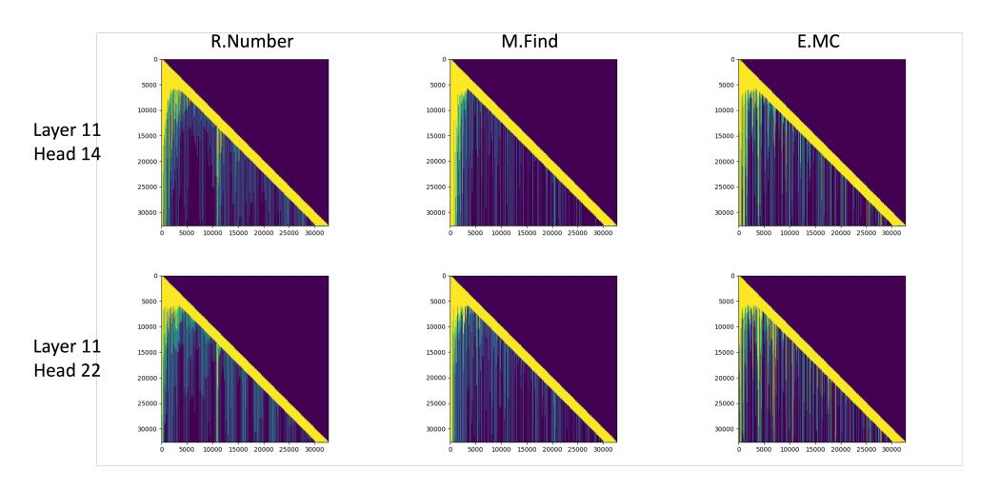

Figure 7. Head patterns across multiple tasks.

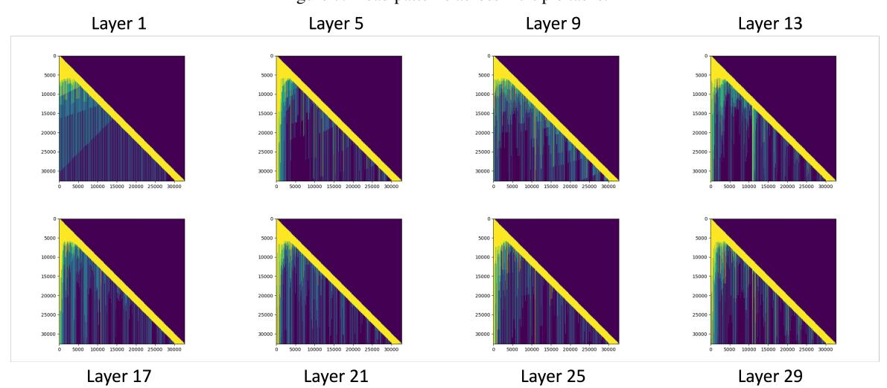

Figure 8. Layer patterns of R.Number

<span id="page-23-0"></span>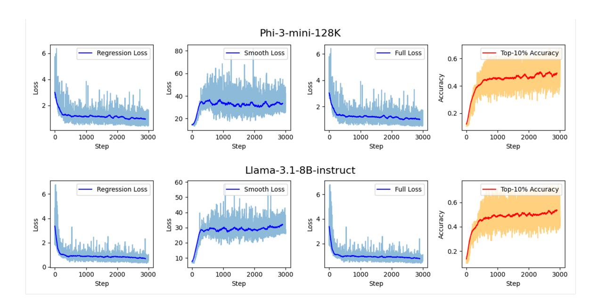

Figure 9. Training loss and accuracy during the training process.