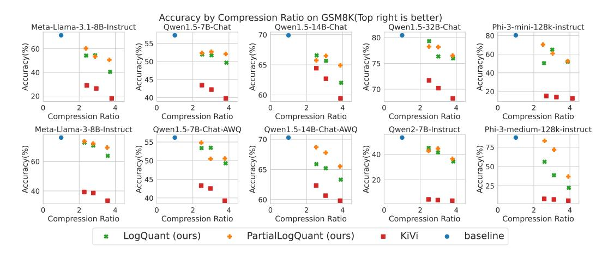
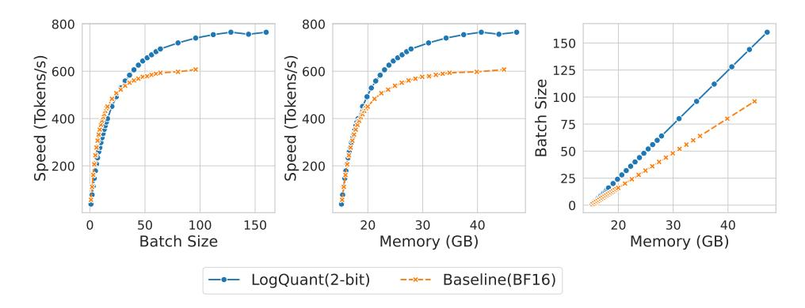

# 3.2 ACCURACY AND EFFICIENCY ANALYSIS

## 3.2.1 ACCURACY COMPARISON ON DIFFERENT PRECISION

To illustrate the impact of quantized data precision, we evaluate the accuracy loss using Llama3.1- 8B-Instruct under both 2-bit and 4-bit quantization for KiVi and LogQuant methods on LongBench. As shown in [Table 3,](#page-7-0) both methods achieve performance comparable to the baseline across all tasks with 4-bit quantization. However, 2-bit quantization results in a noticeable drop in accuracy, highlighting the trade-off between memory efficiency and performance. Notably, LogQuant demonstrates better accuracy compared to KiVi under the same conditions.

## 3.2.2 ACCURACY COMPARISON AMONG DIFFERENT CONFIGURATIONS

As discussed in Section [3.2.1,](#page-6-2) 4-bit quantization incurs only a slight accuracy loss across tasks. Therefore, we focus on 2-bit quantization in the following discussion to highlight LogQuant's performance. To further investigate the accuracy loss resulting from quantization, we compared the following methods: 1) 16-bit baseline, 2) KiVi and 3) LogQuant across different configurations, we define the *compression ratio* as:

Table 3: Accuracy of Different Precision on Llama 3.1-8B. Refer to the Table C6 for the scores of each specific task. The  $\Delta$  shows the difference to baseline.

| Category           | KiVi (2-bit)             | KiVi (4-bit)            | LogQuant (2-bit)          | LogQuant (4-bit)        | baseline |
|--------------------|--------------------------|-------------------------|---------------------------|-------------------------|----------|
|                    |                          |                         |                           |                         |          |
| Single-Document QA | $38.89 (\Delta - 8.11)$  | $47.75 (\Delta +0.75)$  | $41.91 (\Delta -5.09)$    | $47.73 (\Delta +0.73)$  | 47.71    |
| Multi-Document QA  | $34.02 (\Delta - 4.98)$  | $39.74 (\Delta + 0.74)$ | $36.08 (\Delta - 2.92)$   | $39.93 (\Delta + 0.93)$ | 39.96    |
| Summarization      | $16.10 (\Delta - 1.90)$  | 17.94 ( $\Delta$ -0.06) | $16.62 (\Delta - 1.38)$   | $17.92 (\Delta - 0.08)$ | 18.08    |
| Few-shot Learning  | $52.51 (\Delta - 8.49)$  | $61.34 (\Delta + 0.34)$ | $56.43 \ (\Delta - 4.57)$ | 61.21 ( $\Delta$ +0.21) | 61.22    |
| Synthetic Tasks    | $45.02 (\Delta -21.98)$  | $67.74 (\Delta + 0.74)$ | $52.51 (\Delta - 14.49)$  | $67.68 (\Delta + 0.68)$ | 67.78    |
| Code Completion    | $43.06 (\Delta - 15.94)$ | $59.53 (\Delta + 0.53)$ | $52.10 \ (\Delta - 6.90)$ | 59.57 ( $\Delta$ +0.57) | 59.78    |

Figure 7: Accuracy(EM) with different compression ratio in GSM8K tasks for different models.

where, for a sequence length L and reserved original precision token length R in a BF16 model with 2-bit quantization, the *compression ratio* can be expressed as:

$$\frac{16L}{2(L-R)+16R}. (5)$$

We tested the three compression ratios using GSM8K across three model families, and the results summarized in Figure 7. Our findings demonstrate that the LogQuant method consistently outperforms KiVi across all three models at various compression ratios. The results also indicate that smaller models and small KV states models, such as Phi3-mini (3.8B) and Qwen2-7B (retaining only  $\frac{1}{8}$  of KV heads than Query, while other GQA models typically retain at least  $\frac{1}{4}$ .), experience a more significant accuracy loss with 2-bit quantized KV caches. However, our method provides a notable improvement in accuracy for these smaller models.

#### 3.2.3 ACCURACY COMPARISON AMONG DIFFERENT TASKS

To further investigate the accuracy loss across various tasks, we evaluate the seven task groups listed in Table B5 and report the average score for each method in Table 4.

In the following, the task groups are abbreviated as follows: Math remains unchanged; Code refers to Code Completion; Few-shot stands for Few-shot Learning; Multi-QA represents Multi-Document QA; Single-QA denotes Single-Document QA; Summ. is short for Summarization; and Synth. stands for Synthetic Tasks.

We set the reserved length R to 128, meaning that LogQuant uses only  $3\lfloor \frac{R}{3} \rfloor = 126$  original precision tokens, which is slightly fewer than the 128 tokens reserved by KiVi. As shown in Table 4, for simpler tasks such as Summarization, quantization has little to no impact on performance compared to the 16-bit baseline. However, for more complex tasks such as Code Completion, Synthetic Tasks,

Figure 8: memory usage and throughput comparison between 2bit LogQuant and 16bit baseline under huggingface generation pipeline with llama3.1-8B and H100.

and Math, quantization significantly affects accuracy, with *LogQuant* demonstrating better retention of accuracy than KiVi.

Table 4: Task Group Average Score for Different Models with 2-bit KV Cache Quantization. (The best result of 2-bit quantization is in bold. Refer to Table D7 for the scores of each specific task in LongBench.)

| Model                    | Method          | Math  | Code  | Few-shot | Multi-QA | Single-QA | Summ. | Synth. |
|--------------------------|-----------------|-------|-------|----------|----------|-----------|-------|--------|
|                          | 16-bit Baseline | 71.42 | 59.78 | 61.21    | 39.95    | 47.71     | 18.07 | 67.78  |
| llama-3.1-8B-Instruct    | KiVi            | 18.04 | 43.06 | 52.50    | 34.01    | 38.89     | 16.10 | 45.02  |
|                          | LogQuant (ours) | 40.41 | 52.09 | 56.42    | 36.08    | 41.90     | 16.62 | 52.51  |
|                          | 16-bit Baseline | 56.18 | 52.46 | 53.88    | 33.05    | 39.26     | 17.11 | 26.50  |
| Qwen1.5-7B-Chat-AWQ      | KiVi            | 39.27 | 34.79 | 51.32    | 31.08    | 35.80     | 17.16 | 10.00  |
|                          | LogQuant (ours) | 49.28 | 40.68 | 52.54    | 32.04    | 37.22     | 17.38 | 13.50  |
|                          | 16-bit Baseline | 70.28 | 57.47 | 59.02    | 39.72    | 42.48     | 17.21 | 61.33  |
| Qwen1.5-14B-Chat-AWQ     | KiVi            | 59.82 | 37.48 | 57.50    | 37.91    | 40.39     | 17.17 | 46.85  |
|                          | LogQuant (ours) | 63.31 | 49.37 | 58.25    | 38.01    | 41.37     | 17.24 | 52.17  |
|                          | 16-bit Baseline | 52.99 | 58.23 | 61.90    | 33.35    | 44.66     | 16.33 | 43.00  |
| Qwen2-7B-Instruct        | KiVi            | 3.71  | 35.91 | 35.26    | 12.35    | 20.52     | 9.31  | 11.42  |
| _                        | LogQuant (ours) | 34.34 | 48.71 | 51.23    | 28.28    | 34.84     | 13.13 | 22.83  |
| Phi-3-mini-128k-instruct | 16-bit Baseline | 80.29 | 55.97 | 52.58    | 33.55    | 42.47     | 17.56 | 48.00  |
|                          | KiVi            | 12.59 | 33.97 | 36.17    | 18.19    | 19.58     | 9.10  | 4.83   |
|                          | LogQuant (ours) | 51.86 | 40.84 | 39.36    | 21.70    | 23.63     | 9.89  | 5.39   |

### 3.2.4 EFFICIENCY COMPARISON

To evaluate memory and throughput efficiency by a NVIDIA H100 48G MIG with the HuggingFace pipeline, we conducted a benchmark similar to that in (Turganbay, 2024), setting an average prompt length of 512 and a maximum output length of 2000. We incrementally increased the batch size while recording peak memory usage and throughput for both *LogQuant* (2-bit with 126 reserved tokens) and the BF16 baseline on the Llama-3.1-8B model, until memory usage reached the 48GB limit. The hardware utilized was a single NVIDIA H100 GPU. As shown in Figure 8, *LogQuant* achieves approximately 25% higher throughput by supporting a larger batch size. Additionally, it allows for a 60% increase in batch size within the same memory constraints under the HuggingFace pipeline.

We also observed that, within the HuggingFace pipeline, inference with a quantized cache does not immediately release original KV states, which limits memory compression and efficiency. Furthermore, the dequantization operation impacts throughput. These issues suggest that memory efficiency and speed could be further improved by employing operator fusion, enabling computation on the quantized cache directly with a fused attention operation. We will explore this optimization in future work.

