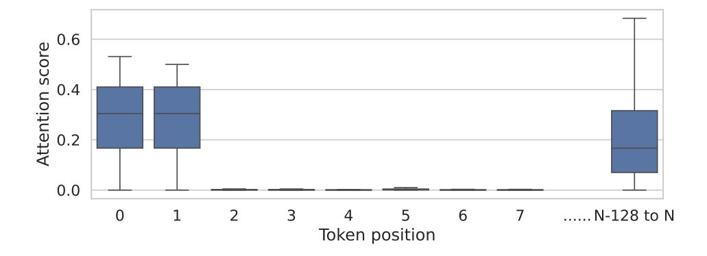

# <span id="page-0-0"></span>1 INTRODUCTION

The rapid evolution of Large Language Models (LLMs) has enabled context window expansion from 4k to 128k tokens [\(Meta, 2024;](#page-10-0) [OpenAI, 2024a\)](#page-10-1), driving demand for efficient KV cache management in applications like multi-round chatbot conversations [\(OpenAI, 2024a;](#page-10-1) [Anthropic, 2024;](#page-9-0) [DeepSeek, 2024\)](#page-9-1) and document-based question answering [\(Gao et al., 2023;](#page-10-2) [Lewis et al., 2020\)](#page-10-3), where comprehensive contextual understanding is required. Moreover, reasoning models such as OpenAI o1 [\(OpenAI, 2024b\)](#page-10-4), increased the demand for even longer reasoning contexts, xacerbated the memory challenges faced in KV cache management.

Recent studies [Zhang et al.](#page-11-0) [\(2024\)](#page-11-0); [Li et al.](#page-10-5) [\(2024\)](#page-10-5); [Dong et al.](#page-9-2) [\(2024\)](#page-9-2) reveal KV cache's linear memory growth with context length and even exceeds model weights in long context and batch

<span id="page-1-0"></span>

Figure 1: The observed log-distribution pattern is evident not only in the magnitude of attention scores but also in the positions of attention spikes. These spikes become sparser as the model attends to tokens further from the most recent position, indicating that the model not only focuses on nearby tokens. This phenomenon, illustrated here with Llama3-8B-Instruct (Dubey et al., 2024) on the GSM8K dataset (Cobbe et al., 2021), is consistent across different tasks and models, as further detailed in Section 2.

inference, posing serious deployment challenges. Existing KV Cache compression methods adopt either *eviction*, (H2O (Zhang et al., 2024), Keyformer (Adnan et al., 2024), snapKV (Li et al., 2024)), aim to reduce memory usage by selectively removing tokens deemed unimportant. or *quantization* (QAQ (Dong et al., 2024), KiVi (Liu et al., 2024c)), reduce the precision of less important tokens, retaining more data while minimizing memory costs. Both struggle with importance identification. window-based methods (KiVi, StreamingLLM (Xiao et al., 2023)) risk missing distant important tokens, while attention-based approaches (H2O, keyformer) suffer prediction errors from historical scores.

Our approach addresses these shortcomings by leveraging a key insight: the positions of the *attention spikes* (i.e. high attention scores) follow a log distribution as shown in Figure 1, resulting in sparser importance for tokens as they move further from the current position. By utilizing this property, we can outperform existing methods across a wide range of tasks. Additionally, the original absolute positions of KV cache entries can be disregarded without changing the final attention results during the decoding phase, which allows us to enhance the speed of our log-distributed quantization method.

The key contributions of this paper are as follows:

- Observation of Log-Distributed Attention Spikes: We observe that in various models and downstream tasks, the positions of high attention spikes follow a log distribution, becoming sparser as tokens move further from the current position. This insight underpins our approach to estimate token importance.
- **Design of LogQuant**: Leveraging this log-distribution observation, we introduce LogQuant, a 2-bit quantization technique that significantly improves accuracy. LogQuant outperforms existing methods like KiVi and H2O by better preserving important tokens, achieving a 40% to 200% improvement in accuracy on complex tasks such as Math and Code Completion with the same or higher compression ratio.
- **Throughput Optimization**: By ignoring the absolute positions of KV cache entries, our method further optimizes the speed of quantization/dequantization process without affecting the final attention results, resulting in a 25% increase in throughput and a 60% increase in batch size.

The remainder of the paper is organized as follows: Section 2 details the core concepts behind our proposed LogQuant methods, Section 3 present an extensive set of experiments, Section 4 summarizes our findings and discusses potential directions for future work.

<span id="page-2-3"></span>

Figure 2: The maximum attention score of each token position across four consecutive decoding steps, marking the high attention positions for illustrating the unpredictable nature of attention scores. This analysis was conducted using Llama3-8B-Instruct (Dubey et al., 2024) on the GSM8K (Cobbe et al., 2021) and OpenBookQA (Mihaylov et al., 2018) datasets.

#### <span id="page-2-0"></span>2 METHODOLOGY

In Section 2.1, we analyze the distribution of attention scores and evaluate the impact of quantization loss, both with and without sink tokens. Section 2.2 explores the distribution of token importance and introduces our log-based selection strategy. In Section 2.3, we compare the effects of quantization and eviction under this selection scheme, demonstrating the superiority of quantization over eviction. To further enhance efficiency, Section 2.4 prove that attention computation is positionagnostic. Finally, we present the implementation details of our proposed **LogQuant** method in Section 2.5.

#### <span id="page-2-1"></span>2.1 PRELIMINARY STUDY OF KV CACHE AND ATTENTION SCORES

There are two well-established observations in recent works particularly relevant to KV cache compression. First, many tokens exhibit consistently low attention scores, indicating that their KV cache entries can be safely compressed with minimal impact on performance (Liu et al., 2024c). Second, predicting token importance based on previous decoding steps is unreliable, as attention scores can vary significantly across iterations, making it difficult to accurately identify which tokens should be preserved (Dong et al., 2024; Jiang et al., 2024). This is also demonstrated in Figure 2.

Inspired by the observation of *sink tokens* (Xiao et al., 2023), which are the first few tokens that consistently receive high attention scores (Figure 3), we included these tokens in the set maintained at original precision to improve accuracy in 2-bit quantization. However, as shown in Table 1, this adjustment yielded minimal improvement. This suggests that while sink tokens play a role in defining the conversational context, maintaining high precision for only these tokens is insufficient, indicating that tokens beyond the first few are also crucial for preserving model performance.

<span id="page-2-4"></span>Table 1: Impact of retaining the first two tokens (referred to as "Sink") at original precision. The final answer accuracy results on GSM8K Cobbe et al. (2021) are presented. We present the improvement as  $\Delta_{\text{Sink}}$ . Both methods maintain the recent 128 tokens at original precision.

| Model                | baseline(BF16) | KiVi(4-bit) | KiVi(2-bit) | KiVi(2-bit)+Sink(BF16) | $\Delta_{Sink}$ |
|----------------------|----------------|-------------|-------------|------------------------|-----------------|
| Llama3.1-8B-Instruct | 71.41          | 67.24       | 18.04       | 18.49                  | +0.45           |
| Qwen1.5-7B-Chat      | 57.24          | 52.27       | 39.80       | 39.42                  | -0.38           |

#### <span id="page-2-2"></span>2.2 The Log-distributed Attention Pattern

As mentioned in Section 1, our analysis of attention heads reveals a log-distributed high-attention pattern, which motivates the development of a quantization scheme that follows this distribution. We introduce a selection scheme where a window of size 2W retains the most recent consecutive tokens

<span id="page-3-0"></span>

Figure 3: Attention distribution across different token positions, represented as boxplots based on 25% quantiles across all attention heads. The median and overall distribution of attention scores for sink tokens (Xiao et al., 2023) (tokens 0 and 1) are greater than the sum of the most recent 128 tokens. The attention scores are derived from experiments using Llama3-8B-Instruct (Dubey et al., 2024) and the GSM8K (Cobbe et al., 2021) dataset.

<span id="page-3-1"></span>

Figure 4: The attention coverage without the first two sink tokens for different selection methods (Liu et al., 2024c; Xiao et al., 2023; Zhang et al., 2024) and different models (Dubey et al., 2024; Yang et al., 2024; Abdin et al., 2024), tested on a subset of the GSM8K (Cobbe et al., 2021) dataset. Details of LogQuant will be introduced in Section 2.5.

in full precision. Following this, another window of size W/2 selects tokens spaced one token apart, and then a window of size W/4 follows the similar pattern and so on. Finally, a window of 3W tokens is reserved in full precision. This creates a log-distributed token selection scheme.

We compare this log-distributed selection to other methods: KiVi, which selects only the most recent 3W tokens; StreamingLLM, which selects the most recent 3W tokens plus the first four *sink tokens*; and H2O, which uses previous attention scores to select the top 3W tokens. To evaluate these methods, we define *token coverage* as the average attention score captured by the selection scheme:

Token Coverage = 
$$\frac{\sum_{i=1}^{3W} \text{Attention Score of Selected Tokens}}{3W}.$$
 (1)

Figure 4 presents the results, where we exclude the first two tokens for calibration, as they typically have high attention scores but contribute minimally to overall model performance (see Section 2.1).

The results demonstrate that our log-distributed selection scheme covers high-attention tokens more effectively. This suggests that filtering tokens for quantization based on this log distribution leads to better token importance preservation.

<span id="page-4-2"></span>

Figure 5: Eviction and Quantization Loss on Attention Distribution

## <span id="page-4-0"></span>2.3 COMPARISON OF QUANTIZATION AND EVICTION STRATEGIES

When implementing log-distributed token selection for KV Cache compression, two primary approaches emerge: quantization and eviction. These methods differ fundamentally in their operation. Quantization reduces the numerical precision of individual tokens, whereas eviction removes tokens entirely, thereby shortening the sequence length.

This distinction becomes critical due to the nature of the attention mechanism. The softmax function normalizes attention scores such that their sum equals 1. Consequently, removing tokens through eviction creates larger deviations from the original attention distribution compared to precision reduction via quantization. Specifically, eviction eliminates certain tokens from the attention computation entirely, while quantization retains all tokens with reduced numerical accuracy.

As demonstrated in [Figure 5,](#page-4-2) this behavioral difference is visually apparent. Quantitative results on the GSM8K dataset using Llama3.1-8B (see [Table 2\)](#page-4-3) show that eviction-based methods produce twice and higher attention errors than quantization. Based on these findings, we select quantization as the compression strategy.

<span id="page-4-3"></span>Table 2: Comparison of L1 error with original attention for eviction and quantization.

| LogQuant (2-bit) | KiVi (2-bit) | LogQuant (Eviction) | KiVi (Eviction) |
|------------------|--------------|---------------------|-----------------|
| 432.50           | 556.10       | 1076.70             | 1612.56         |

## <span id="page-4-1"></span>2.4 POSITION-AGNOSTIC ATTENTION CALCULATION

LLM inference involves two phases: prefill and decoding (Section [A\)](#page-14-0). As described in [Yuan et al.](#page-11-3) [\(2024\)](#page-11-3), the decoding phase is computationally expensive and memory-bound due to the use of the KV Cache. In the prefill phase, the model processes the input prompt in a single pass. However, during decoding, new tokens are generated one at a time, and each generation step requires access to the entire KV Cache. This leads to inefficiencies in both memory usage and execution time.

To mitigate these inefficiencies, we plan to accelerate the attention procedure. The attention operation can be expressed mathematically as follows:

$$A = \text{Softmax}(Q \cdot K^T)$$

$$O = A \cdot V,$$
(2)

where A is the attention distribution, a 1 × N vector resulting from the softmax operation applied to the product of Q and the transpose of K and O is the output, a 1×d vector calculated by multiplying the attention distribution A with the Value matrix V .

<span id="page-5-1"></span>

Figure 6: LogQuant's KV cache compression workflow. The number of reserved original-precision tokens increases from 2W to 3W. We then apply a log-sparse strategy to filter the first 2W tokens, quantize half of these tokens, and compress the reserved token length back to 2W.

Since the attention distribution A aggregates values over all N tokens, the specific ordering of tokens in the Key and Value matrices does not affect the final output. This property allows us to permute or reorder the Key and Value caches without any loss of accuracy. By leveraging this insight, we can optimize the KV Cache by concatenating high-precision tokens with quantized tokens while disregarding their original positions. This approach enhances memory locality and processing efficiency while maintaining the correctness of the attention computation. This leads to the relation:

$$A \cdot V = A_P \cdot V_P,\tag{3}$$

where P is a permutation of the indices  $\{1, \ldots, N\}$ . This enables us to optimize the KV Cache effectively.

#### <span id="page-5-0"></span>2.5 LOGQUANT: ALGORITHM AND IMPLEMENTATION

**Algorithm.** After comparing different logarithmic bases  $\log_N$ , we found that a base-2 logarithmic implementation is sufficiently effective for our purposes. To maintain logarithmic sparsity within a specified length, we adopt this base-2 logarithmic approach. We fix a window length configuration W, allowing us to retain up to 3W tokens at original precision. Each time the length limit is reached, we reduce the density of tokens in the first two windows (each of length W) by retaining tokens at regular intervals, effectively halving the density. This process reduces the number of retained tokens in the first two windows from 2W to  $\frac{2W}{2}=W$ . Subsequently, we add W new tokens, resulting in a full-precision window size of  $\frac{2W}{2}+W=2W$ . At this point, the densities become density  $W_1=\frac{1}{2}p$  and density  $W_2=p$ , where p is the initial density and  $W_i$  denotes the i-th window. By continuously adding new tokens, LogQuant naturally forms a  $\log_2$  sparsity selection within the constrained length. The detailed selection process is described in Algorithm 1. Using this approach, the length of retained full-precision tokens fluctuates between 2W and 3W, providing a more stable compression ratio compared to KiVi, where the length fluctuates between 0 and R, with R being the length of retained full-precision tokens in KiVi. We illustrate the workflow in Figure 6, which visually represents the KV cache management process, enhancing the understanding of our algorithm's implementation.

**Implementation.** Popular inference frameworks, such as Hugging Face's transformers library, have encapsulated KV Cache management into dedicated classes, which simplifies the integration of new methods. To leverage this modular design, we implemented **LogQuant** as a derived class of the Cache class in the transformers library. This approach ensures seamless compatibility with

## <span id="page-6-1"></span>Algorithm 1 Log-based Filtering Token Selection Strategy

```
1: Input: A (list of original precision tokens), a* (new token), W (window length)
2: Output: A (updated list of tokens)
3: procedure APPENDTOKEN(A, a
                                ∗
                                 , W)
4: if length(A) < 3W then
5: A ← concat(A, a*)
6: else
7: A ← concat(A[0:2W:2], A[2W:3W])
8: A ← concat(A, a*)
9: end if
10: return A
11: end procedure
```

various quantization backends, including Quanto [\(Face, 2024\)](#page-9-8) and HQQ [\(Badri & Shaji, 2023\)](#page-9-9). For our implementation, we utilized Quanto as the quantization backend, adopting the Key-per-channel strategy. Furthermore, we integrated LogQuant into Hugging Face's inference pipeline, enhancing its usability for efficient and precise inference workflows.

