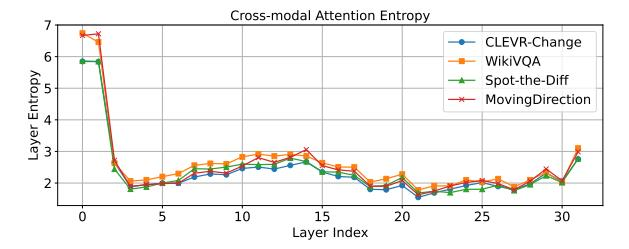
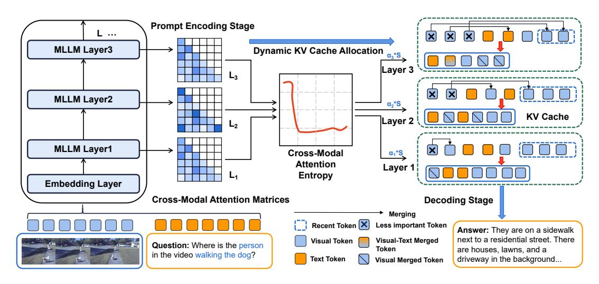

## MEDA: Dynamic KV Cache Allocation for Efficient Multimodal Long-Context Inference

Zhongwei Wan1 , Hui Shen1 , Xin Wang1 , Che Liu2 , Zheda Mai1 , Mi Zhang1

1The Ohio State University 2 Imperial College London

<https://github.com/AIoT-MLSys-Lab/MEDA>

## Abstract

Long-context Multimodal Large Language Models (MLLMs) that incorporate long textimage and text-video modalities, demand substantial resources as their multimodal Key-Value (KV) caches grow with increasing input lengths, challenging inference efficiency. Existing methods for KV cache compression, in both text-only and multimodal LLMs, have neglected attention density variations across layers, thus often adopting uniform or progressive reduction strategies for layer-wise cache allocation. In this work, we propose MEDA, a dynamic layer-wise KV cache allocation method for efficient multimodal long-context inference. As its core, MEDA utilizes cross-modal attention entropy to determine the KV cache size at each MLLMs layer. Given the dynamically allocated KV cache size at each layer, MEDA also employs a KV pair selection scheme to identify which KV pairs to select and a KV pair merging strategy that merges the selected and non-selected ones to preserve information from the entire context. MEDA achieves up to 72% KV cache memory reduction and 2.82 times faster decoding speed, while maintaining or enhancing performance on various multimodal tasks in long-context settings, including multi-images and long-video scenarios. Our code is released at [https://github.com/](https://github.com/AIoT-MLSys-Lab/MEDA) [AIoT-MLSys-Lab/MEDA](https://github.com/AIoT-MLSys-Lab/MEDA).

## 1 Introduction

Long-context Multimodal Large Language Models (MLLMs) have achieved remarkable progress in processing multimodal long context involving long text-image and text-video inputs, as exemplified by LLaVA-NeXT [\(Liu et al.,](#page-8-0) [2024c\)](#page-8-0), GPT-4V [\(Achiam et al.,](#page-8-1) [2023\)](#page-8-1) and long-video MLLMs [\(Xue et al.,](#page-9-0) [2024;](#page-9-0) [Zhang et al.,](#page-10-0) [2024b\)](#page-10-0). These models are capable of handling complex multimodal patterns within their Key-Value (KV) caches, such as text accompanied by multiple in-

Figure 1: A multimodal long-context sample from Video-ChatGPT [\(Maaz et al.,](#page-8-2) [2023\)](#page-8-2), showing key information interactions between blue-boxed video frames and textual phrases.

terrelated images or lengthy video sequences, introducing intricate cross-modal interactions, as shown in Figure [1.](#page-0-0) However, despite these advancements, long-context MLLMs demand substantial resources as their multimodal KV caches grow with increasing input lengths in long-context settings, causing significant slowdown during inference.

Conventional KV cache methods designed for text-only LLMs are difficult to be directly adopted to long-context multimodal inputs because they do not account for the complex cross-modal interactions present in long-context settings. Previous methods for KV cache compression in both text-only LLMs and MLLMs such as text-centric eviction-based methods [\(Zhang et al.,](#page-10-1) [2023;](#page-10-1) [Ren](#page-9-1) [and Zhu,](#page-9-1) [2024;](#page-9-1) [Li et al.,](#page-8-3) [2024a\)](#page-8-3), static progressive layer-wise reduction methods [\(Zhang et al.,](#page-10-2) [2024c;](#page-10-2) [Yang et al.,](#page-10-3) [2024\)](#page-10-3), and multimodal pruning methods [\(Wan et al.,](#page-9-2) [2024c\)](#page-9-2) have predominantly employed *uniform* cache size allocation across layers. However, these methods overlook the variations in attention density across different layers as illustrated in Figure [2.](#page-1-0) As a consequence, allocating a uniform KV cache size across different layers, without accounting for these variations, can not only lead to information loss in dense layers if less KV caches are allocated, resulting in reduced precision and suboptimal performance, but also cause significant inefficiency in sparse layers when more than enough KV caches are allocated.

In this paper, we propose a *dynamic* layer-wise KV cache allocation method, which we refer to as MEDA (Multimodal Attention Entropy-Guided Dynamic KV Cache Allocation), for efficient multimodal long-context inference. The key idea of MEDA is that it proposes to use cross-modal attention entropy to capture the diverse cross-modal attention patterns at different layers in MLLMs, and then dynamically allocates KV caches across layers so as to adapt to the unique layer-wise attention distributions. Moreover, given the dynamically allocated KV cache size at each layer, MEDA employs a multimodal KV pair selection scheme to identify which KV pairs to be selected at each layer. For each KV pair that is not selected, MEDA incorporates a KV pair merging strategy that merges the selected and non-selected KV pairs to preserve information from the entire context despite the reduced KV cache size. In doing so, MEDA is able to achieve efficient KV cache usage for multimodal long-context inference. It is also worthwhile to note that MEDA does not require additional fine-tuning and can be seamlessly integrated as a plug-and-play solution, offering a dynamic KV cache allocation strategy tailored for multimodal contexts.

We evaluate MEDA across various recent MLLM backbones, including LLaVA-v1.5-13B (Liu et al., 2023), LLaVA-NeXT-7B (Liu et al., 2024c), and InternVL-v1.5-7B (Chen et al., 2023) for multi-images tasks, as well as LLaVA-Video-7B/32B (Zhang et al., 2024d), LongVA-7B (Zhang et al., 2024b), and LongVILA-8B (Xue et al., 2024) for long-video tasks. We also evaluate MEDA on diverse mutlimodal long-context datasets including MileBench (Song et al., 2024), Video-ChatGPT (Maaz et al., 2023), DREAM-1K (Wang et al., 2024a), and WorldQA (Zhang et al., 2024e). Our results show that MEDA outperforms both state-of-the-art text-based and multimodal KV cache methods including H2O (Zhang et al., 2024g), SnapKV (Li et al., 2024a), PyramidKV (Zhang et al., 2024c), LOOK-M (Wan et al., 2024c), and is able to achieve up to 2.82 times faster inference speed and reduce KV cache memory footprint by up to 72%, while maintaining or improving performance on the target tasks.

#### 2 Related Work

**Post-training KV Cache Compression.** Post-training KV cache compression methods (Wan et al., 2023; Liu, 2024) fall into four categories:

Figure 2: Using the cross-modal attention entropy from Eq. 6, we analyze LLaVA-NeXT-7B (Liu et al., 2024c) across different sub-tasks (Song et al., 2024). We observe varying multimodal interaction patterns: early layers (e.g., Layer 1) exhibit dense attention weights with higher entropy, while deeper layers (e.g., Layer 24) exhibit sparse attention weights with lower entropy, given that they focus on key tokens (red columns), similar to the blue areas and text in Figure 1.

token-wise eviction, token-wise merging, static layer-wise reduction, and quantization. Tokenwise eviction (e.g., StreamingLLM (Xiao et al., 2023)) retains key tokens for sequence generation, while H2O (Zhang et al., 2024g), SnapKV (Li et al., 2024a), Parallel Comp (Xiong et al., 2025), and UNComp (Xiong et al., 2024b) focus on compact subsets, potentially sacrificing context. Tokenwise merging (e.g., CaM (Zhang et al., 2024f), D2O (Wan et al., 2024b)) re-integrates tokens to maintain context. Static layer-wise reduction (e.g., PyramidKV (Zhang et al., 2024c)) linearly reduces cache across layers but ignores inter-layer attention variations. Quantization (e.g., KIVI (Liu et al., 2024d), Gear (Kang et al., 2024)) balances memory and precision. Most methods focus on textbased KV compression, overlooking multimodal contexts. LOOK-M (Wan et al., 2024c) addresses multimodal compression but uses fixed allocation, neglecting inter-layer attention differences. MEDA introduces a multimodal attention entropy-guided dynamic allocation to address this.

Vision Token Compression for MLLMs. Classical approaches such as MobileVLM (Chu et al., 2024), LLaVA-Prumerge (Shang et al., 2024), MADTP (Cao et al., 2024), and FastV (Chen et al., 2024) focus on reducing image tokens, which dominate the total token count, to accelerate inference by removing redundancies. MobileVLM (Chu et al.,

2024) uses a lightweight projector with average pooling to compress visual tokens, while LLaVA-Prumerge (Shang et al., 2024) and MADTP (Cao et al., 2024) adopt adaptive strategies to reduce tokens while preserving performance. FastV (Chen et al., 2024) offers a plug-and-play solution that optimizes early layer computations and prunes visual tokens in later layers. In contrast, MEDA focuses on multimodal KV cache compression through a dynamic layer-wise allocation strategy, eliminating the need for additional fine-tuning and enhance the efficiency of multimodal long-context generative inference.

**Long-context MLLMs.** Recent works have expanded MLLMs' multimodal long-context capabilities through additional training. Liu et al. (2024b) leverage Blockwise RingAttention for scalable long-sequence training. LongVA (Zhang et al., 2024b) first pre-trains LLMs on long-text sequences and then aligns Long LLMs using short vision data to generalize to multimodal long-text contexts. LongLLaVA (Wang et al., 2024b) modifies the model architecture by integrating Mamba and Transformer blocks and employs a progressive training strategy using multiple images. Video-XL (Shu et al., 2024) introduces visual context latent summarization to train models for handling even longer multimodal token sequences. In contrast, MEDA introduces a dynamic KV cache optimization algorithm, enhancing long-context multimodal inference without additional training and is compatible with these methods.

#### 3 MEDA

## 3.1 Background on Generative Inference with Multimodal Context

Standard generative inference process of MLLMs involves two stages: (i) multimodal long-context prompt encoding, and (ii) decoding with multimodal KV cache.

Multimodal Long-Context Prompt Encoding. In the prompt encoding stage, a sequence of prompts comprising text, images, or videos is used to construct the Key-Value (KV) cache for each transformer layer in MLLMs. Specifically, let  $\mathbf{X} \in \mathbb{R}^{L_{\text{prompt}} \times D}$  denote the input prompt tensor, where  $L_{\text{prompt}}$  is the total length of the prompt sequence and D is the hidden dimension of the model. The input prompt tensor can be expressed as:  $\mathbf{X} = \{\mathbf{X}_1^T, \mathbf{X}_1^I, \dots, \mathbf{X}_N^T, \mathbf{X}_M^I\}$  or  $\mathbf{X} = \{\mathbf{X}_1^T, \mathbf{X}_2^T, \dots, \mathbf{X}_p^V, \mathbf{X}_q^V\}$  where  $\mathbf{X}_n^T, \mathbf{X}_m^I$ 

and  $\mathbf{X}_q^V$  represent the embeddings for the n-th text token, m-th image token, and q-th video token, respectively. In the text-multi-images setting, embeddings from different modalities are often interleaved in the input sequence. In the long-video setting, the number of video embeddings can become large due to the large number of input video frames, leading to a significant increase in decoding length. For simplicity, we omit indices for attention heads and layers. The key and value tensors are computed as:

$$\mathbf{K} = \mathbf{X}\mathbf{W}_K, \quad \mathbf{V} = \mathbf{X}\mathbf{W}_V, \tag{1}$$

where  $\mathbf{W}_K, \mathbf{W}_V \in \mathbb{R}^{D \times D}$  are the key and value projection matrices. The computed  $\mathbf{K}$  and  $\mathbf{V}$  are stored in the KV cache to facilitate subsequent token generation.

**Decoding with Multimodal KV Cache**. In the decoding stage, the KV cache is utilized and updated to generate tokens sequentially. At each time step t, the keys and values for the new token  $\mathbf{x}_t$  are computed, while the keys and values for previous tokens  $\mathbf{x} < t$  are retrieved from the cache. Denoting concatenation by  $[\cdot]$ , the KV cache is updated as:

$$\mathbf{K} = [\mathbf{K}, \mathbf{x}_t \mathbf{W}_K], \quad \mathbf{V} = [\mathbf{V}, \mathbf{x}_t \mathbf{W}_V]. \tag{2}$$

The output for the newly generated token is then computed as:

$$\mathbf{x}_{t,out} = \operatorname{Softmax}\left(\mathbf{q}_t \mathbf{K}^{\top} / \sqrt{D}\right) \mathbf{V}, \mathbf{q}_t = \mathbf{x}_t \mathbf{W}_Q,$$
 (3)

where  $\mathbf{W}_Q \in \mathbb{R}^{D \times D}$  is the query projection.

Challenge. The inclusion of multimodal long-context inputs and complex interactions between multimodal tokens (text, images, videos) significantly increases the size and complexity of the KV cache. Unlike text-only models, multimodal scenarios involve intricate cross-modal interactions between tokens, which pose new challenges for compressing the KV cache in long-context settings.

## 3.2 Cross-Modal Attention Entropy for Dynamic KV Cache Allocation

Cross-modal interactions in MLLMs create diverse attention patterns across MLLMs layers, and ignoring these variations leads to inefficient cache usage and degraded performance. Thus, designing a multimodal dynamic KV cache allocation strategy that adapts to layer-wise attention distribution is crucial for efficient KV cache management. To capture the attention distribution characteristics across different layers, we introduce the concept

Figure 3: Illustration of MEDA's multimodal attention entropy-guided dynamic KV cache allocation and merging strategy.

of **cross-modal attention entropy**. Attention entropy (De Boer et al., 2005; Zhai et al., 2023) quantifies the uncertainty or dispersion of the attention weights, providing insights into how focused or diffused the model's attention is at each layer.

As illustrated in Figure 3, for each layer l in the MLLMs, we compute the **cross-modal attention matrices** between text and visual tokens. Specifically, the attention from text to vision  $(\mathbf{A}_{\text{TV}}^{l})$  and from vision to text  $(\mathbf{A}_{\text{VT}}^{l})$  are calculated as:

$$\mathbf{A}_{\mathrm{TV}}^{l} = \operatorname{Softmax}\left(\mathbf{Q}_{T}^{l}\left(\mathbf{K}_{V}^{l}\right)^{\top} / \sqrt{D}\right),$$

$$\mathbf{A}_{\mathrm{VT}}^{l} = \operatorname{Softmax}\left(\mathbf{Q}_{V}^{l}\left(\mathbf{K}_{T}^{l}\right)^{\top} / \sqrt{D}\right),$$
(4)

where  $\mathbf{Q}_T^l \in \mathbb{R}^{n_T \times d}$  and  $\mathbf{K}_T^l \in \mathbb{R}^{n_T \times D}$  are the query and key matrices for text tokens,  $\mathbf{Q}_V^l \in \mathbb{R}^{n_V \times D}$  and  $\mathbf{K}_V^l \in \mathbb{R}^{n_V \times D}$  represent the query and key matrices for visual tokens, which are derived from the original  $\mathbf{Q}$  and  $\mathbf{K}$  based on the modality index,  $n_T$  and  $n_V$  are the numbers of text and visual tokens, and D is the dimensionality of the embeddings. We define the attention entropy of a row i of  $\mathbf{A}$  by  $\mathbf{E}(\mathbf{A}_i) = -\sum_{j=1}^T \mathbf{A}_{[i,j]} \log{(\mathbf{A}[i,j])}.$  Let  $\mathbf{E}(A) = \frac{1}{T}\sum_{i=1}^T \mathrm{Ent}\left(A_i\right)$  denote the attention entropy of  $\mathbf{A}$ , T is the number of tokens and  $\mathbf{A}$  is average attention across multi-heads for each layer. The cross-modal attention entropy  $\mathbf{E}_{CM}^l$  for layer l is then computed as:

$$\begin{split} \mathbf{E}_{TV}^{l} &= \frac{1}{|T|} \sum_{i=1}^{n_{T}} \sum_{j=1}^{n_{V}} \mathbf{A}_{\text{TV}}^{l}[i, j] \log \mathbf{A}_{\text{TV}}^{l}[i, j], \\ \mathbf{E}_{VT}^{l} &= \frac{1}{|V|} \sum_{i=1}^{n_{T}} \sum_{j=1}^{n_{V}} \mathbf{A}_{\text{VT}}^{l}[i, j] \log \mathbf{A}_{\text{VT}}^{l}[i, j], \end{split} \tag{5}$$

$$\mathbf{E}_{CM}^{l} = -(\mathbf{E}_{TV}^{l} + \mathbf{E}_{VT}^{l}),\tag{6}$$

where |T|, |V| denotes the number of text and visual tokens respectively. This entropy measures the uncertainty in the cross-modal attention distributions between text and visual tokens. A lower entropy indicates that the attention is more concentrated on specific cross-modal token pairs, suggesting that the layer is focusing on some more important multimodal interactions. Therefore, using the computed cross-modal attention entropy, we propose an inverse entropy softmax allocation strategy to determine the proportion  $\alpha_l$  of the total KV cache size S allocated to layer l:

$$S_{l} = \alpha_{l} \cdot S, \ \alpha_{l} = \frac{\exp\left(\mathbf{E}_{\mathrm{CM}}^{l}\right)}{\sum_{k=1}^{L} \exp\left(\mathbf{E}_{\mathrm{CM}}^{k}\right)} \cdot L \cdot \rho, \tag{7}$$

where the attention entropy-guided dynamic allocated KV cache size for layer l is  $S_l$ , L is the total number of layers in the model, and  $\rho \in (0,1]$  is the compression ratio representing the fraction of the original cache size to retain. The allocation strategy ensures that layers with *lower* cross-modal attention entropy receive a *smaller* portion of the KV cache, effectively preserving critical cross-modal information. Layers with *higher* cross-modal attention entropy, indicating more diffused attention, receive *larger* cache allocation. Such dynamic layer-wise KV cache allocation strategy optimizes memory usage. Details of  $\alpha_l$  are described in A.3.

