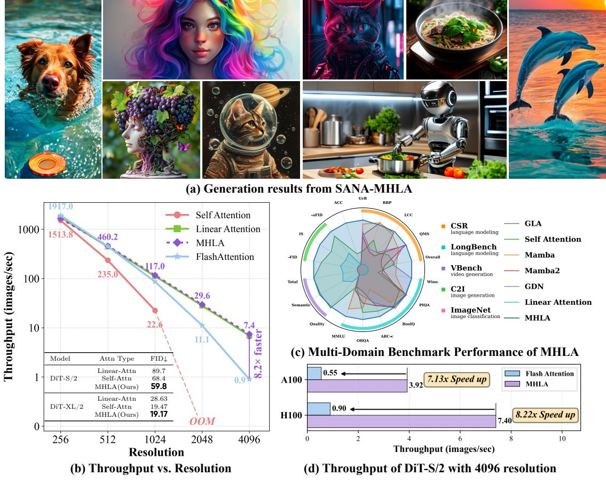

# **1 Introduction**

Self-attention is the core module for the recent dominant model architecture, Transformer, for both computer vision [\[18\]](#page-11-0), natural language processing [\[49\]](#page-13-0), and generative tasks [\[41\]](#page-13-1). However, its quadratic time and memory complexity severely limit its scalability to long sequence tasks such as high-resolution image generative and video generation tasks [\[31,](#page-12-0) [59,](#page-13-2) [60\]](#page-13-3).

To address the efficiency issue, a growing line of research [\[9,](#page-11-1) [30\]](#page-12-1) has developed linear attention mechanisms that replace the softmax kernel with associative feature maps. These approaches reduce the computational and memory complexity of attention from quadratic to linear by compressing all keys and values into a global summary. Although this improves efficiency, it eliminates one of the key advantages of softmax attention—its ability to adapt to each query individually. Consequently, linear attention often experiences notable accuracy degradation, particularly in long-sequence modeling tasks.

Recent works [\[22,](#page-12-2) [24,](#page-12-3) [25\]](#page-12-4) have sought to mitigate the performance degradation of linear attention by integrating components such as depthwise convolutions and gating modules. However, this reliance on external modules introduces additional computational overhead and continues to suffer from performance degradation as

Figure 1 (a) Generation results from our fine-tuned SANA model using MHLA. (b) Performance and efficiency comparison between the proposed MHLA and baselines. The throughput was tested on the NVIDIA H100 Tensor Core GPU. Following the previous method, we report the FID in the table at a resolution of  $256 \times 256$ . (c) Multi-domain performance of MHLA. We evaluate MHLA across diverse domains, demonstrating its strong and universal performance. (d) Throughput of DiT-S/2 at 4096 resolution across different devices. All improvements are solely due to MHLA, and can be further combined with orthogonal techniques for even greater speedups.

sequence length increases. In this paper, we present a solution to the performance bottleneck in linear attention that requires no additional depthwise convolution or self-attention modules. Our key insight is that, in conventional linear attention design, all tokens are compressed into a single global key-value summary (KV summary) that is shared by every query. This design could have reduced the model's representation capacity, as illustrated in Figs. 1b and 2. To evaluate diversity, we compare the rank of the attention weight matrices across different models. We find that using a shared global KV summary limits the model's capacity to represent rich interactions, effectively capping it at a fixed rank. As sequences grow longer, this constraint tends to push the attention weights toward a more uniform distribution. In practice, this reduces diversity and degrades performance on tasks where queries must concentrate on a small subset of relevant tokens.

Our design goal is therefore simple: restore query-dependent diversity, the ability for different queries to retrieve different contexts, without sacrificing linear-time behavior or introducing heavy auxiliary modules.

Thus, we introduce Multi-head Linear Attention (MHLA) to achieve the aforementioned characteristics. Specifically, MHLA partitions tokens into non-overlapping blocks ("heads" in the spatial dimension), computes local key-value summaries, and lets each query block compute a query-conditioned mixture over these summaries to retrieve a tailored context; within the selected blocks, token contributions are further refined by a query-dependent reweighting module. Thanks to the simplicity of MHLA, the implementation only relies on standard GEMMs, keeping the overall computational overhead negligible with O(N) complexity, retaining compatibility with streaming/stateful execution. It was clearly observed that adding MHLA raise the rank

Figure 2 Comparison between the proposed MHLA and other linear attentions. MHLA divides multiple heads on the token dimension. Through Multi-Head Mixing, MHLA restores query-conditioned selectivity by mixing KV summaries with query-specific weight, improving token-level diversity while keeping linear complexity.

of the attention weights matrix significantly, as shown in Fig. 3b. The difference between previous linear attentions and MHLA is briefly illustrated in Fig. 2.

We validate MHLA on image classification, image generation, natural language processing, and video generation tasks. Experiments show that MHLA consistently outperforms existing linear attention baselines with negligible computational overhead. Our main contributions are summarized as follows:

- We conduct an in-depth analysis of linear attention and identify one of the root causes of its performance degradation: the absence of grouping along the token dimension during similarity calculation. This limitation can be quantified by examining the rank of the attention matrix.
- We propose a new formulation of linear attention that achieves state-of-the-art performance on both discriminative and generative tasks, while maintaining O(N) computational complexity and avoiding reliance on additional modules.
- We conduct extensive experiments across various tasks, achieving state-of-the-art performance. On ImageNet, MHLA delivers a 3.6% accuracy gain over self-attention, while on image generation tasks it improves the performance of the DiT architecture by 12.6%. MHLA also achieves a 6.3% improvement on natural language processing tasks and provides a substantial 41% improvement compared to vanilla linear attention in video generation tasks.

#### 2 Related Works

Transformers [49] have advanced various fields [17, 18, 42], but their quadratic time and memory complexity due to self-attention limit scalability, especially for long sequences. To overcome this, linear attention mechanisms [9, 30] have been proposed, which replace softmax with kernel-based methods to achieve linear time complexity. While these mechanisms improve the efficiency, they often lose expressiveness, making them suffer from a performance drop in capturing complex token interactions. Several solutions [22, 24], including adding convolutional layers or gating mechanisms, have attempted to recover performance but tend to introduce additional computational costs. See the detailed related works in the Appendix A.

