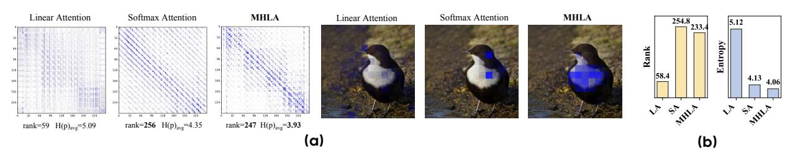
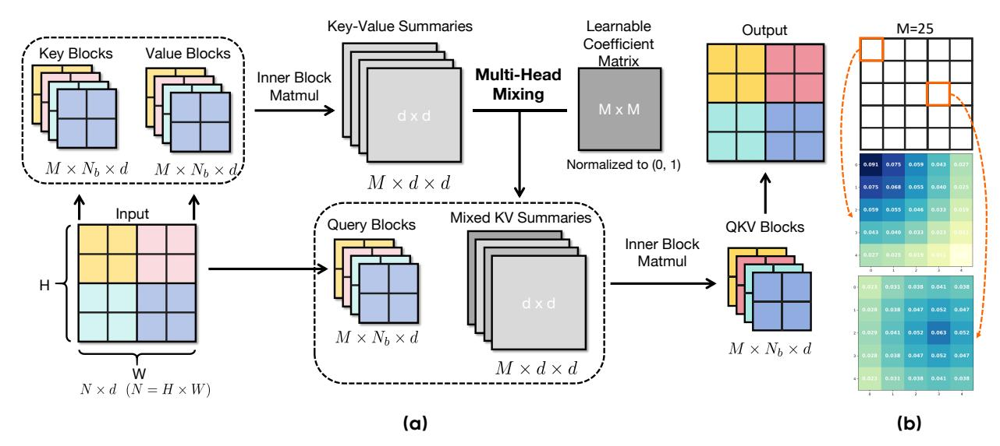

# 3 Analysis of Linear Attention

#### 3.1 Preliminary

We first formulate the calculation of the attention weights for both self-attention and linear attention mechanism. Given an input token sequence  $X \in \mathbb{R}^{N \times d}$ , we first compute queries, keys, and values via  $Q = XW_Q$ ,  $K = XW_K$ ,  $V = XW_V$ , where  $W_Q, W_K, W_V \in \mathbb{R}^{d \times d}$  are learnable projections. The attention output of the token i can be expressed as:

$$Y_{i} = \frac{\sum_{j=1}^{N} \operatorname{Sim}(Q_{i}, K_{j}) V_{j}}{\sum_{m=1}^{N} \operatorname{Sim}(Q_{i}, K_{m})},$$
(1)

where  $\operatorname{Sim}(\cdot,\cdot)$  calculates the similarity between the input matrix. In softmax attention [49],  $\operatorname{Sim}(Q_i,K_j) = \exp(Q_iK_j^{\top}/\sqrt{d})$ , all pairwise similarities need to be calculated and normalized per query, resulting in  $O(N^2)$  complexity.

Linear attention replaces the exponential kernel with a positive feature map  $\phi(\cdot)$  such that

$$\operatorname{Sim}(Q_i, K_j) \approx \phi(Q_i)\phi(K_j)^{\top}, \qquad Y_i = \frac{\phi(Q_i)\left(\sum_{j=1}^N \phi(K_j)^{\top} V_j\right)}{\phi(Q_i)\left(\sum_{m=1}^N \phi(K_m)^{\top}\right)}, \tag{2}$$

where the numerator and denominator can be precomputed as a global key-value summary  $G = \sum_j \phi(K_j)^\top V_j$  and normalizer  $z = \sum_m \phi(K_m)^\top$ , respectively. This reduces the complexity from  $O(N^2)$  to  $O(Nd_\phi)$ , enabling linear-time scaling with sequence length.

### 3.2 Global Context Collapse

Linear attention achieves linear-time complexity by reusing a global key–value summary across all queries, which can be formulated as  $G = \sum_{j=1}^N \phi(K_j)^\top V_j \in \mathbb{R}^{d \times d}$ . But this fixed-size design introduces an intrinsic information bottleneck:

#### Observation

As the sequence length N increases, the information requiring representation exceeds the capacity of the fixed-size  $d \times d$  matrix, leading to performance saturation. We term this phenomenon global context collapse.

This observation can be quantified using two complementary metrics, which are the rank and the sparsity of the attention matrix:

Rank limitation. The rank of the attention matrix has been widely studied as a key indicator of feature diversity and representational capacity in attention mechanisms [3, 22, 24]. Specifically, with  $\widetilde{Q} = \phi(Q)$  and  $\widetilde{K} = \phi(K)$ , global linear attention produces

$$A_{\text{lin}} = \widetilde{Q} \, \widetilde{K}^{\top} \in \mathbb{R}^{n \times n}, \qquad \text{rank}(A_{\text{lin}}) \leq \min\{ \text{rank}(\widetilde{Q}), \text{rank}(\widetilde{K}) \} \leq d.$$

#### Conclusion 1

Regardless of N, the representational capacity of  $A_{\text{lin}}$  is strictly bounded by d. Although several prior studies have attempted to increase the rank of Key–Value summaries [5, 22], this bound results in a severely rank-deficient approximation of the full  $n \times n$  attention matrix when  $n \gg d$ , constraining the model's ability to capture diverse, query-conditioned attention patterns.

We empirically verify this effect in Fig. 3b, which shows that the rank of attention scores in linear-attention-based models is consistently capped by the head dimension (typically  $d_h \leq 72$ ), and the relative expressivity of the attention map degrades as the sequence length increases.

Loss of sparsity. The sparsity of the attention matrix is a critical factor influencing the performance of attention mechanisms. Sparse distributions generally exhibit lower entropy, concentrating probability mass on a smaller set of informative tokens [15, 57], which benefits model optimization. Linear attention, however, computes scores by first compressing all key-value pairs into a single global summary, and each query interacts with this shared representation only once. In contrast, softmax attention leverages the exponential function to enable each query  $q_i$  to produce a distinct distribution over tokens (see Appendix B). Because linear attention relies on the same aggregated representation for all queries, it cannot reweight individual keys according to query-specific relevance.

#### Conclusion 2

As the sequence length N increases, the contribution of each token becomes negligible. Consequently, the attention weight distribution approaches uniformity, reducing the sparsity and impairing the model's ability to selectively emphasize informative tokens.

To quantify this effect, we compute the average entropy of the attention scores over 500 random samples for each attention variant. For each row of the attention score matrix, lower entropy indicates that the distribution is closer to a one-hot vector, reflecting stronger concentration on a single token. As shown in Fig. 3a and Fig. 3b, linear attention exhibits significantly higher entropy, confirming its lack of focus compared to softmax-based attention.

Figure 3 (a) Visualization of attention score and attention maps of MHLA and baselines. (b) Average rank and entropy of attention scores for DeiT-T, showing MHLA yields richer and more focused attention.

Taken together, these findings reveal that the reliance on a single global key-value summary in linear attention leads to a severe collapse in representational capacity, manifested as both rank deficiency and elevated entropy in the attention map. We refer to this phenomenon as *global context collapse*. Fig. 3a visualizes attention scores and maps, clearly illustrating the inability of linear attention to capture fine-grained information. This observation motivates the development of methods that restore query-conditioned token-level diversity while preserving the linear-time complexity of the attention mechanism, which was detailed in the next section.

### **4 Multi-Head Linear Attention**

#### 4.1 Overview

Here we formalize the proposed **Multi-Head Linear Attention (MHLA)**. As shown in Fig. 4a. MHLA operates by splitting the sequence along the token dimension into multiple "heads" and running linear attention in parallel across these "heads". Let the input sequence be  $X \in \mathbb{R}^{N \times d}$ , projected to queries, keys, and values:  $Q = XW_Q$ ,  $K = XW_K$ ,  $V = XW_V$ , with  $Q, K, V \in \mathbb{R}^{N \times d}$ . For efficiency, we adopt a kernelized formulation, denoting  $\widetilde{Q} = \phi(Q)$ ,  $\widetilde{K} = \phi(K)$  for a chosen feature map  $\phi(\cdot)$ .

Standard linear attention aggregates all tokens into a single global  $d \times d$  summary shared by every query, which reduces expressivity by collapsing token-level diversity. To mitigate this, we split the sequence into M non-overlapping blocks (the MHLA "heads"), with block b containing  $N_b$  tokens and  $\sum_{b=1}^{M} N_b = N$ . In practice on vision models, blocks are defined on spatial (2D) or spatiotemporal (3D) grids rather than by flattening to 1D. For each block b we compute a local key-value summary and its normalizer:

$$S_b = \sum_{j \in b} \widetilde{K}_j V_j^{\top} \in \mathbb{R}^{d \times d}, \qquad z_b = \sum_{j \in b} \widetilde{K}_j \in \mathbb{R}^d.$$
 (3)

To restore query adaptivity, **MHLA** constructs a distinct mixture of all key-value summaries for each query block i through Multi-Head Mixing. Queries in block i can then attend to this mixture, where different key-value summaries are weighted according to the attention preferences of the current query block. Let  $m_i \in \mathbb{R}^M$  denote the nonnegative, learnable mixing coefficients for block i, which are optimized during training. The mixed summaries are then defined as  $\widetilde{S}_i = \sum_{b=1}^M m_{i,b} S_b$ , and the corresponding normalizer is  $\widetilde{z}_i = \sum_{b=1}^M m_{i,b} z_b$ .

**Figure 4** (a) **Overview of the proposed Multi-Head Linear Attention.** (b) We visualize two rows of the initialized Learnable Coefficient Matrix corresponding to *Block* 1 and *Block* 14 separately when M is 25. We reshape the two rows and the M dimension in 2D for better understanding.

The process can be done with a highly hardware-efficient GEMM operation between key-value summaries and coefficient matrix  $\mathcal{M}_c \in \mathbb{R}^{M \times M}$  consisting of  $m_i$ . Given a query vector  $\widetilde{q} \in \mathbb{R}^d$  from block i, the output is

$$o = \frac{\widetilde{q}^{\top} \widetilde{S}_i}{\widetilde{q}^{\top} \widetilde{z}_i} = \frac{\sum_{b=1}^{M} m_{i,b} \, \widetilde{q}^{\top} S_b}{\sum_{b=1}^{M} m_{i,b} \, \widetilde{q}^{\top} z_b}. \tag{4}$$

Each output element can thus be interpreted as a query-specific, block-dependent recombination of the entire value sequence. In tasks like language modeling and video generation, the normalizer term can be omitted for better training stability [39] when the sequence is getting longer.

### 4.2 Multi-Head Mixing

The core of MHLA's adaptivity is a learned coefficient matrix  $\mathcal{M}_c \in \mathbb{R}^{M \times M}$ . The element at position (i, j) denotes the affinity between query-block i and the local key-value summary of block j. Equivalently, the i-th row of  $\mathcal{M}_c$ , denoted  $m_i$ , specifies how query-block i linearly combines the M local summaries into a query-specific global summary.

Each row  $m_i$  is produced and learned end-to-end; in practice we enforce nonnegativity and normalization. Because blocks are defined along spatial or spatiotemporal axes, we initialize  $\mathcal{M}_c$  to favor locality: for row i we set initial coefficients as  $m_{i,j}^{(0)} \propto 1 - \operatorname{dist}(i,j)/\max_k(\operatorname{dist}(i,k))$ , where  $\operatorname{dist}(i,j)$  measures the Euclidean distance and  $\max_k \operatorname{dist}(i,k)$  is the maximum distance from i to any position k. The coefficients are then normalized such that  $\sum_j m_{i,j}^{(0)} = 1$ . A visualization of this initialization can be found in Fig. 4b. This locality-biased initialization produces more stable and faster convergence while leaving  $\mathcal{M}_c$  free to adapt during training. To further ensure stability, we clip the coefficients to the interval (0, 1) on every update.

The token-level effect of the Multi-Head Mixing is transparent. Let b(t) denote the block index of token t. Writing each local summary as a sum over its tokens,  $G_j = \sum_{t \in \text{block } j} \widetilde{K}_t V_t^{\top}$ , the mixture for query-block i expands to

$$\widetilde{S}_i = \sum_{j=1}^M m_{i,j} S_j = \sum_{t=1}^N m_{i,b(t)} \widetilde{K}_t V_t^\top \in \mathbb{R}^{d \times d}.$$

For a query vector  $\tilde{q} = \phi(q)$  (from block i), the numerator of the kernelized update becomes

$$\widetilde{q}^{\top}\widetilde{S}_{i} = \sum_{t=1}^{N} m_{i,b(t)} (\widetilde{q}^{\top}\widetilde{K}_{t}) V_{t}^{\top} \in \mathbb{R}^{d}.$$

$$(5)$$

Eq. 5 makes the mechanism transparent: each query-block rescales the contribution of entire blocks via  $m_i$ , and within each block the usual kernel inner product  $\tilde{q}^{\top}\tilde{K}_t$  differentiates tokens. Thus, MHLA restores query-conditioned, token-level weighting in a two-stage manner (block selection × intra-block reweighting). Importantly, all operations reduce to blockwise summary computation and linear combinations of M matrices of size  $d \times d$ , so asymptotic complexity remains linear in N while expressive capacity is substantially increased.

Chunkwise parallel form of MHLA. Linear attention commonly employs chunkwise parallel training [29, 46] to maintain linear-time complexity under causal masking, by partitioning the sequence into blocks and updating a running summary per block. MHLA naturally fits this setting: each head can be directly mapped to a chunk, and we maintain one local summary  $S_b$  per chunk. At training time, we aggregate these local summaries using the learned mixture coefficients  $m_{i,b}$  to form the mixed prefix summary  $\tilde{S}_i = \sum_{b \leq i} m_{i,b} S_b$ , which is then used for block-level attention. Because mixture computation is performed once per block and reused for all queries in that block, the overall complexity remains identical to chunkwise linear attention. For a detailed derivation and the corresponding inference procedure, see Appendix C.

### 4.3 Analysis of Multi-Head Linear Attention

Rank analysis. Partition the sequence into M non-overlapping blocks of size  $N_b$ . Let the query matrix be  $\widetilde{Q} = [\widetilde{Q}_1^\top, \dots, \widetilde{Q}_M^\top]^\top$  with  $\widetilde{Q}_b \in \mathbb{R}^{n_b \times d}$ . From Eq. 5, in the calculation of attention score, the mixed key sequence seen by query-block i can be expressed as

$$Y_i = [m_{i,b(1)}k_1, m_{i,b(2)}k_2, \dots, m_{i,b(n)}k_n] \in \mathbb{R}^{d \times n},$$

where  $m_{i,b(t)}$  is the mixing coefficient selecting the block of token t. The attention submatrix contributed by query-block i is  $A_i = \widetilde{Q}_i Y_i \in \mathbb{R}^{N_b \times N}$ , and the full attention matrix is  $A_{\text{MHLA}} = \begin{bmatrix} A_1 \ A_2 \ \cdots \ A_M \end{bmatrix}^{\top} \in \mathbb{R}^{n \times n}$ . Then applying standard rank inequalities gives

$$\operatorname{rank}(A_b) \leq \min\{\operatorname{rank}(\widetilde{Q}_b), \operatorname{rank}(Y_b)\} \leq \min(n_b, d),$$

which yields the global bound  $\operatorname{rank}(A_{\mathrm{MHLA}}) \leq \min(n, \sum_{b=1}^{M} \min(n_b, d)).$ 

This upper bound is attainable under mild, generic conditions: if each block product  $\widetilde{Q}_b Y_b$  has full row rank  $r_b = \min(n_b, d)$  and the row spaces of  $\{\widetilde{Q}_b Y_b\}_{b=1}^M$  are linearly independent, then we get  $\mathrm{rank}(A_{\mathrm{MHLA}}) = \min(n, \sum_{b=1}^M r_b)$ . Even when the independence assumption is not fully satisfied, the blockwise mixture still expands the diversity of the row spaces, causing  $\mathrm{rank}(A_{\mathrm{MHLA}})$  to grow roughly additively with M. We empirically validate this behavior in Fig. 3b, where MHLA consistently achieves a substantially higher attention-score rank than other linear attention variants— and does so without relying on auxiliary components such as depth-wise convolutions. This confirms that MHLA natively restores much of the representational capacity lost in global linear attention, whose rank remains strictly limited by d regardless of the sequence length N.

Sparsity analysis. The learned coefficient matrix  $\mathcal{M}_c$  allows each query-block to assign higher weights to a subset of blocks that are more relevant, effectively pruning irrelevant tokens at the block level. Within each selected block, the kernel inner products  $\tilde{q}^{\top}\tilde{K}_t$  further differentiate token contributions, leading to sharper and more concentrated attention distributions. We validate this effect empirically in Fig. 3b, where MHLA consistently yields lower attention entropy compared to other linear-attention baselines and even the softmax attention. This confirms that MHLA preserves query-conditioned selectivity and achieves substantially higher sparsity, enabling the model to attend to a small, semantically relevant subset of tokens rather than spreading attention uniformly.

**Table 1 Comparison between Self Attention, Linear Attention, and MHLA.** We report computation complexity, maximum achievable rank, memory complexity and query-conditioned selectivity.

| Method           | Time Complexity    | Rank Bound                    | Memory Complexity | Query-Conditioned |
|------------------|--------------------|-------------------------------|-------------------|-------------------|
| Self Attention   | $O(N^2d)$          | N                             | $O(N^2)$          | ✓                 |
| Linear Attention | $O(Nd^2)$          | d                             | $O(d^2)$          | X                 |
| MHLA (ours)      | $O(Nd^2 + M^2d^2)$ | $\sum_{b=1}^{M} \min(n_b, d)$ | $O(Md^2)$         | ✓                 |

**Table 2 Comparison on Image Classification task.** MHLA achieves the best accuracy with minimal parameter overhead on DeiT models, and outperforms **Transformer-**, **LA-**, and **Mamba-**based SOTAs. Results marked with an \* are reproduced under the same training setup as MHLA-VLT.

(a) Comparison of different attentions on DeiT.

**(b)** Comparison with SOTA models on ImageNet-1K.

| Attention Type               | Params   | FLOPs      | Top1-ACC | Cost                 | Model            | Params | FLOPs | Top1-ACC |
|------------------------------|----------|------------|----------|----------------------|------------------|--------|-------|----------|
| Comparison on Deit-T Setting |          |            |          | FL-PVT-T [24]        | 12M              | 2.0G   | 77.8  |          |
| Self Attn                    | 5.7M     | 1.1G       | 72.2     |                      | FL-PVTv2-B1 [24] | 13M    | 2.2G  | 79.5     |
| Linear Attn                  | 5.7M     | 1.1G       | 69.8     | 5G                   | MSVMamba-M [45]  | 12M    | 1.5G  | 79.8     |
| Focused LA [24]              | 6.1M     | 1.1G       | 74.1     | 2.5                  | NAT-M [26]       | 20M    | 2.7G  | 81.8     |
| Inline Attn [25]             | 6.5M     | 1.1G       | 74.5     | (                    | RAVLT-T [22]     | 15M    | 2.4G  | 82.3*    |
| MALA [21]                    | 6.3M     | 1.1G       | 75.1     |                      | MAViT-T [21]     | 16M    | 2.5G  | 82.4*    |
| MHLA (Ours)                  | 5.7M     | 1.1G       | 75.8     |                      | MHLA-VLT-T       | 16M    | 2.4G  | 82.6     |
| Comparis                     | son on D | eit-S Sett | ing      |                      | FAT-B3 [20]      | 29M    | 4.4G  | 83.6     |
| Self Attn                    | 22M      | 4.2G       | 79.8     | 7 h                  | Vmamba-T [32]    | 30M    | 4.9G  | 82.6     |
| Linear Attn                  | 22M      | 4.2G       | 77.6     | ~4.5G                | MV-T [27]        | 32M    | 4.4G  | 82.3     |
| RALA [22]                    | 24M      | 4.6G       | 80.4     | $\stackrel{\sim}{4}$ | MSVMamba-T [45]  | 32M    | 5.1G  | 83.0     |
| MALA [21]                    | 24M      | 4.6G       | 80.3     | •                    | MAViT-S [21]     | 27M    | 4.6G  | 84.3*    |
| MHLA (Ours)                  | 22M      | 4.2G       | 81.0     | -                    | MHLA-VLT-S       | 27M    | 4.6G  | 84.6     |

Efficiency analysis. The computation of MHLA consists of local Key-value summary computation, Multi-Head Mixing, and output computation, with a time complexity of  $O(MN_bd^2 + M^2d^2 + MN_bd^2) = O(Nd^2 + M^2d^2)$ . To better capture local information while ensuring efficiency, the number of blocks M is usually set to satisfy  $M^2 \leq N$ . Therefore,  $Nd^2$  becomes the leading term and the time complexity of MHLA is  $O(Nd^2)$ . The comparison of self attention, linear attention, and MHLA is summarized in Tab. 1. We also provide an empirical analysis of the scaling relationship between N and M in Appendix F.4 that verifies the induced complexity.

## 5 Experiments

### 5.1 Image Classification

Settings. We adopt the training configurations from prior work [21, 22, 47]. The proposed MHLA is integrated into two representative architectures, DeiT [47] and VLT [22], across multiple model scales. The models are trained on ImageNet-1K [14]. For VLT, we strictly follow the setup in [22]. All models are trained for 300 epochs with a batch size of 1024 and a peak learning rate of 1e-3. For models with an input size of 224, we pad the input size to 256 for better splitting of heads. The head number M is set to 16 if there is no extra description. See Appendix E for more details.

Results. We evaluate the pretrained DeiT models described above and report the result in Tab. 2a, which clearly shows the superior performance of the proposed MHLA. We reach the best accuracy in linear attention across all model sizes, while introducing the fewest extra parameters compared with baselines. We then port the proposed MHLA to VLT [22] and evaluate the performance under the same settings. The results are shown in Tab. 2b, illustrating the proposed MHLA's state-of-the-art performance with consistent improvements compared with baseline models.

## 5.2 Image Generation

Settings. 1) For Class-to-Image (C2I) generation, we train DiT [34] and DiG [61] from scratch for 400k steps on ImageNet-1K [14] with batch size 256 and learning rate 1e-4, following their original settings. We evaluate five variants in DiT and DiG, where the original self-attention (DiT) or GLA [54] (DiG) is replaced by our MHLA while keeping other components unchanged. The head number is set to 16 for both 256 and 512 resolutions. We try extra CPE [10] and the output gating module [54]. Their effects are analyzed in Appendix F.2. 2) For Text-to-Image (T2I) generation, we finetune a Sana-0.6B [52] model from official checkpoint. Both the original linear attention and our MHLA variant are trained for 40k steps with a batch size of 256.

C2I results. The main quantitative results are summarized in Tab. 3a, where our method consistently achieves state-of-the-art performance across all DiT model sizes. In addition, Fig. 1b compares the throughput of our MHLA with baseline attention mechanisms on DiT-S as the input resolution increases. Notably, MHLA maintains throughput nearly identical to linear attention while delivering performance on par with, or even surpassing, self-attention. At 512 resolution, MHLA achieves better FID scores while doubling the throughput of self-attention.

To further demonstrate the fast adaptation ability of our approach to existing models, we fine-tune the pretrained DiT-XL/2 model for 400k steps under the same settings. As shown in Tab. 3b, our model achieves a lower FID score than DiT-XL/2 without classifier-free guidance (CFG), and delivers comparable performance when CFG is applied. Full results of the experiments on C2I generation can be found in Appendix F.

Analysis. Although we add modules such as DW-Conv (CPE) [22] to smaller DiT models, it is worth noting that their benefits diminish as model size increases (CPE even degrades performance on DiT-XL). As shown in Tab. 3a, plain MHLA already matches the performance of self-attention on XL models, while adding CPE leads to regression. These results highlight the intrinsic advantage of MHLA and suggest that, although modules like DWConv may offer gains at small scales, their benefits do not scale with model size or sequence length.

Fast adaptation to SANA. As shown in Tab. 4, replacing linear attention with MHLA consistently improves multiple evaluation metrics, surpassing not only the baseline Sana model but also the PixArt [6] series. Fig. 5 further visualizes the training loss curves. The MHLA-based model rapidly adapts, matching the pretrained checkpoint within the first 2k steps and subsequently converging to a lower loss. This demonstrates MHLA's fast adaptation capability and promising performance at a larger model scale.

**Table 3 Class-to-Image Generation.** Across all model sizes, MHLA achieves the best performance. Notably, at L and XL scales, it matches self-attention performance without relying on any extra modules.

(a) Comparison of attention types across models.

| Model                               | Attention Type                      | Resolution | FID ↓  |
|-------------------------------------|-------------------------------------|------------|--------|
|                                     | Self Attention                      | 256        | 68.40  |
|                                     | Linear Attention                    | 256        | 89.72  |
| DiT-S/2                             | MHLA (Ours)                         | 256        | 59.80  |
| D11 5/2                             | Self Attention                      | 512        | 84.54  |
|                                     | Linear Attention                    | 512        | 125.33 |
|                                     | MHLA (Ours)                         | 512        | 78.63  |
|                                     | GLA [54]                            | 256        | 62.06  |
| DiG-S/2                             | GLA                                 | 512        | 99.04  |
|                                     | MHLA (Ours)                         | 256        | 59.49  |
|                                     | Self Attention                      | 256        | 43.47  |
| $\mathrm{DiT}\text{-}\mathrm{B}/2$  | Linear Attention                    | 256        | 60.47  |
|                                     | MHLA (Ours)                         | 256        | 37.47  |
|                                     | Self Attention                      | 256        | 23.33  |
|                                     | Linear Attention                    | 256        | 32.35  |
| $\mathrm{DiT}\text{-}\mathrm{L}/2$  | MHLA (Ours, w/None)                 | 256        | 25.37  |
|                                     | MHLA (Ours, w/ CPE)                 | 256        | 24.21  |
|                                     | $MHLA \; (Ours,  w/ \; CPE+Gating)$ | 256        | 21.37  |
|                                     | Self Attention                      | 256        | 19.47  |
|                                     | Linear Attention                    | 256        | 28.63  |
| $\mathrm{DiT}\text{-}\mathrm{XL}/2$ | MHLA (Ours, w/ None)                | 256        | 20.32  |
|                                     | MHLA (Ours, w/ CPE)                 | 256        | 22.79  |
|                                     | MHLA (Ours, w/ CPE+Gating)          | 256        | 19.17  |

**(b)** Fast adaptation results on DiT-XL/2.

| Model       | Attention Type                | $\mathrm{FID}\downarrow$ | $\mathrm{IS}\uparrow$ | $\mathrm{sFID}\downarrow$ |
|-------------|-------------------------------|--------------------------|-----------------------|---------------------------|
| DiT-XL/2    | Self Attention MHLA (Ours) |                          | $121.50 \\ 121.27$    | 6.85 <b>5.52</b>       |
| DiT-XL/2(G) | Self Attention MHLA (Ours) |                          | $278.24 \\ 252.07$    | 4.60 4.67              |

#### 5.3 Video Generation

Video generation involves **extremely long sequence lengths**, where quadratic attention becomes prohibitively slow. To evaluate MHLA under such ultra-long contexts, we fine-tune a pretrained Wan2.1-1.3B model by replacing its FlashAttention modules with MHLA. For comparison, we also fine-tune a version where all

attention layers are replaced with vanilla linear attention (LA). The training uses 81-frame videos at  $480 \times 800$  resolution, corresponding to a sequence length of **31,500 tokens**, with the mixing-head number M = 105. In addition, we train a hybrid model where only 2/3 of the layers are replaced by MHLA.

We evaluate all models on VBench, and the results are reported in Tab. 5. MHLA delivers **substantially stronger performance** than vanilla LA while maintaining **the same latency**. At this extreme sequence length, vanilla LA suffers severe degradation due to *global context collapse*, whereas MHLA preserves linear-time complexity and recovers performance comparable to the original FlashAttention-based Wan2.1-1.3B, achieving a  $2.1 \times$  inference speedup. The hybrid model provides an excellent trade-off, achieving a  $1.6 \times$  speedup with even better overall performance.

We further visualize the training loss curves in Fig. 6. MHLA rapidly adapts during fine-tuning and quickly approaches the pretrained model's loss trajectory. In contrast, vanilla LA effectively fails to train under such long sequences, with its loss plateauing at a high level. This validates our analysis of *global context collapse* and demonstrates that conventional linear attention breaks down entirely in ultra-long visual sequence settings.

**Table 4** Comparison on T2I models.

| Model                | FID↓ | CLIP ↑ | GenEval ↑ |
|----------------------|------|--------|-----------|
| PixArt- $\alpha$ [6] | 6.14 | 27.55  | 0.48      |
| PixArt- $\Sigma$ [7] | 6.34 | 27.62  | 0.52      |
| SANA*[52]            | 6.10 | 28.15  | 0.64      |
| SANA-MHLA            | 5.90 | 28.26  | 0.68      |

**Table 5** MHLA in Video Generation. Wan-FA indicates a pretrained Wan2.1-1.3B. Wan-MHLA and Wan-LA replace all layers with MHLA and Linear Attention, respectively. Wan-MHLA-H only replaces 2/3 layers.

| Model      | Quality ↑ | Semantic ↑ | Total ↑ | Latency $(s)\downarrow$ |
|------------|-----------|------------|---------|-------------------------|
| Wan-FA     | 85.23     | 75.65      | 83.31   | 166                     |
| Wan-LA     | 69.96     | 11.38      | 58.24   | <u>82</u>               |
| Wan-MHLA   | 84.26     | 76.16      | 82.62   | 81                      |
| Wan-MHLA-H | 84.87     | 79.59      | 83.82   | 103                     |

Figure 5 Loss comparison.

**Figure 6** Loss comparison on Wan-2.1-1.3B. MHLA shows a much stronger convergence capability.

## 5.4 Natural Language Processing

To evaluate MHLA under autoregressive modeling, we test its performance in language modeling. Following GLA [54], we train a 0.3B model from scratch on 10B tokens from FineWeb-Edu [35] with a batch size of 0.25M tokens, using a cosine learning rate schedule (max LR 3e-4), weight decay of 0.01, and gradient clipping of 1.0. The head number M is set to 32 for MHLA with a training context length of 2048.

Common-sense reasoning and MMLU. In Tab. 6, we present the language modeling perplexity, zero-shot accuracy on commonsense reasoning benchmarks, and MMLU. The proposed MHLA shows a comparable performance with Transformer++ [48] and the state-of-the-art linear models, including Gated DeltaNet (GDN) [55] and Mamba2 [12]. Additionally, MHLA outperforms all the baselines on the aggregated benchmark MMLU.

Long context understanding. As presented in Tab. 8, we evalute the models performance on LongBench [1]. The proposed MHLA shows explicit advantages over other SOTA recurrent models, especially in Mulit-Doc QA, Summarization, and Code tasks, and achieves the highest average score. The result demonstrates the superior long context understanding capability of the proposed MHLA.

### 5.5 Ablation Study

**Table 6** MHLA in NLP. We report results evaluated on models trained with 10B tokens. We highlight the **best** and second best entries.

| Model               | MMLU        | CSR         | Wino. | PIQA                          | ARC-c            | OBQA             | ARC-e            | BoolQ                         | Wiki.            | LMB.                            |
|---------------------|-------------|-------------|-------|-------------------------------|------------------|------------------|------------------|-------------------------------|------------------|---------------------------------|
|                     | acc ↑       | avg. ↑      | acc ↑ | $\operatorname{acc} \uparrow$ | $acc_n \uparrow$ | $acc_n \uparrow$ | $acc_n \uparrow$ | $\operatorname{acc} \uparrow$ | $ppl \downarrow$ | $\operatorname{ppl} \downarrow$ |
| GLA (340M)          | 22.9        | 46.0        | 50.0  | 62.9                          | 25.5             | 31.0             | 45.8             | 60.8                          | 41.47            | 86.98                           |
| Transformer++(340M) | 22.9        | 46.8        | 49.6  | 64.4                          | 25.7             | 32.8             | 48.1             | 60.5                          | 34.57            | 60.46                           |
| Mamba (390M)        | <u>23.5</u> | 46.4        | 50.5  | 64.1                          | 24.9             | 32.4             | 48.3             | 58.2                          | 38.32            | 62.43                           |
| Mamba2 (340M)       | 23.0        | <u>47.0</u> | 49.8  | 64.6                          | 25.5             | 32.0             | 49.2             | 61.2                          | 35.40            | 58.51                           |
| GDN (360M)          | 23.0        | 46.9        | 51.3  | 64.5                          | 25.4             | 31.4             | 47.3             | 62.0                          | 35.01            | 60.16                           |
| MHLA (340M)         | 23.7        | 47.1        | 51.3  | 64.4                          | 25.9             | 33.4             | 46.5             | 61.3                          | 38.31            | 71.64                           |

**Table 8** MHLA on LongBench. We report results evaluated on 340M models trained with 10B tokens. We highlight the **best** and <u>second best</u> entries

| Model               | Mult | i-Doc | QA   | Single | -Doc QA | Few  | -shot | Synt | hetic | Sum   | mariz | ation | Co    | de    |      |
|---------------------|------|-------|------|--------|---------|------|-------|------|-------|-------|-------|-------|-------|-------|------|
|                     | 2WM  | HQA   | Mus  | QQA    | NQA     | SSM  | TQA   | PÉN  | PZH   | QMS   | GvR   | MNs   | RBP   | LCC   | AVG  |
| Mamba(360M)         | 3.37 | 2.36  | 1.60 | 4.57   | 2.28    | 5.16 | 5.49  | 1.10 | 0.10  | 12.23 | 18.36 | 14.96 | 13.63 | 12.33 | 6.97 |
| GLA(325M)           | 3.23 | 2.31  | 1.67 | 4.53   | 2.13    | 3.94 | 0.70  | 1.98 | 0.27  | 11.42 | 17.72 | 15.34 | 13.59 | 12.55 | 6.53 |
| GDN(346M)           | 2.86 | 2.24  | 1.54 | 4.73   | 2.48    | 6.85 | 7.61  | 0.53 | 0.41  | 12.46 | 17.91 | 15.98 | 10.42 | 9.98  | 6.86 |
| Transformer++(325M) | 4.97 | 2.13  | 2.22 | 4.45   | 2.35    | 6.24 | 7.47  | 0.76 | 1.18  | 11.75 | 16.81 | 15.11 | 11.56 | 9.92  | 6.92 |
| Mamba2(330M)        | 3.56 | 2.38  | 1.69 | 4.70   | 2.20    | 4.97 | 7.03  | 0.72 | 1.51  | 12.57 | 17.65 | 14.00 | 10.15 | 9.49  | 6.62 |
| MHLA(325M)          | 3.58 | 2.97  | 1.87 | 4.68   | 2.38    | 6.41 | 6.44  | 1.69 | 1.49  | 12.58 | 18.59 | 15.01 | 13.37 | 12.72 | 7.41 |

Multi-Head Mixing. To evaluate the impact of our initialization strategy and learnable design in Multi-Head Mixing, we consider two variants: (1) uniform initialization without locality bias and (2) locality-biased initialization with frozen coefficients. We train and evaluate these variants on DeiT-T, with results shown in Tab. 7a. The results show that our locality-biased initialization provides a strong prior, achieving competitive performance even without learning. Allowing the coefficients to be learnable further adapts them to the dataset distribution, yielding additional performance gains.

Head number. We also analyze the choice of head number M. For DiT-S/2 at 512 resolution, the input sequence length is 1024. As discussed in Sec. 4.3, MHLA retains linear complexity when  $M \leq \sqrt{1024} = 32$ . We evaluate  $M \in \{4, 16, 64\}$ , with results summarized in Tab. 7b. MHLA achieves excellent FID already at M=16 while maintaining the highest

