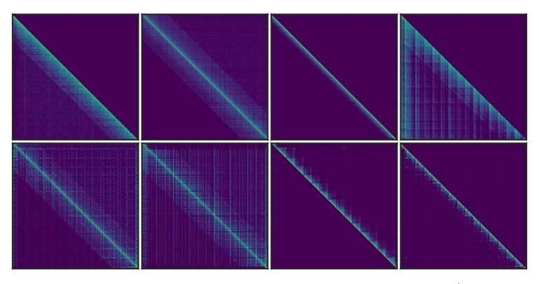

# G Does This Dynamic Sparse Attention Pattern Exist Only in Auto-Regressive LLMs or RoPE-Based LLMs?

Similar vertical and slash line sparse patterns have been discovered in BERT [SGR+21] and multimodal LLMs [WWL+24]. Additionally, as shown in Fig. 13, we analyzed the distribution of attention patterns in T5 across different heads. It is evident that there are vertical and slash sparse patterns even in bidirectional attention.

Recent studies [WWL+24] have analyzed sparse attention patterns in multi-modal LLMs, revealing the presence of vertical and slash patterns in models like LLaVA [LLWL24] and InternVL [CWW+24]. Using MInference for pre-filling stage inference acceleration holds great promise.

Figure 13: The sparse pattern in T5-style Encoder Attention using Flan-UL2 [\[TDT](#page-15-13)+23] on the Summarization dataset [\[ZCH](#page-16-4)+24].

