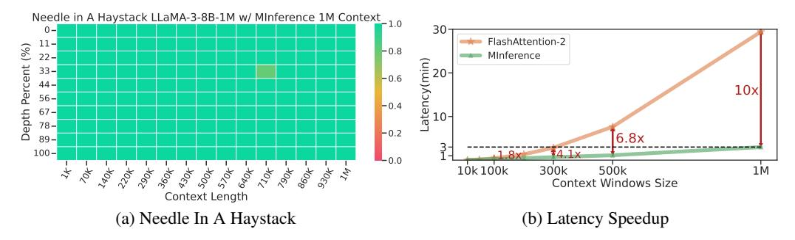
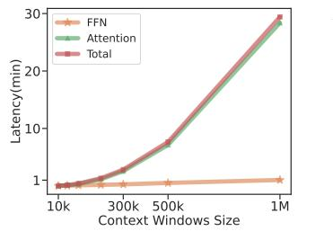
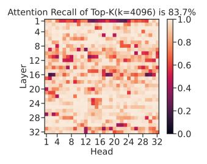
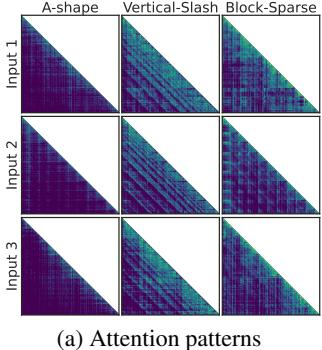

# MInference 1.0: Accelerating Pre-filling for Long-Context LLMs via Dynamic Sparse Attention

Huiqiang Jiang†, Yucheng Li⋄†, Chengruidong Zhang†, Qianhui Wu, Xufang Luo, Surin Ahn, Zhenhua Han, Amir H. Abdi, Dongsheng Li, Chin-Yew Lin, Yuqing Yang, Lili Qiu

Microsoft Corporation, ♦University of Surrey {hjiang,chengzhang,yuqyang}@microsoft.com,yucheng.li@surrey.ac.uk

#### **Abstract**

The computational challenges of Large Language Model (LLM) inference remain a significant barrier to their widespread deployment, especially as prompt lengths continue to increase. Due to the quadratic complexity of the attention computation, it takes 30 minutes for an 8B LLM to process a prompt of 1M tokens (i.e., the pre-filling stage) on a single A100 GPU. Existing methods for speeding up prefilling often fail to maintain acceptable accuracy or efficiency when applied to long-context LLMs. To address this gap, we introduce MInference (Milliontokens Inference), a sparse calculation method designed to accelerate pre-filling of long-sequence processing. Specifically, we identify three unique patterns in long-context attention matrices—the A-shape, Vertical-Slash, and Block-Sparse that can be leveraged for efficient sparse computation on GPUs. We determine the optimal pattern for each attention head offline and dynamically build sparse indices based on the assigned pattern during inference. With the pattern and sparse indices, we perform efficient sparse attention calculations via our optimized GPU kernels to significantly reduce the latency in the pre-filling stage of longcontext LLMs. Our proposed technique can be directly applied to existing LLMs without any modifications to the pre-training setup or additional fine-tuning. By evaluating on a wide range of downstream tasks, including InfiniteBench, RULER, PG-19, and Needle In A Haystack, and models including LLaMA-3-1M, GLM-4-1M, Yi-200K, Phi-3-128K, and Qwen2-128K, we demonstrate that MInference effectively reduces inference latency by up to  $10 \times$  for pre-filling on an A100, while maintaining accuracy. Our code is available at https://aka.ms/MInference.

Figure 1: Attention weights, especially in long-context LLMs, exhibit up to 96.8% sparsity in contexts of 128K. We propose **MInference**, leveraging dynamic sparse attention to accelerate the pre-filling stage of long-context LLM inference. It achieves up to 10x speedup for 1M contexts on a single A100, as shown in (b), and matches or surpasses baselines, as demonstrated by Needle In A Haystack [Kam23] in (a) on LLaMA-3-8B-1M [Gra24].

†Equal contribution. ♦Work during internship at Microsoft.

#### 1 Introduction

Large language models (LLMs) have entered the era of long-context processing, with some of them supporting context windows ranging from 128K to 10M tokens [Gra24, RST+24, LYZA24, YCL+24, AJA+24, DA24]. These extended context windows enable LLMs to unlock a multitude of complex real-world applications, such as repository-level code understanding [BSK+24, JYW+23, POC+23], long-document question-answering [CPG+23, LZD+24], self-play reasoning [Ope24], extreme-label in-context learning [LZD+24], and long-horizon agent tasks [Wen23].

However, due to the quadratic complexity of attention, it can take several minutes for the model to process the input prompt (i.e., the pre-filling stage) and then start to produce the first token, which leads to unacceptable Time To First Token experience, thus greatly hinders the wide application of long-context LLMs. As shown in Fig. 2a, when serving LLaMA-3-8B on a single A100 machine, the model would keep users waiting for 6 minutes to finish the pre-filling stage given a prompt of 300K tokens, and this number increases to 30 minutes for a prompt of 1M tokens. The overhead of self-attention computation exceeds 90% of the total pre-filling latency, which makes it the major bottleneck in long-context processing of LLMs. Previous research has shown that the attention matrices are highly sparse [LQC+22, DSY24], which has led to the development of fixed sparse attention methods such as Longformer [BPC20] and BigBird [ZGD+20]. However, prior studies have also noted that attention distributions vary significantly across different inputs [LCW21, LQC+22]. This dynamic nature prevents prior sparse methods from being used directly on long-context LLMs without expensive training or fine-tuning. But if the dynamic sparse attention patterns could be efficiently predicted online, the pre-filling latency of long-context LLMs could be significantly reduced by calculating only the most important part of the attention weights.

Building upon this idea, we present **MInference**, a technique that reduces 95% of FLOPs in the attention computation to significantly accelerate the pre-filling stage of long-context LLM inference via dynamic sparse attention. Unlike existing dynamic sparse attention methods that introduce large computational overhead to estimate attention patterns with low-rank hidden dimensions [LQC+22, RCHG+24], our method is designed specifically for long-context scenarios with minimal overhead in estimation. Specifically, we conduct extensive analysis and identify three general patterns of sparse attention in long-context LLMs: A-shape pattern, Vertical-Slash pattern, and Block-Sparse pattern. Based on these findings, we introduce a kernel-aware search method to assign the optimal attention pattern for each head. Importantly, instead of fixed attention masks in prior studies, we perform an efficient online approximation to build a dynamic sparse mask for each head according to their assigned pattern and particular inputs. For example, to build a dynamic sparse mask for a specific prompt on one Vertical-Slash head, we use a partial of attention weight consisting of the last last\_q query and key vectors (i.e.  $Q_{[-last \ a:]}$  and K) to estimate the most important indices of the vertical and slash lines globally on the attention matrix. For *Block-Sparse* heads, we perform mean pooling on both query and key vectors in blocks of 64 and calculate the block-level attention weights to determine the most important blocks and thereby obtain a block-sparse dynamic mask. After obtaining the dynamic sparse mask, three optimized GPU kernels are used, which we developed for the above three sparse patterns. These kernels are based on the dynamic sparse compilers PIT [ZJZ+23], Triton [TKC19] and FlashAttention [Dao24], which enable extremely efficient computation of dynamic sparse attention.

Extensive experiments are conducted on various Long-context LLMs, including LLaMA-3-8B-1M [Gra24], GLM-4-9B-1M [GZX+24], and Yi-9B-200K [YCL+24], across benchmarks with context lengths over 1M tokens, such as InfiniteBench [ZCH+24], RULER [HSK+24], Needle In A Haystack [Kam23], and PG-19 [RPJ+20]. Needle In A Haystack was also tested on Phi-3-Mini-128K [AJA+24] and Qwen-2-7B-128K [BBC+23]. Results show that MInference speeds up the pre-filling stage by up to  $10\times$  for 1M contexts with LLaMA-3-8B on a single A100, reducing latency from 30 minutes to 3 minutes per prompt, while maintaining or improving accuracy.

#### 2 Attention Heads: Dynamic, Sparse, and Characteristic

#### 2.1 Attention is Dynamically Sparse

The sparsity of attention weights in pre-trained LLMs, especially in long-context scenarios, has been well-documented [LQC+22, RCHG+24, LWD+23, XTC+24]. As shown in Fig. 2b, for an attention

- (a) Attention incurs heavy cost.
- (b) Attention is sparse.
- (c) Sparsity of attention is dynamic.

Figure 2: (a) Latency breakdown of the pre-filling stage. (b) How much attention scores can top-k (k=4096) columns cover in a 128k context. (c) Less attention scores are retrieved when reusing the top-k indices from another examples, indicating its dynamic nature. Visualizations are based on LLaMa-3-8B with a single A100.

matrix of size  $128k \times 128k$ , retaining only the top 4k columns recalls 96.8% of the total attention. In other words, each token is attending to a limit number of tokens despite the long sequence it is processing.

On the other hand, although the sparse nature of attention matrices is shared across different inputs, the exact distributions of sparse pattern are highly dynamic. That is to say, a token at a given position only attends to a subset of the sequence in self-attention, and the exact tokens it attends to are highly context-dependent and vary significantly across different prompts. This dynamism has been mathematically demonstrated in prior studies [LCW21, LCW23]. As depicted in Fig. 2c, if we take the top 4k columns found in Fig. 2b and apply it on another prompt of 128k, the recall of attention would drop largely to 83.7%.

#### 2.2 Attention Sparsity Exhibits Patterns

Table 1: Comparison of different sparse patterns.

| Patterns                | A-shape           | Vertical-Slash     | Block-Sparse       | Top-K                |
|-------------------------|-------------------|--------------------|--------------------|----------------------|
| Spatial Distribution    | Static structured | Dynamic structured | Dynamic structured | Dynamic fine-grained |
| Latency on GPU          | Low               | Medium             | Low                | High                 |
| Time to build the index | Zero              | Small              | Small              | High                 |

Although the sparsity distribution of attention matrix is dynamic, previous works [XTC+24, HWP+24] have shown that they exhibit certain patterns in the two-dimensional space such as spatial clustering. Through our analysis of long-context prompts of various lengths and tasks, we have

- (b) Attention is spatial clustering
- (c) Attention pattern recall

Figure 3: (a) Visualization of attention weights from different attention heads. For different prompts and tasks, the pattern of the same head is relatively consistent, but the sparse indices are dynamically changing.(b) Distance of the top-10 nearest non-zero element in the attention matrix. (c) Attention recall distribution using our identified patterns, where FLOPs in the kernel refer to the real FLOPs required for sparse attention computing using on GPUs. Here, a 1x64 block size is used for the *Vertical-Slash* pattern, and a 64x64 block size is used for others on GPUs. All visualization are based on LLaMA-3-8B-Instruct-262K [Gra24].

categorized such attention sparse patterns into the *A-shape*, *Vertical-Slash* (VS), and *Block-Sparse* patterns, as shown in Fig. [3a](#page-2-3) and Fig. [4.](#page-3-0) Table [1](#page-2-4) details the characteristics and differences between these three patterns.

*A-shape* pattern The attention weights of these types of heads are concentrated on initial tokens and local windows [\[XTC](#page-16-5)+24, [HWP](#page-12-4)+24], exhibiting relatively higher stability.

*Vertical-Slash* (VS) pattern The attention weights are concentrated on specific tokens (vertical lines) [\[MJ23\]](#page-14-3) and tokens at fixed intervals (slash lines). The positions of vertical and slash lines in this pattern dynamically change with the context content and exhibit a certain sparsity, making them difficult to be encompassed by local windows and *A-shape* patterns.

*Block-Sparse* pattern This sparsity pattern is the most dynamic, exhibiting a more dispersed distribution. Despite its dynamism, the attention weights maintain some characteristics of spatial clustering, which we identify as the block-sparse pattern. We analyzed the distances between non-zero attention weights and their top-k nearest non-zero neighbors within a 128k prompt as shown in Fig. [3b.](#page-2-5) The results indicate that across layers and heads, the distances between nearest non-zero values are generally concentrated around 5, suggesting a strong spatial clustering of the attention weights.

The point of these three patterns is that we can leverage them to perform highly efficient sparse computing for the attention matrix in long-context LLMs. In Fig. [3c,](#page-2-6) we test how efficient is our indentified patterns retrieving attention scores with limit computing cost on GPU (FLOPs). First, attention heads are labeled with one of the sparse pattern (detail see [§3.2\)](#page-4-0). Then we demonstrate our patterns are significantly more efficient compared to other sparse methods [\[RCHG](#page-15-1)+24, [XTC](#page-16-5)+24, [PPJF24\]](#page-14-4). Specifically, with the same amount of FLOPs, our patterns achieve a notable higher recall on attention scores, which can potentially lead to better accuracy. For example, previous Top-K methods [\[RCHG](#page-15-1)+24, [XTC](#page-16-5)+24, [PPJF24\]](#page-14-4) struggle with the *Block-Sparse* pattern as they focus on specific tokens globally, while our pattern retrieves attention scores more efficiently and accurately. We example how we use these patterns on long-context LLMs and how we implement optimized GPU kernels for these patterns in [§3.](#page-3-1)

