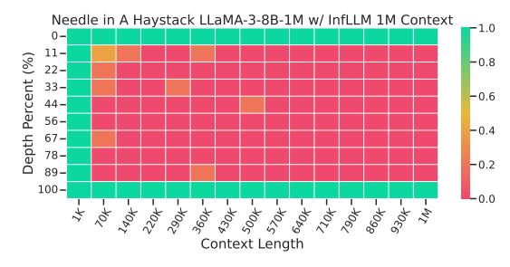
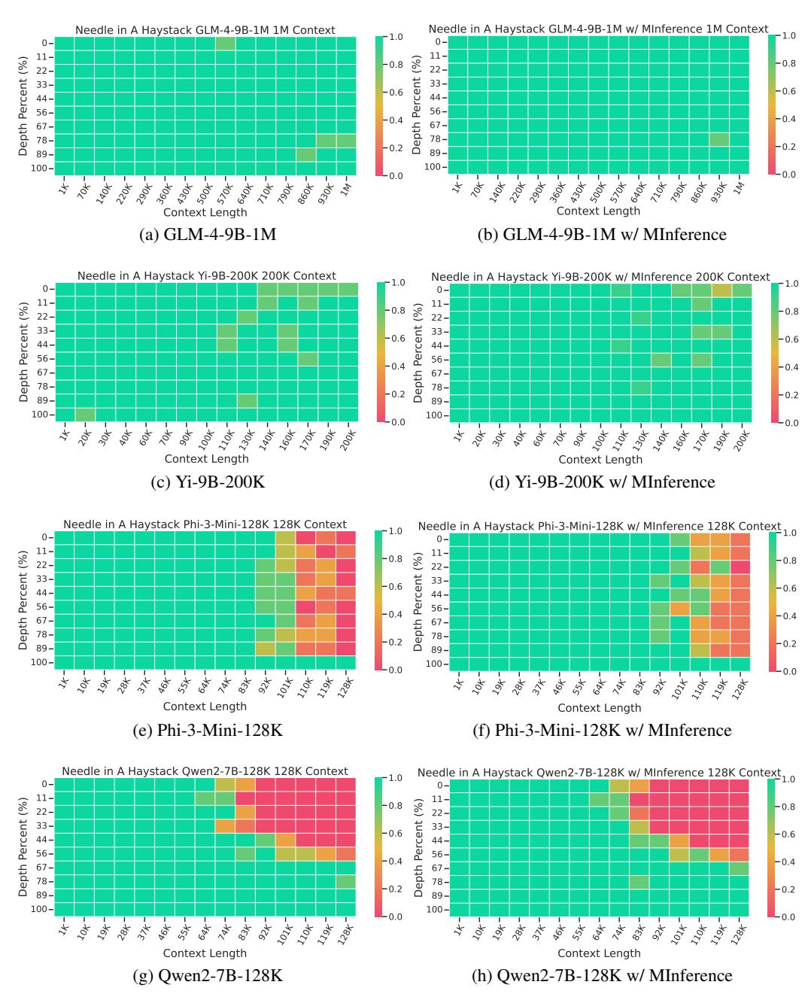
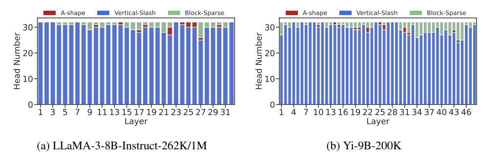

# **D** Additional Experiment Results

#### D.1 Needle In A Haystack

In addition to the Needle In A Haystack results for LLaMA-3-Instruct-1M shown in §4, we also present the LLaMA-3-Instruct-1M using InfLLM results in Fig. 8, and results for GLM-4-9B-1M, Yi-9B-200K, Phi-3-Mini-128K, and Qwen2-7B-128K, shown in Fig. 9. Compared to Full Attention, using MInference has minimal impact on the ability to understand semantic information across different context windows and

Figure 8: Results on Needle In A Haystack using InfLLM in LLaMA-3-8B-Instruct-1M.

needle depths. There is even a slight performance improvement around the 100k context length using Yi-9B-200K and Phi-3-Mini-128K.

Figure 9: Needle In A Haystack [Kam23] results using GLM-4-9B-1M [GZX+24], Yi-9B-200K [YCL+24], Phi-3-Mini-128K [AJA+24], and Qwen2-7B-128K [BBC+23].

#### D.2 Latency Breakdown

Fig. 10 shows the micro-benchmark results of the three attention patterns proposed in this paper, as well as FlashAttention. It can be seen that Vertical-Slash is the slowest among the three patterns, but it still achieves a 13x speedup compared to FlashAttention under 1M context windows. Ashape is slightly faster than Vertical-Slash, but at 1M, A-shape is 50% slower than Vertical-Slash. Block-Sparse is the fastest, achieving a 30x speedup over FlashAttention under 1M context windows.

Figure 10: The latency breakdown of a single attention kernel for three patterns and FlashAttention [Dao24] across different context windows in a single A100, including the index time for dynamic sparse approximation and building dynamic sparsity. At 10k tokens, the latency of the four kernels is very close and all are less than 1ms. At 1M tokens, the latency for A-shape is 164ms.

The estimation and index-building time for the dynamic sparse pattern accounts for approximately 5%-15% and 25% of the total time for Vertical-Slash and Block-Sparse patterns, respectively. The index-building overhead is higher for Block-Sparse mainly due to the time-consuming MeanPooling and block-level matmul computations. Additionally, the memory overhead for sparse indexing is relatively small, remaining within 160MB for a LLaMA-3-8B model in 1M context.

#### **D.3** Additional Ablation Study

Table 8: Performance of different ablation methods using LLaMA-3-8B-Instruct-262K on InfiniteBench [ZCH+24]. It is important to note that due to kernel limitations, we must retain at least one vertical and one slash. Therefore, "ours w/ only vertical" retains the top-1 slash, and "ours w/ only slash" retains the top-1 vertical.

| Methods               | En.Sum | En.QA | En.MC | En.Dia | Zh.QA | Code.Debug | Math.Find | Retr.PassKey | Retr.Num | Retr.KV | Avg. |
|-----------------------|--------|-------|-------|--------|-------|------------|-----------|--------------|----------|---------|------|
| Ours                  | 20.5   | 12.9  | 65.9  | 7.5    | 12.5  | 22.3       | 33.1      | 100.0        | 100.0    | 12.8    | 38.8 |
| Ours w/ only vertical | 13.7   | 6.2   | 30.1  | 2.0    | 6.5   | 7.9        | 1.7       | 65.4         | 52.7     | 0.0     | 18.6 |
| Ours w/ only slash    | 18.4   | 11.5  | 60.1  | 3.0    | 11.4  | 22.1       | 28.4      | 100.0        | 100.0    | 4.2     | 35.9 |

To further analyze the role of dynamic vertical and slash lines in the *Vertical-Slash* pattern for sparse computation, we introduce a new set of ablation studies as follows: 1) Ours w/ only vertical, which only uses vertical lines and the top-1 slash line in *Vertical-Slash* pattern. 2) Ours w/ only slash, which only uses slash lines and the top-1 vertical line in *Vertical-Slash* pattern. The corresponding top-K quantities are set after converting based on FLOPs in kernel.

As shown in Table 8, using only vertical lines results in a significant performance drop, especially in retrieval tasks, where performance is similar to only using block-sparse. In contrast, using only slash lines retains most of the performance, but in highly dynamic tasks such as KV retrieval, performance further decreases, with an average performance drop of 2.9% compared to Ours.

#### **E** Pattern Distribution

Fig. 11 shows the distribution of the optimal head configuration obtained through our search. Firstly, most of the patterns are the *Vertical-Slash* pattern (>90%). However, according to the ablation study, using only the *Vertical-Slash* pattern significantly impacts performance in highly dynamic tasks like KV retrieval. Secondly, the *Block-Sparse* pattern is primarily distributed in several intermediate to later layers, while the *A-shape* pattern is found in the middle layers. Although the optimal patterns vary slightly across different models, they generally align with these observations.

Additionally, we used the same configuration for two versions of LLaMA in our experiments, and the results show that the 1M model also performs very well, with nearly perfect results in the Needle In A Haystack task. This demonstrates the generalizability of the optimal sparse pattern.

Figure 11: Distribution of three sparse head patterns in different models. We use the same optimal sparse pattern configuration for both LLaMA-3-8B-Instruct-262K and LLaMA-3-8B-Instruct-1M.

