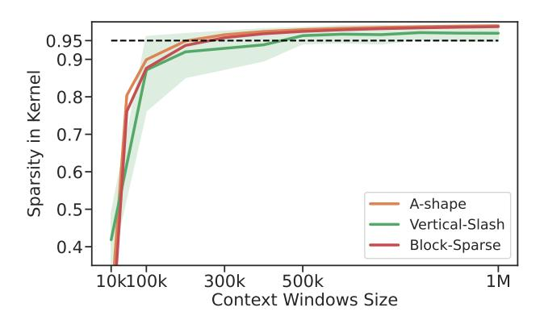

# F Sparsity in Kernel Distribution

Figure 12: The distribution of sparsity in the kernel across different context windows refers to the proportion of the kernel that is actually computed after block coverage, compared to the sparsity rate when using FlashAttention with a causal mask.

As shown in Fig. 12, the sparsity distribution of the three patterns during the actual kernel computation process is displayed. It can be seen that when the context windows exceed 200k, the actual sparsity of all three patterns surpasses 90%. Even considering a 20% index-building overhead, this ensures that the kernel achieves a speedup of over  $8\times$ . Furthermore, when the context windows exceed 500k, the sparsity relative to FlashAttention exceeds 95%, with a theoretical speedup of over  $15\times$ .

