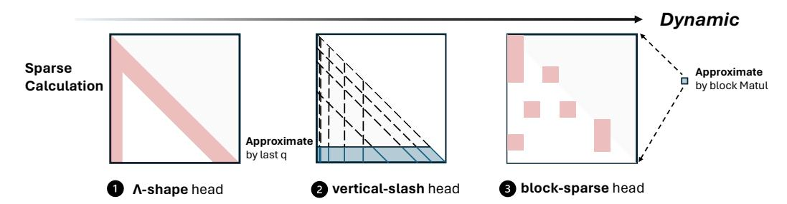

# 3 MInference 1.0

Following the analysis in [§2,](#page-1-0) we propose MInference to accelerate the pre-filling stage of longcontext LLMs, consisting of three steps: 1) Offline attention pattern identification for each head; 2) Dynamic build of sparse indices w.r.t. the pattern; 3) Sparse attention calculation with optimized GPU kernels.

Figure 4: The three sparse methods in MInference.

