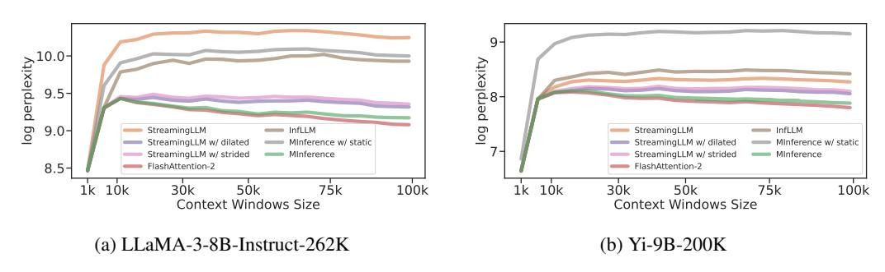

# 4 Experiments

In this section, we investigate two questions: (i) How effective is MInference? We evaluate our method on three general long-context benchmarks: InfiniteBench [ZCH+24], RULER [HSK+24], and the Needle In A Haystack task [Kam23], as well as the long-context language modeling task [RPJ+20]. These benchmarks cover long-context QA, multi-hop QA, math reasoning, aggregation tasks, summarization, retrieval tasks, and code debugging, allowing us to assess MInference's effectiveness across a wide range of long-context scenarios. (ii) How efficient is MInference? We delve into the end-to-end latency and its breakdown to evaluate the efficiency of MInference. Additional experimental, latency results, and analysis can be found in Appendix D, E, and F.

Implementation Details Our experiments use four state-of-the-art long-context LLMs: LLaMA-3-8B-Instruct-262k¹, LLaMA-3-8B-Instruct-1048k², GLM-4-9B-1M [GZX+24], and Yi-9B-200K [YCL+24]. Additionally, we tested Needle in A Haystack [Kam23] on Phi-3-Mini-128K [AJA+24] and Qwen2-7B-128K [BBC+23], as detailed in Appendix D.1. To guarantee stable results, we use greedy decoding in all experiments. We provide a simple custom implementation of our method in PyTorch, built on FlashAttention [Dao24], Triton [TKC19], and the dynamic sparse compiler PIT [ZJZ+23]. We set the target FLOPs t to 1k global tokens and 4k local windows in the A-shape pattern. We set last\_q = 64 and  $block\_size = 64$  in the V-ertical-Slash and B-lock-Sparse patterns, respectively. The latency experiments are conducted on a single Nvidia A100 GPU in the bfloat16 format. More details are provided in Appendix C.2.

**Dataset & Evaluation Metrics** We use the provided metrics and scripts from the following benchmarks for evaluation. More details about dataset can be found in Appendix C.1.

- (i) InfiniteBench [ZCH+24]: This benchmark consists of 10 tasks, including retrieval tasks such as PassKey retrieval, Number retrieval, and KV retrieval, as well as representative realistic tasks like question-answering, coding, dialogue, and summarization. The average context length of InfiniteBench is about 214K tokens.
- (ii) RULER [HSK+24]: A challenging long-context benchmark consisting of 4 categories and 13 complex tasks, including retrieval, multi-hop tracing and aggregation, and QA tasks. It contains subsets with different prompt lengths up to 128k tokens, allowing us to determine the actual context window size of the model based on the results.
- (iii) Needle In A Haystack [Kam23]: A long-context retrieval benchmark testing LLMs' performance with context window sizes up to 1M tokens where information placed at various positions.

&lt;sup>1https://huggingface.co/gradientai/Llama-3-8B-Instruct-Gradient-262k

&lt;sup>2https://huggingface.co/gradientai/Llama-3-8B-Instruct-Gradient-1048k

Table 2: Performance of different methods with different base models on InfiniteBench [ZCH+24].

| Methods                 | En.Sum | En.QA | En.MC | En.Dia | Zh.QA | Code.Debug | Math.Find | Retr.PassKey | Retr.Num | Retr.KV | Avg. |
|-------------------------|--------|-------|-------|--------|-------|------------|-----------|--------------|----------|---------|------|
| LLaMA-3-8B-262K         | 20.2   | 12.4  | 67.3  | 6.0    | 12.9  | 22.1       | 26.6      | 100.0        | 100.0    | 14.4    | 38.2 |
| StreamingLLM            | 21.0   | 8.2   | 40.2  | 10.0   | 10.4  | 25.9       | 30.0      | 86.8         | 5.1      | 0.8     | 23.8 |
| StreamingLLM w/ dilated | 20.1   | 9.4   | 44.5  | 15.5   | 11.2  | 20.5       | 27.5      | 5.0          | 87.5     | 0.5     | 24.2 |
| StreamingLLM w/ strided | 17.3   | 8.2   | 27.5  | 14.5   | 11.2  | 19.5       | 27.5      | 4.0          | 2.1      | 1.0     | 13.3 |
| InfLLM                  | 24.1   | 7.8   | 45.0  | 6.0    | 11.4  | 19.5       | 32.9      | 100.0        | 100.0    | 1.2     | 34.8 |
| Ours w/ static          | 19.9   | 8.6   | 43.2  | 3.5    | 8.9   | 20.6       | 25.1      | 92.4         | 96.3     | 0.2     | 31.9 |
| Ours                    | 20.5   | 12.9  | 65.9  | 7.5    | 12.5  | 22.3       | 33.1      | 100.0        | 100.0    | 12.8    | 38.8 |
| Yi-9B-200K              | 8.2    | 10.6  | 64.2  | 1.0    | 17.3  | 21.3       | 23.4      | 99.8         | 100.0    | 28.8    | 37.5 |
| StreamingLLM            | 5.4    | 14.2  | 38.0  | 4.0    | 18.8  | 18.8       | 22.3      | 39.2         | 6.1      | 1.6     | 16.8 |
| StreamingLLM w/ dilated | 5.7    | 4.2   | 15.0  | 0.0    | 18.2  | 0.0        | 2.9       | 0.0          | 0.0      | 0.0     | 4.2  |
| StreamingLLM w/ strided | 6.1    | 4.5   | 9.8   | 0.0    | 16.9  | 0.0        | 3.1       | 1.5          | 0.0      | 0.0     | 4.6  |
| InfLLM                  | 6.3    | 13.0  | 45.9  | 2.5    | 21.5  | 20.6       | 34.6      | 85.3         | 88.1     | 1.4     | 31.9 |
| Ours w/ static          | 5.8    | 12.6  | 48.5  | 3.0    | 12.6  | 20.8       | 25.1      | 60.9         | 38.5     | 1.0     | 22.9 |
| Ours                    | 7.9    | 11.2  | 64.2  | 1.0    | 17.9  | 24.1       | 23.1      | 99.5         | 100.0    | 27.6    | 37.7 |
| GLM-4-9B-1M             | 28.3   | 9.7   | 68.6  | 39.5   | 12.1  | 29.4       | 38.9      | 100.0        | 100.0    | 41.0    | 46.7 |
| StreamingLLM            | 27.7   | 6.4   | 40.2  | 12.5   | 10.8  | 27.7       | 21.1      | 97.1         | 25.6     | 0.6     | 27.0 |
| InfLLM                  | 28.0   | 7.3   | 45.0  | 14.0   | 10.7  | 27.9       | 39.4      | 98.0         | 100.0    | 2.6     | 37.3 |
| Ours                    | 28.8   | 9.6   | 68.6  | 38.5   | 12.0  | 30.7       | 39.1      | 100.0        | 100.0    | 43.0    | 47.0 |

(iv) PG-19 [RPJ+20]: Following StreamingLLM [XTC+24] and H2O [ZSZ+24], we use PG-19 for long-context language modeling tasks with prompts up to 100k tokens.

**Baselines** We include five training-free sparse attention approaches as our baselines: 1) StreamingLLM [XTC+24], which corresponds to the *A-shape* pattern. We use 1k global tokens and 4k local windows in all our experiments; 2) StreamingLLM w/ dilated [BPC20], which sets dilated local windows with intervals in the local windows direction. We use 1k global tokens and 8k dilated attention windows with an interval of 1; 3) StreamingLLM w/ strided [CGRS19], which retains local windows while adding dilated attention. We use 1k global tokens, 2k local windows, and 4k dilated attention windows with an interval of 1; 4) InfLLM [XZH+24], which uses a memory unit to process streaming long sequences. Following the paper, we set 128 global tokens and 8k local windows in all experiments; 5) Ours w/ static, which utilizes static sparse indices in the *Vertical-Slash* and *Block-Sparse* heads. For all baselines, we perform sparse computation only during the pre-filling stage, while retaining dense computation during the decoding stage.

**InfiniteBench** As shown in Table 2, MInference achieves the best overall performance on InfiniteBench compared to baseline methods. Remarkably, MInference matches or even slightly surpasses the performance of the original full attention baseline on some tasks, despite the significant acceleration it provided. From the perspective of different tasks, our method not only performs well in natural language tasks such as summarization, QA, and code, but also maintains the original model's performance on retrieval-related tasks. Baseline methods such as StreamingLLM, on the

Table 3: Performance (%) of different models and different methods on RULER [HSK+24] evaluated at lengths from 4k to 128k.

| Methods                 | Claimed | Effective | 4K   | 8K   | 16K  | 32K  | 64K  | 128K | Avg. |
|-------------------------|---------|-----------|------|------|------|------|------|------|------|
| LLaMA-3-8B-262K         | 262K    | 16K       | 97.2 | 91.8 | 87.3 | 80.8 | 77.4 | 72.2 | 84.4 |
| StreamingLLM            | -       | 4K        | 97.2 | 38.1 | 37.5 | 17.2 | 14.2 | 9.4  | 35.0 |
| StreamingLLM w/ dilated | -       | <4K       | 23.4 | 0.7  | 1.4  | 18.8 | 16.5 | 15.6 | 12.7 |
| StreamingLLM w/ strided | -       | <4K       | 2.0  | 0.7  | 0.6  | 0.6  | 0.7  | 1.3  | 1.0  |
| InfLLM                  | -       | 4K        | 89.4 | 79.8 | 70.1 | 55.6 | 43.0 | 39.5 | 62.9 |
| Ours                    | -       | 32K       | 97.7 | 91.2 | 88.5 | 85.0 | 82.3 | 77.6 | 87.0 |
| Yi-9B-200K              | 200K    | 8K        | 91.9 | 90.2 | 78.8 | 76.3 | 68.1 | 62.9 | 78.1 |
| StreamingLLM            | -       | 4K        | 91.9 | 37.8 | 33.9 | 18.6 | 13.0 | 12.8 | 34.3 |
| StreamingLLM w/ dilated | -       | <4K       | 44.8 | 42.8 | 38.5 | 29.8 | 26.8 | 23.9 | 34.4 |
| StreamingLLM w/ strided | -       | <4K       | 2.6  | 0.7  | 0.6  | 0.6  | 1.2  | 0.5  | 1.1  |
| InfLLM                  | -       | <4K       | 80.3 | 83.9 | 60.7 | 45.2 | 38.6 | 30.2 | 56.5 |
| Ours                    | -       | 8K        | 92.3 | 89.7 | 79.0 | 73.8 | 64.7 | 56.9 | 74.7 |
| GLM-4-9B-1M             | 1M      | 64K       | 93.8 | 91.6 | 89.3 | 87.4 | 85.2 | 80.8 | 88.0 |
| StreamingLLM            | -       | 4K        | 93.8 | 66.9 | 58.5 | 51.4 | 45.9 | 39.1 | 59.3 |
| InfLLM                  | -       | 8K        | 94.7 | 89.5 | 76.4 | 66.5 | 56.8 | 53.5 | 72.9 |
| Ours                    | -       | 64K       | 94.6 | 93.1 | 91.0 | 89.6 | 85.5 | 84.0 | 89.6 |

contrary, struggle with these retrieval tasks. Additionally, on tasks such as dialogue QA, using local attention mechanisms can better handle these tasks, while our performance is closer to the original results, indicating that our method is not solely based on local windows. Extending the local windows' intervals in StreamingLLM, i.e., w/ dilated and w/ strided, has minimal impact on the model's performance.

**RULER** To further reveal the true potential of our method in long-context LLMs, we evaluate MInference with the state-of-the-art long-context challenge, RULER. As shown in Table 3, MInference effectively maintains the long-context performance even in complex multi-hop or aggregation tasks in RULER. It even outperforms the original full attention for testing lengths beyond 32K, achieving effective context windows of 32K and 64K (context with performance over 85% is considered effective [HSK+24]) in LLaMA-3-8B-262K and GLM-4-9B-1M.

**Language Modeling** Following the approach of StreamingLLM [XTC+24] and H2O [ZSZ+24], we evaluate our methods against baselines on the language modeling task based on the PG-19 dataset [RPJ+20]. As shown in 5, our method yields best results compared to other sparse approaches, and exhibits minimal divergence compared to the full attention baseline. For prompts of 100K token, our perplexity is only 0.2 higher than the full attention, but lower than StreamingLLM for 0.25 and 0.75 on the Yi-9B-200K and LLaMA-3-262K models respectively.

Figure 5: Perplexity results on PG-19 [RPJ+20] using different models and methods.

Needle In A Haystack Comparing Fig. 1a to Fig. 6, our method effectively retains the ability to process information at different positions across various context windows, ranging from 1k to 1M tokens. In contrast, methods like StreamingLLM and InfLLM (as shown in Appendix D.1), while effective at reducing latency, experience a sharp decline in performance once critical information extends beyond the range of global tokens and local windows.

Figure 6: Results on Needle In A Haystack of StreamingLLM [XTC+24] in LLaMA-3-8B-1M.

**Ablation Study** To evaluate the contributions of different components in MInference, we in-

troduce four variants for the ablation study: (1) Ours w/ static, which uses a static sparse mask in the *Vertical-Slash* and *Block-Sparse* patterns; (2) Ours w/ only A-shape, which is equivalent to StreamingLLM; (3) Ours w/ only block-sparse, which uses only the *Block-Sparse* pattern in the dynamic sparse calculation. (4) Ours w/ only vertical-slash, which uses only the *Vertical-Slash* pattern in the dynamic sparse calculation.

Tables 2, 3, and 4 present the ablation results. It first proves that using static indices significantly degrades LLM performance, especially in highly dynamic tasks like KV retrieval, where accuracy nearly drops to zero. This highlight the necessity of our dynamic strategy and the effectiveness of our dynamically built sparse indices. Additionally, remove any pattern from the three leads to varying degrees of performance degradation. Specifically, "only A-shape" can only capture information

Table 4: Performance of different ablation methods using LLaMA-3-8B-Instruct-262K on InfiniteBench [ZCH+24].

| Methods                     | En.Sum | En.QA | En.MC | En.Dia | Zh.QA | Code.Debug | Math.Find | Retr.PassKey | Retr.Num | Retr.KV | Avg. |
|-----------------------------|--------|-------|-------|--------|-------|------------|-----------|--------------|----------|---------|------|
| Ours                        | 20.5   | 12.9  | 65.9  | 7.5    | 12.5  | 22.3       | 33.1      | 100.0        | 100.0    | 12.8    | 38.8 |
| Ours w/ only block-sparse   | 12.4   | 3.4   | 5.7   | 6.0    | 3.1   | 12.2       | 24.0      | 59.5         | 60.3     | 0.0     | 18.7 |
| Ours w/ only vertical-slash | 19.6   | 12.0  | 62.1  | 9.5    | 11.7  | 21.6       | 29.1      | 100.0        | 100.0    | 5.0     | 37.1 |

within local windows. The "only block-sparse" variant using only the *BS* pattern, also results in significant performance declines. On the other hand, "only vertical-slash" manages to preserve most of the performance due to its balance between dynamicity and the StreamingLLM pattern, but still fall behind the full version of our method.

**Latency** Fig. 1b and 10 shows the latency and breakdown of MInference across different context windows on a single A100. At 100K, 300K, 500K, and 1M tokens, our method achieves speedups of  $1.8\times$ ,  $4.1\times$ ,  $6.8\times$ , and  $10\times$ , respectively. It reduces the pre-filling latency from 30 mins to 3 mins on a single A100 for a prompt of 1M token. By further utilizing tensor parallel [LMZ $^+$ 24] and context parallel [LZA24, JTZ $^+$ 24], this latency can be reduced to 22 seconds on 8x A100 GPUs. This significantly lowers the deployment cost of long-context LLMs and enhances user experience. And since our kernel is implemented based on Triton, it can be easily ported to other devices and achieve similar speedups, such as on the H100 or MI300X. Additionally, analyzing the latency breakdown, we found about 5%-20% of the overhead is spent on dynamic sparse index building, while the remaining time is spent on dynamic sparse calculation.

**Integrate with KV cache compression methods** We also combined MInference with a state-of-the-art KV cache compression method SnapKV [LHY+24], as shown in Table 5. This proves our method is compatible with KV cache compression techniques. For most tasks, performance remains nearly unchanged, with the average score even showing a slight increase, which further demonstrates the potential practical value of our method as an optimization for serving long-context LLMs. This phenomenon is also observed in other works, such as ShadowKV [SCB+24].

Table 5: Performance of different methods on InfiniteBench [ZCH+24] using SnapKV [LHY+24] in the decoding stage.

| Methods           | En.Sum | En.QA | En.MC | En.Dia | Zh.QA | Code.Debug | Math.Find | Retr.PassKey | Retr.Num | Retr.K | V Avg. |
|-------------------|--------|-------|-------|--------|-------|------------|-----------|--------------|----------|--------|--------|
| LLaMA-3 w/ SnapKV | 18.0   | 11.8  | 65.5  | 2.5    | 12.0  | 21.3       | 26.6      | 100.0        | 100.0    | 1.8    | 36.0   |
| Ours w/ SnapKV    | 18.9   | 11.7  | 66.4  | 6.5    | 12.1  | 21.8       | 33.1      | 100.0        | 100.0    | 2.0    | 37.3   |

**Scaling-up on Larger LLMs** We also evaluated MInference on larger LLMs, such as LLaMA-3-70B-1M3. As shown in Table 6, MInference maintains strong performance even in larger models. Notably, in dynamic tasks such as KV retrieval, MInference can match or even slightly improve performance compared to full attention. In contrast, baselines like InfLLM generally struggle with tasks such as KV retrieval.

Table 6: Performance of different methods using LLaMA-3-70B-Instruct-262K on InfiniteBench [ZCH+24].

| Methods          | En.Sum | En.QA | En.MC | En.Dia | Zh.QA | Code.Debug | Math.Find | Retr.PassKey | Retr.Num | Retr.KV | Avg. |
|------------------|--------|-------|-------|--------|-------|------------|-----------|--------------|----------|---------|------|
| LLaMA-3-70B-262K | 20.7   | 10.3  | 84.2  | 9.5    | 14.0  | 33.2       | 61.7      | 97.0         | 100.0    | 34.0    | 46.5 |
| StreamingLLM     | 20.5   | 8.5   | 52.0  | 10.0   | 12.6  | 27.4       | 61.1      | 14.0         | 10.0     | 0.0     | 21.6 |
| InfLLM           | 24.1   | 8.1   | 57.0  | 10.0   | 12.9  | 27.4       | 52.3      | 100.0        | 100.0    | 0.0     | 39.2 |
| Ours             | 20.6   | 10.1  | 83.4  | 10.0   | 14.1  | 34.1       | 61.9      | 100.0        | 100.0    | 39.0    | 47.3 |

#### 5 Related Works

**Sparse Attention** Due to the quadratic complexity of the attention mechanism, many previous works have focused on sparse attention to improve the efficiency of Transformers. These methods include static sparse patterns, cluster-based sparse approaches, and dynamic sparse attention.

&lt;sup>3https://huggingface.co/gradientai/Llama-3-70B-Instruct-Gradient-262k

Static sparse patterns include techniques such as sliding windows [JSM+23, AJA+24], dilated attention [CGRS19, SGR+21, DMD+23], and mixed sparse patterns [BPC20, ZGD+20, LCSR21]. Cluster-based sparse methods include hash-based [KKL20] and kNN-based [RSVG21, NŁC+24] methods. All of the above methods require pre-training the model from scratch, which makes them infeasible to be directly used as a plugin for reay-to-use LLMs. Recently, there has been work [DG24, ZAW24] to unify state space models [GGR22, GD23, DG24], and linear attention [KVPF20, SDH+23] into structured masked attention. Additionally, some works [WZH21, LQC+22, RCHG+24] leverage the dynamic nature of attention to predict sparse patterns dynamically. However, these approaches often focus on low-rank hidden states during the dynamic pattern approximation or use post-statistical methods to obtain the sparse mask, which introduce substantial overhead in the estimation step, making them less useful for long-context LLMs.

Scaling Context Windows of LLMs Recent research has focused on expanding the context window of pre-trained LLMs, that enables LLMs to handle more complex real-life applications [JYW+23, POC+23]. These methods can be categorized into: 1) Staged pre-training [NXH+23, FPN+24]; 2) Modifying or interpolating position embeddings [PSL22, CWCT23, PQFS24, DZZ+24]; 3) Utilizing external memory modules for context storage [BANG23, TSP+23, XZH+24]; 4) Expanding computations across multiple devices in a distributed manner [LZA24]. However, these methods do not alleviate the high inference costs in long-context processing.

**Long-Context LLM Inference** Recent studies [Fu24] have tackled the high computational cost of attention and substantial KV cache storage in long-context scenarios from two angles: pre-filling and decoding. Pre-filling optimizations are primarily categorized as State Space Models [GGR22, GD23], linear attention methods [SDH+23, PAA+23], memory-based methods [MFG24, HBK+24], hybrid methods [LLB+24, RLL+24], and prompt compression methods [LDGL23, JWL+23, JW+24, PWJ+24]. However, these approaches require training from scratch or additional overhead and are difficult to implement directly in pretrained long-context LLMs. Recently, some studies [MEL24, XZH+24, LCL+24] have focused on using kNN or cluster-based sparse attention to accelerate LLM inference. However, these methods often lead to reduced accuracy, limited speedup, or are restricted to CPU scenarios.

In contrast, optimizations for the decoding stage are divided into: 1) Reusing attention KV to reduce KV cache storage [Sha19, ALTdJ+23, SDZ+24, DA24, NŁC+24]; 2) Static KV cache dropping [XTC+24, HWP+24]; 3) Dynamic KV cache dropping [ZSZ+24, LDL+24, GZL+24, OHAS24, LHY+24, APB+24]; 4) Dynamic KV cache offloading [RCHG+24, DHJ+24, TZZ+24, LCL+24, CSY+24, SCB+24]; 5) Methods for restoring performance loss due to KV cache compression [AAJ+24, DYZ+24]; 6) Hierarchical speculative decoding methods [SCY+24, CTS+24]; 7) KV cache quantitation [LYJ+24]. Nevertheless, these methods do not address the heavy computational burden of the attention in the pre-filling stage.

#### 6 Conclusion

This paper addresses the expensive computational cost and the unacceptable latency of the attention calculations in the pre-filling stage of long-context LLMs. We propose MInference, a method that accelerates the pre-filling stage by leveraging dynamic sparse attention with spatial aggregation patterns. Specifically, we categorize attention heads into three types: *A-shape*, *Vertical-Slash*, and *Block-Sparse*. Using a kernel-aware optimal sparse pattern search method, we identify the optimal pattern for each head. Subsequently, we utilize a fast approximation approach to build dynamic sparse masks for different inputs, and then apply these mask to perform sparse attention calculations. Experimental results on benchmarks such as InfiniteBench, RULER, language modeling, and Needle In A Haystack demonstrate that our method effectively maintains the long-context capabilities of LLMs while achieving up to a 10× speedup, reducing the latency from 30 minutes to 3 minutes per prompt for 1 million token prompts on a single A100 GPU. Additionally, we have found that similar dynamic sparse attention patterns also exist in both multi-modal LLMs [WWL+24] and encoder-decoder LLMs [RSR+20]. Using MInference for pre-filling stage inference acceleration holds great promise.

