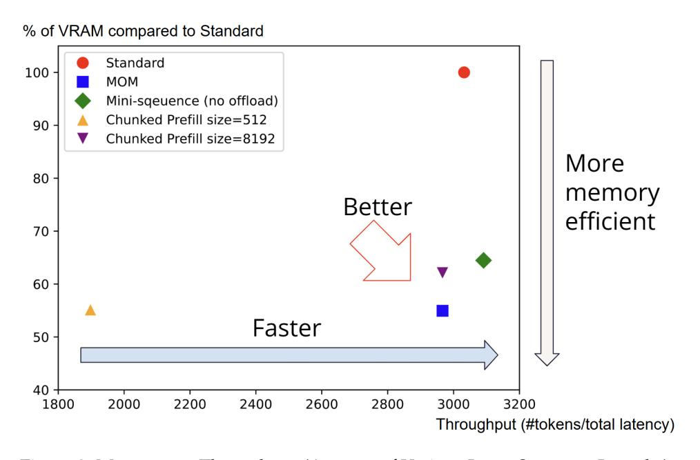

# **MOM: Memory-Efficient Offloaded Mini-Sequence Inference for Long Context Language Models**

**Junyang Zhang**∗ **Tianyi Zhu**∗

California Institute of Technology California Institute of Technology junyangz@caltech.edu tzhu@caltech.edu

California Institute of Technology California Institute of Technology chengluo@caltech.edu anima@caltech.edu

**Cheng Luo Anima Anandkumar**†

## **Abstract**

Long-context language models exhibit impressive performance but remain challenging to deploy due to high GPU memory demands during inference. We propose Memory-efficient Offloaded Mini-sequence Inference (MOM), a method that partitions critical layers into smaller "mini-sequences" and integrates seamlessly with KV cache offloading. Experiments on various Llama, Qwen, and Mistral models demonstrate that MOM reduces peak memory usage by over 50% on average. On Meta-Llama-3.2-8B, MOM extends the maximum context length from 155k to 455k tokens on a single A100 80GB GPU, while keeping outputs identical and not compromising accuracy. MOM also maintains highly competitive throughput due to minimal computational overhead and efficient last-layer processing. Compared to traditional chunked prefill methods, MOM achieves a 35% greater context length extension. More importantly, our method drastically reduces prefill memory consumption, eliminating it as the longstanding dominant memory bottleneck during inference. This breakthrough fundamentally changes research priorities, redirecting future efforts from prefill-stage optimizations to improving decode-stage residual KV cache efficiency.

## **1 Introduction**

The Transformer architecture [\(Vaswani et al.,](#page-12-0) [2017\)](#page-12-0) revolutionized natural language processing through self-attention, enabling models to capture long-range dependencies. Despite their impact, standard Transformers have inherent limitations processing long sequences due to quadratic memory complexity—a challenge that has driven extensive research into efficient Transformer variants [\(Tay et al.,](#page-12-1) [2020\)](#page-12-1) and architectures tailored for long documents like Longformer [\(Beltagy et al.,](#page-10-0) [2020\)](#page-10-0). Concurrently, system-level innovations such as FlashAttention [\(Dao et al.,](#page-10-1) [2022;](#page-10-1) [Dao,](#page-10-2) [2023\)](#page-10-2), ZeRO [\(Rajbhandari et al.,](#page-11-0) [2020\)](#page-11-0), Megatron-LM [\(Shoeybi et al.,](#page-12-2) [2019\)](#page-12-2), DeepSpeed [\(Rasley et al.,](#page-11-1) [2020\)](#page-11-1), and parameter-efficient fine-tuning methods like LoRA [\(Hu et al.,](#page-10-3) [2022\)](#page-10-3) have advanced model scalability and training efficiency.

Recently, test-time computation has gained prominence, driven by techniques like few-shot learning [\(Brown et al.,](#page-10-4) [2020\)](#page-10-4), beam search [\(Snell et al.,](#page-12-3) [2024\)](#page-12-3), and prompt engineering strategies such as chain-of-thought prompting [\(Wei et al.,](#page-12-4) [2022\)](#page-12-4). These techniques shift computational demands from training to inference. Large language models like ChatGPT now dynamically expand context, highlighting the critical need for efficient GPU memory management during inference—especially when sophisticated decoding methods like beam search, lookahead search [\(Snell et al.,](#page-12-3) [2024\)](#page-12-3), Tree of Thoughts [\(Yao et al.,](#page-12-5) [2023\)](#page-12-5), and Forest of Thoughts [\(Bi et al.,](#page-10-5) [2024\)](#page-10-5) significantly increase memory usage.

Consumer-grade GPUs typically have limited memory, while enterprise ones with more memory usually come at a much higher price tag. This highlights the need to optimize

∗Equal contribution.

†Corresponding author. Email: anima@caltech.edu

Figure 1: GPU Memory Comparison of Llama 3 Standard vs. Llama 3 with MOM for a 64K Input Context.

VRAM usage for effective performance on affordable hardware. Typically, the MLP layers dominate peak memory usage due to large intermediate activations and computational intensity. Although attention layers also contribute, optimizations such as FlashAttention, Linformer [\(Wang et al.,](#page-12-6) [2020\)](#page-12-6), Reformer [\(Kitaev et al.,](#page-11-2) [2020\)](#page-11-2), Multi-Query Attention (MQA) [\(Shazeer,](#page-11-3) [2019\)](#page-11-3), and Grouped-Query Attention (GQA) [\(Ainslie et al.,](#page-10-6) [2023\)](#page-10-6) mitigate their impact.

Mini-Sequence Transformer (MST) [\(luo et al.,](#page-11-4) [2024\)](#page-11-4) leverages gradient checkpointing [\(Chen](#page-10-7) [et al.,](#page-10-7) [2016\)](#page-10-7) and gradient accumulation [\(You et al.,](#page-12-7) [2019\)](#page-12-7) to partition large intermediate values into smaller mini-sequences. MST significantly reduces peak GPU memory usage but is training-focused and unsuitable for efficient inference due to overhead from gradient operations. HEADINFER [\(Luo et al.,](#page-11-5) [2025\)](#page-11-5) further reduces GPU memory demands by employing a fine-grained, head-wise KV cache offloading strategy; however, it suffers from significant decoding speed degradation (7–8 times slower than standard LLMs).

**Our Approach**: Recognizing these challenges, we propose Memory-efficient Offloaded Minisequence Inference (MOM), which offloads the KV cache from GPU to CPU during prefill and reloads it during decode stage, while internally partitioning the inputs to MLP layers into smaller mini-sequences and processing only one token at the final MLP and LM head to improve throughput and memory efficiency. As illustrated in Figure [1,](#page-1-0) MOM effectively eliminates prefill memory as the dominant bottleneck, shifting future research focus to the decode stage, where residual KV cache optimization becomes essential. Compared to conventional chunked prefill strategies [\(Agrawal et al.,](#page-9-0) [2024\)](#page-9-0), which suffer from repeated forward-pass overhead, MOM processes internal mini-sequences efficiently in a single forward pass, integrating seamlessly with KV cache offloading. Also because Mini-sequence operates exclusively on the MLP and LM head and leaves the attention layers unchanged, KV cache offloading can be seamlessly integrated with Mini-sequence.

We conduct extensive experiments on Llama [\(Touvron et al.,](#page-12-8) [2023\)](#page-12-8), Qwen [\(Alibaba,](#page-10-8) [2024\)](#page-10-8), and Mistral [\(AI & NVIDIA,](#page-10-9) [2024\)](#page-10-9), evaluating baseline, offloading alone, Mini-sequence alone, and combined Mini-sequence with offloading (MOM) configurations on a NVIDIA A100 80GB GPU. For example, MOM reduces Meta-Llama-3-8B peak memory usage from 72 GB to 35 GB for a 155K-token context, extending maximum context length to 455K tokens—35% greater than chunked prefill methods. Besides, as shown in Figure [2,](#page-2-0) its throughput degradation is minimal. Conventional chunked prefill, if combined with cache offloading, would suffer a throughput reduction of more than 75%, making this combination extremely impractical due to data transfer overhead. Interestingly, Mini-sequence inference

without offloading even improves throughput and token generation speed, due to more efficient last-layer processing, better GPU cache utilization, and reduced memory allocation overhead. We hypothesize that shorter sequence chunks fit better into GPU cache than longer sequences, enabling faster processing and thus supporting longer contexts and complex decoding without sacrificing speed.

Figure 2: Memory vs. Throughput (Average of Various Input Sequence Lengths).

Our contributions include:

- **Memory Efficiency:** MOM reduces peak GPU memory usage by over 50%.
- **Extended Context Length:** Extends context lengths from 155K to 455K tokens.
- **High Throughput:** Achieves competitive token generation speeds.
- **Mathematical Equivalence:** Preserves output content without accuracy degradation.
- **Outperforms Chunked Prefill:** Offers 35% longer context extension without repeated forward pass overhead.
- **Ease of Use:** Implementation-agnostic with minimal changes required for frameworks like Hugging Face [\(Jain,](#page-10-10) [2022\)](#page-10-10).

The implementation is available on GitHub: <https://github.com/TianyiZhu877/MOM>

