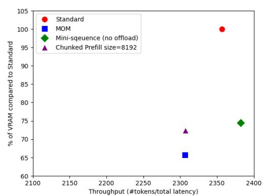
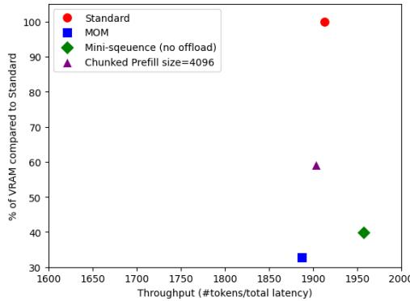

# C Breakdown of Prefill and Decoding Speed of Different Methods

Inference in a transformer-based language model consists of prefilling and decoding stages.

**Prefilling** This phase processes the input context before generating the first token, during which users experience a delay. This is know as the TTFT (Time to Fisrt Token), and measured for the methods discussed.

Table 3: Time to Fisrt Token (s, lower is faster)

| Context Length (#Tokens): | 48000  | 80000  | 112000 | 144000 |
|---------------------------|--------|--------|--------|--------|
| Standard                  | 6.194  | 12.982 | 22.527 | 34.907 |
| (prefill only) Offload    | 6.869  | 14.649 | 24.458 | 39.262 |
| Mini-sequence             | 5.767  | 12.668 | 22.091 | 33.989 |
| MOM                       | 6.756  | 15.109 | 24.037 | 37.284 |
| Chunked Prefill size=512  | 10.526 | 24.318 | 45.321 | 72.706 |
| Chunked Prefill size=8192 | 6.286  | 13.579 | 23.530 | 35.851 |

The chunked prefill method splits the context into smaller chunks to reduce memory usage, but excessively small chunks significantly increase prefilling time. To balance efficiency and speed, a chunk size of 8,192 tokens is chosen in this study.

**Decoding** After the first token is generated, the model produces subsequent tokens autoregressively at the measurable rate. No significant speed drop is observed across different methods in this stage.

Table 4: Decode Speed, Mini-sequence vs. Chunked Prefill (Tokens/s, higher is faster)

| Context Length (#Tokens): | 48000  | 80000  | 112000 | 144000 |
|---------------------------|--------|--------|--------|--------|
| Standard                  | 25.804 | 18.448 | 14.263 | 11.630 |
| (prefill only) Offload    | 25.854 | 18.369 | 14.272 | 11.588 |
| Mini-sequence             | 25.806 | 18.457 | 14.279 | 11.607 |
| MOM                       | 25.712 | 18.455 | 14.275 | 11.600 |
| Chunked Prefill size=512  | 25.837 | 18.452 | 14.276 | 11.606 |
| Chunked Prefill size=8192 | 25.868 | 18.379 | 14.220 | 11.555 |

## **D Testing Other LLM Models besides Llama**

To ensure the results generalize well, we tested MOM on additional models, including Qwen2.5-7B [\(Alibaba,](#page-10-8) [2024\)](#page-10-8) and Mistral NeMo (12B) [\(AI & NVIDIA,](#page-10-9) [2024\)](#page-10-9), analyzing their speed vs. memory trade-off and comparing them with other optimization methods.

Figure 10: Memory Use vs. Throughput, Qwen2.5-7B

Figure 11: Memory Use vs. Throughput, Mistral NeMo

The results align with our findings on Llama 3.2, confirming that MOM achieves the best memory usage optimization with minimal speed overhead.

## **E Testing on Different Hardware Setup and with Quantization**

In practice, most individual users perform inference on consumer-grade hardware with quantization. To reflect this, we include tests on an RTX 4080 mobile 12GB GPU, using bitsandbytes [\(Dettmers,](#page-10-15) [2022\)](#page-10-15) 4-bit quantization. Due to VRAM limitations, we tested with context lengths of [16,000, 20,000, 24,000] tokens.

Figure 12: Memory Use vs. Throughput, Llama3.2-3B

Figure 13: Memory Use vs. Throughput, Qwen2.5-3B

The results align with our findings with A100 GPU, reinforcing the effectiveness of MOM across different environments and practical setups.