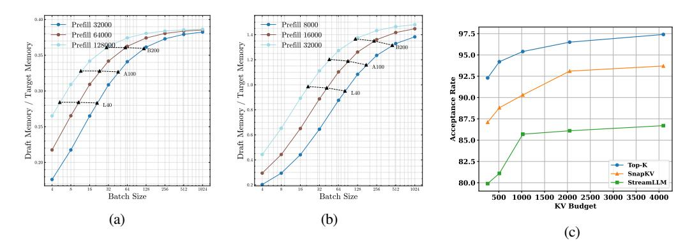
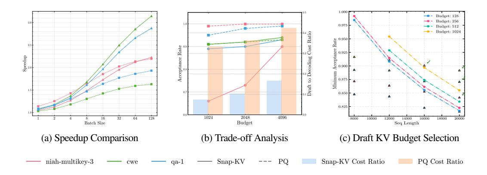

# • For $S < S_{\text{inflection}}$ :

In this regime, as batch size increases, decoding becomes more compute-bound. Large batches can saturate the available compute, making verification relatively more expensive, as illustrated in Fig. 2b. The cost ratio  $T_V(\gamma)/T_T$  increases significantly for 1000 token long sequences. If the draft token acceptance rate is low, the target model spends considerable time verifying incorrect speculations, reducing SD efficiency. Our theoretical estimate in this regime aligns with (Liu et al., 2024a). The expected speed-up with speculative decoding decreases with batch size for context lengths below the critical sequence length.

### • For $S \ge S_{\text{inflection}}$ :

In this regime, speculative decoding can provide speedup for large batches, and this speedup even tends to increase with batch size when we use some intelligent drafting strategies. This happens as a combined effect of how verification to decoding cost ratio  $(T_V(\gamma)/T_T)$  and draft to target cost ratio  $(T_D/T_T)$  evolve with increasing batch size, as shown in Fig. 2b and 2a.

For long sequences, KV cache loading becomes the primary bottleneck rather than compute (Sun et al., 2024a; Aminabadi et al., 2022) and the target model shifts towards memory bound regime, as shown in 3c. Because KV memory bottleneck scales with batch-size, this shift is sustained even for large batches. As the verification and decoding phases share the same KV loading cost, the cost ratio  $T_V(\gamma)/T_T$  remains close to 1.

However, the cost ratio  $T_V(\gamma)/T_T$  still increases monotonically with batch size and cannot explain how we can achieve higher speedups for larger batches. The draft to target cost ratio  $(T_D/T_T)$  plays an important role here. If the KV cache size of the draft model increases slower than target model, the cost ratio  $T_D/T_T$  will decrease for larger batches. That is because the target model inference will be more dominated by the KV cache bottleneck rather than the draft.

As Figure 2c illustrates in the case of <code>LLaMA-3.1-8B</code> , the theoretical speedup of speculative decoding is expected to improve with increasing batch size for longer sequence lengths. The speedup decreases with batch size for S < 4000, but for S > 4000, the speedup increases with batch size.

As illustrated in Figure 3c, this critical sequence length  $S_{\rm inflection}$  depends on both the model's FLOPS-to-memory ratio and the GPU's FLOPS-to-memory bandwidth ratio. For a device with higher FLOPS-to-memory bandwidth ratio, we expect a lower  $S_{\rm inflection}$ . Models also affect this critical sequence length. For instance, GQA model like LlaMA-3.1-8B tends to have higher  $S_{\rm inflection}$  due to Grouped Query Attention (GQA), which requires a larger sequence length to achieve the same KV memory footprint.

#### 3.3 COMPRESSED KV CACHE ENABLES MORE EFFICIENT SPECULATION

In this section, we explain why KV compression is preferred over lightweight draft models for speculation in long-context, large batch-size scenario. There are primarily two reasons,

KV cache grows beyond the parameter memory footprint: Unlike parameter memory, the KV cache size grows linearly with batch size. If we use LLaMA-3.1-8B as a draft for LLaMA-3.1-70B and

Figure 4: (a, b) Draft/target memory ratio vs batch size across different sequence lengths for LLaMA-3.1-8B /LLaMA-3.1-70B and LLaMA-2-7B /LLaMA-2-70B models. (c) LLaMA-3.1-8B self-speculation acceptance rate of different drafting strategy versus KV budget. Target KV length: 32000.

LLaMA-2-7B for LLaMA-2-70B , the draft models can occupy up to  $38 \sim 140\%$  memory footprint of target models (Figures 4a and 4b) due to the fact that  $\dim_{kv}/\dim_{model}$  is higher. Hence, in this regime, small draft models are not sufficient and compressed KV-based drafting is quite beneficial(Sun et al., 2024a). This can be seen in Figure 3a, which illustrates how  $T_D/T_T$  for fixed KV size draft self-speculation with LL aMA-3.1-8B approaches 0 with increasing sequence length for batch size 256.

**KV** compression achieves a better token acceptance rate than model compression: A high draft token acceptance rate is critical to restrict the number of costly verification steps while serving large batches. Interestingly, we see that KV cache compression can be a more cost-effective way to improve the acceptance rate of draft tokens, especially in a high batch size long-context regime. Figure 1c illustrates this phenomenon that if a target LLM speculates itself with a sparsified version of its own KV cache, then it can achieve acceptance rates higher than those of small draft models with a full KV cache.

In summary, a draft model with compressed KV cache achieves two important factors for higher speedup in a long-context scenario: low draft cost and high acceptance rate. Figures 7b and 7c empirically illustrate the efficacy of this drafting strategy over standard SD with a small draft model in achieving higher speedups.

#### 4 MAGICDEC

In this section, we present the trade-off analysis MagicDec performs to identify the correct drafting strategy. In Section 3.3, we have motivated the reason behind adopting compressed KV-based drafting in this regime. However, there are three different factors that we need to consider to effectively leverage KV compression - (a) draft model size, (b) draft KV cache size or draft KV budget, and (c) KV compression algorithm. All three factors are to be considered to strike the perfect balance between draft cost and acceptance rate.

#### 4.1 GENERAL FORMULATION OF SPEEDUP WITH COMPRESSED KV-BASED DRAFTING

To begin with, we give a general formulation of speedup obtained with compressed KV-based drafting. The following analysis considers sparse KV selection algorithms; however, it can be easily extended to other KV compression methods (Hooper et al., 2024; Liu et al., 2024b; Singhania et al., 2024). The draft cost for sparse-KV methods depends on two main components: (1) draft model decoding cost, and (2) the cost of KV selection. For a given KV sparsification strategy (select) with a fixed KV budget of K, the selection cost is denoted as  $T_{select}(B,S,K)$ , while the decoding time for K tokens is  $T_D(B,K)$ . The total time taken by the draft using this KV strategy with KV cache budget K is:

$$T_{D.select_{\mathsf{v}}}(B,S) = T_{D}(B,K) + T_{select}(B,S,K) \tag{3}$$

Using this as the total draft decoding time in equation 2, our final objective becomes

$$\min_{T_{select}, K, \gamma, \alpha} \left[ \frac{T_{Avg}^{SD}}{T_T} \right] = \min_{T_{select}, K, \gamma, \alpha} \left[ \frac{1}{\Omega(\gamma, \alpha)} \left( \frac{\gamma \cdot (T_D(B, K) + T_{select}(B, S, K))}{T_T(B, S)} + \frac{T_V(B, S, \gamma)}{T_T(B, S)} \right) \right]$$
(4)

Figure 5: Comparative analysis of two KV selection algorithms - SnapKV (Li et al., 2024)(static KV selection) and PQCache (Zhang et al., 2024) (dynamic KV selection) on 3 Ruler tasks - *needle in a haystack with passkeys 3, common word extraction, question answering 1* (context length = 32,000). (a) Expected speed-up comparison between the two KV selection methods based on MagicDec evaluation framework. (b) Trade-off analysis between Draft-to-target cost ratio and acceptance rate for SnapKV and PQCache methods. (c) Minimum acceptance rates required to be achieved by self-speculation with different draft KV cache sizes to achieve 1.8x speedup over standard autoregressive decoding by Llama-3.1-8B. The actual acceptance rates obtained for PG-19 dataset are marked with respective colors. The admissible budgets for each sequence length are ticked right.

Now we discuss in detail the three main factors that decide the total draft decoding time  $T_{D,select_K}$  and the final speedup.

#### 4.2 DRAFT MODEL SIZE SELECTION

Even with a compressed KV cache, the draft model weights can play a role in deciding the best performance. The draft model parameter loading is the major part of draft cost when KV cache size is small. Usually at lower batch sizes, a small draft model with compressed KV cache can outperform self-speculation because of a lower draft to target cost ratio. When batch size and sequence length are relatively small, the parameter loading cost can impede the draft performance. Moreover, for smaller batches, the token acceptance rate requirement can be relaxed to favor a much more efficient draft model. However, beyond a certain batch size, self-speculation can become more efficient because of its higher acceptance rate, as shown in Fig. 7c.

### 4.3 DRAFT KV BUDGET SELECTION

For a fixed draft model and KV compression algorithm, the optimal draft KV cache size varies across different batch sizes and context lengths. Hence, before selecting the optimal KV compression algorithm, we need to find the respective optimal KV budgets of the candidate algorithms. We illustrate the importance of optimizing the KV budget of static KV selection algorithms for self-speculation in Figure 5c. Batches of different sequence lengths and batch sizes require different minimum acceptance rates to achieve any speedup via speculative decoding. Similarly, different KV budgets and different draft model would have different draft cost-acceptance rate trade-offs. This plot recommends the admissible draft KV budgets that reach the required minimum acceptance rate. This trade-off analysis is particularly useful for serving heterogeneous batches with different sequence lengths. Different sequences in the same batch can leverage different draft KV cache sizes to achieve the required speedup.

#### 4.4 COMPARATIVE STUDY ON KV SELECTION STRATEGIES

Finally, MagicDec has to choose among different kinds of KV selection algorithms to regulate the search cost  $T_{select}$ . Although top-k attention can achieve very high acceptance rate with a much smaller KV cache budget, it is not a practical draft option because of its prohibitively high KV selection cost.

There are many potential alternatives to top-k attention, but determining the optimal one is not straightforward. There are primarily two kinds of KV selection algorithms - (a) dynamic KV selection algorithms such as (Tang et al., 2024; Zhang et al., 2024), (b) static KV selection algorithms such as (Xiao et al., 2024b; Yang et al., 2024; Li et al., 2024). The first kind of algorithms dynamically searches the KV cache for each input query, attempting to find the top k nearest neighbors. Although these methods can achieve higher acceptance rates, they incur substantial search costs. Conversely, static KV selection methods pre-gather a sparse KV

cache for attention approximation during generation. This approach eliminates search overhead but typically results in lower acceptance rates.

Static vs Dynamic: We evaluate state-of-the-art KV selection strategies using both our theoretical framework and empirical acceptance rates from self-speculation with the LLaMA-3.1-8B model on various Ruler tasks [\(Hsieh et al., 2024\)](#page-11-17). Our analysis includes both static (e.g., StreamingLLM [\(Xiao et al., 2024b\)](#page-12-4), SnapKV [\(Li et al., 2024\)](#page-11-11)) and dynamic (e.g., PQCache [\(Zhang et al., 2024\)](#page-12-7), TopK) KV selection algorithms, exploring different KV budgets and speculation lengths to estimate optimal theoretical speedups.

Figure [5](#page-6-1) illustrates the trade-off between two representative KV sparsification algorithms, SnapKV and PQCache, and their respective theoretical speedups on three distinct Ruler tasks: *needle in a haystack with passkeys 3* (niah-multikeys-3), *common word extraction* (cwe), and *question answering 1* (qa-1). SnapKV[2](#page-7-1) , a static algorithm, has a lower draft-to-target cost ratio compared to PQCache, as PQCache incurs a batch-size-dependent KV selection cost Tselect.

When the acceptance rates of static and dynamic methods are similar, the static method tends to dominate, as seen in the *cwe* and *qa-1* tasks. However, for the *niah-multikeys-3* task, PQCache benefits significantly from its higher acceptance rate. With an acceptance rate close to 1, PQCache can leverage longer speculation lengths, which significantly reduces the objective function in equation [4.](#page-5-1) Nevertheless, with increasing batch-size, KV search cost dominates again and the static algorithm starts to outperform the dynamic one.

