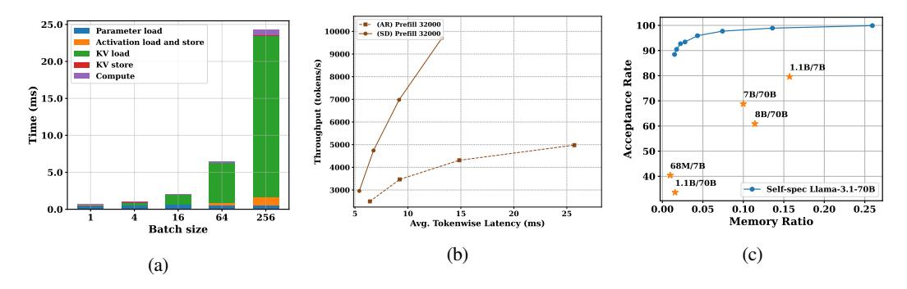

# 1 INTRODUCTION

The emergence of extremely long-context Large Language Models (LLMs) [\(AI@Meta, 2024;](#page-10-0) [QwenTeam,](#page-11-0) [2024;](#page-11-0) [Liu et al., 2023\)](#page-11-1) has led to the popularity of long-context applications such as retrieval augmented generation [\(Lewis et al., 2021\)](#page-11-2), code generation [\(AWS, 2024;](#page-10-1) [Chen et al., 2021\)](#page-10-2) and document summarization. Low latency and high throughput are both crucial for serving these long-context LLMs – low latency ensures a positive user experience in interactive applications like chatbots [\(Achiam et al., 2023;](#page-10-3) [Deepmind, 2024\)](#page-10-4), while high throughput amortizes serving costs.

However, optimizing both latency and throughput in LLM serving presents significant challenges. Speculative decoding (SD)[\(Leviathan et al., 2022;](#page-11-3) [Xia et al., 2023;](#page-12-0) [Chen et al., 2023\)](#page-10-5) can reduce latency by using a smaller model to predict multiple tokens ahead followed by verification by the target model. But this approach becomes inefficient with large batch sizes because of increased verification cost[\(Liu et al., 2024a;](#page-11-4) [Su et al.,](#page-11-5) [2023\)](#page-11-5), as shown in Fig. [7a.](#page-9-0) For small batches, the main performance bottleneck is the parameter loading cost, which can be amortized by the verification process across the tokens to be verified at the expense of increased computation. However, with large batches, LLMs become compute bound, making verification significantly costly because of its compute-hungry nature. Additionally, if the smaller model's predictions do not align well with the target model, frequent costly verifications are needed. Consequently, the usage of SD in high batch size regime is discouraged by existing works[\(Liu et al., 2024a;](#page-11-4) [Su et al., 2023;](#page-11-5) [Miao et al., 2023\)](#page-11-6). On the other hand, techniques like [\(Kwon et al., 2023;](#page-11-7) [Yu et al., 2022;](#page-12-1) [Agrawal et al., 2024b\)](#page-10-6) improve throughput by accommodating larger batches, but at the cost of increased token-wise latency. While techniques such as quantization, pruning and KV cache eviction [\(Frantar et al., 2023;](#page-10-7) [Xiao et al., 2024a;](#page-12-2) [Hooper et al., 2024;](#page-10-8) [Ma et al., 2023;](#page-11-8) [Sun et al., 2024b\)](#page-11-9) can improve both throughput and latency, they typically result in lower quality model outputs.

Based on these challenges, we pose the following question:

∗Equal contribution

Figure 1: (a) Time breakdown of LLaMA-3.1-8B vs batch size (input length=16384, hardware=8xH100s). (b) Throughput of autoregressive decoding and StreamingLLM-based self-speculation of LLaMA-3.1-8B against per-token latency for prompt length of 32k. (c) Draft token acceptance rate comparison for LLaMA-3.1-70B. Self-speculation using Top-k attention achieves a much higher acceptance rate than other draft-target pairs, even with lower memory ratio. The x-axis represents the ratio of draft memory footprint to target memory footprint.

Can we simultaneously improve throughput and latency without sacrificing accuracy, particularly for long sequences?

We answer with a resounding yes! For large batches of long sequences, we show that SD can be used more effectively to improve both throughput and latency without degradation of the output quality. We base our hypothesis on the following interesting insights:

- (1) KV Cache Is The Dominant Bottleneck In Large batch size Long-context Regime: In long-context and large batch size regime, the KV cache outgrows the memory footprint of the model parameter and continues to increase with batch size. Computation also increases with batch size, but due to the high peak FLOPS-to-memory bandwidth ratio of modern GPUs, the KV loading time increases much more than former for larger batches, making LLM inference more memory-bound, as shown in Fig. 1a (Yuan et al., 2024).
- (2) SD Can Improve Throughput Only Beyond a Critical Sequence Length: While existing research(Liu et al., 2024a; Su et al., 2023) suggests that SD is inefficient for large batches due to high verification costs, this limitation only applies to very short sequences. Because with short sequences, increasing the batch size makes computational costs the primary bottleneck, which is prohibitive for an efficient verification process. However, once sequences exceed a certain critical length (which varies based on the model and hardware), the KV loading cost becomes the dominant factor, even for large batches. At this point, SD becomes effective again because the computational overhead of verification becomes less significant compared to the KV loading costs, which can be amortized across the tokens to be verified.
- (3) Compressed KV Cache Enables More Efficient Speculation: Token acceptance rate is crucial for SD in large batch processing to minimize costly verification steps. Our research found that compressing the Draft KV cache leads to higher acceptance rates than compressing model weights. To evaluate model compression only, we test different draft-target pairs on PG-19 (Rae et al., 2019) sequences of length only 256, to restrict the KV cache impact. For KV compression, we tested LLaMA-3.1-70B on longer sequences (4,000-100,000 tokens)1 using Top-K selection for KV sparsification. Fig. 1c illustrates that model compression alone is unable to reach 90% acceptance rate, while KV compression achieved significantly higher rates under similar memory constraints. This advantage becomes even more significant with larger batch sizes, offering a promising new direction for improving the batch-processing efficiency speculative decoding.

Building upon these insights, our work **MagicDec** illustrates that SD can improve speedup even for large batches by utilizing KV compression, contrary to prior belief. As shown in Fig. 1b, under long context-length, compressed KV-based self-speculation can improve throughput and latency at the same time in all spectrum, without hurting generation quality. Furthermore, MagicDec evaluates different KV compression-based drafting methods to determine the optimal approach based on the specific model, hardware, and task requirements. We structure the paper as follows.

• In Section 3.1, we theoretically analyze the factors that decide the efficiency of speculative decoding. Section 3.2 discusses how the performance bottlenecks in LLM inference shift with batch size and sequence length, and what are its implications on SD's batch-processing efficiency. In the light of this study, we discuss the challenges involved with conventional SD in large batch setting and how it can be overcome

&lt;sup>1batch size is set to 1 to nullify the effect of batch size on KV cache size

by KV sparsification based drafting. Additionally, we introduce the concept of the critical sequence length beyond which SD can achieve higher speedups for larger batches contrary to prior studies [\(Liu et al., 2024a;](#page-11-4) [Su et al., 2023;](#page-11-5) [Miao et al., 2023\)](#page-11-6).

- In Section [3.3,](#page-4-0) we show why compressing the KV cache is crucial for effective batch processing. Our experimental results demonstrate that this approach achieves higher acceptance rates and, consequently, better batch performance compared to using parameter-efficient draft models. Section [4.4](#page-6-0) discusses the trade-off between draft cost and acceptance rate for different static and dynamic KV sparsification algorithms on different kinds of tasks.
- Finally, in Section [5](#page-7-0) we provide a comprehensive empirical evaluation across different hardware setups and tasks to show the effectiveness of our theoretical analysis and method. We demonstrate that our approach achieves a 2.51x speedup in large batch settings for LLaMA-3.1-8B on 8xH100 GPUs, significantly improving both throughput and latency over traditional autoregressive decoding ( [§5\)](#page-7-0).

