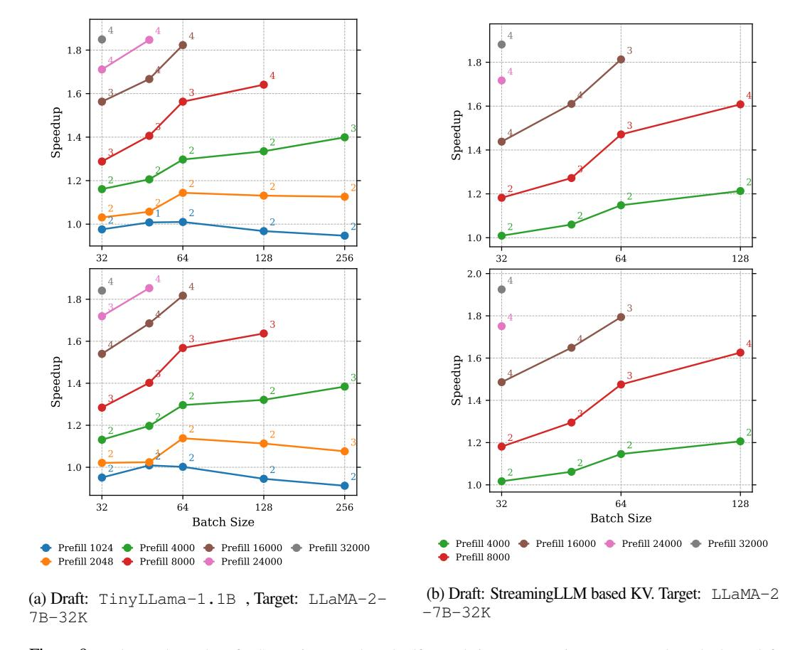

# A.6 TINYLLAMA1.1B-LLAMA2-7B-32K RESULTS

We also test the non-GQA model LLaMA-2-7B-32K for both StreamingLLM-based self-speculation and small draft model with StreamingLLM KV cache. Due to the lower FLOPS to memory ratio of non-GQA model, it tends to achieve higher speedup than GQA model under the same setting.

Figure 9: End-to-end speedups for StreamingLLM-based self-speculation across various compressed KV budgets (left: 256, right: 512) on PG-19. Annotations indicate  $\gamma_{\text{optimal}}$ , which is the value corresponding to the highest speedup achieved. Experiments are conducted on 8xA100 with 8-way tensor parallelism. Raw data can be found in A.2.