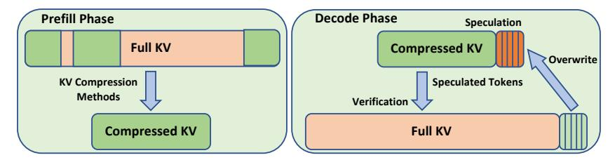

# A.1 SYSTEM IMPLEMENTATION

Figure 8: Self-Speculation System Design. We demonstrate using a static KV compression method.

The design of our speculative decoding system is shown in Fig. [8,](#page-12-12) demonstrating the use of a static KV compression method. The static compressed KV is generated during prefill phase and used for drafting. We implement the speculative decoding system on both state-of-the-art inference framework MLC-LLM [\(team,](#page-12-13) [2023\)](#page-12-13) and a self-implement inference backend. The main results are obatined from our self-implemented backend. The comparison of our backend and MLC-LLM can be found in [A.3.](#page-13-1)

The self-implement inference backend is built on GPT-Fast [\(pytorch-labs, 2023\)](#page-11-18), with Flashinfer [\(flashinfer-ai\)](#page-10-15) accelerating attention computation. We use torch.compile to compile the model and utilize Triton-based matrix multiplication to accelerate the MLP layers. We use Pytorch CUDA graphs to reduce CPU kernel launch overhead. These optimizations help minimize overhead and improve speedup. We also implement tensor parallelism for the embedding layer to further accelerate drafting.

### A.2 RESULTS OF VARIOUS BATCH SIZE AND CONTEXT LENGTH ON A100

We show the raw data points we collected when running speculative decoding on the self-implement backend to support our previous discussion. We sweep the batch size and sequence lengths, and compare the speedup of different drafting strategy for different models. We ran all these experiments on 8 Nvidia A100 GPU with 8-way Tensor Parallelism.

| (a) LLaMA-2-7B-32K , TinyL |  |
|----------------------------|--|
| Lama-1.1B                  |  |

| S        | B  | γTD TV                          |            | Ω TAR TSD        |            | x    |
|----------|----|---------------------------------|------------|------------------|------------|------|
| 1024     | 32 | 8.21                            | 9.55 2.19  | 8.27             | 8.70       | 0.95 |
| 1024     | 48 | 8.46                            | 10.66 2.19 | 9.41             | 9.33       | 1.01 |
| 1024     | 64 | 9.26                            |            | 13.05 2.19 10.83 | 10.80 1.00 |      |
|          |    | 1024 128 12.04 18.87 2.19 14.02 |            |                  | 14.83 0.94 |      |
| 4000     | 32 | 8.46                            |            | 13.21 2.19 11.89 | 10.52 1.13 |      |
| 4000     | 48 | 8.71                            |            | 16.19 2.19 14.39 | 12.02 1.20 |      |
| 4000     | 64 | 9.35                            |            | 21.83 2.19 19.28 | 14.88 1.30 |      |
|          |    | 4000 128 12.31 33.82 2.19 28.77 |            |                  | 21.78 1.32 |      |
| 8000     | 32 | 8.61                            |            | 18.40 2.18 16.53 | 13.02 1.27 |      |
| 8000     | 48 | 8.91                            |            | 23.67 2.18 21.45 | 15.58 1.38 |      |
| 8000     | 64 | 9.58                            |            | 34.32 2.18 31.49 | 20.80 1.51 |      |
|          |    | 8000 128 12.54 53.78 2.18 49.89 |            |                  | 31.25 1.60 |      |
| 16000 32 |    | 8.78                            |            | 27.79 2.17 26.28 | 17.46 1.50 |      |
| 16000 48 |    | 9.33                            |            | 38.29 2.18 35.83 | 22.52 1.59 |      |
| 16000 64 |    | 9.92                            |            | 58.14 2.17 55.08 | 31.99 1.72 |      |
| 24000 32 |    | 8.68                            |            | 37.57 2.16 35.70 | 22.05 1.62 |      |
| 32000 32 |    | 8.83                            |            | 47.35 2.17 44.94 | 26.55 1.69 |      |

(b) LLaMA-2-7B-32K Self Speculation

| S        | B  | γTD TV                          |  | Ω TAR TSD              |            | x |
|----------|----|---------------------------------|--|------------------------|------------|---|
| 4000     | 32 |                                 |  | 15.42 13.17 2.56 11.89 | 11.69 1.02 |   |
| 4000     | 48 |                                 |  | 16.96 16.38 2.56 14.39 | 13.55 1.06 |   |
| 4000     | 64 |                                 |  | 19.75 22.01 2.57 19.28 | 16.82 1.15 |   |
|          |    | 4000 128 25.82 33.79 2.56 28.77 |  |                        | 23.86 1.21 |   |
| 8000     | 32 |                                 |  | 15.70 18.23 2.53 16.53 | 13.99 1.18 |   |
| 8000     | 48 |                                 |  | 18.44 24.32 2.53 21.45 | 17.50 1.23 |   |
| 8000     | 64 |                                 |  | 20.03 34.30 2.53 31.49 | 22.05 1.43 |   |
|          |    | 8000 128 26.10 53.69 2.52 49.89 |  |                        | 32.25 1.55 |   |
| 16000 32 |    |                                 |  | 16.06 27.54 2.50 26.28 | 18.02 1.46 |   |
| 16000 48 |    |                                 |  | 19.75 39.03 2.50 35.83 | 24.15 1.48 |   |
| 16000 64 |    |                                 |  | 20.87 58.15 2.51 55.08 | 32.16 1.71 |   |
| 24000 32 |    |                                 |  | 15.80 37.06 2.49 35.70 | 21.77 1.64 |   |
| 32000 32 |    |                                 |  | 16.19 46.55 2.50 44.94 | 25.64 1.75 |   |
|          |    |                                 |  |                        |            |   |

(c) LLaMA-3.1-8B Self Speculation

| S         | B  | γTD TV                           |                  | Ω TAR TSD              |            | x    |
|-----------|----|----------------------------------|------------------|------------------------|------------|------|
| 4000      | 32 |                                  | 13.16 10.32 2.54 | 8.83                   | 9.78       | 0.90 |
| 4000      | 64 |                                  |                  | 16.48 13.55 2.54 10.07 | 12.36 0.81 |      |
| 4000      |    | 128 23.41 19.77 2.54 13.42       |                  |                        | 17.70 0.76 |      |
| 4000      |    | 256 39.29 35.05 2.53 23.23       |                  |                        | 30.46 0.76 |      |
| 8000      | 32 |                                  | 13.28 11.34 2.50 | 9.90                   | 10.40 0.95 |      |
| 8000      | 64 |                                  |                  | 16.98 16.06 2.51 14.16 | 13.72 1.03 |      |
| 8000      |    | 128 23.59 24.84 2.51 18.53       |                  |                        | 19.97 0.93 |      |
| 8000      |    | 256 39.32 46.44 2.51 35.35       |                  |                        | 34.99 1.01 |      |
| 16000     | 32 |                                  |                  | 14.46 14.00 2.47 11.93 | 12.10 0.99 |      |
| 16000     | 64 |                                  |                  | 18.00 21.15 2.48 17.17 | 16.40 1.05 |      |
|           |    | 16000 128 25.77 34.82 2.46 28.00 |                  |                        | 25.36 1.10 |      |
| 32000     | 32 |                                  |                  | 14.12 19.04 2.46 17.13 | 14.05 1.22 |      |
| 32000     | 64 |                                  |                  | 19.08 30.86 2.45 26.99 | 21.03 1.28 |      |
|           |    | 32000 128 28.26 54.98 2.45 47.24 |                  |                        | 34.94 1.35 |      |
| 64000     | 32 |                                  |                  | 14.92 28.88 2.40 26.96 | 18.91 1.43 |      |
| 64000     | 64 |                                  |                  | 18.25 50.19 2.40 46.09 | 29.22 1.58 |      |
| 100000 32 |    |                                  |                  | 15.10 39.84 2.45 37.70 | 23.05 1.64 |      |
|           |    |                                  |                  |                        |            |      |

Table 3: Comparison of results for different LLaMA models and configurations (budget=512 and γ=2,8× A100). Here S and B represent prefill length and batch size, respectively.

