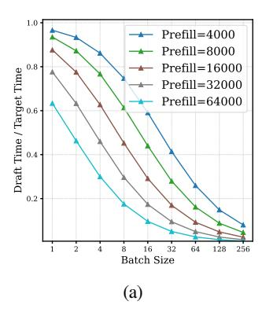
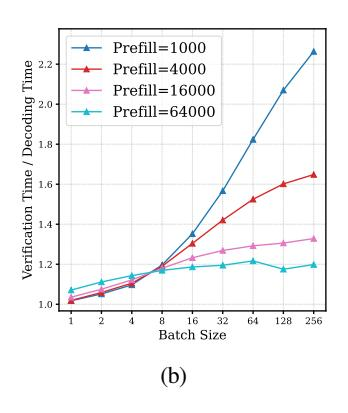
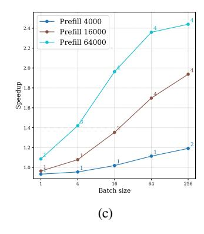

# 3 THEORETICAL ANALYSIS

In this section, we present our theoretical analysis of speculative decoding and LLM inference performance. We begin by reviewing the mathematical formulation of speculative decoding speedup and identifying the key factors influencing it. Next, we analyze LLM inference in long-context scenarios, highlighting the bottleneck shift that enables speculative decoding to achieve speedup with large batch sizes. Finally, we demonstrate the necessity of compressed KV-based drafting to achieve high speedup in long-context, large batch scenarios.

### 3.1 SPECULATIVE DECODING SPEEDUP ANALYSIS

The decoding time required by the target model and the draft model for a batch of size B and sequence length S are given by TT (B,S) and TD(B,S) respectively. The time taken by the target model to verify

Figure 2: Theoretical analysis and expected speedup for LLaMA-3.1-8B deployed on 8×A100s with  $\gamma = 3$ . (a) Theoretical  $T_D/T_T$  versus batch sizes. (b) Theoretical  $T_V(\gamma)/T_T$  versus batch size. (c) Theoretical expected speedup of self-speculation across different batch sizes ( draft KV budget = 512 ).

 $\gamma$  tokens is given by  $T_V(B,S,\gamma)$ . Given the draft token acceptance rate  $\alpha \in [0,1]$  and speculation length  $\gamma$ , the expected number of tokens generated in one verification step is denoted by  $\Omega(\gamma,\alpha)$ . As described in (Leviathan et al., 2022), the expected number of generated tokens can be estimated as,

$$\Omega(\gamma, \alpha) := \mathbb{E}[\#generated tokens] = \frac{1 - \alpha^{\gamma + 1}}{1 - \alpha}$$
 (1)

The total time taken for speculative decoding,  $T_{Total}^{SD}$ , is given by:  $T_{Total}^{SD} = \gamma \cdot T_D(B,S) + T_V(B,S,\gamma)$ 

$$T_{Total}^{SD} = \gamma \cdot T_D(B,S) + T_V(B,S,\gamma)$$

Hence, the expected latency per token for speculative decoding is simply  $T_{Avg}^{SD} = T_{Total}^{SD}/\Omega(\gamma,\alpha)$ . For brevity of notation, we will refer to these times as  $T_T$ ,  $T_D$ , and  $T_V$  in the future, with the dependence on B and S implied, unless otherwise specified.

The speedup of speculative decoding and the factors regulating it can be understood from the following equation,

$$\frac{T_{Avg}^{SD}}{T_T} = \frac{1}{\Omega(\gamma, \alpha)} \left( \frac{\gamma \cdot T_D}{T_T} + \frac{T_V(\gamma)}{T_T} \right) \tag{2}$$

From equation 2 we can see that speed-up depends on three primary factors: (a) target verification to decoding cost ratio  $T_{\mathbf{V}}(\gamma)/T_{\mathbf{T}}$ , (b) draft to target cost ratio  $T_{\mathbf{D}}/T_{\mathbf{T}}$ , and (c) expected generation length  $\Omega(\gamma,\alpha)$ . For better speedups, we aim to achieve low  $T_V(\gamma)/T_T$  (close to 1), low  $T_D/T_T$  (close to 0) and high  $\Omega(\gamma,\alpha)$ .

