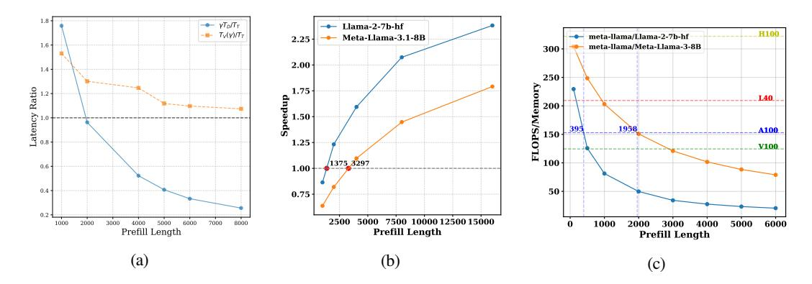

# KV CACHE BOTTLENECK ENABLES SPECULATIVE DECODING SPEEDUP

In this section, we analyze how the inference bottleneck shifts as sequence length and batch size increase and how it affects the factors discussed in Section 3.1.

For short sequence lengths, speculative decoding negatively impacts batch inference efficiency (Liu et al., 2024a; Su et al., 2023). As batch size grows, the linear layers become compute-bound due to improved arithmetic intensity. This reduces the availability of compute resources that speculative decoding utilizes for parallel verification, essentially increasing the verification to decoding cost ratio.

In contrast, for moderate to long sequences, we observe a transition towards a memory-bound regime since with increasing batch size, the memory cost of loading the KV cache becomes the dominant factor. This shift from compute-bound to memory-bound inference makes the verification cost comparable to the target decoding cost. Because verification and decoding share the same KV budget, their KV cache loading costs are equivalent. The high ratio of peak FLOPS to memory bandwidth in modern GPUs causes the increase in KV loading time with batch size to outweigh the increase in computation time (see Fig. 1a). As a result, although compute-bound linear layers increase verification cost, it is mitigated by the KV bottleneck.

Based on this shift in bottlenecks, we identify a critical sequence length Sinflection, beyond which speculative decoding achieves speedup for large batches. Moreover, its speedup tends to increase with batch size. This threshold depends on factors like the model architecture, hardware configuration, and drafting strategy.

Figure 3: Theoretical analysis of self-speculation for LLaMA-2-7B-32K and LLaMA-3.1-8B with a draft KV budget of 512 and a batch size of 256. We assume the acceptance rate is 0.8 here. (a) Ratio of target-draft latency  $(\gamma \cdot T_D/T_T)$  and verification-target latency  $(T_V(\gamma)/T_T)$  versus sequence length for LLaMA-2-7B-32K , with  $\gamma$ =3. (b) Theoretical speedup for different sequence lengths with a fixed  $\alpha$  = 0.8. (c) Theoretical arithmetic intensity for different sequence lengths and different models.

