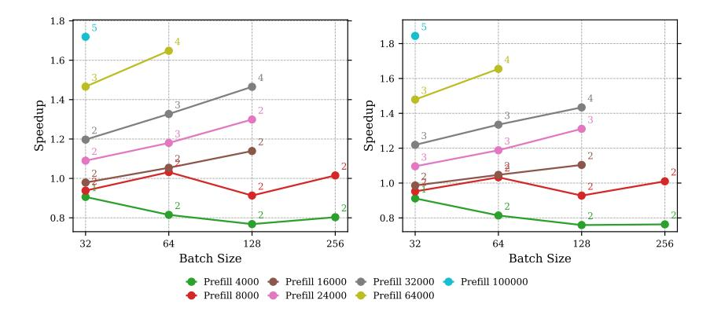
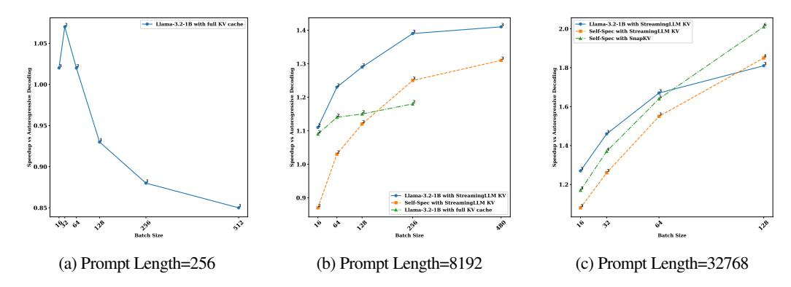

# 5.1 END-TO-END SPEEDUP

We demonstrate the effectiveness of our analysis in Section [3](#page-2-1) that speculative decoding can improve both throughput and latency for moderate-to-long sequences.

Setup: We use StreamingLLM [\(Xiao et al., 2024b\)](#page-12-4) style sparse KV for drafting and conduct experiments across various batch sizes and sequence lengths to evaluate speculative decoding speedup. The system implementation details are shown in [A.1.](#page-12-10) The evaluation is performed using the state-of-the-art long-context model LLaMA-3.1-8B on the PG-19 dataset [\(Rae et al., 2019\)](#page-11-10). Each run generates 96 tokens per sentence in the batch through greedy decoding on 20 batches. We tested two draft KV cache budgets to assess the trade-off between draft cost and acceptance rate.

Results: Fig. [6](#page-8-1) shows the speedup achieved by speculative decoding at the optimal speculation length across various batch sizes and sequence lengths. These experiments are conducted on 8xA100 GPUs.

SD can achieve speedup for moderate to long context length. We can find that speculative decoding consistently outperforms autoregressive decoding except when batch size is large and sequence length is short, which indicate the correctness of our analysis in Sec. [3.2.](#page-3-0)

SD achieves better speedup with larger batch sizes. We find that on 8xA100, when the sequence length exceeds 4000, speculative decoding achieves speedup, which increases with batch size. This result aligns with our analysis in Sec. [3.2.](#page-3-0) To verify our analysis of factors affecting the critical sequence length, we ran experiments on higher-end GPUs (H100) and lower-cost alternatives (L40), and compared the results with L LaMA-2-7B-32K . As shown in Table [1,](#page-8-2) the H100 achieves higher speedup than the A100 and L40 under the same setting (sequence length, batch size, and drafting strategy). This is due to the H100's higher FLOPSto-memory bandwidth ratio, which lowers verification cost. Additionally, we can see for 8000 sequence length and the 32 batch size LLaMA-2-7B-32K without GQA achieves higher speedup than LLaMA -3.1-8B with 32000 sequence length, that's because Non-GQA model has lower FLOPS-to-memory ratio.

SnapKV was chosen for its superior acceptance rates among static algorithms, utilizing average pooling with a kernel size of 5 and an observation window size of 32. PQCache employs product quantization with 16 sub-vectors and 8-bit quantization per key vector.

Figure 6: End-to-end speedups for StreamingLLM-based self-speculation with LLaMA-3.1-8B across various compressed KV budgets (left: 256, right: 512) on PG-19. Annotations indicate  $\gamma_{optimal}$ , which is the value corresponding to the highest speedup achieved. Experiments are conducted on 8xA100 with 8-way tensor parallelism. Raw data can be found in A.2.

Table 1: Results on L40 and H100, StreamingLLM budget for the draft model is 512, each with the optimal  $\gamma$ 

| Target        | Draft        | Task  | GPU    | Prefill | Bsz | $\gamma$ | $\gamma T_{\mathbf{D}}(1)$ | $T_{\mathbf{V}}(\gamma)$ | $\Omega(\gamma, \alpha)$ | $\mathbf{T}^{\mathbf{A}\mathbf{R}}$ | $\mathbf{T^{SD}}$ | x    |
|---------------|--------------|-------|--------|---------|-----|----------|----------------------------|--------------------------|--------------------------|-------------------------------------|-------------------|------|
| Llama3.1-8B   | StreamingLLM | PG-19 | 8xL40  | 32000   | 32  | 3        | 44.11                      | 45.12                    | 3.00                     | 36.62                               | 30.32             | 1.21 |
| Llama2-7B-32K | StreamingLLM | PG-19 | 8xL40  | 8000    | 32  | 2        | 29.06                      | 42.02                    | 2.53                     | 35.13                               | 28.70             | 1.22 |
| Llama2-7B-32K | StreamingLLM | PG-19 | 8xL40  | 8000    | 64  | 3        | 58.33                      | 74.85                    | 3.14                     | 62.92                               | 42.96             | 1.46 |
| Llama3.1-8B   | StreamingLLM | PG-19 | 4xH100 | 32000   | 32  | 3        | 15.09                      | 18.30                    | 2.82                     | 17.32                               | 12.16             | 1.42 |
| Llama2-7B-32K | StreamingLLM | PG-19 | 4xH100 | 8000    | 32  | 3        | 14.20                      | 15.64                    | 2.98                     | 14.85                               | 10.29             | 1.44 |
| Llama2-7B-32K | StreamingLLM | PG-19 | 4xH100 | 8000    | 64  | 4        | 23.63                      | 27.90                    | 3.37                     | 26.17                               | 15.58             | 1.68 |

#### 5.2 Comparing Different KV Compression Methods

In this section, we compare two static KV compression methods for drafting, with results shown Fig. 7b and Fig. 7c. The detail results are in Table 6. We perform a sweep to select the optimal speculation length and KV budget for each method. The best draft budget for StreamingLLM-based self-speculation is 512, while for SnapKV-based approach, it is 2049. The results indicate that SnapKV-based drafting outperforms StreamingLLM for self-speculation in all the cases. Based on Fig. 4c and our analysis in Sec. 4, the key factor is the acceptance rate. Both StreamingLLM and SnapKV are static KV compression methods, so neither incurs KV search overhead. However, SnapKV has a much higher acceptance rate, which increases rapidly with KV budget, mitigating the rise in draft cost. In contrast, StreamingLLM's acceptance rate has a lower upper bound and increases more slowly with KV budget. As a result, SnapKV achieves higher speedup due to the combined effect of acceptance rate and draft cost. We further evaluated SnapKV-based self-speculation across different batch sizes, sequence lengths, and tasks, with promising results. As shown in Table 2, SnapKV-based self-speculation achieves up to 2.51x speedup, demonstrating speculative decoding's ability to improve throughput.

Table 2: Further Results of SnapKV Self-speculation on Different Tasks

| Target      | Draft  | Task  | GPU    | Prefill | Bsz | γ  | $\gamma T_{\mathbf{D}}(1)$ | $T_{\mathbf{V}}(\gamma)$ | $\Omega(\gamma, \alpha)$ | $\mathbf{T}^{\mathbf{A}\mathbf{R}}$ | $\mathbf{T^{SD}}$ | x    |
|-------------|--------|-------|--------|---------|-----|----|----------------------------|--------------------------|--------------------------|-------------------------------------|-------------------|------|
| Llama3.1-8B | SnapKV | PG-19 | 8xH100 | 100000  | 41  | 7  | 34.34                      | 28.50                    | 5.61                     | 25.96                               | 11.35             | 2.29 |
| Llama3.1-8B | SnapKV | QA-1  | 8xH100 | 100000  | 41  | 11 | 53.90                      | 29.89                    | 7.93                     | 25.90                               | 10.64             | 2.43 |
| Llama3.1-8B | SnapKV | CWE   | 8xH100 | 100000  | 41  | 11 | 53.98                      | 29.93                    | 8.21                     | 25.83                               | 10.29             | 2.51 |
| Llama3.1-8B | SnapKV | PG-19 | 8xH100 | 64000   | 64  | 6  | 32.89                      | 28.80                    | 5.41                     | 25.52                               | 11.54             | 2.21 |
| Llama3.1-8B | SnapKV | QA-1  | 8xH100 | 64000   | 64  | 7  | 38.40                      | 29.11                    | 6.08                     | 25.43                               | 11.20             | 2.27 |
| Llama3.1-8B | SnapKV | CWE   | 8xH100 | 64000   | 64  | 8  | 43.91                      | 29.29                    | 6.83                     | 25.48                               | 10.81             | 2.36 |

#### 5.3 ABLATION STUDY

In this section, we present ablation studies of our speculative decoding speedup analysis model.

**Draft KV Budget.** As modeled in Section 4, the selection of KV budget depends on verification cost, acceptance rate, and draft cost. As shown in Fig. 6, when batch size and sequence length are large, a larger KV budget results in higher speedup. In this scenario, the LLM is highly memory-bound, so verification

Figure 7: Comparison between different drafting strategy for LLaMA-3.1-8B under short, medium and long context length across batch sizes. Hardware: 8xH100. Each with optimal gamma. Dataset: PG-19.

cost is low, but its absolute value is much larger than the draft cost with a fixed KV size. Therefore, a larger KV budget with a higher acceptance rate is preferred to increase the average generation length per step.

**Draft Model Weights.** Draft model weights loading is also a part of draft cost. We have several choices of drafting stategy with the trade-off of draft cost and acceptance rate. A small draft model can have much lower model weights loading cost, but with significant lower acceptance rate. We conduct experiments under prompt length 256, 8192 and 32768 to show the effect to speedup of different draft model selection. The results are shown in Fig. 7. We can see in Fig. 7b that when sequence length is not sufficient long and batch size is not very large, small draft model with the KV compression tends to outperform self-speculation. This is because, in these scenarios, KV doesn't fully dominate inference, and model weight loading makes draft costs of self-speculation a lot higher. However, when both sequence length and batch size are very large, and the KV cache dominates LLM inference, self-speculation surpasses the small draft model, as model weight loading contributes minimally to overall latency. The high acceptance rate of compressed KV self-speculation has higher speedup upper bound, and leads to better speedup when batch size is large, as demonstrated in Fig. 7c.

**Models.** Different models have different FLOPS to Memory Ratio and acceptance rate. We also conducted experiments on Qwen2.5-7B, Qwen2.5-32B and Mistral-7B-v0.3 models to show the generalizability of MagicDec. The results are shown in Sec. A.5. We can see speculative decoding works well for these models, achieving up to 2.06x speedup for Mistral-7B-v0.3, 1.89x speedup for Qwen2.5-7B and 1.51x speedup for Qwen2.5-32B on PG-19 dataset. The trend of speedup also matches our previous analysis and the LLaMA-3.1-8B results.

### 6 CONCLUSION AND LIMITATION

Optimizing both throughput and latency for LLM inference is challenging, especially for long-context, large batch-size regime. Our analysis reveals that speculative decoding can be beneficial in this regime, with its efficacy increasing with larger batch-sizes, contrary to existing misconceptions. In search of effective drafting strategies, we discover that KV compression is easier than model compression to achieve higher acceptance rate at the same memory budget, which becomes more prominent in high batch-size and long context-length regime. Leveraging these insights, we explore different KV compression algorithms for drafting and present a bottleneck-aware general formulation to select suitable drafting strategy based on task, batch-size and sequence-length. MagicDec only focuses on decoding performance for long-context LLM serving, while the prefill is also very challenging in this scenario. There has been some work focusing on improving the prefill performance (Agrawal et al., 2024a; Zhong et al., 2024), which could be integerated with MagicDec to improve both prefill and decode performance. MagicDec tends to achieve better speedup on high-end GPUs due to their higher FLOPS-to-memory bandwidth ratio and large HBM size. Future work can explore the adoption of speculative decoding on offloading and distributed setting to reduce the communication overhead, thus better utilize the resource of commodity devices.

#### 7 ACKNOWLEDGEMENTS

We would like to thank Xinyu Yang, Yang Zhou, Harry Dong, Haizhong Zheng, Hanshi Sun, and the anonymous reviewers for providing us constructive feedback on our paper. This work was partially supported by Together AI, Moffett AI and Li Auto.

