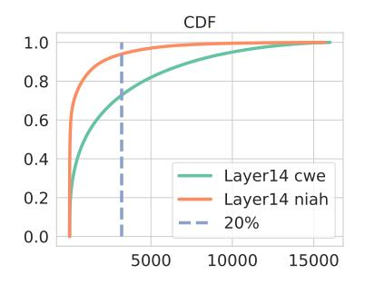
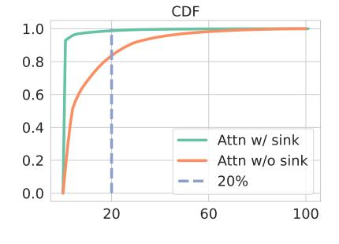
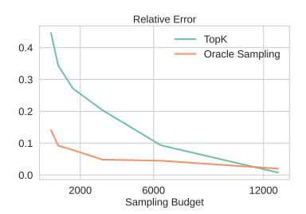

# MagicPIG: LSH Sampling for Efficient LLM Generation

Zhuoming Chen†, Ranajoy Sadhukhan†, Zihao Ye‡, Yang Zhou†, Jianyu Zhang§‡, Niklas Nolte‡, Yuandong Tian♯, Matthijs Douze♯, Leon Bottou§♯, Zhihao Jia†, Beidi Chen†

†Carnegie Mellon University, ‡University of Washington, §New York University, ‡Meta AI

Large language models (LLMs) with long context windows have gained significant attention. However, the KV cache, stored to avoid re-computation, becomes a bottleneck. Various dynamic sparse or TopK-based attention approximation methods have been proposed to leverage the common insight that attention is sparse. In this paper, we first show that TopK attention itself suffers from quality degradation in certain downstream tasks because attention is not always as sparse as expected. Rather than selecting the keys and values with the highest attention scores, sampling with theoretical guarantees can provide a better estimation for attention output. To make the sampling-based approximation practical in LLM generation, we propose Magicpig, a heterogeneous system based on Locality Sensitive Hashing (LSH). MAGICPIG significantly reduces the workload of attention computation while preserving high accuracy for diverse tasks. MagicPIG stores the LSH hash tables and runs the attention computation on the CPU, which allows it to serve longer contexts and larger batch sizes with high approximation accuracy. MAGICPIG can improve decoding throughput by up to 5× across various GPU hardware and achieve 54ms decoding latency on a single RTX 4090 for Llama-3.1-8B-Instruct model with a context of 96k tokens.

Github: https://github.com/Infini-AI-Lab/MagicPIG Website: https://www.lsh-ai.com

#### Introduction 1

Large language models (LLMs) with long context windows, such as GPT (Achiam et al., 2023), Llama (Dubey et al., 2024), and Gemini (Team et al., 2023), have gained significant attention for their ability to enhance applications like chatbots (Chiang et al., 2024), search engines (Wang et al., 2024), and video analysis (Cheng et al., 2024). However, serving long-context LLMs is highly challenging due to the unique bottleneck in auto-regressive generation—the key-value (KV) cache, which stores intermediate attention keys and values to avoid re-computation (Pope et al., 2022; Zhang et al., 2023b). Specifically, the KV cache grows linearly with both the batch size and sequence length, occupying substantial GPU memory and increasing decoding time. Moreover, the KV cache makes LLM generation extremely memory-bound, leading to underutilization of GPU computational power. For instance, an NVIDIA A100-40GB GPU can only handle a single request for Llama with a 128k context length, with nearly half of the decoding time spent accessing the KV cache, and poor GPU utilization (He and Zhai, 2024).

Figure 1 While TopK attention performs well on retrieval tasks (niah) where the useful information reduces to a few words, it degrades severely in aggregated tasks like word extraction (cwe, fwe). x-axis: proportion of attention keys used for TopK attention.

Leveraging the common insight that attention is naturally sparse, dynamic sparse or TopK-based approximation has been extensively studied (Tang et al., 2024; Singhania et al., 2024; Zhang et al., 2024; Wu et al., 2024), but three major challenges prevent a wide adoption in LLM serving systems. (1) Quality Degradation. They usually propose various strategies to approximate a subset of KV cache that yields the highest attention scores. However, TopK attention itself is a biased attention approximation and lacks theoretical guarantees. Figure 1 shows that even exact TopK attention results significantly degrade the accuracy of certain downstream tasks. (2) **High Overhead.** There is a large overhead to identify TopK attention, which becomes the bottleneck

- (a) Long tailed phenomena
- (b) Attention sink reshapes sparsity
- (c) Geometry of attention

Figure 2 Left: Examples of long-tailed distribution in LLM. The x-axis is the fraction (or number of tokens) used in the TopK, a.k.a. the sampling budget. Mid: Sink tokens make attention score look sparser. Right: The geometry of attention. The key of attention sink ksink is almost opposite to other tokens, and its orientation is surprisingly invariant with input tokens. Query states lie close to k0, thus forming attention sink and Figure [2b.](#page-1-0) k usually lies in a narrow cone that is far away from q. In certain heads, this geometry will result in a long-tailed distribution of attention score and difficulty searching for the TopK keys.

rather than the attention computation. For example, as studied in [Liu et al.](#page-14-1) [\(2024a\)](#page-14-1), naively applying a search algorithm like IVF [\(Douze et al.,](#page-13-4) [2024\)](#page-13-4) requires access over 30% key states to obtain the exact TopK, showing an unsatisfying trade-off between search accuracy and cost. (3) No Memory Saving. Although saving KV cache loading time, they cannot reduce the total memory occupied by the KV cache, which limits the maximum context and batch sizes when VRAM is scarce.

An ideal sparse attention approximation approach should (1) preserve full accuracy for a diverse set of downstream tasks with guarantees, (2) involve low-cost overhead for KV cache selection, and (3) save GPU memory. The following observations, together with the performance drop shown in Figure [1](#page-0-0) suggest that to achieve such demanding requirements, we need to go beyond TopK attention:

- Attention is not always sparse. Contradictory to previous belief [\(Zhang et al.,](#page-16-0) [2023b,](#page-16-0) [2024;](#page-15-4) [Tang et al.,](#page-15-2) [2024;](#page-15-2) [Liu et al.,](#page-14-1) [2024a\)](#page-14-1), we observe that attention is not always sparse, especially for tasks that leverage the full context. As shown in Figure [2a,](#page-1-0) in some layers, attention distribution can be very long-tailed, i.e., the Top20% attention can only cover 70% of the total attention scores.
- Seemingly high sparsity is usually a consequence of an attention sink. Most of the attention scores concentrate on initial tokens (attention sink phenomenon) [\(Xiao et al.,](#page-15-6) [2023\)](#page-15-6), making the distribution look sparser. However, as shown in Figure [2b,](#page-1-0) attention scores are distributed more uniformly among tokens except for the sink. According to the geometrical interpretation of sink, keys, and queries shown in Figure [2c,](#page-1-0) the attention sink, which we found surprisingly almost static regardless of the input token, is just for imposing sparsity on the attention distribution.
- It is hard to find TopK attention. Figure [2c](#page-1-0) also shows why searching for the Top-K keys is intrinsically costly. The keys and queries usually lie within two narrow cones with nearly opposite orientations, except for the attention sink. This significant mismatch between query and data distributions causes nearest-neighbor search methods to perform poorly.

These limitations of TopK attention require rethinking the sparse attention approximation. Rather than only using the keys and values with the highest scores, leveraging information on the distribution can make the estimation more accurate. We approach this as a bias correction problem in sampling. Unbiased and efficient sampling has been long studied in biology [\(Lukacs,](#page-14-2) [2009\)](#page-14-2), sociology [\(Chen et al.,](#page-12-1) [2018\)](#page-12-1) as well as machine learning [\(Backurs et al.,](#page-12-2) [2019;](#page-12-2) [Chen et al.,](#page-12-3) [2019;](#page-12-3) [Zandieh et al.,](#page-15-7) [2023\)](#page-15-7), with theoretical guarantees.

Figure [3](#page-2-0) shows that sampling values according to their corresponding attention score (we call this oracle sampling) achieves a much lower (up to 4×) estimation error than the naive TopK selection. Deploying sampling estimation in attention is promising, but three challenges remain. First, how a reduction of the attention error can make a difference in downstream performance is unclear [\(Backurs et al.,](#page-12-2) [2019,](#page-12-2) [2018\)](#page-12-4). Second, modeling the attention score distribution is necessary for efficient sampling, but inferring the distribution parameters requires expensive computations. Third, fully leveraging the resources of modern hardware, GPU and CPU, with a theoretically efficient algorithm is non-trivial.

This paper proposes Magic samPlIng for Generation (MAGICPIG), which leverages Locality sensitive hashing (LSH) sampling for efficient LLM generation. LSH is employed for sampling to approximate the attention score distribution and estimate attention output. By computing hash functions on GPU and conducting sampling on CPU, MAGICPIG can allow massive hash tables and hash functions compared to prior work (Kitaev et al., 2020; Chen et al., 2021), which are of vital importance for accurate estimation (Backurs et al., 2018). Following the practice of Aminabadi et al. (2022); He and Zhai (2024), we offload the KV cache computation, which is memory bound, to CPU to allow a larger batch or longer context. Specifically.

Figure 3 TopK v.s. Sampling, 16k total context

- In Section 3, we analyze the failures of TopK attention. Moreover, we study sampling-based attention estimation assuming an oracle for the key distribution (**Oracle Sampling Estimation**) and empirically demonstrate that it is consistently more effective both for distribution estimation and downstream tasks.
- In Sections 4.1 to 4.3, we present a sampling algorithm to approximate oracle sampling for attention estimation based on locality sensitive hashing and the intuition and motivation from statistic perspectives. To our best knowledge, MagicPIG is the first to leverage LSH sampling in self-attention in decoder-only LLM generation.
- In Section 4.4, we present our system design to efficiently offload attention computation on the CPU, breaking the memory limit of the GPU for serving larger batches or longer contexts. We also overcome the new challenges of computation and memory size raised by our sampling algorithm to support a larger scale of hashing tables beyond prior work (Chen et al., 2021; Kitaev et al., 2020).

In Section 5, we show the empirical evaluation results of the performance of MagicPIG, demonstrating the accuracy and efficiency. While maintaining high accuracy for diverse tasks, MagicPIG can improve serving throughput by  $1.5 \sim 5 \times$  (A100, L20, RTX 4090) and can achieve 54ms decoding latency on a single RTX 4090 for Llama-3.1-8B-Instruct (Dubey et al., 2024) with 96K context. More importantly, we show that MagicPIG already outperforms TopK attention in the two aggregation tasks in Figure 1, suggesting that sampling indeed goes beyond TopK attention.

