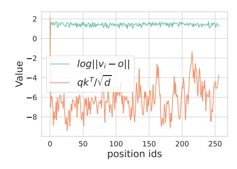
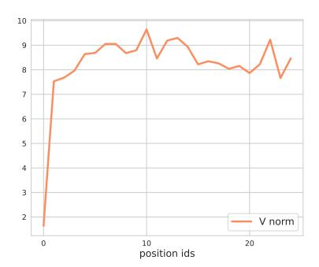

# C Supplementary analysis

**Figure 10** The range of fluctuation of  $\log |v_i - o|$  and  $\frac{qk_i^T}{\sqrt{d}}$  in a single decoding step. Compared to  $\frac{qk_i^T}{\sqrt{d}}$ ,  $\log |v_i - o|$  is stable, hence we do not consider  $\log |v_i - o|$  in our proposed sampling probability.

**Figure 11** The y-axis is the norm of values states  $||v_i||$  for token i (on the x-axis). We observe that the value norm  $||v_0||$  of the attention sink is significantly smaller than others.

Figure 10 shows that compared to  $\frac{qk_i^T}{\sqrt{d}}$ ,  $\log|v_i-o|$  is stable in a decoding step. Figure 11 shows that the norm of the value states of attention sink is smaller than others.

