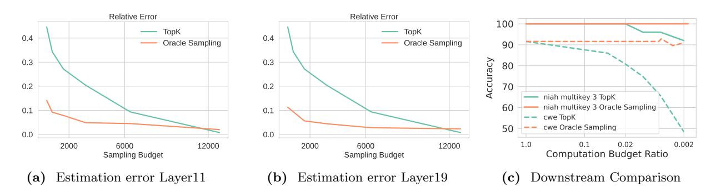

# 3 Rethinking attention sparsity

In this section, we examine TopK attention, which is the theoretical upper bound of prior search-based algorithms, including both static methods [\(Zhang et al.,](#page-16-0) [2023b;](#page-16-0) [Li et al.,](#page-14-4) [2024\)](#page-14-4) and dynamic methods [\(Tang](#page-15-2) [et al.,](#page-15-2) [2024;](#page-15-2) [Singhania et al.,](#page-15-3) [2024;](#page-15-3) [Mao et al.,](#page-14-7) [2024\)](#page-14-7). We show that TopK is sub-optimal and present another attention approximation based on sampling and estimation with an oracle that improves the accuracy and/or the computation cost.

### 3.1 Achilles' heel of TopK attention

As it is defined, TopK attention only computes the weighted average on elements with the highest attention scores. To quantify its performance, the computation budget of TopK attention is defined as the number of selected tokens, i.e., the K of TopK. Searching-based sparse attention algorithms, like [\(Tang et al.,](#page-15-2) [2024;](#page-15-2) [Singhania et al.,](#page-15-3) [2024;](#page-15-3) [Wu et al.,](#page-15-5) [2024\)](#page-15-5), are approximations for TopK attention by replacing the true TopK keys with the ones found by approximate searching algorithms.

However, we find significant performance degradation in downstream tasks caused by TopK attention as shown in Figure [1.](#page-0-0) Although TopK attention preserves accuracy for retrieval tasks that only require a mini-

Figure 4 TopK estimation error for a KV-cache of 16k tokens.

mal subset of the context (needle-in-a-haystack single/multikey [\(Hsieh et al.,](#page-13-11) [2024\)](#page-13-11)), it severely degrades for aggregation tasks that leverage the full context (common word extraction and frequent word extraction [\(Hsieh](#page-13-11) [et al.,](#page-13-11) [2024\)](#page-13-11)). Intuitively, the information is distributed more broadly for aggregation tasks, which results in less peak attention score distribution.

Figure 5 Geometric information of attention. Left: With arbitrary input, the orientation of  $k_{sink}$  almost remains the same, with a minimum similarity > 0.99 across sampled inputs. Mid: The orientation of  $k_{avg}$  is stable across various input sentences with a similarity > 0.9 observed. Right:  $k_{sink}$  and  $k_{avg}$  are almost opposite with similarity between  $-0.9 \sim -0.8$ .

TopK attention is biased and inaccurate, especially when the distribution of attention scores is long-tailed and the computation budget or density (i.e., K) is limited. Unfortunately, long-tailed phenomena do occur in LLMs across all layers (prior works (Xiao et al., 2023; Tang et al., 2024; Sun et al., 2024) usually skip the first two layers to maintain accuracy) as presented in Figure 2a. Top20% tokens can only cover  $70 \sim 80\%$  attention scores, leaving a large proportion of keys and values not considered, which is translated into a non-negligible (15  $\sim 20\%$ ) estimation error in Figure 4.

To better understand the attention distribution, we study the geometry of q, k and make the following three observations. (1) Key states of the initial token (also known as attention sink, denoted by  $k_{sink}$ ) remain almost the **same** for arbitrary input. In Figure 5a, we randomly draw 32 samples from the vocabulary and measure the mutual cosine similarity of key states. Surprisingly, we find that the orientations of the key states of different input tokens are almost **identical** with a similarity > 0.99. (2) The orientation of the center of key states (i.e.  $k_{avg} = \frac{1}{n} \sum_{i=1}^{n} k_i$ ) remains **stable** for different input sentences. In Figure 5b, we measure the mutual cosine similarity of  $k_{avg}$  of 50 different input sentences. Although variance exists, the similarity of  $k_{avg}$  is over 0.9. (3) The orientations of  $k_{avg}$  and  $k_{sink}$  are almost **opposite**. In Figure 5c, we find that for each head,  $k_{sink}$  and  $k_{avg}$  has a cosine similarity between  $-0.9 \sim -0.8$ .

These observations shape the geometry as shown in Figure 2c. The attention sink, which is static regardless of input, produces high sparsity in the attention distribution, whereas other parts are more uniformly distributed. Simply applying TopK will place even more weight on the sink token, thus losing contextual information. In addition, misaligning q and k also causes difficulty in search (Liu et al., 2024a).

### 3.2 Estimate attention with sampling

Existing TopK attention mechanisms ignore tokens in the KV cache with low attention scores, which introduces a bias since the ignored tokens comprise a large proportion of attention scores (Figure 2a). As a result, TopK attention achieves suboptimal performance for long-context tasks, such as information aggregation (Figure 1). Increasing the computation budget for TopK attention does help reduce the estimation error (Figure 4) since it will involve more elements in computing. However, the following question is posed:

Can we improve the estimation quality with low computational budgets?

Inspired by mark and recapture (Lukacs, 2009; Owen, 2013; Lohr, 2021; Chen et al., 2018), we show in the following that attention output can be estimated with sampling. Using notations from Section 2.1 we can re-write attention output o as the expectation of  $v_i$ ,  $1 \le i \le n$  from distribution w, i.e.  $o = \mathbb{E}_{i \sim w}(v_i)$ , which can be estimated by the following method.

Figure 6 Left and Middle: Oracle sampling estimation can significantly reduce numerical error compared to TopK attention. The evaluated context size is 16k. The x-axis is sampling budget for oracle sampling and computation budget for TopK attention. Notice that the estimation error of TopK attention will cross oracle sampling after a certain large budget (12k in figures). This is because oracle sampling will repetitively sample the same subset of tokens with a high probability while TopK will not. Theorem 3.3 further explains this. Right: Downstream comparison for oracle sampling estimation and TopK attention. The x-axis for both methods is computation budget ratio, i.e. the fraction of selected/sampled tokens.

**Definition 3.1** (Oracle Sampling Estimation). Given a sampling budget  $\mathcal{B}$  and normalized attention score w,  $\mathcal{B}$  elements are sampled independently from w (i.e.  $i_1, i_2, ..., i_{\mathcal{B}} \stackrel{\text{iid}}{\sim} w$ ). Then the attention output is estimated as

$$\bar{o} = \frac{1}{\mathcal{B}} \sum_{i=1}^{\mathcal{B}} v_{i_j} \tag{4}$$

This is not the lowest variance estimator but has better downstream performance (see Appendix B). We call it "oracle" because it assumes that the exact attention vector w is known, which is not true for sparse attention approximations.

**Theorem 3.2.** Oracle sampling estimation is unbiased, and the trace of covariance monotonically decreases with  $\mathcal{B}$ .

This theorem (proved in Appendix A) theoretically guarantees a low estimation error of oracle sampling. We also present an empirical comparison between oracle sampling estimation and TopK attention in Figures 6a and 6b. In summary, oracle sampling estimation can reduce relative error by up to  $4\times$ .

Note that the sampling budget  $\mathcal{B}$  is not the actual computation cost for oracle sampling estimation: duplicate  $X_i$  need to be computed/loaded only once, so  $\bar{o}$  can be computed by

$$\bar{o} = \sum_{i \in S} \frac{f_i}{\mathcal{B}} v_i \quad S = \text{Unique}(\{i_{1 \le i \le \mathcal{B}}\})$$
 (5)

where  $f_i$  is the number of duplicates of  $X_i$ . Intuitively, if w has an peaked distribution (e.g.  $w_i > 99\%$ ), then almost all samples in  $\{i_1, ..., i_{\mathcal{B}}\}$  are identical to i. The actual computation cost of oracle sampling estimation is |S|, the number of *unique* samples, which we bound in the following:

**Theorem 3.3.** The expected computation budget  $(\mathbb{E}(|S|))$  has an upper bound of  $1 + \mathcal{B}\epsilon$ , where  $\epsilon = 1 - \max_i w_i$ .

This theorem (proved in Appendix A) shows that the computation cost of oracle sampling is usually far less than the sampling budget. In Figure 6c, we present the downstream accuracy comparison between oracle sampling estimation and TopK attention. The former preserves high accuracy for both tasks, even with a very small computation cost (0.002% out of 16k context, which is approximately 32). In Appendix F, we provide an intuitive example to explain why sampling outperforms TopK in estimation.

