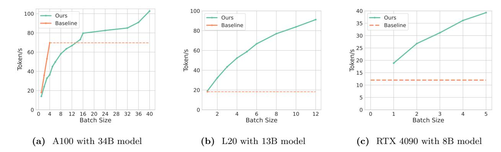

# 5.1 MagicPIG Preserves Accuracy

We demonstrate that MAGICPIG can preserve accuracy in diverse tasks with less than 5% computation.

Setup. Our experiments are based on Llama (AI@Meta, 2024; Dubey et al., 2024; Touvron et al., 2023) models. Three types of tasks are included, which are 3 mid-context comprehensive tasks from lm-eval-harness (Gao et al., 2021) (GSM8K-CoT (Cobbe et al., 2021), MMLU-Flan-Cot-Fewshot (Hendrycks et al., 2020) and COQA (Reddy et al., 2019)), and 6 long context tasks from (Bai et al., 2023) (QASPER (Dasigi et al., 2021), LCC, Repobench-P (Liu et al., 2023), TriviaQA (Joshi et al., 2017), PRE and TREC (Li and Roth, 2002; Hovy et al., 2001)) and 13 synthetic tasks from RULER (Hsieh et al., 2024) (with 50 examples per task).

**Baselines.** Besides full attention, Quest (Tang et al., 2024) and its variants are used as baselines. In its default setting, Quest uses a "page size" of 16, i.e. 1/16 of the full attention cost. To compare the methods fairly in

**Table 1** Comprehensive tasks on lm-eval-harness (Gao et al., 2021). MAGICPIG significantly outperforms other methods with lower computation. The config (K, L) is a hyper-parameter of LSH for MAGICPIG or page size and ratio of selected pages for Quest (Tang et al., 2024). Cost1, Cost2 represents the cost for searching/sampling and sparse attention computation.

| Methods               | Config    | GSM  | COQA | MMLU | Avg. | $Cost_1$ | $Cost_2$ | $Cost_{total}$ . |
|-----------------------|-----------|------|------|------|------|----------|----------|------------------|
| Llama-2-7b-chat       | Full      | 22.4 | 75.8 | 49.2 | 49.1 | 0.00     | 1.00     | 1.00             |
| MagicPIG              | (10,220)  | 17.3 | 76.4 | 48.6 | 47.4 | 0.00     | 0.04     | 0.04             |
| MagicPIG              | (8,90)    | 18.7 | 75.0 | 47.9 | 47.2 | 0.00     | 0.08     | 0.08             |
| Quest                 | (16,0.05) | 13.0 | 69.4 | 41.4 | 41.3 | 0.06     | 0.05     | 0.11             |
| Quest                 | (32,0.1)  | 15.7 | 70.2 | 44.0 | 43.3 | 0.03     | 0.10     | 0.13             |
| Llama-3.1-8B-Instruct | Full      | 77.6 | 78.5 | 65.2 | 73.7 | 0.00     | 1.00     | 1.00             |
| MagicPIG              | (10,220)  | 72.7 | 78.1 | 62.7 | 71.2 | 0.00     | 0.03     | 0.03             |
| MagicPIG              | (8,90)    | 71.0 | 78.0 | 61.3 | 70.1 | 0.00     | 0.07     | 0.07             |
| Quest                 | (16,0.05) | 57.9 | 64.6 | 42.5 | 55.0 | 0.06     | 0.05     | 0.11             |
| Quest                 | (32,0.1)  | 64.5 | 65.0 | 48.0 | 59.2 | 0.03     | 0.10     | 0.13             |

**Table 2** Long context tasks on LongBench (Bai et al., 2023). MAGICPIG preserves high accuracy with low computation. Config and cost are defined as in Table 1. Code models are only evaluated by Repobench-P and LCC.

| Methods               | Config    | QaS  | RbP  | LCC  | PrE   | TrC  | $\operatorname{Tr} Q$ | Avg. | $ \operatorname{Cost}_1 $ | Cost 2 | $Cost_{total}$ . |
|-----------------------|-----------|------|------|------|-------|------|-----------------------|------|---------------------------|-------------------|------------------|
| Llama-3.1-8B-Instruct | Full      | 44.9 | 52.1 | 66.8 | 100.0 | 71.3 | 91.8                  | 71.2 | 0.00                      | 1.00              | 1.00             |
| MagicPIG              | (10,150)  | 43.2 | 50.2 | 64.4 | 100.0 | 71.3 | 92.2                  | 70.3 | 0.00                      | 0.02              | 0.02             |
| MagicPIG              | (8,75)    | 43.5 | 50.4 | 67.0 | 100.0 | 71.7 | 91.7                  | 70.7 | 0.00                      | 0.05              | 0.05             |
| Quest                 | (16,0.05) | 45.7 | 49.7 | 64.9 | 100.0 | 71.7 | 91.5                  | 70.6 | 0.06                      | 0.05              | 0.11             |
| Quest                 | (32,0.1)  | 44.4 | 50.5 | 65.1 | 100.0 | 71.3 | 91.6                  | 70.5 | 0.03                      | 0.10              | 0.13             |
| Code-Llama-13b-16K    | Full      |      | 58.5 | 74.7 |       |      |                       | 66.6 | 0.00                      | 1.00              | 1.00             |
| MagicPIG              | (10,150)  |      | 56.9 | 74.0 |       |      |                       | 65.5 | 0.00                      | 0.03              | 0.03             |
| Quest                 | (16,0.05) |      | 56.4 | 74.4 |       |      |                       | 65.4 | 0.06                      | 0.05              | 0.11             |

the low computation budget regime, we also evaluate Quest with page size 32 and 64 and make sure at least one page is selected in every test example. The initial 4 tokens and local 64 (for LongBench (Bai et al., 2023) and RULER (Hsieh et al., 2024)) or 24 (for lm-eval-harness (Gao et al., 2021)) tokens as well as layer-{0, 16} are statically preserved. We do not use the theoretical transformations in Equation (8) in our implementations, as we do not find them to contribute to accuracy improvements.

Cost. The cost for the attention approximation consists of two parts:  $Cost_1$  is the sampling/search cost to obtain S in Equation (11),  $Cost_2$  is the attention computation cost, see Equation (11). We report the ratio of the number of FLOPs compared to the full attention computation. For MAGICPIG,  $Cost_1 \simeq 0$  and  $Cost_2$  is empirically measured for different LSH hyper-parameters. For Quest with page size K,  $Cost_1 = \frac{1}{K}$  and  $Cost_2$  is controlled manually.

Analysis. From Tables 1 to 3, (1) MAGICPIG preserves high accuracy (degradation less than 2%) for all kinds of tasks, with a computation cost of  $2\% \sim 5\%$ . (2) Compared with Quest, which also shows reasonable performance on long context tasks, MAGICPIG also demonstrates good performance on tasks with moderate context sizes in lm-eval-harness (Gao et al., 2021), indicating a more robust performance in general serving. (3) With LSH sampling, which introduces an order of magnitude lower sampling/searching cost (Cost1), MAGICPIG can achieve equivalent or better accuracy with only half of the computation cost.

### 5.2 MagicPIG Shows Impressive Efficiency across Various Hardware Settings

We show MAGICPIG can bring up to  $5 \times$  wall clock speed up and reduce GPU memory consumption on different models and hardware settings (A100, L20, RTX4090).

**Setup.** We evaluate our system performance on 3 serving settings. (1) 80GB GPU (A100) and 34B model (CodeLlama-34B) (Rozière et al., 2024) with 16K contexts; (2) 48GB GPU (L20) and 13B model (CodeLlama-13B) (Rozière et al., 2024) with 16K contexts; (3) 24GB GPU3 (e.g. RTX 4090) and 8B model (Llama-3.1-

 $^3$ We simulate 24GB GPU by setting memory limit with L20. As the bandwidth of L20 (864GB/s) is less than RTX 4090 (1TB/s), the real speed of our system should be slightly faster than the simulation.

**Table 3** Synthesized tasks on RULER (Hsieh et al., 2024). MAGICPIG preserves high accuracy with low computation. Config and cost are defined as in Table 1.

| Methods                                                     | Config    | 16K  | 32K  | 64K  | 96K  | Avg. | $Cost_1$ | $\text{Cost}_2$ | $Cost_{total}$ . |
|-------------------------------------------------------------|-----------|------|------|------|------|------|----------|-----------------|------------------|
| Llama-3.1-8B-Instruct                                       | Full      | 94.2 | 91.5 | 86.1 | 83.0 | 88.7 | 0.00     | 1.00            | 1.00             |
| MagicPIG                                                    | (10,150)  | 91.8 | 88.9 | 84.8 | 80.0 | 86.4 | 0.00     | 0.02            | 0.02             |
| MagicPIG                                                    | (9,120)   | 93.4 | 90.6 | 84.7 | 81.5 | 87.6 | 0.00     | 0.04            | 0.04             |
| MagicPIG                                                    | (8,75)    | 92.9 | 90.2 | 84.9 | 81.7 | 87.4 | 0.00     | 0.05            | 0.05             |
| Quest                                                       | (16,0.04) | 86.3 | 85.4 | 81.9 | 74.9 | 82.1 | 0.06     | 0.04            | 0.10             |
| Quest                                                       | (32,0.06) | 84.3 | 84.0 | 80.1 | 74.4 | 80.7 | 0.03     | 0.06            | 0.09             |
| Quest                                                       | (64,0.08) | 85.2 | 84.3 | 77.0 | 74.2 | 80.2 | 0.02     | 0.08            | 0.10             |
| $\underline{MegaBeam\text{-}Mistral\text{-}7B\text{-}512K}$ | Full      | 91.7 | 88.1 | 83.5 | 83.7 | 86.8 | 0.00     | 1.00            | 1.00             |
| MagicPIG                                                    | (10,150)  | 89.8 | 86.5 | 81.7 | 80.7 | 84.7 | 0.00     | 0.02            | 0.02             |
| MagicPIG                                                    | (9,120)   | 90.7 | 88.5 | 82.9 | 82.4 | 86.1 | 0.00     | 0.04            | 0.04             |
| MagicPIG                                                    | (8,75)    | 90.6 | 86.4 | 82.8 | 81.6 | 85.4 | 0.00     | 0.05            | 0.05             |
| Quest                                                       | (16,0.04) | 83.3 | 83.2 | 79.3 | 78.6 | 81.1 | 0.06     | 0.04            | 0.10             |
| Quest                                                       | (32,0.06) | 81.5 | 80.8 | 76.7 | 74.4 | 78.4 | 0.03     | 0.06            | 0.09             |
| Quest                                                       | (64,0.08) | 79.6 | 77.5 | 73.8 | 73.7 | 76.1 | 0.02     | 0.08            | 0.10             |
| Llama 3-8 B-Prolong-512 K                                   | Full      | 93.5 | 90.8 | 85.1 | 83.5 | 88.2 | 0.00     | 1.00            | 1.00             |
| MagicPIG                                                    | (10,150)  | 88.0 | 86.4 | 81.3 | 78.8 | 83.6 | 0.00     | 0.02            | 0.02             |
| MagicPIG                                                    | (10,170)  | 89.0 | 88.7 | 82.8 | 80.0 | 85.1 | 0.00     | 0.025           | 0.025            |
| MagicPIG                                                    | (9,120)   | 91.4 | 88.2 | 82.4 | 80.4 | 85.6 | 0.00     | 0.04            | 0.04             |
| MagicPIG                                                    | (8,75)    | 91.4 | 88.6 | 83.1 | 80.5 | 85.9 | 0.00     | 0.05            | 0.05             |
| Quest                                                       | (16,0.04) | 84.9 | 83.7 | 78.7 | 78.6 | 81.5 | 0.06     | 0.04            | 0.10             |

Figure 8 We evaluate MagicPIG on three serving scenarios. Left: A100 serves 34B model with 16K context. MagicPIG achieves 1.5× throughput improvement. Mid: L20 serves 13B model with 16K context. MagicPIG achieves 5.0× throughput improvement. Right: Simulated RTX 4090 serves 8B model with 96K context. MagicPIG achieves a latency of 54ms in a single request serving and can improve the throughput of baseline by up to 3.3×. The dashed lines denote the highest throughput of baselines. With KV cache offloading, MagicPIG can fit a much larger batch size compared with full attention on GPU, which contributes to the throughput improvement.

Figure 9 Left: Accuracy comparison for with and without centering. Here we fix K and vary L for the two settings. Mid and Right: Comparison between TopK attention and MagicPiG. In the two aggregated tasks, sampling-based MagicPiG can even beat the exact TopK attention. The experiments are done on RULER (Hsieh et al., 2024) with a 16K context size.

8B) (Dubey et al., 2024) with 96K contexts.

Baselines. Our baselines for (1) and (2) are full attention on GPU, and for (3) is full attention on CPU with theoretical estimated bandwidth. Our system's GPU part is implemented in native Pytorch (Paszke et al., 2019) and the CPU part in FBGEMM (Khudia et al., 2021) in bfloat16 precision. Our CPU is Intel Platinum 8480+ for A100 and Intel 8563C for L20. In the last setting, the CPU bandwidth is estimated at 150GB/s, above the empirical bandwidth we measure when running a group query attention of size 4.

Analysis. In Figures 8a to 8c, we demonstrate (1) MAGICPIG significantly improves decoding throughput for all three scenarios (A100:  $1.5\times$ , L20:  $5.0\times$ , RTX 4090:  $3.3\times$ ) and can achieve a latency of 54ms for single request generation with 96K context for RTX 4090. (2) With KV cache offloading, MAGICPIG can fit much larger batches than GPU full attention baselines (over  $12\times$ ). The ablation study of decoding throughput with different LSH hyper-parameters is presented in Table 7.

