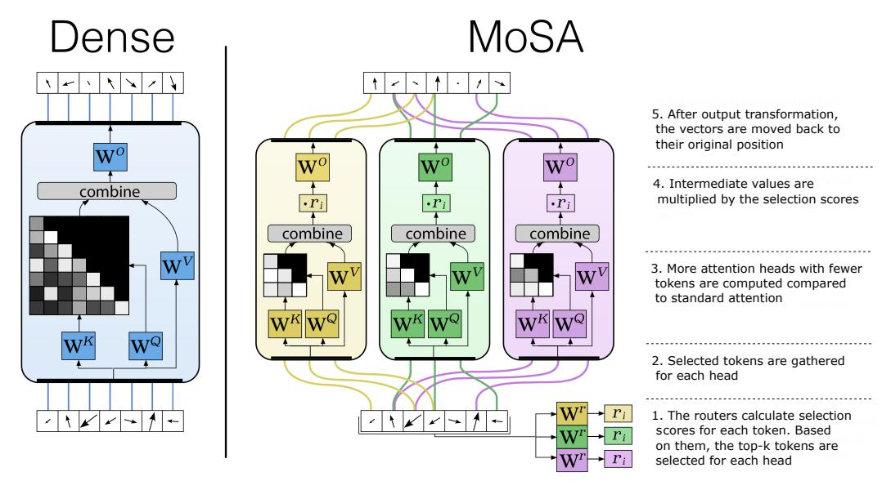

# Piotr Piękos1, Róbert Csordás2, Jürgen Schmidhuber1

1KAUST, AI Initiative, Thuwal, Saudi Arabia 2Stanford University, Stanford, CA, USA piotr.piekos@kaust.edu.sa rcsordas@stanford.edu juergen.schmidhuber@kaust.edu.sa

#### **Abstract**

Recent advances in large language models highlighted the excessive quadratic cost of self-attention. Despite the significant research efforts, subquadratic attention methods still suffer from inferior performance in practice. We hypothesize that dynamic, learned content-based sparsity can lead to more efficient attention mechanisms. We present Mixture of Sparse Attention (MoSA), a novel approach inspired by Mixture of Experts (MoE) with expert choice routing. MoSA dynamically selects tokens for each attention head, allowing arbitrary sparse attention patterns. By selecting k tokens from a sequence of length T, MoSA reduces the computational complexity of each attention head from  $O(T^2)$  to  $O(k^2 + T)$ . This enables using more heads within the same computational budget, allowing higher specialization. We show that among the tested sparse attention variants, MoSA is the only one that can outperform the dense baseline, sometimes with up to 27% better perplexity for an identical compute budget. MoSA can also reduce the resource usage compared to dense self-attention. Despite using torch implementation without an optimized kernel, perplexity-matched MoSA models are simultaneously faster in wall-clock time, require less memory for training, and drastically reduce the size of the KV-cache compared to the dense transformer baselines.

https://github.com/piotrpiekos/MoSA

### 1 Introduction

Modern transformer architectures [1] have proven to be highly effective for sequence modeling tasks and are the key to the success of large language models (LLMs; [2, 3, 4, 5]). One of the key components of their success is the attention mechanism, which enables dynamic information propagation by computing weighted sums of past states when processing each token. This results in high computational and memory complexity, both quadratic in sequence length. The key to the success of LLMs is the ever-increasing model sizes and context windows. Training and deploying these models becomes increasingly prohibitive. Furthermore, the KV-cache memory footprint during inference presents a significant bottleneck, limiting practical deployment scenarios and increasing operational costs.

This led the researchers to explore alternative approaches. State Space Models [6, 7, 8, 9, 10] capture long-range dependencies with just a handful of state variables rather than relying on full attention matrices. They, however, fall short of full self-attention in terms of practical performance. To counteract lossy compression of State Space Models, a recent line of work investigates hybrids that

Figure 1: MoSA layer compared to the dense attention layer. MoSA replaces each dense head with multiple heads with a learnable sparsity pattern. Each head selects its own k tokens to process. MoSA calculates query, key, and value projections only for the selected token and computes the attention only between them. It drops the rest of the tokens, leading to more efficient compute utilization. This reduces the computational and memory complexity on a sequence of length T from  $O(T^2)$  to  $O(k^2+T)$ . The saved compute budget can be used to scale up the number of heads.

combine quadratic attention and linearized memories [11, 12, 13]. Linear attention [14, 15, 16]\* optimizes the attention cost by changing the order of the operations in the attention after removing nonlinearity. However, it also performs poorly compared to quadratic attention [17].

As an alternative, static sparse attention methods [18] reduce the quadratic complexity by selectively attending to a subset of tokens to be used in the attention. They use hand-defined coarse-grained patterns that are not data-dependent. Typical examples of these methods are the block-sparse and strided attention [18, 19, 20]. Static sparsity and block aggregation methods, however, impose significant limitations. They encourage the compression of multiple tokens into a single, lossy representation. This is necessary to remember information beyond the active block. Such compression makes fine-grained recall difficult. The problem is similar to the well-known limitation of state-space models, which are forced to compress the entire past into a fixed-size representation [21, 22]. Content-based dynamic sparse attention [23, 24, 25] methods can, in principle, learn to attend to individual tokens, regardless of their location in the input, while ignoring less useful tokens. The Routing Transformer [25] clusters the tokens within each head using online K-means. However, it fails to show significant performance gains over static sparse-attention methods, possibly due to the slow convergence of online K-means [26].

We propose a novel approach, inspired by Mixture-of-Experts [27, 28], to create a dynamic, content-based, and head-specific selection of tokens for sparse attention. This is achieved with Expert-Choice Routing [29], where each attention head is treated like an expert and selects its own specific tokens from the input. This creates a perfectly balanced selection, avoiding the need for complicated regularization techniques. We name our approach Mixture-of-Sparse Attention(*MoSA*). Although recent work explored applying ideas from the MoE literature to attention mechanisms [30, 31], they focus on reducing the number of materialized dense attention matrices. We propose a different approach: we make the attention matrices sparse by selecting a small subset of tokens to use for each attention head.

By selecting k tokens from a sequence of length T, MoSA reduces the computational complexity of the attention head from  $O(T^2)$  to  $O(k^2 + T)$ . Sparse attention techniques have historically

\*Note that *unnormalized linear transformers* (with "linear attention") were first published in 1992 under the name *fast weight controllers* [16] or *fast weight programmers*.

been employed out of necessity to manage long sequences that exceed available computational capacities. In contrast, we also explore the use of the saved computation budget for creating additional attention heads. Thus, in this setup, MoSA employs a large number of highly sparse attention heads, encouraging their specialization. We show that this allows for better utilization of the available compute budget and leads to substantially better iso-flop language modeling performance compared to dense attention. Furthermore, we analyze other sparse attention methods, such as fixed sparse attention [\[18\]](#page-14-17) and the Routing Attention (the attention introduced in the Routing Transformer) [\[25\]](#page-15-6). MoSA is the only sparse attention method we analyzed that demonstrates improvement over dense baselines in the IsoFLOP setting.

Our main results demonstrate that hybrid models with many MoSA and four dense heads significantly improve the model's quality by up to 27% in an IsoFLOP setting. Specifically, we evaluate MoSA on a language modeling task by starting with dense baselines and incrementally sparsifying the attention. We ensure FLOP-matching by swapping a specific number of dense heads for *more* sparse heads. We repeat this procedure on different scales, starting with baselines from 28M to 516M parameters. MoSA consistently improves perplexity across all model scales.

The IsoFLOP results demonstrate MoSA's superior performance in a FLOP-matched setting. However, sparse attention methods are often used to reduce computational and memory requirements. Furthermore, the idealized FLOP requirements often do not reflect wall-clock time. To demonstrate MoSA's efficiency, we show that in a perplexity-matched setting, MoSA exhibits both improved wall-clock time and GPU memory consumption even without a specialized CUDA kernel. It also reduces the total number of keys and values used in the computation, resulting in a significantly smaller KV cache. KV-cache size is an important practical problem for LLM inference and is the main focus of many post-training sparse attention methods [\[32,](#page-15-13) [33,](#page-15-14) [34\]](#page-15-15). We investigate practical benefits in Section [3.3.](#page-9-0)

In summary, our contributions are the following:

- 1. We propose MoSA, a sparse attention method that uses a *learned*, context-based token selection, with each of the heads attending to a small subset of all tokens.
- 2. We evaluate MoSA in an IsoFLOP setting on four different scales with dense baselines ranging from 28M parameters to 516M. In this setting, MoSA improves perplexity by up to 27%. MoSA is the only sparse attention method we analyzed that improved perplexity compared to the dense baseline.
- 3. We demonstrate that, in a perplexity-matched setting, a pure PyTorch implementation of MoSA improves both wall-clock time and memory usage simultaneously, without requiring specialized fast kernels. This setup also drastically reduces the KV cache size by using only a small subset of keys and values.
- 4. We demonstrate that on long sequences, MoSA maintains a large advantage compared to other tested sparse-attention methods.

The paper is organized as follows. Section [2](#page-2-0) provides the necessary background and describes MoSA. Section [3](#page-5-0) includes the experimental setup and the results. Section [4](#page-11-0) discusses related work, and Section [5](#page-13-0) provides a general discussion as well as potential future directions.

