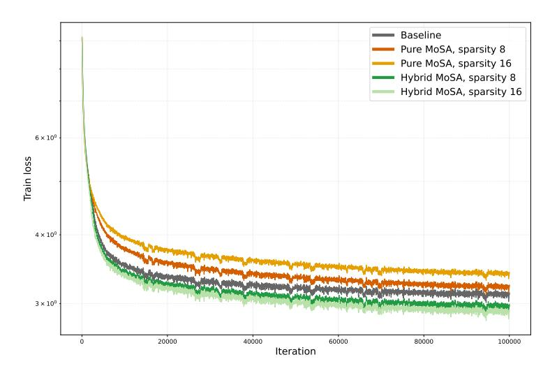

# References

- [1] Ashish Vaswani, Noam Shazeer, Niki Parmar, Jakob Uszkoreit, Llion Jones, Aidan N. Gomez, Lukasz Kaiser, and Illia Polosukhin. Attention is all you need. In *Proc. Advances in Neural Information Processing Systems (NIPS)*, pages 5998–6008, Long Beach, CA, USA, December 2017.
- [2] Tom Brown, Benjamin Mann, Nick Ryder, Melanie Subbiah, Jared D Kaplan, Prafulla Dhariwal, Arvind Neelakantan, Pranav Shyam, Girish Sastry, Amanda Askell, et al. Language models are few-shot learners. In *Proc. Advances in Neural Information Processing Systems (NeurIPS)*, pages 1877–1901, 2020.
- [3] Hugo Touvron, Thibaut Lavril, Gautier Izacard, Xavier Martinet, Marie-Anne Lachaux, Timothée Lacroix, Baptiste Rozière, Naman Goyal, Eric Hambro, Faisal Azhar, Aurélien Rodriguez, Armand Joulin, Edouard Grave, and Guillaume Lample. LLaMA: Open and efficient foundation language models. *Preprint arXiv:2302.13971*, 2023.
- [4] Gemini Team, Petko Georgiev, Ving Ian Lei, Ryan Burnell, Libin Bai, Anmol Gulati, Garrett Tanzer, Damien Vincent, Zhufeng Pan, Shibo Wang, et al. Gemini 1.5: Unlocking multimodal understanding across millions of tokens of context. *arXiv preprint arXiv:2403.05530*, 2024.
- [5] Aaron Grattafiori, Abhimanyu Dubey, Abhinav Jauhri, Abhinav Pandey, Abhishek Kadian, Ahmad Al-Dahle, Aiesha Letman, Akhil Mathur, Alan Schelten, Alex Vaughan, et al. The llama 3 herd of models. *arXiv preprint arXiv:2407.21783*, 2024.
- [6] Albert Gu, Tri Dao, Stefano Ermon, Atri Rudra, and Christopher Ré. Hippo: Recurrent memory with optimal polynomial projections. In *Proc. Advances in Neural Information Processing Systems (NeurIPS)*, volume 33, pages 1474–1487, 2020.
- [7] Albert Gu, Karan Goel, and Christopher Ré. Efficiently modeling long sequences with structured state spaces. In *Int. Conf. on Learning Representations (ICLR)*, 2022.
- [8] Albert Gu and Tri Dao. Mamba: Linear-time sequence modeling with selective state spaces. *arXiv preprint arXiv:2312.00752*, 2023.
- [9] Xiao Wang, Shiao Wang, Yuhe Ding, Yuehang Li, Wentao Wu, Yao Rong, Weizhe Kong, Ju Huang, Shihao Li, Haoxiang Yang, et al. State space model for new-generation network alternative to transformers: A survey. *arXiv preprint arXiv:2404.09516*, 2024.
- [10] Songlin Yang, Jan Kautz, and Ali Hatamizadeh. Gated delta networks: Improving mamba2 with delta rule. In *Int. Conf. on Learning Representations (ICLR)*, 2025.
- [11] Jongho Park, Jaeseung Park, Zheyang Xiong, Nayoung Lee, Jaewoong Cho, Samet Oymak, Kangwook Lee, and Dimitris Papailiopoulos. Can mamba learn how to learn? a comparative study on in-context learning tasks. In *Proc. Int. Conf. on Machine Learning (ICML)*, 2024.
- [12] Simiao Zuo, Xiaodong Liu, Jian Jiao, Denis Charles, Eren Manavoglu, Tuo Zhao, and Jianfeng Gao. Efficient long sequence modeling via state space augmented transformer. *arXiv preprint arXiv:2212.08136*, 2022.
- [13] Opher Lieber, Barak Lenz, Hofit Bata, Gal Cohen, Jhonathan Osin, Itay Dalmedigos, Erez Safahi, Shaked Meirom, Yonatan Belinkov, Shai Shalev-Shwartz, et al. Jamba: A hybrid transformer-mamba language model. *arXiv preprint arXiv:2403.19887*, 2024.
- [14] Angelos Katharopoulos, Apoorv Vyas, Nikolaos Pappas, and François Fleuret. Transformers are RNNs: Fast autoregressive transformers with linear attention. In *Proc. Int. Conf. on Machine Learning (ICML)*, volume 119, pages 5156–5165, Virtual Only, 2020.
- [15] Imanol Schlag, Kazuki Irie, and Jürgen Schmidhuber. Linear transformers are secretly fast weight programmers. In *Proc. Int. Conf. on Machine Learning (ICML)*, volume 139, pages 9355–9366, Virtual only, 2021.
- [16] Jürgen Schmidhuber. Learning to control fast-weight memories: An alternative to recurrent nets. *Neural Computation*, 4(1):131–139, 1992.
- [17] Zhen Qin, Xiaodong Han, Weixuan Sun, Dongxu Li, Lingpeng Kong, Nick Barnes, and Yiran Zhong. The devil in linear transformer. In *Proc. Conf. on Empirical Methods in Natural Language Processing (EMNLP)*, pages 7025–7041, 2022.
- [18] Rewon Child, Scott Gray, Alec Radford, and Ilya Sutskever. Generating long sequences with sparse transformers. *arXiv preprint arXiv:1904.10509*, 2019.

- [19] Manzil Zaheer, Guru Guruganesh, Kumar Avinava Dubey, Joshua Ainslie, Chris Alberti, Santiago Ontañon, Philip Pham, Anirudh Ravula, Qifan Wang, Li Yang, et al. Big bird: Transformers for longer sequences. In *Proc. Advances in Neural Information Processing Systems (NeurIPS)*, volume 33, pages 17283–17297, 2020.
- [20] Iz Beltagy, Matthew E. Peters, and Arman Cohan. Longformer: The long-document transformer. *arXiv:2004.05150*, 2020.
- [21] Simran Arora, Sabri Eyuboglu, Aman Timalsina, Isys Johnson, Michael Poli, James Zou, Atri Rudra, and Christopher Ré. Zoology: Measuring and improving recall in efficient language models. *Int. Conf. on Learning Representations (ICLR)*, 2024.
- [22] Samy Jelassi, David Brandfonbrener, Sham M Kakade, and Eran Malach. Repeat after me: Transformers are better than state space models at copying. In *Proc. Int. Conf. on Machine Learning (ICML)*, 2024.
- [23] Yi Tay, Dara Bahri, Donald Metzler, Da-Cheng Juan, Zhe Zhao, and Che Zheng. Synthesizer: Rethinking self-attention for transformer models. In *Proc. Int. Conf. on Machine Learning (ICML)*, pages 10183–10192, 2021.
- [24] Apoorv Vyas, Angelos Katharopoulos, and François Fleuret. Fast transformers with clustered attention. In *Proc. Advances in Neural Information Processing Systems (NeurIPS)*, volume 33, pages 21665–21674, 2020.
- [25] Aurko Roy, Mohammad Saffar, Ashish Vaswani, and David Grangier. Efficient content-based sparse attention with routing transformers. *Transactions of the Association for Computational Linguistics (TACL)*, 9:53–68, 2021.
- [26] Leon Bottou and Yoshua Bengio. Convergence properties of the k-means algorithms. In *Proc. Advances in Neural Information Processing Systems (NIPS)*, volume 7, 1994.
- [27] Noam Shazeer, Azalia Mirhoseini, Krzysztof Maziarz, Andy Davis, Quoc Le, Geoffrey Hinton, and Jeff Dean. Outrageously large neural networks: The sparsely-gated mixture-of-experts layer. In *Int. Conf. on Learning Representations (ICLR)*, Toulon, France, April 2017.
- [28] William Fedus, Barret Zoph, and Noam Shazeer. Switch transformers: Scaling to trillion parameter models with simple and efficient sparsity. *Journal of Machine Learning Research (JMLR)*, 23(1):5232–5270, 2022.
- [29] Yanqi Zhou, Tao Lei, Hanxiao Liu, Nan Du, Yanping Huang, Vincent Zhao, Andrew M Dai, Quoc V Le, James Laudon, et al. Mixture-of-experts with expert choice routing. In *Proc. Advances in Neural Information Processing Systems (NeurIPS)*, volume 35, pages 7103–7114, 2022.
- [30] Xiaofeng Zhang, Yikang Shen, Zeyu Huang, Jie Zhou, Wenge Rong, and Zhang Xiong. Mixture of attention heads: Selecting attention heads per token. In *Proc. Conf. on Empirical Methods in Natural Language Processing (EMNLP)*, pages 4150–4162, Abu Dhabi, United Arab Emirates, December 2022.
- [31] Róbert Csordás, Piotr Pi˛ekos, Kazuki Irie, and Jürgen Schmidhuber. Switchhead: Accelerating transformers with mixture-of-experts attention. In *Proc. Advances in Neural Information Processing Systems (NeurIPS)*, Vancouver, Canada, December 2024.
- [32] Zichang Liu, Aditya Desai, Fangshuo Liao, Weitao Wang, Victor Xie, Zhaozhuo Xu, Anastasios Kyrillidis, and Anshumali Shrivastava. Scissorhands: Exploiting the persistence of importance hypothesis for llm kv cache compression at test time. In *Proc. Advances in Neural Information Processing Systems (NeurIPS)*, volume 36, pages 52342–52364, 2023.
- [33] Yuhong Li, Yingbing Huang, Bowen Yang, Bharat Venkitesh, Acyr Locatelli, Hanchen Ye, Tianle Cai, Patrick Lewis, and Deming Chen. Snapkv: Llm knows what you are looking for before generation. In *Proc. Advances in Neural Information Processing Systems (NeurIPS)*, volume 37, pages 22947–22970, 2025.
- [34] Zefan Cai, Yichi Zhang, Bofei Gao, Yuliang Liu, Tianyu Liu, Keming Lu, Wayne Xiong, Yue Dong, Baobao Chang, Junjie Hu, and Xiao Wen. Pyramidkv: Dynamic kv cache compression based on pyramidal information funneling. *arXiv preprint arXiv:2406.02069*, 2024.
- [35] Dmitry Lepikhin, HyoukJoong Lee, Yuanzhong Xu, Dehao Chen, Orhan Firat, Yanping Huang, Maxim Krikun, Noam Shazeer, and Zhifeng Chen. Gshard: Scaling giant models with conditional computation and automatic sharding. In *Int. Conf. on Learning Representations (ICLR)*, 2021.

- [36] Noam Shazeer. Fast transformer decoding: One write-head is all you need. *arXiv preprint arXiv:1911.02150*, 2019.
- [37] Jingyang Yuan, Huazuo Gao, Damai Dai, Junyu Luo, Liang Zhao, Zhengyan Zhang, Zhenda Xie, YX Wei, Lean Wang, Zhiping Xiao, et al. Native sparse attention: Hardware-aligned and natively trainable sparse attention. *arXiv preprint arXiv:2502.11089*, 2025.
- [38] Róbert Csordás, Kazuki Irie, and Jürgen Schmidhuber. Approximating two-layer feedforward networks for efficient transformers. In *Findings of the Association for Computational Linguistics: EMNLP 2023*, November 2023.
- [39] Tri Dao, Daniel Y. Fu, Stefano Ermon, Atri Rudra, and Christopher Ré. FlashAttention: Fast and memory-efficient exact attention with IO-awareness. In *Proc. Advances in Neural Information Processing Systems (NeurIPS)*, New Orleans, Louisiana, USA, December 2022.
- [40] Adam Paszke, Sam Gross, Francisco Massa, Adam Lerer, James Bradbury, Gregory Chanan, Trevor Killeen, Zeming Lin, Natalia Gimelshein, Luca Antiga, Alban Desmaison, Andreas Kopf, Edward Yang, Zachary DeVito, Martin Raison, Alykhan Tejani, Sasank Chilamkurthy, Benoit Steiner, Lu Fang, Junjie Bai, and Soumith Chintala. PyTorch: An imperative style, high-performance deep learning library. In *Proc. Advances in Neural Information Processing Systems (NeurIPS)*, pages 8024–8035, Vancouver, Canada, December 2019.
- [41] Jianlin Su, Yu Lu, Shengfeng Pan, Bo Wen, and Yunfeng Liu. RoFormer: Enhanced transformer with rotary position embedding. *Preprint arXiv:2104.09864*, 2021.
- [42] Taku Kudo and John Richardson. Sentencepiece: A simple and language independent subword tokenizer and detokenizer for neural text processing. In *Proc. Conf. on Empirical Methods in Natural Language Processing (EMNLP)*, pages 66–71, Brussels, Belgium, October 2018.
- [43] Rico Sennrich, Barry Haddow, and Alexandra Birch. Neural machine translation of rare words with subword units. In *Proc. Association for Computational Linguistics (ACL)*, pages 1715–1725, Berlin, Germany, August 2016.
- [44] Mike Schuster and Kaisuke Nakajima. Japanese and korean voice search. In *Proc. IEEE Int. Conf. on Acoustics, Speech and Signal Processing (ICASSP)*, pages 5149–5152, Kyoto, Japan, March 2012.
- [45] Colin Raffel, Noam Shazeer, Adam Roberts, Katherine Lee, Sharan Narang, Michael Matena, Yanqi Zhou, Wei Li, and Peter J. Liu. Exploring the limits of transfer learning with a unified text-to-text transformer. *Journal of Machine Learning Research (JMLR)*, 21:140:1–140:67, 2020.
- [46] Diederik P. Kingma and Jimmy Ba. Adam: A method for stochastic optimization. In Yoshua Bengio and Yann LeCun, editors, *Int. Conf. on Learning Representations (ICLR)*, San Diego, CA, USA, May 2015.
- [47] Qingru Zhang, Dhananjay Ram, Cole Hawkins, Sheng Zha, and Tuo Zhao. Efficient long-range transformers: You need to attend more, but not necessarily at every layer. In *Proc. Conf. on Empirical Methods in Natural Language Processing (EMNLP)*, 2023.
- [48] Guangxuan Xiao, Yuandong Tian, Beidi Chen, Song Han, and Mike Lewis. Efficient streaming language models with attention sinks. In *Int. Conf. on Learning Representations (ICLR)*, 2024.
- [49] Nikita Kitaev, Kaiser Łukasz, and Anselm Levskaya. Reformer: The efficient transformer. In *Int. Conf. on Learning Representations (ICLR)*, 2020.
- [50] Chejian Xu, Wei Ping, Peng Xu, Zihan Liu, Boxin Wang, Mohammad Shoeybi, Bo Li, and Bryan Catanzaro. From 128k to 4m: Efficient training of ultra-long context large language models. *arXiv preprint arXiv:2504.06214*, 2025.
- [51] Denis Paperno, Germán Kruszewski, Angeliki Lazaridou, Quan Ngoc Pham, Raffaella Bernardi, Sandro Pezzelle, Marco Baroni, Gemma Boleda, and Raquel Fernández. The LAMBADA dataset: Word prediction requiring a broad discourse context. In *Proc. Association for Computational Linguistics (ACL)*, Berlin, Germany, August 2016.
- [52] Keisuke Sakaguchi, Ronan Le Bras, Chandra Bhagavatula, and Yejin Choi. Winogrande: An adversarial winograd schema challenge at scale. In *Proc. AAAI Conf. on Artificial Intelligence*, pages 8732–8740, New York, NY, USA, February 2020.

- [53] Alex Warstadt, Alicia Parrish, Haokun Liu, Anhad Mohananey, Wei Peng, Sheng-Fu Wang, and Samuel R. Bowman. BLiMP: The benchmark of linguistic minimal pairs for English. *Transactions of the Association for Computational Linguistics (TACL)*, 8:377–392, 2020.
- [54] Rowan Zellers, Ari Holtzman, Yonatan Bisk, Ali Farhadi, and Yejin Choi. Hellaswag: Can a machine really finish your sentence? In *Proc. Association for Computational Linguistics (ACL)*, pages 4791–4800, Florence, Italy, August 2019.
- [55] Yonatan Bisk, Rowan Zellers, Ronan Le Bras, Jianfeng Gao, and Yejin Choi. PIQA: reasoning about physical commonsense in natural language. In *Proc. AAAI Conf. on Artificial Intelligence*, pages 7432–7439, New York, NY, USA, February 2020. AAAI Press.
- [56] Peter Clark, Isaac Cowhey, Oren Etzioni, Tushar Khot, Ashish Sabharwal, Carissa Schoenick, and Oyvind Tafjord. Think you have solved question answering? try ARC, the AI2 reasoning challenge. *Preprint arXiv:1803.05457*, 2018.
- [57] Barret Zoph, Irwan Bello, Sameer Kumar, Nan Du, Yanping Huang, Jeff Dean, Noam Shazeer, and William Fedus. St-moe: Designing stable and transferable sparse expert models. *arXiv preprint arXiv:2202.08906*, 2022.
- [58] Sheng Shen, Le Hou, Yanqi Zhou, Nan Du, Shayne Longpre, Jason Wei, Hyung Won Chung, Barret Zoph, William Fedus, Xinyun Chen, et al. Mixture-of-experts meets instruction tuning: A winning combination for large language models. In *Int. Conf. on Learning Representations (ICLR)*, 2024.
- [59] Krzysztof Marcin Choromanski, Valerii Likhosherstov, David Dohan, Xingyou Song, Andreea Gane, Tamás Sarlós, Peter Hawkins, Jared Quincy Davis, Afroz Mohiuddin, Lukasz Kaiser, David Benjamin Belanger, Lucy J. Colwell, and Adrian Weller. Rethinking attention with performers. In *Int. Conf. on Learning Representations (ICLR)*, Virtual only, May 2021.
- [60] Guoxuan Chen, Han Shi, Jiawei Li, Yihang Gao, Xiaozhe Ren, Yimeng Chen, Xin Jiang, Zhenguo Li, Weiyang Liu, and Chao Huang. Sepllm: Accelerate large language models by compressing one segment into one separator. *arXiv preprint arXiv:2412.12094*, 2024.
- [61] Aditya Desai, Shuo Yang, Alejandro Cuadron, Ana Klimovic, Matei Zaharia, Joseph E Gonzalez, and Ion Stoica. Hashattention: Semantic sparsity for faster inference. *arXiv preprint arXiv:2412.14468*, 2024.
- [62] Daya Guo, Dejian Yang, Haowei Zhang, Junxiao Song, Ruoyu Zhang, Runxin Xu, Qihao Zhu, Shirong Ma, Peiyi Wang, Xiao Bi, et al. Deepseek-r1: Incentivizing reasoning capability in llms via reinforcement learning. *arXiv preprint arXiv:2501.12948*, 2025.
- [63] Albert Q Jiang, Alexandre Sablayrolles, Antoine Roux, Arthur Mensch, Blanche Savary, Chris Bamford, Devendra Singh Chaplot, Diego de las Casas, Emma Bou Hanna, Florian Bressand, et al. Mixtral of experts. *arXiv preprint arXiv:2401.04088*, 2024.
- [64] Yikang Shen, Zhen Guo, Tianle Cai, and Zengyi Qin. Jetmoe: Reaching llama2 performance with 0.1 m dollars. *arXiv preprint arXiv:2404.07413*, 2024.
- [65] Mike Lewis, Shruti Bhosale, Tim Dettmers, Naman Goyal, and Luke Zettlemoyer. BASE layers: Simplifying training of large, sparse models. In Marina Meila and Tong Zhang, editors, *Proc. Int. Conf. on Machine Learning (ICML)*, volume 139, pages 6265–6274, Virtual only, July 2021.
- [66] Stephen Roller, Sainbayar Sukhbaatar, Jason Weston, et al. Hash layers for large sparse models. In *Proc. Advances in Neural Information Processing Systems (NeurIPS)*, volume 34, pages 17555–17566, 2021.
- [67] David Raposo, Sam Ritter, Blake Richards, Timothy Lillicrap, Peter Conway Humphreys, and Adam Santoro. Mixture-of-depths: Dynamically allocating compute in transformer-based language models. *arXiv preprint arXiv:2404.02258*, 2024.
- [68] Peng Jin, Bo Zhu, Li Yuan, and Shuicheng Yan. Moh: Multi-head attention as mixture-of-head attention. *arXiv preprint arXiv:2410.11842*, 2024.
- [69] Joshua Ainslie, James Lee-Thorp, Michiel de Jong, Yury Zemlyanskiy, Federico Lebrón, and Sumit Sanghai. Gqa: Training generalized multi-query transformer models from multi-head checkpoints. In *Proc. Conf. on Empirical Methods in Natural Language Processing (EMNLP)*, pages 4895–4901, 2023.

[70] Ruibin Xiong, Yunchang Yang, Di He, Kai Zheng, Shuxin Zheng, Chen Xing, Huishuai Zhang, Yanyan Lan, Liwei Wang, and Tie-Yan Liu. On layer normalization in the transformer architecture. In *Proc. Int. Conf. on Machine Learning (ICML)*, volume 119, pages 10524–10533, Virtual Only, July 2020.

#### A FLOPs cost derivation

In this section, we derive the FLOP cost for dense and MoSA heads, and the total FLOPs necessary for the forward pass of each model.

Multiplying matrices of shape [i, j] and [j, k] takes precisely (2j - 1)ik FLOPs. For simplicity, following common practice, we approximate it by 2jik.

In the dense attention layer, calculating each projection (e.g.,  $Q_i = xW_{Q_i}$ ) requires 2hh'T FLOPs. Computing the attention matrix  $QK^{\top}$ , and multiplying the attention matrix by values V both cost  $2h'T^2$  FLOPs.

Calculating the projections and attention in the MoSA head is identical, except that now we are operating on k tokens instead of T. The MoSA head involves an additional routing overhead. Calculating the routing scores costs 2hT FLOPs, and multiplying the intermediate values in the matrix  $\in \mathbb{R}^{k \times h'}$  by the scores costs an additional h'k FLOPs per head.

The cost of a single head of the dense and MoSA heads are:

$$\begin{aligned} \text{FLOP}_{\text{dense}} &= \underbrace{8hh'T}_{\text{Q,K,V,O mappings}} + \underbrace{4h'T^2}_{\text{Attention}} \\ \\ \text{FLOP}_{\text{mosa}} &= \underbrace{8hh'k}_{\text{Q,K,V,O mappings}} + \underbrace{4h'k^2}_{\text{Attention}} + \underbrace{2hT + h'k}_{\text{routing overhead}} \end{aligned}$$

For the multihead version, the FLOPs are multiplied by the number of heads H. There is an additional cost caused by summing the head contributions to a single output (Equations 2 and 3). However, this is already taken into account by the 2hh'TH cost of the output projection for multiple heads:  $H(2h'-1)hT + (H-1)hT = (2h'H-1)hT \approx 2hh'TH$ .

Note that in the standard notation [1], the heads are first concatenated and then transformed with a single output projection instead of splitting the output operation into individual head transformations and summing. However, the result and the derivation of the FLOP counts are the same.

In the feedforward block, the intermediate layer has a typical size of 4h. Therefore, the cost of the block is equal to  $16h^2T$ . Therefore, the FLOP cost of the forward pass of the entire model with l layers, a hybrid attention with  $H_{dense}$  dense heads and  $H_{mosa}$  MoSA heads is equal to:

$$lH_{dense}(8hh'T + 4h'T^2) + lH_{mosa}(8hh'k + 4h'k^2 + 2hT + h'k) + 16lh^2T$$

We omit the operations related to layer normalizations, residuals, and token embeddings from the FLOP calculations as they are negligible compared to the rest and represent an identical overhead for both dense and MoSA models. Thus, incorporating them does not influence the FLOP-matching process. This is also true for the feedforward block; yet, we still included it because it constitutes a significant portion of the total cost. We present the FLOP cost of all of our model classes (*Tiny, Small, Medium* and *Large*) in Table 4.

All models are based on the transformer architecture with Pre-layer normalisation[70]. Each model class *Tiny, Small, Medium* and *Large* follows the hyperparameters of the dense model. The necessary forward pass FLOPs are calculated according to Sec. 3.2. The number of heads in the sparse models is set so that the resulting model is FLOP-matched to the dense baseline as closely as possible. When this is not perfectly possible, we ensure that its FLOP count never exceeds that of the baseline. For pure MoSA, all heads are replaced with MoSA heads. For the hybrid sparse models, 4 dense heads are kept, and the remaining ones are replaced with sparse heads.

Figure 5: Perplexity of IsoFLOP matching models under pure MoSA setting. Each curve corresponds to a given FLOP budget. For a given sparsity, we replace all dense heads with a FLOP equivalent number of MoSA heads. In contrast to Fig 3, sparse models fail to outperform the baseline (apart from the Large model). This demonstrates the symbiotic relation between dense heads and MoSA heads in the hybrid model.

#### B Analysing Hybrid Models

While the learned sparse attention can theoretically capture any attention pattern, the introduction of the routing mechanism complicates the learning dynamics. The router and the attention weights must be learned jointly. The router needs to identify relevant token pairs, while the attention weights learn to process these selected interactions. This interdependence can lead to training instabilities, particularly in the early stages, when router decisions are largely random. Poor initial routing can prevent attention heads from learning meaningful patterns, while the lack of meaningful patterns prevents the router from learning to select important tokens, creating a vicious circle.

Our preliminary experiments have shown that pure MoSA models without additional dense heads fail to improve the perplexity of dense baselines. To verify this, we conducted a study similar to our main results in Sec. 3.2. We gradually increase the sparsity by replacing all dense heads with MoSA heads while maintaining an identical FLOP count to the baseline. We do this by finding the maximum number of MoSA heads for which the FLOP count remains lower than the baseline. The results, shown in Fig. 5, demonstrate that increasing sparsity monotonically worsens model performance in most settings. This performance degradation with pure MoSA heads likely stems from the stability issues explained in the previous paragraph.

Interestingly, the largest model is an exception, and initially there is a visible improvement from 12.20 baseline perplexity to 11.83 perplexity of the FLOP-matched pure MoSA model with sparsity 2. This is still significantly worse than the 10.58 perplexity of the hybrid model with sparsity 4. Moreover, the saturation is much faster than for hybrid models. For hybrid models, the sparsity around 32 or 64 seems to be optimal. In contrast, for the MoSA-only model, the best perplexity is reached for sparsity 2 for the *Large* budget and 1 for the smaller ones. However, the conclusion is consistent across all scales: hybrid MoSA models significantly outperform MoSA-only models, which generally underperform the dense baseline. Thus, hybridization seems necessary.

The impact of sparsification is also visible in the training characteristics. Compared to the baseline, pure MoSA models start to plateau faster. While the losses of dense and hybrid models continue to show steep initial improvement, pure MoSA models slow down much sooner. This supports our hypothesis about the difficulty of learning the routing and attention simultaneously. We compare the training losses in Fig. 6.

**Optimal Number of Dense Heads** Hybrid models consistently outperform pure MoSA models. This raises a natural question: What is the optimal ratio of dense to sparse heads and how does this ratio relate to the sparsity rate?

To answer these questions, we conducted a series of experiments in which we varied both the sparsity factor of MoSA heads and the number of dense heads while keeping the total FLOP budget constant. We choose to use the *small* model and investigate sparsities  $\rho = 4$  and  $\rho = 16$ , while we set the

Figure 6: Training losses of the Tiny models comparing the baseline, pure MoSA, and hybrid models. The dense baseline clearly divides the models into two groups: all pure MoSA models perform worse (higher loss), while all hybrid models demonstrate superior performance (lower loss). Notably, increasing sparsity intensifies the difference for both model types: hybrid models achieve progressively lower loss with greater sparsity, whereas pure MoSA models show increasingly higher loss as sparsity increases. Additionally, the early training phase (between 5,000 and 10,000 steps) reveals a distinct pattern where pure MoSA models experience a more rapid slowdown in their learning progress compared to both dense and hybrid models.

Figure 7: Perplexity of the FLOP matched models with a different number of dense heads for sparsities 4 and 16. 9 dense heads correspond to the dense baseline.

number of dense heads in the hybrid model from 0 to 9 (full dense model) and adapt the number of sparse heads to match the FLOP budget. Our results are shown in Fig. [7.](#page-20-2) We can see that the optimal number of dense heads in this case is 4 and is sparsity-agnostic. Because of this, we chose to use 4 dense heads in our main experiments in Sect. [3.2.](#page-7-0) Furthermore, we observe that it is critical to have at least one dense head. Having more than one has diminishing returns, and having more than 4 has a negative effect on the performance. The plot also shows that the lack of dense heads is more hurtful for models with higher sparsities. We conclude that in our case, 4 heads are sufficient to stabilize the training, and it is better to allocate the remaining FLOP budget to the more efficient MoSA heads.

