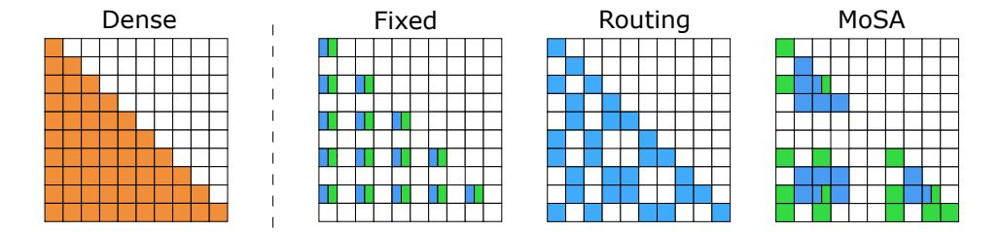

# 2 Method

#### 2.1 Background

Here, we will discuss the necessary background on multi-head self-attention and mixtures of experts, which are required to understand our method.

Attention Mechanism. Attention assigns input-dependent weights to tokens in a sequence, allowing each token to gather context from the rest of the sequence. To do this, each token is projected to three vectors: its *query*, *key*, and *value*. For a given token, we compare its *query* vector with the *key* vectors of all tokens (including itself), producing a set of similarity scores. The scores are then normalized and used to calculate a weighted sum of the tokens' *value* vectors. The result is a new representation that dynamically integrates information throughout the sequence.

Let T be the sequence length, h the hidden dimension of the model, and h' the hidden dimension in each head.  $\mathbf{Q}, \mathbf{K}, \mathbf{V} \in \mathbb{R}^{T \times h'}$  represents the query, key and value matrices, respectively.

The attention output is computed as:

$$Attention(\mathbf{Q}, \mathbf{K}, \mathbf{V}, \mathbf{M}) = softmax\left(\frac{\mathbf{Q}\mathbf{K}^{\top} + \mathbf{M}}{\sqrt{h'}}\right)\mathbf{V}$$
 (1)

Here,  $\mathbf{M}$  denotes the attention mask that represents hard modeling constraints.  $\mathbf{M}_{i,j}=0$  if and only if i'th token is allowed to attend to j'th token, otherwise  $\mathbf{M}_{i,j}=-\infty$ . In causal language models,  $\mathbf{M}_{i,j}=0 \iff i \geq j$  ensures that no token can attend to the future.

The multi-head attention (MHA) creates multiple instances of query, key, and value matrices from an input sequence  $\mathbf{X} \in \mathbb{R}^{T \times h}$  and applies the attention to each instance independently. These instances are called heads. Each head has its own mappings  $\mathbf{W}_i^Q, \mathbf{W}_i^K, \mathbf{W}_i^V \in \mathbb{R}^{h \times h'}$  and  $\mathbf{W}_i^O \in \mathbb{R}^{h' \times h}$ , where  $i \in \{1..H\}$  and H is the number of heads. h' is typically set to  $\frac{h}{H}$ .  $\mathbf{Q}_i = \mathbf{X}\mathbf{W}_i^Q, \mathbf{K}_i = \mathbf{X}\mathbf{W}_i^K, \mathbf{V}_i = \mathbf{X}\mathbf{W}_i^V$ .

$$\mathbf{X}_{out} = \sum_{i=1}^{H} \text{Attention}(\mathbf{Q}_i, \mathbf{K}_i, \mathbf{V}_i, \mathbf{M}) \mathbf{W}_i^O$$
 (2)

The resulting mechanism allows the model to adaptively focus on relevant information while maintaining differentiability. The lack of recurrence in the operations enables parallel processing of sequence elements. However,  $\mathbf{Q}\mathbf{K}^{\top}$  is a  $T \times T$  matrix and therefore introduces quadratic computational and memory complexity as a function of the sequence length.

**Mixture of Experts.** Mixture of Experts (MoE) combines multiple specialized neural networks (experts) with a gating mechanism that learns to route each input to the best-matching experts, activating only a small subset of experts per example. An MoE layer then computes its output as a sparsely weighted combination of the predictions of selected experts, with routing weights dynamically determined by the gating network.

Formally, given an input  $x \in \mathbb{R}^h$ , the MoE layer with E experts and a scoring function (a router)  $sel: \mathbb{R}^h \to \mathbb{R}^n$  can be expressed as  $y(x) = \sum_{i \in \mathcal{E}} r_i(x) E_i(x)$  where y(x) is the final output of the layer and  $E_i(x)$  is the output of the expert i.  $\mathcal{E}$  is the set of selected experts, usually defined as  $\mathcal{E} = \operatorname{argtopk}(r(x) + \varepsilon, k)$ , where  $k \in \mathbb{N}$  is the number of active experts,  $\varepsilon$  is a stochastic noise present only during the training for exploration. The inputs are processed only by the active experts.

A critical challenge in MoE routing is ensuring balanced expert utilization. Without explicit constraints, the routing mechanism tends to overutilize a small subset of experts while leaving others largely inactive. This phenomenon, known as the load-balancing problem [27], can significantly limit the capacity of the model and the effective number of parameters. Traditional approaches address this through auxiliary load-balancing losses [35, 28] that encourage uniform expert utilization across a batch of inputs.

In contrast, Expert-Choice routing [29] ensures perfect load balancing by inverting the traditional routing paradigm. Instead of the tokens choosing their experts, the experts choose which inputs they prefer to process. Given a batch of B inputs, each expert selects the top-k out of the B inputs it will process.

Similarly to token choice routing, expert choice also reduces the *average* number of experts used to process a token. However, in contrast to token-choice routing, the amount of compute assigned is *different* between tokens. This can be beneficial, as some tokens might be harder than others and therefore should benefit from more compute. On the other hand, it might lead to uneven resource allocation, where some tokens are assigned disproportionately high compute while others might starve.

Traditionally, Mixture of Experts has been applied in transformers as a replacement for a feedforward block, which is the most parameter-heavy part of the model. However, MoEs are sometimes also applied to the attention layer. SwitchHead [31] reduces the total number of heads by replacing some of the transformations with MoEs inside the attention. MoA [30] enhances Multi-Query Attention [36]

 $^{\dagger}$ In our case, each expert selects top-k tokens from the sentence to process independently for each batch.

Figure 2: Attention variants visualized. In the plot, the colors indicate different heads. Sparse attention methods are roughly FLOP-matched and have sparsity  $\rho=2$ . One Routing Attention head corresponds in FLOP-cost to  $\rho$  Fixed/MoSA heads. Fixed sparse attention uses only  $k=\frac{T}{\rho}$  tokens in specific positions, with regular stride. The Routing Attention clusters tokens within each head into  $\rho$  clusters of size k based on their representations. MoSA selects k tokens for each attention head independently based on their representations.

by adaptively selecting query transformations for each token. Similarly to these, we also apply the MoE to the attention layer, but in a way that introduces sparsity in the attention mechanism.

#### 2.2 Mixture of Sparse Attention (MoSA)

Sparse attention methods model global dependencies by selecting specific tokens that can attend to other specific tokens based on a hand-engineered set of rules [20, 19] or by blockwise aggregation of tokens [37]. Both of these families of methods impose the mixing of information during token aggregation, either explicitly or implicitly.

We propose instead to select tokens adaptively for each head based on the input. Thus, a flexible set of important tokens can be kept around, creating content-based sparsity without the need for information mixing. To achieve that, we take inspiration from Expert-Choice routing in MoEs. We name our method *Mixture of Sparse Attention (MoSA)*. MoSA learns which individual tokens to use for attention through end-to-end training. Each attention head in MoSA learns its own unique sparsity pattern, allowing different heads to specialize in different subsets of tokens relevant to their particular function within the network. This diverse, head-specific token selection pattern ensures that the model preserves the granular information within each relevant token while dynamically discovering optimal sparsity patterns specific to the data distribution. The architectural difference between MoSA and dense attention is illustrated in Fig. 1.

The sparsity in MoSA reduces the computational cost of each attention head, allowing the use of more heads to develop targeted projections optimized for specific relationship types. The computational savings are particularly substantial when the number of selected tokens is significantly smaller than the sequence length.

In MoSA, in addition to the standard projections, each head has an additional router that selects which tokens are used for that head. Formally, the router is defined using the weight matrix  $\mathbf{W}^r \in \mathbb{R}^h$ . Let  $\mathbf{X} \in \mathbb{R}^{T \times h}$  be the T-long sequence of input tokens. The router calculates the selection scores for each token  $\mathbf{r} = \sigma(\mathbf{X}\mathbf{W}^r) \in \mathbb{R}^T$ . For  $\sigma$  we use the non-competitive sigmoid function  $\sigma(x) = \frac{1}{1+e^{-x}}$  following observations from  $\sigma$ -MoE [38]. Subsequently, we use expert choice for the selection of tokens for each head:

$$\mathbf{r}^{topk}, I = TopK(\mathbf{r}, k)$$

where TopK returns the highest k values of r called  $\mathbf{r}^{topk} \in \mathbb{R}^k$ , along with their indices  $I \in \{0,...,T-1\}^k$ . I is used to select the subset of inputs for the MoSA head:

$$\mathbf{X}^s = (\mathbf{X}_{I_1}, \mathbf{X}_{I_2}, ..., \mathbf{X}_{I_k}) \in \mathbb{R}^{k \times h}$$

where  $\mathbf{X}_i$  represents i'th row from matrix  $\mathbf{X}$ . After that, queries, keys, and values are calculated identically to the standard MHA:  $\mathbf{X}^s$  as  $\mathbf{Q} = \mathbf{X}^s \mathbf{W}^Q$ ,  $\mathbf{K} = \mathbf{X}^s \mathbf{W}^K$ ,  $\mathbf{V} = \mathbf{X}^s \mathbf{W}^V$ . As our primary target is language modeling, we also calculate the mask that prohibits attending to future tokens. Unlike the standard MHA, this mask is not triangular and has to take into account the token indices selected by the head:  $\mathbf{M}_{i,j} = 0 \iff I_i \geq I_j$ ,  $-\infty$  otherwise.

The sparse attention can be computed using the standard attention defined in Eq. 1.  $\mathbf{A} = \operatorname{Attention}(\mathbf{Q}, \mathbf{K}, \mathbf{V}, \mathbf{M})$ . This allows the combination of MoSA with optimized attention implementations such as Flash Attention [39]. The resulting vectors  $\mathbf{A}_i$  are multiplied by the corresponding router values  $\mathbf{r}_i$ . Then, after the output transformation  $\mathbf{W}^o$ , they are moved back to their original positions in the full-length sequence  $\mathbf{Y} \in \mathbb{R}^{T \times h}$ .

$$\mathbf{X}^{o} = \operatorname{diag}(\mathbf{r}) \mathbf{A} \mathbf{W}^{o} \in \mathbb{R}^{k \times h}$$

$$\mathbf{Y}_{j} = \begin{cases} \mathbf{X}_{i}^{o}, & \text{if } j = I_{i} \text{ for some } i \in \{1, \dots, k\}, \\ 0, & \text{otherwise,} \end{cases} \quad \text{for } j = 1, \dots, T.$$

 $diag(\cdot)$  creates a diagonal matrix from a vector, used for elementwise scaling of the columns of the matrix **A** by a vector **r**. This ensures that the token's contribution is proportional to the router's output. This also enables the router to receive gradients, making it learnable by gradient descent.

We call the combined transformation of x into y, parameterized by  $\theta_i = (\mathbf{W}^Q, \mathbf{W}^K, \mathbf{W}^V, \mathbf{W}^O, \mathbf{W}^r)$  a single MoSA head:  $\mathbf{Y} = \text{MoSA}_{head}(\mathbf{X}; \theta_i)$ . A MoSA layer parameterized by  $\theta = \{\theta_i\}_{i \in 1...H}$  is a sum of all MoSA heads

$$MoSA(\mathbf{X}; \theta) = \sum_{i=1}^{H} MoSA_{head}(\mathbf{X}; \theta_i)$$
(3)

The entire transformation in the multihead version can be efficiently implemented in PyTorch [40] using einsum, scatter and gather operations.

**Hybridization.** Sparse attention methods are usually combined with local attention [18, 25] when used on long sequences. Sparse attention then captures global dependencies, while local attention preserves local context. As our setup permits the use of dense attention, in our main experiments, we combine MoSA or corresponding sparse attention baseline with 4 dense heads. In Appendix B, we demonstrate the necessity of hybridization and motivate our selection of four dense heads for the models. In Section 3.4, we combine MoSA with local attention for long sequences and demonstrate that MoSA demonstrates superior performance in this scenario as well.

**Positional encodings.** All our experiments use Rotary Positional Encodings (RoPE) [41]. RoPE applies positional encodings for each attention head after query and key mapping. It does this by rotating them at an angle determined by the token's position in a sentence. Similarly to the attention mask, we must ensure that the rotations correspond to the token's original position in the sequence  $\mathbf{X}$  rather than the selected subset  $\mathbf{X}^S$ . Thus, we adapt RoPE to be aware of token positions I. Following standard practice, we rotate half of the dimensions and leave the other half unchanged.

