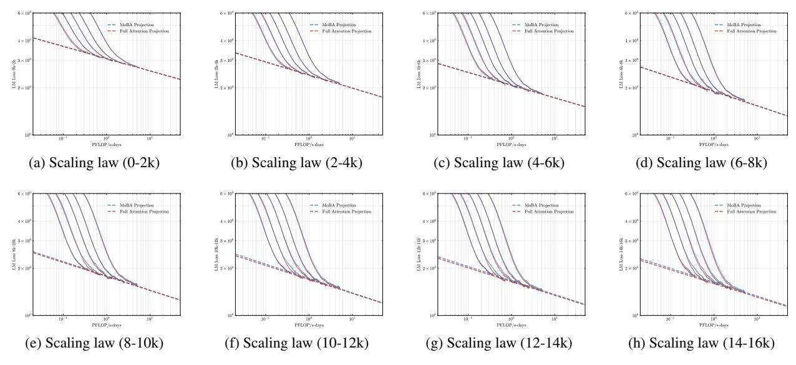
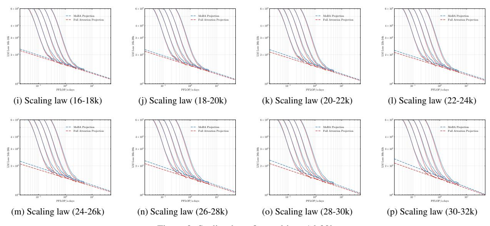

# A Appendix

### A.1 Long Context Scalability

To address the bias in natural data distribution that favors short contexts, we strategically segmented the overall sequences into discrete segments based on their actual positions. For example, the segment spanning positions 30K-32K exclusively reflects losses associated with documents exceeding 30K context lengths and also masks the positions from 30K to 32K. This approach ensures a more balanced and representative evaluation across different context lengths. In our exploration of long-context scalability, we made a pivotal discovery: the trailing tokens account for the majority of the performance discrepancy between the full context baseline and the newly proposed sparse attention architectures. Consequently, we streamlined the long-context scaling process by focusing on trailing token scaling. This not only simplifies the computational requirements but also significantly enhances the efficiency and effectiveness of investigating long-context scenarios. This finding holds substantial implications for the development of more efficient and scalable attention mechanisms in the future.

Figure 8: Scaling laws for positions 0-16k

Figure 8: Scaling laws for positions 16-32k

Table 3: Loss scaling with different positions

| LM Loss Position Range | MoBA                | Full                |
|------------------------|---------------------|---------------------|
| 0K - 2K                | −0.078 3.075 × C | −0.078 3.068 × C |
| 2K - 4K                | −0.084 2.415 × C | −0.083 2.411 × C |
| 4K - 6K                | −0.081 2.085 × C | −0.081 2.077 × C |
| 6K - 8K                | −0.092 1.899 × C | −0.092 1.894 × C |
| 8K - 10K               | −0.091 1.789 × C | −0.089 1.774 × C |
| 10K - 12K              | −0.092 1.721 × C | −0.087 1.697 × C |
| 12K - 14K              | −0.089 1.670 × C | −0.088 1.645 × C |
| 14K - 16K              | −0.089 1.630 × C | −0.087 1.600 × C |
| 16K - 18K              | −0.090 1.607 × C | −0.087 1.567 × C |
| 18K - 20K              | −0.091 1.586 × C | −0.087 1.542 × C |
| 20K - 22K              | −0.093 1.571 × C | −0.086 1.519 × C |
| 22K - 24K              | −0.089 1.566 × C | −0.085 1.513 × C |
| 24K - 26K              | −0.091 1.565 × C | −0.085 1.502 × C |
| 26K - 28K              | −0.095 1.562 × C | −0.088 1.493 × C |
| 28K - 30K              | −0.097 1.547 × C | −0.091 1.471 × C |
| 30K - 32K              | −0.108 1.546 × C | −0.097 1.464 × C |