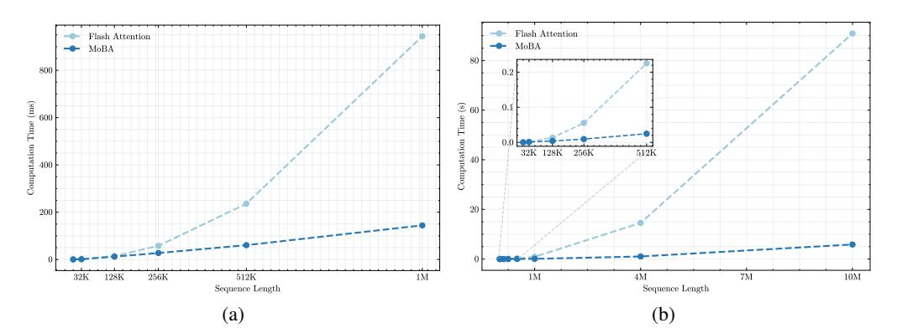
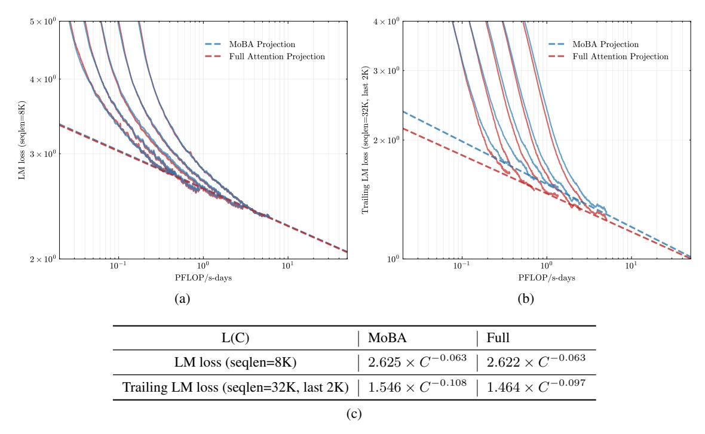
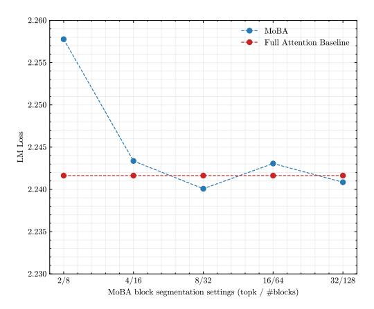
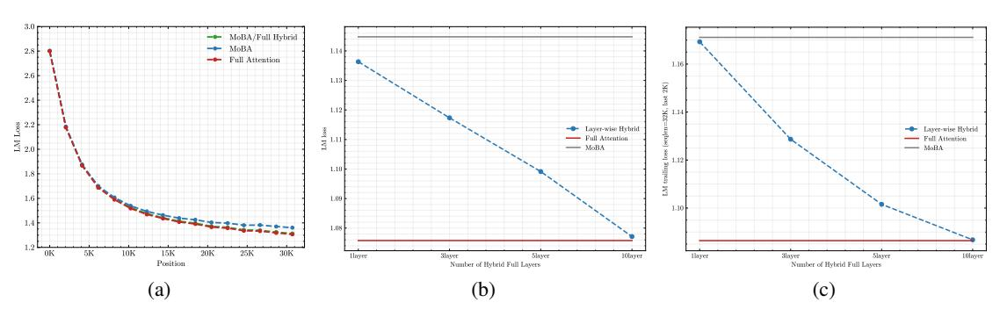
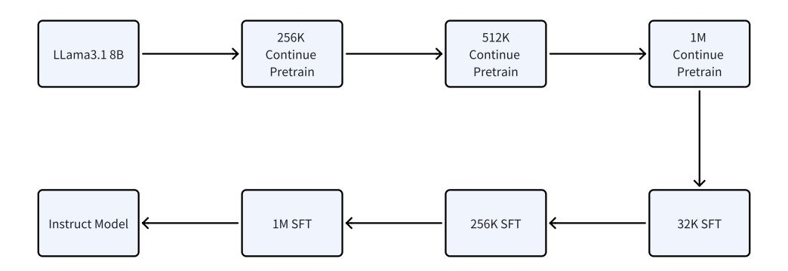
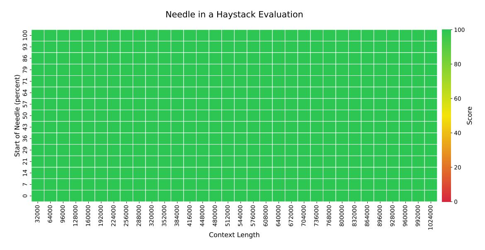

# Algorithm 1 MoBA (Mixture of Block Attention) Implementation

**Require:** Query, key and value matrices  $\mathbf{Q}, \mathbf{K}, \mathbf{V} \in \mathbb{R}^{N \times h \times d}$ ; MoBA hyperparameters (block size B and top-k); h and d denote the number of attention heads and head dimension. Also denote n = N/B to be the number of blocks.

- 1: // Split KV into blocks
- 2:  $\{\tilde{\mathbf{K}}_i, \tilde{\mathbf{V}}_i\} = \text{split\_blocks}(\mathbf{K}, \mathbf{V}, B)$ , where  $\tilde{\mathbf{K}}_i, \tilde{\mathbf{V}}_i \in \mathbb{R}^{B \times h \times d}, i \in [n]$
- 3: // Compute gating scores for dynamic block selection
- 4:  $\bar{\mathbf{K}} = \text{mean\_pool}(\mathbf{K}, B) \in \mathbb{R}^{n \times h \times d}$
- 5:  $\mathbf{S} = \mathbf{Q}\bar{\mathbf{K}}^{\top} \in \mathbb{R}^{N \times h \times n}$
- 6: // Select blocks with causal constraint (no attention to future blocks)
- 7:  $\mathbf{M} = \text{create\_causal\_mask}(N, n)$
- 8:  $\mathbf{G} = \operatorname{topk}(\mathbf{S} + \mathbf{M}, k)$
- 9: // Organize attention patterns for computation efficiency
- 10:  $\mathbf{Q}^s, \tilde{\mathbf{K}}^s, \tilde{\mathbf{V}}^s = \text{get\_self\_attn\_block}(\mathbf{Q}, \tilde{\mathbf{K}}, \tilde{\mathbf{V}})$
- 11:  $\mathbf{Q}^m, \tilde{\mathbf{K}}^m, \tilde{\mathbf{V}}^m = \text{index\_select\_moba\_attn\_block}(\mathbf{Q}, \tilde{\mathbf{K}}, \tilde{\mathbf{V}}, \mathbf{G})$
- 12: // Compute attentions seperately
- 13:  $\mathbf{O}^s = \text{flash\_attention\_varlen}(\mathbf{Q}^s, \tilde{\mathbf{K}}^s, \tilde{\mathbf{V}}^s, \text{causal=True})$
- 14:  $\mathbf{O}^m = \text{flash\_attention\_varlen}(\mathbf{Q}^m, \tilde{\mathbf{K}}^m, \tilde{\mathbf{V}}^m, \text{causal=False})$
- 15: // Combine results with online softmax
- 16:  $\mathbf{O} = \text{combine\_with\_online\_softmax}(\mathbf{O}^s, \mathbf{O}^m)$
- 17: return O

Figure 2: Efficiency of MoBA vs. full attention (implemented with Flash Attention). (a) 1M Model speedup evaluation: Computation time scaling of MoBA versus Flash Attention on 1M model with increasing sequence lengths (8K-1M). (b) Fixed Sparsity Ratio scaling: Computation time scaling comparison between MoBA and Flash Attention across increasing sequence lengths (8K-10M), maintaining a constant sparsity ratio of 95.31% (fixed 64 MoBA blocks with variance block size and fixed top-k=3).

- Re-arrange the attention outputs back to their original ordering.
- Combine the corresponding attention outputs using online Softmax (i.e., tiling), as a query token may attend to its current block and multiple historical KV blocks.

The algorithmic workflow is formalized in Algorithm 1 and visualized in Figure 1b, illustrating how MoBA can be implemented based on MoE and FlashAttention. First, the KV matrices are partitioned into blocks (Line 1-2). Next, the gating score is computed according to Equation 6, which measures the relevance between query tokens and KV blocks (Lines 3-7). A top-k operator is applied on the gating score (together with causal mask), resulting in a sparse query-to-KV-block mapping matrix G to represent the assignment of queries to KV blocks (Line 8). Then, query tokens are arranged based on the query-to-KV-block mapping, and block-wise attention outputs are computed (Line 9-12). Notably, attention to historical blocks (Line 11 and 14) and the current block attention (Line 10 and 13) are computed separately, as additional causality needs to be maintained in the current block attention. Finally, the attention outputs are rearranged back to their original ordering and combined with online softmax (Line 16) (Milakov et al. 2018; H. Liu et al. 2023).

| Model Param | Head | Layer | Hidden | Training Token | Block size | TopK |
|-------------|------|-------|--------|----------------|------------|------|
| 568M        | 14   | 14    | 1792   | 10.8B          | 512        | 3    |
| 822M        | 16   | 16    | 2048   | 15.3B          | 512        | 3    |
| 1.1B        | 18   | 18    | 2304   | 20.6B          | 512        | 3    |
| 1.5B        | 20   | 20    | 2560   | 27.4B          | 512        | 3    |
| 2.1B        | 22   | 22    | 2816   | 36.9B          | 512        | 3    |

Table 1: Configuration of Scaling Law Experiments

Figure 3: Scaling law comparison between MoBA and full attention. (a) LM loss on validation set (seqlen=8K); (b) trailing LM loss on validation set (seqlen=32K, last 1K tokens); (c) fitted scaling law curve.

### 3 Experiments

#### 3.1 Scaling Law Experiments and Ablation Studies

In this section, we conduct scaling law experiments and ablation studies to validate some key design choices of MoBA.

Scalability w.r.t. LM Loss. To assess the effectiveness of MoBA, we perform scaling law experiments by comparing the validation loss of language models trained using either full attention or MoBA. Following the Chinchilla scaling law (Hoffmann et al. 2022), we train five language models of varying sizes with a sufficient number of training tokens to ensure that each model achieves its training optimum. Detailed configurations of the scaling law experiments can be found in Table 1. Both MoBA and full attention models are trained with a sequence length of 8K. For MoBA models, we set the block size to 512 and select the top-3 blocks for attention, resulting in a sparse attention pattern with sparsity up to  $1 - \frac{512 \times 3}{8192} = 81.25\%^3$ . In particular, MoBA serves as an alternative to full attention, meaning that it does not introduce new parameters or remove existing ones. This design simplifies our comparison process, as the only difference across all experiments lies in the attention modules, while all other hyperparameters, including the learning rate and batch size, remain constant. As shown in Figure 3a, the validation loss curves for MoBA and full attention display very similar scaling trends. Specifically, the validation loss differences between these two attention mechanisms remain consistent within a range of 1e-3. This suggests that MoBA achieves scaling performance that is comparable to full attention, despite its sparse attention pattern with sparsity up to 75%.

&lt;sup>3Since we set top-k=3, thus each query token can attend to at most 2 history block and the current block.

**Long Context Scalability.** However, LM loss may be skewed by the data length distribution (An et al. 2024), which is typically dominated by short sequences. To fully assess the long-context capability of MoBA, we assess the **LM loss of trailing tokens (trailing LM loss, in short)**, which computes the LM loss of the last few tokens in the sequence. We count this loss only for sequences that reach the maximum sequence length to avoid biases that may arise from very short sequences. A detailed discussion on trailing tokens scaling can be found in the Appendix A.1

These metrics provide insights into the model's ability to generate the final portion of a sequence, which can be particularly informative for tasks involving long context understanding. Therefore, we adopt a modified experimental setting by increasing the maximum sequence length from 8k to 32k. This adjustment leads to an even sparser attention pattern for MoBA, achieving a sparsity level of up to  $1 - \frac{512 \times 3}{32768} = 95.31\%$ . As shown in Figure 3b, although MoBA exhibits a marginally higher last block LM loss compared to full attention in all five experiments, the loss gap is progressively narrowing. This experiment implies the long-context scalability of MoBA.

Ablation Study on Fine-Grained Block Segmentation. We further ablate the block granularity of MoBA. We carry out a series of experiments using a 1.5B parameter model with a 32K context length. The hyperparameters of block size and top-k are adjusted to maintain a consistent level of attention sparsity. Specifically, we divide the 32K context into 8, 16, 32, 64, and 128 blocks, and correspondingly select 2, 4, 8, 16, and 32 blocks, ensuring an attention sparsity of 75% across these configurations. As shown in Figure 4, MoBA's performance is significantly affected by block granularity. Specifically, there is a performance difference of 1e-2 between the coarsest-grained setting (selecting 2 blocks from 8) and the settings with finer granularity. These findings suggest that fine-grained segmentation appears to be a general technique for enhancing the performance of models within the MoE family, including MoBA.

Figure 4: Fine-Grained Block Segmentation. The LM loss on validation set v.s. MoBA with different block granularity.

### 3.2 Hybrid of MoBA and Full Attention

As discussed in Section 2, we design MoBA to be a flexible substitute for full attention, so that it can easily switch from/to full attention with minimal overhead and achieve comparable long-context performance. In this section, we first show seamless transition between full attention and MoBA can be a solution for efficient long-context pre-training. Then we discuss the layer-wise hybrid strategy, mainly for the performance of supervised fine-tuning (SFT).

**MoBA/Full Hybrid Training.** We train three models, each with 1.5B parameters, on 30B tokens with a context length of 32K tokens. For the hyperparameters of MoBA, the block size is set to 2048, and the top-k parameter is set to 3. The detailed training recipes are as follows:

- MoBA/full hybrid: This model is trained using a two-stage recipe. In the first stage, MoBA is used to train on 90% of the tokens. In the second stage, the model switches to full attention for the remaining 10% of the tokens.
- Full attention: This model is trained using full attention throughout the entire training.
- MoBA: This model is trained exclusively using MoBA.

We evaluate their long-context performance via position-wise language model (LM) loss, which is a fine-grained metric to evaluate lm loss at each position within a sequence. Unlike the vanilla LM loss, which is computed by averaging the LM loss across all positions, the position-wise LM loss breaks down the loss for each position separately. Similar metrics have been suggested by previous studies (Xiong et al. 2023; Reid et al. 2024), who noticed that

Figure 5: Hybrid of MoBA and full attention. (a) position-wise LM loss for MoBA, full attention, and MoBA/full hybrid training; (b) SFT LM loss w.r.t the number of full attention layers in layer-wise hybrid; (c) SFT trailing LM loss (seqlen=32K, last 2K) w.r.t the number of full attention layers in layer-wise hybrid.

Figure 6: The continual pre-training and SFT recipes.

position-wise LM loss follows a power-law trend relative to context length. As shown in Figure 5a, the MoBA-only recipe results in higher position-wise losses for trailing tokens. Importantly, our MoBA/full hybrid recipe reaches a loss nearly identical to that of full attention. This result highlights the effectiveness of the MoBA/full hybrid training recipe in balancing training efficiency with model performance. More interestingly, we have not observed significant loss spikes during the switch between MoBA and full attention, again demonstrating the flexibility and robustness of MoBA.

**Layer-wise Hybrid.** This flexibility of MoBA encourages us to delve into a more sophisticated strategy — the layer-wise hybrid of MoBA and full attention. We investigate this strategy with a particular focus on its application during the supervised fine-tuning (SFT). The motivation for investigating this strategy stems from our observation that MoBA sometimes results in suboptimal performance during SFT, as shown in Figure 5b. We speculate that this may be attributed to the loss masking employed in SFT — prompt tokens are typically excluded from the loss calculation during SFT, which can pose a sparse gradient challenge for sparse attention methods like MoBA. Because it may hinder the backpropagation of gradients, which are initially calculated from unmasked tokens, throughout the entire context. To address this issue, we propose a hybrid approach — switching the last several Transformer layers from MoBA to full attention, while the remaining layers continue to employ MoBA. As shown in Figure 5b and Figure 5c, this strategy can significantly reduce SFT loss.

### 3.3 Large Language Modeling Evaluation

We conduct a thorough assessment of MoBA across a variety of real-world downstream tasks, evaluating its performance in comparison to full attention models. For ease of verification, our experiments begin with the Llama 3.1 8B Base Model, which is used as the starting point for long-context pre-training. This model, termed Llama-8B-1M-MoBA, is initially trained with a context length of 128K tokens, and we gradually increase the context length to 256K, 512K, and 1M tokens during the continual pre-training. To ease this transition, we use position interpolation method (S. Chen et al. 2023) at the start of the 256K continual pre-training stage. This technique enables us to extend

| Benchmark                         | Llama-8B-1M-MoBA | Llama-8B-1M-Full |
|-----------------------------------|------------------|------------------|
| AGIEval [0-shot]                  | 0.5144           | 0.5146           |
| BBH [3-shot]                      | 0.6573           | 0.6589           |
| CEval [5-shot]                    | 0.6273           | 0.6165           |
| GSM8K [5-shot]                    | 0.7278           | 0.7142           |
| HellaSWAG [0-shot]                | 0.8262           | 0.8279           |
| Loogle [0-shot]                   | 0.4209           | 0.4016           |
| Competition Math [0-shot]         | 0.4254           | 0.4324           |
| MBPP [3-shot]                     | 0.5380           | 0.5320           |
| MBPP Sanitized [0-shot]           | 0.6926           | 0.6615           |
| MMLU [0-shot]                     | 0.4903           | 0.4904           |
| MMLU Pro [5-shot][CoT]            | 0.4295           | 0.4328           |
| OpenAI HumanEval [0-shot][pass@1] | 0.6951           | 0.7012           |
| SimpleQA [0-shot]                 | 0.0465           | 0.0492           |
| TriviaQA [0-shot]                 | 0.5673           | 0.5667           |
| LongBench @32K [0-shot]           | 0.4828           | 0.4821           |
| RULER @128K [0-shot]              | 0.7818           | 0.7849           |

Table 2: Performance comparison between MoBA and full Attention across different evaluation benchmarks.

Figure 7: Performance of LLama-8B-1M-MoBA on the Needle in the Haystack benchmark (upto 1M context length).

the effective context length from 128K tokens to 1M tokens. After completing the 1M continuous pre-training, MoBA is activated for 100B tokens. We set the block size to 4096 and the top-K parameter to 12, leading to an attention sparsity of up to  $1 - \frac{4096 \times 12}{1M} = 95.31\%$ . To preserve some full attention capabilities, we adopt the layer-wise hybrid strategy — the last three layers remain as full attention, while the other 29 full attention layers are switched to MoBA. For supervised fine-tuning, we follow a similar strategy that gradually increases the context length from 32K to 1M. The baseline full attention models (termed Llama-8B-1M-Full) also follow a similar training strategy as shown in Figure 6, with the only difference being the use of full attention throughout the process. This approach allows us to directly compare the performance of MoBA with that of full attention models under equivalent training conditions.

The evaluation is performed on several widely used long-context benchmarks. In particular, across all evaluation tasks, MoBA is used for prefill only, while we switch to full attention during generation for better performance. As shown in Table 2, Llama-8B-1M-MoBA exhibits a performance that is highly comparable to that of Llama-8B-1M-Full. It is particularly noteworthy that in the longest benchmark, RULER, where MoBA operates at a sparsity level of up to  $1-\frac{4096\times12}{128K}=62.5\%$ , Llama-8B-1M-MoBA nearly matches the performance of Llama-8B-1M-Full, with a score of 0.7818 compared to 0.7849. For context lengths of up to 1M tokens, we evaluate the model using the traditional Needle in the Haystack benchmark. As shown in Figure 7, Llama-8B-1M-MoBA demonstrates satisfactory performance even with an extended context length of 1 million tokens.

